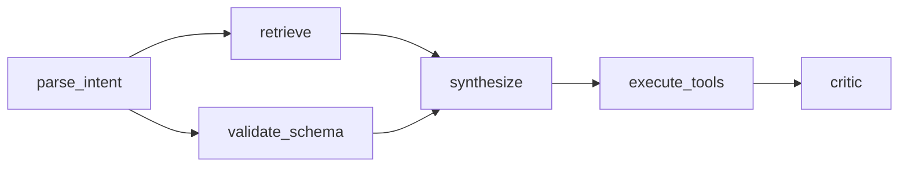
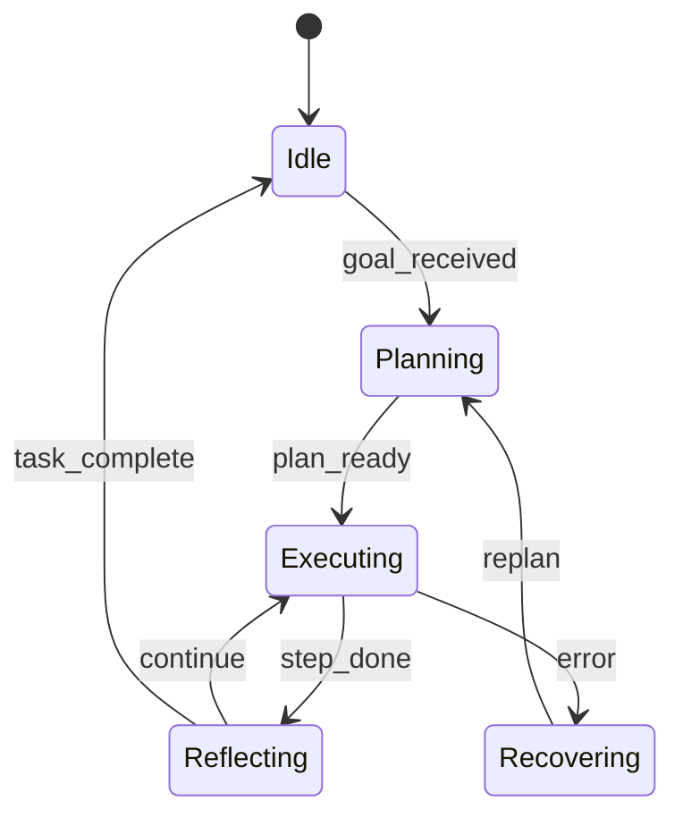
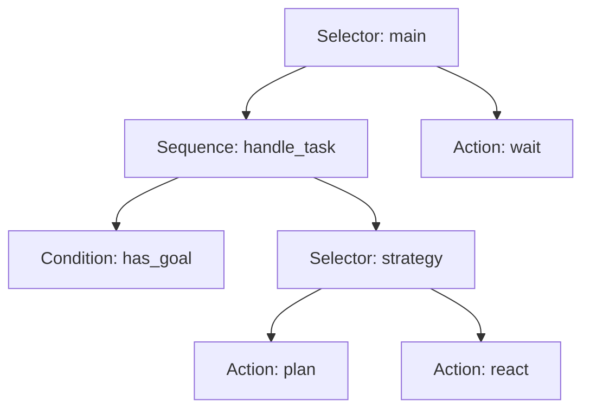

Логику ИИ-агента можно описать по-разному: как **направленный ациклический граф** (DAG) шагов, как **конечный автомат** (FSM) с явными режимами или как **дерево поведения** (Behavior Tree, BT) с композиционными узлами. На практике редко выбирают «один навсегда» — чаще нужен **гибридный оркестратор**, который держит одно из представлений активным, переключается между ними и показывает структуру в виде графа для отладки.

[](https://colab.research.google.com/github/evgeniy-borisov/vairl/blob/main/notebooks/hybrid-agent-dag-fsm-bt.ipynb)

Базовый ноутбук с минимальными реализациями, визуализацией и примерами конвертации: [hybrid-agent-dag-fsm-bt.ipynb](https://colab.research.google.com/github/evgeniy-borisov/vairl/blob/main/notebooks/hybrid-agent-dag-fsm-bt.ipynb).

## Зачем три представления?

| Подход | Сильная сторона | Типичный контекст |
|--------|-----------------|-------------------|
| **DAG** | Явные зависимости, параллельные ветки, идемпотентные пайплайны | ETL, LangGraph, CI/CD, batch-оркестрация |
| **FSM** | Чёткие режимы, события, guard-условия | Диалоги, робототехника, протоколы, UI-состояния |
| **Behavior Tree** | Иерархия, переоценка каждый тик, композиция политик | Игровой ИИ, runtime-агенты, reactive control |

Каждая модель — это **граф** (или дерево) с семантикой исполнения. Различие не в «красоте диаграммы», а в том, **как часто пересчитывается структура**, **есть ли циклы** и **кто владеет состоянием**.

## DAG — workflow без циклов

DAG задаёт частичный порядок задач: узел стартует, когда готовы все предшественники. Параллельные ветки — естественны; циклы **запрещены** (перепланирование выносится наружу, в отдельный контур).



**Плюсы:** детерминированный topological sort, простой audit trail, удобная интеграция с планировщиками и очередями.

**Минусы:** слабая реактивность «на каждом тике»; для долгоживущих агентов цикл observe→act обычно моделируют **вне** DAG (supervisor FSM или внешний event loop).

## FSM — режимы и переходы

Конечный автомат хранит **текущее состояние** и реагирует на **события** с guard-условиями. Граф переходов может содержать циклы — это нормально для долгоживущих сессий.



**Плюсы:** явная модель «где мы сейчас», проще compliance и логирование, хорошо стыкуется с event-driven архитектурой.

**Минусы:** взрыв числа состояний при комбinatorics; иерархические FSM (HFSM) и history-псевдосостояния усложняют визуализацию.

## Behavior Tree — иерархия и тики

BT переоценивает дерево **каждый тик** (каждый цикл control loop). Композитные узлы — Sequence, Selector, Parallel — задают политику обхода; листья — Condition и Action.



**Плюсы:** модульность, hot-swap поддеревьев, естественная реактивность без явной таблицы переходов.

**Минусы:** семантика «каждый тик с нуля» может быть избыточной для batch-pipeline; отладка требует трассировки tick-by-tick.

## Гибридный агент: один режим или композиция

Гибридный оркестратор не обязан «склеивать» все три модели в одну кашу. Практичная схема:

```
                    ┌─────────────────┐
                    │  Meta-controller │  ← FSM или BT-Selector
                    │  (режим работы)  │
                    └────────┬────────┘
           ┌─────────────────┼─────────────────┐
           ▼                 ▼                 ▼
      ┌─────────┐      ┌──────────┐     ┌─────────────┐
      │   DAG   │      │   FSM    │     │ Behavior    │
      │ pipeline│      │ session  │     │ Tree runtime│
      └─────────┘      └──────────┘     └─────────────┘
```

**Типичные паттерны:**

1. **FSM снаружи, BT/DAG внутри** — автомат переключает фазы (`planning` / `executing` / `recovery`); внутри фазы активен BT или линейный DAG шагов.
2. **DAG для batch, BT для online** — офлайн-обработка документов идёт по DAG; интерактивный ассистент — по BT с теми же листовыми Action.
3. **Единый реестр узлов** — `Action`/`Condition` описаны один раз; экспортёры собирают из них FSM, DAG или BT для разных сред (simulation, prod, debug view).

Meta-controller может быть простым словарём `{mode: executor}` или BT-Selector, который выбирает подорchestrator по предикату контекста.

## Визуализация как графов

Для отладки полезно иметь **единый слой отрисовки**:

- **DAG** — layered layout (уровни по topological rank)
- **FSM** — state diagram (circles + labeled edges)
- **BT** — top-down tree (композиты — прямоугольники, листья — эллипсы)

В ноутбуке все три рисуются через NetworkX + Matplotlib из одной структуры `GraphSpec(nodes, edges, layout)`. Это позволяет:

- сравнивать «одну и ту же задачу» в трёх нотациях;
- подсвечивать активный узел/состояние во время трассировки;
- экспортировать PNG/SVG для документации.

## Конвертация: где возможна, где нет

Полная биекция между моделями **не существует** — у каждой своя семантика. Но в **ограниченных классах** конвертация осмысленна:

| Направление | Когда работает | Ограничение |
|-------------|----------------|-------------|
| **Линейный DAG → BT** | Цепочка `A→B→C→…` без параллелизма | Sequence из Action-листьев |
| **DAG с fork-join → BT** | Параллельные ветки с общим join | Нужен узел Parallel + Sequence на join |
| **Ацикличный FSM → DAG** | Нет циклов, конечный горизонт | Каждый путь — отдельная ветка DAG |
| **Плоский FSM → BT** | Мало состояний, без hierarchy | Selector с Condition «state==X» на ветку |
| **BT (без декораторов) → FSM** | Фиксированное дерево, один успешный путь за тик | Теряется tick-reactive семантика |
| **FSM ↔ DAG в workflow-движках** | Состояния = узлы, переходы = рёбра | Циклы в FSM ломают ацикличность DAG |

**Правило большого пальца:** конвертируйте **структуру** (топологию), но проверяйте **семантику исполнения** отдельными тестами. BT→FSM «в лоб» часто даёт автомат, который не эквивалентен исходному дереву при повторных тиках.

### Пример: линейный pipeline

DAG `retrieve → plan → execute → critic` однозначно становится BT:

```
Sequence
├── Action(retrieve)
├── Action(plan)
├── Action(execute)
└── Action(critic)
```

Обратная конвертация BT→DAG возможна только если дерево **не содержит Selector с альтернативами** — иначе это уже ветвление, а не один workflow.

### Пример: session FSM внутри DAG-узла

Узел DAG `run_session` внутри запускает FSM диалога; при `task_complete` FSM возвращает управление DAG, который переходит к `finalize`. Здесь не конвертация, а **вложенность исполнителей** — самый устойчивый гибридный паттерн.

## Связь с другими публикациями VAIRL

- [Эволюция агентов и Behavior Tree](/vairl/blog/2026/06/22/agent-evolution-behavior-tree/) — нарратив нарастания способностей поверх BT.
- [Нейросимволическое планирование](/vairl/blog/2026/06/25/neurosymbolic-planning-pipeline/) — символьный план как DAG/Sequence поверх LLM.
- [Синтез гипотез для агентов](/vairl/blog/2026/06/26/llm-hypothesis-synthesis-agents/) — эксперименты с политиками оркестрации как осью качества.

## Попробовать

Откройте ноутбук в Colab и пройдите ячейки сверху вниз — установка зависимостей, три минимальных исполнителя, визуализация и функции конвертации для ограниченных случаев:

**[hybrid-agent-dag-fsm-bt.ipynb](https://colab.research.google.com/github/evgeniy-borisov/vairl/blob/main/notebooks/hybrid-agent-dag-fsm-bt.ipynb)**

Исходники — в репозитории VAIRL, папка `notebooks/`.
