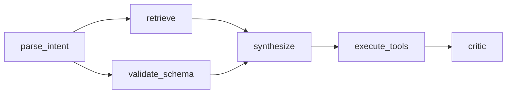
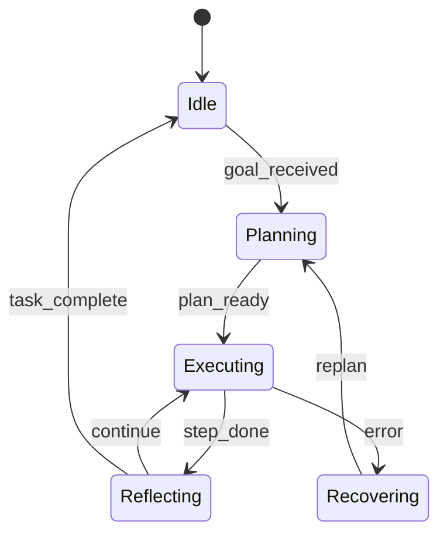
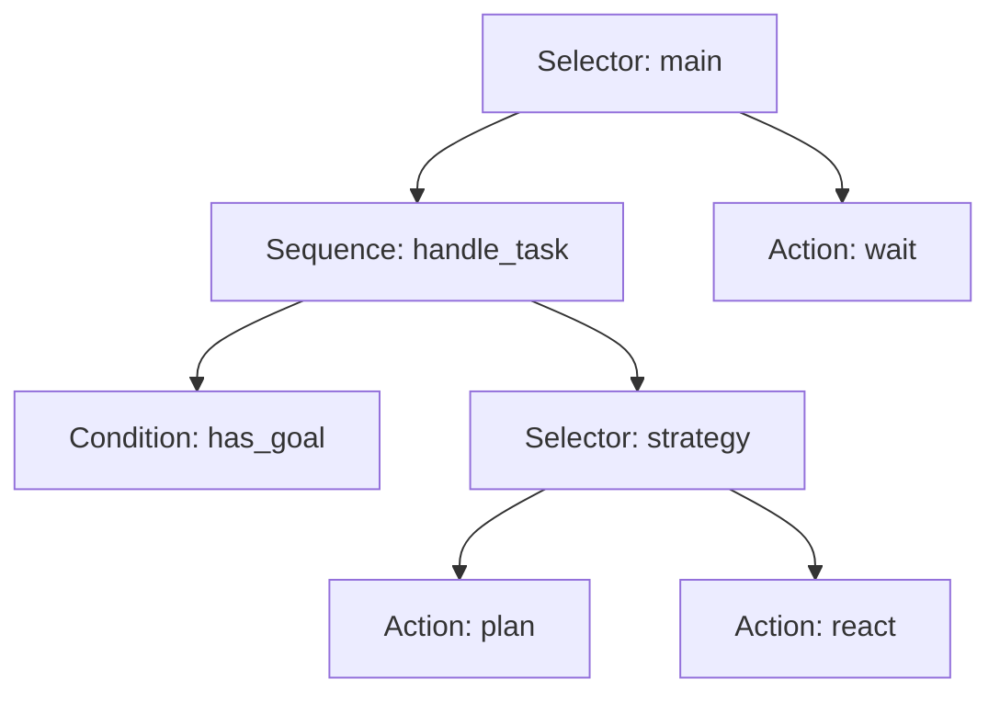

Agent logic can be described in several ways: as a **directed acyclic graph** (DAG) of steps, as a **finite state machine** (FSM) with explicit modes, or as a **behavior tree** (BT) with compositional nodes. In practice you rarely pick one forever — a **hybrid orchestrator** that keeps one representation active, switches between them, and renders structure as a graph for debugging is often the right shape.

[](https://colab.research.google.com/github/evgeniy-borisov/vairl/blob/main/notebooks/hybrid-agent-dag-fsm-bt.ipynb)

The companion notebook with minimal implementations, visualization, and conversion examples: [hybrid-agent-dag-fsm-bt.ipynb](https://colab.research.google.com/github/evgeniy-borisov/vairl/blob/main/notebooks/hybrid-agent-dag-fsm-bt.ipynb).

## Why three representations?

| Approach | Strength | Typical context |
|----------|----------|-----------------|
| **DAG** | Explicit dependencies, parallel branches, idempotent pipelines | ETL, LangGraph, CI/CD, batch orchestration |
| **FSM** | Clear modes, events, guard conditions | Dialogues, robotics, protocols, UI state |
| **Behavior Tree** | Hierarchy, per-tick re-evaluation, policy composition | Game AI, runtime agents, reactive control |

Each model is a **graph** (or tree) with execution semantics. The difference is not diagram aesthetics but **how often structure is re-evaluated**, **whether cycles exist**, and **who owns state**.

## DAG — acyclic workflow

A DAG defines a partial order over tasks: a node starts when all predecessors finish. Parallel branches are natural; cycles are **forbidden** (re-planning lives outside the DAG in a separate loop).



**Pros:** deterministic topological sort, simple audit trail, easy integration with schedulers and queues.

**Cons:** weak per-tick reactivity; long-lived agents usually model the observe→act loop **outside** the DAG (supervisor FSM or external event loop).

## FSM — modes and transitions

A finite state machine holds **current state** and reacts to **events** with guard conditions. The transition graph may contain cycles — normal for long sessions.



**Pros:** explicit “where we are now”, easier compliance and logging, fits event-driven architecture.

**Cons:** state explosion under combinatorics; hierarchical FSMs and history pseudostates complicate visualization.

## Behavior Tree — hierarchy and ticks

A BT re-evaluates the tree **every tick** (every control-loop cycle). Composite nodes — Sequence, Selector, Parallel — define traversal policy; leaves are Condition and Action.



**Pros:** modularity, hot-swappable subtrees, natural reactivity without an explicit transition table.

**Cons:** “re-evaluate from scratch each tick” can be overkill for batch pipelines; debugging needs tick-by-tick traces.

## Hybrid agent: single mode or composition

A hybrid orchestrator does not have to merge all three models into one soup. A practical layout:

```
                    ┌─────────────────┐
                    │  Meta-controller │  ← FSM or BT-Selector
                    │  (operating mode)│
                    └────────┬────────┘
           ┌─────────────────┼─────────────────┐
           ▼                 ▼                 ▼
      ┌─────────┐      ┌──────────┐     ┌─────────────┐
      │   DAG   │      │   FSM    │     │ Behavior    │
      │ pipeline│      │ session  │     │ Tree runtime│
      └─────────┘      └──────────┘     └─────────────┘
```

**Common patterns:**

1. **FSM outside, BT/DAG inside** — the automaton switches phases (`planning` / `executing` / `recovery`); inside each phase a BT or linear DAG runs.
2. **DAG for batch, BT for online** — offline document processing follows a DAG; the interactive assistant uses a BT with the same leaf Actions.
3. **Shared node registry** — Actions and Conditions defined once; exporters build FSM, DAG, or BT views for simulation, production, and debug.

The meta-controller can be a simple `{mode: executor}` map or a BT-Selector that picks a sub-orchestrator from context predicates.

## Visualization as graphs

For debugging, a **unified drawing layer** helps:

- **DAG** — layered layout (levels by topological rank)
- **FSM** — state diagram (circles + labeled edges)
- **BT** — top-down tree (composites as rectangles, leaves as ellipses)

The notebook renders all three via NetworkX + Matplotlib from one `GraphSpec(nodes, edges, layout)` structure so you can:

- compare the same task in three notations;
- highlight the active node/state during tracing;
- export PNG/SVG for documentation.

## Conversion: what works and what does not

Full bijection between models **does not exist** — each has its own semantics. In **restricted classes**, conversion is meaningful:

| Direction | When it works | Limitation |
|-----------|---------------|------------|
| **Linear DAG → BT** | Chain `A→B→C→…` without parallelism | Sequence of Action leaves |
| **Fork-join DAG → BT** | Parallel branches with common join | Needs Parallel node + Sequence at join |
| **Acyclic FSM → DAG** | No cycles, finite horizon | Each path becomes a DAG branch |
| **Flat FSM → BT** | Few states, no hierarchy | Selector with Condition `state==X` per branch |
| **BT (no decorators) → FSM** | Fixed tree, one successful path per tick | Loses tick-reactive semantics |
| **FSM ↔ DAG in workflow engines** | States = nodes, transitions = edges | FSM cycles break DAG acyclicity |

**Rule of thumb:** convert **structure** (topology), but validate **execution semantics** with separate tests. Naive BT→FSM often yields an automaton that is not equivalent to the original tree on repeated ticks.

### Example: linear pipeline

DAG `retrieve → plan → execute → critic` maps cleanly to BT:

```
Sequence
├── Action(retrieve)
├── Action(plan)
├── Action(execute)
└── Action(critic)
```

Reverse BT→DAG conversion works only when the tree **has no Selector alternatives** — otherwise you already have branching, not a single workflow.

### Example: session FSM inside a DAG node

DAG node `run_session` runs a dialogue FSM; on `task_complete` control returns to the DAG, which moves to `finalize`. This is **nested executors**, not conversion — the most robust hybrid pattern.

## Related VAIRL posts

- [Agent evolution and Behavior Trees](/vairl/blog/2026/06/22/agent-evolution-behavior-tree/) — capability growth narrative on top of BT.
- [Neurosymbolic planning pipeline](/vairl/blog/2026/06/25/neurosymbolic-planning-pipeline/) — symbolic plan as DAG/Sequence over LLM.
- [Hypothesis synthesis for agents](/vairl/blog/2026/06/26/llm-hypothesis-synthesis-agents/) — orchestration policies as a quality axis for experiments.

## Try it

Open the notebook in Colab and run cells top to bottom — dependencies, three minimal executors, visualization, and conversion helpers for restricted cases:

**[hybrid-agent-dag-fsm-bt.ipynb](https://colab.research.google.com/github/evgeniy-borisov/vairl/blob/main/notebooks/hybrid-agent-dag-fsm-bt.ipynb)**

Sources live in the VAIRL repo under `notebooks/`.
