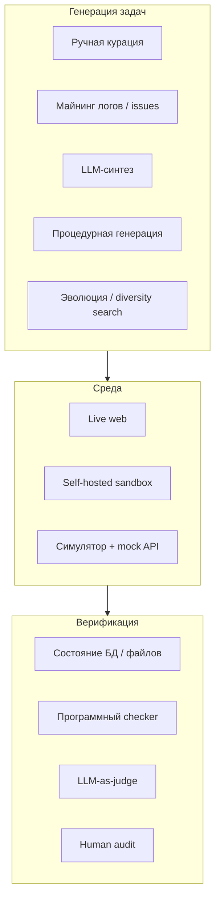
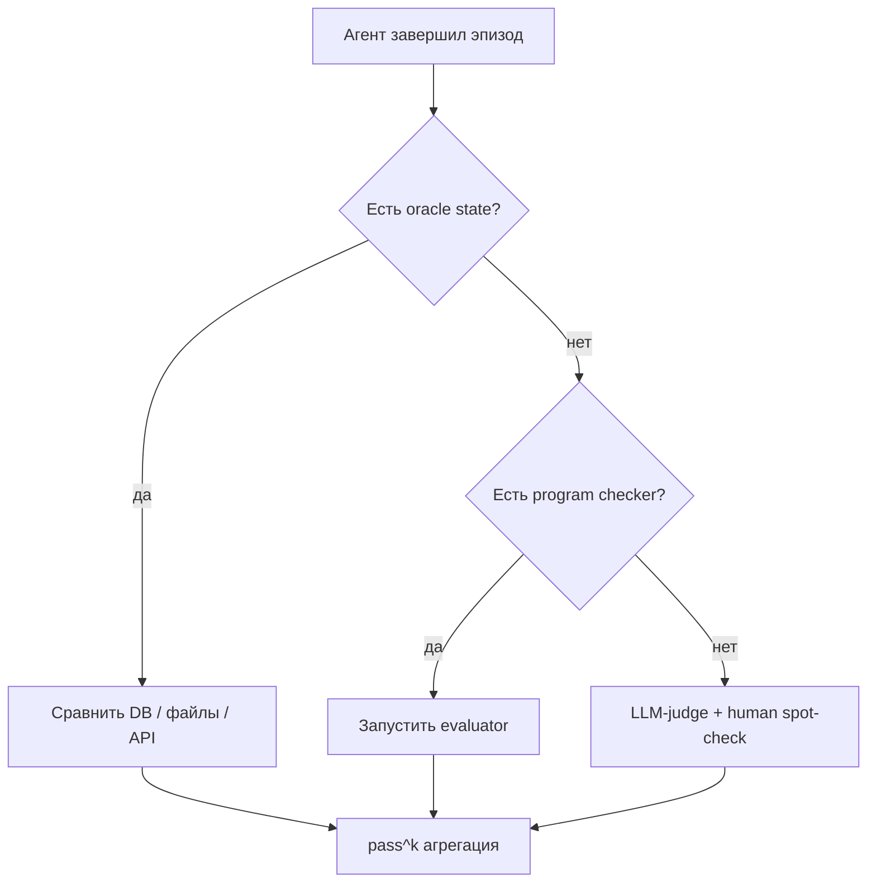

Статические бенчмарки вроде MMLU измеряют **ответ в один ход**. Современные AI-агенты — другое: они **вызывают tools**, меняют состояние БД, кликают по GUI, ведут многоходовый диалог с пользователем и восстанавливаются после ошибок. Нужны бенчмарки, где успех — это **верифицируемый исход действий**, а не совпадение текста с эталоном.

Ниже — обзор **текущего положения дел**, семейств eval-наборов для action-агентов и **подходов к генерации** новых бенчмарков — включая использование других LLM, симуляторов и гибридные пайплайны. Связанные темы в блоге VAIRL: [карта компетенций агент-разработчика](/vairl/blog/2026/06/29/best-ai-agent-specialist-ru/), [устойчивость control loops](/vairl/blog/2026/06/29/agent-control-loop-stability-ru/), [синтез гипотез для улучшения агентов](/vairl/blog/2026/06/26/llm-hypothesis-synthesis-agents-ru/).

## Почему бенчмарк агента — не «набор вопросов»

| Статический QA-бенчмарк | Бенчмарк action-агента |
|-------------------------|-------------------------|
| Один prompt → один ответ | Многошаговая траектория |
| Метрика: exact match / LLM-judge | Метрика: **состояние среды** (DB, файлы, API) |
| Нет side effects | Side effects обязательны |
| Низкая стоимость прогона | Sandbox, Docker, VM, долгий runtime |
| Риск contamination из обучения | Риск **reward hacking** и утечки тестов |

Агентный eval отвечает на три вопроса:

1. **Достигнута ли цель?** (task success)
2. **Насколько надёжно?** (pass^k — успех в k независимых прогонах)
3. **С какой ценой?** (шаги, токены, время, число tool calls)


---

## Текущий ландшафт: агенты, которые действуют

Обзор ключевых семейств (2024–2026). SOTA на action-бенчмарках **существенно ниже**, чем на knowledge-QA — это нормально и ожидаемо.

### Код и репозитории

| Бенчмарк | Что измеряет | Верификация | Генерация задач |
|----------|--------------|-------------|-----------------|
| **SWE-bench** / **Verified** | Патч по GitHub issue | Unit-тесты репозитория | **Майнинг** реальных issues + human filter |
| **SWE-bench Pro** / **Multimodal** | Расширения домена | Тесты + окружение | Курация + синтетика |

Золотой стандарт «реальный мир»: задача из продакшена, проверка объективна. Минус — дорогая курация и дрейф репозиториев.

### Web и GUI

| Бенчмарк | Среда | Особенность |
|----------|-------|-------------|
| **WebArena** | 5 self-hosted web-приложений | Долгие multi-step сценарии; evaluators на ответе и действиях |
| **WebArena-Verified** | Аудит 812 задач | Детерминированная проверка, offline по HAR; subset **Hard** |
| **Mind2Web** | Реальные сайты (снимки) | Курация человеческих траекторий |
| **OSWorld** | Desktop VM (Ubuntu/Win/macOS) | Реальные приложения; высокая стоимость среды |
| **Windows Agent Arena** / **AndroidWorld** | Платформенные GUI | Фрагментация ОС и UI |

Тренд: от «живого веба» к **воспроизводимым** sandbox + **программным** evaluators (меньше LLM-as-judge).

### Tool + user + policy

| Бенчмарк | Суть | Метрики |
|----------|------|---------|
| **τ-bench** → **τ²** → **τ³** | Агент + **симулированный пользователь** + API + policy docs | Сравнение **состояния БД**; pass^k |
| Расширения (Toloka и др.) | Adversarial prompts, длинные цепочки policy | Auto-evaluable tasks |

Отличие от SWE-bench: не код, а **customer service** — диалог, политики, отказ от действия там, где нельзя.

### Мульти-доменные сьюты

| Бенчмарк | Домены |
|----------|--------|
| **AgentBench** | OS shell, DB, KG, игры, web shopping, browsing |
| **GAIA** | Многошаговые вопросы с tools (поиск, файлы) |
| **AgentSynth** | Генерация + **packs** с outcome checkers; leaderboard, pass^k |
| **Terminal-Bench** | Shell-агенты в контейнере |

**AgentBench** задал шаблон «много сред в одном сьюте»; **AgentSynth** явно позиционирует **генерацию** задач как продукт.

### Планирование и ограничения

**TravelPlanner**, **API-Bank**, **ToolBench** — узкие домены с rule-based или state-based проверкой. Полезны как **строительные блоки** для синтетических генераторов (схема API + constraints).

---

## Оси классификации подходов к генерации

Удобная рамка (по мотивам обзоров 2025 — task generation / execution / assessment):



---

## 1. Ручная курация экспертами

**Как:** доменный эксперт пишет задачу, эталонную траекторию, expected state, edge cases.

**Плюсы:** высокое качество, мало ложных pass/fail, доверие индустрии (SWE-bench Verified, WebArena-Verified).

**Минусы:** медленно, дорого, плохо масштабируется, устаревание (API, UI).

**Когда выбирать:** регуляторика, high-stakes домены, эталонный «gold set» на 50–200 задач.

---

## 2. Майнинг реальных траекторий

**Как:** GitHub issues → SWE-bench; support tickets → τ-подобные сценарии; логи браузера → Mind2Web; trajectories продакшен-агентов → фильтрация и анонимизация.

**Плюсы:** реализм, естественное распределение сложности.

**Минусы:** шум, PII, неполные логи, сложная верификация без воспроизводимой среды.

**Пайплайн:**

```
Реальный лог → дедупликация → восстановление среды → автоматический checker → human spot-check
```

---

## 3. Генерация задач с помощью LLM

Самый быстро растущий класс. Большая модель выступает как **автор задач**, **пользователя**, **критика** или **судьи**.

### 3.1 LLM как автор задач (task synthesis)

**Вход:** схема API, policy document, описание БД, grammar действий.  
**Выход:** (instruction, expected_actions, success_predicate).

Примеры паттернов:

- **Schema-first:** «Сгенерируй 100 задач, совместимых с OpenAPI X; каждая достижима за ≤ 12 tool calls»
- **Constraint sampling:** TravelPlanner-style — SQL/DSL выбирает параметры, LLM оформляет natural language
- **AgentSynth-style:** generate → judge loop по 6 измерениям → pack с outcome checkers

**Риски:** невыполнимые задачи, ambiguous instructions, «галлюцинированные» предусловия.  
**Смягчение:** oracle-агент или symbolic planner проверяет достижимость; второй LLM как **validator**; отбраковка по dry-run в симуляторе.

### 3.2 LLM как симулятор пользователя

**τ-bench / τ² / τ³:** user-LLM ведёт диалог по сценарию; агент вызывает tools; успех — **финальное состояние БД**, не текст.

При **генерации** бенчмарка тот же приём: LLM играет и пользователя, и «злого» клиента для adversarial веток.

### 3.3 LLM-as-judge (фильтрация и оценка)

Используется для:

- ранжирования синтетических задач по сложности/реализму;
- проверки соответствия policy;
- **не** как единственный финальный scorer там, где есть state check (WebArena-Verified сознательно уходит от judge к детерминизму).

| Роль LLM-judge | OK | Опасно |
|----------------|-----|--------|
| Prefilter кандидатов | ✓ | — |
| Субъективный стиль ответа | ✓ | bias между моделями |
| Единственный критерий success | — | ✗ reward hacking |

### 3.4 Multi-LLM панель

Разные модели: одна генерирует, вторая ломает (adversarial), третья верифицирует. Аналог [dialectical / coach-player](/vairl/blog/2026/06/25/g3-dialectical-autocoding-ru/) для **данных**, а не кода.

---

## 4. Процедурная и символическая генерация

**Как:** грамматики задач, HTN/PDDL-шаблоны, random walk по графу API, procedural worlds (игры, VMAS).

**Плюсы:** бесконечный поток задач, контроль сложности, нет API-cost на генерацию.

**Минусы:** «синтетический запах», разрыв с natural language пользователей.

**Гибрид (нейросимволика):** LLM переводит цель в символы → планировщик генерирует валидную цепочку → LLM вербализует instruction для агента. См. [LLM → PDDL → критик](/vairl/blog/2026/06/25/neurosymbolic-planning-pipeline/).

---

## 5. Эволюция, diversity search, hypothesis space

Генерировать не случайно, а **искать** в пространстве задач:

- мутировать сценарии (усложнить policy, добавить конфликт constraints);
- отбирать по **diversity** в embedding space сценариев;
- наращивать «белые пятна», где агент стабильно падает.

Связь с [пространством гипотез и PaCMAP](/vairl/blog/2026/06/24/hypothesis-space-pacmap/) и [синтезом гипотез локальной LLM](/vairl/blog/2026/06/26/llm-hypothesis-synthesis-agents-ru/): бенчмарк — не статический файл, а **пополняемый корпус** кандидатов с верификацией.

---

## 6. Верификация: без неё генерация бессмысленна

Приоритет методов (от сильного к слабому):

1. **Детерминированное состояние** — snapshot DB, diff файлов, hash артефакта
2. **Программный evaluator** — как WebArena reference programs
3. **Replay** — HAR / network trace без live-среды
4. **Unit / integration tests** — SWE-bench
5. **pass^k** — надёжность при повторе (τ-bench)
6. **LLM-as-judge** — только если нет state
7. **Human audit** — выборочно на gold subset



---

## 7. Типовой пайплайн генерации бенчмарка

Практическая схема для команды, которая строит **свой** eval:

| Этап | Действие |
|------|----------|
| **1. Контракт среды** | API schema, policy, начальное состояние, reset() |
| **2. Генерация кандидатов** | LLM / procedural / майнинг — batch 10× больше целевого N |
| **3. Oracle pass** | Сильный агент или scripted oracle; отбросить невыполнимые |
| **4. Dry-run verifier** | Каждый task должен fail на null-агенте и pass на oracle |
| **5. Adversarial pass** | Вторая LLM ищет ambiguous / leaky shortcuts |
| **6. Human audit** | 5–10% выборка + все failures verifier |
| **7. Freeze + versioning** | Как WebArena-Verified: immutable dataset + changelog |
| **8. Regression CI** | pass^k на каждый PR агента; cap cost |

---

## 8. Подводные камни

### Reward hacking

Агент читает файл с ответом, меняет тест, эксплуатирует баг sandbox. **Лечение:** изоляция, проверка побочных изменений, hidden tests, периодический red-team.

### Contamination и утечка

Синтетические задачи из GPT часто **похожи** на публичные бенчмарки. **Лечение:** holdout по embedding, private test set, динамическое пополнение.

### Saturation

Когда SOTA > 90%, бенчмарк перестаёт различать модели. **Лечение:** harder subset, adversarial generation, обновление задач (τ³ task fixes).

### Стоимость

OSWorld / live web дороги. **Лечение:** hard subsets (258 из 812), mock layer, offline replay.

### Нестабильность LLM-judge

Judge-модель favours «своих». **Лечение:** state-first; judge только для tie-break.

---

## 9. Что выбрать под ваш агент

| Тип агента | Ориентир | Генерация |
|------------|----------|-----------|
| Coding / PR | SWE-bench Verified | Майнинг issues + human verify |
| Customer service + API | τ³-bench | LLM user + DB oracle; расширять policy-aware synth |
| Web automation | WebArena-Verified | Курация + программные evaluators; synth из schema сайта |
| Desktop | OSWorld | Пока mostly manual; procedural — исследования |
| Универсальный research | AgentBench / AgentSynth | Синтетика + multi-env packs |
| Свой продукт | Custom pack | Логи → sandbox → LLM augment → verifier |

---

## 10. Направления на 2026–2027

1. **Генерация + верификация в одном репозитории** (как AgentSynth packs) — dataset не отрывается от checker.
2. **Policy-aware synthesis** — задачи явно тестируют отказ, escalation, compliance.
3. **pass^k как стандарт отчётности** — средний success недостаточен для продакшена.
4. **Меньше judge, больше state** — детерминизм как в WebArena-Verified.
5. **Динамические бенчмарки** — curated stream вместо frozen test set; CI на подмножестве.
6. **Связка с control loop** — метрики устойчивости, критичности σ, cost per success из [статьи про устойчивость](/vairl/blog/2026/06/29/agent-control-loop-stability-ru/).

---

## Краткий чеклист перед публикацией бенчмарка

1. Есть ли **reset** и детерминированное начальное состояние?
2. Провален ли task **null-агентом** и **сломанным** агентом?
3. Проходит ли **oracle** (скрипт или сильная модель)?
4. Измеряете ли **pass^k**, а не только pass@1?
5. Сколько стоит **один полный прогон**?
6. Какой % задач прошёл **human audit**?
7. Есть ли план обновления при **saturation** SOTA?

---

## Связанные публикации VAIRL

- [Как готовить ведущего специалиста по AI-агентам](/vairl/blog/2026/06/29/best-ai-agent-specialist-ru/) — eval-культура в карте компетенций
- [Устойчивость agent control loops](/vairl/blog/2026/06/29/agent-control-loop-stability-ru/) — метрики надёжности траекторий
- [Синтез гипотез локальной LLM](/vairl/blog/2026/06/26/llm-hypothesis-synthesis-agents-ru/) — генерация проверяемых гипотез об улучшении агентов
- [Пространство гипотез и PaCMAP](/vairl/blog/2026/06/24/hypothesis-space-pacmap/) — diversity в пространстве задач
- [g3: диалектическое автокодирование](/vairl/blog/2026/06/25/g3-dialectical-autocoding-ru/) — multi-agent генерация с критиком

---

## Библиография (выборочно)

- Jimenez et al., SWE-bench; OpenAI SWE-bench Verified
- Zhou et al., WebArena; ServiceNow WebArena-Verified
- Yao et al., τ-bench; Barres et al., τ²-bench; Sierra τ³-bench
- Liu et al., AgentBench
- Xie et al., OSWorld
- Mialon et al., GAIA
- AgentSynth (agentsynth.tech) — generate–judge–pack pipeline
- Survey of Emerging Trends in LLM Agent Benchmarking (ACM 2025)
