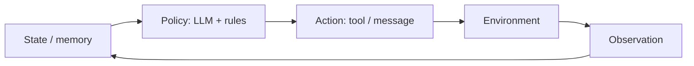
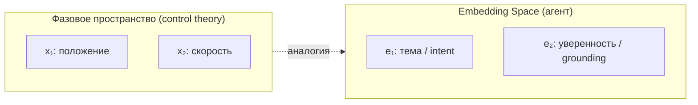
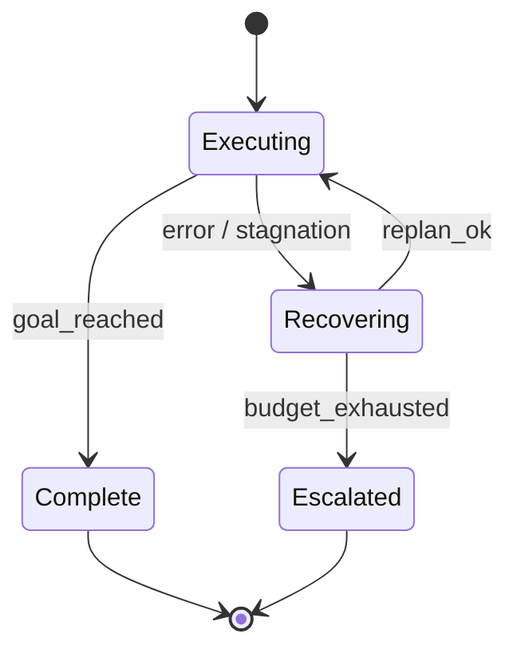

В классической теории управления **устойчивость** — свойство системы возвращаться к приемлемому режиму после возмущения, а не уходить в расходящийся режим: осцилляции, накопление ошибки, «разгон» до катастрофы.

У AI-агента возмущение — не только шум датчика. Это **галлюцинация модели**, **битый tool call**, **устаревший контекст в RAG**, **изменение API** или **пользователь, который меняет цель на полпути**. Карта компетенций, в которую вписывается этот материал — в публикации [Что должен знать лучший специалист по AI-агентам](/vairl/blog/2026/06/29/best-ai-agent-specialist-ru/).

## Agent control loop

Замкнутый контур агента:



Тот же каркас, что у термостата или cruise control: **состояние → решение → действие → наблюдение → обновление состояния**. Разница в том, что «регулятор» стохастический, с задержкой в секунды–минуты и с динамикой, которую вы **проектируете**, а не выводите из уравнений объекта.

---

## Обратная связь: стабилизирующая и разгоняющая

**Отрицательная обратная связь** уменьшает ошибку — стабилизирует систему.

| В теории управления | В агенте |
|---------------------|----------|
| Датчик измеряет отклонение от setpoint | Critic / validator / schema check |
| Корректирующее воздействие | Replan, retry, уточняющий вопрос |
| Демпфирование | Лимит циклов, cooldown, «остановись и спроси» |

**Положительная обратная связь** усиливает отклонение — контур «разгоняется»:

- **Reflexion без критерия остановки** — метрика не растёт, растут только токены
- **Planner ↔ critic в мультиагентной системе** — взаимное подталкивание к ложной уверенности
- **RAG feedback loop** — агент записывает галлюцинацию в память, потом «находит» её как факт
- **Retry storm** — тот же tool call с теми же аргументами в цикле

Хороший оркестратор явно маркирует, **где feedback отрицательный**, а **где контур нужно разорвать** внешним арбитром или human gate.

---

## Setpoint и сигнал ошибки

В регуляторе: error = setpoint − measurement.

У агента setpoint — **вектор ограничений**, а не одно число:

- достичь цели пользователя;
- не нарушить policy;
- уложиться в budget (время, деньги, число tool calls);
- сохранить согласованность с памятью и схемой данных.

Без формализованного error signal контур неустойчив по определению: оптимизируется то, что легче измерить (длина ответа, уверенный тон), а не то, что нужно продукту.

Минимальный набор proxy-метрик на каждом шаге: `task_success`, `schema_valid`, `citation_grounded`, `cost_so_far`, `steps_remaining`.

---

## Задержки и устаревшие наблюдения

Большие задержки в контуре — классический источник колебаний: система реагирует на уже неактуальные данные.

У агента задержки повсюду: inference, цепочка tools, human approval, eventual consistency в vector DB.

Симптом — **охотничьи колебания**: plan → act → observation obsolete → replan в другую сторону.

Стабилизаторы:

- версионирование state (epoch / revision);
- идемпотентные действия;
- debounce на replan;
- cancel tokens для долгих веток.

---

## Gain: слишком агрессивная или вялая политика

| Высокий gain | Низкий gain |
|--------------|-------------|
| Полный replan при любой ошибке | Молча продолжать после сбоя |
| Temperature 0.9 + 20 tool calls | Бесконечные уточнения без действия |
| Автономный write без подтверждения | Никогда не вызывать инструменты |

Настройка gain — пороги в FSM, `max_iterations`, model routing, escalation ladder: retry → альтернативный tool → human.

---

## Насыщение (saturation) и anti-windup

Исполнитель насыщается: context window, rate limits, исчерпан budget, очередь reviewers.

Без учёта saturation контур ведёт себя как **интегратор с windup**: внутренний «план на 50 шагов» обрезается контекстом, а позже выстреливает неконтролируемым действием.

**Anti-windup для агентов:** при лимите — остановить накопление плана, сделать compaction, сбросить sub-goals, а не дожимать тем же loop.

---

## Робастность: короткий горизонт планирования

Точной модели среды нет. Отсюда **receding horizon** — план на 1–3 шага, переплан после каждого observation; guard conditions перед необратимыми действиями; второй critic или rule-based checker.

Ближе к **MPC (model predictive control)** с коротким горизонтом, чем к open-loop planner на 15 шагов.

---

## Фазовый портрет: от физики к агенту

В динамических системах **фазовое пространство** — множество всех возможных состояний системы. Ось (или оси) — переменные состояния: положение, скорость, заряд, температура. **Траектория** — путь системы во времени. **Фазовый портрет** — геометрия всех типичных траекторий на плоскости фаз.



Для агента точное фазовое пространство бесконечномерно: полный state — память, tool outputs, план, история сообщений. Но **проекция на embedding space** даёт ту же геометрическую интуицию.

---

## Embedding Space как фазовое пространство смыслов

Каждый шаг агента — **переход в семантическом пространстве**:

1. Observation (текст, JSON tool, документ из RAG) кодируется в вектор — или косвенно, через то, как LLM «представляет» контекст.
2. Policy выбирает следующее действие — это **векторное поле**: из текущей области смыслов куда tendит динамика.
3. Несколько шагов подряд образуют **траекторию** — путь по manifold смыслов.

Мы не видим 4096 измерений. Но после PCA, UMAP или t-SNE на эмбеддингах шагов сессии получаем **2D-фазовый портрет агента** — диагностический инструмент, а не игрушку.

### Аттракторы — куда «притягивает» динамика

| Тип в фазовом портрете | Аналог в агенте |
|------------------------|-----------------|
| **Устойчивый аттрактор (точка)** | Заземлённый ответ, согласованный с RAG и schema |
| **Предельный цикл (limit cycle)** | ReAct-loop без прогресса: «подумаю ещё» → тот же tool → снова |
| **Седло** | Развилка: два правдоподобных intent, малый шум в промпте меняет исход |
| **Бассейн притяжения** | Область начальных формулировок, сходящихся к одному (верному или ложному) выводу |
| **Расходящаяся траектория** | Runaway hallucination, уход от темы, рост «уверенности» без grounding |

Визуально:

```
        ·  ·    ← расходящиеся (галлюцинация)
         \ |
    ······(●)·····  ← устойчивый аттрактор (correct answer)
       ↗     ↘
      ·       ·
       \     /
        (○)───(○)   ← предельный цикл (бесполезный loop)
```

### Векторное поле политики

В фазовом портрете **стрелки** показывают, куда система движется из каждой точки. У агента поле задаётся совокупностью:

- system prompt и few-shot examples (смещают бассейны);
- temperature и sampling (добавляют стохастический разброс);
- tools и RAG (внешние «силы», притягивающие к документам);
- guardrails (барьеры, через которые траектория не проходит).

Изменить поведение агента — значит **изменить поле**, а не только «написать более вежливый промпт».

### Сепаратрисы — границы между исходами

**Сепаратриса** — траектория, разделяющая бассейны притяжения. В embedding space это граница между «агент понял задачу как SQL-запрос» и «агент понял как chat». Малые изменения начального промпта или порядка документов в RAG могут **перебросить через сепаратрису** — отсюда нестабильность без злого умысла.

Инженерный вывод: критичные развилки нужно **вынести в явный FSM или Condition-узел BT**, а не оставлять на откуп стохастике LLM.

---

## Траектории в Embedding Space: что логировать

Чтобы построить фазовый портрет сессии, на каждом шаге control loop сохраняйте:

| Поле | Зачем |
|------|-------|
| `step_embedding` | embedding последнего сообщения / summary state |
| `intent_label` | классификатор или эвристика |
| `grounding_score` | overlap с RAG, citation check |
| `error_proxy` | расстояние до цели по метрике |
| `mode` | FSM-состояние: Planning / Executing / Recovering |

Траектория `(e₀, e₁, …, eₙ)` в проекции 2D показывает:

- **сходимость** — траектория входит в аттрактор успеха;
- **цикл** — замкнутый контур в проекции;
- **дрейф** — монотонный уход от RAG-области;
- **прыжок** — резкий скачок после tool call (часто норма; иногда — injection).

Связь с [гипотезным пространством и PaCMAP](/vairl/blog/2026/06/24/hypothesis-space-pacmap/): там траектории — по **гипотезам**; здесь — по **состояниям агента** во времени. Оба случая — геометрия поиска в высокомерном пространстве.

---

## Устойчивость по Ляпунову — практическая версия

Строго: найти функцию «энергии», убывающую вдоль траектории. Для агентов:

> На каждом витке loop **дистанция до цели** (или **мера риска**) в среднем не должна расти без внешнего события.

Паттерны:

- **progress gates** в DAG — шаг N+1 не стартует без validated artifact;
- **stagnation detector** — три итерации без улучшения error → escalate;
- **Lyapunov-like budget** — `remaining_steps`, `remaining_cost` только убывают.

В терминах фазового портрета: траектория должна **входить в бассейн аттрактора успеха**, а не застревать на предельном цикле или уходить к расходящейся области.

---

## Связь с DAG / FSM / Behavior Tree

Три представления из [гибридного оркестратора](/vairl/blog/2026/06/26/hybrid-agent-dag-fsm-behavior-tree/) — способы **ограничить геометрию** фазового пространства:

| Структура | Эффект на фазовый портрет |
|-----------|---------------------------|
| **DAG** | Траектория — ломаная без циклов внутри batch; feedforward |
| **FSM** | Разбиение плоскости на зоны (режимы); переходы — дискретные скачки |
| **BT** | Каждый тик — переоценка; Selector выбирает ветку = смена локального поля |

Гибридный оркестратор — **switching control**: в норме BT, при ошибке FSM → Recovering, для batch — DAG. На фазовом портрете это выглядит как **кусочно-гладкая траектория** с переключением векторного поля на границах режимов.



Режим Recovering — явная попытка **вернуть траекторию в бассейн устойчивого аттрактора** после возмущения.

---

## Разомкнутый vs замкнутый контур

| Режим | Устойчивость | Когда уместен |
|-------|--------------|---------------|
| **Разомкнутый** (один промпт → ответ) | Только статистика обучения модели | Нет side effects |
| **Замкнутый** (observe → act в среде) | Требует проектирования feedback | Почти весь продакшен-агент |

Ошибки замкнутого контура: drift в embedding space, limit cycles, runaway cost — проявляются **геометрически** на траектории, даже если текстовые логи выглядят «разумно».

---

## Чеклист для разработчика

1. Где **error signal** на каждом шаге? Его можно вычислить?
2. Есть ли **положительная обратная связь** (память, retries, multi-agent hype)?
3. Как policy узнаёт, что observation **устарело**?
4. Где **saturation** и что происходит при ней?
5. Есть ли **гарантированный выход** в Idle / Complete / Escalated?
6. Можно ли построить **траекторию в embedding space** и увидеть limit cycle или расходимость?
7. Критичные **сепаратрисы** вынесены в детерминированные guard-условия?

---

## Связанные публикации

- [Что должен знать лучший специалист по AI-агентам](/vairl/blog/2026/06/29/best-ai-agent-specialist-ru/) — полная карта компетенций
- [Гибридный агент: DAG, FSM, Behavior Tree](/vairl/blog/2026/06/26/hybrid-agent-dag-fsm-behavior-tree/)
- [Пространство гипотез и PaCMAP](/vairl/blog/2026/06/24/hypothesis-space-pacmap/)
- [Нейросимволическое планирование](/vairl/blog/2026/06/25/neurosymbolic-planning-pipeline/) — символьный критик как отрицательная обратная связь
