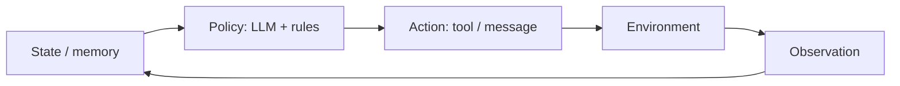
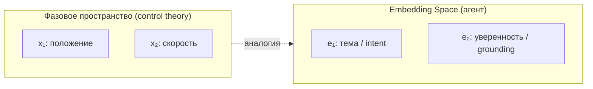
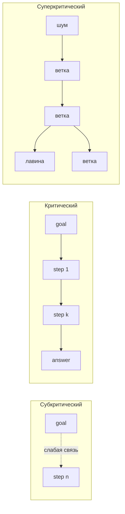
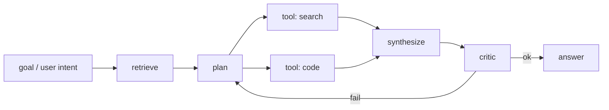
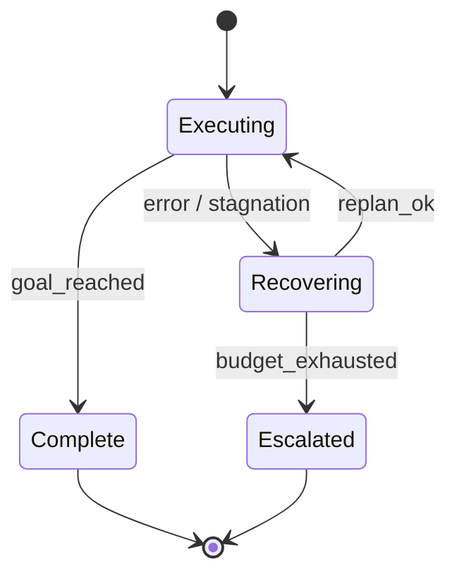

В классической теории управления **устойчивость** — свойство системы возвращаться к приемлемому режиму после возмущения, а не уходить в расходящийся режим: осцилляции, накопление ошибки, «разгон» до катастрофы.

У AI-агента возмущение — не только шум датчика. Это **галлюцинация модели**, **битый tool call**, **устаревший контекст в RAG**, **изменение API** или **пользователь, который меняет цель на полпути**. Карта компетенций, в которую вписывается этот материал — в публикации [Что должен знать лучший специалист по AI-агентам](/vairl/blog/2026/06/29/best-ai-agent-specialist-ru/).

## Agent control loop

Замкнутый контур агента:



Тот же каркас, что у термостата или cruise control: **состояние → решение → действие → наблюдение → обновление состояния**. Разница в том, что «регулятор» стохастический, с задержкой в секунды–минуты и с динамикой, которую вы **проектируете**, а не выводите из уравнений объекта.

---

## Обратная связь: стабилизирующая и разгоняющая

**Отрицательная обратная связь** уменьшает ошибку — стабилизирует систему.

| В теории управления | В агенте |
|---------------------|----------|
| Датчик измеряет отклонение от setpoint | Critic / validator / schema check |
| Корректирующее воздействие | Replan, retry, уточняющий вопрос |
| Демпфирование | Лимит циклов, cooldown, «остановись и спроси» |

**Положительная обратная связь** усиливает отклонение — контур «разгоняется»:

- **Reflexion без критерия остановки** — метрика не растёт, растут только токены
- **Planner ↔ critic в мультиагентной системе** — взаимное подталкивание к ложной уверенности
- **RAG feedback loop** — агент записывает галлюцинацию в память, потом «находит» её как факт
- **Retry storm** — тот же tool call с теми же аргументами в цикле

Хороший оркестратор явно маркирует, **где feedback отрицательный**, а **где контур нужно разорвать** внешним арбитром или human gate.

---

## Setpoint и сигнал ошибки

В регуляторе: error = setpoint − measurement.

У агента setpoint — **вектор ограничений**, а не одно число:

- достичь цели пользователя;
- не нарушить policy;
- уложиться в budget (время, деньги, число tool calls);
- сохранить согласованность с памятью и схемой данных.

Без формализованного error signal контур неустойчив по определению: оптимизируется то, что легче измерить (длина ответа, уверенный тон), а не то, что нужно продукту.

Минимальный набор proxy-метрик на каждом шаге: `task_success`, `schema_valid`, `citation_grounded`, `cost_so_far`, `steps_remaining`.

---

## Задержки и устаревшие наблюдения

Большие задержки в контуре — классический источник колебаний: система реагирует на уже неактуальные данные.

У агента задержки повсюду: inference, цепочка tools, human approval, eventual consistency в vector DB.

Симптом — **охотничьи колебания**: plan → act → observation obsolete → replan в другую сторону.

Стабилизаторы:

- версионирование state (epoch / revision);
- идемпотентные действия;
- debounce на replan;
- cancel tokens для долгих веток.

---

## Gain: слишком агрессивная или вялая политика

| Высокий gain | Низкий gain |
|--------------|-------------|
| Полный replan при любой ошибке | Молча продолжать после сбоя |
| Temperature 0.9 + 20 tool calls | Бесконечные уточнения без действия |
| Автономный write без подтверждения | Никогда не вызывать инструменты |

Настройка gain — пороги в FSM, `max_iterations`, model routing, escalation ladder: retry → альтернативный tool → human.

---

## Насыщение (saturation) и anti-windup

Исполнитель насыщается: context window, rate limits, исчерпан budget, очередь reviewers.

Без учёта saturation контур ведёт себя как **интегратор с windup**: внутренний «план на 50 шагов» обрезается контекстом, а позже выстреливает неконтролируемым действием.

**Anti-windup для агентов:** при лимите — остановить накопление плана, сделать compaction, сбросить sub-goals, а не дожимать тем же loop.

---

## Робастность: короткий горизонт планирования

Точной модели среды нет. Отсюда **receding horizon** — план на 1–3 шага, переплан после каждого observation; guard conditions перед необратимыми действиями; второй critic или rule-based checker.

Ближе к **MPC (model predictive control)** с коротким горизонтом, чем к open-loop planner на 15 шагов.

---

## Фазовый портрет: от физики к агенту

В динамических системах **фазовое пространство** — множество всех возможных состояний системы. Ось (или оси) — переменные состояния: положение, скорость, заряд, температура. **Траектория** — путь системы во времени. **Фазовый портрет** — геометрия всех типичных траекторий на плоскости фаз.



Для агента точное фазовое пространство бесконечномерно: полный state — память, tool outputs, план, история сообщений. Но **проекция на embedding space** даёт ту же геометрическую интуицию.

---

## Embedding Space как фазовое пространство смыслов

Каждый шаг агента — **переход в семантическом пространстве**:

1. Observation (текст, JSON tool, документ из RAG) кодируется в вектор — или косвенно, через то, как LLM «представляет» контекст.
2. Policy выбирает следующее действие — это **векторное поле**: из текущей области смыслов куда tendит динамика.
3. Несколько шагов подряд образуют **траекторию** — путь по manifold смыслов.

Мы не видим 4096 измерений. Но после PCA, UMAP или t-SNE на эмбеддингах шагов сессии получаем **2D-фазовый портрет агента** — диагностический инструмент, а не игрушку.

### Аттракторы — куда «притягивает» динамика

| Тип в фазовом портрете | Аналог в агенте |
|------------------------|-----------------|
| **Устойчивый аттрактор (точка)** | Заземлённый ответ, согласованный с RAG и schema |
| **Предельный цикл (limit cycle)** | ReAct-loop без прогресса: «подумаю ещё» → тот же tool → снова |
| **Седло** | Развилка: два правдоподобных intent, малый шум в промпте меняет исход |
| **Бассейн притяжения** | Область начальных формулировок, сходящихся к одному (верному или ложному) выводу |
| **Расходящаяся траектория** | Runaway hallucination, уход от темы, рост «уверенности» без grounding |

Визуально:

```
        ·  ·    ← расходящиеся (галлюцинация)
         \ |
    ······(●)·····  ← устойчивый аттрактор (correct answer)
       ↗     ↘
      ·       ·
       \     /
        (○)───(○)   ← предельный цикл (бесполезный loop)
```

### Векторное поле политики

В фазовом портрете **стрелки** показывают, куда система движется из каждой точки. У агента поле задаётся совокупностью:

- system prompt и few-shot examples (смещают бассейны);
- temperature и sampling (добавляют стохастический разброс);
- tools и RAG (внешние «силы», притягивающие к документам);
- guardrails (барьеры, через которые траектория не проходит).

Изменить поведение агента — значит **изменить поле**, а не только «написать более вежливый промпт».

### Интерактив: дискретное embedding space

Ниже — упрощённая **2D-проекция** дискретного embedding space (как после PCA / UMAP). Фоновые стрелки — **векторное поле политики**; узлы с подписями — шаги **chain of thought**; движущаяся точка — текущая «мысль» LLM. Переключите режим: **сходимость к аттрактору** (успешный CoT) или **предельный цикл** (бесполезный ReAct-loop).

<div class="phase-portrait-widget">
  <div class="phase-portrait-controls">
    <button type="button" data-phase-mode="cycle" class="active">Предельный цикл</button>
    <button type="button" data-phase-mode="converge">Сходимость к аттрактору</button>
  </div>
  <div id="embedding-phase-portrait" class="phase-portrait-canvas"></div>
  <div id="phase-prompt-display" class="phase-portrait-prompts" aria-live="polite"></div>
  <p class="phase-portrait-caption">Оси — условные компоненты проекции эмбеддингов. В режиме <em>Предельный цикл</em> точки лежат на окружности; движущаяся точка идёт по замкнутой траектории, на каждом шаге подсвечивается короткий промпт. Скетч на <a href="https://p5js.org/" target="_blank" rel="noopener">p5.js</a>.</p>
</div>

<script src="{{ '/assets/js/embedding-phase-portrait.js' | relative_url }}"></script>

### Сепаратрисы — границы между исходами

**Сепаратриса** — траектория, разделяющая бассейны притяжения. В embedding space это граница между «агент понял задачу как SQL-запрос» и «агент понял как chat». Малые изменения начального промпта или порядка документов в RAG могут **перебросить через сепаратрису** — отсюда нестабильность без злого умысла.

Инженерный вывод: критичные развилки нужно **вынести в явный FSM или Condition-узел BT**, а не оставлять на откуп стохастике LLM.

---

## Траектории в Embedding Space: что логировать

Чтобы построить фазовый портрет сессии, на каждом шаге control loop сохраняйте:

| Поле | Зачем |
|------|-------|
| `step_embedding` | embedding последнего сообщения / summary state |
| `intent_label` | классификатор или эвристика |
| `grounding_score` | overlap с RAG, citation check |
| `error_proxy` | расстояние до цели по метрике |
| `mode` | FSM-состояние: Planning / Executing / Recovering |

Траектория `(e₀, e₁, …, eₙ)` в проекции 2D показывает:

- **сходимость** — траектория входит в аттрактор успеха;
- **цикл** — замкнутый контур в проекции;
- **дрейф** — монотонный уход от RAG-области;
- **прыжок** — резкий скачок после tool call (часто норма; иногда — injection).

Связь с [гипотезным пространством и PaCMAP](/vairl/blog/2026/06/24/hypothesis-space-pacmap/): там траектории — по **гипотезам**; здесь — по **состояниям агента** во времени. Оба случая — геометрия поиска в высокомерном пространстве.

---

## Критичность: передача смысла по сети агента

В нейронауке **гипотеза критичности** (criticality hypothesis) утверждает: кора работает **на границе фазового перехода** — между режимом, где активность затухает, и режимом, где она неконтролируемо усиливается. В этой точке, по данным экспериментов и моделей, **оптимизируется обработка информации**: возникают масштабно-инвариантные «нейронные лавины», длинные корреляции во времени и в пространстве сети. Классическое введение — John Beggs, *The Cortex and the Critical Point* (MIT Press).

Для разработчика агентов это не метафора «мозг = LLM», а **переносимая метрика**: chain of thought, вызовы tools и сообщения между subagents — это **распространение сигнала по направленному графу**. Сигнал может **затухать** (потеря intent к концу цепочки), **взрываться** (runaway CoT, reflexion-лавина) или идти в **критическом режиме** — далеко по графу без потери связи с целью и без хаотического размножения шума.

### Три режима — по аналогии с критичностью мозга

| Режим | Нейросеть (упрощённо) | Chain of thought / агент |
|-------|----------------------|---------------------------|
| **Субкритический** (subcritical) | Возмущение затухает; короткая корреляция по сети | Каждый шаг CoT слабо связан с целью; intent «забывается»; RAG-факт не доходит до финального ответа |
| **Критический** (critical) | Максимальная длина корреляции; оптимальная передача | Смысл цели **передаётся** через несколько hop'ов (plan → tool → synthesize), но объём рассуждения не растёт лавинообразно |
| **Суперкритический** (supercritical) | Лавины растут без ограничения; шум усиливается | Галлюцинация, раздувание плана, multi-agent hype, положительная обратная связь без dampening |



С точки зрения **устойчивости систем** (см. gain и обратную связь выше): субкритический режим — **передемпфирование** (сигнал ошибки не доходит до нужного узла); суперкритический — **положительная обратная связь с gain > 1**; критический — работа **на границе устойчивости**, где пропускная способность канала максимальна.

### Интерактив: лавина сигнала на квадратной сетке

Упрощённая модель **нейронной лавины** (Beggs): квадратная решётка — дискретное embedding-/agent-space; возбуждение входит слева и распространяется в соседние **квадратные клетки**. Параметр **σ** (branching ratio) задаёт режим; **направленность** — доля передачи вправо (по DAG / chain of thought). Субкритическое — вспышки гаснут; критическое — лавины умеренного размера доходят до выхода; суперкритическое — лавина разрастается по всей сети.

<div id="criticality-grid-widget" class="criticality-widget">
  <div class="criticality-header">
    <p>Клеточный автомат: покой → возбуждение → активность → рефрактерность. Каждый тик — один шаг передачи сигнала по сети агента.</p>
  </div>
  <div class="criticality-controls">
    <div class="crit-ctrl-group">
      <span class="crit-ctrl-label">σ, режим:</span>
      <div class="crit-state-btns">
        <button type="button" class="crit-state-btn" data-crit-mode="subcritical">Субкритическое</button>
        <button type="button" class="crit-state-btn active" data-crit-mode="critical">Критическое</button>
        <button type="button" class="crit-state-btn" data-crit-mode="supercritical">Суперкритическое</button>
      </div>
    </div>
    <div class="crit-ctrl-group">
      <span class="crit-ctrl-label">Скорость</span>
      <input type="range" id="crit-speed" min="1" max="5" value="3" step="1">
    </div>
    <div class="crit-ctrl-group">
      <span class="crit-ctrl-label">Направленность →</span>
      <input type="range" id="crit-bias" min="0" max="100" value="70" step="1">
      <span id="crit-bias-out" class="crit-bias-out">70%</span>
    </div>
  </div>
  <div class="criticality-metrics">
    <div>σ: <span id="crit-sigma-val">1.00</span></div>
    <div>Активных клеток: <span id="crit-active-count">0</span></div>
    <div>Лавин: <span id="crit-ava-count">0</span></div>
    <div>Размер последней: <span id="crit-ava-size">—</span></div>
    <div>Фронт сигнала: <span id="crit-wave-speed">—</span></div>
  </div>
  <div class="criticality-wave-row">
    <span>вход</span>
    <div class="crit-wave-bar"><div class="crit-wave-fill" id="crit-wave-bar"></div></div>
    <span>выход →</span>
  </div>
  <div class="criticality-canvas-wrap">
    <canvas id="criticality-grid-canvas"></canvas>
  </div>
  <div class="criticality-legend">
    <div class="crit-leg-item"><span class="crit-leg-swatch" style="background:#eef0f4;border:1px solid #dde1e8"></span>покой</div>
    <div class="crit-leg-item"><span class="crit-leg-swatch" style="background:#b8f0d8"></span>возбуждение</div>
    <div class="crit-leg-item"><span class="crit-leg-swatch" style="background:#667eea"></span>активен</div>
    <div class="crit-leg-item"><span class="crit-leg-swatch" style="background:#3a3a48"></span>рефрактерный</div>
  </div>
  <p class="criticality-caption">Квадратные клетки — узлы дискретного пространства; стрелки — предпочтительное направление передачи (аналог directed graph). При σ ≈ 1 и умеренной направленности сигнал доходит далеко без взрывного роста — критический режим для CoT.</p>
</div>

<script src="{{ '/assets/js/criticality-grid.js' | relative_url }}"></script>

### Шеннон и канал передачи

В теории информации Шеннона **пропускная способность канала** зависит от отношения сигнал/шум. Слишком слабый сигнал — декодер не восстанавливает сообщение (субкритичность). Слишком агрессивное усиление шума вместе с сигналом — хаос на выходе (суперкритичность).

У агента «канал» — ребро directed graph: выход узла `plan` → вход узла `execute_tool`. **Смысл** (intent, constraints, citations) — сообщение; **температура, длинный контекст, нерелевантный RAG** — шум. Оркестратор с критичностью ближе к критической точке:

- не обрезает цепочку так, что goal term теряется к середине DAG;
- не запускает unbounded branching (20 параллельных subagents без aggregation);
- вставляет **повторители** (summarize + restate goal) там, где корреляция по дистанции падает слишком быстро — аналог регенерации сигнала в длинной линии связи.

### Directed graph работы агента

Топология исполнения — прежде всего **DAG** (batch, LangGraph, пайплайн plan→act), иногда **DAG с внешним циклом** (FSM супервизор перезапускает acyclic spine) — см. [гибридный оркестратор](/vairl/blog/2026/06/26/hybrid-agent-dag-fsm-behavior-tree/).



**Узлы** — шаги с логируемым артефактом: сообщение, CoT-чанк, tool I/O, embedding состояния. **Рёбра** — направленная передача контекста. Расстояние `d` — число hop'ов по кратчайшему пути (или по фактическому trace, если были параллельные ветки).

Циклы (`critic → plan`) не отменяют метрику: считайте **итерацию** как увеличение «времени» `t` и отдельно — **расстояние по acyclic spine** внутри одной итерации. Суперкритичность часто видна именно на **повторных** проходах через один и тот же узел (растущая корреляция с шумом, падающая — с исходным goal).

### Метрика критичности: корреляция сигнала на разных дистанциях

Базовое определение: для каждого расстояния `d` по графу (или по индексу шага в CoT) оцените **корреляцию сигнала** между парами узлов на этом расстоянии.

Пусть `s(v)` — вектор сигнала на узле `v` (embedding шага, embedding цели, или проекция на ось intent). Тогда:

```
C(d) = mean_{u,v : dist(u,v)=d} corr( s(u), s(v) )
```

Интерпретация:

| Профиль C(d) | Режим | Действие |
|--------------|-------|----------|
| **Быстрый экспоненциальный спад** | Субкритический | Усилить передачу goal (restated constraints, structured memory); укоротить DAG |
| **Медленный спад** (степенной / длинный «хвост») | Ближе к критическому | Обычно желаемо для многошаговых задач |
| **Рост или осцилляция на больших d** | Суперкритический | Снизить gain, лимит ветвления, dampening в FSM Recovering |

Дополнительно — **branching ratio** `σ`: среднее число «активных» потомков, несущих смысл goal дальше по графу (не любой tool call, а шаг, увеличивающий `grounding_score` или снижающий `error_proxy`):

- `σ < 1` — сигнал затухает (субкритический);
- `σ ≈ 1` — граница (критический);
- `σ > 1` — лавинообразное размножение рассуждений (суперкритический).

В терминах **фазового портрета**: субкритический CoT — траектория быстро **схлопывается** к аттрактору, не связанному с goal; суперкритический — **расходящаяся** траектория или limit cycle с ростом «уверенности»; критический — траектория **длинная, но сходящаяся** к заземлённому аттрактору.

### Предпосылки для использования метрики

Метрика осмысленна, только если выполнены условия:

1. **Известная топология** — явный DAG (или trace с `parent_id` / LangGraph state); без графа нет «дистанции `d`».
2. **Сигнал на каждом узле** — `step_embedding`, фиксированный `goal_embedding`, опционально embedding RAG-чанков; одна и та же модель эмбеддингов в рамках сессии.
3. **Сопоставимость узлов** — однотипные артефакты (не смешивать raw tool JSON и финальный prose без проекции).
4. **Достаточно трасс** — `C(d)` оценивается по ансамблю сессий или bootstrap по одной длинной сессии; одна короткая цепочка — только эвристика.
5. **Разделение сигнал / шум** — явный `goal` и `grounding_score`; иначе высокая корреляция может быть **ложной** (агенты согласно галлюцинируют в унисон).
6. **Учёт циклов и параллели** — для fork-join в DAG усредняйте по веткам; для `critic → plan` отслеживайте деградацию `C(d)` по номеру итерации.

Без (1)–(2) «критичность» сводится к субъективной оценке длины промпта.

### Связь с устойчивостью и control loop

Критичность — **мост** между геометрией embedding space и классической устойчивостью:

| Понятие control theory | Критичность на графе агента |
|------------------------|-----------------------------|
| Gain | Branching ratio σ, temperature, число parallel subagents |
| Демпфирование | Субкритический спад C(d); summarization, critic |
| Положительная обратная связь | σ > 1, Reflexion без stop, RAG feedback loop |
| Граница устойчивости | Критический режим: max передача intent при bounded cost |
| Correlation length (Beggs) | Дистанция d, на которой C(d) ещё выше порога — «как далеко по DAG несётся цель» |

**Практический регулятор:** на каждой итерации control loop вычисляйте `C(1)` (локальная связность соседних шагов) и `C(d_max)` (связь с goal на противоположном конце spine). Если `C(d_max)` падает ниже порога при растущем `cost` — режим субкритический → restate goal, compaction. Если `σ` и token cost растут, а `error_proxy` нет — суперкритический → FSM Recovering, снижение gain.

### Что добавить в логирование

К полям из раздела про траектории:

| Поле | Зачем |
|------|-------|
| `graph_node_id`, `parent_ids` | Топология DAG |
| `graph_distance_to_goal` | d для пары с якорным goal-узлом |
| `goal_correlation` | corr(s(v), s(goal)) на этом шаге |
| `branching_factor` | Число активных исходящих рёбер с полезным сигналом |
| `criticality_band` | Эвристика: sub / critical / super по порогам C(d) и σ |

---

## Устойчивость по Ляпунову — практическая версия

Строго: найти функцию «энергии», убывающую вдоль траектории. Для агентов:

> На каждом витке loop **дистанция до цели** (или **мера риска**) в среднем не должна расти без внешнего события.

Паттерны:

- **progress gates** в DAG — шаг N+1 не стартует без validated artifact;
- **stagnation detector** — три итерации без улучшения error → escalate;
- **Lyapunov-like budget** — `remaining_steps`, `remaining_cost` только убывают.

В терминах фазового портрета: траектория должна **входить в бассейн аттрактора успеха**, а не застревать на предельном цикле или уходить к расходящейся области. **Критичность** (раздел выше) уточняет, *как далеко по DAG* смысл цели ещё «несётся» вместе с траекторией — без отдельной метрики Lyapunov-like budget не видно, затухает ли сигнал по пути или разгоняется.

---

## Связь с DAG / FSM / Behavior Tree

Три представления из [гибридного оркестратора](/vairl/blog/2026/06/26/hybrid-agent-dag-fsm-behavior-tree/) — способы **ограничить геометрию** фазового пространства:

| Структура | Эффект на фазовый портрет |
|-----------|---------------------------|
| **DAG** | Траектория — ломаная без циклов внутри batch; feedforward |
| **FSM** | Разбиение плоскости на зоны (режимы); переходы — дискретные скачки |
| **BT** | Каждый тик — переоценка; Selector выбирает ветку = смена локального поля |

Гибридный оркестратор — **switching control**: в норме BT, при ошибке FSM → Recovering, для batch — DAG. На фазовом портрете это выглядит как **кусочно-гладкая траектория** с переключением векторного поля на границах режимов.



Режим Recovering — явная попытка **вернуть траекторию в бассейн устойчивого аттрактора** после возмущения.

---

## Разомкнутый vs замкнутый контур

| Режим | Устойчивость | Когда уместен |
|-------|--------------|---------------|
| **Разомкнутый** (один промпт → ответ) | Только статистика обучения модели | Нет side effects |
| **Замкнутый** (observe → act в среде) | Требует проектирования feedback | Почти весь продакшен-агент |

Ошибки замкнутого контура: drift в embedding space, limit cycles, runaway cost — проявляются **геометрически** на траектории, даже если текстовые логи выглядят «разумно».

---

## Чеклист для разработчика

1. Где **error signal** на каждом шаге? Его можно вычислить?
2. Есть ли **положительная обратная связь** (память, retries, multi-agent hype)?
3. Как policy узнаёт, что observation **устарело**?
4. Где **saturation** и что происходит при ней?
5. Есть ли **гарантированный выход** в Idle / Complete / Escalated?
6. Можно ли построить **траекторию в embedding space** и увидеть limit cycle или расходимость?
7. Критичные **сепаратрисы** вынесены в детерминированные guard-условия?
8. Измеряете ли **C(d)** — корреляцию сигнала (intent / embedding) на дистанции `d` по DAG?
9. В каком режиме сессия: **субкритический** (intent затухает), **критический** или **суперкритический** (лавина CoT / σ > 1)?

---

## Литература и источники

- John Beggs, *The Cortex and the Critical Point: Understanding Complexity in Brain Function* (MIT Press) — критичность коры, нейронные лавины, оптимальная передача информации на границе фазового перехода.
- C. Shannon, теория информации — пропускная способность канала, компромисс сигнал/шум (аналог gain и dampening в агенте).
- Self-organized criticality (Bak et al.) — лавинная динамика; переносимая интуиция для runaway tool/CoT cascades.

---

## Связанные публикации

- [Что должен знать лучший специалист по AI-агентам](/vairl/blog/2026/06/29/best-ai-agent-specialist-ru/) — полная карта компетенций
- [Гибридный агент: DAG, FSM, Behavior Tree](/vairl/blog/2026/06/26/hybrid-agent-dag-fsm-behavior-tree/)
- [Пространство гипотез и PaCMAP](/vairl/blog/2026/06/24/hypothesis-space-pacmap/)
- [Нейросимволическое планирование](/vairl/blog/2026/06/25/neurosymbolic-planning-pipeline/) — символьный критик как отрицательная обратная связь
