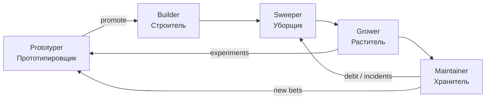
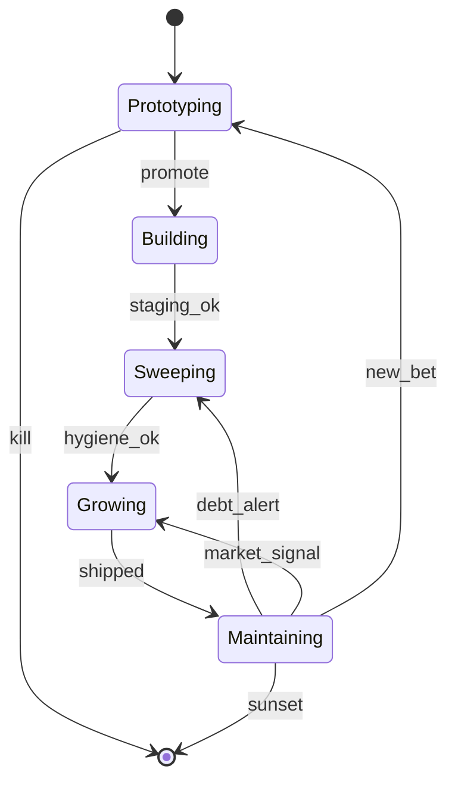

Один «универсальный» coding-агент, который и придумывает, и строит, и чинит прод — звучит удобно, но на практике **смешивает несовместимые оптимизации**. Прототипу нужна скорость и диверсификация идей; продакшену — контракты, тесты и предсказуемость; эксплуатации — SLO и безопасность. Попытка решить всё одним промптом даёт **средний код без явного владельца качества**.

Ниже — концепция **пайплайна из пяти агентов-ролей**, которые работают **последовательно в цикле**. Каждая роль имеет свой charter: что входит, что выходит, какие tools разрешены и когда цикл переходит к следующему этапу. Связанные материалы: [гибридный оркестратор DAG/FSM/BT](/vairl/blog/2026/06/26/hybrid-agent-dag-fsm-behavior-tree-ru/), [устойчивость control loops](/vairl/blog/2026/06/29/agent-control-loop-stability-ru/), [карта компетенций агент-разработчика](/vairl/blog/2026/06/29/best-ai-agent-specialist-ru/).

## Зачем пять ролей, а не один

| Один супер-агент | Пайплайн ролей |
|------------------|----------------|
| Одинаковый temperature на всё | Высокий на Prototyper, низкий на Maintainer |
| Нет явного kill criteria для идей | Prototyper генерирует много; gate отсекает до Builder |
| «Напиши быстро и надёжно» — противоречие | Builder и Sweeper оптимизируют разное |
| ИИ-мусор накапливается незаметно | Sweeper — отдельная фаза с mandate на упрощение |
| Масштабирование смешано с починкой | Grower vs Maintainer — разные метрики |

Аналогия с инженерной организацией: R&D, product engineering, platform, growth, SRE — **разные KPI**, один человек на все роли редко тянет всё одновременно.

## Цикл пайплайна

Агенты идут **по кольцу**. Не каждый артефакт проходит все пять фаз за один круг — на каждом переходе есть **gate** (критерий допуска). Многие концепты Prototyper **умирают до Builder**; зрелый продукт чаще крутится в петле **Grower → Maintainer → Sweeper**.



**Оркестратор** (FSM или supervisor-агент) хранит `artifact_id`, `current_role`, `lifecycle_stage` и журнал handoff. Передача между ролями — не «новый чат», а **структурированный пакет**: код, ADR, метрики, список известного долга, eval-результаты.

---

## 1. Прототипировщик (Prototyper)

**Мандат:** генерировать **много смелых гипотез** и собирать **быстрые концепты** — spike, mock, vertical slice. Большинство идей **не должны** доходить до релиза; это норма, а не провал.

| Аспект | Содержание |
|--------|------------|
| **Вход** | Product bet, user pain, tech constraint, «что если…» |
| **Выход** | POC-репозиторий, demo, 1-pager гипотезы, список рисков |
| **Tools** | Sandbox без prod-доступа, быстрые генераторы UI/API, synthetic data |
| **Метрики** | Time-to-demo, diversity идей, % гипотез с измеримым learning |
| **Запрещено** | Прямой деплой в prod, долгоживущие секреты, «вечные» костыли без пометки |

**Как работает агент:** высокая temperature, параллельные ветки (несколько концептов на одну ставку), жёсткий **timebox** (часы, не недели). Каждый концепт сопровождается **falsification criteria**: что опровергнет идею. Связь с [синтезом гипотез](/vairl/blog/2026/06/26/llm-hypothesis-synthesis-agents-ru/) — Prototyper поставляет кандидатов в пространство решений.

**Gate на Builder:** есть working demo **или** чёткий negative result; гипотеза согласована с продуктом; оценён порядок величины cost/complexity.

---

## 2. Строитель (Builder)

**Мандат:** взять **сырой прототип** и превратить в **промышленный каркас** — модули, контракты API, тесты, CI, observability hooks.

| Аспект | Содержание |
|--------|------------|
| **Вход** | Promoted POC, ADR от Prototyper, acceptance criteria |
| **Выход** | Production-grade codebase v1, contract tests, deployment manifest |
| **Tools** | Repo write, CI, linters, schema registry, staging deploy |
| **Метрики** | Test coverage критических путей, build time, defect escape rate |
| **Запрещено** | Переписывание с нуля без ADR; новые «безумные» фичи без gate |

**Как работает агент:** низкая temperature, **DAG-пайплайн** (design → implement → test → integrate), обязательный **critic/validator** на схемы и API. Builder **не придумывает продукт** — реализует charter. Паттерны из [гибридного DAG/FSM](/vairl/blog/2026/06/26/hybrid-agent-dag-fsm-behavior-tree-ru/): acyclic spine + FSM «Building / Blocked / Review».

**Gate на Sweeper:** staging green; критические user flows покрыты; нет известных P0 security holes.

---

## 3. Уборщик (Sweeper)

**Мандат:** **очистить код**, упростить архитектуру, выбросить **ИИ-мусор** — дубли, мёртвые ветки, over-abstraction, «галлюцинированные» утилиты, лишние зависимости.

| Аспект | Содержание |
|--------|------------|
| **Вход** | Код после Builder или после волн Grower; отчёт static analysis |
| **Выход** | Меньше LOC при том же поведении, упрощённый граф модулей, changelog долга |
| **Tools** | Refactoring, dead-code detection, complexity metrics, benchmark suite |
| **Метрики** | Cyclomatic complexity ↓, p95 latency ↓, bundle size ↓, duplicate blocks ↓ |
| **Запрещено** | Функциональные изменения без explicit approval; silent behavior change |

**Как работает агент:** режим **subtractive engineering** — сначала инвентаризация «мусора» (AI slop patterns: unused wrappers, redundant layers, copy-paste prompts в коде), затем **малые PR** с regression tests. Sweeper — это не «форматирование», а **архитектурная гигиена**. Часто запускается **после** Builder и **периодически** из Maintainer при росте entropy.

Типичные цели Sweeper:

- слить три одинаковых helper'а, которые написал агент в разных файлах;
- убрать speculative abstraction «на будущее»;
- заменить цепочку if-ов на одну явную state machine, если это **упрощает**;
- прогнать perf benchmark до/после.

**Gate на Grower:** eval/regression зелёные; complexity budget в норме; документированы оставшиеся осознанные компромиссы.

---

## 4. Раститель (Grower)

**Мандат:** **масштабировать и дорабатывать** существующий продукт под **запросы рынка** — новые сегменты, интеграции, локализация, pricing tiers, feature flags.

| Аспект | Содержание |
|--------|------------|
| **Вход** | Stable product, market signal, analytics, customer requests |
| **Выход** | Shipped features behind flags, migration guides, updated eval sets |
| **Tools** | Feature flags, A/B infra, analytics, customer ticket mining |
| **Метрики** | Adoption, retention, revenue proxy, feature-level eval |
| **Запрещено** | Ломать core invariants; релиз без rollback plan |

**Как работает агент:** цикл **discover → spec → increment → measure**. Grower отличается от Prototyper тем, что **база уже есть** — расширяем, а не изобретаем с чистого листа. Эксперименты идут через flags; неудачные ветки **срезаются** без guilt. Телеметрия из [статьи про logging](/vairl/blog/2026/06/29/agent-telemetry-ru/) питает backlog Grower: какие задачи пользователи реально приносят.

**Gate на Maintainer:** feature в prod с мониторингом; runbook обновлён; security review для новых surface area.

---

## 5. Хранитель (Maintainer)

**Мандат:** продукт остаётся **безопасным, надёжным и быстрым** по мере роста компании — патчи, SLO, инциденты, capacity, compliance.

| Аспект | Содержание |
|--------|------------|
| **Вход** | Prod workload, alerts, CVE feeds, SLO dashboards, audit findings |
| **Выход** | Patches, postmortems, capacity plans, updated threat model |
| **Tools** | Observability, on-call playbooks, dependency scanners, chaos drills |
| **Метрики** | Uptime, MTTR, vulnerability SLA, cost per request |
| **Запрещено** | «Тихие» изменения без audit trail; игнор degraded SLO |

**Как работает агент:** **reactive** (инцидент → triage → fix) и **proactive** (dependency updates, cert rotation, load tests). Maintainer триггерит **Sweeper**, когда техдолг влияет на SLO, и **Prototyper**, когда нужен принципиально новый подход (не patch, а bet). Control loop устойчивости — в [отдельной публикации](/vairl/blog/2026/06/29/agent-control-loop-stability-ru/): Maintainer — носитель **отрицательной обратной связи** для всей системы.

**Выход из цикла:** стабильный prod + сигнал для Grower (рост) или Prototyper (новая ставка) или Sweeper (entropy).

---

## Последовательное исполнение в цикле

Один **виток оркестратора** для артефакта `X`:

```
1. Prototyper  → concept_packet (или tombstone «не идём дальше»)
2. Builder     → только если gate promote
3. Sweeper     → hygiene_pass
4. Grower      → increment_shipped (может быть no-op виток)
5. Maintainer  → slo_ok + security_ok
6. Следующий виток: решение supervisor — Grower / Sweeper / Prototyper / стоп
```



**Важно:** роли **не параллелятся на одном артефакте** в одной фазе — иначе Builder и Prototyper снова сольются. Параллель допустим **между разными артефактами**: Prototyper крутит три ставки, пока Maintainer обслуживает prod.

---

## Handoff-пакет между ролями

Минимальная схема передачи (JSON / issue template):

```json
{
  "artifact_id": "feat-semantic-search",
  "from_role": "builder",
  "to_role": "sweeper",
  "repo_ref": "sha:abc123",
  "summary": "MVP semantic search API",
  "known_debt": ["no pagination on /search", "tmp in-memory index"],
  "eval_results": { "regression": "pass", "latency_p95_ms": 120 },
  "human_gates_required": []
}
```

Без handoff-пакета следующий агент **перечитывает весь репозиторий с нуля** — дорого, шумно, провоцирует повторный ИИ-мусор.

---

## Конфигурация агентов по ролям

| Параметр | Prototyper | Builder | Sweeper | Grower | Maintainer |
|----------|------------|---------|---------|--------|------------|
| Temperature | высокая | низкая | низкая | средняя | низкая |
| Max steps | малый timebox | средний | средний | средний | по инциденту |
| Tool access | sandbox | staging + CI | repo + bench | flags + analytics | prod read, patch branch |
| Success criterion | learning | contract + tests | simpler + same behavior | adoption | SLO + CVE |

Один и тот же base model может служить всем ролям; **различаются system prompt, tools и eval**.

---

## Антипаттерны

| Проблема | Симптом | Лечение |
|----------|---------|---------|
| **Builder-прототип** | POC сразу в main без тестов | Жёсткий gate Prototyper → Builder |
| **Вечный Prototyper** | Нет promote, только демо | Product owner + kill/promote weekly |
| **Sweeper без тестов** | «Упростили» — сломали prod | Обязательный regression перед merge |
| **Grower без Maintainer** | Фичи копят incidents | Нельзя ship без runbook и alerts |
| **Maintainer как единственный агент** | Только патчи, нет роста | Явный Grower в цикле |
| **Один чат на всех** | Смешение стилей и целей | Отдельные threads / handoff per role |

---

## Связь с eval и телеметрией

Каждая роль добавляет **свои тесты** в общий eval-набор:

| Роль | Тип eval |
|------|----------|
| Prototyper | «Гипотеза измерима?» checklist |
| Builder | Contract + integration |
| Sweeper | Regression + complexity budget |
| Grower | Feature-level A/B + task success |
| Maintainer | SLO burn rate, security scans |

[Телеметрия](/vairl/blog/2026/06/29/agent-telemetry-ru/) и [бенчмарки](/vairl/blog/2026/06/29/agent-benchmark-generation-ru/) замыкают цикл: Maintainer и Grower кормят реальными кейсами, Prototyper — новыми ставками.

---

## Минимальный прототип оркестратора

1. FSM с пятью состояниями и таблицей переходов (см. diagram выше).
2. Пять prompt-шаблонов + пять tool policies.
3. Handoff JSON в git (папка `.agent-lifecycle/`).
4. Human approve на promote и на prod patch.
5. Один артефакт — один виток; метрики по ролям в [Langfuse](https://langfuse.com/)-подобной системе.

Дальше — привязка к LangGraph / custom supervisor и replay трасс по `artifact_id`.

## Further reading

- [Гибридный агент: DAG, FSM, BT](/vairl/blog/2026/06/26/hybrid-agent-dag-fsm-behavior-tree-ru/) — как описать оркестратор формально
- [Устойчивость agent control loops](/vairl/blog/2026/06/29/agent-control-loop-stability-ru/) — feedback и gain по фазам
- [Синтез гипотез локальной LLM](/vairl/blog/2026/06/26/llm-hypothesis-synthesis-agents-ru/) — топливо для Prototyper
- [Как готовить ведущего специалиста по AI-агентам](/vairl/blog/2026/06/29/best-ai-agent-specialist-ru/) — кто проектирует такие пайплайны
