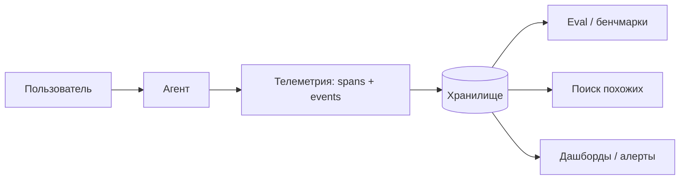
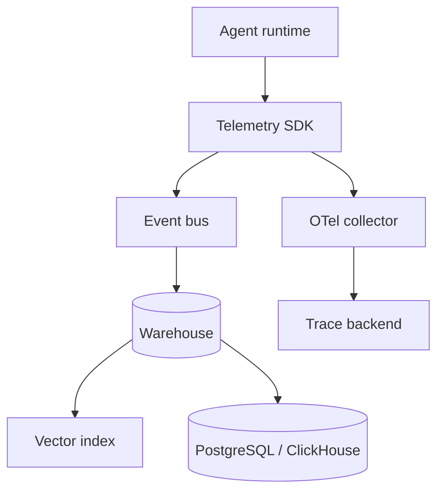

Без телеметрии агент — чёрный ящик: вы не знаете, **какие задачи** приходят пользователям, где падает траектория и что превратить в тест для регрессии. Телеметрия — это не «логи ради логов», а **контур обратной связи продукта**: собрать запросы и диалоги, сохранить в базе, найти похожие кейсы, оценить качество и пополнить eval-набор.

Ниже — обзор **подходов и практик**: что логировать, как хранить, как искать похожие задачи и связать телеметрию с [генерацией бенчмарков](/vairl/blog/2026/06/29/agent-benchmark-generation-ru/) и [устойчивостью control loop](/vairl/blog/2026/06/29/agent-control-loop-stability-ru/).

## Зачем телеметрия агенту

| Вопрос продукта | Что даёт телеметрия |
|-----------------|---------------------|
| Какие задачи у пользователей? | Корпус **intent / task** с частотами |
| Где агент ломается? | Трассы с ошибками tools, escalation, abandon |
| Сколько стоит сессия? | Токены, latency, число шагов |
| Что добавить в eval? | Кандидаты из продакшена с outcome |
| Есть ли похожий прошлый кейс? | **Semantic search** по embedding запроса |



---

## Уровни наблюдаемости

По аналогии с классической observability (metrics / logs / traces):

| Уровень | Содержимое | Пример |
|---------|------------|--------|
| **Metrics** | Агрегаты | success rate, p95 latency, cost/session |
| **Logs** | Строковые события | `tool_error`, `policy_violation` |
| **Traces** | Иерархия span'ов | session → turn → LLM call → tool |
| **Trajectories** | Полная история агента | messages, tool I/O, state checkpoints |

Для action-агентов **trajectory** важнее одной строки лога: eval и replay требуют **структурированной** последовательности шагов.

---

## Что собирать: минимальная схема сессии

### Идентификаторы и контекст

- `session_id`, `trace_id` (W3C Trace Context)
- `user_id` / `anonymous_id` (хешированный)
- `tenant_id`, `agent_version`, `model_id`, `orchestrator_mode` (DAG / FSM / BT)
- `timestamp_start`, `timestamp_end`, `locale`

### Запрос пользователя и извлечённая задача

Разделяйте **сырой utterance** и **нормализованный task**:

| Поле | Назначение |
|------|------------|
| `user_message_raw` | Текст как ввёл пользователь |
| `task_label` | Краткая формулировка (ручная или LLM-summary) |
| `intent_class` | Классификатор: support / coding / search / … |
| `goal_embedding` | Вектор для поиска похожих |
| `constraints` | JSON: deadline, budget, policy tags |

Список задач пользователя — это **не** только первое сообщение. Задача может **уточняться** в диалоге; фиксируйте `task_revision` на каждый существенный pivot.

### Коммуникация и шаги агента

На каждый **turn** или **step** control loop:

| Поле | Зачем |
|------|-------|
| `step_index`, `parent_span_id` | Дерево трассы |
| `role` | user / assistant / tool / system |
| `content` / `content_ref` | Текст или ссылка на blob |
| `tool_name`, `tool_args`, `tool_result` | Tool-calling |
| `fsm_state` | Planning / Executing / Recovering |
| `tokens_in`, `tokens_out`, `latency_ms` | Экономика |
| `error_proxy`, `grounding_score` | Связь с [метриками устойчивости](/vairl/blog/2026/06/29/agent-control-loop-stability-ru/) |
| `outcome` | success / fail / escalated / abandoned |

### Итог сессии

- `task_success` (bool + причина)
- `user_feedback` (thumbs, rating, free text)
- `cost_total_usd`, `steps_count`
- `final_artifact_ref` (ответ, patch, DB snapshot id)

---

## Где и как собирать

### 1. In-process hooks (оркестратор)

Перехват в LangGraph / custom event loop: before/after каждого узла, callback на tool.

**Плюсы:** полный контроль, низкая латентность.  
**Минусы:** нужно поддерживать схему в коде.

### 2. OpenTelemetry (OTel)

Стандарт **traces + spans + attributes**. Экспорт в Jaeger, Tempo, Datadog, Honeycomb.

**Практика:** один `trace_id` на сессию; span на LLM-вызов и tool; attributes — `model`, `tokens`, `tool.status`.

### 3. Специализированные LLM-платформы

| Платформа | Фокус |
|-----------|--------|
| **LangSmith** | Трассы LangChain/LangGraph, datasets, eval |
| **Langfuse** | Open-source traces, scores, prompt management |
| **Arize Phoenix** | Traces + embeddings drift |
| **Weights & Biases Weave** | Эксперименты + online traces |
| **Braintrust** | Logs → eval → regression |
| **Helicone** / **Portkey** | Gateway + логирование запросов |

Выбор: нужен **open-source on-prem** → Langfuse / OTel; tight LangGraph → LangSmith; eval-first → Braintrust.

### 4. Gateway / proxy

Прокси перед API провайдера логирует все completion'ы. Не видит tool side effects вне LLM — **дополняйте** application-level events.

### 5. Event bus (Kafka / Redis Streams)

Асинхронная запись: агент публикует `AgentStepRecorded`, consumer пишет в DWH. Снижает риск потери при падении UI, масштабируется.



---

## Хранение: какие базы и слои

Типичная **медальонная** архитектура:

| Слой | Технология | Данные |
|------|------------|--------|
| **Hot** (7–30 дней) | PostgreSQL, Redis | Сессии, быстрый lookup по id |
| **Warm** (месяцы) | ClickHouse, BigQuery | Аналитика, агрегаты, funnel |
| **Cold** | S3 / GCS + Parquet | Полные trajectories, compliance archive |
| **Vector** | pgvector, Qdrant, Chroma, Pinecone | `goal_embedding`, `task_embedding` |
| **Search** | OpenSearch, Elasticsearch | Full-text по сообщениям (с PII filter) |

**PostgreSQL + pgvector** — разумный старт: одна БД для метаданных сессии и similarity search.

### Пример реляционной модели (упрощённо)

```
sessions(session_id, user_hash, started_at, outcome, cost, ...)
tasks(task_id, session_id, label, intent, embedding, ...)
steps(step_id, session_id, idx, role, tool_name, latency, ...)
message_blobs(blob_id, storage_uri, sha256, ...)
```

Большие payloads (полный контекст, tool JSON) — в **object storage**, в БД только ссылка и хеш.

---

## Список задач пользователя (task mining)

Цель: из потока диалогов получить **каталог задач** — что люди реально просят сделать.

### Подходы извлечения task

1. **Первое сообщение** — просто, но грубо (много уточнений потом).
2. **LLM-summarize** в конце сессии — «какую задачу решал пользователь?»
3. **Классификатор intent** на каждый turn — детект смены задачи.
4. **Structured output** при входе — форма + agent; task = schema instance.
5. **Кластеризация** embedding'ов всех opening messages — emergent taxonomy.

### Пайплайн task catalog

```
Сырые сессии → дедуп / PII scrub → extract task_label → embed → кластер → human review топ-кластеров → taxonomy v1
```

Каталог связывается с **частотой**, **success rate**, **cost** — приоритизация улучшений агента и [генерации бенчмарков](/vairl/blog/2026/06/29/agent-benchmark-generation-ru/) из частых failure-кластеров.

---

## Поиск похожих задач и сессий

Зачем: подсказать оператору прошлый кейс, найти regression twin, собрать few-shot, дедуплицировать eval.

### Методы

| Метод | Когда |
|-------|--------|
| **Cosine similarity** embedding'ов запроса | Семантически близкие формулировки |
| **Hybrid** (BM25 + dense) | Точные термины + смысл |
| **Reranker** (cross-encoder) | Топ-50 → топ-5 для продакшена |
| **SimHash / MinHash** | Быстрый дедуп почти дубликатов |
| **Trajectory similarity** | DTW по последовательности tool calls |

### Практический API

```
POST /telemetry/similar-tasks
{ "query": "...", "k": 10, "filters": { "outcome": "fail", "intent": "billing" } }
→ [{ task_id, session_id, score, label, outcome }]
```

Фильтры критичны: искать похожие **неуспешные** кейсы для отладки, успешные — для few-shot.

Связь с [пространством гипотез и PaCMAP](/vairl/blog/2026/06/24/hypothesis-space-pacmap/): кластеры задач в 2D — карта «белых пятен» продукта.

---

## Практики и политики

### PII и compliance

- Маскирование email, phone, card **до** записи (presidio, regex, LLM-redact).
- Retention policy: 30 / 90 / 365 дней по классу данных.
- Opt-out, GDPR erase по `user_hash`.
- Разделение **prod telemetry** и **eval corpus** (анонимизированный экспорт).

### Sampling

100% логирование дорого. Стратегии:

- 100% ошибок и escalation;
- 100% сессий с `user_feedback`;
- random sample успешных (например 10%);
- **headline** sample новых intent'ов.

### Версионирование агента

Каждая запись привязана к `agent_version` + `prompt_hash` + `model` — иначе невозможно сравнить регрессии.

### Идемпотентность записи

`step_id = hash(session_id, step_index, tool_call_id)` — защита от двойной доставки в bus.

### Связь с eval

| Телеметрия | Eval |
|------------|------|
| Failed session + verifier | Кандидат в golden set |
| High-cost session | Кандидат на оптимизацию |
| Частый кластер | Приоритет для synthetic benchmark |
| pass^k на replay | Regression CI |

Пайплайн: `telemetry → human label → scenario pack → CI` (как AgentSynth / τ-bench packs).

---

## Антипаттерны

| Плохо | Почему |
|-------|--------|
| Только plain-text логи без trace_id | Нельзя собрать trajectory |
| LLM-ответ целиком в БД без redaction | PII, раздувание storage |
| Поиск только по keyword | Пропуск парафразов |
| Нет outcome на сессии | Нельзя приоритизировать failures |
| Один embedding на весь диалог | Теряются pivot'ы задачи |
| Телеметрия без sampling budget | Неконтролируемые расходы |

---

## Рекомендуемый стек для старта

Минимум viable telemetry для action-агента:

1. **OTel SDK** в оркестраторе + exporter в Langfuse или Jaeger  
2. **PostgreSQL**: `sessions`, `steps`, outcomes  
3. **S3**: blob tool I/O  
4. **pgvector**: `goal_embedding` на task  
5. **Nightly job**: extract tasks → update catalog → flag new clusters  
6. **Weekly**: экспорт failure-кластеров в eval backlog  

Расширение: ClickHouse для дашбордов, Braintrust/LangSmith для human review и A/B.

---

## Чеклист внедрения

1. Есть ли **единый trace_id** на всю сессию?
2. Логируются ли **все tool calls** с args/result (или ref)?
3. Фиксируется ли **task_label** отдельно от raw message?
4. Есть ли **outcome** и **cost** на сессию?
5. Работает ли **поиск похожих** по embedding + фильтрам?
6. Настроены **retention** и **PII scrub**?
7. Связана ли телеметрия с **eval / regression** pipeline?
8. Можно ли **replay** сессии в sandbox по сохранённой trajectory?

---

## Связанные публикации VAIRL

- [Генерация бенчмарков для AI-агентов](/vairl/blog/2026/06/29/agent-benchmark-generation-ru/) — от телеметрии к eval-наборам
- [Как готовить ведущего специалиста по AI-агентам](/vairl/blog/2026/06/29/best-ai-agent-specialist-ru/) — observability в компетенциях
- [Устойчивость control loops](/vairl/blog/2026/06/29/agent-control-loop-stability-ru/) — метрики на каждом шаге
- [Пространство гипотез и PaCMAP](/vairl/blog/2026/06/24/hypothesis-space-pacmap/) — визуализация кластеров задач
- [Синтез гипотез локальной LLM](/vairl/blog/2026/06/26/llm-hypothesis-synthesis-agents-ru/) — гипотезы из накопленных трасс

---

## Литература и инструменты

- OpenTelemetry — traces, semantic conventions
- LangSmith, Langfuse, Arize Phoenix, Braintrust — LLM observability
- W3C Trace Context — propagation `traceparent`
- OpenAI / Anthropic logging best practices (retention, abuse monitoring)
