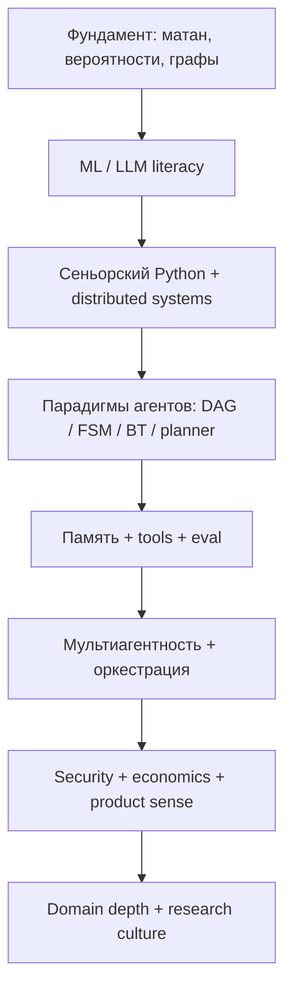

Ведущий специалист по AI-агентам — не тот, кто знает больше фреймворков. Это инженер, который проектирует **агентов как управляемые системы**: с предсказуемым поведением, измеримым качеством, контролируемой стоимостью и явными границами ответственности.

Агент — не «LLM + промпт». Это **runtime + память + инструменты + политика + наблюдаемость + контур обратной связи**. Ниже — карта подготовки, разбитая на блоки. Устойчивость замкнутых контуров и аналогия с фазовым портретом в пространстве смыслов — в отдельной публикации: [Устойчивость agent control loops и фазовый портрет в Embedding Space](/vairl/blog/2026/06/29/agent-control-loop-stability-ru/).

## Что значит «ведущий»

Три критерия, по которым отличают ведущего специалиста от сильного middle/senior:

| Сильный инженер | Ведущий специалист |
|-----------------|----------------|
| Знает LangGraph / CrewAI / AutoGen | Проектирует **state machine продукта** |
| Пишет промпты | Пишет **контракты поведения и eval** |
| Дебажит по логам | Строит **replay и counterfactual testing** |
| «Добавим ещё одного агента» | Сначала спрашивает: **нужен ли агент вообще** |
| Оптимизирует accuracy ответа | Оптимизирует **P(успех) / $** за задачу |

---

## I. Физмат-фундамент (уровень выпускника МФТИ)

Не ради красоты формул, а чтобы **понимать, что оптимизируется** и где ломается интуиция.

### Математический анализ и линейная алгебра

Градиенты, выпуклость, условная оптимизация (Lagrange, KKT — хотя бы на уровне интуиции). Собственные значения, SVD, low-rank аппроксимации. Нормы и Lipschitz-непрерывность — почему «маленький шаг» в оптимизации и RL имеет смысл.

### Теория вероятностей и статистика

Условные вероятности, байесовский вывод. MLE, MAP, bias–variance. Доверительные интервалы и проверка гипотез — основа **eval-культуры**: агент без статистики неотличим от агента с удачной демо-сессией.

### Дискретная математика и теория графов

Графы, деревья, DAG, топологическая сортировка. Динамическое программирование. Сложность алгоритмов — почему «ещё один ReAct-цикл» может стоить экспоненциально по времени и деньгам.

### Теория информации

Энтропия, KL-дивергенция, mutual information. Rate–distortion — интуиция для **сжатия контекста**, summarization и RAG: что можно выбросить, не разрушив задачу.

### Оптимизация и численные методы

SGD и варианты — на уровне понимания, не обязательно тренировки моделей с нуля. Constraint satisfaction, ILP — связь с планированием и schedulers.

### Сигналы и системы (выборочно)

Фильтрация шума, feedback loops, устойчивость. Прямой мост к agent control loops — см. [отдельную статью про устойчивость](/vairl/blog/2026/06/29/agent-control-loop-stability-ru/).

**Практический вывод:** без этого слоя специалист не отличит «магию промпта» от **структурной ошибки в постановке задачи**.

### Материалы для обучения и агента-преподавателя

| Материал | Зачем |
|----------|-------|
| [mipt-physmath-fundamentals.txt](/vairl/assets/docs/mipt-physmath-fundamentals.txt) | 22 дисциплины МФТИ: перечень курсов и тем по математике и физике — карта фундамента блока I |
| [mipt-teacher-agent-instructions.txt](/vairl/assets/docs/mipt-teacher-agent-instructions.txt) | Роутер агента-репетитора: куда направить вопрос, 8 скиллов `teach-*` — готовый системный контекст для coding-агента |

---

## II. ML / LLM-фундамент

Не обязательно быть research scientist, но глубже типичного API-пользователя.

### Transformer и attention

Positional encoding, KV-cache, trade-offs context window. Fine-tuning vs prompting vs RAG vs tool use — **когда что**, а не «всегда RAG».

### Embeddings и retrieval

Dense vs sparse, reranking, chunking. Метрики: recall@k, MRR, nDCG. Понимание того, что retrieval — это **первый контур обратной связи** с внешним знанием.

### Eval для LLM и агентов

Offline vs online eval. LLM-as-judge: когда полезен, когда систематически врёт. Golden datasets, regression suites, counterfactual tests.

### Alignment и ограничения (инженерный уровень)

System prompts, guardrails, policy layers. Prompt injection как threat model, а не как «edge case».

---

## III. Python на уровне сеньора

### Язык и runtime

`asyncio`, concurrency vs parallelism. Typing (`Protocol`, `Generic`, `TypedDict`), mypy/pyright в CI. Context managers, descriptors — когда код агента должен читаться как библиотека, а не как скрипт.

### Архитектура

Ports & adapters, dependency injection. Чистые функции для policy steps; side effects — только на границах. Idempotency, retries, circuit breakers.

### Надёжность и observability

Structured logging, tracing (OpenTelemetry). Метрики: latency, token cost, success rate, tool error rate. Feature flags, graceful degradation.

### Data & infra literacy

PostgreSQL / Redis, очереди (хотя бы одна система глубоко). Docker, базовый K8s, secrets management. CI/CD для agent pipelines.

### Тестирование

Unit tests для детерминированных частей. Contract tests для tools. Simulation / replay tests для trajectories. Property-based testing для парсеров и JSON-схем.

---

## IV. Структуры и методы программирования агентов

Ядро компетенции. Подробнее о трёх классических представлениях — в публикации [Гибридный агент: DAG, FSM и Behavior Tree](/vairl/blog/2026/06/26/hybrid-agent-dag-fsm-behavior-tree/).

### Парадигмы описания поведения

| Парадигма | Сильная сторона | Типичный риск |
|-----------|-----------------|---------------|
| **DAG / workflow** | Параллель, audit trail, LangGraph-пайплайны | Слабая реактивность |
| **FSM / HFSM** | Режимы, compliance, протоколы | Взрыв числа состояний |
| **Behavior Tree** | Reactive control, модульность | Сложность tick-by-tick отладки |
| **Planner + executor** | Долгие задачи, делегирование | Drift плана |
| **Blackboard / shared memory** | Мультиагентность | Race conditions |
| **Actor model** | Масштаб, изоляция | Сложность end-to-end трассировки |

### Классические паттерны

- **ReAct** — observe → think → act
- **Plan-and-Execute** — план отдельно от исполнения
- **Reflexion / self-critique** — цикл улучшения (осторожно с положительной обратной связью)
- **Tool-calling** — schema-first, валидация аргументов до вызова
- **Subagents / supervisor** — иерархия ролей
- **Human-in-the-loop** — approval gates для необратимых действий

### Память агента

| Тип | Содержимое | Типичная реализация |
|-----|------------|---------------------|
| Working | Текущий контекст | Context window, scratchpad |
| Episodic | Траектории сессий | Логи, checkpoint store |
| Semantic | Факты, документы | Vector DB, RAG |
| Procedural | Навыки, playbooks | Skills registry, few-shot banks |

Политики забывания, summarization, compaction — не «оптимизация», а **условие устойчивости** длинных сессий.

### Планирование

Classical planning (STRIPS, PDDL — читать и интегрировать). HTN, temporal planning. LLM-as-planner vs dedicated planner. Нейросимволические пайплайны — см. [LLM → PDDL → критик](/vairl/blog/2026/06/25/neurosymbolic-planning-pipeline/).

### Мультиагентные системы

Роли: planner, critic, executor, researcher. Консенсус vs competition. Shared context vs message passing. Типичные патологии: deadlock, infinite debate, cost explosion.

### Оркестраторы

Знать **глубоко** 2–3 фреймворка, остальные — по контрактам API. Критерии выбора: state model, checkpointing, human interrupts, debuggability — не «что в тренде».

---

## V. То, что часто недооценивают

### Systems design

Backpressure, timeouts, bulkheads. Exactly-once vs at-least-once для tool side effects. Saga patterns для длинных workflows.

### Agent security

Prompt injection, indirect injection через RAG. Tool privilege escalation. Sandboxing. Data exfiltration через агентов.

### Продуктовое мышление

Когда агент **не нужен** — достаточно формы, rule engine или search. Latency budgets, streaming UX. Прозрачность: «что агент сейчас делает».

### Экономика агентов

Token economics, caching, model routing (small/large). **Cost per successful task** — главная метрика. Batch vs interactive trade-offs.

### Domain expertise

Без глубокого понимания предметной области агент элегантно ошибается: финансы, био, юриспруденция, DevOps — **домен не заменяется промптом**.

### Исследовательская культура

Ключевые papers: ReAct, Toolformer, Reflexion, Voyager, SWE-agent. Reproduce baseline перед «улучшением». A/B и ablation mindset. Связь с [синтезом гипотез для агентов](/vairl/blog/2026/06/26/llm-hypothesis-synthesis-agents/).

### Когнитивная наука и кибернетика (лёгкий слой)

BDI-агенты, sense–plan–act. Metasystem transitions — см. [эволюция разума и MST](/vairl/blog/2026/06/23/evolution-mind-mst-swarm/). Ограниченная рациональность: «идеальный рациональный агент» — модель, не цель продакшена.

---

## VI. Чеклист самопроверки

Перед тем как называть систему «продакшен-агентом», ответьте честно:

1. Могу ли я нарисовать FSM сессии и указать режимы recovery / escalation?
2. Есть ли golden eval set с регрессией в CI?
3. Знаю ли я **стоимость одного успешного task** end-to-end?
4. Что произойдёт при prompt injection через документ в RAG?
5. Как восстановить сессию после падения на шаге 7 из 12?
6. Где error signal на каждом шаге control loop?
7. Есть ли лимиты, предотвращающие runaway cost и бесконечные циклы?

Если на половину вопросов ответ «не знаю» — это нормально для старта. Ненормально — не знать, что вопросы существуют.

---

## VII. Roadmap на 12 месяцев

| Квартал | Фокус |
|---------|-------|
| **Q1** | Python async + графы + один оркестратор (например LangGraph) |
| **Q2** | RAG + eval + observability |
| **Q3** | FSM / BT + гибридный оркестратор |
| **Q4** | Multi-agent + security + cost optimization |

Книги и papers — по 3–5 на блок; важнее **один end-to-end проект** с метриками, чем десять туториалов без eval.

---

## Связанные публикации

- [Устойчивость agent control loops и фазовый портрет](/vairl/blog/2026/06/29/agent-control-loop-stability-ru/) — feedback, gain, фазовый портрет и путешествия по Embedding Space
- [Гибридный агент: DAG, FSM, Behavior Tree](/vairl/blog/2026/06/26/hybrid-agent-dag-fsm-behavior-tree/)
- [Нейросимволическое планирование](/vairl/blog/2026/06/25/neurosymbolic-planning-pipeline/)
- [Эволюция агентов и Behavior Tree](/vairl/blog/2026/06/22/agent-evolution-behavior-tree/)
