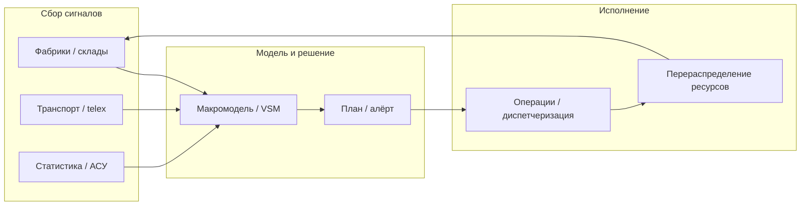
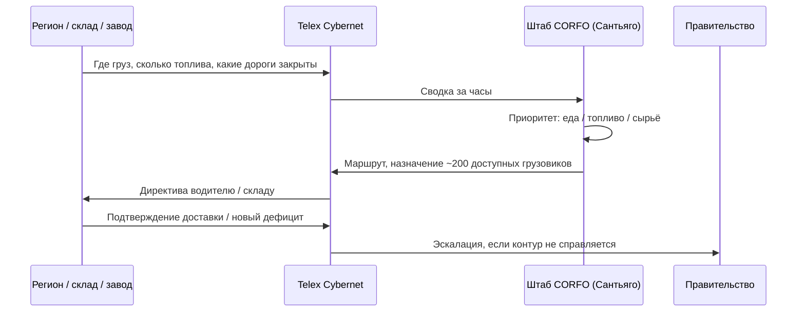
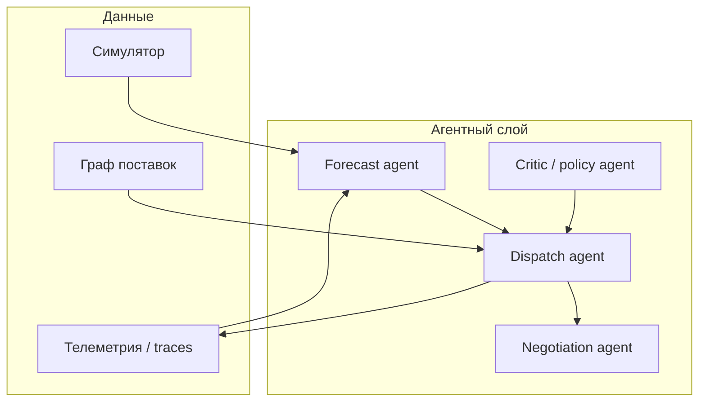

В 1960–70-х годах две амбициозные программы пытались **автоматизировать управление экономикой** с помощью вычислительных сетей и кибернетики: советский **ОГАС** (Виктор Глушков) и чилийский **Project Cybersyn** (Стаффорд Бир, правительство Альенде). Обе системы — не «утопический интернет», а инженерные ответы на вопрос: **как собирать сигналы с предприятий и транспорта, принимать решения о ресурсах и не потерять устойчивость сети**.

Ниже — краткая история, **методология** управления, **библиография со ссылками**, современные аналоги, мост к **исследованию операций (ИО)** и к **агентным / роевым** системам. Связанные темы VAIRL: [пайплайн агентов-ролей](/vairl/blog/2026/07/01/agent-lifecycle-pipeline-ru/), [гибридный оркестратор](/vairl/blog/2026/06/26/hybrid-agent-dag-fsm-behavior-tree-ru/), [телеметрия агентов](/vairl/blog/2026/06/29/agent-telemetry-ru/), [Semantic Torrent](/vairl/blog/2026/07/01/semantic-torrent-vector-search-ru/).

## Две модели одной проблемы

| | **ОГАС (СССР)** | **Cybersyn (Чили, 1971–1973)** |
|---|-----------------|--------------------------------|
| **Архитектор** | Виктор Глушков | Стаффорд Бир (Stafford Beer) |
| **Масштаб** | Вся плановая экономика | Национализированный промышленный сектор (~до 50% ВВП) |
| **Идеология** | Централизованное планирование + АСУ на предприятиях | «Дизайн свободы» — децентрализация внутри социализма |
| **Сеть** | Иерархия: Москва → регионы → ~20 000 узлов | Telex **Cybernet** + мейнфрейм IBM 360/50 |
| **ПО** | Макроэкономические модели, ОКП, диспетчеризация | **Cyberstride** (байесовский фильтр), **CHECO** (симулятор) |
| **Судьба** | Финансирование отклонено ~1970; фрагменты АСУ | Остановлен после переворота 1973 г. |

Общее: **замкнутый контур** «датчики → модель → решение → исполнение», опора на **кибернетику** и **операционные метрики**, а не на интуицию плановика.

---

## ОГАС: методология управления ресурсами

**ОГАС** (Общегосударственная автоматизированная система сбора и обработки информации для учёта, планирования и управления народным хозяйством) — проект с **1962 г.**, формализованный после XXIV съезда КПСС (1971) как национальная программа.

### Архитектура (по Глушкову)

1. **Трёхуровневая сеть**: вычислительный центр в Москве → ~200 региональных центров → терминалы на предприятиях (порядка 20 000 узлов), связь по телефонной инфраструктуре с возможностью peer-to-peer обмена.
2. **Иерархия моделей**: макроэкономические балансы → отраслевые АСУ (АСУП) → оперативное планирование на уровне завода.
3. **Человеко-машинное звено**: Глушков подчёркивал не только математику, но и **организацию труда управленцев** — ОГАС как социотехническая система, не «машина, заменяющая плановиков».

### Управление ресурсами и транспортом

- **Материально-техническое снабжение (МТС)**: учёт потоков сырья и комплектующих, увязка планов производства с логистикой — задачи **балансов** и **транспортных потоков** (родственники задач ИО о **транспортной задаче** и **потоках в сетях**).
- **Оперативно-календарное планирование (ОКП)**: диспетчеризация мощностей, сменные задания — по сути **scheduling** с ограничениями.
- **Нормативы и тарифы**: Глушков обсуждал переход к учёту через электронные взаиморасчёты — инженерный взгляд на **цены как сигнал дефицита** внутри плана.

### Почему не сложилось

Бюрократическое соперничество (Госплан, Минфин, КГБ), страх монополии информации у одного ведомства, недостаток вычислительной мощности — разобрано в академической литературе. Фрагменты **АСУП** на отдельных заводах всё же внедрялись.

---

## Project Cybersyn: методология и транспорт

**Cybersyn** (сокращение от *cybernetics synergy*) — ответ Чили на стрессовую перегрузку экономики (блокада, инфляция) при сохранении **демократических** и **профсоюзных** институтов.

### Компоненты системы

| Модуль | Функция |
|--------|---------|
| **Cybernet** | Сеть telex: двусторонний обмен текстовыми отчётами завод ↔ правительство за часы, не недели |
| **Cyberstride** | Статистика производства, **байесовская фильтрация** аномалий, ранние предупреждения |
| **CHECO** | Экономический симулятор «что если» для политик |
| **Operations room** | Зал с проекциями и кнопками — **human-in-the-loop** для алёртов, не автопилот |

### Viable System Model (VSM)

Бир перенёс **модель жизнеспособной системы** из книги *Brain of the Firm* (1972): пять уровней рекурсии — операции, координация, контроль, разведка (внешняя среда), политика. Цель — **баланс** централизации и автономии цехов, избежать советского «единого мегамозга».

---

## Кейс: забастовка перевозчиков (октябрь 1972)

Самый изученный **реальный** эпизод Cybersyn — не мониторинг заводов в штатном режиме, а **логистический кризис**: национальная **забастовка владельцев грузовиков** (*paro de camioneros*), начавшаяся в **октябре 1972 г.** Оппозиция (конфедерация владельцев грузового транспорта, при поддержке ЦРУ и блокады, по ряду источников) пыталась **остановить экономику**, перекрыть дороги и создать условия для переворота. Правительству Альенде нужно было удержать поставки **продовольствия, топлива и сырья** при резком падении доступного автотранспорта.

По оценке **Густаво Сильвы** (исполнительный секретарь по энергетике в CORFO), сеть telex Cybersyn позволила организовать доставку ресурсов в города, опираясь примерно на **200 грузовиков**, тогда как у бастующих было порядка **40 000** машин, блокировавших подъезды (в т.ч. к Сантьяго). Цифры спорны и восходят к воспоминаниям участников, но направление эффекта подтверждается историографией: система **не заменила** парк транспорта, а **сжала неопределённость** — кто, где и куда может везти груз.

### Контекст кризиса

| Параметр | Значение |
|----------|----------|
| **Когда** | Октябрь 1972 г. (переломный момент правительства Альенде) |
| **Угроза** | Остановка распределения, дефицит продовольствия и топлива, эскалация к перевороту |
| **Масштаб сети** | Telex **Cybernet** расширен **за пределы промышленного сектора** — от Арики до Пунта-Аренас (~5 150 км) |
| **Интенсивность связи** | По оценке Бира — до **~2 000 telex-сообщений в сутки** в пик забастовки |
| **Командный центр** | CORFO, Сантьяго: ~**20 telex-аппаратов** работали одновременно («невыносимый шум», по воспоминанию Бира) |

### Задачи логистики и как их решали

| Задача | Метод / механизм | Инструмент Cybersyn | Роль человека |
|--------|------------------|---------------------|---------------|
| **Узнать, какой транспорт ещё доступен** | Опрос узлов по telex, сводка лояльных перевозчиков и гос. парка | Сеть **Cybernet** (не заводской контур, а расширенный национальный) | Диспетчеры CORFO агрегируют ответы |
| **Приоритизировать критические грузы** | Ручная диспетчеризация по типу груза: еда, топливо, сырьё для промышленности | Приоритетные маршруты в сообщениях telex | Министерства + CORFO задают приоритеты |
| **Направить сырьё и топливо туда, где дефицит** | «Куда ехать» — директивы из центра на основе сводок с мест | Двусторонний telex: запрос → ответ за часы, не недели | Энергетический блок (Сильва) и отраслевые штабы |
| **Обойти заблокированные дороги** | Сбор полевой информации о проходимости трасс | Сообщения о **закрытых и открытых** маршрутах по стране | Водители и региональные координаторы — датчики среды |
| **Синхронизировать регионы** | Вертикаль (правительство) + горизонталь (заводы, склады, транспорт) | Тот же Cybernet, изначально задуманный для заводов | VSM: координация без единого «автопилота» |
| **Реагировать на меняющуюся обстановку** | Итеративные циклы «данные → решение → новая директива» | **Real-time adaptive management** (термин Medina) | Operations room / штаб CORFO — human-in-the-loop |

### Что система **не** делала

Важно не романтизировать Cybersyn:

- **Не** решала транспортную задачу (VRP) оптимизатором на мейнфрейме — это была **координация связью**, не автоматический solver маршрутов.
- **Не** защищала грузовики от физических атак оппозиции (повторная забастовка **август 1973** снова использовала telex, но насилие на дорогах система не отменяла).
- **Не** устраняла макро-причины кризиса: инфляция, блокада, падение цен на медь — после октября 1972 правительство оказалось в **постоянной обороне** ([Medina, MIT Press Reader](https://thereader.mitpress.mit.edu/project-cybersyn-chiles-radical-experiment-in-cybernetic-socialism/)).

Историк **Eden Medina** (глава 5 *Cybernetic Revolutionaries*) трактует октябрь 1972 как доказательство: **технология связи может изменить траекторию политики**, сделав возможными действия, которые без сети были бы недостижимы — но не заменяет социальные конфликты.

### Урок для современной логистики

Аналог 2020-х — не «один AI на весь склад», а **control tower** + телеметрия + диспетчер с полномочиями:

1. **Sense** — где машины, грузы, закрытые рёбра графа (тогда telex, сейчас GPS/TMS/API).
2. **Decide** — приоритеты критических потоков (еда, энергия, медицина).
3. **Act** — короткий цикл директив; обратная связь с поля.
4. **Human** — штаб принимает компромиссы, когда данных недостаточно.

Это прямой мост к [телеметрии агентов](/vairl/blog/2026/06/29/agent-telemetry-ru/) и разделу «Роевой интеллект в логистике» ниже: Cybersyn в 1972 — **центральный координатор + распределённые датчики**, не монолитный ОГАС.

### Источники по кейсу 1972

| Источник | Что подтверждает | Ссылка |
|----------|------------------|--------|
| Eden Medina, *Cybernetic Revolutionaries* (гл. 5) | Кризис, расширение Cybernet, выживание правительства | [MIT Press](https://mitpress.mit.edu/9780262525961/cybernetic-revolutionaries/) |
| Eden Medina, MIT Press Reader | ~2 000 telex/сутки, 20 аппаратов в CORFO, топливо/сырьё/дороги | [thereader.mitpress.mit.edu](https://thereader.mitpress.mit.edu/project-cybersyn-chiles-radical-experiment-in-cybernetic-socialism/) |
| Eden Medina, JLAS (2006) | История проекта, политический контекст | [Cambridge Core](https://www.cambridge.org/core/journals/journal-of-latin-american-studies/article/abs/designing-freedom-regulating-a-nation-socialist-cybernetics-in-allendes-chile/4CF75E30D22554152A5EFDC9740E3440) · [PDF](https://web.mit.edu/esd.83/www/papers/Medina_Cybersyn.pdf) |
| Wikipedia (цит. Gustavo Silva) | ~200 грузовиков vs забастовка владельцев | [Project Cybersyn](https://en.wikipedia.org/wiki/Project_Cybersyn) |
| Morozov, MDPI Humanities (2018) | ~200 vs ~40 000, продовольствие в Сантьяго | [mdpi.com](https://www.mdpi.com/2076-0760/7/4/65) |
| Andy Beckett, *The Guardian* (2003) | Обзор «социалистического интернета», контекст забастовки | [theguardian.com](https://www.theguardian.com/technology/2003/sep/08/science.chile) |

*Примечание:* точные числа грузовиков — из **ретроспективных** интервью (Сильва и др.); в академической литературе акцент на **механизме** (telex + диспетчеризация + приоритеты), а не на статистической точности парка.

---

## Библиография: ОГАС

| Публикация | Автор / источник | Ссылка |
|------------|------------------|--------|
| *Макроэкономические модели и принципы построения ОГАС* (1975) | В. М. Глушков | [Архив на glushkov.su](https://glushkov.su/eng/science/makroekonomicheskie-modeli-i-printsipy-postroeniia-ogas) |
| «Проблемы широкого внедрения вычислительной техники…» (1964) | Н. П. Федоренко, В. М. Глушков | *Вопросы экономики*, № 7 — [Cambridge Core (цит.)](https://www.cambridge.org/core/journals/slavic-review/article/abs/technology-and-decision-making-some-aspects-of-the-development-of-ogas/FFEFA2B42F3F9EBB5556BF56DED43375) |
| *Technology and Decision Making: Some Aspects of the Development of OGAS* (1975) | Joseph R. Filippi | [Slavic Review](https://www.cambridge.org/core/journals/slavic-review/article/abs/technology-and-decision-making-some-aspects-of-the-development-of-ogas/FFEFA2B42F3F9EBB5556BF56DED43375) |
| *How Not to Network a Nation* (2016) | Benjamin Peters | [MIT Press](https://direct.mit.edu/books/monograph/3470/How-Not-to-Network-a-NationThe-Uneasy-History-of) |
| *Общегосударственная автоматизированная система управления* (1972) | Д. Г. Жимерин | Упоминается в [Slavic Review](https://www.cambridge.org/core/journals/slavic-review/article/abs/technology-and-decision-making-some-aspects-of-the-development-of-ogas/FFEFA2B42F3F9EBB5556BF56DED43375) |
| Обзор идеи Глушкова | В. Пихорович | [Cosmonaut](https://cosmonautmag.com/2022/07/glushkov-and-his-ideas-cybernetics-of-the-future-by-vasiliy-pikhorovich/) |
| Энциклопедическая справка | — | [Wikipedia: OGAS](https://en.wikipedia.org/wiki/OGAS) |
| Предшественник: Китов, АСУ (1959) | — | [Wikipedia: OGAS § Kitov](https://en.wikipedia.org/wiki/OGAS) |

---

## Библиография: Cybersyn

| Публикация | Автор | Ссылка |
|------------|-------|--------|
| *Designing Freedom, Regulating a Nation: Socialist Cybernetics in Allende's Chile* (2006) | Eden Medina | [Journal of Latin American Studies](https://www.cambridge.org/core/journals/journal-of-latin-american-studies/article/abs/designing-freedom-regulating-a-nation-socialist-cybernetics-in-allendes-chile/4CF75E30D22554152A5EFDC9740E3440) · [PDF](https://web.mit.edu/esd.83/www/papers/Medina_Cybersyn.pdf) |
| *Cybernetic Revolutionaries* (2011) | Eden Medina | [MIT Press](https://mitpress.mit.edu/9780262525961/cybernetic-revolutionaries/) |
| *Brain of the Firm* (1972) | Stafford Beer | [Wiley / обзор VSM](https://en.wikipedia.org/wiki/Viable_system_model) |
| *Platform for Change* (1975) | Stafford Beer | Кибернетика управления и демократия |
| *Cybernetics of Governance: The Cybersyn Project 1971–1973* (2014) | Raúl Espejo | Участник проекта; цитируется в [PDX Working Paper 67](https://pdxscholar.library.pdx.edu/cgi/viewcontent.cgi?article=1069&context=econ_workingpapers) |
| *Insights into Project Cybersyn* (Working Paper 67) | Augustine | [Portland State](https://pdxscholar.library.pdx.edu/cgi/viewcontent.cgi?article=1069&context=econ_workingpapers) |
| Обзор для широкой аудитории | Eden Medina | [Cabinet Magazine](https://cabinetmagazine.org/issues/46/medina.php) |
| *The Cybernetic Brain* (2010) | Andrew Pickering | История Бира и кибернетики |
| Beyond Cybersyn в Латинской Америке (2025) | — | [Systemic Practice and Action Research](https://link.springer.com/article/10.1007/s11213-025-09717-2) |
| Справка | — | [Wikipedia: Project Cybersyn](https://en.wikipedia.org/wiki/Project_Cybersyn) |

---

## Связь с исследованием операций

ОГАС и Cybersyn — **инженерные воплощения ИО**, даже если термин «operations research» не всегда звучал в советских документах:

| Задача ИО | ОГАС | Cybersyn | Классические методы |
|-----------|------|----------|---------------------|
| Баланс ресурсов | Межотраслевые балансы, МТС | Мониторинг нац. сектора | Линейное программирование (Данциг), input–output (Леонтьев) |
| Транспорт и потоки | Ж/д, автотранспорт в плане | Забастовка перевозчиков, окт. 1972: telex-диспетчеризация | Транспортная задача, max-flow, min-cost flow |
| Диспетчеризация | ОКП на заводах | Алёрты Cyberstride | Job shop scheduling, CP-SAT |
| Прогноз и аномалии | Макропрогнозы | Байесовские фильтры | Экспоненциальное сглаживание, Kalman, control charts |
| Симуляция политик | Сценарии плана | CHECO | Системная динамика (Форрестер), discrete-event simulation |

**Ключевой урок ИО:** оптимальность зависит от **модели** и **данных**. ОГАС упёрся в политику и вычисления; Cybersyn — в масштаб и переворот; оба показали, что **контур управления** важнее мощности одного мейнфрейма.

---

## Современные аналоги

| Слой | Примеры сегодня | Наследие ОГАС / Cybersyn |
|------|-----------------|---------------------------|
| **ERP / планирование** | SAP S/4HANA, Oracle SCM, 1С | АСУП, учёт, MRP II |
| **Control tower** | Blue Yonder, Kinaxis, o9 Solutions | Единая картина цепочки + алёрты |
| **Цифровые двойники** | Siemens, Azure Digital Twins | CHECO-симуляции |
| **Real-time logistics** | WMS/TMS, GPS-трекинг, Amazon robotics | Cybernet + диспетчеризация |
| **Государственные платформы** | Единые реестры, таможенные EDI | ОГАС как «нац. шина данных» |
| **Децентрализованный обмен** | P2P, federated learning | Идея сети узлов без единого владельца — см. [Semantic Torrent](/vairl/blog/2026/07/01/semantic-torrent-vector-search-ru/) |

Отличие эпохи: данные **потоковые**, модели **стохастические**, решения часто **локальные** с глобальными ограничениями — но цикл sense → decide → act тот же.

---

## Переход к агентным системам ИИ

Современный стек — не один мейнфрейм, а **рой специализированных агентов** с tools:

| Роль кибернетики | Агентный аналог |
|------------------|-----------------|
| Сбор telex / АСУ | [Телеметрия](/vairl/blog/2026/06/29/agent-telemetry-ru/), OTel, event bus |
| Cyberstride (аномалии) | Агент-монитор + embedding-поиск похожих инцидентов |
| Operations room | Human-in-the-loop UI + алёрты |
| VSM уровни | [Пайплайн ролей](/vairl/blog/2026/07/01/agent-lifecycle-pipeline-ru/): Prototyper → Builder → Maintainer |
| Макромодель ОГАС | Planner-агент + симулятор + critic |

**Риски те же, что у Cybersyn и ОГАС:** положительная обратная связь (агенты усиливают ошибку), устаревшие наблюдения, «оптимизация метрики, не цели» — см. [устойчивость control loops](/vairl/blog/2026/06/29/agent-control-loop-stability-ru/).

---

## Роевой интеллект в логистике и распределении ресурсов

**Роевой интеллект (swarm intelligence)** — координация множества простых агентов **локальными правилами** без единого диктатора. Это ближе к **VSM Бира**, чем к монолитному ОГАС:

| Метод | Идея | Логистика / ресурсы |
|-------|------|---------------------|
| **Ant Colony Optimization (ACO)** | Феромоны на рёбрах графа | Vehicle Routing Problem (VRP), маршруты доставки |
| **Particle Swarm (PSO)** | Частицы в пространстве решений | Распределение складов, load balancing |
| **Stigmergy** | Косвенная координация через среду | WMS: метки ячеек, приоритеты заказов |
| **Auction / market-based** | Локальные ставки на задачи | Распределение вычислений, drone fleet |
| **Consensus / gossip** | Согласование без центра | [Semantic Torrent](/vairl/blog/2026/07/01/semantic-torrent-vector-search-ru/): поиск ресурсов в рое |

### Гибрид: центр + рой

Практичная схема для 2020-х:

1. **Стратегический слой** (OGAS-подобный): LP/MIP на агрегатах — квоты, балансы, контракты с поставщиками.
2. **Тактический слой** (Cybersyn-подобный): control tower, алёрты, human approval на отклонениях.
3. **Операционный рой**: тысячи агентов-исполнителей (склады, курьеры, роботы) решают **локальный VRP** с ограничениями сверху.

Мультиагентное RL и LLM-агенты с tools — новая реализация среднего слоя: агент **переговаривается** с API склада, TMS и прогнозом спроса, но **критик** и **Maintainer** держат инварианты (SLO, бюджет, safety).

Черновик VAIRL про рои и метасистемные переходы — в работе: [эволюция разума и MST](/vairl/blog/2026/06/23/evolution-mind-mst-swarm/) (*draft*).

---

## Выводы для проектирования систем

1. **Сеть важнее монолита** — ОГАС проиграл бюрократии; Cybersyn выиграл гибкость telex при скромных ресурсах.
2. **Модель + данные + человек** — operations room и «человеко-машинное звено» Глушкова не устарели.
3. **ИО даёт язык** для балансов, потоков и расписаний; кибернетика — язык **устойчивости** и **рекурсии** (VSM).
4. **Агенты** — наследники АСУ и Cyberstride: непрерывный мониторинг, локальные решения, глобальные ограничения.
5. **Рой** — для масштаба, где центральный solver не тянет; нужен **мета-агент** (policies, eval), иначе хаос.

## Further reading

- [Пайплайн агентов: Prototyper → Maintainer](/vairl/blog/2026/07/01/agent-lifecycle-pipeline-ru/) — роли в жизненном цикле автоматизированных систем
- [Телеметрия AI-агентов](/vairl/blog/2026/06/29/agent-telemetry-ru/) — современный «Cybernet» трасс
- [Нейросимволическое планирование](/vairl/blog/2026/06/25/neurosymbolic-planning-pipeline/) — LLM + символьный планировщик (*draft*)
- Eden Medina, [Cybernetic Revolutionaries](https://mitpress.mit.edu/9780262525961/cybernetic-revolutionaries/) — каноническая монография по Cybersyn
- Benjamin Peters, [How Not to Network a Nation](https://direct.mit.edu/books/monograph/3470/How-Not-to-Network-a-NationThe-Uneasy-History-of) — каноническая монография по ОГАС
