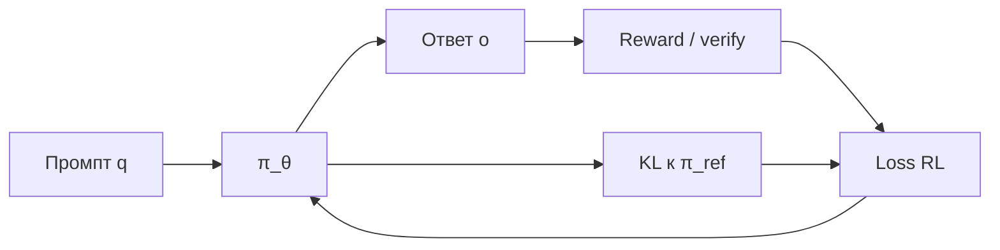
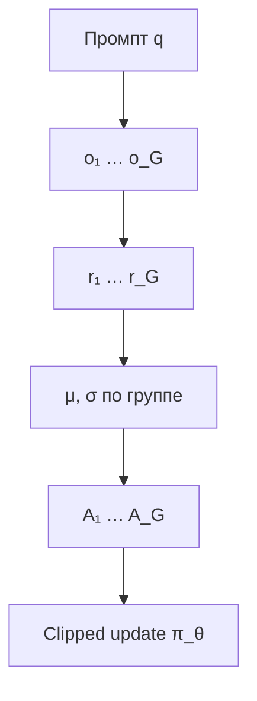

**PPO** (Proximal Policy Optimization) — стандарт actor-critic RL, на котором годами строили **RLHF** для LLM. **GRPO** (Group Relative Policy Optimization), предложенный в [DeepSeekMath](https://arxiv.org/abs/2402.03300), убирает отдельную сеть-критик и оценивает **относительное качество** нескольких ответов на один промпт — с экономией памяти порядка **~50%** и масштабируемостью для reasoning-моделей (DeepSeek-R1 и др.).

Ниже — сравнительный анализ: архитектура, формулы, плюсы/минусы, связь с **RLVR** (verifiable rewards) и **устойчивостью** обучающего контура. Связанные материалы VAIRL: [устойчивость control loops](/vairl/blog/2026/06/29/agent-control-loop-stability-ru/), [генерация бенчмарков](/vairl/blog/2026/06/29/agent-benchmark-generation-ru/), [карта компетенций агент-разработчика](/vairl/blog/2026/06/29/best-ai-agent-specialist-ru/).

## Зачем RL после SFT

После supervised fine-tuning (SFT) модель имитирует демонстрации, но не оптимизирует **скалярную цель** (правильность, безопасность, краткость). RL-этап максимизирует ожидаемую награду при ограничении отклонения от референсной политики $\pi_{\mathrm{ref}}$ (обычно SFT-чекпоинт):

| Компонент | Роль |
|-----------|------|
| **Policy** $\pi_\theta$ | Обучаемая LLM |
| **Reward** | RM (RLHF) или верификатор (RLVR: математика, код, unit tests) |
| **Reference** $\pi_{\mathrm{ref}}$ | KL-якорь против «разгона» политики |

---

## PPO: actor-critic для LLM

[PPO](https://arxiv.org/abs/1707.06347) (Schulman et al., 2017) — on-policy алгоритм с **ограниченным шагом** обновления (clipped surrogate).

### Три сети в классическом RLHF

1. **$\pi_\theta$** — policy (LLM), обучается.
2. **$V_\gamma$** — **critic** (value function), оценивает ожидаемую награду от **частичного** ответа; обучается **вместе** с политикой.
3. **$R_\phi$** — reward model, обычно **заморожен** после отдельного этапа обучения.

Проблема в контексте LLM: награда часто приходит **только на последнем токене** (scalar от RM или verifier). Критик должен предсказывать «ценность» на **каждом** токене цепочки — шумно и дорого по VRAM (вторая сеть размера модели).

### Advantage и GAE

**Advantage** $A_t$ показывает, насколько действие лучше среднего:

$$
A_t = Q(s_t, a_t) - V(s_t)
$$

На практике используют **GAE** (Generalized Advantage Estimation). Сначала TD-ошибка:

$$
\delta_t = r_t + \gamma V(s_{t+1}) - V(s_t)
$$

Затем экспоненциально взвешенная сумма:

$$
\hat{A}_t^{\mathrm{GAE}} = \sum_{l=0}^{\infty} (\gamma \lambda)^l \, \delta_{t+l}
$$

**Clipped objective** (идея PPO):

$$
L^{\mathrm{CLIP}}(\theta) = \mathbb{E}_t \left[ \min\left( r_t(\theta) A_t,\ \mathrm{clip}\bigl(r_t(\theta), 1-\epsilon, 1+\epsilon\bigr) A_t \right) \right]
$$

где $r_t(\theta) = \dfrac{\pi_\theta(a_t \mid s_t)}{\pi_{\theta_{\mathrm{old}}}(a_t \mid s_t)}$.

Полная цель RLHF обычно включает KL-штраф к $\pi_{\mathrm{ref}}$:

$$
L^{\mathrm{PPO}}(\theta) = L^{\mathrm{CLIP}}(\theta) - \beta \, D_{\mathrm{KL}}\!\left(\pi_\theta \,\|\, \pi_{\mathrm{ref}}\right)
$$

| Сильные стороны PPO | Слабые стороны для LLM |
|---------------------|-------------------------|
| Зрелая экосистема (TRL, OpenRLHF) | **2×** память на critic |
| Токен-level credit assignment (GAE) | Критик устаревает при быстрой смене π |
| Clipping стабилизирует шаг | Сложнее при sparse terminal reward |

---

## GRPO: групповой baseline без критика

[GRPO](https://arxiv.org/abs/2402.03300) (Shao et al., 2024, DeepSeekMath) сохраняет **PPO-style clipping** и KL к $\pi_{\mathrm{ref}}$, но заменяет критик на **групповую статистику**.

### Алгоритм

1. Для промпта $q$ сэмплировать **$G$** полных ответов $\{o_1,\ldots,o_G\}$ из $\pi_{\theta_{\mathrm{old}}}$.
2. Получить награды $\{r_1,\ldots,r_G\}$ (RM или verifiable).
3. Нормализовать внутри группы:

$$
A_i = \frac{r_i - \mathrm{mean}(\mathbf{r})}{\mathrm{std}(\mathbf{r})}
$$

4. Один и тот же $A_i$ применяется ко **всем токенам** ответа $o_i$ (outcome supervision).
5. Оптимизировать clipped surrogate + KL-штраф:

$$
J_{\mathrm{GRPO}}(\theta) = \mathbb{E}_{q,\,\{o_i\}} \left[ \frac{1}{G}\sum_{i=1}^{G} \min\!\left( \rho_i A_i,\ \mathrm{clip}(\rho_i,\, 1-\epsilon,\, 1+\epsilon)\, A_i \right) \right] - \beta \, D_{\mathrm{KL}}\!\left(\pi_\theta \,\|\, \pi_{\mathrm{ref}}\right)
$$

где $\rho_i = \dfrac{\pi_\theta(o_i \mid q)}{\pi_{\theta_{\mathrm{old}}}(o_i \mid q)}$.

**Интуиция:** критик заменён на вопрос «этот ответ лучше или хуже **среднего по группе** на том же промпте?» — Monte-Carlo baseline с **нулевой дополнительной сетью**.

### Почему это дешевле

| | PPO | GRPO |
|---|-----|------|
| Обучаемые сети | $\pi$ + **$V$** | только **$\pi$** |
| VRAM (типично) | ~2× модель | ~1× + batch из $G$ сэмплов |
| Inference на шаг | 1 rollout | **$G$** rollouts на промпт |
| Baseline | $V(s_t)$ learned | $\mathrm{mean}(r)$ по группе |

Экономия на **памяти**; **вычисление** смещается в сторону большего числа генераций — выгодно, когда verifiable reward дешёв, а critic дорог.

---

## Сравнительная таблица

| Критерий | PPO | GRPO |
|----------|-----|------|
| **Год / источник** | Schulman 2017 | Shao et al. 2024 (DeepSeekMath) |
| **Credit assignment** | Потокенный (GAE) | На весь ответ (outcome) |
| **Baseline** | Critic $V_\gamma$ | Среднее по группе |
| **Variance reduction** | GAE, value loss | Whitening r в группе |
| **Лучше при** | Dense/shaped rewards, RLHF-RM | RLVR, math/code, бинарные награды |
| **Риски** | Bias критика, drift V | Малый G → шумная σ; collapse группы |
| **Варианты** | PPO + RLHF стандарт | Dr. GRPO, DAPO, RLOO |

---

## RLVR и verifiable rewards

GRPO особенно силён в **RL with Verifiable Rewards (RLVR)**: награда 0/1 или частичная от **проверки** (ответ в GSM8K, компиляция кода, formal proof).

- Не нужен отдельный RM на миллиарды параметров.
- Группа ответов на **один** вопрос даёт естественный ранжир: часть верна, часть нет → сигнал для policy gradient.
- Связь с [генерацией бенчмарков](/vairl/blog/2026/06/29/agent-benchmark-generation-ru/): eval-набор = источник промптов и верификаторов.

Теоретический разбор динамики GRPO при RLVR: [arXiv:2503.06639](https://arxiv.org/html/2503.06639v4).

---

## Устойчивость как control loop

Обучение RL — **замкнутый контур**: π → rollout → reward → update → π.

| Элемент control theory | PPO | GRPO |
|------------------------|-----|------|
| **Gain** | Шаг η, ε clip | То же + размер G |
| **Наблюдение** | V(s) на каждом токене | Только terminal r |
| **Положительная ОС** | Ошибка критика → неверный $A$ | Все $r_i$ в группе одинаковы → $\sigma \to 0$ |
| **Демпфирование** | Clipping, KL, GAE $\lambda$ | Clipping, KL, whitening |
| **Задержка** | Критик отстаёт от $\pi$ | Нет критика; lag только в $\pi_{\mathrm{old}}$ |

См. [устойчивость agent control loops](/vairl/blog/2026/06/29/agent-control-loop-stability-ru/): GRPO убирает один источник положительной обратной связи (ошибочный critic), но добавляет чувствительность к **дисперсии группы**.

**Практические стабилизаторы GRPO:** достаточный $G$ (8–64), clip $\epsilon \approx 0.1\text{–}0.2$, KL penalty, dynamic sampling (отбрасывать группы с $\mathrm{std}(\mathbf{r})=0$), варианты без деления на $\sigma$ (Dr. GRPO).

---

## Варианты и эволюция

| Метод | Отличие |
|-------|---------|
| **Dr. GRPO** | Убрать нормализацию на σ — только mean baseline |
| **DAPO** | Масштабные engineering-твики, иногда без KL к ref |
| **RLOO / REINFORCE leave-one-out** | Похожая идея leave-one-out baseline |
| **PPO + RLHF** | По-прежнему baseline в ChatGPT-классе пайплайнов с RM |

Теория: GRPO gradient как [U-statistic](https://arxiv.org/html/2603.01162v1) — асимптотически близок к oracle с истинным критиком при росте G.

### Интерактив: архитектура и advantage

Переключите **PPO / GRPO** и нажимайте **«Следующий шаг»**: слева — схема сетей и полоса VRAM; справа — группа ответов (GRPO) или кривая критика и GAE по токенам (PPO).

  

    
Сравнение циклов выравнивания: PPO держит критик <code>Vγ</code>; GRPO заменяет его групповым baseline по наградам <code>ri</code> на одном промпте.

  

  

    <button type="button" data-rl-mode="grpo" class="active">GRPO</button>
    <button type="button" data-rl-mode="ppo">PPO</button>
    <button type="button" class="rl-step-btn" data-rl-step>Следующий шаг →</button>
  

  

  

    <canvas id="grpo-ppo-canvas"></canvas>
  

  

---

## Когда что выбирать

| Сценарий | Рекомендация |
|----------|--------------|
| RLHF с дорогим RM, нужен token-level shaping | **PPO** + зрелый стек |
| Math / code / formal verify, бинарная награда | **GRPO** / RLVR |
| Ограниченная VRAM на кластере | **GRPO** (нет critic) |
| Много промптов, дешёвая генерация | **GRPO** (G сэмплов параллельно) |
| Продукт с human preference без верификатора | **PPO** + RM, возможно hybrid |

В продакшен-агентах RL-этап — часть [пайплайна ролей](/vairl/blog/2026/07/01/agent-lifecycle-pipeline-ru/): Builder внедряет, Maintainer следит за drift политики, eval из [телеметрии](/vairl/blog/2026/06/29/agent-telemetry-ru/) ловит регрессии после обновления $\pi_\theta$.

---

## Практический чеклист

1. **$\pi_{\mathrm{ref}}$** — зафиксировать SFT-чекпоинт для KL.
2. **Reward** — явный контракт: RM vs verifier vs hybrid.
3. **PPO:** инициализировать $V$ от RM; мониторить value loss и explained variance.
4. **GRPO:** $G \geq 8$; фильтровать группы с $\mathrm{std}(\mathbf{r})=0$; логировать распределение $A_i$.
5. **Общее:** clip $\epsilon$, KL budget, [бенчмарк](/vairl/blog/2026/06/29/agent-benchmark-generation-ru/) до/после RL.

## Further reading

- [DeepSeekMath / GRPO](https://arxiv.org/abs/2402.03300) — оригинальная статья
- [PPO](https://arxiv.org/abs/1707.06347) — Schulman et al.
- [Hugging Face LLM Course: GRPO](https://huggingface.co/learn/llm-course/en/chapter12/3a)
- [PPO & GRPO guide](https://yugeten.github.io/posts/2025/01/ppogrpo/) — Yuge Shi
- [GRPO dynamics under RLVR](https://arxiv.org/html/2503.06639v4)
- [Demystifying GRPO (U-statistic)](https://arxiv.org/html/2603.01162v1)
- [Устойчивость control loops](/vairl/blog/2026/06/29/agent-control-loop-stability-ru/)
