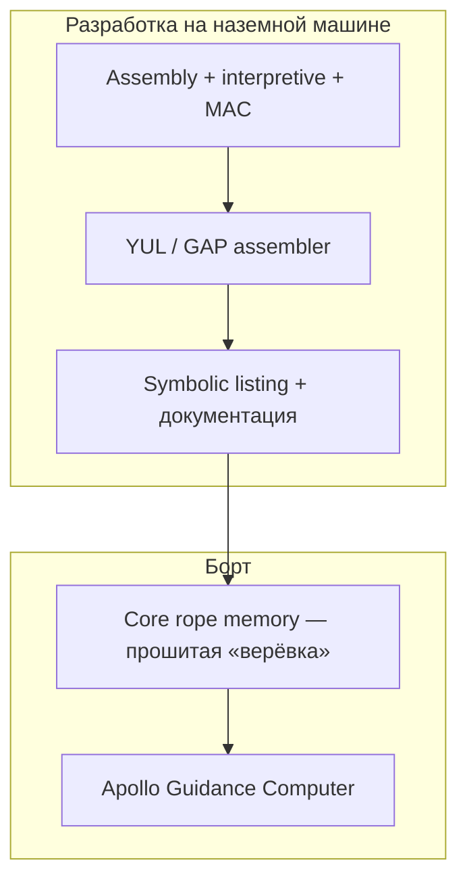
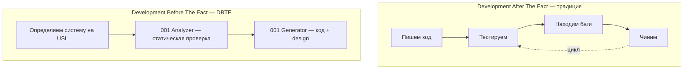
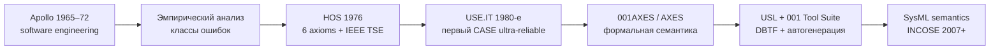
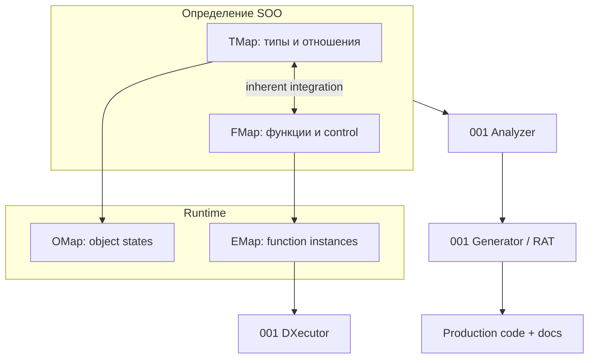
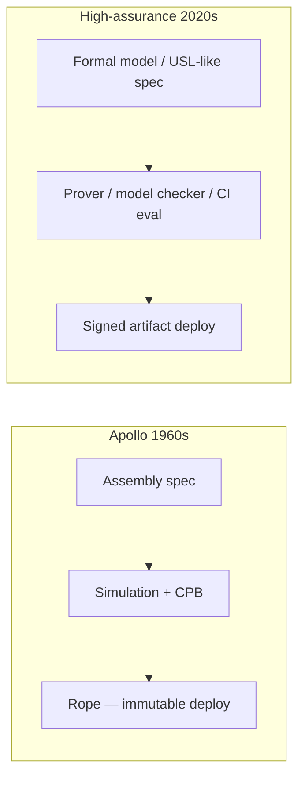

**Маргарет Гамильтон** (Margaret Hamilton, род. 1936) — один из архитекторов современной инженерии ПО. В MIT Instrumentation Laboratory она возглавила разработку **бортового ПО Apollo Guidance Computer (AGC)** для программы «Аполлон» и позже сформулировала подход, который лёг в основу **Universal Systems Language (USL)** — языка и методологии, где ошибки **предотвращаются на этапе проектирования**, а не ищутся после релиза.

Ниже — краткая биография, языки Apollo, процесс верификации космического кода, **эволюция методов надёжности** от «тестировать до смерти» к **Development Before The Fact**, подробно — **как работает USL**, и современные аналоги. Связанные темы VAIRL: [телеметрия агентов](/vairl/blog/2026/06/29/agent-telemetry-ru/), [генерация бенчмарков](/vairl/blog/2026/06/29/agent-benchmark-generation-ru/), [устойчивость control loops](/vairl/blog/2026/06/29/agent-control-loop-stability-ru/).

<figure style="margin: 2em auto; text-align: center;">
  
  <figcaption style="font-size: 0.9em; color: #666; max-width: 640px; margin: 0 auto;">Маргарет Гамильтон с кодом Apollo — символ масштаба и дисциплины документирования каждой строки. Фото: <a href="https://thecode.media/">thecode.media</a></figcaption>
</figure>

## Кто такая Маргарет Гамильтон

| Этап | Роль |
|------|------|
| **1960–63** | Lincoln Laboratory, система ПВО **SAGE** — первый опыт с отказоустойчивым ПО в реальном времени |
| **1965–72** | MIT Instrumentation Lab → Director of **Software Engineering Division**; ПО для CM, LM и Skylab |
| **1969** | Команда Гамильтон — **Priority Displays** и restart-логика; Apollo 11 пережил alarm 1202 и продолжил посадку |
| **1976** | Основала **Higher Order Software** (HOS) |
| **1986** | **Hamilton Technologies** — USL и **001 Tool Suite** |
| **2016** | Presidential Medal of Freedom |

Гамильтон ввела термин **«software engineering»** (инженерия программного обеспечения), чтобы разработка ПO получила тот же статус дисциплины, что и аппаратная инженерия: правила, ревью, трассируемость, формальные уровни тестирования. До Apollo «программист» часто писал код без отдельной инженерной методологии.

---

## Apollo: на каком языке писали код

ПО для AGC **не писали на USL** — этот язык появился позже, как обобщение уроков Apollo. В 1960-х использовали стек, заточенный под **~2 KB RAM** и **read-only core rope memory**:

| Компонент | Описание |
|-----------|----------|
| **AGC assembly (AGC4)** | Низкоуровневый ассемблер для 15-битной архитектуры AGC; инструкции вроде `TC`, `CCS`, `INDEX`; ассемблировался системой **YUL** / **GAP** |
| **Interpretive language** | «Интерпретируемый» слой поверх ассемблера: векторная математика, тригонометрия, линейное адресное пространство — одна interpretive-инструкция заменяет много assembly-кода |
| **MAC (MIT Algebraic Compiler)** | Алгебраические выражения → assembly; ускорял написание навигационных расчётов |
| **Executive / OS AGC** | Планировщик с **приоритетами задач** (priority scheduling), прерывания, restart — инфраструктура, без которой невозможна была error recovery |

Типичная программа — **смесь** assembly и interpretive-блоков: критичные по времени участки на ассемблере, навигация и математика через interpreter.



**Core rope memory** — программа физически **прошивалась** в магнитные кольца проводами («rope mother»). Исправить баг после изготовления модуля — недели работы. Отсюда культ **«сделать правильно до прошивки»**: исчерпывающая симуляция, ревью и многоуровневая верификация.

---

## Как проверяли надёжность кода Apollo

Гамильтон описывает **шесть формальных уровней** тестирования и набор «software engineering techniques» — правила, инструменты и процессы для ultra-reliable ПO в разработке и в полёте.

### Процесс верификации

| Этап | Что делали |
|------|------------|
| **Unit / module tests** | Специализированные тест-программы на симуляторе AGC |
| **Digital simulation** | Полная симуляция траектории и логики на наземных машинах |
| **Analog / hybrid simulation** | Связка с реальным железом AGC в контурe |
| **Code review + documentation** | Каждая строка с объяснением; **Computer Program Board** (CPB) — формальное одобрение |
| **Manufacturing verification** | Перфолента → прошивка rope → контроль symbolic listing против модуля |
| **Flight software integration** | CM + LM + systems software; регрессия при каждом изменении |

Документация включала **Computer Program Assembly Drawing**, symbolic listing (MH 1800), TDRR (Technical Data Release Record) — тот самый «гор stack бумаги», который виден на знаменитой фотографии.

### Error detection и recovery

Команда Гамильтон разработала:

- **Priority Displays** — асинхронные дисплеи с приоритетом над фоновыми задачами;
- **Restart / re-entry** — при перегрузке или ошибке система **сбрасывала** неважные задачи и продолжала критичные;
- **1202 alarm (Apollo 11)** — радарная задача перегрузила CPU; executive отбросил lower-priority work, посадка продолжилась.

Это не «магия assembler'а», а **архитектура управления**: планировщик + явные приоритеты + доказанная процедура восстановления — прямой предок современных watchdog и graceful degradation.

---

## Эволюция software engineering: от Apollo к USL

Гамильтон не остановилась на успехе Apollo. После программы она провела **эмпирический анализ** всего жизненного цикла flight software — не «что сломалось», а **какие классы ошибок повторяются** и как их **запретить структурой системы**, а не бесконечным тестированием.

### Что показал анализ Apollo

| Наблюдение | Вывод для будущих методологий |
|------------|------------------------------|
| **~75%** найденных ошибок — **интерфейсные** (data flow, приоритеты, timing между модулями) | Главный враг — не «опечатка в строке», а **стык** между компонентами |
| **~50%** бюджета жизненного цикла — симуляция, но **44%** ошибок нашли **вручную** (eyeballing) | Нужна **статическая** автоматизация, не только dynamic sim |
| **~60%** ошибок уже **летали** в космосе до обнаружения | Ошибки могут быть тонкими годами; надёжность — свойство **определения** системы |
| Приоритеты и асинхронность — суть real-time, а не «дополнение к синхронному коду» | Язык спецификации должен **встроить** время, события и приоритеты |

Каждую ошибку классифицировали: **как изменить способ определения системы**, чтобы этот класс **не мог возникнуть**. Так родилась **математическая теория управления** — позже формализованная в **шести аксиомах control** и трёх примитивных структурах.

### Две парадигмы: After The Fact vs Before The Fact



| | **After The Fact (лечение)** | **Before The Fact (профилактика)** |
|---|------------------------------|-------------------------------------|
| Качество | Тестировать, пока ошибки не исчезнут | **Не допускать** ошибки грамматикой и аксиомами |
| Интерфейсы | Integration testing в конце | Исключены **на этапе определения** |
| Надёжность vs продуктивность | Чем надёжнее — тем **дороже** тесты | Чем надёжнее — тем **меньше** нужно тестов |
| Apollo | 6 уровней sim + CPB + rope | Эмпирика, из которой выросла теория |

DBTF — не «меньше QA», а **перенос корректности в спецификацию**: система моделирует не только приложение (авионика, банк), но и **свой life cycle** — traceability, интеграцию, отсутствие interface errors «едут бесплатно».

### Хронология: от дисциплины к языку



| Этап | Год | Артефакт | Вклад |
|------|-----|----------|-------|
| **Apollo** | 1965–72 | AGC assembly, 6 уровней V&V, CPB | Термин *software engineering*; ultra-reliable **процесс** |
| **Эмпирический анализ** | ~1972–76 | Категоризация ошибок, теория control | 75% interface errors → цель «eliminate by design» |
| **HOS** | 1976 | *Higher Order Software* (Hamilton & Zeldin, IEEE TSE) | Формальная иерархия интерфейсов; **6 axioms**; multiprogrammed real-time |
| **USE.IT** | 1980–85 | Higher Order Software, Inc. | Первый CASE: spec → **Analyzer** → auto code + docs |
| **001AXES / USL** | 1986+ | Hamilton Technologies | Метаязык: **FMap + TMap**, SOO, DBTF |
| **001 Tool Suite** | 1994+ | Analyzer, Generator, RAT, DXecutor | 001 **определён на USL и генерирует сам себя** |

**HOS (Higher Order Software)** — промежуточный шаг: система описывается как **одна вычислимая система** с явными интерфейсами software↔software, software↔hardware, software↔management. Шесть аксиом задают, как **родитель** управляет **непосредственными** детьми — без «прыжков» через уровни, без несанкционированного доступа к данным.

**USE.IT** автоматизировал цикл HOS: иерархическая спецификация → **исчерпывающий анализ** data/control relations по всему дереву → исправление до **логической полноты** → генерация кода. Ошибки типизации, control, recursion, data conflict и interface отображались на экране — это прямой предок сегодняшних **static analyzer + formal verifier** в CI.

---

## USL и 001: как это работает

**Universal Systems Language (USL)** — реализация идей DBTF через метаязык **001AXES** (эволюция AXES → 001AXES). Это не «ещё один синтаксис программирования», а **универсальная семантика систем**: formal, но по замыслу практичный (в отличие от многих academic formal methods).

### Философия: system-oriented objects

В традиционном OOP думают **object-oriented**. В USL — **system-oriented objects (SOO)**:

- **Каждая система — объект, каждый объект — система** (рекурсивно).
- Надёжная система собирается **только из надёжных блоков**; только надёжные механизмы их интегрируют.
- SOO **inherently** объединяет function-, object- и **timing**-aspects — не три разрозненных артефакта (requirements / design / code).
- Системы **асинхронны и event-driven**: расписание не прописывают вручную — оно **вытекает** из взаимодействий объектов (урок Apollo executive).

### Два мира: FMap и TMap

Любое представление системы в USL — пара карт, **inherently integrated**:

| Карта | Мир | Что моделирует |
|-------|-----|----------------|
| **FMap** (Function Map) | Динамика — «doing» | Функции, control flow, **время и приоритеты** |
| **TMap** (Type Map) | Статика — «being» | Типы, пространственные отношения, containment |
| **OMap** | Экземпляры типов | Состояния объектов в runtime |
| **EMap** | Execution Map | Инстанцирование FMap на performance pass |
| **RMap** | Road Map | Организация всех объектов системы |

FMap и TMap **взаимно определяют друг друга**: изменили тип на TMap — 001 **прослеживает** все затронутые FMap; primitive operations типа на TMap — листья FMap.



**Типичный workflow команды:** набросать TMap (какие объекты и связи) → параллельно RMap → FMap «почти сам» выстраивается из natural functionality типов → Analyzer → правки → Generator.

### Шесть аксиом управления (axioms of control)

Основа теории — **шесть аксиом** «немедленного доминирования» родителя над **только непосредственными** детьми. Объединение этих отношений — **control**.

| # | Аксиома | Смысл |
|---|---------|--------|
| **1** | Invocation | Родитель управляет **вызовом** только immediate children; mapping родителя **полностью заменяется** детьми — не больше, не меньше |
| **2** | Output responsibility (codomain) | Родитель **ответственен** за свой output; дети помогают, но не делегируют «доставку» результата |
| **3** | Output access rights | Родитель выдаёт детям права **изменять** только свои output-переменные на immediate level |
| **4** | Input access rights (domain) | Дети получают domain родителя **только для чтения**; input/output одной функции не пересекаются |
| **5** | Input validation | Родитель **отвергает** invalid elements своего domain (error detection) |
| **6** | Ordering | Родитель управляет **порядком и приоритетом** вызова детей (time, events, importance) |

**Следствия (derived theorems):** уникальный parent; приоритет ребёнка **ниже** родителя; siblings общаются **только через level** (не напрямую через hierarchy); **single reference / single assignment**; process **не прерывает** себя или родителя; traceability **instance by instance**; система **event-driven** (каждый input/output — событие).

Именно эти правила **устраняют класс interface errors**, который на Apollo давал ~75% багов.

### Три примитивные control-структуры

Любая FMap/TMap **полностью** выводится из трёх примитивов (аналог constructive type theory — новые структуры **derived** из примитивов, а не добавлены ad hoc):

| Примитив | Отношение | Когда |
|----------|-----------|--------|
| **Join** | **Dependent** — дети выполняются последовательно-зависимо | B нужен результат A |
| **Include** | **Independent** — параллельные ветви | Concurrent subfunctions |
| **Or** | **Decision** — выбор ветви | Partition / guard |

Непримитивные структуры (**Async**, **interrupt**, **schedulePeriod**, **TreeOf**, **Jset** …) — **шаблоны reuse**, ultimately reducible к Join/Include/Or и поэтому **подчинены тем же аксиомам**. Пример из avionics: вложенный **periodic structure** для Guidance/Navigation/Control — control прерывает guidance, guidance — navigation; приоритет **зашит в позицию** на FMap, не в отдельный scheduler-код (~80% UML2 scheduling, по оценке HTI, можно убрать при USL substrate).

### 001 Tool Suite: автоматизация DBTF

| Компонент | Роль |
|-----------|------|
| **001 Analyzer** | Статический анализ USL-определения: корректность грамматики, data/control, constraints; «before-the-fact testing» на каждом шаге |
| **001 Generator** | Design + **production-ready code** + документация из тех же FMap/TMap |
| **001 RAT** (Resource Allocation Tool) | Автоматическое распределение по CPU/архитектуре; без ручного porting |
| **001 DXecutor** | Распределённый runtime: иерархия executors, TCP/IP, **async event-driven** scheduling по приоритетам из грамматики |
| **Constraints (maps)** | Global/local ограничения (напр. `sendBy:vehicle = 2h`) с static/dynamic analysis и trace объекта через функции |

Полный цикл:

```
1. Define SOO in USL (FMaps + TMaps + optional RMap)
2. 001 Analyzer → errors on screen → edit until logically complete
3. Simulate via OMaps/EMaps (observe behavior, cost, real-time)
4. 001 Generator → code + docs (target architecture via RAT)
5. 001 DXecutor → deploy async distributed execution
```

NASA Spinoff описывает 001 как средство для **ultra-reliable** моделей и ПO «free of interface errors, logically complete, no data or control flow errors» — устранение **≥75%** software-related errors по оценке HTI.

**001 определён на USL и генерирует сам себя** — dogfooding на уровне meta-CASE. DoD Software Engineering Tools Experiment (1992) и последующие внедрения (aerospace, banking, SDI, factory models) фиксировали рост продуктивности, **растущий** с размером системы — обратно традиционным методам.

### Чем USL отличается от «просто formal methods»

| Традиционный formalism | USL / DBTF |
|------------------------|------------|
| Syntax first, semantics informal | **Semantics first**, syntax independent |
| Proof отдельно от кода | Correctness **в grammar** + Analyzer |
| Ограниченный размер/домен | Любой масштаб: от embedded до distributed SDI |
| Object-centric | **System-centric**; time/space в formalism |
| Ad hoc extensions | Новые механизмы **derived** из примитивов |
| Можно «обойти» правила | Interface errors **structurally impossible** при correct use |

USL может давать **формальную семантику** для других нотаций — Hamilton & Hackler показывали mapping на **SysML** (INCOSE 2007): та же идея «одна семантика — много синтаксисов».

**Важно:** USL — **уровень спецификации и генерации**, не замена AGC assembly в 1969. Apollo дал **эмпирику и six levels of V&V**; USL — **теорию, язык и automation**, чтобы не повторять «44% errors by eyeballing».

---

## Современные аналоги: от Apollo к 2026

Идеи Гамильтон — shift-left, формальные контракты, трассируемость, приоритеты в real-time — живы в нескольких семействах инструментов:

### Формальные методы и «correctness by construction»

| Подход | Примеры | Аналог идеи Гамильтон |
|--------|---------|----------------------|
| **Model checking** | TLA+, Alloy, SPIN | DBTF: проверить модель **до** кода; аналог 001 Analyzer |
| **Model-based code gen** | SCADE, Simulink, **001 Generator** | FMap/TMap → executable; одна семантика — много targets |
| **Доказательство программ** | Coq, Isabelle/HOL, Dafny, F\* | Гарантии в логике; USL — correctness **в grammar** без отдельного prover |
| **Verified compilation** | CompCert (C → asm с доказательством) | Symbolic listing ↔ rope; traceability SOO ↔ code |
| **Contract-based design** | Eiffel (Design by Contract), Ada SPARK | Аксиомы 3–5 USL: domain/codomain access rights |

### Критическое ПО в авиации и космосе сегодня

| Стандарт / стек | Где | Связь с Apollo |
|-----------------|-----|----------------|
| **DO-178C** (авиация) | Сертификация бортового ПO | Формальные уровни V&V, traceability — наследник CPB |
| **ECSS / NASA-STD-8739.8** | ESA, NASA software assurance | Independent V&V, coding standards |
| **HAL/S** | Space Shuttle (Intermetrics, 1970-е) | Следующий шаг после assembly: высокоуровневый язык для полётного ПO |
| **Rust + MISRA C** | CubeSat, Mars rovers, новые миссии | Память без GC; статический анализ + тесты |
| **Simulink / SCADE** | Model-based design + certified code gen | USL-like: модель → проверенный код |

### Инженерия надёжности в ML и AI-агентах

Apollo не знал LLM, но **контур** тот же: траектория → verifier → regression:

| Практика 2020-х | Apollo-аналог |
|-----------------|---------------|
| [Deterministic evals](/vairl/blog/2026/06/29/agent-benchmark-generation-ru/) (SWE-bench, τ-bench) | Unit + integration tests на симуляторе |
| [Телеметрия траекторий](/vairl/blog/2026/06/29/agent-telemetry-ru/) | Symbolic listing + flight logs |
| Priority / preemption в orchestrator | AGC executive + Priority Displays |
| Formal specs (OpenAPI, JSON Schema) для tools | Interface control documents Apollo |
| **LLM-as-a-Judge** | Последняя линия; Гамильтон предпочла бы **state oracle** |



---

## Чему учит Гамильтон разработчиков агентов

1. **Надёжность — свойство процесса и языка определения**, не «ещё один тест в конце». Apollo → HOS → USL — одна линия: от six levels V&V к **DBTF**.
2. **75% багов — на стыках** — для агентов это tool schemas, handoff между ролями, priority при overload; USL-аналог — typed FSM/DAG + formal tool contracts.
3. **Исправление после «прошивки» дорого** — «rope moment» агента: промпт в prod без eval.
4. **Recovery важнее идеального кода** — Priority Displays ≈ shed lower-priority tool calls, сохранить user outcome.
5. **Join / Include / Or** на оркестраторе — явная dependent/independent/decision структура вместо ad hoc ReAct loop.
6. **Analyzer до Generator** — spec → static check → code; не генерировать код агентом без verifier pass.

---

## Краткая хронология (сводка)

| Год | Артефакт | Связь с USL |
|-----|----------|-------------|
| 1965–72 | Apollo AGC + *software engineering* | Эмпирика: 75% interface errors, 6 уровней V&V |
| 1976 | **HOS** + 6 axioms (IEEE TSE) | Теория control; формальные интерфейсы |
| 1980–85 | **USE.IT** | Analyzer + auto code — прототип 001 |
| 1986+ | Hamilton Technologies, **001AXES** | FMap/TMap, SOO, semantics-first |
| 1994+ | **001 Tool Suite**, DBTF в *Electronic Design* | Полный life-cycle automation |
| 2007+ | Formal semantics for **SysML** (INCOSE) | USL как metalanguage для industry UML |
| 2020-е | TLA+, SPARK, certified MBSE, agent eval CI | Массовизация идей DBTF |

---

## Литература и ссылки

| Источник | Тема |
|----------|------|
| Hamilton M. H., *The Apollo On-Board Flight Software* (2019) | [wehackthemoon.com PDF](https://wehackthemoon.com/sites/default/files/2019-03/mhh.software.final-1.pdf) |
| Hamilton M. H., ICSE 2018 keynote *The Language as a Software Engineer* | [YouTube](https://www.youtube.com/watch?v=ZbVOF0Uk5lU) |
| Computer History Museum — профиль | [computerhistory.org](https://computerhistory.org/profile/margaret-hamilton/) |
| National Air and Space Museum — «Rope Mother» | [airandspace.si.edu](https://airandspace.si.edu/stories/editorial/rope-mother-margaret-hamilton) |
| Hamilton M. H. & Zeldin S., *Higher Order Software—A Methodology for Defining Software* (1976) | [IEEE TSE](https://doi.org/10.1109/tse.1976.233798) — 6 axioms, HOS |
| Hamilton M. H. & Hackler W. R., *Universal Systems Language for Preventative Systems Engineering* (2007) | [CSER 2007](http://www.htius.com/Articles/36.pdf) — FMap/TMap, SOO, 001 |
| Hamilton M. H., *Universal Systems Language: Lessons Learned from Apollo* (2008) | [IEEE Computer](https://doi.org/10.1109/mc.2008.541) |
| Hamilton M. H., *Inside Development Before the Fact* (1994) | *Electronic Design* — DBTF |
| NASA NTRS — Error-free Software (001) | [ntrs.nasa.gov PDF](https://ntrs.nasa.gov/api/citations/20020087694/downloads/20020087694.pdf) |
| Computer History Museum — USE.IT brochure | [archive.computerhistory.org](https://archive.computerhistory.org/resources/access/text/2023/04/102737144-05-01-acc.pdf) |
| Virtual AGC — assembly manual | [apollo.josefsipek.net](http://apollo.josefsipek.net/assembly_language_manual.html) |
| Wikipedia — Universal Systems Language | [en.wikipedia.org/wiki/Universal_Systems_Language](https://en.wikipedia.org/wiki/Universal_Systems_Language) |
| NASA Spinoff — Error-Free Software (001) | [spinoff.nasa.gov](https://spinoff.nasa.gov/node/9550) |
| Hamilton Technologies | [htos.com](https://www.htos.com/) |

---

## Связанные публикации VAIRL

- [Телеметрия AI-агентов](/vairl/blog/2026/06/29/agent-telemetry-ru/) — трассировка trajectories как symbolic listing
- [Генерация бенчмарков](/vairl/blog/2026/06/29/agent-benchmark-generation-ru/) — deterministic evals и sandbox
- [Устойчивость control loops](/vairl/blog/2026/06/29/agent-control-loop-stability-ru/) — overload, recovery, метрики σ
- [Пайплайн ролей агента](/vairl/blog/2026/07/01/agent-lifecycle-pipeline-ru/) — инженерная дисциплина жизненного цикла
