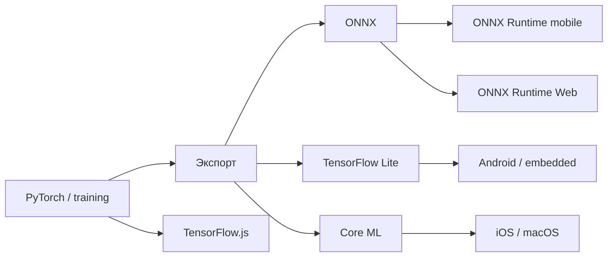
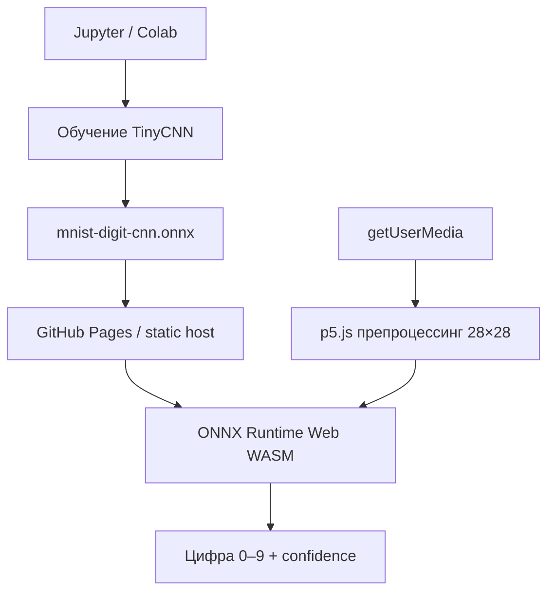

Обучить модель в PyTorch — полдела. Для **edge** и **браузера** нужен другой рантайм: веса в компактном формате, инференс без Python и GPU в дата-центре. Ниже — практический пайплайн на примере **распознавания рукописных цифр MNIST**: обучение в Jupyter, экспорт **ONNX**, запуск в JavaScript через **ONNX Runtime Web** и интерактив с **p5.js** и камерой.

Связанные материалы VAIRL: [телеметрия агентов](/vairl/blog/2026/06/29/agent-telemetry-ru/), [Semantic Torrent](/vairl/blog/2026/07/01/semantic-torrent-vector-search-ru/), [гибридный оркестратор](/vairl/blog/2026/06/26/hybrid-agent-dag-fsm-behavior-tree-ru/).

[](https://colab.research.google.com/github/evgeniy-borisov/vairl/blob/main/notebooks/pytorch-to-browser-onnx.ipynb)

## Зачем выносить нейросеть на устройство

| Сценарий | Плюс edge / on-device | Минус только облака |
|----------|----------------------|---------------------|
| **Приватность** | Кадры с камеры не уходят на сервер | Задержка + регуляторика |
| **Офлайн** | Работает без сети после загрузки модели | Недоступность при обрыве |
| **Стоимость** | Нет платы за каждый запрос к API | Масштабирование inference в облаке |
| **Латентность** | Десятки миллисекунд на WASM / NPU | RTT + очередь на бэкенде |

«Конечное устройство» — не только телефон: **браузер** на ноутбуке тоже edge: JavaScript + WebAssembly + (опционально) WebGPU.

## Ландшафт рантаймов



| Стек | Когда выбирать |
|------|----------------|
| **ONNX + ONNX Runtime Web** | Универсальный путь из PyTorch; WASM в браузере; тот же `.onnx` для мобильного ORT |
| **TensorFlow.js** | Модель уже в TF/Keras или нужен `tfjs-converter` из SavedModel |
| **TensorFlow Lite** | Android, микроконтроллеры, Coral |
| **Core ML** | Экосистема Apple |
| **ExecuTorch / PyTorch Mobile** | Нативный C++ без промежуточного ONNX |

В статье основной путь — **PyTorch → ONNX → ONNX Runtime Web**. TensorFlow.js — хорошая альтернатива, если вы стартуете из Keras; для PyTorch чаще делают ONNX или `torch.jit` + собственный WASM-слой, что сложнее в поддержке.

## Архитектура демо



Модель намеренно **маленькая** (~16 KB граф + веса): два свёрточных слоя, пулинг, полносвязный классификатор на 10 классов. На MNIST после короткого обучения — около **97–98%** accuracy на тесте; в браузере с камерой качество зависит от освещения и того, насколько цифра похожа на MNIST (белое на тёмном, по центру кадра).

## Шаг 1. Обучение и экспорт в ноутбуке

Полный код — в [Colab-ноутбуке](https://colab.research.google.com/github/evgeniy-borisov/vairl/blob/main/notebooks/pytorch-to-browser-onnx.ipynb). Кратко:

1. Загрузка MNIST, нормализация `(x - 0.1307) / 0.3081`.
2. Класс `TinyMNISTCNN`: Conv → ReLU → Pool × 2 → Linear(10).
3. Экспорт:

```python
torch.onnx.export(
    model, dummy, "mnist-digit-cnn.onnx",
    input_names=["input"],
    output_names=["logits"],
    dynamic_axes={"input": {0: "batch"}, "logits": {0: "batch"}},
    opset_version=17,
)
```

Имена тензоров **`input`** и **`logits`** должны совпадать с JavaScript-стороной. Форма входа: `[1, 1, 28, 28]` (NCHW, один канал).

Готовый артефакт лежит в репозитории: `assets/models/mnist-digit-cnn.onnx` (~225 KB, веса внутри файла — ONNX Runtime Web не поддерживает внешний `.onnx.data` по HTTP).

## Шаг 2. ONNX Runtime Web в браузере

Подключаем рантайм с CDN и создаём сессию с WASM-бэкендом (работает везде, где есть WebAssembly):

```javascript
import * as ort from 'onnxruntime-web';

ort.env.wasm.wasmPaths = 'https://cdn.jsdelivr.net/npm/onnxruntime-web@1.22.0/dist/';

const session = await ort.InferenceSession.create('/assets/models/mnist-digit-cnn.onnx', {
  executionProviders: ['wasm'],
});

const tensor = new ort.Tensor('float32', float32Array, [1, 1, 28, 28]);
const { logits } = await session.run({ input: tensor });
```

Для продакшена можно включить **`webgpu`** или **`webgl`** в списке `executionProviders`, если модель и браузер это поддерживают; для крошечной CNN WASM обычно достаточно.

Препроцессинг с камеры:

- Захват кадра, ресайз до 28×28.
- Grayscale, деление на 255.
- Нормализация MNIST: mean `0.1307`, std `0.3081`.
- Softmax по `logits` → argmax → цифра 0–9.

## Шаг 3. p5.js: камера и кнопки Start / Stop

**p5.js** уже подключён в layout блога. Скетч в instance mode не конфликтует с другими canvas на странице:

- **Запустить** — `createCapture(VIDEO)`, инференс каждые ~180 ms.
- **Остановить** — `getTracks().forEach(t => t.stop())`, освобождение камеры.

Камера требует **HTTPS** (GitHub Pages подходит) или `localhost`. Пользователь должен разрешить доступ к устройству.

### Интерактив: цифра с веб-камеры

Покажите рукописную цифру в центре рамки (как в MNIST: контрастный символ на светлом фоне). Слева — поток с камеры, справа — увеличенный превью 28×28, который реально подаётся в сеть.

<div id="edge-nn-demo" class="edge-nn-widget" data-model-url="{{ '/assets/models/mnist-digit-cnn.onnx' | relative_url }}">
  <div class="edge-nn-header">
    <p>Локальный инференс: ONNX Runtime Web (WASM) + p5.js. Модель не отправляет кадры на сервер — всё выполняется в вашем браузере.</p>
  </div>
  <div class="edge-nn-controls">
    <button type="button" data-edge-start>Запустить</button>
    <button type="button" data-edge-stop disabled>Остановить</button>
  </div>
  <div class="edge-nn-body">
    <div class="edge-nn-canvas-mount"></div>
    <div class="edge-nn-side">
      <canvas class="edge-nn-preview" width="112" height="112" aria-label="Превью 28×28"></canvas>
      <p class="edge-nn-prediction">—</p>
      <p style="font-size:12px;color:#888;margin:0;">Вход модели: 28×28, нормализация MNIST</p>
    </div>
  </div>
  <p class="edge-nn-status">Инициализация…</p>
</div>

<script src="{{ '/assets/js/edge-nn-webcam-demo.js' | relative_url }}"></script>

Исходник виджета: `assets/js/edge-nn-webcam-demo.js`.

## Сравнение с TensorFlow.js

| | ONNX Runtime Web | TensorFlow.js |
|--|------------------|---------------|
| **Источник модели** | PyTorch, TF, scikit-learn (через конвертеры) → ONNX | Keras, TF SavedModel |
| **Конвертация** | `torch.onnx.export` | `tensorflowjs_converter` |
| **Бэкенды** | WASM, WebGL, WebGPU, WebNN (эксп.) | WebGL, WASM, WebGPU |
| **Размер** | ort.min.js ~сотни KB + модель | tf.min.js + модель |

Если вы уже в экосистеме PyTorch, ONNX — меньше сюрпризов с операторами, чем прямой порт в TF.js.

## Мобильные и встраиваемые устройства

Тот же файл `mnist-digit-cnn.onnx` можно загрузить в:

- **ONNX Runtime Mobile** (iOS / Android native);
- **React Native** через `onnxruntime-react-native`;
- **TFLite** — через отдельную конвертацию `onnx-tflite`, если нужен NNAPI / GPU delegate.

Браузерный путь хорош для **демо, внутренних инструментов и PWA** без публикации в сторах.

## Ограничения и улучшения

- **Domain gap**: MNIST ≠ реальная камера; для продакшена — аугментации, fine-tune на своих кадрах, бинаризация фона.
- **Квантизация**: `onnxruntime` dynamic quantization или ONNX Runtime Web INT8 уменьшит вес и ускорит WASM.
- **Worker**: вынести `session.run` в Web Worker, чтобы не блокировать UI при тяжёлых моделях.
- **Безопасность**: статическая модель — не секрет; не встраивайте API-ключи в клиентский JS.

## Практический чеклист

1. Обучить и проверить accuracy в ноутбуке.
2. Экспорт ONNX, проверить имена входов/выходов (`netron.app`).
3. Положить `.onnx` (+ `.onnx.data` при external weights) на CDN / static host.
4. Подключить ONNX Runtime Web, препроцессинг как при обучении.
5. Добавить UI с явным **вкл/выкл** камеры и индикатором статуса.

## Further reading

- [PyTorch → браузер (Colab)](https://colab.research.google.com/github/evgeniy-borisov/vairl/blob/main/notebooks/pytorch-to-browser-onnx.ipynb) — обучение, экспорт, проверка ONNX
- [ONNX Runtime Web](https://onnxruntime.ai/docs/tutorials/web/) — провайдеры, perf
- [Netron](https://netron.app/) — визуализация графа ONNX
- [TensorFlow.js](https://www.tensorflow.org/js) — альтернативный JS-стек
- [p5.js reference](https://p5js.org/reference/) — `createCapture`, instance mode
