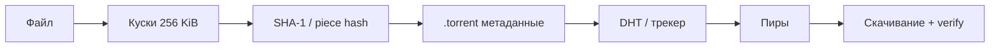
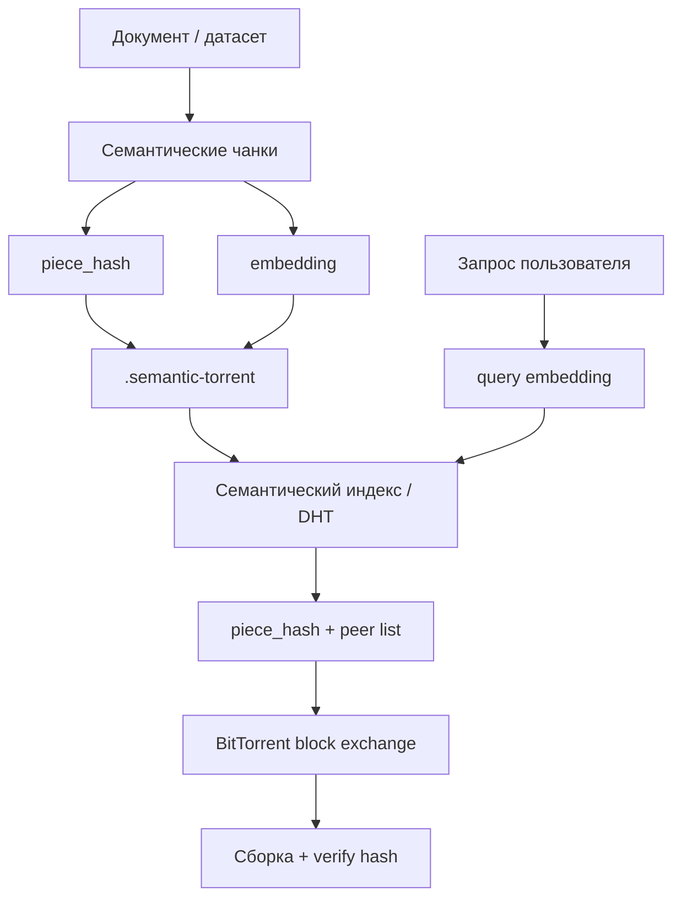

Классический BitTorrent отвечает на вопрос: **«у кого есть байты с таким хэшем?»**. Векторный поиск отвечает на другой: **«какие фрагменты близки по смыслу к запросу?»**. **Semantic Torrent** — гибрид: файл по-прежнему делится на куски с криптографическим хэшем, но каждый кусок дополнительно несёт **embedding**; пиры объявляют и хэш, и вектор в распределённый индекс. Поиск по смыслу возвращает `piece_hash` → дальше работает обычный обмен блоками.

Связанные темы в блоге VAIRL: [телеметрия и vector search](/vairl/blog/2026/06/29/agent-telemetry-ru/), [пространство гипотез (PaCMAP)](/vairl/blog/2026/06/24/hypothesis-space-pacmap/), [как готовить ведущего специалиста по AI-агентам](/vairl/blog/2026/06/29/best-ai-agent-specialist-ru/).

[](https://colab.research.google.com/github/evgeniy-borisov/vairl/blob/main/notebooks/semantic-torrent.ipynb)

## Зачем совмещать торрент и embeddings

| Подход | Сильная сторона | Слабое место |
|--------|----------------|--------------|
| **BitTorrent** | Децентрализованная доставка, проверка целостности по хэшу | Нужен точный `info_hash`; нельзя «найти кусок про X» |
| **Vector DB (RAG)** | Поиск по смыслу, top-k релевантных чанков | Обычно централизованный индекс |
| **Semantic Torrent** | И то, и другое: ANN по embedding → fetch по hash у пиров | Сложнее протокол объявлений и согласование моделей |

Практические сценарии:

- **Федеративный корпус знаний** — узлы держат подмножество документов, глобального сервера нет;
- **P2P RAG** — агент ищет релевантные куски в рое, не выгружая весь индекс на один хост;
- **Доказуемая целостность** — после семантического hit скачивание и верификация по хэшу, как в классическом торренте.

## Классический торрент (напоминание)



Клиент знает **полный набор хэшей** заранее (из `.torrent`). Запрос в сеть: «мне нужен кусок #7» или «у кого есть этот piece hash». Семантики в протоколе нет.

## Semantic Torrent: расширенная модель



Ключевые отличия:

1. **Чанкинг** — не только фиксированный размер: границы абзацев/предложений, чтобы кусок нёс связную мысль (как в RAG).
2. **Двойной идентификатор** — `piece_hash` для целостности, `embedding` для поиска.
3. **Объявление пира** — `(info_hash, piece_index, piece_hash, embedding, peer_id)` вместо только «у меня есть кусок #k».

## Семантическое разбиение файла

Гибридная схема (часто используют на практике):

| Уровень | Роль |
|---------|------|
| **Торрент-слой** | Фиксированные блоки для эффективной передачи и merkle-дерева |
| **Семантический слой** | Один блок может содержать несколько «смысловых» чанков; у каждого — свой embedding и ссылка на byte-range / piece indices |

В ноутбуке — упрощённый вариант: один текст → абзацы → предложения при переполнении → список `SemanticPiece`.

## Распределённый индекс

Варианты реализации объявлений:

| Архитектура | Идея |
|-------------|------|
| **Расширение DHT** | Ключ — LSH-бакет от embedding; значение — список `(piece_hash, peer)` |
| **Специализированные search-ноды** | Пиры стримят объявления; ноды строят HNSW / IVF поверх потока |
| **Гибрид** | DHT по `info_hash` для fetch; отдельный gossip для embedding-объявлений |

Поиск:

```
query → embed(q) → ANN top-k по индексу → [(piece_hash, score, peers)]
     → parallel request blocks у пиров → verify SHA-256 → отдать агенту / UI
```

Важно: **модель embedding должна быть согласована** между объявляющими и ищущими (версия в метаданных `.semantic-torrent`).

## Метаданные `.semantic-torrent`

Расширение к `.torrent`:

```json
{
  "info_hash": "a3f8c21e9b004d12ab91",
  "embedding_model": "sentence-transformers/paraphrase-multilingual-MiniLM-L12-v2",
  "embedding_dim": 384,
  "pieces": [
    {
      "index": 0,
      "piece_hash": "a3f8c21e9b004d12",
      "byte_range": [0, 262144],
      "text_preview": "BitTorrent делит файл..."
    }
  ]
}
```

Полные векторы могут храниться в метаданных (малые файлы), в отдельном **sidecar** или вычисляться локально после скачивания куска — с trade-off между трафиком объявлений и задержкой первого поиска.

## Безопасность и доверие

| Риск | Митигация |
|------|-----------|
| Подмена embedding при объявлении | Подпись объявления ключом пира; репутация |
| Poisoning индекса | Верификация текста после скачивания по hash; не доверять только ANN-score |
| Утечка PII в объявлениях | Embeddings по redacted тексту; opt-in публикация |
| Model skew | Жёсткая версия `embedding_model` в манифесте |

Content-addressed слой остаётся **источником истины**: семантический индекс — только указатель, куда скачать и что проверить.

## Связь с RAG и агентами

Агент с Semantic Torrent в tool loop:

1. Пользовательский запрос → embedding.
2. Tool `semantic_swarm_search(query)` → top-k `piece_hash` + peers.
3. Tool `fetch_pieces(hashes)` → верифицированные тексты.
4. Дальше — обычный RAG / reasoning.

Это перекликается с [телеметрией](/vairl/blog/2026/06/29/agent-telemetry-ru/): те же чанки можно логировать, искать похожие сессии и пополнять eval. Отличие — **транспорт и индекс децентрализованы**, а не сидят в одном PostgreSQL/pgvector.

### Интерактив: рой пиров и поиск по смыслу

Упрощённая симуляция: куски в 2D-проекции embedding space, пиры (квадраты) хранят подмножество кусков, запрос (звезда) подсвечивает ближайшие по смыслу фрагменты и пиров, у которых они есть. Полный пайплайн с TF-IDF, хэшами и matplotlib — в [Colab-ноутбуке](https://colab.research.google.com/github/evgeniy-borisov/vairl/blob/main/notebooks/semantic-torrent.ipynb).

<div id="semantic-torrent-demo" class="semantic-torrent-widget">
  <div class="st-header">
    <p>Децентрализованный рой: у каждого куска — <code>piece_hash</code> и позиция в embedding space. Выберите запрос — увидите, какие куски и пиры отвечают на семантический поиск.</p>
  </div>
  <div class="st-controls">
    <button type="button" data-st-query="0" class="active">векторный поиск</button>
    <button type="button" data-st-query="1">DHT и торрент</button>
    <button type="button" data-st-query="2">RAG для агента</button>
    <button type="button" data-st-query="3">децентрализация</button>
  </div>
  <div class="st-result"></div>
  <div class="st-canvas-wrap">
    <canvas id="semantic-torrent-canvas"></canvas>
  </div>
  <div class="st-chunk-list"></div>
  <div class="st-legend">
    <span class="st-leg-item"><span class="st-leg-dot" style="background: linear-gradient(135deg, #667eea, #764ba2);"></span> кусок (hash + embedding)</span>
    <span class="st-leg-item"><span class="st-leg-dot" style="background: #667eea; border-radius: 2px;"></span> пир</span>
    <span class="st-leg-item"><span class="st-leg-dot" style="background: #fa709a;"></span> запрос</span>
  </div>
</div>

<script src="{{ '/assets/js/semantic-torrent-demo.js' | relative_url }}"></script>

## Ограничения и открытые вопросы

- **Масштаб ANN** — миллиарды объявлений требуют шардирования и приближённого поиска; точность vs latency.
- **Чанкинг vs торрент-блоки** — несовпадение границ: нужна явная таблица соответствия byte-range ↔ semantic chunk.
- **Обновление файла** — новая версия → новый `info_hash`; семантический индекс версионируется вместе с манифестом.
- **Юридический слой** — децентрализация не отменяет ответственность за контент; технически это тот же P2P с дополнительным индексом.

## Практический минимум для прототипа

1. Семантический чанкер + `piece_hash` (SHA-256).
2. Локальный embedding (TF-IDF для демо, sentence-transformers для продакшена).
3. In-memory «DHT» с косинусным поиском (как в ноутбуке).
4. Симуляция пиров с случайным подмножеством кусков.
5. Визуализация PCA + экспорт JSON-манифеста.

Следующий шаг к реальности — gossip объявлений поверх существующего P2P-стека (libtorrent, WebTorrent) и вынос ANN на search-ноды с репликацией.

## Further reading

- [Semantic Torrent (Colab)](https://colab.research.google.com/github/evgeniy-borisov/vairl/blob/main/notebooks/semantic-torrent.ipynb) — разбиение на чанки, хэши, TF-IDF, поиск, визуализация
- [Телеметрия AI-агентов](/vairl/blog/2026/06/29/agent-telemetry-ru/) — централизованный vector search и task mining
- [Пространство гипотез и PaCMAP](/vairl/blog/2026/06/24/hypothesis-space-pacmap/) — геометрия embedding space
- BitTorrent Specification (BEP 3, BEP 5 DHT) — базовый протокол для слоя доставки
