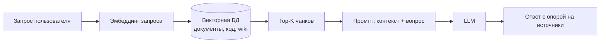
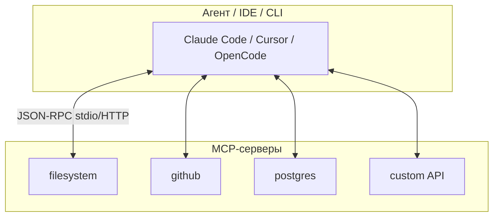
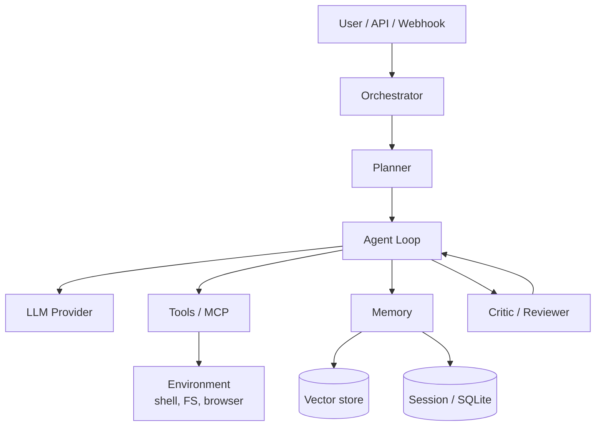
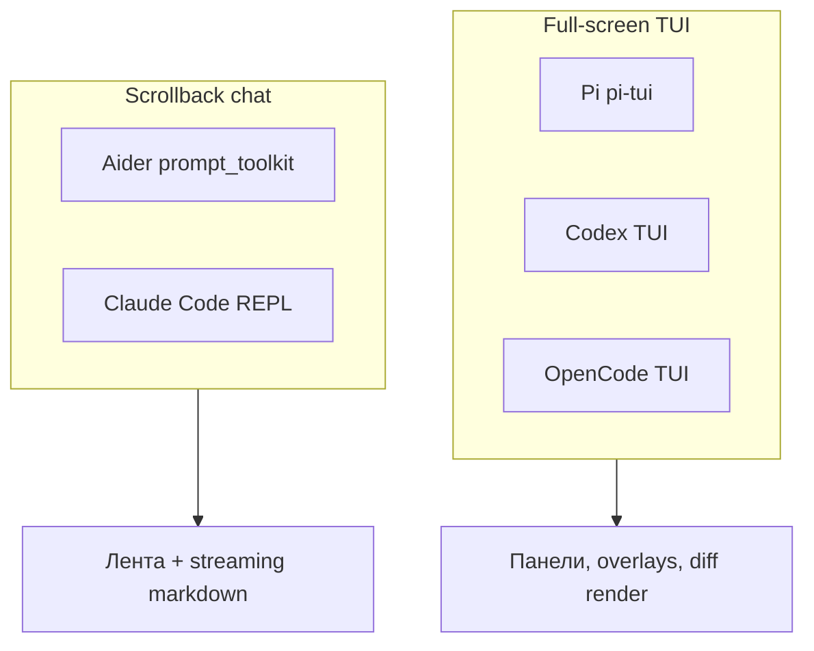

Чтобы проектировать или оценивать **ИИ-агентов**, недостаточно знать название модели. Нужно понимать четыре слоя, которые повторяются почти везде: **знания** (RAG), **память сессии** (контекстное окно), **навыки** (skills) и **инструменты** (часто через **MCP**). Поверх этого — **агентный цикл**: план → действие → наблюдение → повтор.

В этой статье — базовые понятия с примерами, типовая архитектура агентной системы и **сравнительный обзор** шести актуальных агентных программ плюс **g3** как особый случай (диалектическое автокодирование).

Связанные материалы VAIRL: [g3 и диалектическое автокодирование](/vairl/blog/2026/06/25/g3-dialectical-autocoding-ru/), [гибридный оркестратор DAG/FSM/BT](/vairl/blog/2026/06/26/hybrid-agent-dag-fsm-behavior-tree-ru/), [жизненный цикл агента](/vairl/blog/2026/07/01/agent-lifecycle-pipeline-ru/), [телеметрия агентов](/vairl/blog/2026/06/29/agent-telemetry-ru/).

---

## Карта статьи

| Раздел | О чём |
|--------|--------|
| [RAG](#что-такое-rag) | Как агент «подтягивает» знания извне |
| [Контекстное окно](#контекстное-окно) | Лимит памяти одного вызова LLM |
| [Skills](#что-такое-skill) | Переносимые пакеты инструкций |
| [MCP](#зачем-нужен-mcp) | Стандарт подключения инструментов |
| [Базовые элементы](#базовые-элементы-агентной-системы) | Цикл, tools, память, оркестрация |
| [Обзор агентов](#обзор-актуальных-агентных-программ) | Pi, Aider, Codex, OpenCode и другие |
| [TUI-интерфейсы](#сравнение-tui-терминальных-интерфейсов) | Как устроен терминальный UX |
| [Таблицы](#сравнительная-таблица-агентов) | Сравнение и перечень функций |

---

## Что такое RAG

**RAG** (Retrieval-Augmented Generation) — паттерн, при котором модель **не полагается только на веса**, а перед ответом **ищет релевантные фрагменты** во внешнем хранилище и вставляет их в промпт.

### Как это работает (пошагово)



1. **Индексация (offline):** документы режутся на чанки → эмбеддинги → векторное хранилище (Pinecone, pgvector, FAISS, локальный LanceDB).
2. **Retrieval (online):** запрос пользователя эмбеддится → similarity search → top-K фрагментов.
3. **Augmentation:** чанки вставляются в system/user prompt («используй только эту информацию»).
4. **Generation:** LLM синтезирует ответ; хорошие системы добавляют **цитаты** и проверку faithfulness.

### Пример для coding-агента

Пользователь: *«Где в нашем репозитории настраивается rate limit?»*

| Без RAG | С RAG |
|---------|-------|
| Модель угадывает по общим паттернам | Агент ищет по `middleware/`, `config/`, комментариям в коде |
| Высокий риск галлюцинаций | Ответ со ссылкой на `rate_limiter.rs:42` |

**Semantic torrent** и подобные схемы в блоге VAIRL — частный случай RAG: потоковая доставка релевантных чанков в контекст агента.

### Ограничения RAG

- Качество зависит от **чанкинга** и **эмбеддинга**
- «Правильный, но не тот» чанк → уверенная ошибка
- Не заменяет **tools** (агент всё равно должен уметь читать файлы и запускать команды)

---

## Контекстное окно

**Контекстное окно** — максимальный объём текста (в токенах), который модель **видит за один forward-pass**: system prompt + история диалога + tool results + RAG-чанки.

### Что входит в контекст coding-агента

| Компонент | Пример содержимого | Типичная доля |
|-----------|-------------------|---------------|
| System prompt | Роль, правила, список tools | 2–15% |
| Project rules | `CLAUDE.md`, `AGENTS.md`, `.cursor/rules` | 1–10% |
| История сообщений | Прошлые реплики user/assistant | 20–60% |
| Tool outputs | Diff, логи тестов, stdout | 30–70% |
| RAG / skills | Документация, SKILL.md | 5–25% |

### Почему это критично

Когда окно заполняется, агент **теряет ранние детали** (имя файла, условие задачи, результат теста). Отсюда:

- **Compaction / summarization** — сжатие старых ходов в краткое резюме (Hermes, g3, OpenCode)
- **Context thinning** — большие выводы tools заменяются ссылками на файлы (g3)
- **Sub-agents** — тяжёлый поиск в отдельной сессии, в родителя — только итог (OpenCode `explore`, Claude Code subagents)
- **Fresh instance per turn** — новый инстанс агента на ход (g3 Coach/Player)

### Мини-пример

```
Окно 200K токенов, задача на 40 ходов:
  ход 1–10:  всё помещается
  ход 25:    старые tool outputs вытесняют requirements.md из «активной» зоны
  ход 40:    агент «забывает» исходное ТЗ → регрессии
```

**Инженерный вывод:** контекст — не «память навсегда», а **скользящий буфер** с политикой eviction. Её нужно проектировать явно.

---

## Что такое skill

**Skill** — **переносимый пакет знаний и процедур** для агента, обычно в виде каталога с файлом `SKILL.md` (стандарт [agentskills.io](https://agentskills.io)).

### Структура skill

```
my-skill/
├── SKILL.md          # инструкции: когда применять, шаги, ограничения
├── scripts/          # опционально: вспомогательные скрипты
└── references/       # опционально: шаблоны, примеры
```

### Чем skill отличается от tool

| | **Tool** | **Skill** |
|---|----------|-----------|
| Что делает | Выполняет действие (bash, API, SQL) | Учит агент **как** действовать |
| Когда виден | Всегда в tool schema (или по MCP) | Подгружается **по релевантности** задачи |
| Пример | `read_file`, `grep`, `run_tests` | «Как писать миграции Alembic в этом репо» |

### Пример фрагмента SKILL.md

```markdown
# Deploy to staging

Use when the user asks to deploy or release to staging.

## Steps
1. Run `make test` — abort if failing
2. Bump version in pyproject.toml
3. `git tag v{X.Y.Z}` and push
4. Trigger GitHub Actions workflow `deploy-staging.yml`
```

Агент **не вызывает** skill как функцию — он **читает** инструкцию и выполняет шаги через обычные tools.

**Где встречается:** g3 (`.g3/skills/`), Claude Code, Cursor, py-code-agent, Hermes (plugins).

---

## Зачем нужен MCP

**MCP** (Model Context Protocol) — открытый протокол от Anthropic для **стандартного подключения внешних возможностей** к агенту: базы данных, браузер, GitHub, Slack, произвольные API.

### Проблема без MCP

Каждый агент изобретал свой формат плагинов → N агентов × M интеграций = **взрыв адаптеров**.

### Что такое MCP-сервер

**MCP server** — отдельный процесс (или in-process модуль), который:

1. Регистрирует **tools** (вызовы с JSON-schema)
2. Может отдавать **resources** (чтение файлов, документов)
3. Может слать **prompts** (шаблоны)



### Пример вызова

Агент решает: «нужен issue #42 из GitHub». Вместо хардкода API клиент вызывает MCP-tool `get_issue` на сервере `github` → сервер ходит в API → результат возвращается в контекст как tool result.

### Зачем это инженеру

| Без MCP | С MCP |
|---------|-------|
| Интеграция в каждый агент отдельно | Один сервер — много клиентов |
| Сложный аудит прав | Централизованные permissions на сервер |
| Vendor lock-in | Переносимость между Claude Code, Cursor, OpenCode |

**ACP** (Agent Client Protocol) — смежный стандарт: не tools, а **подключение целого агента к IDE** (Zed, JetBrains, OpenCode).

---

## Базовые элементы агентной системы

Почти любой production-агент собирается из одних и тех же блоков:



| Элемент | Роль | Примеры реализации |
|---------|------|-------------------|
| **Orchestrator** | Маршрутизация задач, лимиты, retry | LangGraph, g3-execution, OpenCode Session |
| **Agent loop** | while: LLM → tool calls → observe | ReAct, function calling |
| **Tools** | Side effects в мире | bash, edit, grep, browser |
| **Memory** | Краткосрочная + долгосрочная | SQLite sessions, CLAUDE.md, Hermes profiles |
| **RAG** | Внешние знания | Embeddings + retrieval |
| **Skills** | Процедурные знания | SKILL.md |
| **MCP** | Стандартизированные tools | `@modelcontextprotocol/server-*` |
| **Critic** | Независимая проверка | g3 Coach, CI, human-in-the-loop |
| **Permissions** | Что можно без спроса | OpenCode ruleset, Claude hooks |

### Типовой цикл (ReAct)

```
Thought:  нужно найти определение RateLimiter
Action:   grep(pattern="RateLimiter", path="src/")
Observe:  src/middleware/limit.rs:12
Thought:  прочитаю файл целиком
Action:   read_file("src/middleware/limit.rs")
Observe:  [содержимое файла]
Thought:  готово объяснить пользователю
Action:   respond(...)
```

---

## Обзор актуальных агентных программ

Ниже — агенты, которые чаще всего встречаются в терминальной разработке 2026 года. Для **Pi, Aider, Codex и OpenCode** отдельно разобран [TUI](#сравнение-tui-терминальных-интерфейсов).

> **Примечание:** «агент Idar» из ранней версии статьи — это **IDAD** ([idad.io](https://idad.io/)).

---

### Pi coding agent (pi-mono)

| | |
|---|---|
| **Тип** | Open-source минималистичный coding agent |
| **Репозиторий** | [badlogic/pi-mono](https://github.com/badlogic/pi-mono) (форк/линия [earendil-works/pi](https://github.com/earendil-works/pi)) |
| **Стек** | TypeScript monorepo: `pi-ai` → `pi-agent-core` → `pi-tui` → `pi-coding-agent` |
| **Архитектура** | Event-driven agent loop, provider-neutral messages, tools: `read` / `write` / `edit` / `bash` |
| **Особенности** | Skills, extensions, prompt templates, sub-agents, сессии, multi-provider (Claude, GPT, Ollama…) |

**Принцип:** «весь core помещается в голове» — прозрачный tool-use loop без лишних слоёв. Каждый слой можно использовать отдельно: только LLM API, только agent runtime, или полный CLI.

**Режимы CLI:** интерактивный TUI (default), `--json` (события в stdout), RPC/JSONL для встраивания в другие процессы.

---

### Aider

| | |
|---|---|
| **Тип** | Open-source **pair programmer** в терминале (Python) |
| **Репозиторий** | [Aider-AI/aider](https://github.com/Aider-AI/aider) |
| **Архитектура** | `Coder` orchestrator + LiteLLM (100+ моделей) + git auto-commit |
| **Контекст** | **Repo map** — граф символов + PageRank вместо дампа всего репо |
| **Edit formats** | whole/diff/udiff и др. — подбираются под возможности модели |

**Принцип:** не «автономный демон на час», а **быстрый цикл чат → diff → commit**. Сильная сторона — работа с уже открытыми файлами и умный отбор контекста из кодовой базы.

**Интерфейс:** scrollback-чат (не full-screen TUI) — `prompt_toolkit` + **Rich** markdown stream. Slash-команды (`/add`, `/commit`, `/model`), голос (Whisper), file watcher для IDE.

---

### OpenAI Codex (CLI)

| | |
|---|---|
| **Тип** | Terminal coding agent от OpenAI (open source, Rust) |
| **Репозиторий** | [openai/codex](https://github.com/openai/codex) |
| **Запуск** | `codex` → интерактивный TUI; `codex exec` — скриптуемый режим |
| **Архитектура** | Локальный агент: читает/меняет/запускает код в выбранной директории |
| **Особенности** | Sandbox, approval modes, MCP (`codex mcp`), sub-agents, web search, Codex Cloud tasks |

**Принцип:** **terminal-native** агент с подпиской ChatGPT Plus/Pro/Business или API key. Отдельные поверхности: CLI, Desktop (`codex app`), IDE-плагины, облако [chatgpt.com/codex](https://chatgpt.com/codex).

**TUI:** полноценная сессия с `/model`, вложениями изображений, narration шагов, переключением режимов одобрения (`--sandbox`, `--ask-for-approval`).

---

### OpenCode

| | |
|---|---|
| **Тип** | Open-source coding agent (MIT) |
| **Сайт** | [opencode.ai](https://opencode.ai) |
| **Архитектура** | **Client/server**: фоновый сервер (SQLite, SSE), TUI/CLI/Desktop/IDE — клиенты |
| **Агенты** | `build` (полный доступ), `plan` (read-only), `explore` (sub-agent) |
| **Особенности** | 75+ LLM providers, ACP для IDE, doom-loop detection, context compaction |

**Принцип:** агент = **декларативная конфигурация** (permissions + prompt), единый `SessionPrompt.loop()` для всех ролей. Plan-агент **не видит** write-tools — безопасность через отсутствие инструмента.

**TUI:** клавиатурный full-screen интерфейс; **Tab** переключает `build` ↔ `plan`; сессия **переживает** обрыв терминала (сервер остаётся в фоне). Worker thread для LLM/MCP, main thread — рендер (как в зрелых TUI-приложениях).

---

### py-code-agent (Agent Py)

| | |
|---|---|
| **Тип** | Open-source CLI coding agent (Python) |
| **Репозиторий** | [bonashen/py-code-agent](https://github.com/bonashen/py-code-agent) |
| **Архитектура** | ReAct loop + pluggy plugins + LiteLLM (100+ провайдеров) |
| **Особенности** | MCP gateway, A2A protocol, session tree (fork/branch), 5-layer self-healing |
| **Модель работы** | `Thought → Action → Observation` до `task_done` с верификацией файлов |

**Принцип:** максимальная **расширяемость** через плагины и hooks; skills совместимы с форматом Claude Code (`SKILL.md`). TUI — обычный REPL-стиль CLI, без full-screen панелей.

---

### Hermes Agent

| | |
|---|---|
| **Тип** | Open-source **personal** agent (не только код) |
| **Автор** | [Nous Research](https://github.com/NousResearch/hermes-agent) |
| **Архитектура** | Монолитный Python: `AIAgent` + `conversation_loop.py` + SQLite sessions |
| **Интерфейсы** | CLI, **gateway** (Telegram, Discord, Slack, 20+ платформ), cron |
| **Особенности** | 70+ tools, lineage-based compression, profiles, `delegate_task`, MCP |

**Принцип:** агент как **долгоживущий сервис** на сервере. CLI — интерактивный TUI с slash-командами и streaming; основная ценность — gateway в мессенджеры.

---

### IDAD (Issue Driven Agentic Development)

| | |
|---|---|
| **Тип** | GitHub-native **multi-agent pipeline** |
| **Сайт** | [idad.io](https://idad.io/) |
| **Архитектура** | 9 специализированных агентов + 2 human gates |
| **Движок** | Claude Code, Cursor Agent или OpenAI Codex (на выбор) |
| **Триггер** | Label `idad:issue-review` на GitHub issue |

**Поток:**

```
Issue → Review → Planner → [human: approve plan] → Implementer
  → Security → Reviewer → Documenter → [human: merge PR] → Self-improve
```

**Принцип:** агентность на уровне **организации**, не одного чата. Человек контролирует **план** и **merge**; между ними — автоматизация.

---

### ChatGPT Agent (Agent Mode)

| | |
|---|---|
| **Тип** | Облачный consumer/enterprise agent |
| **Доступ** | Plus / Pro / Team / Enterprise |
| **Архитектура** | Виртуальный компьютер: visual browser + text browser + terminal + connectors |
| **Инструменты** | Gmail, GitHub, Google Drive, M365, Slack (Workspace Agents) |
| **Особенности** | Прерывание и takeover браузера, подтверждение перед покупками/письмами |

**Принцип:** **chat-first orchestration** — одна нить диалога управляет многошаговой задачей; пользователь видит narration действий. Для разработчиков параллельно существует **AgentKit** (Agent Builder, Connector Registry, ChatKit, Agents SDK).

---

### Claude Code (Cloud Code)

| | |
|---|---|
| **Тип** | Terminal + IDE agent от Anthropic |
| **Архитектура** | Agent loop + layered extensions |
| **Расширения** | `CLAUDE.md`, **Skills**, **Hooks** (25+ events), **Subagents**, **MCP** |
| **Особенности** | Hooks типа `mcp_tool` (v2.1.118+), sandbox, permission prompts |
| **Модель** | Обычно Claude Sonnet/Opus; сильная интеграция с экосистемой MCP |

**Принцип:** **закрытые по умолчанию** permissions + hooks. TUI — REPL в терминале (не панельный fullscreen); rich output через streaming markdown.

---

## Сравнение TUI: терминальные интерфейсы

Не все «терминальные агенты» рисуют UI одинаково. Есть три семейства:

| Семейство | Как выглядит | Примеры |
|-----------|--------------|---------|
| **Full-screen TUI** | Весь экран — панели, списки, оверлеи; CSI 2026 / differential render | **Pi**, **Codex**, **OpenCode** |
| **Scrollback chat** | Лента сообщений вниз; ввод внизу; без «рамки» на весь терминал | **Aider**, **Claude Code**, py-code-agent |
| **Не-TUI** | Web, IDE, GitHub | ChatGPT Agent, IDAD |

### Детальное сравнение TUI

| Агент | Тип UI | Технология | Навигация и UX | Сильные стороны TUI | Ограничения |
|-------|--------|------------|----------------|---------------------|-------------|
| **Pi** | Full-screen TUI | `@earendil-works/pi-tui`: differential rendering, CSI 2026, компоненты | Slash-команды, autocomplete путей, streaming tool calls, overlays | Без мерцания на медленных SSH; IME/CJK; inline-изображения (Kitty/iTerm2) | Нужен нормальный терминал с synchronized output |
| **Aider** | Scrollback REPL | `prompt_toolkit` + **Rich** | Enter / Alt+Enter, vi-mode, автодополнение файлов и `/commands` | Привычный «чат в терминале»; markdown stream + spinner при ожидании LLM | Нет панелей diff side-by-side в TUI (diff в git/IDE) |
| **Codex** | Full-screen TUI | Rust, встроенный TUI | `/model`, вложения картинок, narration, approval prompts | Sandbox + режимы одобрения в одном экране; `codex resume` | Привязка к экосистеме OpenAI |
| **OpenCode** | Full-screen TUI | TUI-клиент + **фоновый сервер** | **Tab**: `build` ↔ `plan`; `@general` для sub-agent | Сессия живёт после закрытия терминала; event bus → live updates | Нужен запущенный server process |
| **Claude Code** | Scrollback REPL | Собственный terminal UI | Slash, permissions inline, subagent status | Глубокая интеграция hooks/skills/MCP | Не classic fullscreen TUI |
| **g3** | Scrollback + статус | Rust CLI | `/compact`, `/stats`, `/thinnify` | Прозрачность coach/player ходов | Нет отдельного UI-фреймворка как у Pi |

### Схема: два подхода к терминалу



### Когда какой TUI удобнее

| Сценарий | Лучше подходит |
|----------|----------------|
| Долгая сессия по SSH, нестабильная сеть | **OpenCode** (persistent server) или **Pi** (differential TUI) |
| Быстрые правки в 2–3 файлах, pair programming | **Aider** |
| Единый стек OpenAI + sandbox + скрипты `codex exec` | **Codex** |
| Минимализм, свой fork agent runtime | **Pi** (pi-agent-core отдельно от TUI) |
| Enterprise governance, hooks | **Claude Code** |

---

## Сравнительная таблица агентов

### Terminal-first агенты (фокус статьи)

| Критерий | **Pi** | **Aider** | **Codex** | **OpenCode** | Claude Code | **g3** |
|----------|:------:|:---------:|:---------:|:------------:|:-----------:|:------:|
| **Open source** | ✅ | ✅ | ✅ | ✅ | ❌ | ✅ |
| **Язык** | TypeScript | Python | Rust | TypeScript | — | Rust |
| **TUI** | Full-screen | Scrollback | Full-screen | Full-screen | Scrollback | Scrollback |
| **Пара программист** | ✅ | ✅ **core** | ✅ | ✅ | ✅ | Coach/Player |
| **Repo map / RAG** | extensions | ✅ PageRank | web search | LSP | MCP | tree-sitter |
| **Git auto-commit** | — | ✅ | ✅ | ✅ | ✅ | ✅ |
| **MCP** | extensions | — | ✅ | ✅ | ✅ native | partial |
| **Skills** | ✅ | — | — | AGENTS.md | ✅ | ✅ .g3/skills |
| **Sub-agents** | ✅ | — | ✅ | explore | ✅ | Coach+Player |
| **Мульти-модель** | ✅ | LiteLLM 100+ | OpenAI | 75+ | Claude | several |
| **Уникальность** | Минимальный stack | Repo map | OpenAI sandbox | Persistent server | Hooks depth | Adversarial loop |

### Расширенный ландшафт

| Критерий | py-code-agent | Hermes | IDAD | ChatGPT Agent |
|----------|:-------------:|:------:|:----:|:-------------:|
| **Фокус** | Код | Personal + код | GitHub workflow | Универсальные задачи |
| **Интерфейс** | CLI REPL | CLI + мессенджеры | GitHub Issues | Web |
| **MCP** | Gateway | ✅ | Через CLI | Connectors |
| **Human gates** | Опционально | Allowlists | **2 обязательных** | Confirm actions |

---

## Перечень функций (детально)

| Функция | Pi | Aider | Codex | OpenCode | py-code-agent | Hermes | Claude Code | g3 |
|---------|:--:|:-----:|:-----:|:--------:|:-------------:|:------:|:-----------:|:--:|
| Full-screen TUI | ✅ | — | ✅ | ✅ | — | partial | — | — |
| Scrollback REPL | — | ✅ | — | — | ✅ | ✅ | ✅ | ✅ |
| Чтение/запись файлов | ✅ | ✅ | ✅ | ✅ | ✅ | ✅ | ✅ | ✅ |
| Shell / bash | ✅ | ✅ | ✅ | ✅ | ✅ | ✅ | ✅ | ✅ |
| Git operations | — | ✅ auto | ✅ | ✅ | ✅ | ✅ | ✅ | ✅ |
| Repo map / smart context | ext | ✅ | search | LSP | — | memory | MCP | tree-sitter |
| ReAct / tool loop | ✅ | ✅ | ✅ | ✅ | ✅ | ✅ | ✅ | ✅ |
| Edit formats (diff/whole) | edit tool | ✅ many | patch | patch | ✅ | — | patch | patch |
| Code review | self-review | — | ✅ agent | — | plugins | background | subagent | **Coach** |
| MCP | ext | — | ✅ | ✅ | gateway | ✅ | ✅ | partial |
| Context compaction | sessions | history | internal | ✅ | — | lineage | /compact | thinning |
| Persistent session | ✅ | — | resume | **server** | tree | SQLite | resume | per-turn |
| Локальные модели | Ollama | ✅ | — | llama.cpp | Ollama | ✅ | — | Metal |
| Диалектика 2 агентов | sub | — | sub | explore | — | delegate | subagents | **core** |

---

## Как g3 можно считать агентом

**g3** ([dhanji/g3](https://github.com/dhanji/g3)) — полноценный **coding agent**, но с нестандартной **оркестрацией**:

| Обычный single-agent | g3 |
|---------------------|-----|
| Один LLM + tools в длинном треде | **Player** (код) + **Coach** (ревью) |
| Self-report «готово» | Coach **независимо** проверяет требования |
| Контекст накапливается | **Свежий инстанс** на ход + thinning |
| Один проход ревью в конце | Adversarial цикл **на каждом шаге** (~10 ходов) |

### Чем g3 похож на других

- **Как Claude Code / OpenCode:** terminal agent, tools, skills, автономный режим по `requirements.md`
- **Как IDAD:** разделение ролей (implementer vs reviewer), human/agent gates
- **Как OpenCode plan/build:** разные **permission sets** для разных ролей — у g3 это Player vs Coach

### Чем g3 отличается

1. **Adversarial cooperation** — ревью не опциональный subagent, а **обязательный** второй участник петли ([статья Block AI Research](https://block.xyz/documents/adversarial-cooperation-in-code-synthesis.pdf))
2. **Контракт требований** — общий `requirements.md` как source of truth для обоих агентов
3. **Coach APPROVED** — явный критерий завершения, а не stop token модели
4. **Rust-workspace** — `g3-core`, providers, execution, computer-control как отдельные крейты

### g3 в сравнительной матрице «тип агента»

| Тип | Примеры | g3 |
|-----|---------|-----|
| Interactive pair programmer | **Aider**, Pi chat, Cursor | частично (`--chat`) |
| Autonomous coder | Codex, OpenCode build, Claude Code | ✅ default |
| Full-screen TUI coding | **Pi, Codex, OpenCode** | — (scrollback CLI) |
| Multi-agent orchestrator | IDAD, Hermes delegate | ✅ Coach/Player |
| Personal assistant | Hermes gateway, ChatGPT | ❌ |
| CI/CD bot | IDAD | ❌ (локальный CLI) |

---

## Как выбрать агента (практически)

| Задача | Разумный выбор |
|--------|----------------|
| Pair programming в терминале, repo map | **Aider** |
| Full-screen TUI, минимальный код агента | **Pi** |
| OpenAI-стек, sandbox, `codex exec` | **Codex** |
| Persistent server, Tab build/plan | **OpenCode** |
| Локальный open-source + BYOK | OpenCode, Pi, py-code-agent, g3 |
| 24/7 бот в Telegram/Slack | Hermes |
| Issue → PR на GitHub с ревью | IDAD |
| Enterprise IDE + governance | Claude Code |
| Нетехнический пользователь, web-задачи | ChatGPT Agent |
| Максимальная проверка кода adversarial-петлёй | **g3** |
| Свой стек, BYOK, persistent sessions | OpenCode |

---

## Резюме

1. **RAG** даёт знания извне; **контекстное окно** — ограниченную память; **skills** — процедуры; **MCP** — стандарт для tools.
2. Любая агентная система = **loop + tools + memory + (опционально) critic**.
3. Ландшафт 2026: **Pi / Aider / Codex / OpenCode** — главные terminal-first агенты; TUI бывает fullscreen (Pi, Codex, OpenCode) и scrollback (Aider, Claude Code).
4. **g3** — агент с уникальной **диалектической** архитектурой: не «больше tools», а **структурированное противоречие** Player/Coach.

---

## Источники и ссылки

- [Model Context Protocol](https://modelcontextprotocol.io/)
- [Agent Skills (agentskills.io)](https://agentskills.io/)
- [Pi mono](https://github.com/badlogic/pi-mono) · [pi-tui](https://github.com/badlogic/pi-mono/tree/main/packages/tui)
- [Aider](https://aider.chat/) · [GitHub](https://github.com/Aider-AI/aider)
- [OpenAI Codex CLI](https://developers.openai.com/codex/cli) · [GitHub](https://github.com/openai/codex)
- [OpenCode](https://opencode.ai) · [GitHub](https://github.com/anomalyco/opencode)
- [Hermes Agent docs](https://hermes-agent.nousresearch.com/docs/developer-guide/architecture)
- [py-code-agent](https://github.com/bonashen/py-code-agent)
- [IDAD](https://idad.io/)
- [ChatGPT agent (OpenAI)](https://openai.com/index/introducing-chatgpt-agent/)
- [Claude Code docs](https://code.claude.com/docs)
- [g3 — VAIRL черновик](/vairl/blog/2026/06/25/g3-dialectical-autocoding-ru/) · [Block AI Research PDF](https://block.xyz/documents/adversarial-cooperation-in-code-synthesis.pdf)
