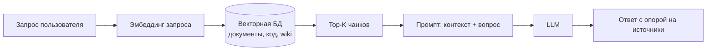
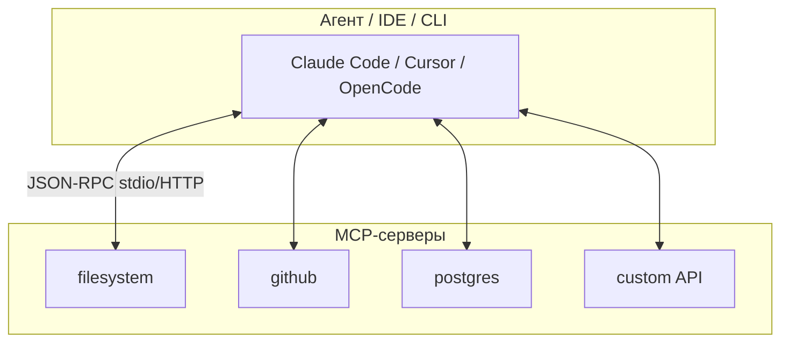
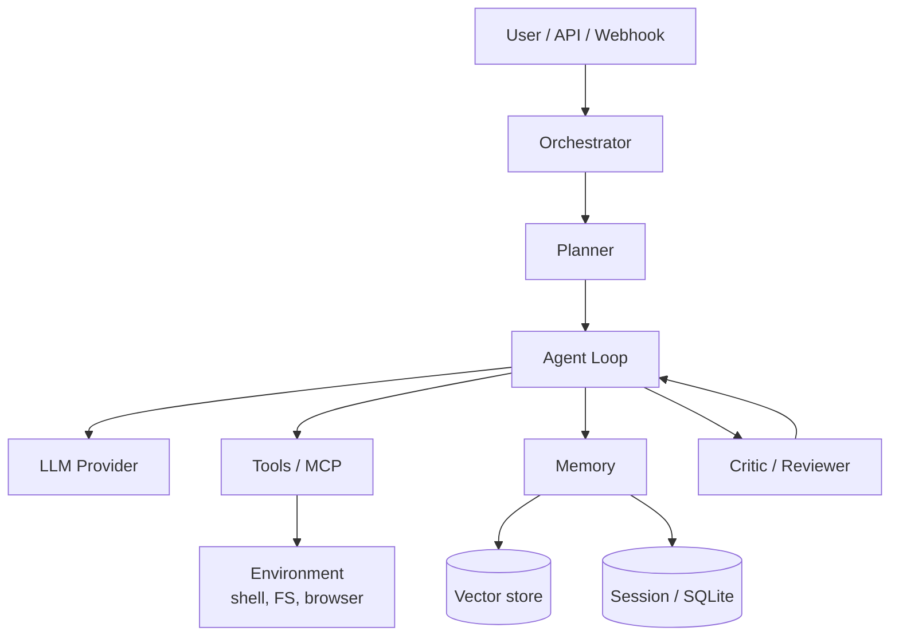

Чтобы проектировать или оценивать **ИИ-агентов**, недостаточно знать название модели. Нужно понимать четыре слоя, которые повторяются почти везде: **знания** (RAG), **память сессии** (контекстное окно), **навыки** (skills) и **инструменты** (часто через **MCP**). Поверх этого — **агентный цикл**: план → действие → наблюдение → повтор.

В этой статье — базовые понятия с примерами и типовая архитектура агентной системы. **Сравнительный обзор** Pi, Aider, Codex, OpenCode, Claude Code, g3 и других — с акцентом на **управление памятью** — вынесен в [отдельную статью](/vairl/blog/2026/07/03/agent-landscape-memory-ru/).

Связанные материалы VAIRL: [обзор агентов и память](/vairl/blog/2026/07/03/agent-landscape-memory-ru/), [RAG для агентов](/vairl/blog/2026/07/03/agent-rag-approaches-ru/), [g3 и диалектическое автокодирование](/vairl/blog/2026/06/25/g3-dialectical-autocoding-ru/), [гибридный оркестратор DAG/FSM/BT](/vairl/blog/2026/06/26/hybrid-agent-dag-fsm-behavior-tree-ru/), [жизненный цикл агента](/vairl/blog/2026/07/01/agent-lifecycle-pipeline-ru/), [телеметрия агентов](/vairl/blog/2026/06/29/agent-telemetry-ru/).

---

## Карта статьи

| Раздел | О чём |
|--------|--------|
| [RAG](#что-такое-rag) | Как агент «подтягивает» знания извне |
| [Контекстное окно](#контекстное-окно) | Лимит памяти одного вызова LLM |
| [Skills](#что-такое-skill) | Переносимые пакеты инструкций |
| [MCP](#зачем-нужен-mcp) | Стандарт подключения инструментов |
| [Базовые элементы](#базовые-элементы-агентной-системы) | Цикл, tools, память, оркестрация |
| [Обзор агентов](/vairl/blog/2026/07/03/agent-landscape-memory-ru/) | Pi, Aider, Codex… — отдельная статья |

---

## Что такое RAG

**RAG** (Retrieval-Augmented Generation) — паттерн, при котором модель **не полагается только на веса**, а перед ответом **ищет релевантные фрагменты** во внешнем хранилище и вставляет их в промпт.

### Как это работает (пошагово)



1. **Индексация (offline):** документы режутся на чанки → эмбеддинги → векторное хранилище (Pinecone, pgvector, FAISS, локальный LanceDB).
2. **Retrieval (online):** запрос пользователя эмбеддится → similarity search → top-K фрагментов.
3. **Augmentation:** чанки вставляются в system/user prompt («используй только эту информацию»).
4. **Generation:** LLM синтезирует ответ; хорошие системы добавляют **цитаты** и проверку faithfulness.

### Пример для coding-агента

Пользователь: *«Где в нашем репозитории настраивается rate limit?»*

| Без RAG | С RAG |
|---------|-------|
| Модель угадывает по общим паттернам | Агент ищет по `middleware/`, `config/`, комментариям в коде |
| Высокий риск галлюцинаций | Ответ со ссылкой на `rate_limiter.rs:42` |

**Semantic torrent** и подобные схемы в блоге VAIRL — частный случай RAG: потоковая доставка релевантных чанков в контекст агента.

### Ограничения RAG

- Качество зависит от **чанкинга** и **эмбеддинга**
- «Правильный, но не тот» чанк → уверенная ошибка
- Не заменяет **tools** (агент всё равно должен уметь читать файлы и запускать команды)

---

## Контекстное окно

**Контекстное окно** — максимальный объём текста (в токенах), который модель **видит за один forward-pass**: system prompt + история диалога + tool results + RAG-чанки.

### Что входит в контекст coding-агента

| Компонент | Пример содержимого | Типичная доля |
|-----------|-------------------|---------------|
| System prompt | Роль, правила, список tools | 2–15% |
| Project rules | `CLAUDE.md`, `AGENTS.md`, `.cursor/rules` | 1–10% |
| История сообщений | Прошлые реплики user/assistant | 20–60% |
| Tool outputs | Diff, логи тестов, stdout | 30–70% |
| RAG / skills | Документация, SKILL.md | 5–25% |

### Почему это критично

Когда окно заполняется, агент **теряет ранние детали** (имя файла, условие задачи, результат теста). Отсюда:

- **Compaction / summarization** — сжатие старых ходов в краткое резюме (Hermes, g3, OpenCode)
- **Context thinning** — большие выводы tools заменяются ссылками на файлы (g3)
- **Sub-agents** — тяжёлый поиск в отдельной сессии, в родителя — только итог (OpenCode `explore`, Claude Code subagents)
- **Fresh instance per turn** — новый инстанс агента на ход (g3 Coach/Player)

### Мини-пример

```
Окно 200K токенов, задача на 40 ходов:
  ход 1–10:  всё помещается
  ход 25:    старые tool outputs вытесняют requirements.md из «активной» зоны
  ход 40:    агент «забывает» исходное ТЗ → регрессии
```

**Инженерный вывод:** контекст — не «память навсегда», а **скользящий буфер** с политикой eviction. Её нужно проектировать явно.

---

## Что такое skill

**Skill** — **переносимый пакет знаний и процедур** для агента, обычно в виде каталога с файлом `SKILL.md` (стандарт [agentskills.io](https://agentskills.io)).

### Структура skill

```
my-skill/
├── SKILL.md          # инструкции: когда применять, шаги, ограничения
├── scripts/          # опционально: вспомогательные скрипты
└── references/       # опционально: шаблоны, примеры
```

### Чем skill отличается от tool

| | **Tool** | **Skill** |
|---|----------|-----------|
| Что делает | Выполняет действие (bash, API, SQL) | Учит агент **как** действовать |
| Когда виден | Всегда в tool schema (или по MCP) | Подгружается **по релевантности** задачи |
| Пример | `read_file`, `grep`, `run_tests` | «Как писать миграции Alembic в этом репо» |

### Пример фрагмента SKILL.md

```markdown
# Deploy to staging

Use when the user asks to deploy or release to staging.

## Steps
1. Run `make test` — abort if failing
2. Bump version in pyproject.toml
3. `git tag v{X.Y.Z}` and push
4. Trigger GitHub Actions workflow `deploy-staging.yml`
```

Агент **не вызывает** skill как функцию — он **читает** инструкцию и выполняет шаги через обычные tools.

**Где встречается:** g3 (`.g3/skills/`), Claude Code, Cursor, py-code-agent, Hermes (plugins).

---

## Зачем нужен MCP

**MCP** (Model Context Protocol) — открытый протокол от Anthropic для **стандартного подключения внешних возможностей** к агенту: базы данных, браузер, GitHub, Slack, произвольные API.

### Проблема без MCP

Каждый агент изобретал свой формат плагинов → N агентов × M интеграций = **взрыв адаптеров**.

### Что такое MCP-сервер

**MCP server** — отдельный процесс (или in-process модуль), который:

1. Регистрирует **tools** (вызовы с JSON-schema)
2. Может отдавать **resources** (чтение файлов, документов)
3. Может слать **prompts** (шаблоны)



### Пример вызова

Агент решает: «нужен issue #42 из GitHub». Вместо хардкода API клиент вызывает MCP-tool `get_issue` на сервере `github` → сервер ходит в API → результат возвращается в контекст как tool result.

### Зачем это инженеру

| Без MCP | С MCP |
|---------|-------|
| Интеграция в каждый агент отдельно | Один сервер — много клиентов |
| Сложный аудит прав | Централизованные permissions на сервер |
| Vendor lock-in | Переносимость между Claude Code, Cursor, OpenCode |

**ACP** (Agent Client Protocol) — смежный стандарт: не tools, а **подключение целого агента к IDE** (Zed, JetBrains, OpenCode).

---

## Базовые элементы агентной системы

Почти любой production-агент собирается из одних и тех же блоков:



| Элемент | Роль | Примеры реализации |
|---------|------|-------------------|
| **Orchestrator** | Маршрутизация задач, лимиты, retry | LangGraph, g3-execution, OpenCode Session |
| **Agent loop** | while: LLM → tool calls → observe | ReAct, function calling |
| **Tools** | Side effects в мире | bash, edit, grep, browser |
| **Memory** | Краткосрочная + долгосрочная | SQLite sessions, CLAUDE.md, Hermes profiles |
| **RAG** | Внешние знания | Embeddings + retrieval |
| **Skills** | Процедурные знания | SKILL.md |
| **MCP** | Стандартизированные tools | `@modelcontextprotocol/server-*` |
| **Critic** | Независимая проверка | g3 Coach, CI, human-in-the-loop |
| **Permissions** | Что можно без спроса | OpenCode ruleset, Claude hooks |

### Типовой цикл (ReAct)

```
Thought:  нужно найти определение RateLimiter
Action:   grep(pattern="RateLimiter", path="src/")
Observe:  src/middleware/limit.rs:12
Thought:  прочитаю файл целиком
Action:   read_file("src/middleware/limit.rs")
Observe:  [содержимое файла]
Thought:  готово объяснить пользователю
Action:   respond(...)
```

---

## Дальше: обзор конкретных агентов

Сравнение **Pi, Aider, Codex, OpenCode, Claude Code, g3**, Hermes, IDAD и других — TUI, таблицы функций и **управление памятью у каждого агента** (сессии, compaction, repo map, `CLAUDE.md`, lineage compression) — в статье:

**[Обзор агентов 2026 и управление памятью](/vairl/blog/2026/07/03/agent-landscape-memory-ru/)**

---

## Резюме

1. **RAG** даёт знания извне; **контекстное окно** — ограниченную память одного вызова; **skills** — процедуры; **MCP** — стандарт для tools.
2. Любая агентная система = **loop + tools + memory + (опционально) critic**.
3. Память — не один буфер: контекст, сессия, проектные файлы и внешние источники; детали по продуктам — в [обзоре агентов](/vairl/blog/2026/07/03/agent-landscape-memory-ru/).

---

## Источники и ссылки

- [Model Context Protocol](https://modelcontextprotocol.io/)
- [Agent Skills (agentskills.io)](https://agentskills.io/)
- [Обзор агентов 2026 и управление памятью](/vairl/blog/2026/07/03/agent-landscape-memory-ru/)
- [g3 — VAIRL](/vairl/blog/2026/06/25/g3-dialectical-autocoding-ru/)
