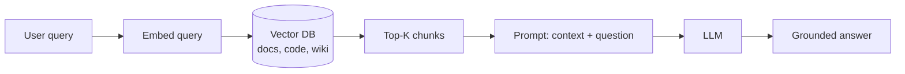
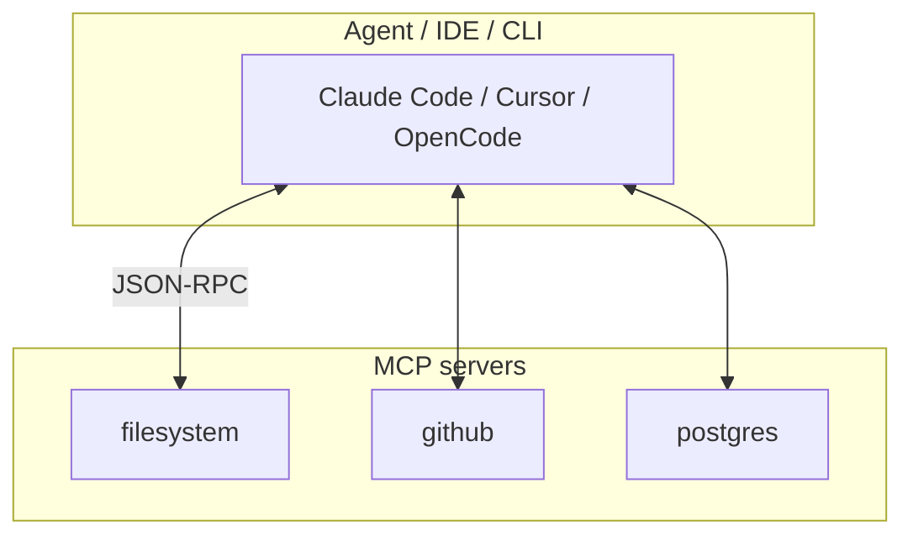
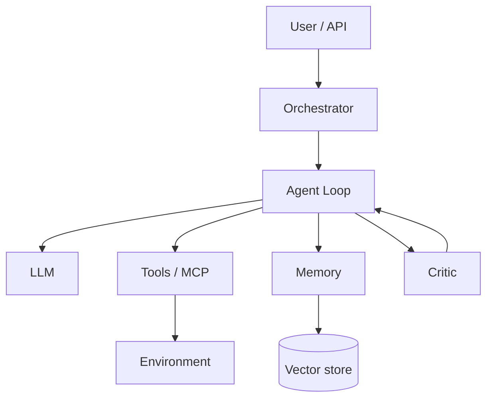
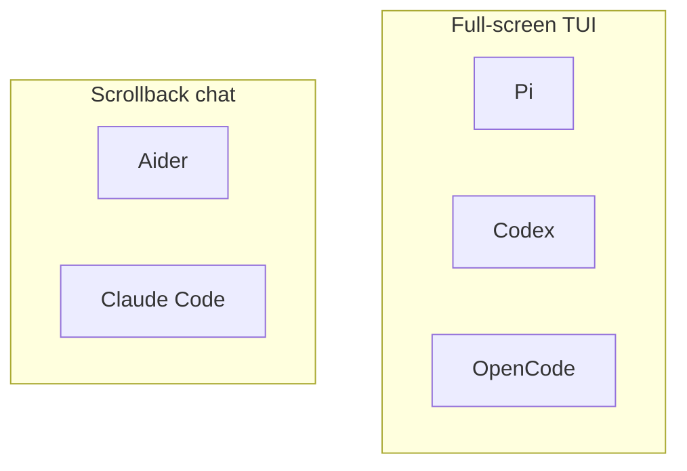

To design or evaluate **AI agents**, knowing the model name is not enough. Almost every system repeats four layers: **knowledge** (RAG), **session memory** (context window), **procedures** (skills), and **capabilities** (often via **MCP**). On top sits the **agent loop**: plan → act → observe → repeat.

This article explains the basics with examples, sketches a typical agent architecture, and provides a **comparative survey** of six current agent programs plus **g3** as a special case (dialectical autocoding).

Related VAIRL posts: [g3 dialectical autocoding](/vairl/blog/2026/06/25/g3-dialectical-autocoding/), [hybrid DAG/FSM/BT orchestrator](/vairl/blog/2026/06/26/hybrid-agent-dag-fsm-behavior-tree/), [agent lifecycle](/vairl/blog/2026/07/01/agent-lifecycle-pipeline/), [agent telemetry](/vairl/blog/2026/06/29/agent-telemetry/).

---

## What is RAG

**RAG** (Retrieval-Augmented Generation) means the model does not rely on weights alone—it **retrieves relevant chunks** from external storage before answering and injects them into the prompt.

### How it works



1. **Indexing (offline):** chunk documents → embeddings → vector store.
2. **Retrieval (online):** embed query → similarity search → top-K.
3. **Augmentation:** insert chunks into the prompt.
4. **Generation:** LLM synthesizes; good systems add citations and faithfulness checks.

### Coding-agent example

User: *"Where is rate limiting configured in our repo?"*

| Without RAG | With RAG |
|-------------|----------|
| Model guesses from general patterns | Agent searches `middleware/`, configs, comments |
| Higher hallucination risk | Answer cites `rate_limiter.rs:42` |

**Limits:** chunking and embedding quality matter; wrong-but-plausible chunks cause confident errors; RAG does not replace **tools** (the agent still needs `read_file` and `bash`).

---

## Context window

The **context window** is the maximum token budget the model sees in one forward pass: system prompt + history + tool outputs + RAG/skills.

| Component | Examples | Typical share |
|-----------|----------|---------------|
| System prompt | Role, rules, tool list | 2–15% |
| Project rules | `CLAUDE.md`, `AGENTS.md` | 1–10% |
| Message history | Past user/assistant turns | 20–60% |
| Tool outputs | Diffs, test logs, stdout | 30–70% |
| RAG / skills | Docs, `SKILL.md` | 5–25% |

When the window fills, early details are **evicted**. Mitigations:

- **Compaction** — summarize old turns (Hermes, g3, OpenCode)
- **Context thinning** — replace large tool outputs with file references (g3)
- **Sub-agents** — heavy search in a child session (OpenCode `explore`, Claude subagents)
- **Fresh instance per turn** — new agent instance each step (g3 Coach/Player)

**Engineering takeaway:** context is a **sliding buffer with an eviction policy**, not permanent memory.

---

## What is a skill

A **skill** is a **portable package of know-how** for an agent, usually a directory with `SKILL.md` ([agentskills.io](https://agentskills.io)).

```
my-skill/
├── SKILL.md          # when to use, steps, constraints
├── scripts/          # optional helpers
└── references/       # optional templates
```

| | **Tool** | **Skill** |
|---|----------|-----------|
| Does | Executes an action | Teaches **how** to act |
| Visibility | Always in tool schema | Loaded when task-relevant |
| Example | `grep`, `run_tests` | "How to write Alembic migrations here" |

The agent does not "call" a skill—it **reads** the instructions and uses normal tools.

---

## Why MCP matters

**MCP** (Model Context Protocol) is an open standard for connecting **external capabilities** to agents: databases, browsers, GitHub, Slack, custom APIs.

### What is an MCP server

An **MCP server** is a process (or in-process module) that exposes:

1. **Tools** (JSON-schema calls)
2. **Resources** (readable documents/files)
3. **Prompts** (templates)



**Why it matters:** one server, many clients—less adapter sprawl, centralized permissions, portability across Claude Code, Cursor, OpenCode.

**ACP** (Agent Client Protocol) is adjacent: it connects a **whole agent** to an IDE (Zed, JetBrains), not individual tools.

---

## Basic elements of agent systems



| Element | Role |
|---------|------|
| Orchestrator | Routing, limits, retry |
| Agent loop | while: LLM → tools → observe |
| Tools | Side effects (shell, FS, browser) |
| Memory | Short + long term |
| RAG | External knowledge |
| Skills | Procedural knowledge |
| MCP | Standardized tools |
| Critic | Independent verification |

Classic **ReAct** cycle: Thought → Action → Observation until done.

---

## Survey of current agent programs

Focus on **Pi, Aider, Codex, and OpenCode** as terminal-first agents; see [TUI comparison](#tui-comparison-terminal-interfaces) below.

### Pi coding agent (pi-mono)

Open-source minimal coding agent ([badlogic/pi-mono](https://github.com/badlogic/pi-mono)): TypeScript stack `pi-ai` → `pi-agent-core` → `pi-tui` → `pi-coding-agent`. Provider-neutral agent loop, tools `read`/`write`/`edit`/`bash`, skills, extensions, sub-agents. Modes: interactive **full-screen TUI** (default), `--json`, RPC/JSONL for embedding.

### Aider

Python pair programmer ([Aider-AI/aider](https://github.com/Aider-AI/aider)). `Coder` + LiteLLM + **repo map** (symbol graph + PageRank). Chat → diff → git auto-commit. **Scrollback REPL** (not fullscreen): `prompt_toolkit` + Rich markdown stream, slash commands, file/voice input.

### OpenAI Codex (CLI)

Rust terminal agent ([openai/codex](https://github.com/openai/codex)). `codex` launches **interactive TUI**; `codex exec` for scripts. Sandbox, approval modes, MCP, sub-agents, web search. ChatGPT plan or API key.

### OpenCode

MIT client/server agent ([opencode.ai](https://opencode.ai)). Background server + TUI/Desktop/IDE clients. `build` / `plan` / `explore` agents, 75+ providers, ACP. **Tab** switches build↔plan; sessions survive terminal disconnect.

### py-code-agent

Python ReAct agent, LiteLLM, pluggy plugins, MCP gateway, session tree. Scrollback CLI. [GitHub](https://github.com/bonashen/py-code-agent)

### Hermes Agent

Nous Research personal agent: CLI TUI + messaging gateway (20+ platforms), SQLite lineage sessions, `delegate_task`, MCP. [Docs](https://hermes-agent.nousresearch.com/docs/developer-guide/architecture)

### IDAD

GitHub pipeline: Issue → agents → human plan gate → implement → human PR gate. Backend: Claude Code, Cursor, or Codex. [idad.io](https://idad.io/)

### ChatGPT Agent (Agent Mode)

Cloud virtual computer: browsers, terminal, connectors. Web UI, not terminal TUI.

### Claude Code

Anthropic terminal/IDE agent: CLAUDE.md, Skills, Hooks, Subagents, MCP. **Scrollback REPL** with permission prompts.

---

## TUI comparison: terminal interfaces

| Family | Look & feel | Examples |
|--------|-------------|----------|
| **Full-screen TUI** | Panels, overlays, keyboard-driven | **Pi**, **Codex**, **OpenCode** |
| **Scrollback chat** | Message log, input at bottom | **Aider**, **Claude Code**, py-code-agent |
| **Non-TUI** | Web, IDE, GitHub | ChatGPT Agent, IDAD |

### Detailed TUI table

| Agent | UI type | Stack | UX highlights | Strengths | Limits |
|-------|---------|-------|---------------|-----------|--------|
| **Pi** | Full-screen | `pi-tui`: differential render, CSI 2026 | Slash cmds, path autocomplete, streaming tools | Flicker-free on SSH; IME/CJK; inline images | Needs modern terminal |
| **Aider** | Scrollback | prompt_toolkit + Rich | Enter/Alt+Enter, vi-mode, `/commands` | Familiar chat UX; markdown stream + spinner | No side-by-side diff panel in TUI |
| **Codex** | Full-screen | Rust built-in | `/model`, images, narration, approvals | Sandbox modes; `codex resume` | OpenAI ecosystem |
| **OpenCode** | Full-screen | TUI + background server | Tab: build/plan; `@general` sub-agent | Session survives terminal close | Requires server process |
| **Claude Code** | Scrollback | Custom REPL | Slash, inline permissions | Hooks/skills/MCP depth | Not classic fullscreen |
| **g3** | Scrollback | Rust CLI | `/compact`, `/stats`, coach/player turns | Transparent adversarial loop | No dedicated TUI framework |



| Scenario | Best fit |
|----------|----------|
| Long SSH sessions | **OpenCode** (persistent server) or **Pi** (differential TUI) |
| Quick pair edits | **Aider** |
| OpenAI + sandbox + scripting | **Codex** |
| Minimal hackable stack | **Pi** |

---

## Comparison table

### Terminal-first agents

| Criterion | **Pi** | **Aider** | **Codex** | **OpenCode** | Claude Code | **g3** |
|-----------|:------:|:---------:|:---------:|:------------:|:-----------:|:------:|
| Open source | ✅ | ✅ | ✅ | ✅ | ❌ | ✅ |
| TUI | Full-screen | Scrollback | Full-screen | Full-screen | Scrollback | Scrollback |
| Pair programming | ✅ | ✅ **core** | ✅ | ✅ | ✅ | Coach/Player |
| Smart context | extensions | ✅ repo map | web search | LSP | MCP | tree-sitter |
| Git auto-commit | — | ✅ | ✅ | ✅ | ✅ | ✅ |
| MCP | extensions | — | ✅ | ✅ | ✅ | partial |
| Skills | ✅ | — | — | AGENTS.md | ✅ | ✅ |
| Standout | Minimal stack | Repo map | OpenAI sandbox | Persistent server | Hooks | Adversarial loop |

### Extended landscape

| Criterion | py-code-agent | Hermes | IDAD | ChatGPT Agent |
|-----------|:-------------:|:------:|:----:|:-------------:|
| Focus | Code | Personal | GitHub | General tasks |
| Interface | CLI | CLI + chat | GitHub | Web |
| MCP | Gateway | ✅ | Via CLI | Connectors |

---

## Feature checklist

| Feature | Pi | Aider | Codex | OpenCode | py-code-agent | Hermes | Claude Code | g3 |
|---------|:--:|:-----:|:-----:|:--------:|:-------------:|:------:|:-----------:|:--:|
| Full-screen TUI | ✅ | — | ✅ | ✅ | — | partial | — | — |
| Scrollback REPL | — | ✅ | — | — | ✅ | ✅ | ✅ | ✅ |
| File R/W | ✅ | ✅ | ✅ | ✅ | ✅ | ✅ | ✅ | ✅ |
| Shell | ✅ | ✅ | ✅ | ✅ | ✅ | ✅ | ✅ | ✅ |
| Git | — | ✅ auto | ✅ | ✅ | ✅ | ✅ | ✅ | ✅ |
| ReAct loop | ✅ | ✅ | ✅ | ✅ | ✅ | ✅ | ✅ | ✅ |
| Code review | self | — | ✅ agent | — | plugins | background | subagent | **Coach** |
| MCP | ext | — | ✅ | ✅ | gateway | ✅ | ✅ | partial |
| Persistent session | ✅ | — | resume | **server** | tree | SQLite | resume | per-turn |
| Dialectical 2-agent | sub | — | sub | explore | — | delegate | subagents | **core** |

---

## g3 as an agent

[g3](https://github.com/dhanji/g3) is a full **coding agent** with non-standard orchestration:

| Typical single-agent | g3 |
|---------------------|-----|
| One LLM + tools in a long thread | **Player** (code) + **Coach** (review) |
| Self-report "done" | Coach independently checks requirements |
| Growing context | Fresh instance per turn + thinning |
| Review at the end | Adversarial cycle **every step** (~10 turns) |

**Similar to:** Claude Code/OpenCode (terminal tools, skills); IDAD (implementer vs reviewer); OpenCode plan/build (different permission sets per role).

**Different because:** adversarial cooperation is **mandatory** ([Block AI Research paper](https://block.xyz/documents/adversarial-cooperation-in-code-synthesis.pdf)); shared `requirements.md` contract; explicit **Coach APPROVED** termination; Rust workspace (`g3-core`, providers, execution, computer-control).

---

## Practical selection guide

| Goal | Reasonable choice |
|------|-------------------|
| Terminal pair programming + repo map | **Aider** |
| Full-screen TUI, minimal agent core | **Pi** |
| OpenAI stack, sandbox, `codex exec` | **Codex** |
| Persistent server, Tab build/plan | **OpenCode** |
| Local OSS + BYOK | OpenCode, Pi, py-code-agent, g3 |
| 24/7 Telegram/Slack bot | Hermes |
| GitHub issue → PR | IDAD |
| Enterprise IDE + governance | Claude Code |
| Non-technical web tasks | ChatGPT Agent |
| Adversarial code verification loop | **g3** |

---

## Sources

- [Model Context Protocol](https://modelcontextprotocol.io/)
- [Agent Skills](https://agentskills.io/)
- [Pi mono](https://github.com/badlogic/pi-mono) · [Aider](https://aider.chat/) · [Codex CLI](https://developers.openai.com/codex/cli)
- [OpenCode](https://opencode.ai) · [Hermes](https://hermes-agent.nousresearch.com/) · [IDAD](https://idad.io/)
- [ChatGPT agent](https://openai.com/index/introducing-chatgpt-agent/) · [Claude Code](https://code.claude.com/docs)
- [g3 on VAIRL](/vairl/blog/2026/06/25/g3-dialectical-autocoding/)
