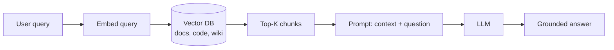
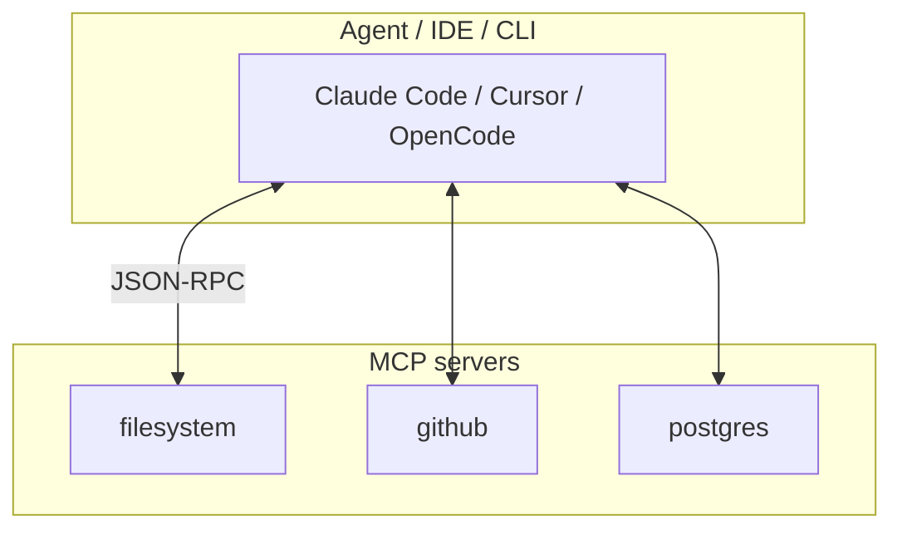
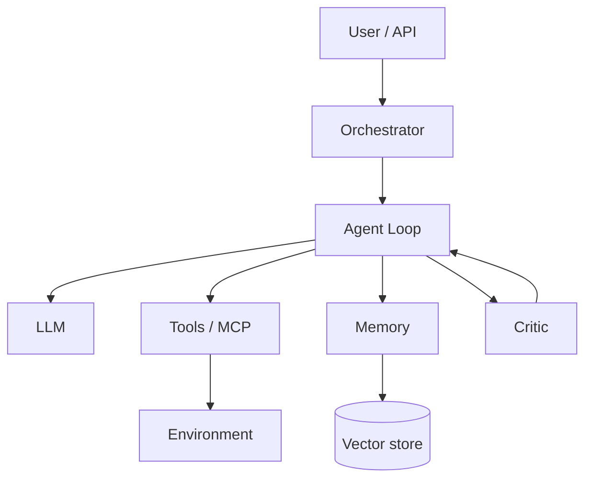

To design or evaluate **AI agents**, knowing the model name is not enough. Almost every system repeats four layers: **knowledge** (RAG), **session memory** (context window), **procedures** (skills), and **capabilities** (often via **MCP**). On top sits the **agent loop**: plan → act → observe → repeat.

This article covers basics and architecture. A **detailed agent survey with memory management** (Pi, Aider, Codex, OpenCode, Claude Code, g3, …) is in the Russian post: [Agent landscape 2026 and memory](/vairl/blog/2026/07/03/agent-landscape-memory-ru/).

Related: [RAG for agents](/vairl/blog/2026/07/03/agent-rag-approaches-ru/), [g3 dialectical autocoding](/vairl/blog/2026/06/25/g3-dialectical-autocoding/), [agent lifecycle](/vairl/blog/2026/07/01/agent-lifecycle-pipeline/), [telemetry](/vairl/blog/2026/06/29/agent-telemetry/).

---

## What is RAG

**RAG** (Retrieval-Augmented Generation) means the model does not rely on weights alone—it **retrieves relevant chunks** from external storage before answering and injects them into the prompt.

### How it works



1. **Indexing (offline):** chunk documents → embeddings → vector store.
2. **Retrieval (online):** embed query → similarity search → top-K.
3. **Augmentation:** insert chunks into the prompt.
4. **Generation:** LLM synthesizes; good systems add citations and faithfulness checks.

### Coding-agent example

User: *"Where is rate limiting configured in our repo?"*

| Without RAG | With RAG |
|-------------|----------|
| Model guesses from general patterns | Agent searches `middleware/`, configs, comments |
| Higher hallucination risk | Answer cites `rate_limiter.rs:42` |

**Limits:** chunking and embedding quality matter; wrong-but-plausible chunks cause confident errors; RAG does not replace **tools** (the agent still needs `read_file` and `bash`).

---

## Context window

The **context window** is the maximum token budget the model sees in one forward pass: system prompt + history + tool outputs + RAG/skills.

| Component | Examples | Typical share |
|-----------|----------|---------------|
| System prompt | Role, rules, tool list | 2–15% |
| Project rules | `CLAUDE.md`, `AGENTS.md` | 1–10% |
| Message history | Past user/assistant turns | 20–60% |
| Tool outputs | Diffs, test logs, stdout | 30–70% |
| RAG / skills | Docs, `SKILL.md` | 5–25% |

When the window fills, early details are **evicted**. Mitigations:

- **Compaction** — summarize old turns (Hermes, g3, OpenCode)
- **Context thinning** — replace large tool outputs with file references (g3)
- **Sub-agents** — heavy search in a child session (OpenCode `explore`, Claude subagents)
- **Fresh instance per turn** — new agent instance each step (g3 Coach/Player)

**Engineering takeaway:** context is a **sliding buffer with an eviction policy**, not permanent memory.

---

## What is a skill

A **skill** is a **portable package of know-how** for an agent, usually a directory with `SKILL.md` ([agentskills.io](https://agentskills.io)).

```
my-skill/
├── SKILL.md          # when to use, steps, constraints
├── scripts/          # optional helpers
└── references/       # optional templates
```

| | **Tool** | **Skill** |
|---|----------|-----------|
| Does | Executes an action | Teaches **how** to act |
| Visibility | Always in tool schema | Loaded when task-relevant |
| Example | `grep`, `run_tests` | "How to write Alembic migrations here" |

The agent does not "call" a skill—it **reads** the instructions and uses normal tools.

---

## Why MCP matters

**MCP** (Model Context Protocol) is an open standard for connecting **external capabilities** to agents: databases, browsers, GitHub, Slack, custom APIs.

### What is an MCP server

An **MCP server** is a process (or in-process module) that exposes:

1. **Tools** (JSON-schema calls)
2. **Resources** (readable documents/files)
3. **Prompts** (templates)



**Why it matters:** one server, many clients—less adapter sprawl, centralized permissions, portability across Claude Code, Cursor, OpenCode.

**ACP** (Agent Client Protocol) is adjacent: it connects a **whole agent** to an IDE (Zed, JetBrains), not individual tools.

---

## Basic elements of agent systems



| Element | Role |
|---------|------|
| Orchestrator | Routing, limits, retry |
| Agent loop | while: LLM → tools → observe |
| Tools | Side effects (shell, FS, browser) |
| Memory | Short + long term |
| RAG | External knowledge |
| Skills | Procedural knowledge |
| MCP | Standardized tools |
| Critic | Independent verification |

Classic **ReAct** cycle: Thought → Action → Observation until done.

---

## Agent survey (separate post)

Product comparison—TUI, feature tables, and **memory management per agent**—is in:

**[Agent landscape 2026 and memory (RU)](/vairl/blog/2026/07/03/agent-landscape-memory-ru/)**

---

## Summary

1. **RAG** brings external knowledge; **context window** is bounded short-term memory; **skills** are procedures; **MCP** standardizes tools.
2. Any agent system = **loop + tools + memory + (optional) critic**.
3. Per-product memory details: [landscape post](/vairl/blog/2026/07/03/agent-landscape-memory-ru/).

---

## Sources

- [Model Context Protocol](https://modelcontextprotocol.io/)
- [Agent Skills](https://agentskills.io/)
- [Agent landscape 2026 and memory](/vairl/blog/2026/07/03/agent-landscape-memory-ru/)
- [g3 on VAIRL](/vairl/blog/2026/06/25/g3-dialectical-autocoding/)
