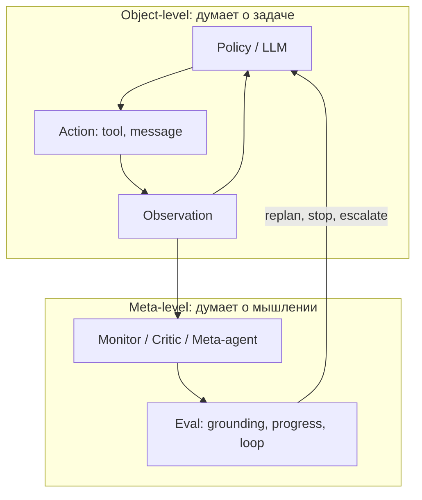
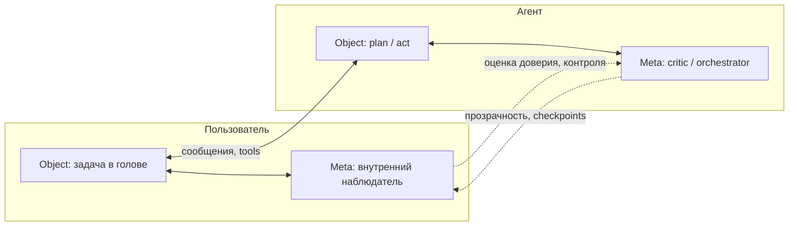

Когда агент решает задачу, происходят **два разных уровня** процесса. На первом — он думает *о мире*: ищет документы, пишет код, отвечает пользователю. На втором — он (или система вокруг него) думает *о том, как он думает*: насколько рассуждение сходится к цели, не застряло ли оно в цикле, не ушло ли в галлюцинацию.

Это и есть **метакогниция** — когниция о когниции. У человека тот же слой часто называют «внутренним голосом», «наблюдающим Я» или, в инженерных терминах продукта, **второй частью пользователя**: та половина, которая не только действует, но и оценивает, *как* она действует.

Ниже — как метакогниция устроена у AI-агента, как её связать с **фазовым пространством смыслов** (траекторией в embedding space) и почему человек за день проходит по похожему ландшафту — только без явного логгера.

Связанные материалы: [устойчивость control loops и фазовый портрет](/vairl/blog/2026/06/29/agent-control-loop-stability-ru/), [телеметрия агентов](/vairl/blog/2026/06/29/agent-telemetry-ru/), [форматы траекторий](/vairl/blog/2026/07/02/agent-trajectory-formats-ru/), [синтез гипотез](/vairl/blog/2026/06/26/llm-hypothesis-synthesis-agents-ru/), [пайплайн ролей агентов](/vairl/blog/2026/07/01/agent-lifecycle-pipeline-ru/).

---

## Два уровня: object-level и meta-level

В когнитивной психологии различают:

| Уровень | Что происходит | Пример у агента | Пример у человека |
|---------|----------------|-----------------|-------------------|
| **Object-level** | Решение задачи «в мире» | Вызвать `grep`, написать SQL, ответить в чат | Написать письмо, доехать до офиса |
| **Meta-level** | Мониторинг и регуляция *процесса* мышления | Critic: «план не сходится, перепланируй» | «Я сейчас тороплюсь и путаю факты» |

Метакогниция — не «ещё один промпт». Это **отдельный контур**, который получает наблюдения о ходе рассуждения и может изменить политику object-level: остановить, уточнить, сменить стратегию, эскалировать человеку.



Без meta-level агент — чёрный ящик с одной петлёй ReAct: он *движется* по пространству смыслов, но не *знает*, куда движется. С meta-level появляется возможность **оценивать траекторию**, а не только следующий токен.

---

## Метакогниция агента: что именно оценивается

Метакогнитивный слой отвечает не на вопрос «что ответить?», а на вопросы о **процессе**:

| Вопрос meta-level | Proxy-метрики | Типичный исполнитель |
|-------------------|---------------|----------------------|
| Есть ли прогресс к цели? | `error_proxy`, checklist sub-goals | Planner-critic, verifier |
| Заземлено ли рассуждение? | `grounding_score`, citation overlap | RAG validator, fact-checker |
| Не зациклился ли агент? | повтор tool/текста, embedding loop | FSM Recovering, dedup guard |
| Укладываемся в бюджет? | tokens, steps, cost | Orchestrator budget gate |
| Нужен ли другой режим? | intent drift, schema fail | Router, escalation ladder |

Это пересекается с [телеметрией](/vairl/blog/2026/06/29/agent-telemetry-ru/): метакогниция **потребляет** те же трассы, что вы и так логируете, но использует их для **регуляции в реальном времени**, а не только для дашбордов post hoc.

### Паттерны реализации

1. **Внутри одной сессии (Reflexion, self-critique)** — после блока CoT модель или отдельный вызов оценивает черновик и пишет «что не так». Object-level и meta-level чередуются в одном контексте.
2. **Отдельный агент-критик** — planner генерирует, critic читает trace без права писать в среду. Чище разделение ролей, проще аудит.
3. **Внешний оркестратор (FSM / BT)** — meta-level не LLM, а правила: «3 одинаковых tool call → STOP». Дешевле и предсказуемее на критичных развилках.
4. **Meta-agent над роями** — supervisor оценивает не один шаг, а **распределение** работы между ролями; см. [пайплайн Prototyper → Maintainer](/vairl/blog/2026/07/01/agent-lifecycle-pipeline-ru/).

Общий принцип: meta-level должен иметь **другую функцию потерь**, чем object-level. Если критик оптимизирует «красивый текст», а не «сходимость к goal», метакогниция превращается в декорацию.

---

## Фазовое пространство смыслов: где «думает» агент

В [статье про устойчивость control loops](/vairl/blog/2026/06/29/agent-control-loop-stability-ru/) мы разобрали аналогию: **embedding space агента — фазовое пространство**, по которому идёт траектория состояний. Каждый шаг — точка (или регион) в пространстве смыслов; политика задаёт **векторное поле** — куда tendит динамика из текущей области.

Для метакогниции важны не отдельные точки, а **геометрия пути**:

| Наблюдение на траектории | Метакогнитивная интерпретация | Действие meta-level |
|--------------------------|-------------------------------|---------------------|
| Сходимость к аттрактору с высоким grounding | Успешное рассуждение | Продолжить или завершить |
| Предельный цикл в проекции | Бесполезный ReAct-loop | Прервать, сменить tool или стратегию |
| Дрейф от RAG-области | Размывание опоры на фактах | Вернуть retrieval, restate constraints |
| Прыжок через сепаратрису | Смена интерпретации задачи | Явный FSM: уточнить intent у пользователя |
| Расходящаяся траектория | Runaway hallucination | Снизить temperature, human gate |

Object-level **живёт на траектории**. Meta-level **смотрит на траекторию целиком** — как физик на фазовом портрете различает устойчивую точку и предельный цикл.

```
   object-level:  · → · → · → · → ·     (шаг за шагом)
   meta-level:    наблюдает форму пути ──→ «это цикл, стоп»
```

### Что логировать для метакогниции

Минимальный набор полей на каждом шаге (дополняет [схему телеметрии](/vairl/blog/2026/06/29/agent-telemetry-ru/)):

| Поле | Роль в meta-level |
|------|-------------------|
| `step_embedding` | расстояние до goal, детекция цикла |
| `grounding_score` | отделить «уверенный» дрейф от заземлённого хода |
| `graph_distance_to_goal` | прогресс по DAG плана |
| `mode` (Planning / Executing / Recovering) | контекст для критика |
| `meta_verdict` | решение критика: continue / replan / escalate |

Из серии эмбеддингов `(e₀, e₁, …, eₙ)` meta-agent может вычислять простые эвристики: **средняя скорость приближения к `goal_embedding`**, **дисперсия направления** (блуждание), **периодичность** (автокорреляция на окне k шагов). Это не магия — это количественная версия «что-то пошло не так».

Связь с [пространством гипотез](/vairl/blog/2026/06/24/hypothesis-space-pacmap-ru/): там точки — **альтернативные конфигурации**; здесь — **состояния во времени**. Метакогниция может переключать агента между ветками гипотез, если текущая траектория входит в бассейн плохого аттрактора.

---

## «Вторая часть» пользователя: тот же фазовый слой

У человека нет OTel spans, но архитектура узнаваема.

**Первая часть** — то, что делает сейчас: печатает сообщение, принимает решение на встрече, идёт за кофе. **Вторая часть** — внутренняя система, которая параллельно комментирует процесс: «зачем я это сказал», «я устал и путаю цифры», «надо вернуться к исходному вопросу».

В течение дня человек непрерывно движется по **пространству смыслов**:

- утренний intent («сегодня закрыть отчёт»);
- отвлечения и новые наблюдения (письмо, разговор, уведомление);
- внутренние пересборки плана;
- вечерняя ретроспектива («что из задуманного сделано»).

Это та же геометрия, что у агента: **траектория в семантическом пространстве**, только носитель — биологическая рабочая память, а не context window.

| Агент | Человек («вторая часть») |
|-------|-------------------------|
| System prompt + memory | Ценности, привычки, долгосрочные цели |
| CoT / chain of messages | Внутренний монолог |
| Critic / verifier | «Стоп, проверь факты» |
| FSM Recovering | Переключение задачи после ошибки |
| Human-in-the-loop | Разговор с коллегой / дневник |
| Trajectory log | Эпизодическая память дня |

Классическая пара «Система 1 / Система 2» (Канеман) — грубое приближение: быстрые автоматические ответы vs медленная проверка. **Метакогниция ближе ко второй системе**, но не совпадает с ней: можно медленно думать *неправильно* и при этом не замечать ошибку. Нужен именно **мониторинг процесса**, а не просто больше времени на размышление.

### Почему аналогия полезна продукту

Когда вы проектируете агента для человека, вы строите **пару траекторий**:

1. **Траектория агента** — как он решает задачу.
2. **Траектория пользователя** — как он *переживает* взаимодействие: доверие, когнитивная нагрузка, ощущение контроля.

«Вторая часть» пользователя — это его метакогнитивный слой над диалогом с агентом: «мне это объяснили или меня убедили?», «агент повторяется», «я потерял нить». Хороший продукт **снимает нагрузку с meta-level пользователя**: показывает план, цитирует источники, явно маркирует неуверенность — чтобы человеку не приходилось быть единственным критиком.

Плохой продукт перегружает object-level красивым текстом и заставляет **вторую часть** работать сверхурочно: ловить галлюцинации, восстанавливать контекст, помнить, что агент уже три раза менял ответ.

---

## Метакогниция как замкнутый контур

Сведём уровни в одну схему:



Замкнутый контур метакогниции устойчив, когда:

- **meta-level имеет полномочия** — не только комментирует, но и меняет режим (stop, replan, ask user);
- **сигнал ошибки формализован** — не «мне не нравится», а `grounding_score`, `steps_without_progress`;
- **есть разрыв положительной обратной связи** — критик не поддакивает planner'у в бесконечном цикле; см. [раздел про feedback](/vairl/blog/2026/06/29/agent-control-loop-stability-ru/#обратная-связь-стабилизирующая-и-разгоняющая);
- **траектория сохраняется** — meta-level работает на данных, а не на ощущениях; см. [форматы траекторий](/vairl/blog/2026/07/02/agent-trajectory-formats-ru/).

---

## Практический минимум: три слоя

Для продакшен-агента метакогницию не обязательно называть философским термином. Достаточно трёх явных слоёв:

### 1. Монитор (пассивный)

На каждом шаге считает proxy без вмешательства: embedding drift, cost, повторы. Пишет в trace. Это фундамент для [eval и replay](/vairl/blog/2026/06/29/agent-benchmark-generation-ru/).

### 2. Регулятор (активный)

Пороговые правила и лёгкий critic: «если 2 шага без роста grounding → restate goal и один retrieval». Связь с FSM **Recovering** в [гибридном оркестраторе](/vairl/blog/2026/06/26/hybrid-agent-dag-fsm-behavior-tree-ru/).

### 3. Рефлексия (межсессионная)

После эпизода — разбор траектории: что сработало, какой паттерн попал в limit cycle. Результат идёт в [синтез гипотез](/vairl/blog/2026/06/26/llm-hypothesis-synthesis-agents-ru/) или в обновление промптов / FSM, а не остаётся в чате.

Человек делает то же самое вечером: object-level закончил день, meta-level пересобирает опыт. Разница в том, что агент может **автоматизировать** третий слой, если траектории структурированы.

---

## Где аналогия с человеком обрывается

Честные ограничения:

| У человека | У агента |
|------------|----------|
| Метакогниция связана с телесным состоянием (усталость, стресс) | Нет тела; «усталость» — лимит контекста и budget |
| Вторая часть развита неравномерно; можно не заметить собственную ошибку | Meta-level можно встроить по дизайну — но он тоже может ошибаться |
| Смысл не сводится к вектору в Rⁿ | Embedding — полезная проекция, не полная онтология мышления |
| Этика и ответственность — не производная от critic score | Guardrails и policy — отдельный контур |

Не стоит утверждать, что LLM «обладает сознанием» или «настоящей» метакогницией. Инженерно корректнее: **метакогниция — архитектурный паттерн** — отдельный контур оценки процесса рассуждения, который можно реализовать, измерить и улучшать по траекториям в фазовом пространстве смыслов.

---

## Резюме

- **Метакогниция агента** — не «умнее промпт», а **второй уровень**: мониторинг и регуляция того, *как* идёт рассуждение.
- **Фазовое пространство смыслов** (embedding space, траектория шагов) — общий язык для object-level и meta-level: один и тот же путь читается по-разному.
- **«Вторая часть» пользователя** — человеческий аналог meta-level: внутренний наблюдатель, который в течение дня следит за собственной траекторией в том же пространстве задач и смыслов.
- Продукт, который помогает **обеим** метакогнитивным системам — агента и человека — снижает когнитивную нагрузку и повышает доверие: прозрачные планы, заземление, явные точки остановки.

Дальше по цепочке: внедрить поля `step_embedding` и `meta_verdict` в [телеметрию](/vairl/blog/2026/06/29/agent-telemetry-ru/), построить фазовые портреты проблемных сессий и связать выводы с [гипотезами об улучшении агента](/vairl/blog/2026/06/26/llm-hypothesis-synthesis-agents-ru/) — метакогниция перестаёт быть метафорой и становится измеряемым контуром.

---

## Литература и смежные рамки

- Flavell, J. H. — метакогниция как знание о когнитивных процессах и их регуляция.
- Nelson, T. O. & Narens, L. — модель meta-level / object-level в психологии памяти.
- Kahneman, D. — *Thinking, Fast and Slow* (Система 1 / 2 как интуиция, не тождественная метакогниции).
- Shneiderman, H. — human-centered AI: оставить пользователю контроль и осмысленную обратную связь.
- Связь с кибернетикой второго порядка (наблюдатель за наблюдателем) — мост к [ОГАС / Cybersyn](/vairl/blog/2026/07/01/cybernetic-planning-ogas-cybersyn-ru/) и многоуровневым системам управления.
