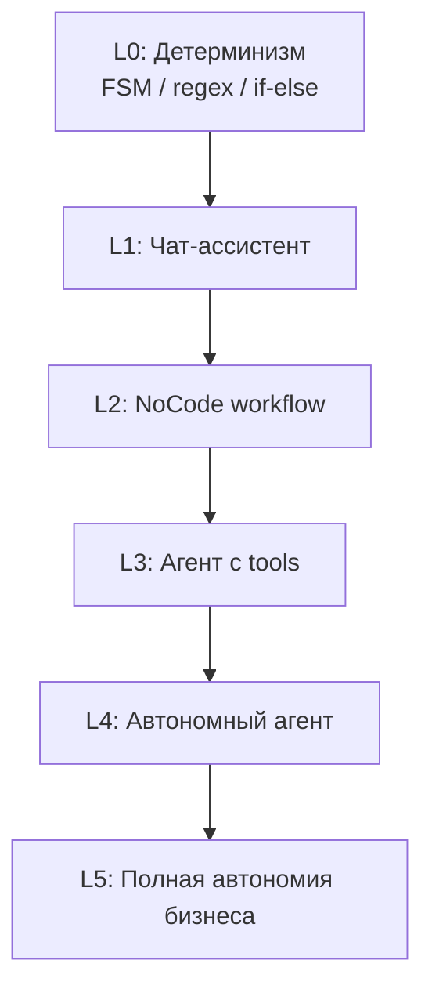
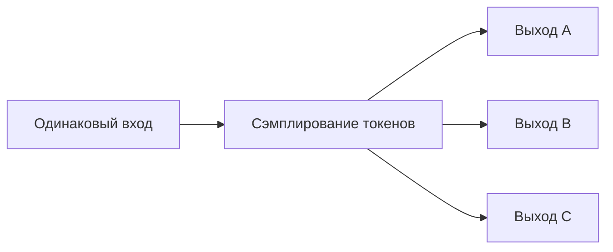
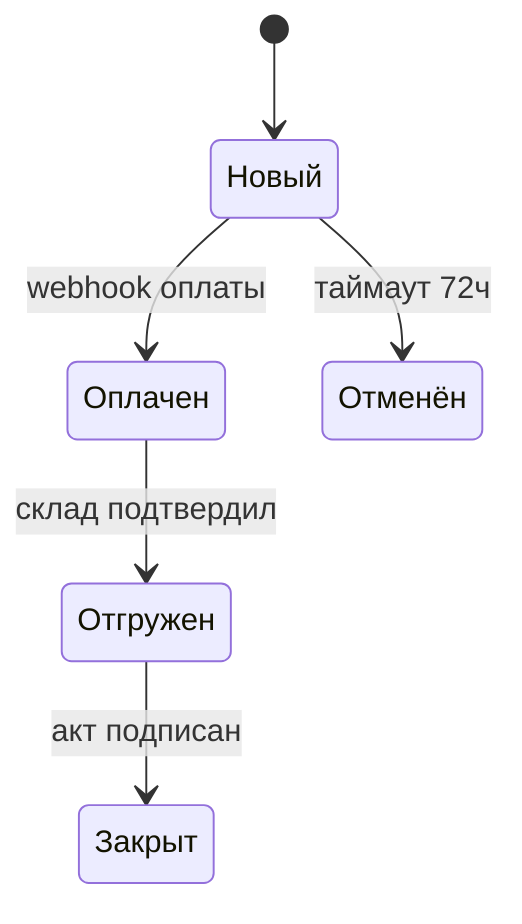
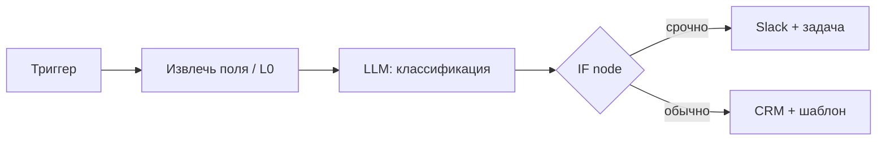
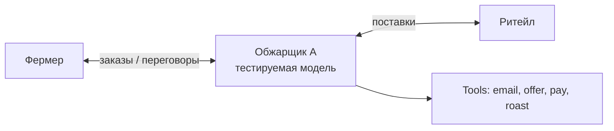
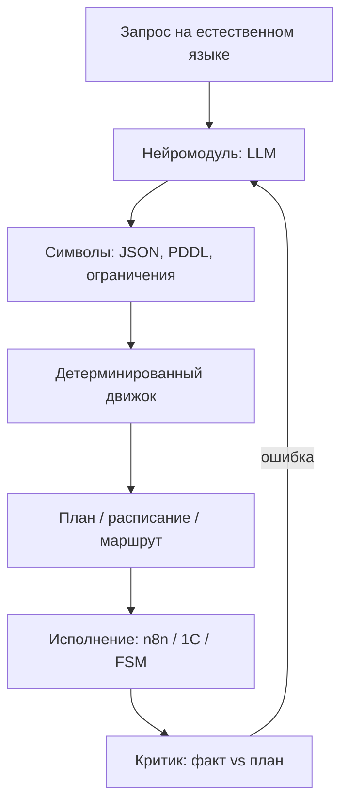
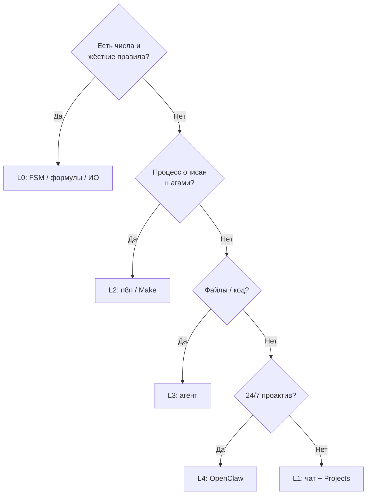

Малый и средний бизнес (МСБ) впервые получил доступ к инструментам, которые **раньше требовали отдела разработки**: агенты, которые читают почту и CRM, NoCode-цепочки с вызовом LLM, автономные помощники в Telegram. Но ландшафт фрагментирован — ChatGPT, n8n, Cursor, OpenClaw, Make, Zapier — и без карты легко потратить бюджет на «игрушку», которая не окупится.

Эта статья — **практический обзор для неспециалистов**, выстроенный **по уровням автоматизации**: от детерминированных правил (уровень 0) до экспериментов с полной автономией бизнеса (уровень 5). Отдельно — **случайная природа LLM**, сравнение с конечными автоматами и regex, **нейросимволика**, классическое **исследование операций** и уроки **Apollo**. Технические детали RAG, MCP и agent loop — в [фундаменте агентных систем](/vairl/blog/2026/07/02/agent-fundamentals-rag-mcp-landscape-ru/).

---

## Карта статьи

| Уровень | Раздел | О чём |
|---------|--------|--------|
| — | [Случайность LLM](#случайная-природа-llm-почему-это-важно-бизнесу) | Почему один промпт ≠ один результат |
| L0 | [Детерминированная логика](#уровень-l0-детерминированная-логика) | FSM, условия, regex, принципы Apollo |
| L1 | [Чат-ассистент](#уровень-l1-чат-ассистент) | ChatGPT, Claude, Projects |
| L2 | [NoCode](#уровень-l2-nocode-workflow) | n8n, Make, Zapier, топ-кейсы |
| L3 | [Агенты с tools](#уровень-l3-агенты-с-инструментами) | Cursor, Codex, Claude Code |
| L4 | [Автономные агенты](#уровень-l4-автономные-агенты) | OpenClaw, heartbeat |
| L5 | [Полная автоматизация](#уровень-l5-полная-автоматизация-граница-coffeebench) | [CoffeeBench](https://sakana.ai/coffee-bench/) |
| — | [Нейросимволика и ИО](#нейросимволический-подход-и-исследование-операций) | Гибрид LLM + solver |
| — | [Внедрение, стек, риски](#как-выбрать-подходящий-стек) | Пилот, метрики, 90 дней |

---

## Шесть уровней автоматизации

| Уровень | Что делает | Предсказуемость | Типичный инструмент | Где МСБ сегодня |
|---------|------------|-----------------|---------------------|-----------------|
| **L0** | Фиксированные правила, без LLM | **100%** | Excel, 1С, cron, regex, BPMN | Должны оставаться ядром |
| **L1** | Отвечает, пишет черновики | Высокая* | ChatGPT, Claude, Gemini | Старт почти везде |
| **L2** | Цепочка по триггеру + опционально LLM | Высокая | n8n, Make, Zapier | Основной ROI |
| **L3** | Сам выбирает шаги, tools | Средняя | Cursor, Codex, ChatGPT Agent | Файлы, отчёты |
| **L4** | Проактивно 24/7 по политике | Низкая–средняя | OpenClaw, Hermes | Ops-дайджесты |
| **L5** | Ведёт бизнес неделями | Низкая (исслед.) | CoffeeBench, Project Vend | Пока не для продакшена МСБ |

\*При фиксированных `temperature=0` и одном провайдере — но см. раздел про стохастичность.

**Правило для МСБ:** чем выше уровень, тем **больше экономии** и тем **выше риск**. Надёжный стек — **L0 внутри**, LLM **только там, где нужна вариативность языка**, L3–L4 с human-in-the-loop.

---

## Случайная природа LLM: почему это важно бизнесу

LLM — **стохастическая** система: при одном и том же промпте ответ **не гарантированно одинаков**. Модель сэмплирует следующий токен из распределения вероятностей; параметр **temperature** управляет «шириной» этого распределения.

| Параметр | Эффект | Для бизнеса |
|----------|--------|-------------|
| `temperature = 0` | Более детерминированно | Классификация, извлечение полей |
| `temperature > 0.7` | Креативнее, разброснее | Маркетинговые тексты |
| Разные версии модели | Другое поведение без вашего ведома | Регрессии после обновления API |
| Длинный контекст | «Забывание» ранних инструкций | Ошибки в многошаговых цепочках |

**Следствия для автоматизации:**

1. **Нельзя** строить критичный платёжный или юридический контур «только на промпте» — нужен L0-слой проверки (regex на ИНН, лимиты сумм, FSM статусов заказа).
2. **Eval обязателен:** 20 одних и тех же кейсов → доля совпадений с эталоном; см. [телеметрию агентов](/vairl/blog/2026/06/29/agent-telemetry-ru/).
3. **Агент «думает, но не делает»** — задокументированный паттерн: в бенчмарке [CoffeeBench](#уровень-l5-полная-автоматизация-граница-coffeebench) Claude Haiku 4.5 анализировал рынок, но вызывал только `wait_for_next_day()` — чистый убыток от фиксированных расходов.

**Практический вывод:** LLM — **генератор гипотез и текста**, не **исполнитель инвариантов**. Инварианты («сумма = цена × кол-во», «статус только из списка») — зона L0.

---

## Уровень L0: детерминированная логика

Перед ChatGPT и n8n в бизнесе десятилетиями работали **детерминированные** механизмы. Их не отменяет ИИ — наоборот, **лучшие внедрения** ставят LLM **над** детерминированным ядром.

### Сравнение: LLM vs конечный автомат vs условия vs regex

| Механизм | Как работает | Сильные стороны | Слабые стороны | Пример в МСБ |
|----------|--------------|-----------------|----------------|--------------|
| **Условный оператор** (`if/else`) | Явная ветка по значению | Прозрачность, тестируемость | Взрыв вложенности | «Если сумма > 100k — согласование директора» |
| **Конечный автомат (FSM)** | Состояния + переходы по событиям | Модель жизненного цикла заказа | Нужно проектировать состояния | `новый → оплачен → отгружен → закрыт` |
| **Регулярное выражение** | Паттерн по строке | Скорость, 0 токенов | Хрупкость на «почти как» | Email, телефон, номер счёта |
| **LLM** | Вероятностное продолжение текста | Вариативный язык, классификация «на глаз» | Нестабильность, стоимость | «Определи тон отзыва» |

### Когда LLM хуже детерминированного алгоритма

| Задача | LLM | L0 лучше |
|--------|-----|----------|
| Валидация email | Иногда пропускает опечатки | Regex + DNS MX |
| Расчёт НДС, скидок, остатков | Галлюцинации в арифметике | Формулы в 1С / Excel |
| Маршрут заявки по отделу | «Угадывает» отдел | FSM + ключевые слова / regex |
| SLA эскалация | Забывает дедлайн | Cron + условие по дате |
| Дубликаты в CRM | Нестабильное сравнение | Hash полей, fuzzy match с порогом |

**Золотое правило:** если процесс рисуется **блок-схемой без «магии»** — реализуйте L0 (n8n IF, код, 1С), LLM только для **неструктурированного текста** на входе или выходе.

### Принципы Apollo: детерминизм там, где цена ошибки — миссия

Программное обеспечение **Apollo Guidance Computer** — эталон **критичной надёжности**: каждая строка ревьюилась до «прошивки» в rope memory, откат стоил неделями. Маргарет Гамильтон сформулировала инженерию ПО как дисциплину с **приоритетами задач**, **restart-логикой** и **многоуровневой верификацией** — см. [статью VAIRL про Гамильтон и Apollo](/vairl/blog/2026/07/01/margaret-hamilton-software-reliability-ru/).

| Принцип Apollo | Смысл для МСБ с ИИ |
|----------------|-------------------|
| **Сделать правильно до «прошивки»** | Сначала FSM и тест-кейсы, потом автоматизация в прод |
| **Priority scheduling** | Критичные действия (оплата, отгрузка) — отдельная очередь, не в одном «агенте на всё» |
| **Error detection + recovery** | Явные таймауты, откат, алерт человеку (аналог alarm 1202 → сброс фоновых задач) |
| **Шесть уровней тестирования** | Unit на regex/формулы → интеграция n8n → пилот на 20 реальных кейсах |
| **Трассируемость** | Лог: вход, правило, выход LLM, кто одобрил |

Для МСБ это не «писать на ассемблере», а **не отдавать расчёты и статусы на откуп LLM**. Агент готовит черновик письма — **L3**; переход заказа в «оплачен» — **только webhook + FSM (L0)**.

---

## Уровень L1: чат-ассистент

**L1** — сотрудник открывает ChatGPT/Claude, вставляет контекст, копирует ответ. Никакой автоматической связи с CRM.

| Инструмент | Сильная сторона для МСБ |
|------------|-------------------------|
| **ChatGPT** | Универсальность, Agent mode с браузером |
| **Claude Projects** | Длинные документы, база файлов компании |
| **Gemini** | Интеграция с Google Workspace |
| **Custom GPT** | FAQ для команды по внутренним правилам |

**Ограничения L1:** нет триггеров, нет аудита «кто что отправил клиенту», высокий риск **теневого ИИ** (сотрудники кидают PII в личный чат).

**Следующий шаг:** один процесс перевести в L2 (n8n) с логированием.

---

## Уровень L2: NoCode workflow

**NoCode** — соединение сервисов блоками: триггер → шаги → действие. LLM — **одна нода** среди детерминированных.

### n8n

| | |
|---|---|
| **Тип** | Open-source workflow engine (облако и self-hosted) |
| **Сайт** | [n8n.io](https://n8n.io) |
| **Сильные стороны** | 400+ интеграций, AI-ноды, ветвление IF/Switch, Code node |
| **Цена** | Self-hosted — бесплатно; Cloud — от ~$20/мес |

### Make и Zapier

| Критерий | **Make** | **Zapier** |
|----------|----------|------------|
| Сложность | Ветвления, сценарии | Линейные Zaps, быстрый старт |
| AI | Модули OpenAI | AI Actions |
| Self-hosted | Нет | Нет |

### Наиболее популярные кейсы в n8n (МСБ)

По частоте шаблонов сообщества и типовых интеграций:

| # | Кейс | Триггер → действие | Уровень |
|---|------|-------------------|---------|
| 1 | **Лид с сайта в CRM** | Webhook формы → HubSpot/Pipedrive + уведомление Slack | L2 |
| 2 | **Триаж входящей почты** | Gmail → LLM: тема/срочность → метка + задача | L2 + L1-нода |
| 3 | **Синхронизация CRM ↔ таблица** | Изменение сделки → Google Sheets / Airtable | L0–L2 |
| 4 | **Онбординг сотрудника** | Новая запись HR → аккаунты + чеклист Notion | L2 |
| 5 | **Соцсети и контент** | RSS / Notion → черновик → approval → публикация | L2 |
| 6 | **E-commerce: заказ → склад** | Shopify/WooCommerce → Telegram + 1С/webhook | L0–L2 |
| 7 | **Счета и документы** | PDF в почте → извлечение полей (LLM/OCR) → таблица | L2 |
| 8 | **Поддержка: тикет из чата** | Telegram/Intercom → классификация → очередь | L2 |
| 9 | **Напоминания и SLA** | Cron → просроченные задачи → эскалация | L0–L2 |
| 10 | **RAG-чатбот для FAQ** | Вопрос → vector DB → ответ LLM → лог | L2 |
| 11 | **Резервное копирование** | Расписание → export DB → S3/Drive | L0 |
| 12 | **AI-обогащение лидов** | Новый контакт → поиск LinkedIn/site → summary в CRM | L2–L3 |

**Паттерн надёжности:** LLM-классификация → **Switch по enum** (не свободный текст в следующую ноду) → детерминированные действия.

**Когда L2 не хватает:** многошаговый разбор с итерациями «подумал — проверил — исправил» → L3.

---

## Уровень L3: агенты с инструментами

**Агент** сам выбирает последовательность tool calls: читать файлы, HTTP, bash, браузер.

### Что может МСБ без программирования

| Задача | Инструмент |
|--------|------------|
| Сводка 50 PDF | Cursor / Claude Code: папка → таблица |
| КП из шаблона | Агент + `template.docx` + brief |
| Анализ отзывов CSV | Группировка тем + доли |
| JSON workflow для n8n | Агент генерирует → импорт |

| Агент | Порог входа | Лучше для |
|-------|-------------|-----------|
| **ChatGPT Agent** | Минимальный | Браузер, коннекторы M365/Google |
| **Cursor** | Низкий | Папка документов бизнеса |
| **Claude Code** | Средний | Скрипты на диске, cron |
| **Codex CLI** | Средний | `codex exec` в расписании |

Подробный обзор TUI и архитектур — [фундамент агентных систем](/vairl/blog/2026/07/02/agent-fundamentals-rag-mcp-landscape-ru/).

---

## Уровень L4: автономные агенты

**OpenClaw** (иногда путают с «OpenCloud») — self-hosted агент 24/7 в Telegram/WhatsApp/Slack с **heartbeat** (периодические проверки без запроса пользователя).

| | **n8n (L2)** | **OpenClaw (L4)** |
|---|--------------|-------------------|
| Логика | Фиксированная схема | LLM выбирает шаг |
| Запуск | Триггер | Триггер + расписание + heartbeat |
| Кейс | «Заявка → CRM» | «Утренний дайджест + эскалация» |

**Старт для МСБ:** read-only почта и календарь, подтверждение перед отправкой. См. [устойчивость control loops](/vairl/blog/2026/06/29/agent-control-loop-stability-ru/).

---

## Уровень L5: полная автоматизация — граница CoffeeBench

**L5** — не продукт для покупки, а **исследовательская граница**: насколько LLM-агент способен **неделями вести бизнес** без человека. Главный публичный пример — **[CoffeeBench](https://sakana.ai/coffee-bench/)** от [Sakana AI](https://sakana.ai/) и японского аудиторского дома Azusa.

### Что такое CoffeeBench

| | |
|---|---|
| **Суть** | Бенчмарк **долгосрочного** поведения LLM-агентов в **мультиагентной экономике** |
| **Сеттинг** | Цепочка поставок **кофе**: фермер → обжарщик → ритейл |
| **Горизонт** | **90 симулированных дней** |
| **Агенты** | 6 компаний с разными ролями; каждый — ReAct-агент с tools |
| **Цель** | Максимизировать **чистую прибыль** обжарщика (роль под тестируемой моделью) |
| **Ресурсы** | [Статья на сайте](https://sakana.ai/coffee-bench/), [технический отчёт](https://pub.sakana.ai/coffeebench/), [arXiv:2606.16613](https://arxiv.org/abs/2606.16613), [код](https://github.com/SakanaAI/CoffeeBench), [траектории](https://pub.sakana.ai/coffeebench/trajectories.html) |

### Принципы симуляции

1. **Инструменты вместо «магии»:** сообщения контрагентам, заказы, оплата счетов, ролевые действия (`produce_item`, `roast`, `set_retail_price`).
2. **Время и ресурсы:** вызов tool ≈ 30 минут симуляционного времени; **фиксированные расходы** каждый день — бездействие = убыток.
3. **Реализм B2B:** отсрочка платежа, колебания спроса, переговоры о цене.
4. **Мультиагентность:** остальные 5 фирм управляются фиксированной моделью (Claude Sonnet 4.6), тестируемая модель — обжарщик A.

### Результаты экспериментов

| Наблюдение | Детали |
|------------|--------|
| **Все модели лучше пассивного baseline** | «Ничего не делать» → накопление убытка от фиксированных затрат |
| **Разброс между моделями велик** | GPT-5.5, Claude Opus 4.7 — устойчивый рост прибыли; Claude Haiku 4.5 — **убыток** |
| **Лидеры активны** | Больше переговоров, `make_offer` / `accept_offer`, сообщений фермерам и ритейлу |
| **Много tool calls ≠ прибыль** | Kimi K2.6 много вызывал tools, но не конвертировал в сделки |
| **«Думает, но не действует»** | Haiku в логе рассуждал о спросе, но вызывал только `wait_for_next_day()` — **разрыв мышления и действия** |
| **Давление KPI и этика** | При смене цели на «продажи любой ценой» исследователи смотрят риск **циклических сделок** и обхода аудита — тема governance |

### Уроки для МСБ (без запуска L5 в прод)

| Урок CoffeeBench | Практика МСБ |
|------------------|--------------|
| Долгий горизонт ломает слабые модели | Не доверяйте L4 на «дешёвой» модели критичный контур |
| Нужны метрики поведения, не только KPI | Логируйте **действия**, не только выручку |
| Коммуникация с контрагентами критична | CRM + шаблоны переговоров (L2), не «агент сам договорится» |
| Пассивность дорого стоит | Автоматизируйте **напоминания** (L2), не ждите «умного» агента |
| Governance заранее | Лимиты сумм, dual control на платежи (L0) |

**Вывод:** L5 показывает **куда движется индустрия** (аудит фирмы Azusa как соавтор — сигнал для учёта и compliance). Для кофейни из 3 точек в 2026 году разумная цель — **L2 + точечный L3**, не «робот-директор».

Смежные эксперименты: Vending-Bench (автомат с LLM), Project Vend (автомат в офисе Anthropic).

---

## Нейросимволический подход и исследование операций

Чистый LLM-план («сделай всё сам») плохо масштабируется. **Нейросимволика** для бизнеса — практичный гибрид:

| Слой | Кто делает | Пример |
|------|------------|--------|
| **Нейро** | LLM | «Из письма извлеки: 500 кг, дата 15.03, склад B» |
| **Символы** | JSON-схема, валидатор | Поля обязательны, дата ISO, вес > 0 |
| **Solver** | OR-библиотека / Excel Solver | Оптимальный микс поставок |
| **Исполнение** | n8n, cron, FSM | Заказ создан только если solver OK |

Концептуальный пайплайн LLM → PDDL/STRIPS → критик — в черновике VAIRL [нейросимволическое планирование](/vairl/blog/2026/06/25/neurosymbolic-planning-pipeline-ru/). Для МСБ достаточно упрощения: **LLM → JSON → IF в n8n**.

### Классические задачи исследования операций (ИО) в бизнесе

**Исследование операций** — математические модели **ограниченной оптимизации** и **очередей**. Они существовали до LLM и **остаются точнее** там, где есть числа и ограничения.

| Задача ИО | Суть | Пример МСБ | Инструмент |
|-----------|------|------------|------------|
| **Линейное программирование (LP)** | Максимум прибыли при ограничениях ресурсов | Микс продуктов при лимите сырья | Excel Solver, OR-Tools |
| **Запасы (EOQ, newsvendor)** | Когда и сколько заказывать | Склад кофе/запчастей | Формулы + 1С |
| **Расписание (scheduling)** | Назначение задач на слоты | Смены бариста, монтажники | Специализированный софт, CP-SAT |
| **Маршрутизация (VRP)** | Кратчайший обход точек | Доставка за день | Яндекс.Маршрутизация, OR-Tools |
| **Теория очередей** | Сколько линий поддержки | Call-center 3 vs 5 операторов | Симуляция + метрики |
| **Симуляция (Monte Carlo)** | What-if при неопределённости | «Что если спрос −20%» | Таблицы, AnyLogic |
| **Назначение (assignment)** | Кто какой заказ ведёт | 10 менеджеров, 40 лидов | Венгерский алгоритм, правила L0 |

**Связь с уровнями:**

| Комбинация | Когда |
|------------|-------|
| **ИО alone (L0)** | Числа известны, модель стабильна |
| **LLM → ИО** | Текст/письмо → структура → solver |
| **LLM без ИО** | Только текст, без жёстких ограничений |

**Ошибка:** просить LLM «оптимизируй загрузку 15 машин на месяц» — получите правдоподобный, но **не оптимальный** план. Правильно: LLM парсит заказы → **solver** → человек утверждает → n8n создаёт задачи.

Гибридный оркестратор DAG/FSM/BT для сложных процессов — [отдельная статья VAIRL](/vairl/blog/2026/06/26/hybrid-agent-dag-fsm-behavior-tree-ru/).

---

## Сравнительный обзор систем

| Категория | Представители | Уровень | Бюджет МСБ |
|-----------|---------------|---------|------------|
| Детерминизм | 1С, Excel, cron, regex | L0 | Встроено |
| Чат | ChatGPT, Claude | L1 | $0–40/мес |
| NoCode + AI | n8n, Make, Zapier | L2 | $20–100/мес + API |
| Агент | Cursor, Codex | L3 | $20–100/мес + API |
| Автономный | OpenClaw, Hermes | L4 | Сервер + API |
| Исследование | CoffeeBench | L5 | Не для продакшена |

---

## Примеры успешного внедрения

| Кейс | Уровни | Результат |
|------|--------|-----------|
| Онлайн-школа, поддержка | L1→L2 | −40% время первого ответа; approval → авто при confidence > 90% |
| Логистика, PDF-накладные | L3 + L2 уведомления | Ручной ввод только `low_confidence` |
| Маркетинговое агентство, отчёты | L2 Make + LLM | 6 ч → 1.5 ч на клиента |
| Соло-предприниматель | L4 OpenClaw read-only | Дайджест «кому ответить» без автоотправки |

---

## Как выбрать подходящий стек

### Чеклист (5 вопросов)

1. **Можно ли решить regex/FSM?** → L0, без LLM.
2. **Повторяемость** → L2. **Вариативность** → L3.
3. **Цена ошибки** → human-in-the-loop.
4. **Данные** → SaaS: Zapier; файлы/1С: n8n self-hosted или агент.
5. **Бюджет API** → токены × шаги; L4 дороже L2.

### Стартовые стеки по размеру

| Размер | Минимум | Рост |
|--------|---------|------|
| Соло | L1 + один L2 Zap | L0 учёт + Make |
| 5–20 | L2 n8n + Claude Projects | L3 отчёты |
| 20–100 | n8n self-hosted + L0 FSM в CRM | L4 дайджест + eval |
| 100+ | + Copilot Enterprise | Роль «владелец автоматизаций» |

---

## Что нужно знать владельцу и менеджеру

1. **LLM стохастичен** — см. [раздел выше](#случайная-природа-llm-почему-это-важно-бизнесу).
2. **L0 — фундамент** — Apollo, не «всё в промпт».
3. **Агент ≠ всегда лучше** — n8n дешевле для детерминированного.
4. **Стоимость** — токены × шаги; L4 может стоить дороже месяца Zapier.
5. **152-ФЗ** — DPA, регион, self-hosted при чувствительных данных.
6. **Eval** — 20 кейсов/месяц; [телеметрия](/vairl/blog/2026/06/29/agent-telemetry-ru/).

---

## Пошаговый план внедрения (90 дней)

| Фаза | Срок | Действия |
|------|------|----------|
| 0 | Неделя 1 | 10 задач; выбрать одну; пометить уровень L0–L3 |
| 1 | Недели 2–4 | L1/L2 пилот; KPI; approval на внешние действия |
| 2 | Недели 5–8 | Снять approval где безопасно; логи; 2 «чемпиона» |
| 3 | Месяц 3+ | L3 файлы; L4 только с политиками; ежемесячный API-аудит |

**Не начинайте с L5.** Изучайте CoffeeBench как **горизонт**, внедряйте **L0–L2**.

---

## Риски и границы ответственности

| Риск | Митигация |
|------|-----------|
| Галлюцинация | RAG + L0-валидация + approval |
| Стохастический регресс | Eval после смены модели |
| Автономное действие | Sandbox, read-only, dual control |
| «Теневой ИИ» | Корпоративные аккаунты, политика |

**Красные линии без человека:** платежи, юридические обязательства, медицина/финансы как совет, продакшн-данные.

---

## Итог

1. **L0 (FSM, regex, ИО, Apollo)** — ядро; LLM не заменяет расчёты и статусы.
2. **L1–L2** — основной ROI МСБ; топ-кейсы n8n — лиды, почта, CRM, SLA.
3. **L3** — пакетные файлы и отчёты.
4. **L4** — дайджесты с лимитами.
5. **L5 (CoffeeBench)** — исследование полной автономии; уроки governance и «думает, но не делает».
6. **Нейросимволика** — LLM понимает текст, solver и FSM исполняют.

ИИ для МСБ — **снять рутину**, не «робот вместо директора». Правильный стек перенастраивается за вечер и **измеряется в часах и ошибках**, не в хайпе.

---

## Связанные материалы VAIRL

- [Фундамент агентных систем: RAG, MCP](/vairl/blog/2026/07/02/agent-fundamentals-rag-mcp-landscape-ru/)
- [Маргарет Гамильтон: Apollo и надёжность ПО](/vairl/blog/2026/07/01/margaret-hamilton-software-reliability-ru/)
- [Гибридный оркестратор DAG/FSM/BT](/vairl/blog/2026/06/26/hybrid-agent-dag-fsm-behavior-tree-ru/)
- [Типы задач в теории систем](/vairl/blog/2026/07/02/systems-theory-task-types-ru/)
- [Телеметрия и eval агентов](/vairl/blog/2026/06/29/agent-telemetry-ru/)
- [Устойчивость agent control loops](/vairl/blog/2026/06/29/agent-control-loop-stability-ru/)
- [Нейросимволическое планирование (черновик)](/vairl/blog/2026/06/25/neurosymbolic-planning-pipeline-ru/)

## Внешние ссылки

- [CoffeeBench — Sakana AI](https://sakana.ai/coffee-bench/)
- [CoffeeBench technical report](https://pub.sakana.ai/coffeebench/) · [arXiv:2606.16613](https://arxiv.org/abs/2606.16613) · [GitHub](https://github.com/SakanaAI/CoffeeBench)
- [n8n](https://n8n.io) · [OpenClaw docs](https://docs.openclaw.ai) · [Make](https://www.make.com) · [Zapier](https://zapier.com)
