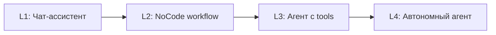
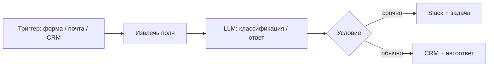
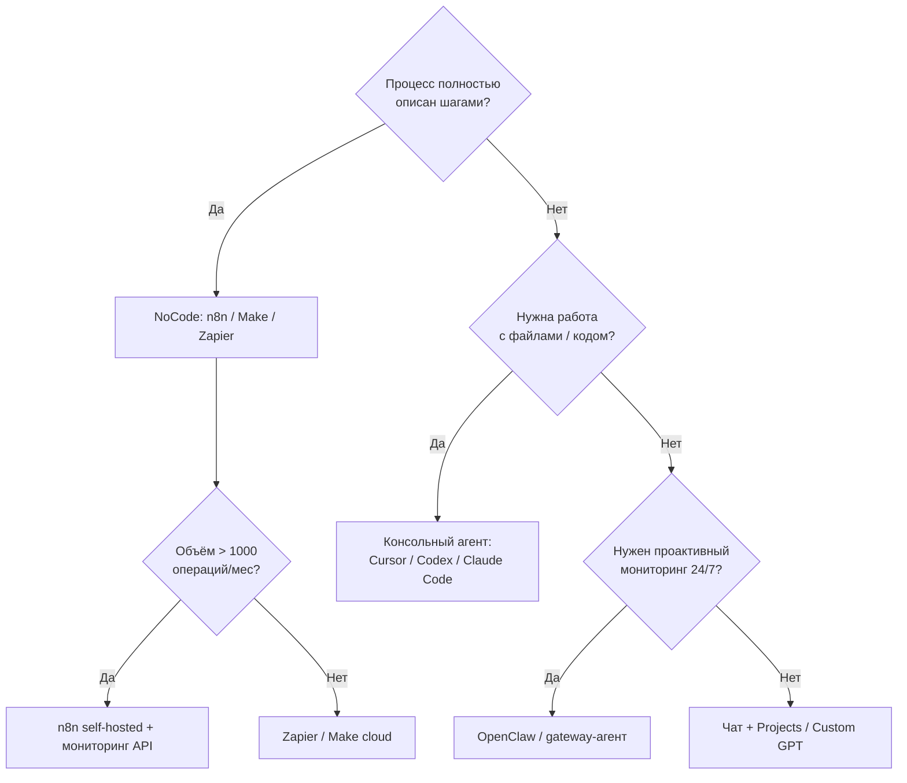
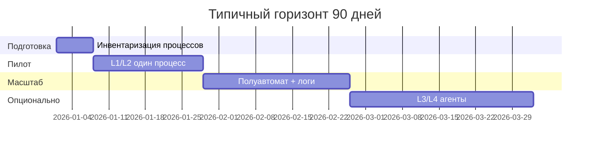

Малый и средний бизнес (МСБ) впервые получил доступ к инструментам, которые **раньше требовали отдела разработки**: агенты, которые читают почту и CRM, NoCode-цепочки с вызовом LLM, автономные помощники в Telegram. Но ландшафт фрагментирован — ChatGPT, n8n, Cursor, OpenClaw, Make, Zapier — и без карты легко потратить бюджет на «игрушку», которая не окупится.

Эта статья — **практический обзор для неспециалистов**: что за чем идёт, какие системы для каких задач, как выбрать стек, что нужно знать владельцу и как внедрять поэтапно. Технические детали RAG, MCP и agent loop — в [фундаменте агентных систем](/vairl/blog/2026/07/02/agent-fundamentals-rag-mcp-landscape-ru/); здесь фокус на **бизнес-процессах и ROI**.

---

## Карта статьи

| Раздел | О чём |
|--------|--------|
| [Четыре уровня автоматизации](#четыре-уровня-автоматизации) | От чата до автономного агента |
| [NoCode: n8n и аналоги](#nocode-n8n-make-zapier) | Цепочки «если — то» с ИИ |
| [Консольные агенты](#консольные-агенты-для-бизнеса) | Cursor, Codex, Claude Code без кода |
| [Автономные агенты: OpenClaw](#автономные-агенты-openclaw) | Помощник 24/7 в мессенджере |
| [Обзор систем](#сравнительный-обзор-систем) | Таблица по категориям |
| [Примеры внедрения](#примеры-успешного-внедрения) | Реальные сценарии МСБ |
| [Как выбрать стек](#как-выбрать-подходящий-стек) | Дерево решений |
| [Что нужно знать](#что-нужно-знать-владельцу-и-менеджеру) | Без математики, но с дисциплиной |
| [План внедрения](#пошаговый-план-внедрения) | 90 дней от пилота до масштаба |
| [Риски](#риски-и-границы-ответственности) | Где агент опасен |

---

## Четыре уровня автоматизации

Не все «ИИ в бизнесе» одинаковы. Полезная классификация — по **степени автономности** и **предсказуемости**:

| Уровень | Что делает | Кто управляет | Типичный инструмент | Предсказуемость |
|---------|------------|---------------|---------------------|-----------------|
| **L1** | Отвечает на вопросы, пишет тексты | Человек копирует результат | ChatGPT, Claude, Gemini | Высокая |
| **L2** | Запускает цепочку по триггеру | Человек настраивает схему | n8n, Make, Zapier | Высокая |
| **L3** | Сам выбирает шаги, вызывает API/файлы | Человек задаёт цель, одобряет действия | Cursor Agent, Codex, ChatGPT Agent | Средняя |
| **L4** | Работает по расписанию и событиям без запроса | Человек задаёт политику и лимиты | OpenClaw, Hermes gateway | Низкая–средняя |

**Правило для МСБ:** начинайте с **L1–L2**, переходите к L3–L4 только там, где процесс **повторяемый**, **измеримый** и **есть кто проверяет результат**.

Связь с теорией систем: выбор уровня — это задача **синтеза** (задан желаемый выход — подобрать систему). См. [типы задач в теории систем](/vairl/blog/2026/07/02/systems-theory-task-types-ru/).

---

## NoCode: n8n, Make, Zapier

**NoCode-автоматизация** — соединение сервисов блоками: «новое письмо в Gmail» → «извлечь данные» → «создать строку в Google Sheets» → «отправить уведомление в Slack». С появлением LLM в эти цепочки добавили шаг **«спросить модель»**.

### n8n

| | |
|---|---|
| **Тип** | Open-source workflow engine (есть облако и self-hosted) |
| **Сайт** | [n8n.io](https://n8n.io) |
| **Сильные стороны** | 400+ интеграций, AI-ноды (OpenAI, Anthropic, локальные модели), ветвление, код при необходимости |
| **Для кого** | МСБ с IT-консультантом или «продвинутым» менеджером; можно на своём сервере |
| **Цена** | Self-hosted — бесплатно; Cloud — от ~$20/мес |

**Типовой сценарий:** заявка с сайта (Webhook) → LLM классифицирует тему и срочность → создаётся задача в Notion/Trello → ответ клиенту из шаблона → копия в CRM.

### Make (Integromat) и Zapier

| Критерий | **Make** | **Zapier** |
|----------|----------|------------|
| Сложность схем | Визуальные «сценарии», ветвления | Линейные «Zaps», проще старт |
| AI-шаги | Есть модули OpenAI и др. | AI Actions, ChatGPT-интеграции |
| Аудитория | Средний бизнес, маркетинг | Микробизнес, быстрый старт |
| Self-hosted | Нет | Нет |

**Когда NoCode достаточно:** процесс **детерминированный** — известны входы, шаги и выходы; LLM нужен только для классификации, суммаризации или генерации текста по шаблону.

**Когда NoCode не хватает:** нужен **многошаговый разбор** с доступом к десяткам источников, итеративное «подумал — сделал — проверил» — это уже **агент** (L3).

---

## Консольные агенты для бизнеса

**Консольный (терминальный) агент** — программа, с которой вы общаетесь в командной строке или встроенном чате IDE; агент **сам вызывает инструменты**: читает файлы, ищет в интернете, запускает скрипты, правит документы.

Для программистов это coding agents (Aider, Codex, Claude Code). Для **бизнеса без кода** важно другое: те же агенты умеют работать с **папкой документов**, **Excel/CSV**, **скриптами на Python**, которые агент пишет за вас.

### Что реально может владелец МСБ без навыков программирования

| Задача | Как использовать агента |
|--------|-------------------------|
| Сводка 50 PDF-отчётов | Положить файлы в папку, попросить агента в Cursor/Claude Code «сделай таблицу: клиент, сумма, дата» |
| Подготовка КП из шаблона | Агент читает `template.docx` + `brief.md`, генерирует черновик |
| Анализ отзывов | CSV из маркетплейса → агент группирует темы и считает доли |
| Настройка n8n | Агент пишет JSON workflow или HTTP-запросы — вы импортируете в n8n |
| Мини-сайт / лендинг | Cursor или Codex собирают статику из описания |

### Обзор консольных агентов (бизнес-угол)

| Агент | Порог входа | Подписка / API | Лучше для МСБ |
|-------|-------------|----------------|---------------|
| **ChatGPT** (веб + Agent mode) | Минимальный | Plus ~$20/мес | Быстрые задачи, браузер, коннекторы Google/Microsoft |
| **Claude** (веб + Projects) | Минимальный | Pro ~$20/мес | Длинные документы, анализ, Projects с базой знаний |
| **Cursor** | Низкий (похож на редактор) | Pro ~$20/мес | Папка с файлами бизнеса + агент «сделай отчёт» |
| **Claude Code** | Средний (терминал) | Claude подписка | Автоматизация файлов и скриптов на диске |
| **Codex CLI** | Средний | ChatGPT Plus/Pro | Скрипты, отчёты, `codex exec` в cron |
| **OpenCode** | Средний | API разных провайдеров | Долгие сессии, plan/build режимы |

Подробное техническое сравнение TUI и архитектур — в [обзоре агентных программ](/vairl/blog/2026/07/02/agent-fundamentals-rag-mcp-landscape-ru/).

### Практический совет

Не учите терминал ради терминала. **Cursor** или **ChatGPT Agent** дают 80% ценности для нетехнического пользователя. Консольные агенты подключайте, когда появится **повторяющийся** объём работы с файлами (отчёты, выгрузки, документы) — тогда один раз настроенный скрипт агента окупается каждую неделю.

---

## Автономные агенты: OpenClaw

В запросе часто встречается написание **OpenCloud** — имеется в виду **OpenClaw** (ранее Clawdbot, Moltbot): open-source фреймворк **автономных агентов**, которые работают **24/7 на вашем сервере или ПК** и доступны через **Telegram, WhatsApp, Slack** и другие каналы.

| | |
|---|---|
| **Тип** | Self-hosted автономный агент (MIT) |
| **Сайт / docs** | [openclaw.ai](https://openclaw.ai), [docs.openclaw.ai](https://docs.openclaw.ai) |
| **Архитектура** | Gateway (демон) + агент + tools + MCP + память сессий |
| **Ключевая идея** | Не ждать промпта — **heartbeat**: периодические проверки почты, календаря, метрик |
| **Маркетплейс** | ClawHub — готовые skills (почта, CRM, браузер) |

### Чем OpenClaw отличается от n8n

| | **n8n** | **OpenClaw** |
|---|---------|--------------|
| Логика | Фиксированная схема блоков | LLM решает следующий шаг |
| Запуск | По триггеру | Триггер + **расписание + heartbeat** |
| Интерфейс | Веб-редактор workflow | Мессенджер + конфиг-файлы |
| Предсказуемость | Высокая | Ниже — нужны политики и лимиты |
| Идеальный кейс | «Каждая заявка → CRM» | «Каждое утро — сводка + напоминания + эскалация» |

### Пример для МСБ

**Владелец сети кофеен** поднимает OpenClaw на Mac Mini или VPS:

1. Подключает Telegram и Google Calendar.
2. В `HEARTBEAT.md` пишет: «Проверь почту на жалобы, сводку продаж из таблицы, напомни о поставке если завтра дедлайн».
3. Heartbeat каждые 30–60 минут запускает короткий цикл агента.
4. Срочное — пуш в Telegram; остальное — дайджест в 9:00.

**Важно:** автономность = **риск**. Начинайте с read-only tools, подтверждения перед отправкой писем и лимитов на расходы API. Аналогия с control loop: без обратной связи и ограничений система уходит в неустойчивый режим — см. [устойчивость agent control loops](/vairl/blog/2026/06/29/agent-control-loop-stability-ru/).

### Альтернативы OpenClaw

| Система | Фокус |
|---------|--------|
| **Hermes Agent** | Gateway в 20+ мессенджеров, личный ассистент |
| **ChatGPT / Claude** (scheduled tasks) | Облако, меньше контроля, проще старт |
| **Microsoft Copilot / Google Workspace** | Корпоративная почта и документы |
| **Lindy, Relevance AI** | NoCode-агенты для продаж и поддержки (SaaS) |

---

## Сравнительный обзор систем

### По категориям

| Категория | Представители | Нужен код? | Автономность | Типичный бюджет МСБ |
|-----------|---------------|------------|--------------|---------------------|
| Чат-ассистент | ChatGPT, Claude, Gemini | Нет | L1 | $0–40/мес на пользователя |
| NoCode + AI | n8n, Make, Zapier | Почти нет | L2 | $20–100/мес + API LLM |
| RAG / база знаний | Notion AI, Claude Projects, Custom GPT | Нет | L1–L2 | В подписке или +$50/мес |
| Консольный агент | Cursor, Codex, Claude Code | Минимум | L3 | $20–100/мес + API |
| Облачный агент | ChatGPT Agent, Copilot Studio | Нет | L3 | $20–30/мес и выше |
| Автономный self-hosted | OpenClaw, Hermes | Настройка | L4 | Сервер $10–50/мес + API |
| Vertical SaaS | Intercom Fin, Zendesk AI, HubSpot AI | Нет | L2–L3 | От $50/мес за продукт |

### Матрица «задача → инструмент»

| Бизнес-задача | Старт | Масштаб |
|---------------|-------|---------|
| Ответы на типовые вопросы клиентов | Custom GPT / Claude Project + FAQ | RAG + виджет на сайте + n8n в CRM |
| Обработка входящих заявок | Zapier → таблица + уведомление | n8n + LLM-классификация + SLA |
| Еженедельный отчёт для руководителя | ChatGPT с шаблоном промпта | Cursor-скрипт по CSV или OpenClaw heartbeat |
| Генерация постов / рассылок | Claude / ChatGPT | n8n: контент-план → черновики → approval в Slack |
| Поиск по внутренним регламентам | Notion AI | Векторная база + чат (см. [semantic torrent / RAG](/vairl/blog/2026/07/01/semantic-torrent-vector-search-ru/)) |
| Мониторинг конкурентов / цен | — | Агент с браузером (осторожно с ToS) или ручной n8n |

---

## Примеры успешного внедрения

Ниже — **типовые паттерны**, а не выдуманные цифры «+300% выручки». Реальный успех в МСБ выглядит как **экономия 5–15 часов в неделю** на роли и **снижение ошибок** в рутине.

### 1. Онлайн-школа (15 сотрудников)

**Проблема:** 200+ обращений в неделю в поддержку, 60% — одни и те же вопросы про оплату и доступ.

**Стек:** Claude Project с загруженными регламентами + n8n: форма → LLM отвечает черновик → оператор нажимает «отправить» в первый месяц → автоматическая отправка для confidence > 90%.

**Как происходило:** 2 недели сбор FAQ, 1 неделя пилот с обязательным approval, 4 неделя — метрика «время до первого ответа» −40%, эскалация сложных кейсов без изменений.

### 2. Логистическая компания (40 сотрудников)

**Проблема:** менеджеры вручную переносят данные из PDF-накладных в учётную систему.

**Стек:** Папка `inbox/` на общем диске + **Cursor Agent** по расписанию (или сотрудник запускает утром): извлечь поля → CSV → импорт. n8n шлёт уведомление об ошибках.

**Как происходило:** IT-консультант за 3 дня настроил промпт и проверку; сотрудник проверяет только строки с флагом `low_confidence`. Программирование со стороны бизнеса — ноль.

### 3. Маркетинговое агентство (8 человек)

**Проблема:** подготовка отчётов для клиентов из Google Analytics, рекламных кабинетов и таблиц.

**Стек:** Make тянет метрики → LLM пишет narrative по шаблону → Google Docs. Редактор правит 10–15% текста.

**ROI:** ~6 часов на клиента → ~1.5 часа; масштабирование без найма junior analyst.

### 4. Владелец малого бизнеса (соло)

**Проблема:** забывает follow-up, теряет письма поставщиков.

**Стек:** **OpenClaw** в Telegram + heartbeat 2 раза в день + read-only почта на первом этапе.

**Как происходило:** неделя настройки политик; агент присылает список «нужно ответить»; отправка писем только после явной команды «отправь вариант 2».

### Общий знаменатель успеха

| Фактор | Что делают |
|--------|------------|
| Узкий пилот | Один процесс, один отдел, 2–4 недели |
| Человек в контуре | Approval перед внешними действиями |
| Метрика | Время, ошибки, стоимость API — не «кажется удобнее» |
| Документация | Промпты и схемы n8n в общем репозитории, как регламент |

---

## Как выбрать подходящий стек

### Чеклист выбора (5 вопросов)

1. **Повторяемость:** задача одинаковая каждый раз? → NoCode. Каждый раз разная? → агент.
2. **Данные:** только облачные SaaS? → Zapier/Make. Локальные файлы, 1С, Excel? → агент или n8n self-hosted.
3. **Риск ошибки:** ошибка стоит денег/репутации? → обязательный human-in-the-loop.
4. **Команда:** есть человек, который может потратить 4 часа в неделю на настройку? Без этого — готовые vertical SaaS.
5. **Бюджет API:** посчитайте $ за 1000 запросов; при длинных документах умножайте на 3–10.

### Рекомендуемые «стартовые стеки» по размеру

| Размер | Минимальный стек | Следующий шаг |
|--------|------------------|---------------|
| Соло / ИП | ChatGPT или Claude Pro | Make + один Zap на лидогенерацию |
| 5–20 человек | Claude Projects + n8n cloud | Cursor для отчётов + CRM-интеграция |
| 20–100 человек | n8n self-hosted + политика API | OpenClaw для ops-дайджеста + eval метрик |
| 100+ | То же + Copilot/Enterprise | Отдельная роль «владелец автоматизаций» |

---

## Что нужно знать владельцу и менеджеру

Программировать не обязательно. Обязательно понимать **ограничения** — на уровне из [карты компетенций агентного специалиста](/vairl/blog/2026/06/29/best-ai-agent-specialist-ru/), но сжато:

### 1. LLM не «знает» ваш бизнес

Без подключённых документов (RAG, Projects) модель **галлюцинирует** уверенно. Любой ответ про цены, сроки и юридические условия — только из вашей базы или с пометкой «черновик».

### 2. Агент ≠ всегда лучше

Если процесс описывается блок-схемой на полстраницы — **n8n дешевле и надёжнее** агента. Агент оправдан при вариативности входов и необходимости «собрать из кусков».

### 3. Стоимость — не только подписка

Считайте: токены × число шагов × число сотрудников. Длинный автономный цикл OpenClaw за день может стоить дороже месяца Zapier.

### 4. Безопасность и 152-ФЗ

Персональные данные клиентов не отправляйте в публичные чаты без DPA. Для РФ: облако, регион, договор с провайдером. Self-hosted n8n/OpenClaw — больше контроля, больше ответственности.

### 5. Версионирование промптов и схем

Промпт — это **производственный регламент**. Храните в Git или Notion с датой; при падении качества — откат, как с рецептурой.

### 6. Eval для бизнеса

Раз в месяц: 20 реальных кейсов → ожидаемый результат → факт. Без этого невозможно отличить «сломалось вчера» от «медленной деградации». Подход eval — в [телеметрии агентов](/vairl/blog/2026/06/29/agent-telemetry-ru/).

---

## Пошаговый план внедрения

### Фаза 0: Инвентаризация (неделя 1)

- Список из 10 повторяющихся задач по отделам.
- Для каждой: часы/неделю, кто делает, цена ошибки.
- Выбрать **одну** задачу с максимумом `(часы × повторяемость) / риск`.

### Фаза 1: Пилот L1–L2 (недели 2–4)

- Custom GPT / Claude Project **или** один workflow в n8n.
- KPI: время цикла, % эскалаций, удовлетворённость внутренняя.
- Жёсткое правило: **никаких внешних действий без кнопки «ОК»**.

### Фаза 2: Полуавтомат (недели 5–8)

- Снять approval там, где ошибка обратима.
- Добавить логирование (таблица: вход, выход, модель, дата).
- Обучить 2 «чемпионов» в отделе — не только IT.

### Фаза 3: Агенты и автономность (месяцы 3+)

- Консольный агент для пакетной обработки файлов.
- OpenClaw только после стабильных политик и лимитов.
- Ежемесячный пересмотр API-счёта и качества.

### Кого привлекать

| Роль | Когда нужен |
|------|-------------|
| Владелец процесса | Всегда — формулирует «что такое хорошо» |
| Менеджер / операционист | Настройка n8n, тесты на реальных данных |
| IT-фрилансер / интегратор | Self-hosted, OpenClaw, CRM, безопасность |
| Агентный разработчик | Кастомный RAG, сложные multi-agent схемы |

Для большинства МСБ хватает **менеджера + 10–20 часов консультанта**.

---

## Риски и границы ответственности

| Риск | Проявление | Митигация |
|------|------------|-----------|
| Галлюцинация в ответе клиенту | Неверная цена, обещание | RAG + approval; запрет на финальные цифры без человека |
| Утечка данных | PII в облачную модель | Анонимизация, enterprise API, self-hosted |
| Автономное действие | Письмо не тому, удаление файла | Sandbox, read-only, подтверждения |
| Зависимость от вендора | Подорожание API | Абстракция через n8n; второй провайдер |
| «Теневой ИИ» | Сотрудники сами кидают клиентов в ChatGPT | Политика, корпоративные аккаунты, обучение |

**Красные линии для полной автономности без человека:** юридические обязательства, медицинские и финансовые советы, изменение продакшн-данных, платежи.

---

## Итог: практическая формула для МСБ

1. **Сначала** — чат с базой знаний и один NoCode-поток (L1–L2).
2. **Потом** — консольный агент для тяжёлых файлов и отчётов (L3).
3. **В конце** — OpenClaw или аналог для проактивного мониторинга (L4), с heartbeat и лимитами.
4. **Всегда** — метрика, approval на рискованных шагах, владелец процесса в контуре.

ИИ для МСБ в 2026 году — это не «нанять робота вместо отдела», а **снять слой рутины** с людей, которые уже знают клиента и продукт. Правильный стек — тот, который ваш сотрудник может **перенастроить за вечер** без деплоя в прод.

---

## Связанные материалы VAIRL

- [Фундамент агентных систем: RAG, MCP, обзор агентов](/vairl/blog/2026/07/02/agent-fundamentals-rag-mcp-landscape-ru/)
- [Типы задач в теории систем](/vairl/blog/2026/07/02/systems-theory-task-types-ru/)
- [Телеметрия и eval агентов](/vairl/blog/2026/06/29/agent-telemetry-ru/)
- [Устойчивость agent control loops](/vairl/blog/2026/06/29/agent-control-loop-stability-ru/)
- [Semantic torrent и векторный поиск](/vairl/blog/2026/07/01/semantic-torrent-vector-search-ru/)

## Внешние ссылки

- [n8n](https://n8n.io) — workflow automation
- [OpenClaw documentation](https://docs.openclaw.ai) — автономные агенты
- [Make](https://www.make.com) · [Zapier](https://zapier.com) — NoCode-интеграции
