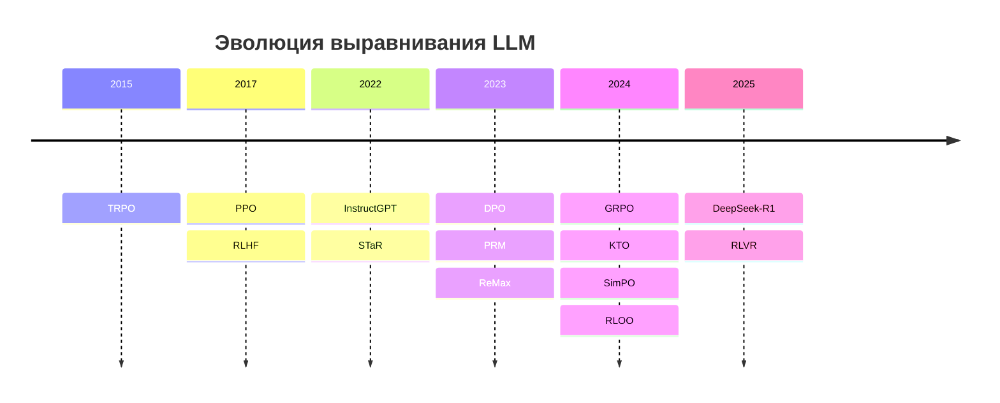
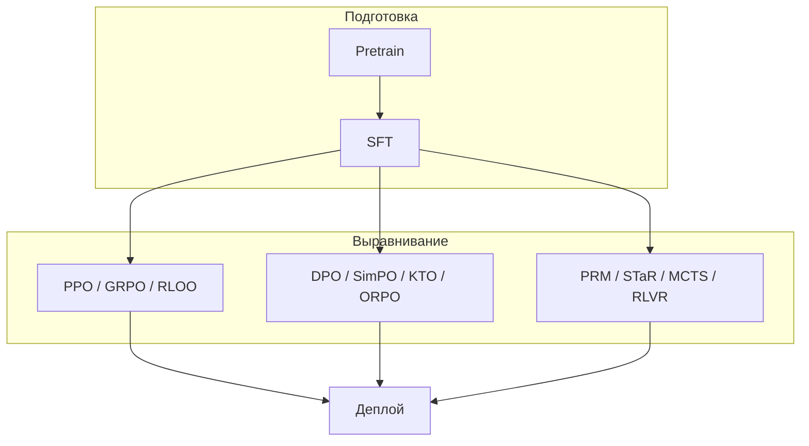

Выравнивание (alignment) больших языковых моделей — это этап постобучения, на котором модель учится следовать человеческим предпочтениям, быть полезной и безопасной. За последние восемь лет ландшафт прошёл путь от классического **RLHF с PPO** до **прямой оптимизации предпочтений (DPO и xPO-семейство)** и **онлайн-RL без критика (GRPO, RLOO)** для reasoning-моделей.

Ниже — структурированный справочник: **год появления**, **суть метода**, **ссылка на оригинальную статью**. Для детального сравнения PPO и GRPO см. отдельную публикацию: [GRPO vs PPO](/vairl/blog/2026/07/01/grpo-vs-ppo-llm-alignment-ru/).

Связанные материалы VAIRL: [жизненный цикл агента](/vairl/blog/2026/07/01/agent-lifecycle-pipeline-ru/), [форматы траекторий](/vairl/blog/2026/07/02/agent-trajectory-formats-ru/), [устойчивость control loops](/vairl/blog/2026/06/29/agent-control-loop-stability-ru/).

---

## Хронология (кратко)

| Год | Метод | Категория |
|-----|-------|-----------|
| 2015 | TRPO | RL |
| 2017 | PPO, RLHF (основа) | RL |
| 2022 | InstructGPT, STaR, Constitutional AI | Пайплайн / reasoning |
| 2023 | DPO, PRM, RAFT, ReMax, IPO | xPO / RL / reasoning |
| 2024 | GRPO, KTO, ORPO, RLOO, SimPO, SPIN, MCTS-*, ReST-MCTS* | xPO / RL / reasoning |
| 2025 | DeepSeek-R1 (RLVR + GRPO) | Reasoning RL |

---

## 0. Фундамент: откуда взялся RLHF

Прежде чем перечислять варианты оптимизации, полезно понимать **трёхэтапный пайплайн**, который задал индустриальный стандарт:

1. **SFT** — обучение на демонстрациях экспертов.
2. **Reward Model (RM)** — обучение оценщика на парах «лучше / хуже».
3. **RL-этап** — дообучение политики (обычно PPO) с KL-штрафом к референсной модели.

| Метод | Год | Суть | Статья |
|-------|-----|------|--------|
| **RLHF** (основа) | 2017 | Обучение с подкреплением по скалярной награде от человека; предшественник современного RLHF для LLM | [Deep RL from Human Preferences](https://arxiv.org/abs/1706.03741) |
| **InstructGPT / ChatGPT-пайплайн** | 2022 | SFT → RM → PPO; показал масштабируемость RLHF для диалоговых LLM | [Training LMs to Follow Instructions](https://arxiv.org/abs/2203.02155) |
| **Constitutional AI (RLAIF)** | 2022 | Выравнивание по принципам (constitution) с AI-оценкой вместо чисто человеческой RM | [Constitutional AI](https://arxiv.org/abs/2212.08073) |

---

## 1. Методы классического и онлайн-обучения с подкреплением

Эти алгоритмы работают в **динамическом режиме**: модель генерирует ответы, получает награду (от RM или верификатора) и обновляет веса на лету. Для reasoning-задач с **верифицируемой наградой** (правильный ответ в математике, прохождение unit-тестов) этот класс часто называют **RLVR** (Reinforcement Learning with Verifiable Rewards).

### PPO (Proximal Policy Optimization)

- **Год:** 2017 (для LLM — с 2022, InstructGPT)
- **Суть:** Классический RLHF-алгоритм actor-critic. Две сети: **актор** (LLM) и **критик** (value function). Механизм **clipping** ограничивает шаг обновления — стабильность при длинных контекстах и агентских задачах. Минус: критик удваивает потребление VRAM.
- **Статья:** [Proximal Policy Optimization Algorithms](https://arxiv.org/abs/1707.06347) (Schulman et al., 2017)

### GRPO (Group Relative Policy Optimization)

- **Год:** 2024
- **Суть:** Модификация PPO от команды DeepSeek. **Убирает критика**: на один промпт генерируется группа ответов, advantage считается **относительно среднего** внутри группы. Экономия ~50% VRAM; стал основным методом для олимпиадных и математических reasoning-моделей (DeepSeek-R1, Qwen-Math и др.).
- **Статья:** [DeepSeekMath: Pushing the Limits of Open Language Models in Mathematical Reasoning](https://arxiv.org/abs/2402.03300) (Shao et al., 2024)

### TRPO (Trust Region Policy Optimization)

- **Год:** 2015
- **Суть:** Исторический предшественник PPO. Строгое ограничение на шаг через **расстояние Кульбака–Лейблера** (trust region). Очень стабилен, но вычислительно тяжёл для масштабирования на современные LLM.
- **Статья:** [Trust Region Policy Optimization](https://arxiv.org/abs/1502.05477) (Schulman et al., 2015)

### ReMax

- **Год:** 2023 (ICML 2024)
- **Суть:** Облегчённая альтернатива PPO на базе **REINFORCE**. Критик заменён **жадным baseline**: из награды сэмпла вычитается награда greedy-декодирования. Проще PPO, ~46% экономии памяти на 7B; близок по духу к GRPO, но без группового батчинга.
- **Статья:** [ReMax: A Simple, Effective, and Efficient RL Method for Aligning LLMs](https://arxiv.org/abs/2310.10505) (Li et al., 2023)

### RLOO (Reinforcement Learning with Leave-One-Out)

- **Год:** 2024
- **Суть:** Онлайн-RL от Cohere/Google. Статистический **leave-one-out baseline**: награда каждого сэмпла сравнивается со средним по остальным ответам на тот же промпт. Логически близок к GRPO, но вписывается в PPO-подобную инфраструктуру (TRL `RLOOTrainer`); снижает дисперсию без отдельного критика.
- **Статья:** [Back to Basics: Revisiting REINFORCE Style Optimization for Learning from Human Feedback in LLMs](https://arxiv.org/abs/2402.14740) (Ahmadian et al., 2024)

### RAFT (Reward rAnked FineTuning)

- **Год:** 2023
- **Суть:** Не классический RL, а **фильтрация + SFT**: модель генерирует много ответов, RM ранжирует их, дообучение только на топе. Простой и стабильный baseline; по эффективности часто сопоставим с PPO/GRPO на reasoning-задачах.
- **Статья:** [RAFT: Reward rAnked FineTuning for Generative Foundation Model Alignment](https://arxiv.org/abs/2304.06767) (Dong et al., 2023)

---

## 2. Прямые методы оптимизации предпочтений (без традиционного RL)

Эти методы **отказываются от цикла генерация → RM → PPO**. Модель оптимизируется **офлайн** на готовых датасетах предпочтений через замкнутую функцию потерь — дешевле и проще в продакшене, но хуже подходит для сложных агентских задач «на лету».

### DPO (Direct Preference Optimization)

- **Год:** 2023
- **Суть:** Родоначальник прямого выравнивания. Вместо отдельной RM — **бинарная кросс-энтропия** на парах (chosen, rejected). Модель «тайно» является reward model. Быстро и дёшево; данные фиксированы (офлайн).
- **Статья:** [Direct Preference Optimization: Your Language Model Is Secretly a Reward Model](https://arxiv.org/abs/2305.18290) (Rafailov et al., 2023)

### SimPO (Simple Preference Optimization)

- **Год:** 2024 (NeurIPS 2024)
- **Суть:** Развитие DPO **без референсной модели**. Неявная награда — **средний log-prob** ответа (нормализованный по длине), плюс target margin в Bradley–Terry. Борется с «раздуванием» текста ради высокой оценки.
- **Статья:** [SimPO: Simple Preference Optimization with a Reference-Free Reward](https://arxiv.org/abs/2405.14734) (Meng et al., 2024)

### IPO (Identity Policy Optimization)

- **Год:** 2023
- **Суть:** Теоретическое исправление DPO: регуляризация предотвращает **переобучение** и уход политики слишком далеко от базовой. Плавное выравнивание без «зацикливания» на простых шаблонах.
- **Статья:** [A General Theoretical Framework for Direct Preference Optimization](https://arxiv.org/abs/2310.12036) (Azar et al., 2023) — IPO как частный случай

### KTO (Kahneman–Tversky Optimization)

- **Год:** 2024
- **Суть:** Выравнивание по **теории перспектив** Канемана–Тверски. Не нужны пары «лучше/хуже» — достаточно бинарной метки: ответ **желателен** или **нет**. Упрощает сбор данных из продакшен-логов (клики, рейтинги).
- **Статья:** [KTO: Model Alignment as Prospect Theoretic Optimization](https://arxiv.org/abs/2402.01306) (Ethayarajh et al., 2024)

### ORPO (Odds Ratio Preference Optimization)

- **Год:** 2024
- **Суть:** **SFT + alignment в одном шаге**. Штраф за плохие ответы через **odds ratio** прямо во время базового обучения; референсная модель не нужна. Сокращает пайплайн с двух этапов до одного.
- **Статья:** [ORPO: Monolithic Preference Optimization without Reference Model](https://arxiv.org/abs/2403.07691) (Hong et al., 2024)

### SPIN (Self-Play fIne-tuNing)

- **Год:** 2024 (ICML 2024)
- **Суть:** Итеративное **самообучение**: модель отличает свои генерации от человеческих демонстраций (DPO-подобный loss), без дополнительных preference-данных. Онлайн-вариант для улучшения после SFT.
- **Статья:** [Self-Play Fine-Tuning Converts Weak Language Models to Strong Language Models](https://arxiv.org/abs/2401.01335) (Chen et al., 2024)

---

## 3. Процессные и гибридные методы для рассуждающих моделей

Специализированные подходы для **длинных цепочек рассуждений** (chain-of-thought) перед финальным ответом — критичны для math, code и formal reasoning.

### PRM (Process-Supervised Reward Models)

- **Год:** 2023
- **Суть:** В отличие от **ORM** (оценка только финала), PRM оценивает **каждый шаг** рассуждения. Позволяет PPO/GRPO бороться с логическими галлюцинациями на промежуточных шагах. Датасет PRM800K — 800K step-level меток.
- **Статья:** [Let's Verify Step by Step](https://arxiv.org/abs/2305.20050) (Lightman et al., 2023, OpenAI)

### STaR (Self-Taught Reasoner)

- **Год:** 2022 (NeurIPS 2022)
- **Суть:** Цикл **самообучения**: модель генерирует CoT; при неверном ответе — rationalization (подсказка с правильным ответом); успешные цепочки идут в SFT-датасет. Итеративное улучшение без массивной ручной разметки.
- **Статья:** [STaR: Bootstrapping Reasoning With Reasoning](https://arxiv.org/abs/2203.14465) (Zelikman et al., 2022)

### MCTS + RL (семейство tree-search методов)

- **Год:** 2024–2025
- **Суть:** Интеграция **поиска по дереву Монте-Карло** (как в AlphaGo): модель строит дерево вариантов рассуждения, оценивает ветки на несколько шагов вперёд, делает **backtracking** при тупике. Execution feedback (запуск кода, проверка шага) служит reward signal.
- **Ключевые статьи:**
  - [MCTS-DPO: Monte Carlo Tree Search Boosts Reasoning via Iterative Preference Learning](https://arxiv.org/abs/2405.00451) (Xie et al., 2024)
  - [ReST-MCTS*: LLM Self-Training via Process Reward Guided Tree Search](https://arxiv.org/abs/2406.03816) (Zhang et al., 2024, NeurIPS 2024)
  - [CoGEX: Learning to Reason via Program Generation, Emulation, and Search](https://arxiv.org/abs/2405.16337) (Weir et al., 2024)
  - [SRA-MCTS: Self-driven Reasoning Augmentation with MCTS for Code Generation](https://arxiv.org/abs/2411.11053) (2024)

### DeepSeek-R1 / RLVR (верифицируемые награды)

- **Год:** 2025
- **Суть:** Многостадийный пайплайн: cold-start SFT → **GRPO с rule-based reward** (правильность ответа, формат) → rejection sampling → повторный RL. Показал, что длинные reasoning-цепочки можно **вынудить** чистым RL без массивной human CoT-разметки.
- **Статья:** [DeepSeek-R1: Incentivizing Reasoning Capability in LLMs via Reinforcement Learning](https://arxiv.org/abs/2501.12948) (Guo et al., 2025)

---

## Сводная таблица выбора

| Критерий | RL (PPO / GRPO / RLOO) | Прямой xPO (DPO / SimPO / KTO) | Reasoning (PRM / MCTS / RLVR) |
|----------|------------------------|--------------------------------|-------------------------------|
| **Данные** | Онлайн-генерация + reward | Офлайн-пары или бинарные метки | CoT-трассы, верификатор, step-labels |
| **Память** | Высокая (PPO) → средняя (GRPO/RLOO) | Низкая–средняя | Зависит от search budget |
| **Агентские задачи** | ✅ Хорошо | ⚠️ Ограниченно | ✅ Для math/code |
| **Стабильность** | Нужен тюнинг (clip, KL) | Обычно проще | Сложнее (search + reward design) |
| **Типичный use case** | Chat alignment, RLHF | Продуктовый fine-tune на логах | Олимпиадная математика, coding agents |

---

## Как читать этот справочник

1. **Начинаете с нуля** — смотрите раздел 0 (RLHF-пайплайн), затем DPO как самый простой вход в xPO.
2. **Ограничена VRAM** — GRPO, RLOO, ReMax, SimPO, ORPO (без референса).
3. **Math / code reasoning** — GRPO + RLVR, PRM, STaR, MCTS-семейство; см. [GRPO vs PPO](/vairl/blog/2026/07/01/grpo-vs-ppo-llm-alignment-ru/).
4. **Только логи «хорошо/плохо»** — KTO.
5. **Хотите один этап вместо SFT+alignment** — ORPO.

> **Замечание по ссылкам.** В ряде обзоров PPO ошибочно ссылают на arXiv:2402.03300 — это **DeepSeekMath (GRPO)**, а не оригинальный PPO. Корректная ссылка на PPO: [1707.06347](https://arxiv.org/abs/1707.06347).

---

## Сравнительная таблица методов

| Категория | Алгоритм | Главная суть / отличие | Плюсы | Минусы |
|-----------|----------|------------------------|-------|--------|
| **Динамический RL** | **PPO** | Actor-critic: критик оценивает ценность на каждом токене; clipping стабилизирует шаг | Зрелая экосистема (TRL, OpenRLHF); хорош для длинного контекста и агентов | Требует ~2× VRAM на критик; тяжёлый тюнинг гиперпараметров |
| | **GRPO** | PPO без критика: advantage = отклонение награды от среднего в группе ответов на один промпт ([DeepSeekMath](https://arxiv.org/abs/2402.03300)) | Экономия ~50% GPU; стандарт для math/code reasoning (DeepSeek-R1, Qwen-Math) | Нужно G ≥ 8 сэмплов на промпт; слабый сигнал, если все ответы в группе одинаковы |
| | **ReMax** | REINFORCE + baseline через **жадное** декодирование на том же промпте | Проще PPO (~46% меньше памяти); мало гиперпараметров | Один baseline на промпт — выше дисперсия, чем у GRPO/RLOO |
| | **RLOO** | REINFORCE + **leave-one-out** baseline по группе сэмплов | Стабильнее ReMax; вписывается в TRL без отдельного критика | Как у GRPO — нужна группа ответов; онлайн-генерация дороже офлайн-xPO |
| | **RAFT** | Фильтрация: много сэмплов → RM ранжирует → SFT только на топе | Простой baseline; часто сопоставим с PPO/GRPO на reasoning | Не обновляет политику «вживую»; качество зависит от RM |
| **Прямой alignment** | **DPO** | Офлайн-оптимизация на парах «лучший / худший» ответ без отдельной RM | Дёшево, стабильно, без RL-цикла | Фиксированный датасет; слаб для задач с онлайн-обратной связью |
| | **IPO** | Регуляризованный DPO: штраф за слишком сильный отрыв от референса | Меньше переобучения и «схлопывания» на шаблоны, чем у DPO | Всё ещё нужны пары; медленнее сходится при агрессивном β |
| | **SimPO** | DPO **без референсной модели**; награда = средний log-prob (норма по длине) | Максимальная экономия VRAM среди xPO; меньше «воды» в ответах | Нужны пары предпочтений; чувствителен к дисбалансу длины ответов |
| | **KTO** | Бинарные метки «хорошо / плохо» на **одиночных** ответах (теория перспектив) | Дешёвый сбор данных из логов (клики, рейтинги) | Чуть уступает DPO на тонкой настройке по парам |
| | **ORPO** | SFT + preference alignment **в одном** шаге через odds ratio | Сокращает пайплайн; не нужна замороженная референсная модель | Сложнее балансировать SFT vs alignment; меньше контроля, чем в двухэтапном пайплайне |
| | **SPIN** | Итеративное самообучение: модель отличает свои ответы от human SFT | Не нужны дополнительные preference-данные поверх SFT | Несколько итераций; риск дрейфа от human-распределения |
| **Reasoning / агенты** | **PRM** | Process reward: оценка **каждого шага** CoT, не только финала | Борется с логическими галлюцинациями в цепочке | Дорогая пошаговая разметка (PRM800K и аналоги) |
| | **STaR** | Bootstrapping: генерация CoT → фильтр по правильности → SFT; rationalization при ошибках | Автономный цикл улучшения без массивной ручной CoT-разметки | Риск накопления собственных ошибок; нужен oracle ответа |
| | **MCTS** | Поиск по дереву рассуждений с backtracking (MCTS-DPO, ReST-MCTS*, CoGEX) | Решает сложные задачи, недоступные жадной генерации | Медленный инференс; высокий compute budget на поиск |
| | **RLVR** | Награда от **верификатора** (правильный ответ, unit-тесты) + онлайн-RL (часто GRPO) | Эмерджентные длинные CoT без ручной разметки рассуждений ([DeepSeek-R1](https://arxiv.org/abs/2501.12948)) | Нужен надёжный верификатор; плохо переносится на «мягкие» задачи без oracle |

---

## Further reading

- [GRPO vs PPO: сравнительный анализ](/vairl/blog/2026/07/01/grpo-vs-ppo-llm-alignment-ru/) — формулы, VRAM, RLVR
- [A Comprehensive Survey of LLM Alignment Techniques](https://arxiv.org/abs/2407.16216) — обзор xPO-семейства (2024)
- [RLHF Book (Nathan Lambert)](https://rlhfbook.com/) — учебник по policy gradients, DPO, GRPO
- [Hugging Face TRL: RLOO](https://huggingface.co/blog/putting_rl_back_in_rlhf_with_rloo) — практика онлайн-RL
- [Форматы траекторий для SFT/RL](/vairl/blog/2026/07/02/agent-trajectory-formats-ru/) — как сериализовать эпизоды для дообучения
