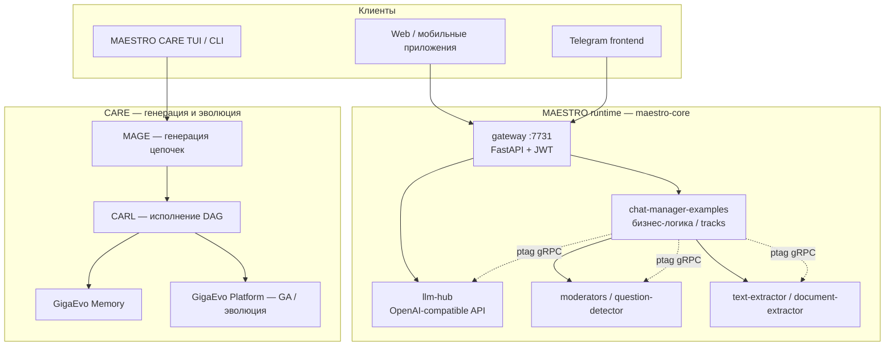

**MAESTRO** — открытый фреймворк [AIRI](https://airi.net/) (Artificial Intelligence Research Institute) от группы **«Мультимодальные архитектуры ИИ»** (MMAR). Полное имя: *Multi-Agent Ecosystem of Task Reasoning and Orchestration*. Платформа предназначена для построения **цифровых ассистентов и мультиагентных систем на LLM** с явным разделением ролей, микросервисной оркестрацией и формализованными цепочками рассуждений.

У экосистемы два уровня продуктов:

| Продукт | Назначение | Точка входа |
|---------|------------|-------------|
| **MAESTRO** (оркестратор) | Продакшен-платформа: gateway, LLM-hub, модерация, извлечение текста, бизнес-логика ботов | [maestro-core](https://github.com/AIRI-Institute/maestro-core), Docker Compose |
| **MAESTRO CARE** | TUI/CLI для **генерации, запуска и эволюции** цепочек агентов поверх того же стека | [`maestro-care` на PyPI](https://pypi.org/project/maestro-care/), [AIRI-MAESTRO/care](https://github.com/AIRI-MAESTRO/care) |

Ниже — архитектура, стек технологий, стандартные подходы команды и **карта репозиториев**. Связанные материалы VAIRL: [пайплайн агентов-ролей](/vairl/blog/2026/07/01/agent-lifecycle-pipeline-ru/), [гибридный DAG/FSM/BT](/vairl/blog/2026/06/26/hybrid-agent-dag-fsm-behavior-tree-ru/), [телеметрия агентов](/vairl/blog/2026/06/29/agent-telemetry-ru/), [ОГАС и Cybersyn](/vairl/blog/2026/07/01/cybernetic-planning-ogas-cybersyn-ru/).

> **Инструкции для агента-программиста** — подробный текстовый файл с паттернами проектирования, архитектурой, программным стеком и стеком протоколов MAESTRO/MMAR: [maestro-agent-instructions.txt](/vairl/assets/docs/maestro-agent-instructions.txt). Его можно передать coding-агенту целиком как системный контекст при разработке модулей экосистемы.

---

## Зачем отдельный оркестратор

Команда AIRI исходит из того, что **один «универсальный» агент** плохо масштабируется: смешиваются несовместимые задачи (извлечение фактов, диалог, модерация, вызов tools). MAESTRO предлагает:

1. **Декомпозицию** — один агент = одна бизнес-задача; сложный сценарий = граф агентов.
2. **Микросервисы** — каждая capability (LLM, OCR, классификатор вопросов) — отдельный сервис за gRPC.
3. **Единый внешний API** — FastAPI gateway с JWT для клиентов (веб, Telegram, мобильные приложения).
4. **Формализацию рассуждений** — библиотека **CARL** (Event → Action → Result) с DAG и параллельным исполнением.

Презентация на AI Journey 2025, обзор на [Хабре](https://habr.com/ru/companies/airi/articles/967612/) и [англоязычный пост на Medium](https://medium.com/airi-institute/maestro-a-framework-for-building-multi-agent-digital-assistants-ff10ff8de3d9). Официальная документация: [maestro-cover](https://airi-institute.github.io/maestro-cover/) ([EN](https://airi-institute.github.io/maestro-cover/index-en.html)).

---

## Два контура: runtime-платформа и CARE



**MAESTRO runtime** — это «операционная система» ассистента: приём сообщений, маршрутизация, хранение чатов, вызов LLM и вспомогательных моделей.

**MAESTRO CARE** (*Collaborative Agent Reasoning Ecosystem*) — надстройка для разработчика/исследователя: из задачи на естественном языке **сгенерировать** цепочку агентов (MAGE), **запустить** (CARL), **сохранить** в библиотеку (GigaEvo Memory) и **эволюционировать** (GigaEvo Platform). Запуск: `uv run maestro` (TUI) или headless-подкоманды `maestro generate`, `maestro run`, `maestro evolve`.

---

## Библиотеки MMAR

Ядро — набор Python-пакетов с префиксом `mmar-`, публикуемых на PyPI и vendored в [maestro-core](https://github.com/AIRI-Institute/maestro-core/tree/main) как `lib--mmar-*`:

| Пакет | PyPI | Роль |
|-------|------|------|
| `mmar-mapi` | [pypi](https://pypi.org/project/mmar-mapi/) | Контракты API: интерфейсы сервисов (`LLMHubAPI`, `TextExtractorAPI`, `BinaryClassifiersAPI`, `FileStorage`, …) |
| `mmar-ptag` | [pypi](https://pypi.org/project/mmar-ptag/) | **p**ydantically-**t**ype-**a**dapted-**g**RPC: типобезопасный RPC без ручного protobuf |
| `mmar-llm` | [pypi](https://pypi.org/project/mmar-llm/) | Доступ к LLM: GigaChat, OpenAI-compatible провайдеры, единая конфигурация |
| `mmar-carl` | [pypi](https://pypi.org/project/mmar-carl/) | Цепочки рассуждений: StepDescription, ReasoningChain, DAG, контекст |
| `mmar-flame` | [pypi](https://pypi.org/project/mmar-flame/) | Гибкая модерация (FLAME) |
| `mmar-mcli` | [pypi](https://pypi.org/project/mmar-mcli/) | CLI-клиент к gateway |
| `mmar-utils` | [pypi](https://pypi.org/project/mmar-utils/) | Общие утилиты, трейсинг |
| `mmar-mage` | [pypi](https://pypi.org/project/mmar-mage/) | Генератор цепочек агентов (слой CARE) |

### Паттерн ptag: как сервисы общаются

Внутри кластера MAESTRO **не REST между микросервисами**, а **gRPC через `mmar-ptag`**. Идея: описать сервис как обычный Python-класс с keyword-only методами; Pydantic сериализует аргументы и ответы в protobuf «на лету».

```python
from mmar_mapi.api import LLMHubAPI
from mmar_ptag import ptag_client

llm = ptag_client(LLMHubAPI, config.addresses.llm)
response = llm.complete(messages=[...], trace_id="request-abc")
```

Особенности, которые команда закладывает в стандарт:

- **`trace_id`** — сквозная трассировка через `mmar_mimpl.TRACE_ID_VAR`;
- **автореконнект** клиента (по умолчанию 5 попыток);
- **интерфейс в `mmar-mapi`**, реализация в сервисе — контракт отделён от деплоя.

Снаружи (для фронтендов и внешних интеграций) — **FastAPI** на gateway, **JWT** (`pyjwt`), опционально PostgreSQL для персистентности чатов (с v0.2.0 maestro-core).

---

## Микросервисы в `maestro-core`

[maestro-core](https://github.com/AIRI-Institute/maestro-core) — **минимальный демонстрационный subset** полной платформы. `compose.yaml` поднимает пять сервисов в сети `network-maestro-core`:

| Сервис | Порт | Назначение |
|--------|------|------------|
| `gateway` | 7731 | Единая точка входа, FastAPI, DI (dishka), async SQLAlchemy + PostgreSQL |
| `chat-manager-examples` | 17231 | Бизнес-логика ботов: **tracks** (сценарии диалога) |
| `llm-hub` | 40631 | Прокси к LLM; TOML-конфиг; OpenAI / Anthropic / GigaChat / DeepSeek / OpenRouter |
| `question-detector` | 31611 | Бинарный классификатор: вопрос vs не-вопрос |
| `text-extractor` | 9681 | Извлечение текста из документов |

Дополнительно в репозитории (не всегда в базовом compose):

- [`service--document-extractor`](https://github.com/AIRI-Institute/maestro-core/tree/main/service--document-extractor) — PDF/OCR, Tesseract, таблицы в Markdown;
- [`service--frontend-telegram`](https://github.com/AIRI-Institute/maestro-core/tree/main/service--frontend-telegram) — интеграция с Telegram Bot API;
- [`service--moderators`](https://github.com/AIRI-Institute/maestro-core/tree/main/service--moderators) — модерация на `mmar-flame`.

### Стек gateway (типичный для Python-сервисов MAESTRO)

Из `service--gateway/pyproject.toml`:

- **Python 3.13+**, FastAPI 0.115, Uvicorn, Pydantic 2.x, dishka (DI);
- **mmar-ptag**, **mmar-mapi**, **mmar-llm**, **mmar-mcli**;
- **SQLAlchemy 2 async** + **asyncpg** + **Alembic** (PostgreSQL);
- качество: **ruff**, **mypy** (strict), **pytest** + testcontainers.

Документация платформы указывает **Python 3.12+**, Docker, Docker Compose, PostgreSQL 12+ — для production-сборок ориентируйтесь на версии в `pyproject.toml` конкретного сервиса.

---

## CARL: цепочки рассуждений

**CARL** (*Collaborative Agent Reasoning Library*) — ключевая методология MMAR. Триада **Event → Action → Result** превращает экспертное мышление в структуру, понятную LLM:

| Примитив | Смысл |
|----------|--------|
| `StepDescription` | Один шаг: событие, действие, ожидаемый результат |
| `ReasoningChain` | Упорядоченная / параллельная цепочка шагов (DAG) |
| `ReasoningContext` | Накопленный контекст с RAG-подобным поиском релевантных фрагментов |

Параллельные ветки DAG исполняются независимо; контекст подмешивается в промпт следующих шагов. Это сознательный мост к [гибридным оркестраторам DAG/FSM](/vairl/blog/2026/06/26/hybrid-agent-dag-fsm-behavior-tree-ru/): CARL — **DAG-слой «мышления»**, chat-manager — **FSM-слой диалога** (tracks, slot-filling).

Репозитории:

- [AIRI-MAESTRO/carl](https://github.com/AIRI-MAESTRO/carl) — исходники экосистемы CARL;
- vendored: [lib--mmar-carl](https://github.com/AIRI-Institute/maestro-core/tree/main/lib--mmar-carl).

---

## MAESTRO CARE: четырёхслойный стек

По [ARCHITECTURE.md](https://github.com/AIRI-MAESTRO/care/blob/main/docs/ARCHITECTURE.md) CARE — **consumer** на вершине четырёх модулей:

| Слой | Модуль | PyPI / SDK | Функция |
|------|--------|------------|---------|
| **Generation** | MAGE | `mmar-mage` | NL-задача → CARL-цепочка |
| **Execution** | CARL | `mmar-carl` | Запуск цепочки, sandbox (Docker / e2b / firejail), ReAct-циклы |
| **Persistence** | GigaEvo Memory | `gigaevo-client` | Сущности chain / agent / agent_skill, библиотека, SSE |
| **Evolution** | GigaEvo Platform | — | Генетические алгоритмы, Pareto-front, accept-winner |

### Режимы чата

| Режим | Поведение |
|-------|-----------|
| **Ad-Hoc** | MAGE генерирует цепочку → CARL исполняет → ответ в чате. **Ничего не сохраняется.** |
| **Production** | Цепочка сохраняется в Memory (`chain_id`), baseline run → dataset, опционально evolution на Platform |

Конфигурация: `~/.config/care/config.toml`, `./care.toml`, env `CARE_*` (вложенность через `__`, например `CARE_MAGE__MODE=fast`). Телеметрия опционально в Langfuse (`CARE_TELEMETRY__*`).

### GigaEvo Platform (эволюция)

[github.com/AIRI-Institute/gigaevo-platform](https://github.com/AIRI-Institute/gigaevo-platform) — отдельная микросервисная система экспериментов:

- **Master API** (FastAPI, Kafka, PostgreSQL, Redis) — оркестрация;
- **Runner API** — исполнение с GigaEvolve;
- **WebUI** (Gradio) — мониторинг и визуализация;
- инфраструктура: Kafka (KRaft), MinIO, пул runner-контейнеров.

CARE подключается через [gigaevo-client](https://github.com/AIRI-MAESTRO/gigaevo-client) и фасады `CareMemory` / `CarePlatform`.

---

## Стандартные подходы команды

### 1. Один агент — одна задача

Декомпозиция сценария на специализированных агентов (извлечение метаданных, ответ на вопрос, модерация). Сборка — в **chat-manager** через **tracks** или в CARL через **ReasoningChain**.

### 2. Tracks и slot-filling

В `chat-manager-examples` сценарии оформляются как **tracks** — конечные автоматы диалога. Пример: [`filling_user_profile.py`](https://github.com/AIRI-Institute/maestro-core/tree/main/service--chat-manager-examples/src/chat_manager_examples/tracks) — пошаговое заполнение слотов через разговор.

### 3. Три способа собрать агента (учебный пример)

[Инструкция «Создание ассистента»](https://airi-institute.github.io/maestro-cover/instruction.html) сравнивает три трека для одной задачи (метаданные научной публикации):

1. **Нативный MAESTRO** — tracks + ptag-клиенты к сервисам;
2. **LangChain** — интеграция через те же gRPC-сервисы;
3. **ReAct** — цикл рассуждение-действие.

Схема и шаблон сервиса: [AIRI-MAESTRO/maestro-service-template](https://github.com/AIRI-MAESTRO/maestro-service-template) (генерация через **Copier**: `copier copy https://github.com/AIRI-MAESTRO/maestro-grpc-service-template.git`).

### 4. LLM-hub как единая точка к моделям

С v0.2.0 — **OpenAI-compatible** архитектура и `llm-config.toml`. Один конфиг — много провайдеров; мониторинг LLM вынесен в нативные интеграции Langfuse (сервис `llm-hub-monitoring` удалён).

### 5. Модерация как отдельный сервис

`mmar-flame` + `moderators` — политики безопасности не вшиты в gateway, а вызываются по gRPC.

### 6. Lazy imports в CARE

CARE не тянет MAGE/CARL/Platform на старте — опциональные зависимости подгружаются лениво, чтобы `maestro doctor` и узкие CLI-команды работали без полного стека.

---

## Требования к разработчику модулей

Если вы пишете **новый gRPC-сервис** для MAESTRO:

| Требование | Детали |
|------------|--------|
| **Язык** | Python 3.12–3.13 (сверяйтесь с шаблоном) |
| **Контракт** | Интерфейс в `mmar-mapi` или локальный ABC + регистрация в ptag |
| **Транспорт** | gRPC через `mmar-ptag` (`deploy_server`, `ptag_client`) |
| **Контейнер** | Dockerfile + запись в `compose.yaml` |
| **Конфиг** | `.env` через `ENV_FILE`, общий volume `./data:/mnt/data` |
| **Трейсинг** | Поддержка `trace_id` в сигнатурах методов |
| **Качество** | ruff, mypy, pytest — как в gateway |

Если вы пишете **агента / цепочку** для CARE:

| Требование | Детали |
|------------|--------|
| **Формат** | CARL chain JSON; валидация: `maestro validate chain.json` |
| **Tools** | `@carl_tool` + секция `CARE_TOOLS__*` |
| **Skills** | AgentSkill в sandbox (`CARE_SANDBOX__*`: Docker по умолчанию) |
| **Персистентность** | GigaEvo Memory API (`CARE_MEMORY__BASE_URL`) |
| **Эволюция** | GigaEvo Platform + `maestro evolve <chain_id>` |

Минимальный быстрый старт CARE:

```bash
uv sync
uv run maestro init
uv run maestro          # TUI
uv run maestro doctor   # проверка Memory / MAGE / Platform
```

---

## Карта репозиториев

### AIRI-Institute (платформа и документация)

| Репозиторий | Ссылка |
|-------------|--------|
| MAESTRO Core (демо) | [github.com/AIRI-Institute/maestro-core](https://github.com/AIRI-Institute/maestro-core) |
| Документация (сайт) | [github.com/AIRI-Institute/maestro-cover](https://github.com/AIRI-Institute/maestro-cover) → [airi-institute.github.io/maestro-cover](https://airi-institute.github.io/maestro-cover/) |
| GigaEvo Platform | [github.com/AIRI-Institute/gigaevo-platform](https://github.com/AIRI-Institute/gigaevo-platform) |
| Организация | [github.com/AIRI-Institute](https://github.com/AIRI-Institute) |

### AIRI-MAESTRO (CARE и экосистема агентов)

| Репозиторий | Ссылка |
|-------------|--------|
| **MAESTRO CARE** (TUI/CLI) | [github.com/AIRI-MAESTRO/care](https://github.com/AIRI-MAESTRO/care) |
| MAGE (генерация цепочек) | [github.com/AIRI-MAESTRO/mage](https://github.com/AIRI-MAESTRO/mage) |
| CARL | [github.com/AIRI-MAESTRO/carl](https://github.com/AIRI-MAESTRO/carl) |
| CARL Agent Server | [github.com/AIRI-MAESTRO/carl-agent-server](https://github.com/AIRI-MAESTRO/carl-agent-server) |
| GigaEvo Client SDK | [github.com/AIRI-MAESTRO/gigaevo-client](https://github.com/AIRI-MAESTRO/gigaevo-client) |
| Шаблон gRPC-сервиса | [github.com/AIRI-MAESTRO/maestro-service-template](https://github.com/AIRI-MAESTRO/maestro-service-template) |
| Документация CARE | [github.com/AIRI-MAESTRO/care-docs](https://github.com/AIRI-MAESTRO/care-docs) |
| Организация | [github.com/AIRI-MAESTRO](https://github.com/AIRI-MAESTRO) |

### PyPI (установка без клонирования)

- [maestro-care](https://pypi.org/project/maestro-care/) — CARE TUI/CLI
- [mmar-mapi](https://pypi.org/project/mmar-mapi/), [mmar-ptag](https://pypi.org/project/mmar-ptag/), [mmar-llm](https://pypi.org/project/mmar-llm/), [mmar-carl](https://pypi.org/project/mmar-carl/), [mmar-flame](https://pypi.org/project/mmar-flame/), [mmar-mcli](https://pypi.org/project/mmar-mcli/), [mmar-mage](https://pypi.org/project/mmar-mage/)

---

## Сводная таблица стека

| Слой | Технологии |
|------|------------|
| **Язык** | Python 3.12–3.13 |
| **Внешний API** | FastAPI, Starlette, Uvicorn, JWT |
| **Межсервисный RPC** | gRPC, protobuf, `mmar-ptag`, Pydantic 2 |
| **LLM** | OpenAI-compatible API, GigaChat, Anthropic, DeepSeek, OpenRouter |
| **Хранение** | PostgreSQL 12+ (чаты, auth), файловая система, GigaEvo Memory |
| **Очереди / эксперименты** | Kafka, Redis, MinIO (GigaEvo Platform) |
| **Контейнеры** | Docker, Docker Compose |
| **CARE UI** | Textual (TUI), Pydantic Settings, TOML-конфиг |
| **Эволюция** | GigaEvolve, GA, Gradio WebUI |
| **Наблюдаемость** | `trace_id` в ptag, Langfuse (опционально в CARE) |
| **DI / качество** | dishka, ruff, mypy, pytest, Alembic |

---

## Что взять на заметку

1. **Два GitHub-организации** — `AIRI-Institute` (runtime, GigaEvo, docs) и `AIRI-MAESTRO` (CARE, MAGE, CARL, шаблоны). PyPI-пакет `maestro-care` указывает на `AIRI-Institute/care`, но актуальный исходный код — в **AIRI-MAESTRO/care**.

2. **maestro-core — не весь MAESTRO**, а учебный/демо-срез. Полная enterprise-платформа шире; для понимания архитектуры его достаточно.

3. **Разделение «диалог» vs «рассуждение»** — tracks в chat-manager для UX, CARL для многошаговой экспертизы. CARE объединяет генерацию и исполнение цепочек в одном TUI.

4. **Модульность через контракт** — новый сервис = интерфейс в mapi + ptag-сервер + Docker. Это ближе к классическим микросервисам, чем к monolith LangChain-приложению.

5. **Эволюция агентов** — отдельный контур (GigaEvo), не встроенный в runtime чат-бота. Связь с [эволюцией агентов и Behavior Tree](/vairl/blog/2026/06/22/agent-evolution-behavior-tree-ru/) и [бенчмарками](/vairl/blog/2026/06/29/agent-benchmark-generation-ru/).

---

## Источники

- [Инструкции для агента-программиста (TXT)](/vairl/assets/docs/maestro-agent-instructions.txt) — паттерны, архитектура, стек, протоколы, чеклисты
- [Документация MAESTRO (RU)](https://airi-institute.github.io/maestro-cover/)
- [MAESTRO на Хабре](https://habr.com/ru/companies/airi/articles/967612/)
- [Medium: MAESTRO framework](https://medium.com/airi-institute/maestro-a-framework-for-building-multi-agent-digital-assistants-ff10ff8de3d9)
- [Пример: создание ассистента](https://airi-institute.github.io/maestro-cover/instruction.html)
- [CARE Architecture](https://github.com/AIRI-MAESTRO/care/blob/main/docs/ARCHITECTURE.md)
- [maestro-core NEWS.md](https://github.com/AIRI-Institute/maestro-core/blob/main/NEWS.md) — changelog 0.1.x–0.2.0

Контакты AIRI: [partner@airi.net](mailto:partner@airi.net), [Telegram @airi_research_institute](https://t.me/airi_research_institute).
