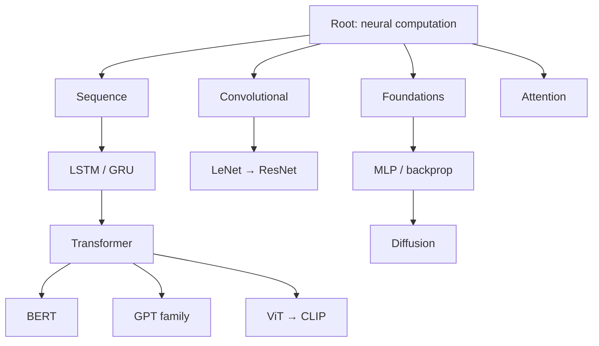

Линейный рассказ «от Perceptron к GPT-4» удобен для слайдов, но **плохо отражает реальность**: идеи **ветвятся**, **сходятся** и **переиспользуются**. ResNet влияет на ViT, LSTM — на Transformer, diffusion — на Stable Diffusion. Это ближе к **филогенетическому дереву**, чем к одной временной оси.

В статье — концептуальная рамка, **интерактив на p5.js** (полукруглая филогения + дуги заимствований) и **три статических визуализации на Python** (matplotlib + networkx + sklearn):

1. **Fan tree / semicircle phylogeny** — полукруглое филогенетическое дерево семейств  
2. **Граф заимствований** — кто у кого взял архитектурную идею  
3. **Кластеризация** в пространстве признаков + **упорядочивание кластеров по времени**

[](https://colab.research.google.com/github/evgeniy-borisov/vairl/blob/main/notebooks/nn-model-evolution-tree.ipynb)

Связанные материалы: [NAS и поиск архитектур](/vairl/blog/2026/01/15/neural-architecture-search-ru/), [фундамент агентных систем](/vairl/blog/2026/07/02/agent-fundamentals-rag-mcp-landscape-ru/), [PaCMAP и пространство гипотез](/vairl/blog/2026/06/24/hypothesis-space-pacmap-ru/).

---

## Почему не одна линия

| Линейный нарратив | Древовидная модель |
|-------------------|-------------------|
| Одна «главная» ветка прогресса | Параллельные семейства (CNN, RNN, Transformer, Diffusion) |
| Каждая модель «заменяет» предыдущую | Модели **сосуществуют** (LSTM в проде, CNN на edge) |
| Время = единственная ось | Время + **родство идей** + **перенос компонентов** |



**Метафора:** эволюция биологических видов — не одна цепочка от амёбы к человеку, а **дерево** с отмиранием и параллельными ветками. То же с архитектурами.

### Как это называется в биологии и визуализации

| Термин | Смысл |
|--------|--------|
| **Phylogenetic tree** (филогенетическое дерево) | Древовидная схема родства; корень — общий предок |
| **Fan tree** (веерное дерево) | Ветви расходятся по дуге, часто на **полукруге** |
| **Circular / radial phylogeny** | То же в полярных координатах (icytree, FigTree) |
| **Cladogram** | Дерево без длины ветвей ∝ время; только топология |
| **Horizontal gene transfer** | Аналог **перекрёстных заимствований** между ветками (attention, residual, diffusion…) |

Ниже — интерактив в стиле **fan tree на полудуге**: корень «Neural architectures» внизу, семейства — промежуточные узлы, листья — конкретные модели. Режим **«Заимствования»** рисует горизонтальные (межветочные) дуги, как перенос генов между несродственными линиями.

### Интерактив: fan tree и заимствования (p5.js)

Переключите режим и (в режиме заимствований) фильтр по **механизму** — подсветятся узлы и дуги. **Клик по узлу** делит область пополам: слева дерево, справа — сводка и лаконичные **PyTorch-примеры** того, что было изобретено в этой архитектуре.

<div class="nn-phylogeny-widget phase-portrait-widget" id="nn-phylogeny-demo">
  <div class="nn-toolbar">
    <div class="phase-portrait-controls">
      <button type="button" data-nn-mode="tree" class="active">Fan tree</button>
      <button type="button" data-nn-mode="borrow">Заимствования</button>
      <button type="button" data-nn-mode="traits">Признаки</button>
    </div>
    <div class="nn-toolbar-actions">
      <span class="nn-theme-label">Тема</span>
      <button type="button" data-nn-theme="light" class="active" title="GitHub Light">Светлая</button>
      <button type="button" data-nn-theme="dark" title="GitHub Dark">Тёмная</button>
      <button type="button" data-nn-fullscreen title="Полный экран" aria-label="Полный экран">⛶</button>
      <span class="nn-hljs-theme-label"></span>
    </div>
  </div>
  <div class="nn-trait-bar" data-nn-trait-wrap hidden>
    <span style="font-size:11px;color:#666;align-self:center">Размер / яркость:</span>
    <button type="button" data-nn-trait="train" class="active">Данные / compute</button>
    <button type="button" data-nn-trait="acc">Точность</button>
    <button type="button" data-nn-trait="year">Год</button>
  </div>
  <div class="nn-mech-bar" data-nn-mech-wrap id="nn-phylogeny-mechs"></div>
  <div class="nn-split-wrap" id="nn-phylogeny-split">
    <div class="nn-tree-pane">
      <div id="nn-phylogeny-canvas" class="nn-canvas phase-portrait-canvas"></div>
    </div>
    <aside class="nn-code-pane" id="nn-phylogeny-panel" hidden>
      <header class="nn-panel-head">
        <h4 class="nn-panel-title">Архитектура</h4>
        <button type="button" class="nn-panel-close" data-nn-close aria-label="Закрыть">×</button>
      </header>
      <div class="nn-panel-body"></div>
    </aside>
  </div>
  <p class="nn-hint" id="nn-phylogeny-hint">Клик по узлу — split-панель с PyTorch-примерами ключевых идей.</p>
  <p class="nn-detail" id="nn-phylogeny-detail">Кликните по узлу модели — справа появятся PyTorch-примеры ключевых идей.</p>
  <p class="phase-portrait-caption">Скетч на <a href="https://p5js.org/" target="_blank" rel="noopener">p5.js</a>; подсветка — <a href="https://highlightjs.org/" target="_blank" rel="noopener">highlight.js</a> (GitHub Light / GitHub Dark). Кнопка ⛶ — полноэкранный режим.</p>
</div>

<script src="{{ '/assets/js/nn-phylogeny-snippets.js' | relative_url }}"></script>
<script src="{{ '/assets/js/nn-phylogeny-demo.js' | relative_url }}"></script>

| Режим | Что показывает |
|-------|----------------|
| **Fan tree** | Таксономия семейств; клик — PyTorch-код |
| **Заимствования** | Межветочные дуги + код уникальных добавлений |
| **Признаки** | Размер ∝ compute; яркость ∝ точность |

---

## Данные для визуализаций

Мы собрали компактный **кураторский датасет** (~27 моделей): имя, год ключевой публикации, семейство (`Foundations`, `Convolutional`, `Sequence`, `Attention`, …). Это учебный срез, не exhaustive leaderboard.

Пример записи:

```python
@dataclass(frozen=True)
class Model:
    name: str
    year: int
    family: str

Model("ResNet", 2015, "Convolutional")
Model("Transformer", 2017, "Attention")
```

Полный список и код — в [ноутбуке](https://colab.research.google.com/github/evgeniy-borisov/vairl/blob/main/notebooks/nn-model-evolution-tree.ipynb) и файле `notebooks/nn_model_evolution_viz.py`.

---

## 1. Полукруглое дерево (fan tree / semicircle phylogeny)

**Идея:** корень внизу дуги; семейства — промежуточные узлы; листья — конкретные модели с годом. Углы распределяются по полуокружности (polar plot, θ ∈ [0°, 180°]). В биологии такой layout часто называют **fan tree** или **circular phylogeny** на полудуге; интерактив выше построен по тому же принципу.


**Алгоритм layout:**

1. Листья равномерно по дуге: `θ_i = π · (0.08 + 0.84 · i/N)`
2. Угол семейства = среднее углов листьев
3. Радиус: корень → 0, семейство → 0.35, лист → 0.82
4. Рёбра рисуем в `matplotlib` polar axes

Фрагмент кода:

```python
fig, ax = plt.subplots(subplot_kw={"projection": "polar"})
ax.set_thetamin(0)
ax.set_thetamax(180)
for family, names in TREE.items():
    fa = np.mean([leaf_angles[n] for n in names])
    ax.plot([root_angle, fa], [0.0, 0.35], lw=2)
    for name in names:
        la = leaf_angles[name]
        ax.plot([fa, la], [0.35, 0.72], lw=1.2)
        ax.scatter([la], [0.82], s=45)
```

Это **circular tree** в классическом phylogenetic стиле (как в icytree / FigTree), только на **полудуге** — удобнее для широких экранов и статей.

---

## 2. Граф архитектурных заимствований

Второй взгляд — **направленный граф**: ребро `A → B` означает «B явно опирается на идею из A» (skip connections, attention, latent diffusion, MoE routing…).


Примеры рёбер:

| От | К | Идея |
|----|---|------|
| Seq2Seq + attention | Transformer | убрать рекуррентность |
| Transformer | BERT | bidirectional MLM |
| Transformer | GPT-1 | decoder-only LM |
| ResNet | ViT | residual + масштаб |
| Diffusion (DDPM) | Stable Diffusion | latent space |

Layout: **ось X ≈ год**, узлы одного года слегка разведены по Y. Цвет — семейство. Так видно и **время**, и **перекрёстные заимствования** (Transformer как хаб).

```python
G = nx.DiGraph()
for src, dst, label in INFLUENCE:
    G.add_edge(src, dst, label=label)
```

---

## 3. Кластеризация + упорядочивание кластеров по времени

Третий срез: каждая модель — вектор признаков (год, флаги CNN/seq/attention/generative/diffusion/MoE/ViT, позиция в ветке). Затем:

1. **StandardScaler** + **PCA** → 2D проекция  
2. **Agglomerative clustering** (Ward) → метки кластеров  
3. Для каждого кластера: **μ(year)**  
4. Сортировка кластеров по μ(year) → ось «время кластеров»


**Левая панель:** геометрия похожести архитектур (кто близок в feature space).  
**Правая панель:** те же кластеры, но **упорядочены слева направо по среднему году** — мост между **несупервизным clustering** и **хронологией**.

```python
cl = AgglomerativeClustering(n_clusters=5, linkage="ward")
labels = cl.fit_predict(X_scaled)
cluster_years = {c: np.mean([MODELS[i].year for i, lb in enumerate(labels) if lb == c])
                  for c in range(5)}
order = sorted(range(5), key=lambda c: cluster_years[c])
```

Это полезно, когда нужно показать: «кластеры не случайны — они **выстраиваются во времени**», хотя алгоритм кластеризации **не видел год напрямую** (год был лишь одним из признаков после scaling).

---

## Три картинки — три вопроса

| Визуализация | Вопрос, на который отвечает |
|--------------|----------------------------|
| Semicircle tree | **Какие семейства** и как ветвятся от общего корня? |
| Influence graph | **Кто у кого заимствует** идеи (не только «позже по дате»)? |
| Time-ordered clusters | **Какие группы** похожи по архитектуре и **как они ложатся на время**? |

---

## Запуск кода

**Colab** (рекомендуется):

**[nn-model-evolution-tree.ipynb](https://colab.research.google.com/github/evgeniy-borisov/vairl/blob/main/notebooks/nn-model-evolution-tree.ipynb)**

Локально:

```bash
pip install matplotlib networkx scikit-learn numpy
python notebooks/nn_model_evolution_viz.py
```

PNG сохраняются в `assets/images/`.

---

## Ограничения модели

- Датасет **кураторский**, не полный (нет всех LLM, региональных моделей, hardware-specific NAS).
- Рёбра влияния — **экспертные**, не из citation graph.
- Признаки для кластеризации **грубые** (бинарные флаги семейств); для research-grade картины нужны embeddings статей / git repo features.
- Полукруглое дерево **не единственно возможное** layout; fan tree, sunburst, force-directed phylogeny — альтернативы.

---

## Резюме

Развитие ИИ-моделей — **эволюционное дерево с перекрёстным опылением**, а не одна линия. **p5.js** даёт интерактивную fan tree и фильтр по заимствованным механизмам; **Python** — три дополняющих статических вида: **phylogeny**, **borrow graph**, **time-ordered clusters**.

---

## Источники

- [Colab notebook](https://colab.research.google.com/github/evgeniy-borisov/vairl/blob/main/notebooks/nn-model-evolution-tree.ipynb)
- [nn_model_evolution_viz.py](https://github.com/evgeniy-borisov/vairl/blob/main/notebooks/nn_model_evolution_viz.py) в репозитории VAIRL
- Phylogenetic tree layout: icytree / FigTree (концептуальная аналогия)
