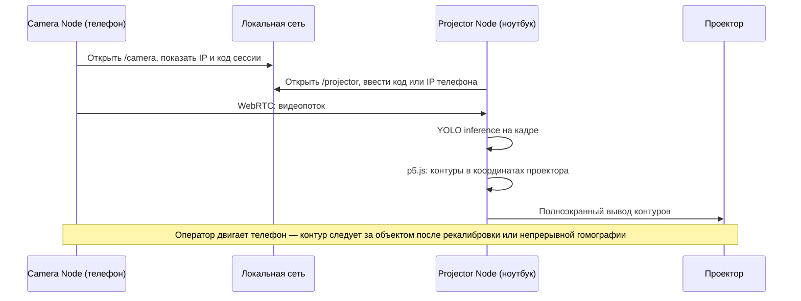
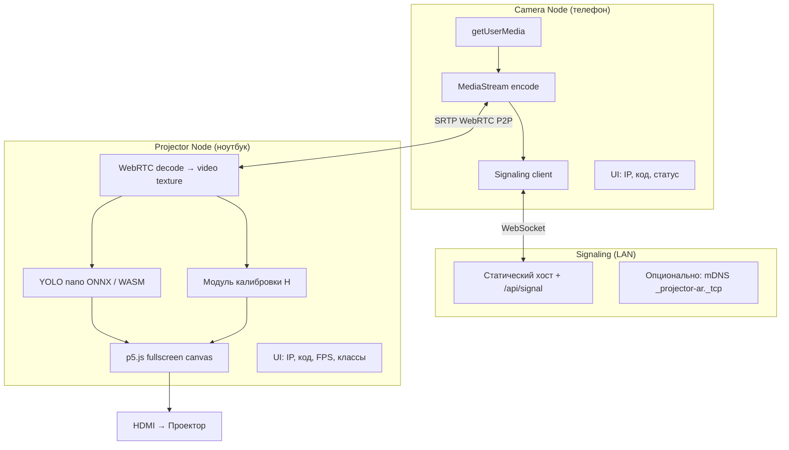
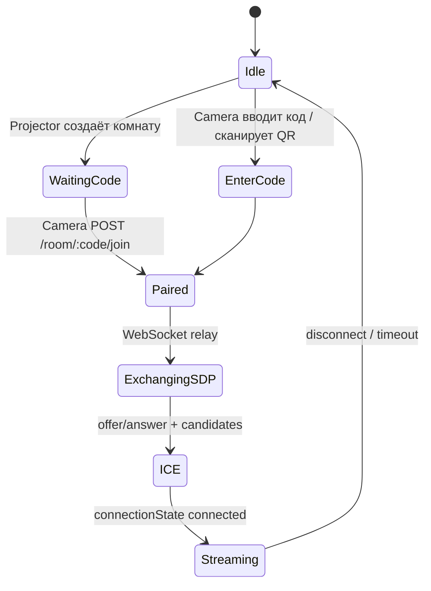

**Projector AR Loop** — экспериментальный проект замкнутого контура: телефон смотрит на объект в комнате, ноутбук (экран которого выведен на проектор) получает видеопоток, запускает лёгкую **YOLO**-модель в браузере, рисует контуры детекций через **p5.js** и проецирует их так, чтобы обводка легла на тот же объект в физическом пространстве.

Это **техническое задание**, а не реализация. Цель документа — зафиксировать архитектуру, протоколы связи, требования к калибровке и критерии приёмки до начала кодирования. Связанный материал по edge-инференсу в браузере: [PyTorch → ONNX → p5.js](/vairl/blog/2026/07/01/pytorch-edge-browser-onnx-ru/).

---

## 1. Постановка задачи

### 1.1. Идея

Два устройства в одной локальной сети, оба открывают веб-приложение в браузере:

| Роль | Устройство | Функция |
|------|------------|---------|
| **Camera Node** | Смартфон | Захват `getUserMedia`, превью, передача видео на второе устройство |
| **Projector Node** | Ноутбук + проектор | Приём видео, детекция объектов, отрисовка контуров на полноэкранном холсте p5.js |

Пользователь наводит камеру телефона на предмет (стул, коробка, человек). На стене/полу проектор рисует bounding box или полигон вокруг того же предмета — визуальная «петля обратной связи» между камерой и проекцией.

### 1.2. Ограничения эксперимента (осознанные)

- Работа **только в LAN** (Wi‑Fi), без облачного inference.
- Без нативных приложений: **только браузер** (Safari/Chrome).
- Модель — **лёгкая** (nano/small), квантованная, через **ONNX Runtime Web** или аналог.
- Точность совмещения контура с объектом зависит от **калибровки** камера↔проектор; в MVP допустима ручная подстройка.
- Задержка end-to-end целевая: **&lt; 300 ms** на десктопе среднего класса (не гарантия на первом спринте).

### 1.3. Не-цели (вне scope v0.1)

- Мультипользовательские сессии (&gt; 2 устройств).
- SLAM / постоянный трекинг при движении камеры без перекалибровки.
- Облачный signaling за пределами LAN.
- Промышленная точность AR (уровень HoloLens / ARKit).

---

## 2. Сценарий использования



**Шаги оператора:**

1. Подключить ноутбук к проектору, развернуть на весь экран вкладку `/projector`.
2. На телефоне открыть `/camera`, разрешить доступ к камере.
3. Соединить устройства (QR, код сессии или IP вручную).
4. Пройти **мастер калибровки** (4+ опорные точки или маркеры ArUco в кадре).
5. Навести камеру на объект — увидеть контур на проекции.

---

## 3. Архитектура системы

### 3.1. Компоненты



### 3.2. Репозиторий (планируемая структура)

```
projector-ar-loop/
├── index.html              # выбор роли
├── camera/                 # Camera Node (p5.js + simple-peer / RTCPeerConnection)
├── projector/              # Projector Node (p5.js + ONNX + overlay)
├── shared/
│   ├── signaling.js        # WebSocket, код сессии, heartbeat
│   ├── protocol.js         # JSON-схемы сообщений
│   └── homography.js       # пересчёт bbox камера → проектор
├── models/
│   └── yolov8n.onnx        # ~6 MB, COCO 80 классов
├── server/
│   └── signal-server.mjs   # минимальный Node или статика + peerjs-server
└── docs/
    └── calibration.md
```

Хостинг: **GitHub Pages** для статики + отдельный **локальный signaling-сервер** на ноутбуке (`node signal-server.mjs`, порт 8765) или встроенный в dev-сервер Vite.

### 3.3. Стек технологий

| Слой | Технология | Обоснование |
|------|------------|-------------|
| Графика, UI | **p5.js** | Уже используется в VAIRL-демо с камерой; быстрый fullscreen canvas |
| Видео P2P | **WebRTC** (`RTCPeerConnection`) | Низкая задержка в LAN, без перекодирования на сервере |
| Сигналинг | **WebSocket** + REST | Обмен SDP/ICE в одной подсети |
| Детекция | **YOLOv8n** → ONNX → **ONNX Runtime Web** (WASM/WebGL) | Баланс скорость/качество; аналог пайплайна из [статьи про edge](/vairl/blog/2026/07/01/pytorch-edge-browser-onnx-ru/) |
| Калибровка | **Гомография** 3×3 (`opencv.js` или легкая JS-библиотека) | Перенос координат bbox из плоскости изображения камеры в плоскость проектора |
| Сборка | Vite или esbuild | Без тяжёлого фреймворка |

Альтернатива YOLO: **TensorFlow.js** + `coco-ssd` (проще, но медленнее и грубее). В ТЗ основной путь — **YOLOv8n ONNX**.

---

## 4. Механизм установления соединения

Критическое требование: оператор **видит на обоих экранах**, как устройства найдут друг друга, без чтения логов.

### 4.1. Отображаемая информация (обязательно на обоих узлах)

- **Локальный IP** (например `192.168.1.42`) — через WebRTC/local endpoint или запрос к `https://api.ipify.org` *не использовать*; только LAN.
- **Порт signaling-сервера** (если не 443).
- **Код сессии** — 6 символов, A–Z2–9 без O/0/I/1 (читаемость).
- **Роль узла**: `CAMERA` / `PROJECTOR`.
- **Статус**: `DISCONNECTED` | `SIGNALING` | `ICE_CONNECTING` | `STREAMING` | `ERROR`.
- **QR-код** на Camera Node: URL вида `https://<projector-ip>:8765/join?code=ABC123`.

Получение LAN IP в браузере — известная проблема. Стратегии (в порядке приоритета):

1. **Signaling-сервер** при WebSocket-handshake сообщает клиенту его IP (`req.socket.remoteAddress`).
2. **WebRTC ICE** — после `icegatheringstatechange` парсить `candidate` с типом `host`.
3. **Ручной ввод** IP второго устройства — всегда доступен как fallback.

### 4.2. Протокол сопряжения



**Сообщения WebSocket (JSON):**

```json
{ "type": "join", "role": "camera", "code": "K7M2P4" }
{ "type": "offer", "sdp": "..." }
{ "type": "answer", "sdp": "..." }
{ "type": "ice", "candidate": { "candidate": "...", "sdpMid": "0" } }
{ "type": "ping", "ts": 1719900000000 }
```

Таймаут неактивности: **60 с** без `ping` → разрыв сессии.

### 4.3. Поиск в локальной сети

| Метод | Реализация | MVP |
|-------|------------|-----|
| Код сессии + IP проектора на экране | Signaling на ноутбуке | ✅ Обязательно |
| QR с URL | `qrcode.js` на Projector Node | ✅ Обязательно |
| mDNS `_parloop._tcp.local` | Bonjour в локальной сети; в браузере ограничено | ⚪ v0.2 |
| UDP broadcast discovery | Только через signaling-сервер Node | ⚪ v0.2 |
| Ручной ввод `192.168.x.x` | Поле ввода | ✅ Fallback |

### 4.4. Требования к сети

- Оба устройства в одной подсети Wi‑Fi.
- Для WebRTC в LAN желательны **прямые host-кандидаты**; TURN не обязателен в MVP.
- HTTPS или `localhost` для `getUserMedia` на телефоне: на проде — self-signed cert на signaling-хосте или туннель ngrok **только для dev** (в статье-реализации описать обход для iOS Safari).

---

## 5. Видеопоток (Camera Node)

### 5.1. Захват

- `navigator.mediaDevices.getUserMedia({ video: { facingMode: 'environment', width: { ideal: 1280 }, height: { ideal: 720 } }, audio: false })`.
- Превью на телефоне: миниатюра 25% экрана, не блокирует UI статуса.
- Передача: один видеотрек в `RTCPeerConnection.addTrack()`.

### 5.2. Параметры потока

| Параметр | Значение по умолчанию | Настройка |
|----------|----------------------|-----------|
| Разрешение | 1280×720 | 640×480 / 1920×1080 |
| FPS | 15–30 | Ползунок (экономия батареи) |
| Кодек | VP8/VP9 (браузер выбирает) | — |

### 5.3. UI Camera Node (p5.js или DOM поверх)

- Блок «Ваш IP: …».
- Поле «Код проектора» + кнопка «Подключиться».
- Индикатор битрейта / RTT (если доступно через `getStats()`).
- Кнопка «Сменить камеру» (`deviceId`).
- Кнопка «Пауза потока».

---

## 6. Детекция и проекция (Projector Node)

### 6.1. Pipeline кадра

1. Видеокадр с `HTMLVideoElement` → текстура / `image()`.
2. Препроцессинг под вход YOLO: resize **640×640**, letterbox, нормализация `/255`.
3. Inference ONNX Runtime Web (`executionProviders: ['webgl', 'wasm']`).
4. Постпроцессинг: NMS, фильтр по `confidence ≥ 0.5` (настраиваемо).
5. Для каждого bbox: преобразование углов через матрицу гомографии **H**.
6. p5.js: `noFill()`, `strokeWeight(4)`, отрисовка `rect()` или полигона; опционально подпись класса.

### 6.2. Модель

| Параметр | Значение |
|----------|----------|
| Модель | YOLOv8n (или YOLO11n) |
| Формат | ONNX opset 17+ |
| Классы | COCO 80 (настраиваемый whitelist в UI) |
| Размер файла | ≤ 10 MB |
| Целевой FPS inference | ≥ 10 на ноутбуке 2020+ |

Переключатель в UI: «Только person», «Только cup/book», «Все классы».

### 6.3. Визуальный режим проектора

- **Режим A (MVP):** чёрный фон, только контуры (минимизация засветки сцены).
- **Режим B:** полупрозрачная заливка bbox (`alpha 40`).
- **Режим C (отладка):** картинка с камеры слева 30% экрана, контуры справа на проекции — только для настройки, не для публичного демо.

Полноэкранный режим: `p5.js` `createCanvas(windowWidth, windowHeight)` + F11 / Fullscreen API.

### 6.4. Синхронизация с физическим объектом

Ключевая инженерная задача: bbox живёт в координатах **кадра камеры** (1280×720), а рисовать нужно в координатах **экрана проектора** (1920×1080), где оптическая ось проектора и камеры телефона **не совпадают**.

**Подход MVP — плоская гомография:**

- Считаем, что объект и экран проекции лежат в одной плоскости (стена, стол).
- Матрица **H** переводит точки изображения камеры в пиксели проектора: `p_proj ∼ H · p_cam`.

**Калибровка (мастер из 4+ точек):**

1. Проектор показывает 4 круга в углах рабочей области.
2. Оператор наводит камеру телефона так, чтобы все 4 круга были видны в кадре.
3. На Camera Node тапами отмечаются центры кругов **в порядке, заданном Projector Node**.
4. Projector Node знает свои координаты кругов → вычисляет **H** (DLT или `opencv.findHomography`).
5. **H** передаётся на Projector Node (или вычисляется там по координатам, присланным по data channel).

**Data channel WebRTC:** JSON `{ "type": "calib_point", "index": 0, "x": 0.42, "y": 0.31 }` (нормализованные координаты).

**Улучшение v0.2:** печатные **ArUco-маркеры** в углах сцены; детекция маркеров на Projector Node по тому же кадру — автоматическое обновление **H** при смещении телефона.

### 6.5. UI Projector Node

- IP, код сессии, QR для подключения телефона.
- Список подключённых Camera Node (в v0.1 — один).
- FPS: capture / inference / render.
- Чекбоксы классов COCO.
- Порог confidence.
- Кнопки: «Калибровка», «Сброс H», «Чёрный экран».
- Лог последних ошибок (свёрнутый).

---

## 7. Нефункциональные требования

| ID | Требование | Метрика |
|----|------------|---------|
| NF-01 | Запуск без установки ПО на телефон | Только браузер |
| NF-02 | Время сопряжения | ≤ 30 с при известном IP |
| NF-03 | Задержка camera→contour | ≤ 300 ms (p50) на целевом ноутбуке |
| NF-04 | Работа offline после загрузки | Модель и статика кэшируются Service Worker |
| NF-05 | Приватность | Видео не покидает LAN |
| NF-06 | Отказоустойчивость | Потеря WebRTC → автопереподключение 3 попытки |

---

## 8. Безопасность

- Signaling только в LAN; код сессии одноразовый, TTL **10 минут**.
- Нет учётных записей в MVP.
- CORS: разрешить только origin статики и `http://192.168.*`.
- Предупреждение в UI: «Не транслируйте в публичные сети без VPN».

---

## 9. Этапы разработки

### Спринт 0 — Инфраструктура (1 неделя)

- [ ] Vite + p5.js, две страницы `/camera`, `/projector`.
- [ ] Signaling-сервер, код сессии, отображение IP.
- [ ] WebRTC: стабильный видеопоток телефон → ноутбук.

**Критерий приёмки:** видео с телефона на весь экран ноутбука, IP и код видны на обоих устройствах.

### Спринт 1 — Детекция (1 неделя)

- [ ] Интеграция YOLOv8n ONNX Runtime Web.
- [ ] Bbox поверх видео в координатах **кадра** (без проекции).

**Критерий:** ≥ 10 FPS, корректные bbox на ноутбуке.

### Спринт 2 — Калибровка и проектор (1–2 недели)

- [ ] Мастер гомографии 4 точки.
- [ ] Fullscreen контуры на проекторе, чёрный фон.
- [ ] Data channel для точек калибровки.

**Критерий:** контур стула/коробки визуально совпадает с объектом с точностью **±5%** ширины bbox при неподвижной камере.

### Спринт 3 — Полировка (1 неделя)

- [ ] QR, настройки классов, FPS overlay.
- [ ] Документация, запись demo-видео для статьи.
- [ ] Service Worker для кэша модели.

---

## 10. Риски и митигации

| Риск | Вероятность | Митигация |
|------|-------------|-----------|
| iOS Safari блокирует WebRTC без HTTPS | Высокая | Локальный HTTPS с mkcert; инструкция в README |
| Inference &lt; 5 FPS | Средняя | Меньшее разрешение, yolov8n, пропуск кадров (detect every 2nd frame) |
| Гомография «плывёт» при движении телефона | Высокая | ArUco v0.2; UI-подсказка «зафиксируйте камеру» |
| Проектор засвечивает сцену | Средняя | Режим «только контур», короткий throw проектора |
| Разные aspect ratio камеры и проектора | Средняя | Нормализованные координаты + явный letterbox в превью |

---

## 11. Критерии успеха эксперимента

Эксперимент считается удавшимся, если на публичном демо (комната, один объект):

1. Сопряжение двух устройств выполняется **без CLI**, только через UI с IP/кодом.
2. Видео идёт **не менее 10 с** без обрыва.
3. Проектор рисует контур **узнаваемого** объекта COCO (person, chair, laptop, cup).
4. При калибровке контур попадает в объект **настолько**, что зритель понимает связь камера→проекция без объяснения.

---

## 12. План публикации (серия статей)

| # | Тема | Содержание |
|---|------|------------|
| 1 | **Это ТЗ** | Архитектура, связь, калибровка |
| 2 | WebRTC + signaling в LAN | Спринт 0, код сессии, ICE |
| 3 | YOLO в браузере через p5.js | Спринт 1, ONNX |
| 4 | Гомография для проектора | Спринт 2, математика и demo |
| 5 | Ограничения и будущее | ArUco, WebGPU, multi-camera |

---

## 13. Глоссарий

| Термин | Определение |
|--------|-------------|
| **Camera Node** | Браузер на телефоне, источник видео |
| **Projector Node** | Браузер на ноутбуке, sink видео + inference + вывод на проектор |
| **Signaling** | Обмен SDP/ICE вне медиапотока (WebSocket) |
| **Гомография H** | 3×3 матрица, переводящая точки плоскости «вид камеры» в плоскость «экран проектора» |
| **Petля (loop)** | Замкнутый контур: свет с проектора попадает в сцену, камера снимает сцену, система снова рисует на проектор |

---

## Заключение

**Projector AR Loop** — воспроизводимый браузерный эксперимент на стыке WebRTC, edge-ML и простой проективной геометрии. Минимальный путь к демо: signaling + WebRTC (спринт 0), YOLO на ноутбуке (спринт 1), ручная гомография (спринт 2). Реализация начнётся отдельным репозиторием или папкой `experiments/projector-ar-loop/` после утверждения этого ТЗ.

Обратная связь и уточнения (имя проекта, выбор YOLOv8 vs YOLO11, обязательность ArUco в MVP) — перед кодированием.
