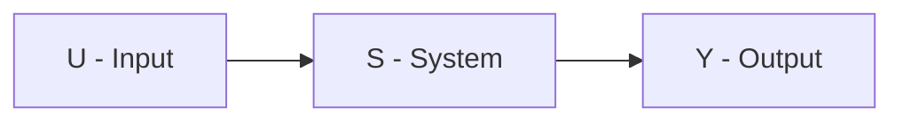
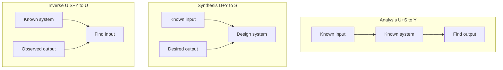
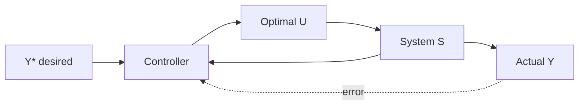
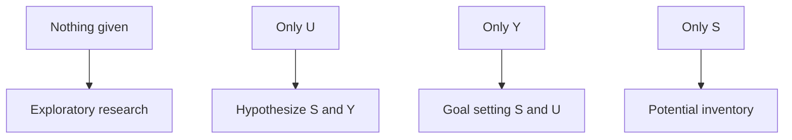
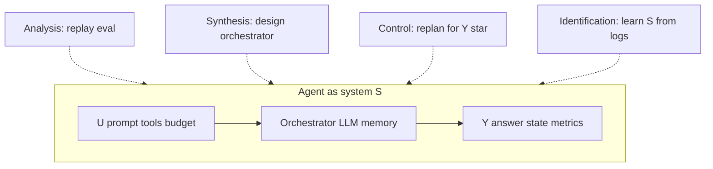

В **теории систем** и **системном анализе** почти любую постановку можно свести к трём элементам:

| Обозначение | Элемент | Примеры |
|-------------|---------|---------|
| **U** | **Вход** (воздействие, ресурс, perturbation) | Prompt, API-запрос, управляющий сигнал, бюджет |
| **S** | **Система** (оператор, структура, «чёрный ящик») | LLM + оркестратор, завод, алгоритм, организация |
| **Y** | **Выход** (результат, реакция, состояние) | Ответ агента, метрика KPI, траектория, patch в репо |

Задача классифицируется по тому, **какие два (или три) элемента известны** и **какой один (или несколько) нужно найти**. Это не академическая схема ради схемы — от выбора типа задачи зависит, нужен вам **simulator**, **optimizer**, **inverse design** или **exploratory research**.

Связанные материалы VAIRL: [устойчивость control loops](/vairl/blog/2026/06/29/agent-control-loop-stability-ru/), [генерация бенчмарков](/vairl/blog/2026/06/29/agent-benchmark-generation-ru/), [ОГАС и КиберСин](/vairl/blog/2026/07/01/cybernetic-planning-ogas-cybersyn-ru/), [Маргарет Гамильтон и USL](/vairl/blog/2026/07/01/margaret-hamilton-software-reliability-ru/).

## Базовая модель

В линейной аппроксимации: $Y = S(U)$. В динамике: $y(t) = S[u(\tau), t]$. В агентном мире: **trajectory** = последовательность $(u_k, s_k, y_k)$ на шагах control loop.

Ключевой вопрос инженера: **что зафиксировано в постановке, а что — неизвестно?**

---

## Классическая триада: три элемента, одно неизвестно

Когда известны **ровно два** из трёх, получаем три «полных» типа задач — основу курсов системного анализа и кибернетики.

| Тип | Задано | Найти | Суть |
|-----|--------|-------|------|
| **Анализ** (прямая задача) | **U + S** | **Y** | Реакция известной системы на известное воздействие |
| **Синтез** (проектирование) | **U + Y** | **S** | Построить систему, которая переводит данный вход в требуемый выход |
| **Идентификация / обратная по входу** | **S + Y** | **U** | Какое воздействие (причина, начальное условие) дало известный результат |

### 1. Задача анализа (прямая / моделирование)

**Дано:** вход и система. **Найти:** выход.

Классический **forward pass**: симуляция, прогноз, «что будет, если». В программировании — unit test с фиксированным input и известной функцией. У AI-агента — **replay** траектории в sandbox: известны prompt + версия оркестратора → ожидаемый tool trace (до стохастики LLM).

| Сфера | Пример |
|-------|--------|
| Математика | $y = Ax$, найти $y$ |
| Кибернетика | Модель объекта + управление → траектория |
| Менеджмент | Бюджет + процесс → прогноз KPI |
| AI-агент | Prompt + политика → ответ; [deterministic eval](/vairl/blog/2026/06/29/agent-benchmark-generation-ru/) |

### 2. Задача синтеза (проектирование / обратная по системе)

**Дано:** вход и желаемый выход. **Найти:** систему (структуру, алгоритм, параметры).

Это **inverse design**: не «как отреагирует», а «что построить, чтобы получить». В инженерии — подбор контроллера, архитектуры, материала. В ML — обучение модели по парам $(U, Y)$. У агентов — **prompt engineering**, выбор FSM/DAG, fine-tuning под целевой outcome.

| Сфера | Пример |
|-------|--------|
| Программирование | Спецификация API in/out → реализация |
| Кибернетика | Целевая передаточная функция → структура регулятора |
| AI-агент | Task success criteria → оркестратор + tools ([USL / DBTF](/vairl/blog/2026/07/01/margaret-hamilton-software-reliability-ru/)) |

**Важно:** в литературе термин *«идентификация системы»* часто означает другую постановку (см. ниже): **U + Y → S**, когда внутреннее устройство недоступно. Её иногда выделяют отдельно как **идентификацию чёрного ящика**, а **U + Y → S** (проектирование) называют синтезом. Оба ищут $S$, но методы разные: **fit по данным** vs **constructive design**.

### 3. Задача идентификации входа (S + Y → U)

**Дано:** система и наблюдаемый выход. **Найти:** вход (причину, возмущение, начальные условия).

**Пассивная** постановка: «что подали на вход, если знаем устройство и видим реакцию?» — inverse problem по $U$. В диагностике — root cause analysis. В агентной [телеметрии](/vairl/blog/2026/06/29/agent-telemetry-ru/) — по failed session и известному orchestrator: какой user turn / tool args привели к ошибке?

---

## Четвёртый «полный» тип: управление и оптимизация

Отдельно выделяют постановку, близкую к S + Y → U, но с **целевым** (желаемым) выходом:

| Тип | Задано | Найти | Суть |
|-----|--------|-------|------|
| **Управление / оптимизация** | **S + Y*** | **U** | Найти **оптимальное** воздействие, переводящее систему в целевое состояние |

Здесь $Y^*$ — не просто «наблюдаемый факт», а **setpoint**, критерий или ограничение. Это основа **optimal control**, MPC, RL: система фиксирована, цель задана — ищем policy $\pi: Y^* \mapsto U$.

| Сфера | Пример |
|-------|--------|
| Кибернетика | Cruise control, термостат |
| Менеджмент | Целевой ROI → распределение ресурсов |
| AI-агент | Task success + budget cap → plan / tool sequence ([control loop](/vairl/blog/2026/06/29/agent-control-loop-stability-ru/)) |

Различие **диагностики** (S + Y_observed → U_past) и **управления** (S + Y_desired → U_future) — в **временной направленности** и **оптимальности**, хотя математически обе ищут $U$.

---

## Идентификация чёрного ящика (U + Y → S)

Когда **внутреннее устройство недоступно**, но есть **партии** пар «вход–выход», ищут **модель** $S$:

**Дано:** вход и выход (много наблюдений). **Найти:** законы работы системы (оператор, параметры, структуру).

| Метод | Пример |
|-------|--------|
| System ID (MATLAB, grey-box) | Step response → transfer function |
| ML | Dataset $(u_i, y_i)$ → нейросеть |
| LLM eval mining | [Телеметрия](/vairl/blog/2026/06/29/agent-telemetry-ru/) → кластеры failure → гипотеза о «скрытом S» |
| Black-box probing | SWE-bench: issue in → patch out → infer agent capability |

Это **не синтез** в смысле «нарисовать схему с нуля», а **восстановление** $S$ из данных — фундамент [бенчмарков](/vairl/blog/2026/06/29/agent-benchmark-generation-ru/) и A/B-тестов.

---

## Граничные и недоопределённые постановки

Когда известен **только один** элемент или **ничего** — задача **недоопределена**; нужны дополнительные ограничения, гипотезы или exploratory phase.

| Задано | Тип задачи | Что искать | Суть |
|--------|------------|------------|------|
| **Только U** | Прогноз / гипотеза без модели | **S** и **Y** | Одновременно предположить систему и предсказать реакцию |
| **Только Y** | Целеполагание | **S** и **U** | Желаемый результат → придумать среду и ресурсы |
| **Только S** | Изучение потенциала | **U**, **Y** (или класс возможных) | Инвентаризация: «что умеет объект» без текущей цели |
| **Ничего** | Поисковое исследование | **U, S, Y** и связи | Выделить объект из среды, «белые пятна», первичная онтология |

### Только вход (U)

Нет модели и нет эталона выхода — типичный **ранний R&D**: «пользователи шлют такие запросы — что построить и что они получат?» Методы: кластеризация intent'ов, [task mining из телеметрии](/vairl/blog/2026/06/29/agent-telemetry-ru/), generative hypothesis ([синтез гипотез](/vairl/blog/2026/06/26/llm-hypothesis-synthesis-agents-ru/)).

### Только выход (Y)

**Целеполагание** в чистом виде: «нужен task success rate 95%» — ещё не выбраны ни стек (S), ни промпт/данные (U). Product discovery, [карта компетенций](/vairl/blog/2026/06/29/best-ai-agent-specialist-ru/) → выбор архитектуры.

### Только система (S)

**Инвентаризация потенциала:** есть LLM и tools, но нет ни задачи, ни метрики. Полезно для capability matrix, red teaming «что вообще может сломаться». Без (U, Y) нельзя приоритизировать — только catalog.

### Полная неопределённость

**Исследовательский тупик** или **green field**: объект не выделен, нет языка описания. В науке — постановка проблемы; в продукте — «нужен AI» без домена. Выход — **генерация гипотез**, ethnography, [пространство гипотез / PaCMAP](/vairl/blog/2026/06/24/hypothesis-space-pacmap-ru/).

---

## Сводная таблица: все комбинации

Обозначения: **+** = элемент задан, **?** = ищем.

| # | U | S | Y | Название | Найти |
|---|---|---|---|----------|-------|
| 1 | + | + | ? | **Анализ / моделирование** | Y |
| 2 | + | ? | + | **Синтез / проектирование** | S |
| 3 | + | ? | + | **Идентификация (black box)** | S (модель) |
| 4 | ? | + | + | **Идентификация входа / диагностика** | U |
| 5 | + | + | ?* | **Прогноз траектории** | Y(t) |
| 6 | ? | + | Y* | **Управление / оптимизация** | U (optimal) |
| 7 | + | ? | ? | **Прогноз без модели** | S, Y |
| 8 | ? | ? | + | **Целеполагание** | S, U |
| 9 | ? | + | ? | **Потенциал системы** | U, Y |
| 10 | ? | ? | ? | **Exploratory research** | U, S, Y, структура |

Строки 2 и 3 формально совпадают по «знаем U и Y», но **методология разная**: constructive synthesis vs statistical identification.

---

## Как выбрать тип задачи на практике

| Если вы… | Скорее всего это… |
|----------|-------------------|
| Пишете eval и sandbox | **Анализ** (U+S→Y) |
| Проектируете нового агента под KPI | **Синтез** (U+Y→S) |
| Копаете prod failures | **Диагностика** (S+Y→U) |
| Тюните planner под cost/latency | **Управление** (S+Y*→U) |
| Строите dataset из логов | **Идентификация** (U+Y→S) |
| Не знаете, что пользователю нужно | **Exploratory** или **только U** |

Ошибка продукта — **решать синтез**, когда данных хватает только на **exploratory**, или **анализировать** (eval), когда на самом деле нужен **синтез** архитектуры.

---

## Связь с AI-агентами: один control loop, разные постановки

| Элемент агента | U | S | Y |
|----------------|---|---|---|
| Prompt + context | ✓ | | |
| LangGraph / FSM / tools | | ✓ | |
| Answer + DB state + metrics | | | ✓ |

[Телеметрия](/vairl/blog/2026/06/29/agent-telemetry-ru/) фиксирует тройки $(u_k, s_k, y_k)$ — без этого нельзя ни идентифицировать, ни диагностировать, ни строить regression (анализ).

---

## Литература и смежные понятия

| Источник | Тема |
|----------|------|
| А. И. Бerg, «Теория систем» (Лекторий) | Классификация задач системного анализа |
| W. Ross Ashby, *Introduction to Cybernetics* | Чёрный ящик, variety |
| R. Rosen, *Anticipatory Systems* | Моделирование и синтез |
| Stafford Beer, *Brain of the Firm* | VSM, управление по целям |
| [ОГАС / Cybersyn](/vairl/blog/2026/07/01/cybernetic-planning-ogas-cybersyn-ru/) | Замкнутый контур U–S–Y на уровне экономики |

---

## Краткий чеклист постановки

1. Что **фиксировано** в задаче: U, S или Y?
2. Что **ищем** — один элемент или несколько?
3. Y — **наблюдённый** (диагностика) или **желаемый** (управление)?
4. S — **white box** (анализ) или **black box** (идентификация)?
5. Достаточно ли данных, или нужна **exploratory** фаза?

---

## Связанные публикации VAIRL

- [Устойчивость agent control loops](/vairl/blog/2026/06/29/agent-control-loop-stability-ru/) — управление S + Y* → U
- [Генерация бенчмарков](/vairl/blog/2026/06/29/agent-benchmark-generation-ru/) — анализ и идентификация способностей агента
- [Телеметрия агентов](/vairl/blog/2026/06/29/agent-telemetry-ru/) — данные для U, S, Y
- [Пространство гипотез и PaCMAP](/vairl/blog/2026/06/24/hypothesis-space-pacmap-ru/) — exploratory и «только U»
- [Кибернетическое планирование](/vairl/blog/2026/07/01/cybernetic-planning-ogas-cybersyn-ru/) — макро-контур U–S–Y
