«Кому нужен ИИ?» — вопрос, который звучит абстрактно, пока не разложить его на **конкретных людей, компаний и процессов**. В России это не «150 миллионов пользователей ChatGPT», а сложная мозаика: пенсионеры без цифровых навыков, курьеры с приложением на смартфоне, бухгалтер в Сбере, владелец кофейни с одной кассой и инженер на заводе.

Эта статья строит **четырёхслойную карту**:

1. **Население** — кто живёт, кто работает, кто может пользоваться компьютером.
2. **Компании** — от гигантов до кластеров мелкого бизнеса, платформенной занятости и **госсектора** (министерства, ведомства, госкорпорации).
3. **Процессы** — что можно автоматизировать и на каком уровне (от `if/else` до творческой работы).
4. **Матч** — связь «группа → компания → задача → AI-система».

Технические уровни автоматизации (L0–L5) подробно разобраны в [статье про ИИ для МСБ](/vairl/blog/2026/07/02/ai-automation-smb-ru/); здесь мы применяем их к **масштабу всей страны**.

---

## Карта статьи

| Раздел | Вопрос | Ключевые цифры |
|--------|--------|----------------|
| [§1. Население](#1-население-кто-живёт-кто-работает-кто-сидит-за-компьютером) | Кто из 146 млн реально «аудитория ИИ»? | 74,6 млн занятых, ~91% 15+ в интернете |
| [§2. Компании](#2-компании-от-гигантов-до-кластеров) | Кто нанимает и кто производит? | РБК 500, ~6 млн субъектов МСП, 2–5 млн платформенных |
| [§2.6. Госсектор](#26-госсектор-структура-связи-и-потенциал-ии) | Министерства, ведомства, граф связей | Указ № 326, ~3,7 млн занятых в госсекторе |
| [§3. Процессы](#3-процессы-что-автоматизирует-ии) | Какие задачи и на каком уровне? | L0–L5 |
| [§4. Матч](#4-матч-группы-компании-процессы) | Кто кому что нужен? | Таблицы соответствий |
| [Заключение](#заключение-какие-ai-системы-кому-подходят) | ChatGPT vs Codex vs OpenClaw | Устойчивость vs творчество |

---

## 1. Население: кто живёт, кто работает, кто сидит за компьютером

### 1.1. Базовая цифра

По уточнённой оценке **Росстата**, на **1 января 2025 года** в России проживало **146,12 млн** постоянных жителей. За 2024 год численность сократилась на ~31 тыс. человек (−0,02%). Официальная оценка на 1 января 2026 года на момент написания ещё не опубликована; для расчётов используем **146 млн** как округлённую рабочую величину.

> **Оговорка по территории:** официальная статистика Росстата публикуется без учёта ряда новых регионов; при сравнении с переписью 2020 года и зарубежными данными это нужно помнить.

| Показатель | Значение | Источник |
|------------|----------|----------|
| Население, 01.01.2025 | **146,12 млн** | Росстат |
| Городское | ~75% (~109,6 млн) | Росстат |
| Сельское | ~25% (~36,5 млн) | Росстат |

### 1.2. Возрастные группы

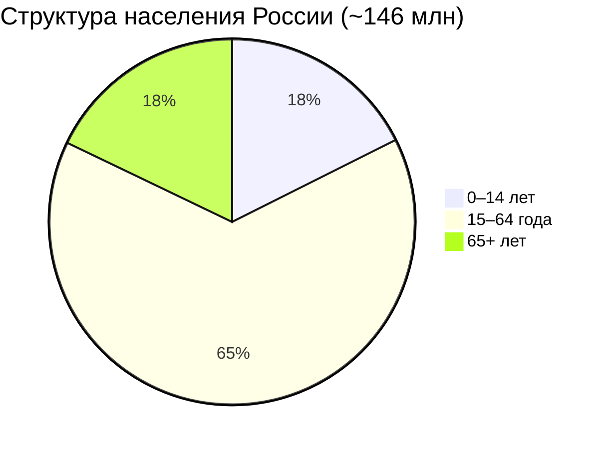

| Группа | Доля | ~Численность | Типичный статус | Релевантность ИИ |
|--------|------|--------------|-----------------|------------------|
| **Дети 0–14** | 17,6% | **~26 млн** | Школа, дошкольное | Образовательные тьюторы (L1), родители как прокси-пользователи |
| **Трудоспособный возраст 15–64** | 64,5% | **~94 млн** | Работа, учёба, декрет | Основная аудитория |
| **Пожилые 65+** | 16,8% | **~25 млн** | Пенсия, уход | Голосовые ассистенты, телемедицина; низкая цифровая грамотность |

Из ~94 млн человек в возрасте 15–64 **не все работают**: часть учится, сидит в декрете, ухаживает за родственниками, имеет инвалидность.

### 1.3. Экономически активное население

По данным обследования рабочей силы (**I квартал 2026**):

| Категория | Численность | Доля от 15+ |
|-----------|-------------|-------------|
| **Рабочая сила** (экономически активные) | **76,2 млн** | ~63% |
| — из них **занятые** | **74,6 млн** | ~62% |
| — из них **безработные** | **1,7 млн** | ~1,4% (уровень 2,2%) |
| **Не в рабочей силе** | **~44 млн** | ~37% |

**Не в рабочей силе (~44 млн)** — это прежде всего:

- пенсионеры 65+ (большинство из ~25 млн в этой возрастной группе);
- школьники и студенты очной формы;
- лица в декретном отпуске и неработающие по уходу;
- люди с инвалидностью и иные, не ищущие работу.

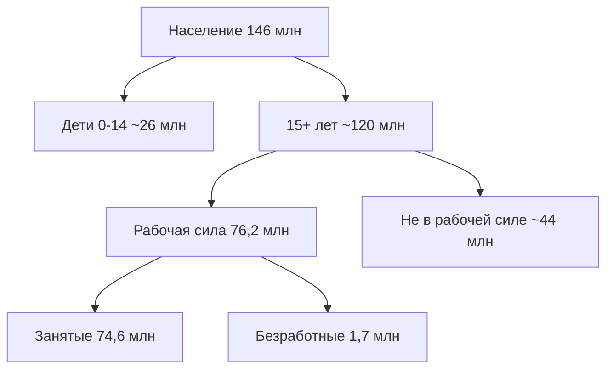

### 1.4. Занятость по отраслям (ОКВЭД2)

Среднегодовая численность занятых по Росстату в **2023 году** — **71,9 млн**; к **концу 2024 / началу 2026** оценка выросла до **~74,6 млн** (+3,7%). Ниже — структура 2023 года с экстраполяцией на 74,6 млн (коэффициент ~1,04). Погрешность по отдельным отраслям — порядка 1–2 п.п.

| Отрасль (ОКВЭД2) | 2023, млн | ~2025, млн | Доля | Характер труда |
|-----------------|-----------|------------|------|----------------|
| **Торговля** (опт + розница) | 13,4 | **~14,0** | 18,8% | Продавцы, кассиры, закупщики |
| **Обрабатывающие производства** | 10,3 | **~10,7** | 14,4% | Рабочие, инженеры, ОТК |
| **Сельское хозяйство и лес** | 6,9 | **~7,2** | 9,6% | Сезонный, физический |
| **Строительство** | 6,8 | **~7,1** | 9,5% | Прорабы, монтажники |
| **Образование** | 5,4 | **~5,6** | 7,5% | Учителя, преподаватели |
| **Транспорт и склад** | 5,9 | **~6,1** | 8,2% | Водители, логисты, диспетчеры |
| **Здравоохранение и соцуслуги** | 4,5 | **~4,7** | 6,3% | Врачи, медсёстры, сиделки |
| **Госуправление и соцобеспечение** | 3,5 | **~3,7** | 4,9% | Чиновники, военные |
| **Добыча полезных ископаемых** | ~2,0 | **~2,1** | 2,8% | Шахтёры, нефтяники |
| **Профессиональная, научная, техническая** | 3,0 | **~3,1** | 4,2% | Юристы, консультанты, R&D |
| **Административная и вспомогательная** | 2,2 | **~2,3** | 3,1% | Охрана, уборка, колл-центры |
| **Операции с недвижимостью** | 1,9 | **~2,0** | 2,7% | Риелторы, управляющие |
| **Гостиницы и общепит** | 2,0 | **~2,1** | 2,8% | Официанты, повара, администраторы |
| **Информация и связь (ИТ)** | 1,6 | **~1,6** | 2,1% | Разработчики, дизайнеры |
| **Финансы и страхование** | 1,3 | **~1,4** | 1,9% | Банкиры, андеррайтеры |
| **Культура, спорт, досуг** | 1,2 | **~1,2** | 1,6% | Тренеры, артисты |
| **Прочие услуги** | 1,7 | **~1,8** | 2,4% | Бытовые, персональные |
| **Энергетика, ЖКХ, вода** | ~2,3 | **~2,4** | 3,2% | Операторы, диспетчеры |

**Вывод по отраслям:** больше всего занятых — в **торговле** (~14 млн), **производстве** (~11 млн) и **АПК** (~7 млн). Это «синие воротнички» и линейный персонал — главный резерв для L0–L2 автоматизации. **ИТ** (~1,6 млн) — узкая, но наиболее готовая к L3–L4 аудитория.

### 1.5. Кто может пользоваться компьютером?

Цифровой доступ ≠ цифровая грамотность ≠ готовность к ИИ.

| Показатель | Значение | Комментарий |
|------------|----------|-------------|
| Домохозяйства с интернетом | **90–92%** | ИСИЭЗ НИУ ВШЭ, Росстат, 2024–2025 |
| Население 15+ в интернете | **~91%** | Регулярный доступ |
| Смартфон как основное устройство | **~89%** домохозяйств | Мобильный-first |
| Базовые цифровые навыки | **~11%** населения 15+ | ИСИЭЗ, 2024 — критический разрыв |
| Продвинутые навыки (таблицы, код) | **меньше 5%** | Оценка по косвенным данным |

**Практическая сегментация по доступу к ИИ:**

| Сегмент | ~Численность | Устройство | Готовность к ИИ |
|---------|--------------|------------|-----------------|
| **A. Цифровые профессионалы** | ~3–5 млн | ПК + IDE + API | L3–L4 нативно |
| **B. Офисные «белые воротнички»** | ~15–20 млн | ПК, почта, Excel, CRM | L1–L2, пилоты L3 |
| **C. Мобильные сервисные** | ~25–35 млн | Смартфон, приложения | L1 чат, L2 через платформы |
| **D. Физический труд без ПК** | ~20–25 млн | Кнопочный телефон / нет | ИИ косвенно (через начальника, ERP) |
| **E. Не в интернете / 65+** | ~10–15 млн | ТВ, звонок | Голосовые боты, родственники |

> **Ключевой парадокс:** интернет есть у **девяти из десяти**, а **уверенно работать с цифровыми инструментами** — единицы. ИИ-пилоты, рассчитанные на «самообслуживание сотрудника», покрывают сегменты A–B (~20–25 млн), а не все 146 млн.

---

## 2. Компании: от гигантов до кластеров

### 2.1. Макроструктура экономики

| Слой | Кто | ~Численность субъектов | ~Занятых |
|------|-----|------------------------|----------|
| **Крупный и средний бизнес** | Организации с отчётностью П-4 | ~500 тыс. | **~34–44 млн** |
| **Малый бизнес и ИП** | До 100 чел., оборот до 800 млн ₽ | **~5–6 млн** | **~25–30 млн** |
| **Самозанятые** | НПД, без штата | **~15 млн** чел. | пересечение с МСБ |
| **Платформенная занятость** | Исполнители агрегаторов | 2–5 млн активных | подмножество самозанятых |

По оценке **ВЭБа**, из 74,6 млн занятых лишь **~34,5 млн** работают в средних и крупных организациях по формальной отчётности; остальное — **малый бизнес, ИП, самозанятость и неформальный сектор**.

### 2.2. Крупнейшие компании (корпоративный сегмент)

Рейтинг **РБК 500** (выручка за 2024 год). Топ-10 — якоря спроса на корпоративный ИИ:

| # | Компания | Отрасль | Выручка 2024 | ~Сотрудники | Профиль ИИ-спроса |
|---|----------|---------|--------------|-------------|-------------------|
| 1 | **Газпром** | Нефтегаз | ~10,7 трлн ₽ | ~512 тыс. | Предиктивное обслуживание, документооборот |
| 2 | **Роснефть** | Нефтегаз | ~10,1 трлн ₽ | ~348 тыс. | Геологоразведка, безопасность |
| 3 | **Сбербанк** | Финансы | ~9,4 трлн ₽ | ~369 тыс. | GigaChat, скоринг, агенты для клиентов |
| 4 | **ЛУКОЙЛ** | Нефтегаз | ~6,7 трлн ₽ | — | Оптимизация добычи |
| 5 | **ВТБ** | Финансы | ~4,7 трлн ₽ | ~271 тыс. | Кредитные боты, комплаенс |
| 6 | **РЖД** | Транспорт | — | ~723 тыс. | Логистика, расписания, предиктив |
| 7 | **X5 Group** | Ритейл | — | ~374 тыс. | Прогноз спроса, ценообразование |
| 8 | **Магнит** | Ритейл | — | ~316 тыс. | Аналогично X5 |
| 9 | **Ростех** | ОПК / промышленность | — | ~298 тыс. | Конструкторская документация |
| 10 | **Яндекс** | ИТ / платформы | — | ~десятки тыс. штат + экосистема | YandexGPT, автономный транспорт |

**Отраслевые «пятёрки» по выручке (совокупно из РБК 500):**

| Отрасль | Доля выручки топ-500 | Типичный ИИ-кейс |
|---------|---------------------|------------------|
| Нефтегаз | ~27% | Предиктив, цифровые двойники |
| Финансы | ~15% | Скоринг, антифрод, чат-боты |
| Ритейл и потребление | ~12% | Спрос, персонализация, склад |
| Транспорт и логистика | ~8% | Маршрутизация, ETA |
| Телеком и ИТ | ~7% | Поддержка, код, инфраструктура |
| Металлургия и химия | ~10% | Контроль качества, энергоэффективность |
| Электроэнергетика | ~5% | Балансировка сети |

### 2.3. Кластеры малого и микробизнеса

Вместо перечисления миллионов ИП полезнее мыслить **кластерами** — однотипными бизнесами с общими процессами:

| Кластер | ~Точек / ИП | ~Занятых в кластере | Типичный масштаб | ИИ-приоритет |
|---------|-------------|---------------------|------------------|--------------|
| **Общепит** (кофейни, кафе, столовые) | ~200 тыс. | ~2,1 млн | 3–15 сотрудников | Закупки, меню, отзывы, чат-запись |
| **Розничная точка** (продуктовые, павильоны) | ~150 тыс. | ~3–4 млн* | 2–10 сотрудников | Инвентарь, цены (*включая сети) |
| **Красота и wellness** | ~100 тыс. | ~0,8 млн | 1–8 мастеров | Запись, CRM, контент |
| **Автосервис и шиномонтаж** | ~80 тыс. | ~0,5 млн | 2–12 механиков | Заказ-наряды, запчасти |
| **Бытовые услуги** (клининг, ремонт) | ~500 тыс. | ~1,5 млн | 1–5 человек | Лиды, сметы, маршрут |
| **Медицина частная** (стоматология, клиники) | ~50 тыс. | ~0,6 млн | 5–50 сотрудников | Запись, протоколы, страховки |
| **Образование частное** (курсы, репетиторы) | ~80 тыс. | ~0,4 млн | 1–20 педагогов | Контент, проверка ДЗ |
| **Гостиницы и хостелы** | ~30 тыс. | ~0,3 млн | 3–30 номеров | Бронирование, отзывы |

*Кофейни* как отдельный кластер внутри общепита: по оценкам отраслевых ассоциаций, в России **~15–25 тыс. кофеен** (без автоматов); объединённый кластер «кофейня + кафе + пекарня» — **~80–100 тыс. точек**.

### 2.4. Платформенная занятость

**Цифровые платформы** — отдельный слой: не компания-работодатель в классическом смысле, а **инфраструктура сопряжения** спроса и исполнителей.

| Платформа | Сегмент | ~Активных исполнителей | ИИ на стороне |
|-----------|---------|------------------------|---------------|
| **Яндекс** (Такси, Еда, Доставка, Маркет) | Транспорт, доставка, торговля | ~1–2 млн | Маршруты, ETA, динамическое ценообразование |
| **Ozon / Wildberries** | Маркетплейсы, склады | ~0,5–1 млн | Рекомендации, модерация, складские роботы |
| **Avito** | C2C, услуги | ~0,3 млн продавцов/мастеров | Модерация, антифрод, чат-бот |
| **Profi.ru / YouDo** | Бытовые услуги | ~0,2 млн | Матчинг заказ-мастер |
| **Самокат, СберМаркет** | Быстрая доставка | ~0,1–0,2 млн | Сборка заказов, слоты |
| **Купер, Деливери** | Агрегаторы доставки | ~0,1 млн | Аналогично |

По оценкам **ФНС и аналитиков**, **~15 млн** зарегистрированных самозанятых (2025); **2–5 млн** регулярно получают заказы через платформы (**~3–7%** всех занятых). С **1 октября 2026** вступает **289-ФЗ** о платформенной экономике — это ускорит формализацию и, вероятно, внедрение ИИ для верификации и комплаенса на стороне платформ.

### 2.5. Производители для населения (B2C-цепочка)

Отдельно выделим компании, чья **продукция потребляется населением** — здесь ИИ влияет и на **производство**, и на **маркетинг/дистрибуцию**:

| Категория | Примеры | Что производят | ИИ в цепочке |
|-----------|---------|----------------|--------------|
| **Продукты питания** | Черкизово, Мираторг, Балтика/АБИ, Danone RU | Мясо, молоко, напитки | Прогноз спроса, контроль качества |
| **FMCG и бытовая химия** | Unilever RU, Henkel, P&G RU | Шампуни, порошки | Персонализация рекламы |
| **Фарма** | Р-Фарм, Биннофарм, Гедеон Рихтер RU | Лекарства | Фармаконадзор, R&D |
| **Одежда и обувь** | Gloria Jeans, Melon Fashion, Zenden | Масс-маркет | Тренды, размерные сетки |
| **Электроника и быттехника** | Haier RU, Samsung RU, DEXP | Телевизоры, холодильники | Поддержка, прошивки |
| **Мебель** | IKEA RU, «Ангстрем», «Шатура» | Мебель | Конфигураторы, логистика |
| **Жильё (девелопмент)** | ПИК, Самолёт, ЛСР | Квартиры | Планировки, продажи |
| **Автомобили** | АвтоВАЗ, Haval RU, Москвич | Легковые авто | Ассистенты, диагностика |
| **Телеком и медиа** | МТС, МегаФон, Т2, VK | Связь, контент | Рекомендации, модерация |

**Государственные услуги для граждан** (не производство, но B2C): **Госуслуги**, **МФЦ**, **Почта России** (~169 тыс. сотрудников) — огромный пласт для L1–L2 (чат-боты, маршрутизация обращений). Полная структура министерств и ведомств — в [§2.6](#26-госсектор-структура-связи-и-потенциал-ии).

---

## 2.6. Госсектор: структура, связи и потенциал ИИ

Госсектор — **третий полюс** рядом с корпорациями и населением: **~3,7 млн занятых** в госуправлении и соцобеспечении (по ОКВЭД), плюс **миллионы** в подведомственных учреждениях (школы, больницы, МФЦ). Для карты спроса на ИИ важны не только «министерства на карте», а **граф полномочий**: кто регулирует бизнес, кто обслуживает граждан, через какие цифровые шлюзы идёт коммуникация.

> **Правовая основа структуры:** [Указ Президента РФ от 11.05.2024 № 326](http://www.kremlin.ru/acts/bank/50541) «О структуре федеральных органов исполнительной власти» (ред. от 17.06.2024 № 522). Ниже — прикладная схема для анализа ИИ; для юридически точных формулировок полномочий см. положения о конкретных ФОИВ.

### 2.6.1. Уровни власти и цифровые шлюзы

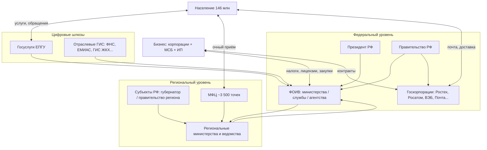

| Уровень | Кто | Роль в цепочке ИИ |
|---------|-----|-------------------|
| **Федеральный** | 21 министерство + десятки служб/агентств | Стандарты, регуляторика, крупные ГИС, госзаказ на ИИ |
| **Региональный** | 89 субъектов, свои министерства | МФЦ, соцзащита, региональные порталы — **массовый контакт** с населением |
| **Муниципальный** | ~20 тыс. ОМСУ | ЖКХ, запись в сад/школу, местные обращения |
| **Цифровой шлюз** | Госуслуги, отраслевые ЛК | **Единая точка** для L1–L2: боты, маршрутизация, статусы |

### 2.6.2. Три блока федеральных органов (Указ № 326)

Федеральные органы исполнительной власти (ФОИВ) делятся на **три блока** по субординации. Для ИИ это разные режимы: силовой блок — закрытые контуры; гражданский — Госуслуги и надзор; регуляторы — жёсткий L0 + L1 для текстов.

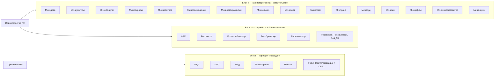

#### Блок I. Курирует Президент РФ

| Орган | Тип | Зона ответственности | Связь с населением | Связь с бизнесом | ИИ: уровень |
|-------|-----|----------------------|--------------------|------------------|-------------|
| **МВД** | Министерство | Общественный порядок, миграция, дорожная полиция | Паспорта, права, штрафы, справки | Лицензии охраны, проверки | L0–L1: OCR, биометрия; GenAI — справки |
| **МЧС** | Министерство | ЧС, пожары, спасение | Оповещения, 112 | Проверки пожарной безопасности | L0–L1: прогноз ЧС, дроны |
| **МИД** | Министерство | Внешняя политика | Консульства, визы | Экспорт услуг | L1: перевод, дипломатическая переписка |
| **Минобороны** | Министерство | Оборона | Призыв (через военкоматы) | ОПК, госконтракты | Закрытые контуры; L0–L1 |
| **Минюст** | Министерство | Законодательство, нотариат, регистрация НКО | Нотариусы, юрпомощь | Регистрация юрлиц | L1–L2: анализ НПА, шаблоны |
| **ФСИН** | Служба ↳ Минюст | Исполнение наказаний | — | Закупки ИТ | L0–L1 |
| **ФССП** | Служба ↳ Минюст | Взыскание, исполнительные листы | Долги граждан | Взыскание с юрлиц | L0–L2: матчинг долгов, боты |
| **ФСБ, ФСО, Росгвардия, СВР** | Службы | Безопасность | Косвенно | Лицензии ФСБ для ИТ | Закрыто; не массовый GenAI |
| **Росфинмониторинг** | Служба | ПОД/ФТ | — | Отчётность 115-ФЗ | L0–L1: графы, аномалии |
| **ФСТЭК** ↳ Минобороны | Служба | ИБ, сертификация | — | Требования к СЗИ | L0: стандарты; задаёт рамки для ИИ |

#### Блок II. Министерства при Правительстве (полный граф с ведомствами)

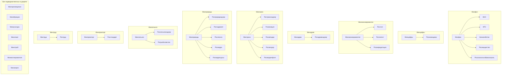

Сводная таблица **министерств блока II**: зона, каналы к населению и бизнесу, потенциал ИИ.

| Министерство | Ведомства (ключевые) | Зона ответственности | Население | Бизнес | ИИ сегодня → потолок |
|--------------|----------------------|----------------------|-----------|--------|----------------------|
| **Минфин** | ФНС, ФТС, Казначейство, Росимущество | Бюджет, налоги, таможня, госимущество | Льготы, возврат НДФЛ, «Налоги FL» | Отчётность, НДС, таможня | L0–L2 → L2: разбор деклараций, чат-бот ФНС |
| **Минцифры** | Роскомнадзор | Цифровизация, ЕПГУ, связь | **Госуслуги**, цифровые права | Реестр ПО, 152-ФЗ | **L1–L3**: ЕПГУ-бот, GigaChat в госсекторе |
| **Минэкономразвития** | Росстат, Роспатент, Росаккредитация | Макрополитика, инвестиции, статистика | Статданные, МСП-меры | Субсидии, реестры | L1–L2: аналитика, патентный поиск |
| **Минздрав** | Росздравнадзор | Политика в здравоохранении | ЕМИАС (регионы), диспансеризация | Лицензии клиник, фарма | L1–L2: триаж; L3+ — под надзором |
| **Минпросвещения** | — (надзор: Рособрнадзор, бл. III) | Школы 1–11 | Электронный дневник, ЕГЭ | Частные школы | L1–L2: проверка ДЗ, контент |
| **Минобрнауки** | — (надзор: Рособрнадзор) | Вузы, наука | Стипендии, общежития | Гранты, лаборатории | L1–L3: исследования, код |
| **Минтруд** | Роструд | Пенсии, занятость, трудовое право | СФР, пособия, биржа труда | Инспекции труда | L1–L2: ответы на типовые вопросы |
| **Минтранс** | Ространснадзор, Росавиация, Росавтодор… | Транспорт, инфраструктура | Билеты, права (с МВД), дороги | Лицензии перевозчиков | L0–L1: ETA, тарифы; L1 — жалобы |
| **Минстрой** | — | ЖКХ, долевое строительство | ГИС ЖКХ, капремонт | СРО, застройщики (ДОМ.РФ) | L1–L2: разбор договоров ДДУ |
| **Минэнерго** | — | ТЭК, тарифы | Счётчика, отключения | Лицензии, недра (с Минприроды) | L0–L1: баланс сети |
| **Минпромторг** | Росстандарт | Промышленность, торговля | — | ГОСТ, сертификация | L1–L2: техрегламенты |
| **Минсельхоз** | Россельхознадзор, Росрыболовство | АПК | Подворье, субсидии Фермеру | Фитосанитарный контроль | L0–L1: спутник + отчёты |
| **Минприроды** | Росприроднадзор, Рослесхоз… | Экология, недра, лес | Экологические данные | Экологический надзор | L0–L1: мониторинг |
| **Минкультуры** | — | Культура, наследие | Музеи, билеты | Гранты | L1: перевод, гиды |
| **Минспорт** | — | Спорт, массовый спорт | Секции, льготы | — | L1: расписания |
| **Минвостокразвития** | — | ДФО, Арктика | Меры переселенца | Льготы резидентов ТОР | L1–L2: навигатор мер |

#### Блок III. Независимые регуляторы при Правительстве

| Орган | Зона | Население | Бизнес | ИИ |
|-------|------|-----------|--------|-----|
| **ФАС** | Антимонополь, тарифы | Жалобы на цены | Сделки M&A, доминирование | L0–L2: анализ рынков, шаблоны решений |
| **Росреестр** | Кадастр, ЕГРН | Выписки, регистрация прав | Залоги, сделки | L0–L1: OCR документов; L2 — проверка сделок |
| **Роспотребнадзор** | Санэпиднадзор, защита прав | Жалобы, рейтинги | Проверки общепита, фарма | L1–L2: классификация обращений |
| **Рособрнадзор** | Качество образования | Аттестаты, лицензии | Частное образование | L1: проверка программ |
| **Ростехнадзор** | Промбезопасность, атом | — | Опасные производства | L0–L1: предиктив, не GenAI |
| **Росрезерв** | Госрезервы | — | Поставки в резерв | L0 |
| **Росмолодёжь** | Молодёжная политика | Гранты, форумы | — | L1: контент |
| **ФАДН** | Межнациональные отношения | — | — | L1 |

### 2.6.3. Госкорпорации и компании с государственным участием

Госкорпорации — **мост** между ФОИВ и рынком: не министерства, но выполняют госфункции и конкурируют/сотрудничают с бизнесом.

| Организация | Под кем | Функция | Население | Корпорации | ИИ |
|-------------|---------|---------|-----------|------------|-----|
| **Почта России** | Минцифры (операционно) | Доставка, платежи, МФЦ-функции | **~169 тыс.** сотрудников; отделения в сёлах | Логистика e-commerce | L1–L2: маршруты уже L0; боты отслеживания |
| **Ростех** | — | ОПК, гражданская техника | — | Подрядчик Газпрома, РЖД | L1–L3 в КБ |
| **Росатом** | — | Атом, энергетика | Теплоснабжение | Экспорт, медизотопы | L0–L1 |
| **РЖД** | Минтранс (регулирование) | Ж/д монополия | Пассажиры, билеты | Грузоперевозки | L0–L2 |
| **ДОМ.РФ** | — | Ипотека, девелопмент | Льготная ипотека | Застройщики | L0–L2: скоринг |
| **ВЭБ.РФ** | — | Проектное финансирование | — | Инфраструктурные гиганты | L1–L2: аналитика |
| **Роскосмос** | — | Космос | Телематика | Связь, ГЛОНАСС | L0–L1 |
| **Аэрофлот** (госучастие) | Минтранс | Авиаперевозки | Пассажиры | — | L1: поддержка |

### 2.6.4. Как госсектор общается с населением

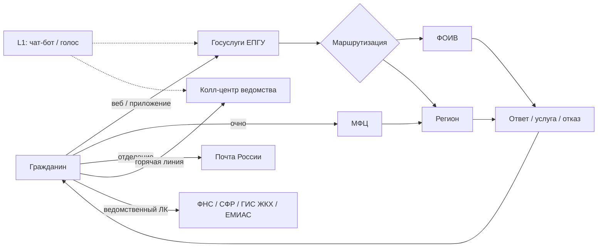

| Канал | Охват | Типовые услуги | Зрелость ИИ | Ограничение |
|-------|-------|----------------|-------------|-------------|
| **Госуслуги (ЕПГУ)** | Десятки млн УЗ | Паспорт, налоги, пособия, запись к врачу | L1–L2: виртуальный ассистент | 152-ФЗ, ЕБС, только типовые кейсы |
| **МФЦ** | ~3 500 офисов | «Одно окно», 400+ услуг | L1 на стойке (пилоты) | Человек обязателен для сложных кейсов |
| **ФНС ЛК / приложение** | Налогоплательщики | Декларации, вычеты | L1–L2 | Юридическая ответственность за ошибку |
| **СФР (бывш. ПФР)** | Все работающие | Пенсии, пособия | L1 | Высокая чувствительность данных |
| **ЕМИАС** | Москва + регионы | Запись, электронная карта | L1–L2 | Медданные |
| **ГИС ЖКХ** | Собственники жилья | Квитанции, жалобы УК | L1 | Интеграция с УК |
| **Почта России** | Сельская местность | Пенсии, платежи, доставка | L1 | Legacy ИТ |
| **Горячие линии** | Все ведомства | Консультации | L1–L2 IVR + LLM | Качество ответов |

**Сегменты населения × канал:**

| Сегмент (~млн) | Главный канал | ИИ-точка входа |
|----------------|---------------|----------------|
| Цифровые (20–30) | Госуслуги, ФНС ЛК | Чат-бот ЕПГУ, голосовой ассистент |
| 65+ / мало навыков (10–15) | МФЦ, Почта, телефон | Голос L1; родственник как прокси |
| Сельские (36) | МФЦ, Почта | Низкая; очный приём |
| Мигранты / иностранцы | МВД, консульства | L1 перевод (МИД, МВД) |

### 2.6.5. Как госсектор взаимодействует с корпорациями

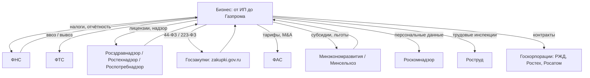

| Тип взаимодействия | Кто регулирует / проводит | Примеры корпораций | Процесс | ИИ-потенциал |
|--------------------|---------------------------|--------------------|---------|--------------|
| **Налоги и отчётность** | ФНС | Все юрлица | Декларации, камеральные проверки | L0–L2: аномалии, подсказки |
| **Таможня** | ФТС | Импортёры, экспортёры нефти | ДТ, классификация ТН ВЭД | L1–L2: классификация товаров |
| **Госзаказ** | Заказчики-ФОИВ | Ростех, ИТ-интеграторы | Тендеры, исполнение контрактов | L1–L2: анализ ТЗ, риски |
| **Лицензирование** | Отраслевые надзоры | Аптеки, заводы, банки (ЦБ отдельно) | Выездные проверки | L1: подготовка к проверке |
| **Антимонополь** | ФАС | Сбер, Яндекс, X5 | Слияния, злоупотребления | L2: анализ рынков |
| **Персональные данные** | Роскомнадзор | VK, Ozon, банки | Утечки, реестр операторов | L0–L1: сканирование утечек |
| **Субсидии и меры** | Минэкономразвития, Минсельхоз | МСП, агрохолдинги | Возмещение, льготные кредиты | L1–L2: навигатор мер |
| **Инфраструктурные контракты** | Минтранс → РЖД | РЖД, ОСК | Тарифы, инвестпрограммы | L0–L1 |

**Влияние на корпорации:** ФОИВ не «покупают ИИ для Газпрома» — они задают **правила игры** (регуляторика, госзаказ, стандарты). Корпорации вынуждены внедрять ИИ для **комплаенса** (ФНС, Роскомнадзор, 115-ФЗ) и для **выигрыша тендеров** (автоматизация заявок на zakupki.gov.ru).

### 2.6.6. Потенциал автоматизации по типам госфункций

| Госфункция | Примеры | Доля рутины | Уровень ИИ | Барьер |
|------------|---------|-------------|------------|--------|
| **Регистрация и справки** | ЕГРН, паспорт, ИНН | Высокая | L0–L2 | Юридическая сила документа |
| **Начисление выплат** | Пенсии, пособия | Высокая | L0–L1 | Ошибка = социальный резонанс |
| **Надзор и проверки** | Роспотребнадзор, труд | Средняя | L1–L2 | Выездная инспекция остаётся |
| **Консультации** | Горячие линии, МФЦ | Высокая | **L1–L2** | **Макс. ROI для GenAI** |
| **Закупки** | 44-ФЗ | Средняя | L1–L2 | Коррупционные риски |
| **Аналитика / отчётность** | Росстат, министерства | Средняя | L1–L3 | Закрытые данные |
| **Принятие решений** | Лицензии, разрешения | Низкая | L1 черновик | Human-in-the-loop обязателен |
| **Оборона / безопасность** | ФСБ, МО | — | Закрыто | Отдельный контур |

**Приоритетная тройка для GenAI в госсекторе (2026–2028):**

1. **Маршрутизация обращений** (ЕПГУ, МФЦ, колл-центры) — L1–L2, миллионы обращений.
2. **Типовые тексты** (ответы на жалобы, проекты НПА, протоколы) — L1–L2 для чиновника.
3. **Навигаторы мер поддержки** (МСП, сельхоз, маткапитал) — L1–L2 для гражданина и бизнеса.

Потолок **L3+** (агенты с доступом к ГИС) — пилоты в Минцифры и отдельных регионах; массово блокируют **152-ФЗ**, **требования ФСТЭК/ФСБ** и необходимость **юридически значимого** решения.

### 2.6.7. Триада: население ↔ госсектор ↔ корпорации

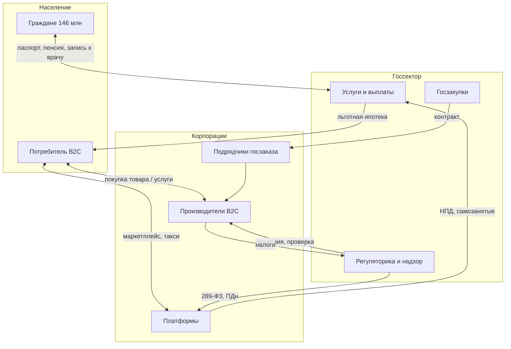

| Узел | Роль в системе | Кому нужен ИИ (из статьи) |
|------|----------------|---------------------------|
| **Гражданин** | Получает услуги, платит налоги, голосует | L1: Госуслуги, голос; не L4 |
| **ФОИВ** | Регулирует, обслуживает, закупает | L1–L2 внутри; L0 для инвариантов |
| **Корпорация** | Производит, нанимает, платит налоги | L0–L3 по отрасли; комплаенс из-за ФОИВ |
| **Платформа** | Посредник между гражданином и ИП | L0 матчинг; регулятор — Роскомнадзор, 289-ФЗ |

**Примеры сквозных цепочек:**

| Цепочка | Путь | Где ИИ |
|---------|------|--------|
| **Льготная ипотека** | Гражданин → ДОМ.РФ / банк → Минфин / ЦБ | L0 скоринг; L1 консультант |
| **Детский сад** | Родитель → Госуслуги → муниципалитет | L2 очередь; L1 FAQ |
| **Доставка еды** | Клиент → Яндекс → самозанятый курьер → ФНС (НПД) | L0 маршрут; L1 поддержка |
| **Лекарство** | Пациент → аптека → Росздравнадзор | L0 маркировка; L1 справка |
| **Стройка** | Дольщик → застройщик → ДОМ.РФ / Росреестр | L2 договор ДДУ; L0 реестр |

### 2.6.8. Матч: ФОИВ → AI-система

| ФОИВ / канал | Процесс | Уровень | Система | Устойчивость / творчество |
|--------------|---------|---------|---------|---------------------------|
| **Минцифры / ЕПГУ** | Маршрутизация обращений | L1–L2 | Виртуальный ассистент ЕПГУ, GigaChat | Высокая / низкое |
| **ФНС** | Консультации, подсказки в декларации | L1–L2 | Чат-бот ФНС, «Налоги FL» | Высокая / низкое |
| **Минтруд / СФР** | Статус пособия | L0–L1 | FSM статусов + L1 FAQ | Очень высокая / нет |
| **Минздрав / ЕМИАС** | Запись, напоминания | L0–L2 | Интеграция с календарём | Высокая / низкое |
| **Росреестр** | Проверка выписки | L0–L1 | OCR, сверка полей | Очень высокая / нет |
| **ФАС** | Анализ рынка по делу | L1–L3 | Внутренний аналитик + LLM | Средняя / среднее |
| **Минобрнауки** | Грантовая аналитика | L2–L3 | Агенты для отчётов | Средняя / среднее |
| **МВД** | Справки, штрафы | L0–L1 | ГИБДД онлайн | Высокая / нет |
| **Минюст** | Проекты НПА | L1–L2 | Черновик + рецензент-человек | Средняя / среднее |
| **Роскомнадзор** | Модерация, реестры | L0–L1 | Классификаторы | Высокая / нет |

---

## 3. Процессы: что автоматизирует ИИ

### 3.1. Шкала автоматизации L0–L5

Используем шкалу из [обзора для МСБ](/vairl/blog/2026/07/02/ai-automation-smb-ru/):

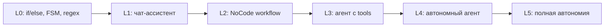

| Уровень | Механизм | Предсказуемость | Творчество | Примеры процессов |
|---------|----------|-----------------|------------|-------------------|
| **L0** | Условия, FSM, regex, 1С | ★★★★★ | ☆ | Начисление зарплаты, статусы заказа, валидация ИНН |
| **L1** | Чат-бот, черновик текста | ★★★★☆ | ★★☆ | Ответы клиентам, резюме, перевод |
| **L2** | n8n / Make + LLM-узел | ★★★★☆ | ★★☆ | Письмо → CRM → задача менеджеру |
| **L3** | Агент: shell, API, файлы | ★★★☆☆ | ★★★☆ | Отчёт из Excel, код-ревью, тесты |
| **L4** | Проактивный агент 24/7 | ★★☆☆☆ | ★★★☆ | Мониторинг почты, дайджесты, OpenClaw |
| **L5** | Автономное ведение бизнеса | ★☆☆☆☆ | ★★★★★ | CoffeeBench: закупки, цены, маркетинг неделями |

### 3.2. Каталог процессов по функциям

| Функция | Процессы | Типичный уровень | Зрелость ИИ |
|---------|----------|------------------|-------------|
| **Продажи** | Лидогенерация, квалификация, КП, допродажи | L1–L2 | Высокая |
| **Поддержка** | Тикеты, FAQ, эскалация | L1–L2 | Высокая |
| **Маркетинг** | Копирайт, A/B текстов, SEO, креатив | L1–L3 | Средняя |
| **Закупки** | Поиск поставщиков, сравнение цен | L2–L3 | Средняя |
| **Склад и логистика** | Маршруты, прогноз спроса, комплектация | L0–L2 | Высокая (без LLM) |
| **Производство** | Контроль качества, предиктив | L0–L1 | Высокая (CV, не LLM) |
| **Финансы** | Сверка, первичка, отчётность | L0–L2 | Средняя |
| **HR** | Скрининг резюме, онбординг | L1–L2 | Средняя |
| **Юридическое** | Анализ договоров, риски | L1–L3 | Средняя |
| **R&D** | Гипотезы, код, эксперименты | L3–L5 | Низкая в продакшене |
| **Управление** | Отчёты, планёрки, решения | L1–L4 | Низкая–средняя |
| **Творчество** | Дизайн, музыка, сценарии | L1–L5 | Высокая генерация, низкая надёжность |

### 3.3. Матрица «отрасль × процесс × уровень»

| Отрасль | Процесс с max ROI | Уровень | Почему не выше |
|---------|-------------------|---------|----------------|
| Ритейл | Прогноз спроса, персонализация | L0–L2 | Цена ошибки в остатках |
| Общепит | Закупки, отзывы, контент | L1–L2 | Нет API у малой кофейни |
| Банки | Скоринг, поддержка | L0–L2 | Комплаенс блокирует L4 |
| Производство | Предиктив, CV-дефекты | L0–L1 | LLM не нужен |
| ИТ | Код, тесты, документация | L3–L4 | Зрелые coding-агенты |
| Образование | Проверка ДЗ, тьютор | L1–L2 | Педагогический контроль |
| Медицина | Триаж, протоколы | L1–L2 | Лицензирование L3+ |
| Госсектор | Маршрутизация обращений | L1–L2 | Бюрократия, 152-ФЗ |
| Платформы | Модерация, матчинг | L0–L2 | Масштаб, антифрод = L0 |
| Курьеры / такси | Маршрут, слоты | L0 | Уже автоматизировано без GenAI |

---

## 4. Матч: группы, компании, процессы

### 4.1. Оператор соответствия

Введём **оператор матчинга** **M**:

$$\mathcal{M}: \;\; \text{Группа} \times \text{Компания/кластер} \times \text{Процесс} \;\to\; \text{Уровень ИИ} \times \text{Система}$$

На практике это таблица решений: *кому* (сегмент населения или роль), *где* (тип работодателя), *что* (процесс) → *чем* (инструмент).

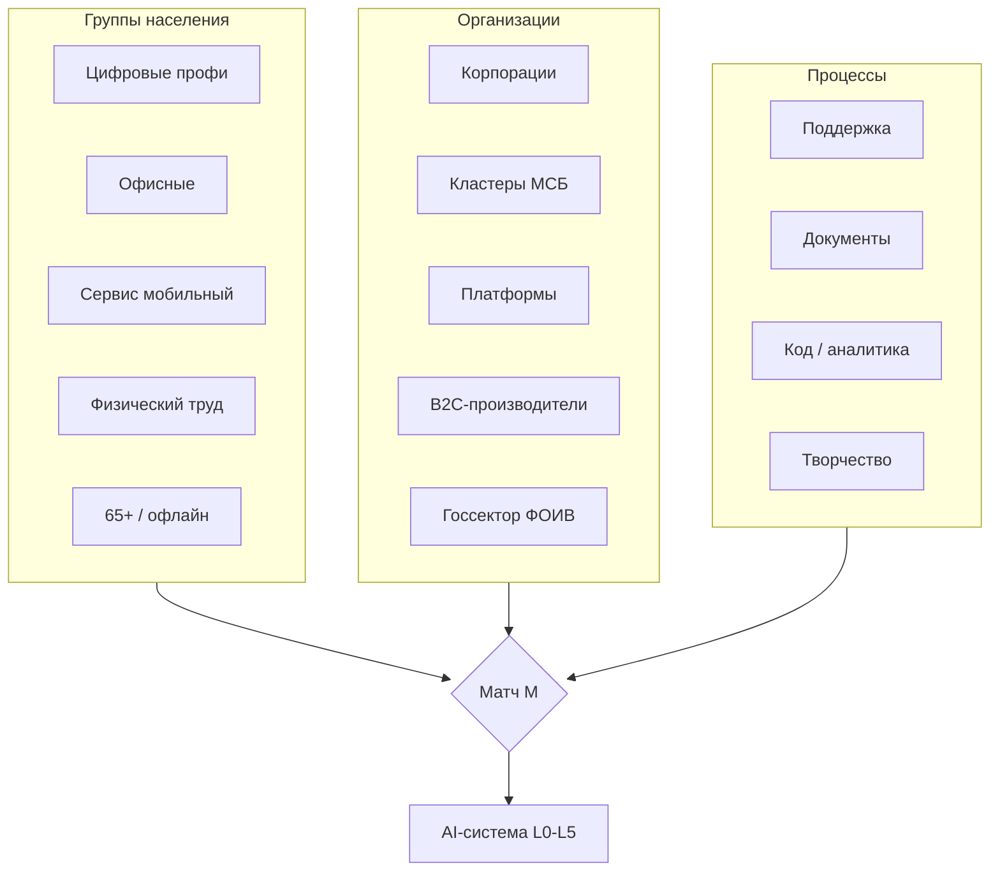

### 4.2. Матч: группа населения → потребность

| Группа | ~млн | Главная боль | Процесс | Уровень | Система |
|--------|------|--------------|---------|---------|---------|
| Цифровые профи | 3–5 | Скорость разработки | Код, ревью, DevOps | L3–L4 | Cursor, Codex, Claude Code |
| Офисные | 15–20 | Рутина в документах | Письма, отчёты, сводки | L1–L2 | ChatGPT, GigaChat, YandexGPT |
| Мобильный сервис | 25–35 | Запись, лиды, общение | CRM, чаты с клиентами | L1–L2 | Встроенные боты, Telegram + n8n |
| Физический труд | 20–25 | Не видят ИИ напрямую | Через ERP начальника | L0–L1 | 1С, SAP, дашборды |
| 65+ / мало digital | 10–15 | Доступ к услугам | Голос, простые вопросы | L1 | Голосовые ассистенты, Госуслуги |
| Студенты | ~8–10 | Учёба | Тьютор, проверка | L1–L2 | ChatGPT, специализированные |
| Безработные | 1,7 | Поиск работы | Резюме, собеседование | L1 | hh.ru + LLM, карьерные боты |

### 4.3. Матч: тип компании → процесс → ИИ

| Тип | Примеры | Топ-3 процесса | Уровень | Инструмент |
|-----|---------|----------------|---------|------------|
| **Нефтегаз / энерго** | Газпром, Роснефть | Предиктив, документы, HSE | L0–L2 | Свои MLOps + L1 для текстов |
| **Банк** | Сбер, ВТБ, Альфа | Поддержка, скоринг, комплаенс | L0–L2 | GigaChat, внутренние LLM |
| **Ритейл сеть** | X5, Магнит, Лента | Спрос, цены, HR | L0–L2 | Внутр. ML + L1 отчёты |
| **ИТ-платформа** | Яндекс, VK, Ozon | Модерация, рекомендации, код | L0–L4 | Свои модели + coding agents |
| **Кластер: кофейня** | 5–15 сотрудников | Закупки, отзывы, график | L1–L2 | ChatGPT + Google Sheets / n8n |
| **Кластер: салон** | 3–8 мастеров | Запись, Instagram, CRM | L1–L2 | YClients + LLM для контента |
| **Кластер: ИП-ремонт** | 1–3 человека | Сметы, лиды | L1–L2 | Profi.ru + LLM-сметы |
| **Платформа: курьер** | Яндекс Еда | Маршрут, слот | L0 | Алгоритмы платформы (не GenAI) |
| **B2C-производитель** | Черкизово, ПИК | Спрос, реклама, качество | L0–L2 | ML + L1 креатив |
| **Госсектор** | МФЦ, Почта, ФОИВ | Очередь, типовые ответы | L1–L2 | [см. §2.6](#26-госсектор-структура-связи-и-потенциал-ии): ЕПГУ, ФНС, ЕМИАС |

### 4.4. Сводная матрица «отрасль занятости → ИИ»

| Отрасль (~млн занятых) | Кто покупает ИИ | Зрелый уровень сегодня | Потолок 3–5 лет |
|------------------------|-----------------|------------------------|-----------------|
| Торговля (~14) | Сети, маркетплейсы | L2 | L3 для back-office |
| Производство (~11) | Крупные заводы | L0–L1 | L2 для документов |
| АПК (~7) | Агрохолдинги | L0–L1 | L1 спутник + LLM отчёты |
| Строительство (~7) | Девелоперы, генподряд | L1 | L2–L3 проектная документация |
| Образование (~5,6) | Вузы, EdTech | L1 | L2 тьюторы с FSM |
| Транспорт (~6) | РЖД, агрегаторы | L0 | L1 для клиентского сервиса |
| Здравоохранение (~4,7) | Сети клиник, гос. | L1 | L2 при регуляторике |
| Госсектор (~3,7) | ФОИВ, регионы, [§2.6](/vairl/blog/2026/07/02/who-needs-ai-russia-ru/#26-госсектор-структура-связи-и-потенциал-ии) | L1–L2 | L2–L3 в закрытых контурах |
| ИТ (~1,6) | Все | L3–L4 | L4–L5 в R&D |
| Общепит (~2,1) | Сети; единицы — нет | L1 у сетей | L2 для кластера |
| Финансы (~1,4) | Банки, страховые | L2 | L3 под комплаенс |

---

## Заключение: какие AI-системы кому подходят

### Пять классов AI-систем

| Класс | Примеры | Уровень | Устойчивость | Творчество | Кому в России |
|-------|---------|---------|--------------|------------|---------------|
| **Чат-боты (L1)** | ChatGPT, Claude.ai, GigaChat, YandexGPT | L1 | ★★★★ (при temp=0) | ★★★ | **~20–30 млн** офисных и мобильных |
| **NoCode + LLM (L2)** | n8n, Make, Zapier, SberCloud workflows | L2 | ★★★★ | ★★ | **~2–3 млн** МСБ с цифрой |
| **Консольные / coding-агенты (L3)** | Cursor, Codex CLI, Claude Code, Aider | L3 | ★★★ | ★★★★ | **~1–2 млн** разработчиков и аналитиков |
| **Автономные агенты (L4)** | OpenClaw, Devin-подобные, heartbeat-боты | L4 | ★★ | ★★★★ | **~50–100 тыс.** early adopters, IT-отделы |
| **Полная автономия (L5)** | CoffeeBench, эксперименты «AI CEO» | L5 | ★ | ★★★★★ | **Лаборатории**, не массовый рынок |

> **OpenClaw** (в разговорной речи иногда путают с «OpenCloud») — репрезентант **L4**: проактивный агент с доступом к файлам, мессенджерам и расписанию. Для кофейни на одной кассе это избыточно; для **фрилансера или IT-лида** с кучей каналов — осмысленный эксперимент.

### Оси: устойчивость vs творческая свобода

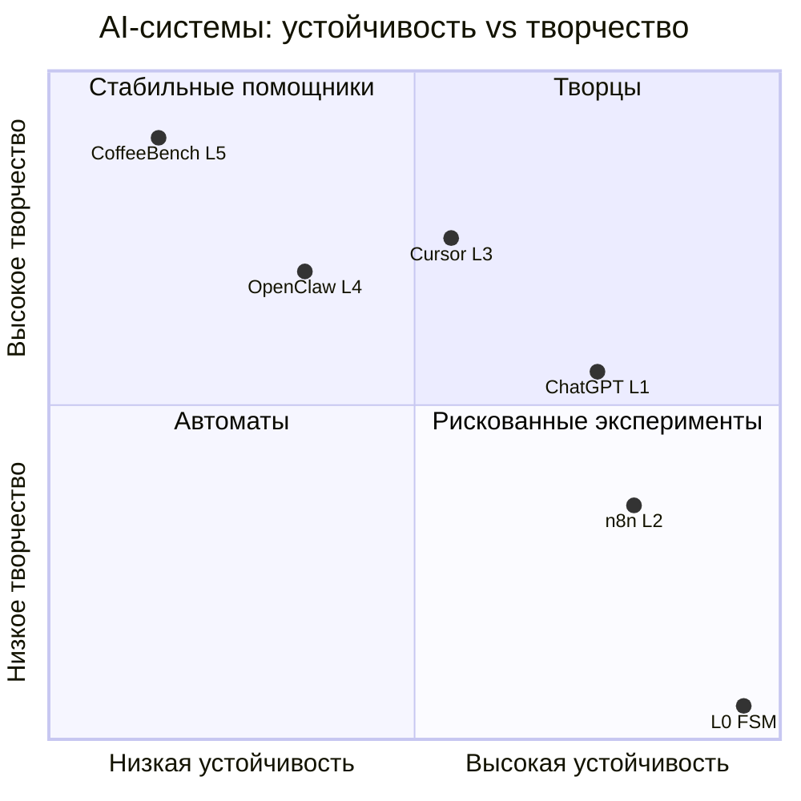

### Итоговый матч «система → аудитория в России»

| AI-система | Оценка аудитории | Реалистичный сценарий | Ограничение |
|------------|------------------|----------------------|-------------|
| **ChatGPT / GigaChat / YandexGPT** | **20–40 млн** попробовали; **5–10 млн** регулярно | Черновики, учёба, поддержка | Галлюцинации, 152-ФЗ |
| **Корпоративный чат-бот** | **~5 млн** сотрудников крупных компаний | Типовые HR/IT вопросы | Интеграция с LDAP, 1С |
| **n8n / Make** | **~500 тыс.–1 млн** активных | Автоматизация без кода | Нужен «цифровой диспетчер» |
| **Cursor / Codex / Claude Code** | **~500 тыс.–1 млн** | Ускорение разработки | Лицензии, безопасность кода |
| **OpenClaw и L4-агенты** | **~10–50 тыс.** продакшен | Дайджесты, мониторинг | Непредсказуемость, безопасность |
| **L5 автономия бизнеса** | **<1000** экспериментов | R&D, бенчмарки | Не для МСБ в 2026 |

### Главные выводы

1. **146 млн населения** — не рынок ИИ. Реалистичная «активная» аудитория GenAI: **15–25 млн** человек (офис, ИТ, студенты, самозанятые с смартфоном).

2. **74,6 млн занятых** — спрос идёт **через работодателя**. Крупные компании (~35–44 млн мест) покупают корпоративно; **~30 млн в МСБ** — только если ROI очевиден за недели.

3. **Кластеры** (кофейни, салоны, ремонт) требуют **отраслевых пакетов L1–L2**, а не «универсального агента».

4. **Платформы** (2–5 млн исполнителей) уже автоматизированы на **L0**; GenAI им нужен для **поддержки и контента**, не для маршрутов.

5. **Производители B2C** делятся: ML для спроса (**L0**) зрел; LLM для маркетинга (**L1–L2**) — пилоты.

6. **Госсектор** ([§2.6](#26-госсектор-структура-связи-и-потенциал-ии)): **21 министерство** и десятки ведомств по [Указу № 326](http://www.kremlin.ru/acts/bank/50541); массовый контакт — **Госуслуги, МФЦ, ФНС**; max ROI GenAI — **маршрутизация и FAQ** (L1–L2), не принятие решений.

7. **Матч по уровням:** массовый рынок сегодня — **L1–L2**; **L3** — ИТ и финтех; **L4–L5** — эксперименты. Устойчивость падает с ростом творческой свободы — **L0 остаётся обязательным каркасом**.

---

## Источники и оговорки

| Данные | Источник | Дата |
|--------|----------|------|
| Население 146,12 млн | [Росстат](https://rosstat.gov.ru) | 01.01.2025 |
| Занятые 74,6 млн, безработица 2,2% | Росстат, обследование рабочей силы | I кв. 2026 |
| Структура занятости по ОКВЭД | Росстат, «Труд и занятость» | 2023 (+ экстраполяция) |
| Интернет 90–92%, навыки 11% | [ИСИЭЗ НИУ ВШЭ](https://issek.hse.ru) | 2024–2025 |
| Самозанятые 15 млн | ФНС | 2025 |
| РБК 500 | [РБК](https://pro.rbc.ru/rbc500) | 2024 |
| Структура ФОИВ | [Указ Президента № 326](http://www.kremlin.ru/acts/bank/50541) | 11.05.2024 |
| Уровни L0–L5 | [ИИ для МСБ](/vairl/blog/2026/07/02/ai-automation-smb-ru/) | 2026 |

Все оценки по кластерам МСБ и платформам — **порядок величины** на основе открытых отраслевых обзоров; для бизнес-плана нужна верификация по конкретному сегменту.

---

*Связанные материалы: [ИИ для МСБ](/vairl/blog/2026/07/02/ai-automation-smb-ru/), [фундамент агентных систем](/vairl/blog/2026/07/02/agent-fundamentals-rag-mcp-landscape-ru/), [типы задач и системы](/vairl/blog/2026/07/02/systems-theory-task-types-ru/), [телеметрия агентов](/vairl/blog/2026/06/29/agent-telemetry-ru/).*
