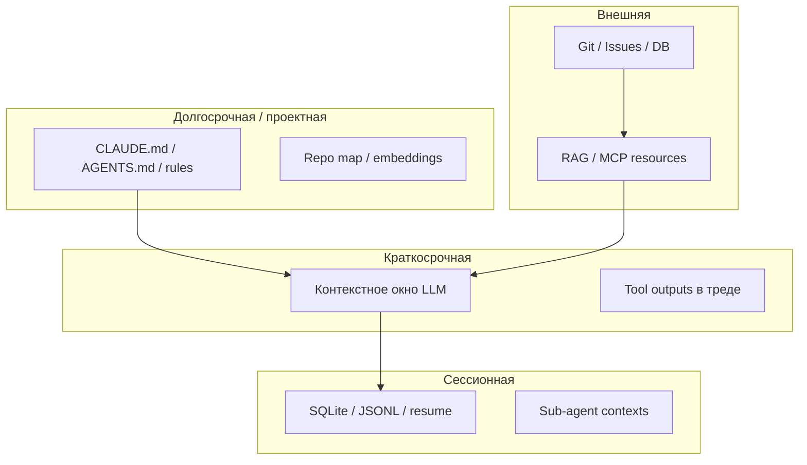

Когда базовые слои — [RAG, контекст, skills и MCP](/vairl/blog/2026/07/02/agent-fundamentals-rag-mcp-landscape-ru/) — уже понятны, следующий вопрос инженера: **какой агент взять под задачу** и **как он не «забывает»** на длинной сессии.

Ниже — обзор актуальных агентных программ 2026 года: Pi, Aider, Codex, OpenCode, py-code-agent, Hermes, IDAD, ChatGPT Agent, Claude Code и **g3**. Для каждого — архитектура, TUI и **отдельный блок про управление памятью**. В конце — сводные таблицы и практический выбор.

Связанные материалы: [фундамент агентных систем](/vairl/blog/2026/07/02/agent-fundamentals-rag-mcp-landscape-ru/), [g3 и диалектическое автокодирование](/vairl/blog/2026/06/25/g3-dialectical-autocoding-ru/), [RAG для агентов](/vairl/blog/2026/07/03/agent-rag-approaches-ru/), [телеметрия](/vairl/blog/2026/06/29/agent-telemetry-ru/), [форматы траекторий](/vairl/blog/2026/07/02/agent-trajectory-formats-ru/).

---

## Карта статьи

| Раздел | О чём |
|--------|--------|
| [Слои памяти](#слои-памяти-у-агента) | Контекст, сессия, проект, RAG |
| [Обзор агентов](#обзор-актуальных-агентных-программ) | Pi, Aider, Codex… с блоком **Память** |
| [TUI](#сравнение-tui-терминальных-интерфейсов) | Full-screen vs scrollback |
| [Таблицы](#сравнительная-таблица-агентов) | Функции и **память** |
| [g3](#как-g3-считать-агентом) | Adversarial + fresh instance |
| [Выбор](#как-выбрать-агента-практически) | По задаче |

---

## Слои памяти у агента

Перед разбором конкретных продуктов — общая схема. «Память агента» почти никогда не одна сущность:

| Слой | Что хранит | Типичные механизмы |
|------|------------|-------------------|
| **Контекст** | Всё, что модель видит *сейчас* | Окно N токенов; eviction старых сообщений |
| **Сессия** | История между перезапусками CLI | `resume`, SQLite, server-side session |
| **Проектная** | Правила и факты о репозитории | `CLAUDE.md`, repo map, skills |
| **Внешняя** | Корпус больше окна | RAG, MCP, git blame, issue tracker |

**Compaction** — сжатие старой истории в summary внутри сессии. **Thinning** — замена тяжёлых tool outputs ссылками на файлы. **Fresh instance** — новый агент на ход без накопленного мусора (g3).

---

## Обзор актуальных агентных программ

> **Примечание:** «агент Idar» из ранних черновиков — это **IDAD** ([idad.io](https://idad.io/)).

---

### Pi coding agent (pi-mono)

| | |
|---|---|
| **Тип** | Open-source минималистичный coding agent |
| **Репозиторий** | [badlogic/pi-mono](https://github.com/badlogic/pi-mono) |
| **Стек** | TypeScript: `pi-ai` → `pi-agent-core` → `pi-tui` → `pi-coding-agent` |
| **Архитектура** | Event-driven agent loop, tools: `read` / `write` / `edit` / `bash` |
| **Особенности** | Skills, extensions, prompt templates, sub-agents, multi-provider |

**Принцип:** прозрачный tool-use loop без лишних слоёв. CLI: интерактивный TUI, `--json`, RPC/JSONL для встраивания.

#### Память

| Аспект | Как устроено |
|--------|--------------|
| **Контекст** | Полная история сообщений + tool results в текущей сессии; рост линейный с числом ходов |
| **Сессии** | Сохранение сессий на диск — можно продолжить позже; формат привязан к pi-coding-agent |
| **Sub-agents** | Отдельный контекст у дочернего агента; в родителя возвращается только итог — **изоляция памяти** |
| **Долгосрочная** | Нет встроенного vector store; через **extensions** (RAG, custom memory) |
| **Compaction** | Нет тяжёлого встроенного summarization — инженер явно проектирует длину сессии или режет вручную |
| **Проектная** | Prompt templates, skills подгружаются по задаче — процедурная «память» в файлах |

**Вывод:** Pi даёт **минимальный контроль**: память = сессионный лог + опциональные extensions. Подходит, если вы сами строите compaction/RAG поверх `pi-agent-core`.

---

### Aider

| | |
|---|---|
| **Тип** | Open-source **pair programmer** (Python) |
| **Репозиторий** | [Aider-AI/aider](https://github.com/Aider-AI/aider) |
| **Контекст** | **Repo map** — граф символов + PageRank |
| **Edit formats** | whole / diff / udiff под возможности модели |

**Принцип:** быстрый цикл чат → diff → commit. Scrollback-чат (`prompt_toolkit` + Rich).

#### Память

| Аспект | Как устроено |
|--------|--------------|
| **Контекст** | История чата + **repo map** (умный отбор файлов/символов, не весь репозиторий) |
| **Repo map** | Пересчитывается при изменении кодовой базы — это **retrieval вместо полной памяти** |
| **Сессия** | In-memory чат; `/clear` сбрасывает историю; опционально `.aider.chat.history.md` |
| **Файлы в контексте** | `/add` явно добавляет файлы — пользователь управляет, что «помнит» агент |
| **Compaction** | Нет lineage-compression как у Hermes; при переполнении — обрезка истории или смена модели с большим окном |
| **Git** | Auto-commit фиксирует **внешнюю память** в истории репозитория |

**Вывод:** сильная **проектная память через repo map**, слабая автоматическая compaction длинных сессий. Память = чат + карта кода + git.

---

### OpenAI Codex (CLI)

| | |
|---|---|
| **Тип** | Terminal coding agent (Rust), open source |
| **Репозиторий** | [openai/codex](https://github.com/openai/codex) |
| **Особенности** | Sandbox, MCP, sub-agents, web search, Codex Cloud |

**Принцип:** terminal-native агент; `codex resume` для продолжения сессии.

#### Память

| Аспект | Как устроено |
|--------|--------------|
| **Контекст** | Тред сообщений + tool narration в TUI |
| **Сессии** | **`codex resume`** — персистентные сессии на диске; продолжение после закрытия терминала |
| **Compaction** | Внутреннее сжатие контекста на длинных задачах (детали в release notes; не user-facing API как `/compact`) |
| **Sub-agents** | Делегирование с изолированным контекстом; родитель получает summary |
| **Внешняя** | Web search, MCP — подтягивание фактов вне окна |
| **Cloud** | Codex Cloud tasks — отдельное хранилище состояния облачной задачи |

**Вывод:** упор на **resume + implicit compaction**; для enterprise — связка с OpenAI storage в облачных задачах.

---

### OpenCode

| | |
|---|---|
| **Тип** | Open-source coding agent (MIT), [opencode.ai](https://opencode.ai) |
| **Архитектура** | **Client/server**: SQLite + SSE; TUI/Desktop/IDE — клиенты |
| **Агенты** | `build`, `plan` (read-only), `explore` (sub-agent) |

**Принцип:** декларативные роли; сессия **переживает** обрыв терминала.

#### Память

| Аспект | Как устроено |
|--------|--------------|
| **Сервер** | **SQLite** хранит сессии, сообщения, метаданные — центральная сессионная память |
| **Контекст** | `SessionPrompt.loop()` собирает промпт из persisted messages |
| **Compaction** | Встроенный **context compaction** при приближении к лимиту |
| **Sub-agents** | `explore` / `@general` — отдельный проход с урезанным tool set; итог merge в родителя |
| **Роли** | `plan` не видит write-tools — меньше «мусора» от опасных действий в памяти |
| **Doom-loop detection** | Косвенно защищает память от зацикленных одинаковых tool calls |

**Вывод:** один из самых явных **persistent server + compaction** стеков среди open-source CLI.

---

### py-code-agent (Agent Py)

| | |
|---|---|
| **Тип** | Open-source CLI (Python), [bonashen/py-code-agent](https://github.com/bonashen/py-code-agent) |
| **Особенности** | MCP gateway, A2A, **session tree (fork/branch)**, pluggy plugins |

#### Память

| Аспект | Как устроено |
|--------|--------------|
| **Контекст** | ReAct-тред `Thought → Action → Observation` |
| **Session tree** | **Fork/branch** сессий — ветвление альтернативных траекторий без потери родителя |
| **Плагины** | Hooks для custom memory backends через pluggy |
| **MCP** | Gateway к внешним resources — долгосрочная память через MCP-серверы |
| **Compaction** | Зависит от плагина; из коробки — ограничение истории |
| **Skills** | `SKILL.md` (совместимость с Claude Code) — файловая процедурная память |

**Вывод:** уникален **деревом сессий** для экспериментов «а что если другой путь?».

---

### Hermes Agent

| | |
|---|---|
| **Тип** | Personal agent (Nous Research), не только код |
| **Интерфейсы** | CLI, gateway (Telegram, Discord, Slack…), cron |
| **Особенности** | 70+ tools, **lineage-based compression**, profiles, `delegate_task` |

#### Память

| Аспект | Как устроено |
|--------|--------------|
| **Сессии** | **SQLite** — долгоживущие разговоры на сервере |
| **Lineage compression** | Ключевая фича: старые ходы сжимаются с сохранением **происхождения** (lineage), не один blob-summary |
| **Profiles** | Профили пользователя — долгосрочные предпочтения и факты между сессиями |
| **delegate_task** | Sub-agent с чистым контекстом для подзадачи |
| **Gateway** | Один агент помнит контекст **между каналами** (Telegram ↔ CLI), если сессия общая |
| **Background tasks** | Фоновые задачи пишут артефакты — внешняя память результатов |

**Вывод:** лучший в классе **personal long-running memory** среди open-source (compression + profiles + SQLite).

---

### IDAD (Issue Driven Agentic Development)

| | |
|---|---|
| **Тип** | GitHub-native multi-agent pipeline, [idad.io](https://idad.io/) |
| **Движок** | Claude Code, Cursor или Codex |
| **Поток** | Issue → Review → Planner → Implementer → … → PR |

#### Память

| Аспект | Как устроено |
|--------|--------------|
| **Контекст агента** | Каждый шаг pipeline — **свежий запуск** CLI-агента с узким промптом |
| **Память workflow** | **GitHub Issue + комментарии + PR diff** — source of truth, не контекст LLM |
| **План** | Утверждённый план хранится в issue — human gate фиксирует память организации |
| **Межагентная** | Агенты не делят один длинный тред; handoff через **артефакты в git** |
| **Долгосрочная** | Self-improve агент обновляет playbooks репозитория после merge |

**Вывод:** память = **VCS + issue tracker**, не окно модели. Подходит для команд, где audit trail важнее «одного длинного чата».

---

### ChatGPT Agent (Agent Mode)

| | |
|---|---|
| **Тип** | Облачный consumer/enterprise agent |
| **Архитектура** | Виртуальный компьютер: browser + terminal + connectors |

#### Память

| Аспект | Как устроено |
|--------|--------------|
| **Контекст** | Одна **нить диалога** в облаке; пользователь видит narration шагов |
| **Сессия** | Привязана к аккаунту ChatGPT; история чатов в продукте |
| **Connectors** | Gmail, Drive, GitHub — **live fetch**, не полагаются на устаревший контекст |
| **Прерывание** | Takeover браузера — пользователь правит «память среды» вручную |
| **Проектная** | Ограничена; нет `CLAUDE.md`-уровня в репозитории |
| **Подтверждения** | Sensitive actions требуют approve — снижает риск «забыли, что уже отправили» |

**Вывод:** память **облачная и opaque**; сильна интеграция с SaaS, слаба локальная проектная память для кода.

---

### Claude Code (Cloud Code)

| | |
|---|---|
| **Тип** | Terminal + IDE agent (Anthropic) |
| **Расширения** | `CLAUDE.md`, Skills, Hooks, Subagents, MCP |

#### Память

| Аспект | Как устроено |
|--------|--------------|
| **Контекст** | Scrollback REPL + streaming tool results |
| **Проектная** | **`CLAUDE.md`** (и иерархия в подпапках) — автоподгрузка правил репозитория в каждый запуск |
| **Compaction** | **`/compact`** — явное сжатие истории сессии по команде пользователя |
| **Resume** | Продолжение сессии; checkpoint-подобное поведение между вызовами |
| **Subagents** | Изолированный контекст; родитель видит финальный отчёт |
| **Hooks** | `PreCompact`, session events — кастомная логика перед eviction |
| **MCP** | Resources как внешняя память (docs, tickets, DB read-only) |

**Вывод:** лучший баланс **файловой проектной памяти** (`CLAUDE.md`) и **управляемой compaction** для coding.

---

### g3 (диалектический агент)

| | |
|---|---|
| **Тип** | Coding agent, [dhanji/g3](https://github.com/dhanji/g3) |
| **Архитектура** | **Player** (код) + **Coach** (ревью), adversarial loop |

См. [статью VAIRL про g3](/vairl/blog/2026/06/25/g3-dialectical-autocoding-ru/).

#### Память

| Аспект | Как устроено |
|--------|--------------|
| **Fresh instance** | **Новый инстанс агента на каждый ход** — радикальная защита от context rot |
| **Контракт** | Общий **`requirements.md`** — внешняя память целей, видимая обоим ролям |
| **Thinning** | Большие tool outputs заменяются ссылками на файлы — **context thinning** |
| **Coach / Player** | Не делят один бесконечно растущий тред; Coach получает срез состояния + требования |
| **Compaction** | `/compact`, `/stats`, `/thinnify` — явные команды управления буфером |
| **Skills** | `.g3/skills/` — процедурная память |
| **Git** | Состояние кода в репозитории — истина сильнее контекста LLM |

**Вывод:** g3 жертвует «одним длинным чатом» ради **adversarial проверки**; память вынесена в файлы, git и requirements.

---

## Сравнение TUI: терминальные интерфейсы

| Семейство | Как выглядит | Примеры |
|-----------|--------------|---------|
| **Full-screen TUI** | Панели, overlays, differential render | **Pi**, **Codex**, **OpenCode** |
| **Scrollback chat** | Лента сообщений | **Aider**, **Claude Code**, py-code-agent, **g3** |
| **Не-TUI** | Web, IDE, GitHub | ChatGPT Agent, IDAD |

### Детальное сравнение TUI

| Агент | Тип UI | Технология | Сильные стороны | Ограничения |
|-------|--------|------------|-----------------|-------------|
| **Pi** | Full-screen | `pi-tui`, CSI 2026 | Без мерцания на SSH; IME/CJK | Нужен современный терминал |
| **Aider** | Scrollback | prompt_toolkit + Rich | Привычный чат; `/commands` | Нет diff-панелей в TUI |
| **Codex** | Full-screen | Rust TUI | Sandbox + approvals в одном экране | Экосистема OpenAI |
| **OpenCode** | Full-screen | TUI + **фоновый сервер** | Сессия живёт после закрытия терминала | Нужен server process |
| **Claude Code** | Scrollback | Custom REPL | Hooks/skills/MCP | Не fullscreen |
| **g3** | Scrollback | Rust CLI | Прозрачность coach/player | Нет pi-tui-уровня UI |

### Когда какой TUI удобнее

| Сценарий | Лучше подходит |
|----------|----------------|
| Долгая сессия по SSH | **OpenCode** (persistent server) или **Pi** |
| Быстрые правки, pair programming | **Aider** |
| OpenAI + sandbox + `codex exec` | **Codex** |
| Enterprise governance, hooks | **Claude Code** |

---

## Сравнительная таблица агентов

### Terminal-first

| Критерий | **Pi** | **Aider** | **Codex** | **OpenCode** | Claude Code | **g3** |
|----------|:------:|:---------:|:---------:|:------------:|:-----------:|:------:|
| Open source | ✅ | ✅ | ✅ | ✅ | ❌ | ✅ |
| TUI | Full-screen | Scrollback | Full-screen | Full-screen | Scrollback | Scrollback |
| **Persistent session** | ✅ файлы | — | ✅ resume | ✅ **server** | ✅ resume | per-turn |
| **Compaction** | — | обрезка | internal | ✅ built-in | ✅ `/compact` | ✅ thinning |
| **Project memory** | skills | **repo map** | MCP | AGENTS.md | **CLAUDE.md** | requirements.md |
| **Sub-agent isolation** | ✅ | — | ✅ | explore | ✅ | Coach/Player |
| MCP | ext | — | ✅ | ✅ | ✅ | partial |
| Уникальность | Минимальный stack | Repo map | OpenAI sandbox | SQLite server | Hooks | Adversarial |

### Расширенный ландшафт

| Критерий | py-code-agent | Hermes | IDAD | ChatGPT Agent |
|----------|:-------------:|:------:|:----:|:-------------:|
| **Память** | session tree | **lineage + SQLite** | GitHub artifacts | cloud thread |
| Фокус | Код | Personal | GitHub workflow | Универсальные задачи |
| MCP | Gateway | ✅ | Через CLI | Connectors |

---

## Сводная таблица: управление памятью

| Агент | Контекст (краткосрочная) | Сессия (средняя) | Проектная / долгая | Внешняя | Главный приём |
|-------|--------------------------|------------------|--------------------|---------|---------------|
| **Pi** | полный тред | save/resume | skills, templates | extensions | Минимализм + sub-agents |
| **Aider** | чат + repo map | `/clear`, history file | **PageRank map** | git commits | Repo map вместо full dump |
| **Codex** | TUI thread | **resume** | MCP, search | cloud tasks | Resume + implicit compact |
| **OpenCode** | server-backed | **SQLite** | AGENTS.md | LSP, MCP | Server persistence + compact |
| **py-code-agent** | ReAct log | **fork/branch tree** | SKILL.md | MCP gateway | Ветвление сессий |
| **Hermes** | gateway thread | **SQLite** | **profiles** | 70+ tools | **Lineage compression** |
| **IDAD** | узкий промпт на шаг | — | issue + PR | GitHub | Память в VCS |
| **ChatGPT Agent** | cloud dialog | account history | weak | connectors | Live fetch из SaaS |
| **Claude Code** | REPL | resume | **CLAUDE.md** | MCP resources | `/compact` + hooks |
| **g3** | **fresh instance/ход** | requirements.md | skills, git | tree-sitter | Thinning + adversarial |

---

## Перечень функций (детально)

| Функция | Pi | Aider | Codex | OpenCode | py-code-agent | Hermes | Claude Code | g3 |
|---------|:--:|:-----:|:-----:|:--------:|:-------------:|:------:|:-----------:|:--:|
| Full-screen TUI | ✅ | — | ✅ | ✅ | — | partial | — | — |
| Scrollback REPL | — | ✅ | — | — | ✅ | ✅ | ✅ | ✅ |
| Persistent session | ✅ | — | resume | **server** | tree | SQLite | resume | per-turn |
| Auto compaction | — | — | ~ | ✅ | plugins | **lineage** | ✅ | thinning |
| Project rules file | ext | — | — | AGENTS | — | profiles | **CLAUDE** | req.md |
| Sub-agent изоляция | ✅ | — | ✅ | explore | fork | delegate | ✅ | Coach |
| Git as memory | — | ✅ | ✅ | ✅ | ✅ | ✅ | ✅ | ✅ |

---

## Как g3 считать агентом

| Обычный single-agent | g3 |
|---------------------|-----|
| Один LLM + tools в длинном треде | **Player** + **Coach** |
| Self-report «готово» | Coach **независимо** проверяет |
| Контекст накапливается | **Свежий инстанс** + thinning |
| Ревью в конце | Adversarial **на каждом шаге** |

**Память g3** — антипаттерн «бесконечного чата»: состояние в **файлах и git**, не в весах контекста.

---

## Как выбрать агента (практически)

| Задача | Разумный выбор |
|--------|----------------|
| Pair programming, **repo map** | **Aider** |
| **Persistent server**, compaction | **OpenCode** |
| **`CLAUDE.md` + /compact** | **Claude Code** |
| **Lineage compression**, 24/7 бот | **Hermes** |
| **`codex resume`**, OpenAI sandbox | **Codex** |
| Минимальный hackable runtime | **Pi** |
| **Session tree**, плагины | py-code-agent |
| Issue → PR, память в git | **IDAD** |
| Adversarial + **anti context-rot** | **g3** |
| Web, нетехнический пользователь | ChatGPT Agent |

---

## Резюме

1. Память агента — **четыре слоя**: контекст, сессия, проект, внешнее (RAG/MCP/git).
2. **OpenCode** и **Hermes** сильнее всего в автоматической **персистентности + compression**.
3. **Aider** и **Claude Code** — в **проектной памяти** (repo map vs CLAUDE.md).
4. **g3** и **IDAD** сознательно **не копят** длинный тред — память в артефактах.
5. Базовые понятия RAG/MCP/skills — в [отдельной статье-фундаменте](/vairl/blog/2026/07/02/agent-fundamentals-rag-mcp-landscape-ru/).

---

## Источники

- [Pi mono](https://github.com/badlogic/pi-mono) · [Aider](https://aider.chat/) · [Codex CLI](https://developers.openai.com/codex/cli)
- [OpenCode](https://opencode.ai) · [Hermes architecture](https://hermes-agent.nousresearch.com/docs/developer-guide/architecture)
- [py-code-agent](https://github.com/bonashen/py-code-agent) · [IDAD](https://idad.io/)
- [Claude Code docs](https://code.claude.com/docs) · [g3 — VAIRL](/vairl/blog/2026/06/25/g3-dialectical-autocoding-ru/)
- [Фундамент: RAG, MCP, skills](/vairl/blog/2026/07/02/agent-fundamentals-rag-mcp-landscape-ru/) · [RAG для агентов](/vairl/blog/2026/07/03/agent-rag-approaches-ru/)
