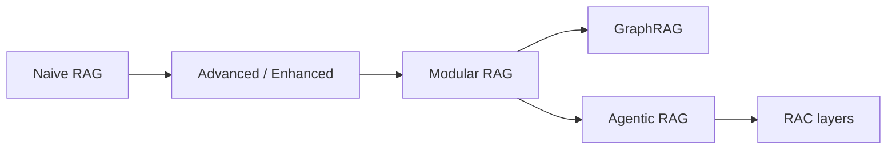
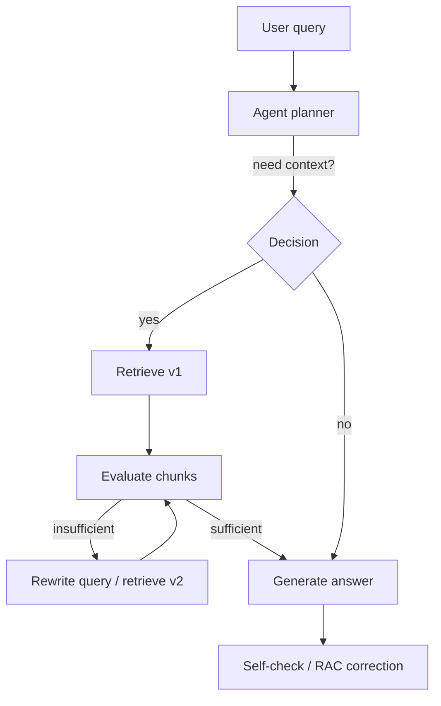
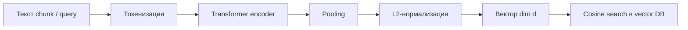
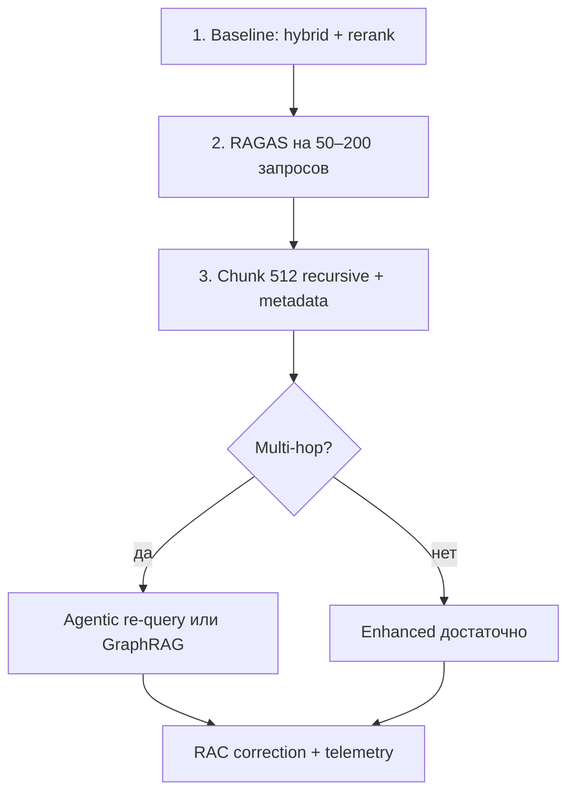

Для агента RAG — не «дополнительная фича», а **инструмент в цикле plan → act → observe**. Coding-агент ищет по репозиторию, support-бот — по базе знаний, research-агент — по корпусу статей. Разница между демо и продакшеном почти всегда в **retrieval engineering**: что индексировать, как резать документы, какие БД и ранжировщики использовать, когда повторять поиск, а когда признать, что ответа в корпусе нет.

В 2026 году ландшафт устоялся в три слоя: **статические пайплайны** (naive / enhanced RAG), **структурированное знание** (GraphRAG, иерархические индексы) и **агентное управление retrieval** (agentic RAG, corrective / self-reflective схемы). Параллельно появились узкие расширения **RAC** — Retrieval-Augmented Clarification и Retrieval-Augmented Correction — которые решают не «найти и ответить», а **уточнить запрос** или **проверить факты** после генерации.

Ниже — карта подходов, что даёт наибольший прирост метрик, нюансы векторных хранилищ, оптимизации поиска, влияние размера чанков и готовые SOTA-стеки. Связанные материалы VAIRL: [фундамент RAG и MCP](/vairl/blog/2026/07/02/agent-fundamentals-rag-mcp-landscape-ru/), [semantic torrent и P2P-поиск](/vairl/blog/2026/07/01/semantic-torrent-vector-search-ru/), [метакогниция и grounding_score](/vairl/blog/2026/07/02/agent-metacognition-phase-space-ru/), [генерация бенчмарков (component-level RAG recall)](/vairl/blog/2026/06/29/agent-benchmark-generation-ru/), [телеметрия и vector search](/vairl/blog/2026/06/29/agent-telemetry-ru/).

---

## Карта статьи

| Раздел | О чём |
|--------|--------|
| [Эволюция RAG](#эволюция-rag-от-naive-к-agentic) | Naive → Enhanced → Modular → Graph → Agentic |
| [RAC](#rac-два-разных-смысла-одной-аббревиатуры) | Clarification и Correction |
| [Agentic RAG](#agentic-rag-когда-и-зачем) | Итеративный поиск, tool use, trade-offs |
| [Базы знаний](#базы-знаний-векторные-и-гибридные) | Vector DB, когда GraphRAG оправдан |
| [Эмбеддинг текстов](#эмбеддинг-текстов-как-работает-процесс-и-модели) | Пошаговый pipeline, bi-encoder, open-source модели |
| [Оптимизации retrieval](#оптимизации-retrieval-что-даёт-наибольший-прирост) | Hybrid, rerank, HyDE, contextual chunking |
| [Размер чанков](#размер-чанков-и-стратегии-нарезки) | 256–1024 токенов, multi-scale, QASC |
| [Интерактив](#интерактив-пайплайн-retrieval-и-размер-чанков) | Демо naive / enhanced / agentic |
| [Метрики и бенчмарки](#метрики-и-бенчмарки) | RAGAS, RAGSearch, BRIGHT |
| [SOTA-стеки](#sota-решения-и-фреймворки-2026) | LangGraph, LlamaIndex, Cohere, Qdrant и др. |
| [Чеклист для агента](#практический-чеклист-для-агентной-системы) | Что внедрять по порядку |

---

## Эволюция RAG: от naive к agentic



### Naive RAG

Классика: **один запрос → top-K чанков → один вызов LLM**. Индексация — эмбеддинги в векторную БД; retrieval — cosine similarity.

| Плюс | Минус |
|------|-------|
| Простота, низкая латентность | Нет семантики при плохом чанкинге |
| Быстрый MVP | «Правильный, но не тот» чанк → уверенная ошибка |
| Дешёвый runtime | Не работает на multi-hop и уточняющих вопросах |

Подходит для FAQ с короткими ответами и узким доменом. Для агентов — **только как baseline**, не как финальная архитектура.

### Enhanced / Advanced RAG

**Enhanced RAG** (термин из [ACL Industry 2026](https://aclanthology.org/2026.acl-industry.5/)) — пайплайн с **отдельными модулями** под конкретные слабости naive-подхода:

- query rewriting / multi-query expansion;
- hybrid retrieval (dense + BM25);
- cross-encoder reranking;
- compression / filtering чанков перед LLM;
- metadata filters (ACL, дата, tenant).

Это **де-факто production default** 2025–2026: по обзорам, гибридный поиск + rerank даёт наибольший прирост **до** перехода к агентным циклам ([Atlan Advanced RAG](https://atlan.com/know/advanced-rag-techniques/), [1337skills Production RAG 2026](https://1337skills.com/blog/2026-06-12-production-rag-2026-hybrid-search-reranking-graphrag/)).

### Modular RAG

Компоненты retrieval, augmentation и generation **собираются как конструктор**: можно подменить retriever, добавить API-источник, вставить reranker, не трогая генератор. LangChain, LlamaIndex, Haystack — все позиционируются как modular RAG frameworks.

Для агентов modular RAG важен тем, что **retrieval становится tool'ом** с чётким контрактом: `search_docs(query, filters) → chunks[]`.

### GraphRAG

[Microsoft GraphRAG](https://arxiv.org/abs/2404.16130) и родственные системы строят **граф сущностей и связей** поверх корпуса. Retrieval идёт не только по векторной близости, но и по **multi-hop путям** в графе.

| Когда GraphRAG выигрывает | Когда не стоит усложнять |
|---------------------------|--------------------------|
| Multi-hop QA («кто руководил X, когда Y произошло?») | Простые factoid-вопросы |
| Корпус с явными связями (юриспруденция, биомед) | Мало связей, шумный граф |
| Offline-препроцессинг амортизирован | Нужен быстрый cold start |

Свежий бенчмарк [RAGSearch](https://arxiv.org/abs/2604.09666) (2026): **agentic search существенно сужает разрыв** между dense RAG и GraphRAG, особенно в RL-based настройках, но **GraphRAG остаётся стабильнее на сложном multi-hop reasoning**, когда offline-стоимость построения графа уже оплачена.

### Agentic RAG

**Agentic RAG** ([survey, arXiv:2501.09136](https://arxiv.org/html/2501.09136v4)) встраивает **автономных агентов** в retrieval-пайплайн. LLM не пассивно получает чанки, а:

- решает, **нужен ли** retrieval (vs ответ из памяти);
- **декомпозирует** сложный запрос на подзапросы;
- **переформулирует** query после неудачного поиска;
- выбирает **tools** (vector search, SQL, web, MCP);
- **верифицирует** достаточность контекста и итерирует.



Паттерны из agentic design ([NVIDIA blog](https://developer.nvidia.com/blog/traditional-rag-vs-agentic-rag-why-ai-agents-need-dynamic-knowledge-to-get-smarter/)): reflection, planning, tool use, multi-agent collaboration (retriever-agent + writer-agent + verifier-agent).

**Важный вывод из ACL 2026:** agentic RAG **не всегда** лучше enhanced RAG по cost/latency. Выигрывает на multi-step задачах, research, code repair; проигрывает на простых Q&A, где достаточно hybrid + rerank за один проход.

---

## RAC: два разных смысла одной аббревиатуры

В литературе 2025–2026 **RAC** — не опечатка RAG, а два разных расширения:

| Аббревиатура | Полное название | Роль в пайплайне | Типичный прирост |
|--------------|-----------------|------------------|------------------|
| **RAC** | Retrieval-Augmented **Clarification** | Генерация **уточняющих вопросов**, заземлённых в корпусе | Faithfulness clarification ↑ на 4 бенчмарках ([arXiv:2601.11722](https://arxiv.org/abs/2601.11722)) |
| **RAC** | Retrieval-Augmented **Correction** | Post-hoc **верификация атомарных фактов** и правка ответа | До +30% factuality, −40× latency vs тяжёлые post-correction ([EMNLP 2025 Findings](https://doi.org/10.18653/v1/2025.findings-emnlp.1370)) |

### RAC Clarification — для агентов с диалогом

Когда запрос неоднозначен («настрой rate limit» — в API или в nginx?), naive-агент либо угадывает, либо задаёт **незаземлённый** вопрос. RAC Clarification обучает модель задавать вопросы, **опираясь на retrieved passages** (SFT + DPO с контрастными парами grounded / ungrounded).

Для агентной системы это слой **перед** основным retrieval: уточнить intent → потом искать с правильными фильтрами.

### RAC Correction — для faithfulness после генерации

Пайплайн:

1. LLM генерирует черновик (с RAG или без).
2. Декомпозиция на **атомарные утверждения**.
3. Верификация каждого по retrieved evidence.
4. Коррекция только несовпавших фактов.

Работает как **лёгкий verifier** в meta-level контуре ([метакогниция агента](/vairl/blog/2026/07/02/agent-metacognition-phase-space-ru/)): дешевле, чем полный re-generation, и совместим с любым instruction-tuned LLM ([GitHub: Retrieval-Augmented-Correction](https://github.com/jlab-nlp/Retrieval-Augmented-Correction)).

---

## Agentic RAG: когда и зачем

### Архитектурные варианты (taxonomy)

По [Agentic RAG Survey](https://arxiv.org/html/2501.09136v4):

| Тип | Описание | Пример |
|-----|----------|--------|
| **Single-agent RAG** | Один агент управляет retrieve–reflect–generate | LangGraph ReAct + `retriever` tool |
| **Multi-agent RAG** | Retriever, planner, writer, critic — разные роли | CrewAI, MAESTRO-подобные стеки |
| **Router-based** | Классификатор выбирает стратегию retrieval | Adaptive RAG |
| **Graph-agentic** | Агент ходит по GraphRAG + vector fallback | Enterprise knowledge graphs |

### Сравнение с Enhanced RAG (по данным ACL Industry 2026)

| Критерий | Enhanced RAG | Agentic RAG |
|----------|--------------|-------------|
| Латентность | Низкая (1–2 retrieval pass) | Выше (2–N итераций) |
| Стоимость токенов | Предсказуемая | Растёт с числом шагов |
| Multi-hop / research | Средне (нужен multi-query вручную) | Сильно (агент сам декомпозирует) |
| Out-of-scope detection | Слабо без отдельного модуля | Агент может отказать от retrieval |
| Отладка | Линейный пайплайн | Нужна [телеметрия траекторий](/vairl/blog/2026/07/02/agent-trajectory-formats-ru/) |

### Связанные «агентные» RAG-паттерны

| Паттерн | Суть | Когда использовать |
|---------|------|-------------------|
| **Self-RAG** | Модель решает retrieve / не retrieve; критикует релевантность чанков | Когда нужен единый fine-tuned policy |
| **Corrective RAG (CRAG)** | Оценка качества retrieval → web fallback или re-retrieve | Шумный корпус, высокий % irrelevant chunks |
| **Adaptive RAG** | Router: simple / multi-step / no-retrieval | Смешанный трафик запросов |
| **RAPTOR** | Иерархическое дерево summary поверх чанков | Длинные документы, «обзор + детали» |
| **Contextual Retrieval** (Anthropic) | К каждому чанку — LLM-generated context prefix при индексации | +49% fewer failed retrievals (vendor benchmark) |

---

## Базы знаний: векторные и гибридные

### Векторная БД — не «лучшая одна», а fit под нагрузку

| Система | Сильные стороны | Слабые / нюансы | Типичный use-case |
|---------|-----------------|-----------------|-------------------|
| **Qdrant** | Hybrid native, HNSW, фильтры, on-prem | Экосистема меньше managed SaaS | Self-hosted prod, latency-sensitive |
| **Weaviate** | Hybrid BM25+vector, GraphQL, modules | Операционная сложность кластера | Multi-tenant KB |
| **Milvus / Zilliz** | Масштаб до миллиардов векторов | Тяжелее для малых проектов | Большие корпуса |
| **pgvector** | Один стек с Postgres, ACL в SQL | ANN на очень больших N хуже спец. DB | Корпоративные данные уже в PG |
| **Pinecone** | Managed, serverless, быстрый старт | Vendor lock-in, стоимость на scale | MVP → mid-scale SaaS |
| **LanceDB** | Embedded, локально, хорош для агентов на диске | Меньше enterprise-фич | Coding agents, edge |
| **Chroma** | Простота, dev-friendly | Ограничения на hard prod | Прототипы, notebooks |

**Что реально влияет на метрики больше, чем выбор БД:**

1. **Качество эмбеддинга** — одна модель на ingest и query; версия в метаданных индекса.
2. **Hybrid search** — почти все production-системы 2026 хранят dense + sparse (BM25 или SPLADE).
3. **Metadata** — фильтры по `source`, `date`, `acl_group` до ANN (pre-filter vs post-filter — влияет на recall).
4. **Reranker** после ANN top-50…100, не top-5 напрямую в LLM.

### Embedding-модели (ориентиры 2026)

| Класс | Примеры | Заметки |
|-------|---------|---------|
| Proprietary API | OpenAI `text-embedding-3-large`, Cohere `embed-v4`, Voyage | Удобство, мультиязычность |
| Open weights | BGE-M3, Qwen3-Embedding-8B, Jina v3 | Self-hosted, GDPR — [подробнее](#эмбеддинг-текстов-как-работает-процесс-и-модели) |
| Multimodal | CLIP-подобные, Cohere embed-v4 | Документы с диаграммами |

Для русскоязычных корпусов проверяйте **MTEB / ruMTEB** на своём домене — лидер общего бенчмарка не гарантирует лидерство на ваших PDF.

### Когда добавлять Graph / knowledge graph

- **Да:** юридические ссылки, org chart, dependency graph кода, биомед (gene–disease).
- **Нет:** 10k статей без явной структуры — достаточно hybrid RAG + agentic re-query.
- **Компромисс:** [RAGSearch](https://github.com/FanDongzhe123/RAGSearch) показывает, что **agentic dense RAG** часто закрывает 80% кейсов GraphRAG при меньшем offline-cost.

---

## Эмбеддинг текстов: как работает процесс и модели

Перед тем как чанки попадают в векторную БД, их нужно превратить в **dense vectors** — плотные числовые векторы фиксированной длины. Этот этап — центральная часть **индексации** RAG; на этапе запроса тот же процесс применяется к **query**.

### Как называется процесс

В литературе и инженерной практике встречаются синонимы — все описывают одно и то же:

| Термин | Контекст |
|--------|----------|
| **Embedding** (эмбеддинг) | Общий термин: текст → вектор в $\mathbb{R}^d$ |
| **Semantic encoding** | Акцент на смысловом представлении, не на символах |
| **Vectorization** / **vector encoding** | Инженерный жаргон в ML-пайплайнах |
| **Dense retrieval encoding** | Когда вектор идёт сразу в ANN-поиск (vs sparse BM25) |
| **Bi-encoding** | Query и document кодируются **отдельно** (vs cross-encoder) |

Полный offline-контур называют **embedding pipeline** или **vector index build**; runtime-часть — **query embedding** + **similarity search**.



### Что делает embedding-модель

Современные модели для RAG — это **bi-encoder**: один и тот же encoder (или два с общими весами) превращает query и document **независимо** в векторы. Сходство документов с запросом потом считается **cosine similarity** или dot product — без повторного прогона transformer на паре «query + doc».

Внутри encoder'а происходит следующее:

1. **Токенизация** — текст режется на subword-токены (BPE, SentencePiece). «Гибридный поиск в Qdrant» → `[«гибрид», «ный», « поиск», « в», « Q», «dr», «ant»]`.
2. **Token embeddings + positional encoding** — каждый токен получает начальный вектор + позицию в последовательности.
3. **Transformer layers** (self-attention) — токены «видят» друг друга; модель собирает контекстное представление всего фрагмента. Именно здесь фиксируется семантика: синонимы, тема абзаца, технические термины.
4. **Pooling** — из матрицы `[num_tokens × hidden_dim]` получают **один** вектор длины $d$:
   - **CLS token** — берёт специальный токен `[CLS]`;
   - **Mean pooling** — среднее по всем token-vectors (дефолт у BGE, E5, Qwen3-Embedding);
   - **Last-token pooling** — последний токен (часто у decoder-only, напр. NV-Embed на Llama).
5. **L2-normalization** — вектор делят на $\|v\|_2$, чтобы cosine similarity совпадал с dot product и ANN-индексы работали стабильнее.
6. **(Опционально) Matryoshka / MRL** — модель обучена так, что **первые** $k$ компонент ($k < d$) уже несут большую часть информации; можно хранить 256 или 1024 dim вместо полных 4096 без переобучения.

Модель **не генерирует текст** — только сжимает смысл в компактный вектор. Для reranking после retrieval используют **cross-encoder**: query и doc подаются **вместе** в один forward pass; это точнее, но в ~100× медленнее на большом корпусе.

### Пошаговый pipeline эмбеддинга в RAG

#### A. Индексация (offline, один раз на chunk)

| Шаг | Действие | Выход |
|-----|----------|-------|
| 1 | Chunking — нарезка документа на фрагменты 256–1024 токенов | `chunk_text`, metadata |
| 2 | **Preprocessing** — trim, unicode norm, опционально prefix | чистая строка |
| 3 | **Instruction prefix** (если модель instruction-tuned) | `"passage: …"` или `"Represent this document: …"` |
| 4 | **Batch encode** — GPU/API, batch 32–512 | `float[d]` на chunk |
| 5 | **Upsert** в vector DB: vector + id + metadata | запись в HNSW / IVF |
| 6 | **(Опционально) Sparse encode** — BGE-M3, SPLADE | sparse weights для hybrid |

#### B. Запрос (online, каждый user query)

| Шаг | Действие | Отличие от ingest |
|-----|----------|-------------------|
| 1 | Query preprocessing | Короче, без chunking |
| 2 | **Query prefix** | `"query: …"` — **другой** prefix, чем у passage |
| 3 | Encode query → `q ∈ ℝ^d` | Та же модель, те же веса |
| 4 | ANN search: top-K по cosine($q$, $v_i$) | HNSW в Qdrant / pgvector |
| 5 | (Опционально) rerank top-100 cross-encoder'ом | Отдельная модель |

**Критично:** на ingest и query должна быть **одна и та же** модель и версия; prefix для query и passage — как в документации модели. Смена модели = **полный re-embed** корпуса.

Минимальный пример (self-host, [sentence-transformers](https://www.sbert.net/)):

```python
from sentence_transformers import SentenceTransformer

model = SentenceTransformer("BAAI/bge-m3", device="cuda")

# ingest: batch passages
passages = ["passage: " + c for c in chunks]
doc_vectors = model.encode(
    passages,
    batch_size=64,
    normalize_embeddings=True,  # L2 → cosine = dot
    show_progress_bar=True,
)

# query time
query_vec = model.encode(
    ["query: hybrid search в Qdrant"],
    normalize_embeddings=True,
)[0]

# дальше: upsert doc_vectors в Qdrant / cosine search query_vec
```

Для API (OpenAI, Cohere, Voyage) шаги те же: HTTP `embeddings.create(input=[...])` → массив float → upsert / search. Batch API снижает стоимость при массовой индексации.

### Open-source модели: сравнение для RAG

Модели ниже — **bi-encoder'ы** для dense: (1) индексации корпуса, (2) embedding запроса, (3) cosine/BM25+hybrid retrieval. Все поддерживают multilingual, если не указано иное.

| Модель | Параметры | Dim | Context | Лицензия | Сильная сторона |
|--------|-----------|-----|---------|----------|-----------------|
| **Qwen3-Embedding-8B** | 8B | 1024–4096 (MRL) | 32K | Apache 2.0 | Лидер MTEB 2026; self-host при наличии GPU (≈16 GB VRAM fp16) |
| **BGE-M3** | 568M | 1024 dense + sparse | 8K | MIT | **Hybrid dense+sparse** из коробки; практичный дефолт для on-prem |
| **NV-Embed-v2** | ~8B (Llama 3.1) | 4096 | 32K | NVIDIA license | Высокое качество; last-token pooling; нужен мощный GPU |
| **Jina Embeddings v3** | ~570M | 32–8192 (Matryoshka) | 8K+ | Apache 2.0 / API | Гибкая размерность; late chunking в экосистеме Jina |
| **mxbai-embed-large-v1** | 335M | 1024 | 512 | MIT | Баланс качество/скорость; хорош на CPU/single GPU |
| **nomic-embed-text-v1.5** | 137M | 768 | 8K | Apache 2.0 | Лёгкий; тысячи doc/sec на CPU; Ollama / edge |
| **E5-mistral-7b-instruct** | 7B | 4096 | 32K | MIT | Instruct-tuned; prefix `query:` / `passage:` обязателен |
| **gte-Qwen3-8B** | 8B | 1024–4096 | 32K | Apache 2.0 | Альтернатива Qwen3-Embedding; близко по MTEB |

#### Как выбрать между ними

| Сценарий | Модель |
|----------|--------|
| Максимум качества, есть A100/H100 | Qwen3-Embedding-8B или NV-Embed |
| Hybrid BM25+dense **без** отдельного sparse pipeline | BGE-M3 |
| Один GPU 24 GB, умеренный корпус | mxbai-embed-large-v1 или BGE-M3 |
| Laptop / CPU / embedded agent | nomic-embed-text-v1.5 |
| Нужна dim 512 vs 2048 без двух индексов | Jina v3 или Qwen3 (MRL) |
| Длинные документы, late chunking | Jina v3 + их late-chunking API |

### Нюансы, которые ломают recall

| Ошибка | Симптом | Исправление |
|--------|---------|-------------|
| Разные модели на ingest и query | Случайный recall | Одна модель + версия в metadata индекса |
| Нет query/passage prefix у instruct-моделей | −5…15% NDCG | Читать model card (E5, BGE, Qwen3) |
| Не normalized embeddings при cosine index | Смещение ранжирования | `normalize_embeddings=True` |
| Chunk длиннее context window модели | Truncation, потеря хвоста | Уменьшить chunk или модель с 32K context |
| Re-embed без удаления старых vectors | Дубликаты, смешение dim | Versioned collection / full rebuild |
| fp16 на CPU без поддержки | Fallback или crash | fp32 или ONNX Runtime |

### Связь с остальным RAG-стеком

Эмбеддинг — **не поиск**, а только **кодирование**. Качество retrieval складывается из:

$$\text{Recall@K} \approx f(\text{embedder},\ \text{chunking},\ \text{hybrid},\ \text{reranker})$$

На практике порядок ROI: **chunking + hybrid + rerank** часто дают больше, чем смена Qwen3-Embedding-8B на NV-Embed. Но embedder задаёт **верхнюю границу** semantic recall — плохой bi-encoder не компенсируется HNSW.

Подробнее про хранение векторов и ANN-индексы: [сравнение vector DB](/vairl/blog/2026/07/05/vector-search-databases-comparison-ru/). Про P2P-индексацию без центрального сервера: [semantic torrent](/vairl/blog/2026/07/01/semantic-torrent-vector-search-ru/).

---

## Оптимизации retrieval: что даёт наибольший прирост

Упорядочено по типичному ROI (сверху — внедрять первым):

### 1. Hybrid search + RRF

Параллельно: **dense ANN** + **BM25**. Слияние через **Reciprocal Rank Fusion** (k=60 — стандарт):

$$\text{score}(d) = \sum_i \frac{1}{k + \text{rank}_i(d)}$$

Dense ловит перефраз; BM25 — SKU, имена, редкие термины, код с точными идентификаторами. Это **самый дешёвый скачок качества** после смены эмбеддинга.

### 2. Cross-encoder reranking

Bi-encoder (retrieval) быстрый, но грубый. **Cross-encoder** (query + document jointly) — медленный, но точный.

Типичный funnel:

```
Query → hybrid top-100 → rerank → top-5…10 → LLM context
```

Модели 2025–2026: Cohere `rerank-v4`, Jina Reranker v2, `bge-reranker-v2-m3`, Qwen3-Reranker. Прирост precision **+5–15%** поверх hybrid — типичная оценка в продакшен-гайдах; измеряйте NDCG@10 на своих запросах.

### 3. Query transformation

| Техника | Механизм | Эффект |
|---------|----------|--------|
| **Multi-query** | LLM генерирует 3–5 перефраз → union результатов | Recall ↑ на размытых вопросах |
| **HyDE** | LLM пишет гипотетический ответ → embed → search | Хорош для абстрактных запросов |
| **Step-back prompting** | Сначала общий вопрос, потом конкретный | Сложные аналитические задачи |
| **Decomposition** | Sub-questions для multi-hop | Обязательно в agentic RAG |

### 4. Contextual Retrieval (индексация)

При ingest к каждому чанку добавляется **короткий context prefix** («Этот фрагмент из раздела X документа Y про Z…»). Устраняет проблему чанков без заголовка. Стоит **дополнительных LLM-вызовов при индексации** — окупается на больших статичных корпусах.

### 5. Parent–child / sentence window

Маленький чанк для **поиска**, большой parent для **контекста LLM**. LlamaIndex `SentenceWindowNodeParser` — классический паттерн: retrieval precision + generation context.

### 6. Late chunking (Jina и др.)

Эмбеддинг считается **после** полного прохода transformer по документу, затем pooling по границам чанков — чанк «видит» соседний контекст в attention. Дороже при индексации, лучше на длинных связных текстах.

### 7. Compression перед LLM

LongContextReorder, LLMLingua, selective context: если top-10 чанков не влезают в бюджет агента — **сжимать evidence**, не history tool calls ([контекстное окно](/vairl/blog/2026/07/02/agent-fundamentals-rag-mcp-landscape-ru/)).

### Anti-patterns

| Проблема | Симптом | Лечение |
|----------|---------|---------|
| Top-K слишком мал | Miss relevant doc | Увеличить K до rerank, не до LLM |
| Один эмбеддинг на ingest/query разных моделей | Случайный recall | Версионировать index |
| Без metadata ACL | Утечка чужих документов | Pre-filter в vector DB |
| Игнор code structure | Чанки режут функции пополам | AST / repo-map (как у Aider, Cursor) |

---

## Размер чанков и стратегии нарезки

**Нет универсального размера.** Оптимум зависит от типа запроса, структуры документа и метрики.

### Эмпирические ориентиры (2025–2026)

| Тип запроса | Рекомендуемый размер | Обоснование |
|-------------|---------------------|-------------|
| Factoid (имя, дата, код) | **256–512** токенов | Высокая precision, меньше шума |
| Смешанный корпус (default) | **400–512** recursive | Лучший компромисс в бенчмарках ([Firecrawl 2026](https://www.firecrawl.dev/blog/best-chunking-strategies-rag)) |
| Аналитика, narrative | **512–1024** | Нужен локальный контекст |
| Обзор длинного документа | Иерархия (RAPTOR, parent-doc) | Small retrieve, large read |
| «Почти весь документ» | 20–50 предложений | Recall растёт, faithfulness падает (~50–75% success в экспериментах [NeuralBridge RAG Dataset](https://www.researchgate.net/publication/394594247_The_Effect_of_Chunk_Size_on_the_RAG_Performance)) |

### Context cliff

Несколько независимых работ указывают на деградацию качества ответа, когда **суммарный retrieved context** подходит к **~2500 токенам** и выше — даже если окно LLM позволяет 128K. Для агента это значит: **не заливать весь top-20 в промпт**; rerank + compress.

### Overlap

Классика — 10–20% overlap при recursive split. Свежие систематические обзоры ([Digital Applied 2026](https://www.digitalapplied.com/blog/rag-chunking-strategies-2026-retrieval-quality-playbook)) отмечают: на части доменов overlap **не даёт измеримого прироста**, но увеличивает размер индекса. **A/B на своих данных.**

### Multi-scale indexing + RRF

[AI21 Query-Dependent Chunking](https://www.ai21.com/blog/query-dependent-chunking/): индексировать корпус **одновременно** при 100, 200, 500 токенах; на query time — RRF по всем индексам.

- Прирост recall **+1–37%** vs один размер (зависит от датасета).
- Oracle (идеальный выбор размера на запрос) даёт **+20–40%** headroom — аргумент за adaptive / agentic chunk selection.

### Query-Adaptive Semantic Chunking (QASC)

[arXiv:2605.22834](https://arxiv.org/abs/2605.22834): чанки строятся **с учётом query** — seed-предложения по cosine(query, sentence), расширение окна, агрегация score. F1 **0.85**, +18–27% к fixed chunking. Дороже offline, но релевантно для **динамических агентных сессий** с повторными запросами к одному корпусу.

### Стратегии нарезки — сравнение

| Стратегия | Скорость индекса | Качество retrieval | Когда |
|----------|------------------|-------------------|-------|
| Fixed token / recursive | Быстро | Baseline | Старт |
| Semantic (по embedding drift) | ~14× медленнее token | +0–9% (зависит от корпуса) | Если метрики оправдывают |
| Page-level | Быстро | Лучше для PDF с layout | Документация, отчёты |
| Agentic chunking | LLM на каждый doc | Высокое на technical docs | Малый золотой корпус |
| Structure-aware (HTML, AST) | Средне | Код, API docs | Coding agents |

### Интерактив: пайплайн retrieval и размер чанков

Упрощённая симуляция на мини-корпусе из 12 фрагментов документации про RAG. Переключайте **режим** (naive / enhanced / agentic), **размер чанка** и **запрос** — увидите, как меняются Recall@3, Precision@3 и шаги пайплайна. В режиме agentic нажимайте **«Следующий шаг»**: retrieve → оценка → rewrite → hybrid+rerank.

<div id="rag-pipeline-demo" class="rag-pipeline-widget">
  <div class="rg-header">
    <p>Звезда — запрос в embedding space; зелёные круги — top-3 после retrieval. Enhanced добавляет BM25 + RRF + rerank; agentic — итеративное переформулирование. Крупные чанки (1024) сливают соседние фрагменты — recall растёт, precision на factoid может падать.</p>
  </div>
  <div class="rg-controls rg-controls-query">
    <span class="rg-ctrl-label">Запрос</span>
    <button type="button" data-rg-query="0" class="active">hybrid search в Qdrant</button>
    <button type="button" data-rg-query="1">agentic vs enhanced</button>
    <button type="button" data-rg-query="2">chunk size и recall</button>
    <button type="button" data-rg-query="3">RAC factuality</button>
  </div>
  <div class="rg-controls">
    <span class="rg-ctrl-label">Режим</span>
    <button type="button" data-rg-mode="naive">Naive RAG</button>
    <button type="button" data-rg-mode="enhanced" class="active">Enhanced</button>
    <button type="button" data-rg-mode="agentic">Agentic RAG</button>
    <button type="button" class="rg-step-btn" data-rg-step>Следующий шаг →</button>
  </div>
  <div class="rg-controls">
    <span class="rg-ctrl-label">Chunk</span>
    <button type="button" data-rg-chunk="128">128</button>
    <button type="button" data-rg-chunk="512" class="active">512</button>
    <button type="button" data-rg-chunk="1024">1024</button>
  </div>
  <p class="rg-formula"></p>
  <div class="rg-metrics"></div>
  <div class="rg-canvas-wrap">
    <canvas id="rag-pipeline-canvas"></canvas>
  </div>
  <div class="rg-steps"></div>
  <div class="rg-chunk-list"></div>
  <div class="rg-legend">
    <span class="rg-leg-item"><span class="rg-leg-dot" style="background: linear-gradient(135deg, #667eea, #764ba2);"></span> релевантный чанк</span>
    <span class="rg-leg-item"><span class="rg-leg-dot" style="background: linear-gradient(135deg, #43e97b, #38d9c8);"></span> top-3 в контекст</span>
    <span class="rg-leg-item"><span class="rg-leg-dot" style="background: #fa709a;"></span> запрос</span>
  </div>
</div>

<script src="{{ '/assets/js/rag-pipeline-demo.js' | relative_url }}"></script>

---

## Метрики и бенчмарки

### RAGAS (и аналоги)

Фреймворк для **component-level** оценки:

| Метрика | Что измеряет |
|---------|--------------|
| **Context precision** | Доля релевантных чанков в top-K |
| **Context recall** | Нашли ли все нужные факты |
| **Faithfulness** | Ответ следует из context |
| **Answer relevancy** | Ответ на вопрос |

Для агентов добавляйте **trajectory-level**: сколько retrieval-шагов, был ли повторный поиск после tool error ([agent benchmark generation](/vairl/blog/2026/06/29/agent-benchmark-generation-ru/)).

### Ключевые бенчмарки 2025–2026

| Бенчмарк | Фокус | Зачем агенту |
|----------|-------|--------------|
| **RAGSearch** | Dense vs GraphRAG под agentic search | Выбор инфраструктуры retrieval |
| **BRIGHT** | Reasoning-intensive retrieval | Сложные запросы, не keyword |
| **HotpotQA / MuSiQue** | Multi-hop | Agentic / GraphRAG |
| **RAGBench** | 100k примеров, TRACe framework | Регрессии в CI |
| **MS MARCO** | Dense retrieval classic | Сравнение embedders |
| **AgentG** | Knowledge fusion в agentic setting | Multi-source агенты |

### Offline vs online

- **Offline:** NDCG@10, Recall@K, MRR на размеченных query–doc парах.
- **Online:** faithfulness, task success агента, cost per resolved ticket, human thumbs.

Правило: **оптимизируйте retrieval offline, агентный цикл — online** на end-to-end задачах.

---

## SOTA-решения и фреймворки 2026

### End-to-end платформы

| Решение | Что даёт | Акцент |
|---------|----------|--------|
| **LlamaIndex** | Индексы, agents, workflows, parse | Гибкий modular RAG |
| **LangChain / LangGraph** | Графы, tool calling, LangSmith eval | Agentic orchestration |
| **Haystack** | Pipelines, deepset rerankers | Enterprise NLP |
| **Cohere Compass + Rerank** | Managed embed + rerank | Мало ops, сильный rerank |
| **NVIDIA NeMo Retriever** | GPU-оптимизированный extract/embed/rerank | High-throughput on-prem |
| **Vectara** | Boomerang embed, grounded generation | Compliance, citations |
| **Contextual AI** | Enterprise RAG platform | Production SLAs |

### Специализированные компоненты

| Компонент | Примеры |
|-----------|---------|
| Parsing | Unstructured, LlamaParse, Docling |
| Rerank | Cohere rerank-v4, Jina, bge-reranker |
| Eval | RAGAS, Arize Phoenix, Langfuse datasets |
| GraphRAG | Microsoft GraphRAG, Neo4j + vector |
| Agentic | LangGraph prebuilt ReAct, CrewAI, OpenAI Agents SDK |

### Coding-агенты: RAG «из коробки»

| Агент | Retrieval-подход |
|-------|------------------|
| **Cursor / Claude Code** | Repo map, semantic + grep, incremental index |
| **Aider** | Repo map, tags, без тяжёлого vector на малых repo |
| **OpenCode `explore`** | Sub-agent для поиска |
| **Codex** | Sandboxed + tool-based file search |

Общий тренд: **структурный поиск (grep, AST) + семантика**, не чистый vector-only.

### Research SOTA (направления, не один продукт)

1. **Agentic search + RL** — обучение политики when/what to retrieve ([RAGSearch](https://arxiv.org/abs/2604.09666)).
2. **Multi-scale + query-adaptive chunking** — убирает фиксированный chunk size как bottleneck.
3. **RAC layers** — clarification до retrieval, correction после generation.
4. **Hybrid всегда** — sparse + dense + rerank как минимальный production bar.
5. **P2P / federated** — [Semantic Torrent](/vairl/blog/2026/07/01/semantic-torrent-vector-search-ru/) для распределённых корпусов без центрального индекса.

---

## Практический чеклист для агентной системы



1. **Зафиксируйте eval-набор** из реальных user/agent трасс (не только synthetic QA).
2. **Hybrid + RRF + rerank** — первый апгрейд после naive vector.
3. **Chunk 400–512**, structure-aware для кода; **multi-scale**, если recall слабый на разнородных вопросах.
4. **Версионируйте** embedding model и chunker в метаданных индекса.
5. **Agentic retrieval** — когда enhanced plateau и есть multi-step задачи; логируйте каждый retrieval в [trace](/vairl/blog/2026/07/02/agent-trajectory-formats-ru/).
6. **GraphRAG** — если agentic dense всё ещё проваливает multi-hop **и** есть структура для графа.
7. **RAC Correction** на ответах с высоким риском галлюцинации; **RAC Clarification** — на ambiguous intents.
8. **grounding_score** в meta-loop — если 2 шага без роста citation overlap → re-retrieve ([метакогниция](/vairl/blog/2026/07/02/agent-metacognition-phase-space-ru/)).

---

## Итог

В 2026 году «лучший RAG» — не одна модель и не одна векторная БД, а **слоёный стек**:

- **Enhanced RAG** (hybrid + rerank + query rewrite) закрывает большинство продакшен-Q&A с минимальной латентностью.
- **Agentic RAG** добавляет итерации, декомпозицию и tool choice — необходим для research, сложного code navigation и multi-hop; стоит дороже и требует телеметрии.
- **GraphRAG** остаётся сильным на relational reasoning, но **agentic dense** сужает разрыв; выбор — по RAGSearch-подобным eval на вашем корпусе.
- **RAC** дополняет оба: clarification до поиска, correction после ответа.
- **Чанкинг** — не гиперпараметр «на глаз»: multi-scale и query-adaptive дают измеримый headroom; default 512 токенов — разумная отправная точка.

Инженерный принцип тот же, что у [control loops агента](/vairl/blog/2026/06/29/agent-control-loop-stability-ru/): retrieval — **замкнутый контур** с измеримой обратной связью. Сначала метрики на корпусе, потом усложнение архитектуры — не наоборот.

---

## Источники и ссылки

| Работа | Год | Тема |
|--------|-----|------|
| [Agentic RAG Survey](https://arxiv.org/html/2501.09136v4) | 2025 | Таксономия agentic RAG |
| [Is Agentic RAG worth it? (ACL Industry)](https://aclanthology.org/2026.acl-industry.5/) | 2026 | Enhanced vs Agentic — trade-offs |
| [RAGSearch benchmark](https://arxiv.org/abs/2604.09666) | 2026 | Dense vs GraphRAG под agentic search |
| [RAC Clarification](https://arxiv.org/abs/2601.11722) | 2026 | Grounded clarification questions |
| [RAC Correction (EMNLP)](https://doi.org/10.18653/v1/2025.findings-emnlp.1370) | 2025 | Post-hoc factuality |
| [QASC chunking](https://arxiv.org/abs/2605.22834) | 2026 | Query-adaptive semantic chunks |
| [AI21 multi-scale chunking](https://www.ai21.com/blog/query-dependent-chunking/) | 2025 | Multi-index + RRF |
| [Anthropic Contextual Retrieval](https://www.anthropic.com/news/contextual-retrieval) | 2024 | Context prefixes at index time |
| [Atlan: 12 Advanced RAG Techniques](https://atlan.com/know/advanced-rag-techniques/) | 2026 | Обзор техник |
| [NVIDIA: Traditional vs Agentic RAG](https://developer.nvidia.com/blog/traditional-rag-vs-agentic-rag-why-ai-agents-need-dynamic-knowledge-to-get-smarter/) | 2025 | Agentic patterns |
