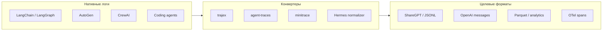
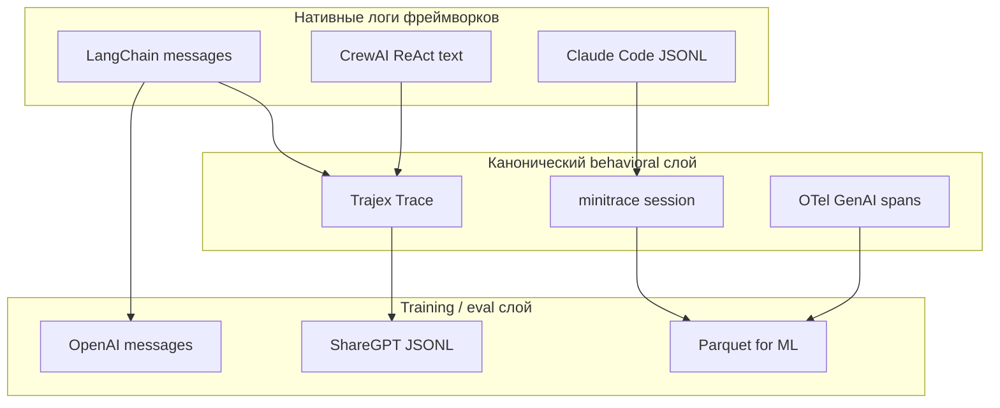
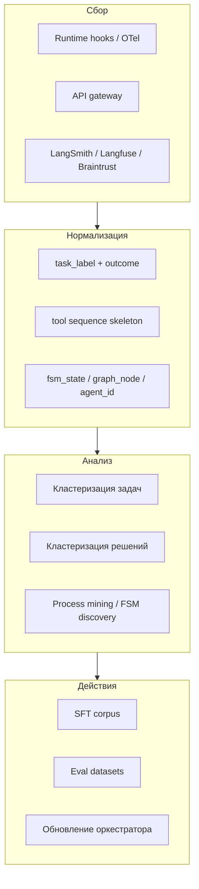

Когда агент **решает задачу пользователя**, за кулисами накапливается не один ответ, а **траектория**: запрос, рассуждения, вызовы инструментов, наблюдения, промежуточные состояния и финальный исход. Эта выгрузка нужна для **дообучения** (SFT, RL), **eval и replay**, **task mining** и отладки — но каждый фреймворк пишет её в своём формате.

В [статье про телеметрию](/vairl/blog/2026/06/29/agent-telemetry-ru/) мы разобрали, *что* собирать и *куда* складывать. Здесь — *в каком виде* агенты сериализуют траектории, **какие конвертеры** приводят их к общему знаменателю, **как компании-вендоры и продуктовые команды** строят аналитику поверх логов (кластеризация задач и решений, process mining, FSM) и **как выбрать целевой формат** под задачу.

Связанные материалы: [генерация бенчмарков](/vairl/blog/2026/06/29/agent-benchmark-generation-ru/), [фундамент агентных систем](/vairl/blog/2026/07/02/agent-fundamentals-rag-mcp-landscape-ru/), [жизненный цикл агента](/vairl/blog/2026/07/01/agent-lifecycle-pipeline-ru/).

---

## Зачем вообще выгружать траектории

| Цель | Что нужно из траектории | Типичный целевой формат |
|------|-------------------------|-------------------------|
| **SFT / instruction tuning** | Пары «запрос → ответ» с tool use | ShareGPT, OpenAI messages |
| **RL / preference learning** | Полный эпизод + reward | JSONL с `completed`, outcome |
| **Eval / regression** | Воспроизводимые шаги + oracle | Trajex, OTel spans, ATIF |
| **Аналитика продакшена** | Агрегаты по tools, cost, errors | Parquet (agent-traces), ClickHouse |
| **Кластеризация задач / решений** | task_label, tool skeleton, Topics | Braintrust, custom ETL + embed |
| **Process mining / FSM** | state sequence, DFG | AgentFlow, явный `fsm_state` в spans |
| **Сравнение агентов** | Единая схема сессий | minitrace, agent-traces |



---

## Сравнительная таблица форматов

| Агент / фреймворк | Ключевые роли | Структура траектории | Где лежит на диске |
|-------------------|---------------|----------------------|-------------------|
| **ShareGPT** | `human`, `gpt`, иногда `system`, `tool` | Плоский массив `conversations` в JSON/JSONL | HuggingFace datasets, LLaMA-Factory |
| **OpenAI / Anthropic API** | `system`, `user`, `assistant`, `tool` | Массив messages + `tool_calls` / `tool_call_id` | SDK traces, fine-tuning export |
| **LangChain (BaseMessage)** | `System`, `Human`, `AI`, `Tool`, `Function` | Объекты с `content`, `additional_kwargs`, `tool_calls` | `messages_to_dict()`, LangSmith runs |
| **LangGraph** | как LangChain + state | Граф состояний, checkpoint, `messages` в state | `.checkpointer`, LangSmith thread |
| **AutoGen (Microsoft)** | `user`, `assistant`, `tool` | История между агентами в group chat; event log | `chat_messages`, OTel (v0.4+) |
| **CrewAI** | Task → Agent, ReAct-лог | Текстовые логи: Thought / Action / Observation | stdout, `crew_output`, callbacks |
| **OpenAI Agents SDK** | run items, handoffs | `RunResult` с items: message, tool_call, handoff | JSONL через custom processor |
| **Hermes Agent** | ShareGPT + XML-теги | `conversations` + нормализация thinking/tool XML | `trajectory_samples.jsonl` |
| **Coding agents** (Pi, Claude Code, Codex, Cursor) | `type`-события в JSONL | Поток событий: message, tool_use, tool_result | `~/.claude/`, `sessions/`, SQLite |
| **ATIF** | унифицированные events | Agent Trajectory Interchange — pipe-delimited JSONL | vtcode, agent-traces |
| **Trajex** | `step_type`: tool_call, llm, … | Версионированный `Trace` с `steps[]` | `.json`, emitters |
| **minitrace** | turns, tool_calls, metrics | `.minitrace.json` — кросс-фреймворк сессия | адаптеры на 11+ систем |

**Важно:** «траектория» в eval-смысле ([trajectory-level метрики](/vairl/blog/2026/06/29/agent-benchmark-generation-ru/)) — это не только диалог, но и **последовательность действий в среде** (tool calls, изменения state). Формат сообщений и формат **behavior trace** часто конвертируются разными инструментами.

---

## Нативные форматы: примеры

### 1. ShareGPT (стандарт для SFT)

Самый распространённый формат для дообучения через [LLaMA-Factory](https://github.com/hiyouga/LLaMA-Factory), Axolotl и HuggingFace `datasets`. Роли жёстко именованы:

```json
{
  "id": "session_01",
  "conversations": [
    { "from": "human", "value": "Привет! Кто ты?" },
    { "from": "gpt", "value": "Я ИИ-ассистент." },
    { "from": "human", "value": "Какая погода в Берлине?" },
    { "from": "gpt", "value": "Сегодня солнечно, +22°C." }
  ]
}
```

Современные парсеры поддерживают отдельное поле `system` на уровне объекта и роль `"from": "tool"` в массиве (как в [Hermes Agent](https://hermes-agent.nousresearch.com/docs/developer-guide/trajectory-format)).

### 2. OpenAI Chat Completions (мультиагентные системы)

Де-факто стандарт для API и для LangChain/LangGraph при сериализации:

```json
[
  { "role": "system", "content": "Ты полезный ИИ-агент." },
  { "role": "user", "content": "Посчитай 2 + 2 * 2" },
  {
    "role": "assistant",
    "content": null,
    "tool_calls": [{
      "id": "call_123",
      "type": "function",
      "function": { "name": "calculator", "arguments": "{\"expr\": \"2 + 2 * 2\"}" }
    }]
  },
  { "role": "tool", "tool_call_id": "call_123", "content": "6" },
  { "role": "assistant", "content": "Результат вычисления равен 6." }
]
```

Плюсы: нативная поддержка **function calling**, совместимость с fine-tuning API OpenAI. Минусы: для ReAct-агентов «мысли» часто теряются, если не добавить в `content` вручную.

### 3. LangChain BaseMessage

Внутреннее представление — типизированные классы; экспорт через `messages_to_dict()` / `message_to_dict()`:

```python
from langchain_core.messages import messages_to_dict

serialized = messages_to_dict(agent_messages)
# [{"type": "human", "data": {"content": "...", "additional_kwargs": {}}},
#  {"type": "ai", "data": {"content": "...", "tool_calls": [...]}}]
```

**LangSmith** сохраняет runs как дерево span'ов с вложенными LLM/tool child runs — это **observability-формат**, не готовый ShareGPT. Экспорт dataset из LangSmith требует маппинга runs → messages.

**LangGraph** добавляет `thread_id`, checkpoints (`state["messages"]`) и опционально `interrupt` — для replay нужен checkpointer, не только JSONL.

### 4. AutoGen — мультиагентный group chat

Траектория — **переписка между именованными агентами** плюс tool results:

```json
{
  "agent": "coder",
  "role": "assistant",
  "content": "Вот патч для bugfix...",
  "name": "coder"
}
```

В AutoGen 0.4+ рекомендуется **OpenTelemetry** для трассировки. Нативный `chat_messages` удобен для отладки, но плохо стыкуется с SFT без конвертера: нужно склеить несколько агентов в один диалог или разметить `name` как под-роль.

### 5. CrewAI — Task / Agent и ReAct-лог

CrewAI пишет **исполнение задачи** как текстовый trace:

```
Thought: Мне нужно найти данные о компании.
Action: search_tool
Action Input: {"query": "SpaceX revenue 2025"}
Observation: SpaceX is a private company...
Final Answer: SpaceX — частная компания, точная выручка не раскрывается.
```

При экспорте в ShareGPT типичная стратегия — **склеить** Thought/Action/Observation в одно сообщение `gpt`, а `human` = исходный Task prompt. [Trajex](https://pypi.org/project/trajex/) умеет строить behavioral trace из `crew.kickoff()` output через `trace_from_crew_output`.

### 6. Coding-агенты: Pi, Claude Code, Codex, OpenCode

Здесь форматы **событийные** (event-sourced JSONL), а не «массив сообщений»:

| Агент | Хранилище | Маркеры детекции |
|-------|-----------|------------------|
| **Pi** | JSONL | поле `type` |
| **Claude Code** | JSONL | `type` + `uuid` / `sessionId` |
| **Codex** | JSONL | `type: "item"` + обёртка `payload` |
| **OpenCode** | SQLite | схема БД сессий |
| **ATIF** | JSONL | первый байт `\|` (pipe-format) |

Библиотека [agent-traces](https://github.com/davanstrien/agent-traces) нормализует их в **три таблицы** Polars/Parquet: `sessions`, `events`, `content` — удобно для аналитики и курации training data без ручного парсинга каждого агента.

### 7. Hermes Agent — ShareGPT с нормализацией

Hermes — эталонный пример **осознанного экспорта под обучение**:

| API role | ShareGPT `from` |
|----------|-----------------|
| system | `system` |
| user | `human` |
| assistant | `gpt` |
| tool | `tool` |

Дополнительно: reasoning нормализуется в XML-теги `redacted_thinking`, tool calls — в `<tool_call>`, ответы инструментов — в `<tool_response>`. Файлы: `trajectory_samples.jsonl` (успех) и `failed_trajectories.jsonl` (сбой) — сразу готовый корпус для SFT/RL с фильтром по `completed`.

---

## Конвертеры и «канонические» слои

Единого ISO-стандарта для agent trajectories **пока нет** — но сложился стек промежуточных форматов:

| Инструмент | Вход | Выход | Назначение |
|------------|------|-------|------------|
| **[trajex](https://pypi.org/project/trajex/)** | LangChain, LangGraph, OpenAI Agents, CrewAI, Pydantic AI | `Trace` JSON + assertions | Behavioral testing, CI, offline |
| **[agent-traces](https://github.com/davanstrien/agent-traces)** | Pi, Claude Code, Codex, ATIF | Parquet (sessions/events/content) | Аналитика, cost, training curation |
| **[minitrace](https://github.com/wesen/minitrace)** | 11+ агентов и web-экспорты | `.minitrace.json` | Кросс-фреймворк сравнение поведения |
| **[trace-to-otel](https://github.com/MukundaKatta/trace-to-otel)** | JSONL audit logs | OTLP spans | Jaeger, Tempo, Datadog без SDK в runtime |
| **Hermes `trajectory.py`** | внутренний API chat | ShareGPT JSONL | SFT / RL datasets |
| **LangSmith export** | runs | dataset examples | Eval, human review |
| **Langfuse** | traces | OpenAI-format messages | Open-source observability |
| **LLaMA-Factory** | ShareGPT / Alpaca / OpenAI | training config | SFT pipeline |



**Trajex** позиционируется как «OpenTelemetry для траекторий агентов»: версионированный wire format + emitters + `scan()` для поиска loop'ов и silent failures. **Langfuse/LangSmith** — SaaS observability; они потребляют traces, но не задают открытый interchange-стандарт.

---

## Правила маппинга ролей

При конвертации в ShareGPT или OpenAI messages:

| Источник | ShareGPT | OpenAI | Примечание |
|----------|----------|--------|------------|
| `user` / `human` / `HumanMessage` | `human` | `user` | 1:1 |
| `assistant` / `ai` / `AIMessage` | `gpt` | `assistant` | tool_calls → в content или отдельные turns |
| `system` / `SystemMessage` | `system` или поле объекта | `system` | часто один раз в начале |
| `tool` / `ToolMessage` | `tool` или внутри `gpt` | `tool` + `tool_call_id` | для SFT без native tool role — склеивать в ReAct-текст |
| ReAct Thought/Action/Obs | склеить в `gpt` | один `assistant` turn | сохранить структуру тегами |
| Multi-agent `name` | префикс `[coder]:` | `name` field (legacy) | или разбить на отдельные сессии |

### Стратегии обработки tool results

1. **Native tool role** — для моделей с function calling (Hermes, GPT-4o fine-tune).
2. **ReAct-текст** — `Observation: ...` внутри `gpt`; проще для старых SFT-пайплайнов.
3. **Drop observations** — обучение только на финальном ответе; теряется credit assignment для tool use.

---

## Пример конвертера: LangChain → ShareGPT

Минимальный скрипт без внешних зависимостей (кроме `langchain_core`):

```python
import json
from langchain_core.messages import BaseMessage, HumanMessage, AIMessage, SystemMessage, ToolMessage

ROLE_MAP = {
    "human": "human",
    "ai": "gpt",
    "system": "system",
    "tool": "tool",
}

def message_to_sharegpt(msg: BaseMessage) -> dict:
    role = ROLE_MAP.get(msg.type, "gpt")
    value = msg.content or ""
    if isinstance(msg, AIMessage) and msg.tool_calls:
        blocks = [value] if value else []
        for tc in msg.tool_calls:
            blocks.append(
                f"<tool_call>\n{json.dumps({'name': tc['name'], 'arguments': tc['args']}, ensure_ascii=False)}\n</tool_call>"
            )
        value = "\n".join(blocks)
    if isinstance(msg, ToolMessage):
        value = f"<tool_response>\n{value}\n</tool_response>"
    return {"from": role, "value": value}

def export_session(messages: list[BaseMessage], session_id: str) -> dict:
    return {
        "id": session_id,
        "conversations": [message_to_sharegpt(m) for m in messages],
    }

def to_jsonl(sessions: list[dict], path: str) -> None:
    with open(path, "w", encoding="utf-8") as f:
        for s in sessions:
            f.write(json.dumps(s, ensure_ascii=False) + "\n")
```

Для production лучше **Trajex emitter** или **Hermes normalizer** — они покрывают edge cases (пустой reasoning, двойной JSON в arguments, группировка tool responses).

### Пример через Trajex (CrewAI → behavioral trace → JSON)

```python
from trajex.emitters.crewai import trace_from_crew_output
from trajex import scan

output = crew.kickoff(inputs={"topic": "Илон Маск"})
trace = trace_from_crew_output(prompt="Найди информацию про Илона Маска", crew_output=output)
trace.to_json("crew_trace.json")

report = scan(trace)
print(report.suggested_assertions())  # copy-paste в pytest
```

---

## Что выгружать помимо сообщений

Для полноценной траектории (как в [телеметрии](/vairl/blog/2026/06/29/agent-telemetry-ru/)) к диалогу добавляют метаданные:

| Поле | Зачем |
|------|-------|
| `session_id`, `trace_id` | Связь с OTel, replay |
| `task_label` | Task mining, кластеризация |
| `agent_version`, `model_id`, `prompt_hash` | Регрессии при смене промпта |
| `outcome` / `completed` | Фильтр успешных траекторий для SFT |
| `tool_stats`, `api_calls`, `cost_usd` | Экономика и аномалии |
| `fsm_state` / `graph_node` | Оркестратор DAG/FSM/BT |
| `environment_snapshot_id` | Replay в sandbox (SWE-bench, WebArena) |

Coding-агенты часто **не пишут** эти поля нативно — их добавляют на слое телеметрии или при конвертации в Parquet.

---

## Какой формат выбрать

| Задача | Рекомендация |
|--------|--------------|
| Дообучить модель с tool use | ShareGPT JSONL (Hermes-стиль) или OpenAI fine-tune format |
| CI-тесты на поведение агента | Trajex + assertions (`sequence`, `no_loop`) |
| Сравнить Claude Code vs Codex vs Pi | agent-traces или minitrace → Parquet |
| Интеграция с Jaeger/Grafana | trace-to-otel из audit JSONL |
| Human review + regression | LangSmith / Langfuse → dataset export |
| Eval trajectory-level (pass^k) | Нативный replay format + state oracle, не только messages |

---

## Типичные ошибки при экспорте

| Ошибка | Последствие |
|--------|-------------|
| Склеить все агенты AutoGen в один `human`/`gpt` без `name` | Потеря мультиагентной структуры |
| Выбросить failed trajectories | Selection bias в SFT — модель не учится на recovery |
| Double-encode JSON в `arguments` | Ломает парсеры tool calls при обучении |
| Нет `tool_call_id` при native tool role | Несовпадение пары call/response |
| Экспорт только final answer из CrewAI | Модель не видит chain-of-tools |
| Один формат для analytics и для SFT | Лишние трансформации; лучше два слоя (Parquet + ShareGPT) |

---

## Пайплайн: от продакшена к training set

```
Сырые логи агента
  → PII scrub (presidio / redact)
  → нормализация (trajex / agent-traces / свой конвертер)
  → фильтр: completed=true, outcome=success, tool_stats в норме
  → дедуп по embedding task_label
  → human review выборки
  → ShareGPT JSONL → LLaMA-Factory / HF datasets
  → параллельно: Parquet → аналитика и eval backlog
```

Связь с [генерацией бенчмарков](/vairl/blog/2026/06/29/agent-benchmark-generation-ru/): успешные траектории → positive examples; failed + verifier → кандидаты в golden set.

---

## Индустриальные практики: телеметрия → анализ → кластеры → FSM

Формат траектории — это **сырьё**. Компании, которые строят агентные продукты (LangChain/LangSmith, Braintrust, Anthropic, команды coding-агентов, enterprise MAS вроде [MAESTRO](/vairl/blog/2026/07/01/maestro-airi-stack-ru/)), поверх одного и того же потока логов выстраивают **аналитический контур**: от сырой трассы к каталогу задач, кластерам решений и восстановленным автоматам успешного поведения.



### Как собирают телеметрию «компании-агенты»

Паттерн 2025–2026 сходится к **трём слоям** (подробнее — в [обзоре телеметрии](/vairl/blog/2026/06/29/agent-telemetry-ru/)):

| Слой | Кто так делает | Что пишется |
|------|----------------|-------------|
| **Instrumentation** | Все серьёзные команды | OTel SDK + [GenAI semantic conventions](https://opentelemetry.io/docs/specs/semconv/gen-ai/); `@traceable` / LangChain callbacks; custom audit JSONL |
| **Observability backend** | LangSmith, Braintrust, Langfuse, Arize Phoenix | Иерархия trace → span/run; threads по `session_id`; scores, tags, datasets |
| **Analytics warehouse** | Крупные продукты, coding-agent pipelines | Parquet / ClickHouse: `agent-traces`, nightly ETL из observability API |

**LangSmith** (LangChain Inc.): traces как дерево runs; **threads** связывают multi-turn сессии; **Insights** — встроенный анализ продакшен-трасс с кластеризацией по темам и failure modes; **trajectory evals** проверяют порядок tools и выбор sub-agent'а, не только финальный ответ. Для LangGraph каждый **узел графа** — отдельный span → видны loop'ы и handoff state.

**Braintrust**: eval-first платформа; фича **[Topics](https://www.braintrust.dev/blog/topics)** — автоматическая классификация traces. Архитектура ([summarize → embed → cluster → label](https://www.braintrust.dev/blog/topics-architecture)) вдохновлена подходом Anthropic **Clio**: сначала LLM **суммаризирует** trace по одному измерению (Task / Sentiment / Issues) в 1–2 предложения, затем embedding, **UMAP + HDBSCAN**, именование кластера вторым LLM-проходом. Классификации пишутся обратно в логи как **SQL-фильтруемые колонки** → dataset builder, regression CI.

**Langfuse** (open-source, с 2026 — в экосистеме ClickHouse): on-prem traces, prompt versioning, экспорт в OpenAI-format messages; кластеризацию чаще делают **своим пайплайном** поверх экспорта (embed + HDBSCAN), зато полный контроль над данными.

**Coding-агенты** (Cursor, Claude Code, Codex, Pi): телеметрия часто **локальная** (JSONL/SQLite), агрегация — через [agent-traces](https://github.com/davanstrien/agent-traces) / [minitrace](https://github.com/wesen/minitrace) при выгрузке в аналитику; публичные датасеты (`pi-mono`, `claude-code-traces`) — основа для исследований поведения.

**Hermes / RL-команды**: сразу пишут **training-ready** JSONL (`trajectory_samples.jsonl` / `failed_trajectories.jsonl`) с `completed` и `tool_stats` — телеметрия и SFT-экспорт совмещены.

Общий принцип: **100% ошибок + sample успешных** (см. [телеметрию](/vairl/blog/2026/06/29/agent-telemetry-ru/#sampling)); каждая запись привязана к `agent_version`, `model_id`, `prompt_hash`.

### Двухпроходный пайплайн анализа (industry standard)

На больших объёмах (тысячи+ traces/день) ручной разбор невозможен. Стандартная схема:

| Проход | Вход | Выход |
|--------|------|-------|
| **1. Discovery** | Sample 500–50 000 traces (часто только `outcome=success` для «эталонов») | Taxonomy: именованные кластеры задач и/или паттернов решений |
| **2. Assignment** | Каждая новая trace | Метки: `task_cluster_id`, `solution_variant_id`, `failure_topic` |
| **3. Action** | Размеченный корпус | Eval dataset, SFT slice, алерт, правка промпта / FSM |

Discovery почти всегда **не на сыром тексте trace**, а на **компактном представлении** (facet summary, tool skeleton, state sequence) — иначе embedding не помещает контекст и шумит.

### Кластеризация задач (task clustering)

Цель: понять, **какие задачи** приносят пользователи, без ручной разметки каждой сессии. Практики:

| Метод | Как работает | Кто / где |
|-------|--------------|-----------|
| **Embedding opening message** | `user_message` → embed → HDBSCAN / k-means | Базовый task mining ([телеметрия](/vairl/blog/2026/06/29/agent-telemetry-ru/#список-задач-пользователя-task-mining)) |
| **LLM task_label** | В конце сессии: «какую задачу решал пользователь?» → embed label | Продуктовые команды, nightly job |
| **Facet Task (Braintrust Topics)** | LLM извлекает intent из полной trace → embed → cluster | Автоматические топики вроде «Refund requests», «API auth errors» |
| **Intent classifier** | Supervised или weak labels из кластеров v1 | Зрелые продукты после human review топ-кластеров |
| **Structured intake** | Форма / schema на входе → task = instance | Support bots, enterprise workflows |

Пайплайн каталога задач (из [телеметрии](/vairl/blog/2026/06/29/agent-telemetry-ru/)):

```
Сырые сессии → PII scrub → task_label → embed → кластер → human review → taxonomy v1
         ↓
  success_rate, cost, frequency по кластеру → приоритет roadmap и eval
```

Визуализация кластеров в 2D (PaCMAP, UMAP) — карта «белых пятен» продукта; см. [пространство гипотез](/vairl/blog/2026/06/24/hypothesis-space-pacmap/).

**Фильтр для обучения:** в SFT часто берут кластеры с **высоким success rate** и низкой стоимостью — «эталонные» задачи. Failure-кластеры идут в eval, не в training (иначе selection bias).

### Кластеризация решений (solution / execution clustering)

Здесь кластеризуют не *что просил пользователь*, а *как агент действовал* — последовательность tools, узлов графа, переходов FSM.

| Представление траектории | Алгоритм | Инструмент / источник |
|--------------------------|----------|------------------------|
| **Tool sequence skeleton** | Exact match на нормализованной строке `read_file→grep→edit` | [clustertrace](https://github.com/Lucas-FManager/clustertrace) — failure rate по кластеру |
| **Span sequence** | Run-length collapse + equality | clustertrace `list_clusters` |
| **Process graph (DFG)** | Directly-follows graph, variants | [AgentFlow](https://github.com/ClemenceChee/AgentFlow) — process mining для агентов |
| **DTW / edit distance** | Похожие последовательности с перестановками | [телеметрия: trajectory similarity](/vairl/blog/2026/06/29/agent-telemetry-ru/#поиск-похожих-задач-и-сессий) |
| **Action embeddings** | Verb-noun embeddings шагов → t-SNE | [AgentDiagnose](https://aclanthology.org/2025.emnlp-demos.15/) |
| **Behavioral baseline** | Статистика по passing traces | Trajex `learn()` + `check_anomalies()` |

Типичный инсайт: *«83% падений приходятся на 2 паттерна из 18»* — вместо чтения сотен traces вручную. Успешные кластеры становятся **few-shot шаблонами** и кандидатами в SFT; провальные — в **trajectory eval** с проверкой порядка tools.

**Trajex 0.3** учит baseline на каталоге успешных traces: новые прогоны сравнивают с `ordering_violation`, `new_tool_appeared`, `step_count_anomaly` — это **кластеризация поведения через статистический эталон**, без явного HDBSCAN.

**minitrace** даёт `read_ratio`, `tool_call_count`, `turn_count` — метрики для сравнения **вариантов работы** одного и того же агента между версиями и фреймворками.

### Выявление конечных автоматов из успешных трасс

Если кластеризация отвечает «какие группы похожи», **process mining / FSM discovery** отвечает «какая **повторяющаяся машина состояний** лежит в основе успеха».

| Подход | Суть | Результат |
|--------|------|-----------|
| **Логирование `fsm_state` / `graph_node`** | Явная разметка при исполнении | Готовая таблица переходов; mining = подсчёт частот `S_i → S_j` на `outcome=success` |
| **Directly-follows graph (DFG)** | Из hundreds runs: A→B→C частоты | AgentFlow `discoverProcess()` — «73% идут A→B→C, 12% A→D с 80% fail» |
| **Conformance checking** | Сравнение новой trace с эталонной моделью | `checkConformance()` — неожиданные переходы, пропущенные шаги |
| **PFSM из трасс (Skill-DisCo)** | Кластеризация фрагментов control-flow | Параметризованный FSM-subgraph как reusable skill ([arxiv](https://arxiv.org/html/2606.26669v1)) |
| **State-transition timelines** | Визуализация переходов | AgentDiagnose — диагностика backtracking, decomposition |
| **Ручной гибрид** | FSM снаружи, DAG/BT внутри | [Гибридный оркестратор](/vairl/blog/2026/06/26/hybrid-agent-dag-fsm-behavior-tree-ru/) — проектирование + валидация по логам |

Практический workflow **reverse-engineering FSM из продакшена**:

```
1. Фильтр: outcome=success, verifier=pass, cost < p95
2. Извлечь последовательность: fsm_state | graph_node | collapsed_tool_sequence
3. Построить DFG / частотную матрицу переходов
4. Отсечь переходы с support < θ (например 5%)
5. Human review → FSM v1 (Planning → Executing → Verifying → Done)
6. Conformance на новых traces → drift alert
7. Успешные варианты → SFT; отклонения → eval + guard в оркестраторе
```

Связь с [гибридным DAG/FSM/BT](/vairl/blog/2026/06/26/hybrid-agent-dag-fsm-behavior-tree-ru/): телеметрия **не заменяет** проектирование автомата, но **проверяет**, совпадает ли реальное поведение с задуманным — и предлагает новые состояния, если продукт «оброс» неучтёнными режимами (recovery, escalation, handoff).

### Мультиагентные системы: что логируют отдельно

В MAS (AutoGen, CrewAI, LangGraph multi-agent, [MAESTRO](/vairl/blog/2026/07/01/maestro-airi-stack-ru/)) одной «плоской» траектории недостаточно. Известные практики:

| Поле / практика | Зачем |
|-----------------|-------|
| `agent_id` / `role` / `crew_agent_name` | Per-agent error rate, bottleneck |
| `handoff_id`, `parent_agent`, `child_agent` | Трассировка передачи state |
| `handoff_payload_hash` / schema version | Детект schema drift между агентами |
| `message_protocol` (gRPC, chat, blackboard) | [Wooldridge MAS](/vairl/blog/2026/06/29/agent-telemetry-ru/#1-фундаментальная-теория-ai-агентов-и-систем) — разные топологии |
| `thread_id` на всю сессию | LangSmith: связать traces разных агентов в один разговор |
| Span на **каждый** LLM + tool **каждого** агента | Каскадные сбои: tool error у агента A → галлюцинация у B |
| `orchestrator_mode`: supervisor / groupchat / DAG | Сравнение топологий на одних задачах |

**LangSmith** для multi-agent: фильтр traces по error status **внутри конкретного node/agent**; проверка **handoff fidelity** — совпадает ли input span агента B с output span агента A.

**CrewAI / AutoGen**: нативный лог — переписка с `name`; для аналитики конвертируют в **единый trace** с полем `speaker` или разбивают на **sub-traces** per agent, связанные `session_id`.

**Кластеризация в MAS:**

- **По задаче** — как в single-agent (Task facet).
- **По протоколу взаимодействия** — последовательность `(agent_A, tool_x) → (agent_B, tool_y)`; кластеры = «типовые сценарии делегирования».
- **По исходу handoff** — доля успешных передач planner→coder→reviewer.

### Сводная таблица: кто что делает с трассами

| Компания / продукт | Сбор | Кластеризация задач | Кластеризация решений | FSM / process model |
|--------------------|------|---------------------|----------------------|---------------------|
| **Braintrust** | Spans, scores | Topics: Task facet | Topics: Issues facet | Через taxonomy + eval gates |
| **LangSmith** | Runs, threads, Insights | Insights reports | Trajectory evals, node loops | LangGraph node graph = явный FSM/DAG |
| **Langfuse** | OTel-native traces | Custom ETL + embed | Custom / экспорт | Зависит от полей в attributes |
| **Hermes** | JSONL trajectories | `metadata` + prompt_index | `tool_stats` | В оркестраторе агента |
| **clustertrace** | Decorator / OTel | Tags на trace | Span-sequence clusters | — |
| **AgentFlow** | Execution graphs | — | `findVariants()`, bottlenecks | `discoverProcess()`, conformance |
| **Trajex** | Canonical Trace | `prompt` | `learn()` baseline | Ordering assertions |
| **agent-traces** | Multi-format → Parquet | `sessions` + content embed | `events.tool_name` sequences | SQL/Polars aggregation |

### Пайплайн «телеметрия → успешные траектории → продукт»

```
Продакшен traces (все frameworks → OTel / Parquet)
  ├─ Task discovery (Topics / task_label / embed)
  │     → task taxonomy + частоты + success_rate
  ├─ Solution clustering (tool skeleton / DFG / Trajex learn)
  │     → варианты работы + failure signatures
  ├─ FSM mining (только success + verifier)
  │     → эталонный автомат + conformance checks
  └─ Выходы:
        • ShareGPT slice для SFT (лучшие кластеры)
        • Eval packs (провальные варианты + edge cases)
        • Обновление FSM/guards в оркестраторе
        • Алерты: новый task cluster, drift решения, loop в node
```

Это замыкает контур с [синтезом гипотез из трасс](/vairl/blog/2026/06/26/llm-hypothesis-synthesis-agents-ru/): кластеры подсказывают, **где** искать улучшения; FSM — **какие** переходы закрепить в коде; форматы из первой половины статьи — **как** выгрузить данные в training и eval инструменты.

---

## Обзор инструментов (кратко)

| Категория | Инструмент | Ссылка |
|-----------|------------|--------|
| SFT training | LLaMA-Factory | [github.com/hiyouga/LLaMA-Factory](https://github.com/hiyouga/LLaMA-Factory) |
| Trajectory spec + tests | Trajex | [pypi.org/project/trajex](https://pypi.org/project/trajex/) |
| Multi-agent analytics | agent-traces | [github.com/davanstrien/agent-traces](https://github.com/davanstrien/agent-traces) |
| Cross-framework sessions | minitrace | [github.com/wesen/minitrace](https://github.com/wesen/minitrace) |
| JSONL → OTel | trace-to-otel | [github.com/MukundaKatta/trace-to-otel](https://github.com/MukundaKatta/trace-to-otel) |
| ShareGPT export reference | Hermes Agent | [Trajectory Format docs](https://hermes-agent.nousresearch.com/docs/developer-guide/trajectory-format) |
| Observability | Langfuse, LangSmith, Phoenix | см. [телеметрию](/vairl/blog/2026/06/29/agent-telemetry-ru/) |
| Trace clustering / Topics | Braintrust Topics | [braintrust.dev/blog/topics](https://www.braintrust.dev/blog/topics) |
| Solution clustering | clustertrace | [github.com/Lucas-FManager/clustertrace](https://github.com/Lucas-FManager/clustertrace) |
| Process mining / FSM | AgentFlow | [github.com/ClemenceChee/AgentFlow](https://github.com/ClemenceChee/AgentFlow) |
| Trajectory diagnosis | AgentDiagnose | [aclanthology.org/2025.emnlp-demos.15](https://aclanthology.org/2025.emnlp-demos.15/) |
| PFSM skill discovery | Skill-DisCo | [arxiv.org/html/2606.26669](https://arxiv.org/html/2606.26669v1) |
| OTel GenAI semconv | OpenTelemetry | [opentelemetry.io/docs/specs/semconv/gen-ai](https://opentelemetry.io/docs/specs/semconv/gen-ai/) |

---

## Чеклист перед экспортом

1. Определён **целевой потребитель**: SFT, eval, analytics или observability?
2. Зафиксирован **маппинг ролей** и стратегия для tool/observation.
3. Сохраняются **failed** и **partial** trajectories (с меткой `completed`).
4. Есть **session_id** и версия агента для replay.
5. PII вычищен **до** записи в training corpus.
6. Для multi-agent — решено, как кодировать **имена агентов**.
7. Проверен конвертер на **10–20 ручных сессиях** (tool_call pairing, encoding).
8. Настроен **второй экспорт** в analytics-формат, если SFT и SQL-аналитика расходятся.
9. Для продакшена: есть **task_label** или facet для кластеризации задач.
10. Логируется **skeleton решения** (`tool_sequence` / `fsm_state` / `graph_node`) для кластеризации вариантов работы.
11. Успешные traces (`outcome=success`) отделены для **FSM mining** и SFT; failed — для eval.
12. В MAS: есть `agent_id` и трассировка **handoff** между агентами.

---

## Связанные публикации VAIRL

- [Телеметрия AI-агентов](/vairl/blog/2026/06/29/agent-telemetry-ru/) — сбор, хранение, поиск похожих задач
- [Генерация бенчмарков](/vairl/blog/2026/06/29/agent-benchmark-generation-ru/) — trajectory-level eval
- [Фундамент агентных систем](/vairl/blog/2026/07/02/agent-fundamentals-rag-mcp-landscape-ru/) — обзор Pi, Codex, Claude Code и др.
- [Синтез гипотез из трасс](/vairl/blog/2026/06/26/llm-hypothesis-synthesis-agents-ru/) — анализ накопленных логов
- [Гибридный оркестратор DAG/FSM/BT](/vairl/blog/2026/06/26/hybrid-agent-dag-fsm-behavior-tree-ru/) — проектирование автоматов и вложенность исполнителей
- [Устойчивость control loops](/vairl/blog/2026/06/29/agent-control-loop-stability-ru/) — метрики на каждом шаге траектории

---

## Итог

Форматы траекторий **намеренно различаются**: LangChain хранит typed messages, CrewAI — ReAct-текст, coding-агенты — event JSONL, observability-платформы — span trees. Для обучения доминируют **ShareGPT** и **OpenAI messages**; для инженерии поведения — **Trajex**, **minitrace**, **agent-traces**, **clustertrace**, **AgentFlow**; для продакшена — **OTel**, Langfuse, LangSmith, Braintrust Topics.

Практичный подход: **два слоя данных** — (1) behavioral trace для тестов, кластеризации решений и FSM mining; (2) training export (ShareGPT JSONL) — плюс **двухпроходная аналитика** (discover taxonomy → assign labels). Тогда выгрузка «задача + как агент действовал» становится не архивом логов, а входом в **каталог задач**, **кластеры вариантов решения** и **эталонные автоматы** успешной работы — в том числе в мультиагентных топологиях.
