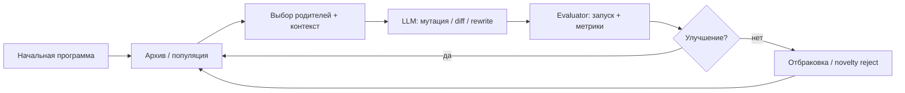
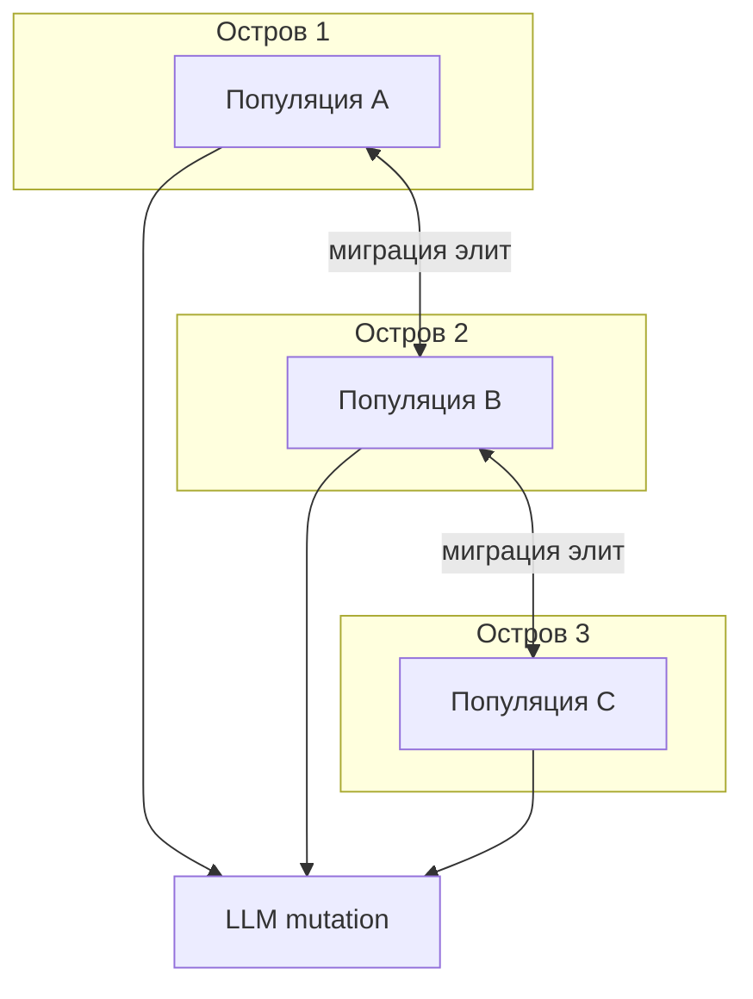
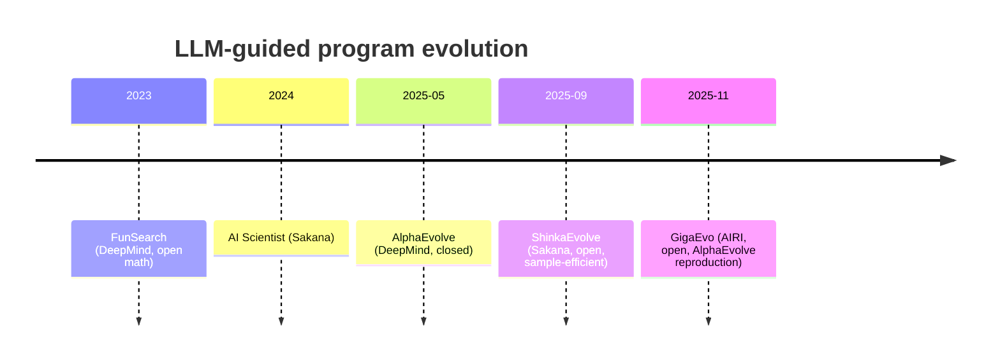

Три независимых линии исследований сошлись в одном классе систем: **LLM как оператор мутации + эволюционный архив + автоматический verifier**. Модель предлагает изменения в коде; evaluator считает метрику; лучшие программы попадают в популяцию и становятся родителями следующего поколения.

В этой статье — сравнительный анализ:

| Система | Организация | Статус |
|---------|-------------|--------|
| **[ShinkaEvolve](https://sakana.ai/shinka-evolve/)** | Sakana AI | Open source (Apache 2.0), [`pip install shinka-evolve`](https://sakanaai.github.io/ShinkaEvolve/) |
| **[AlphaEvolve](https://deepmind.google/blog/alphaevolve-a-gemini-powered-coding-agent-for-designing-advanced-algorithms/)** | Google DeepMind | Закрытый продукт; white paper [arXiv:2506.13131](https://arxiv.org/abs/2506.13131) |
| **[GigaEvo](https://airi-institute.github.io/gigaevo-cover/)** | AIRI (Институт AIRI) | Open source, [gigaevo-core](https://github.com/AIRI-Institute/gigaevo-core) |

> **Уточнение по названию.** У AIRI система называется **GigaEvo** (не «Aэстроэво»). Она интегрирована в экосистему [MAESTRO CARE](/vairl/blog/2026/07/01/maestro-airi-stack-ru/) через `maestro evolve` и [gigaevo-platform](https://github.com/AIRI-Institute/gigaevo-platform).

Связанные материалы VAIRL: [эволюционные алгоритмы в ИИ](/vairl/blog/2026/01/16/evolutionary-algorithms-ai-ru/), [эволюция агентов и Behavior Tree](/vairl/blog/2026/06/22/agent-evolution-behavior-tree-ru/), [генерация бенчмарков](/vairl/blog/2026/06/29/agent-benchmark-generation-ru/), [Sakana Fugu](/vairl/blog/2026/07/02/sakana-fugu-multi-agent-orchestration-ru/).

---

## Карта статьи

| Раздел | О чём |
|--------|--------|
| [Общий цикл](#общий-эволюционный-цикл) | Что общего у всех трёх |
| [Архитектура](#архитектура-трёх-систем) | ShinkaEvolve · AlphaEvolve · GigaEvo |
| [Острова и отбор](#острова-отбор-и-разнообразие) | Island model, MAP-Elites, parent sampling |
| [Интерактив](#интерактив-острова-и-дерево-эволюции) | p5.js: три острова, филогения, цикл шагов |
| [Бенчмарки](#бенчмарки-эпохи-и-производительность) | Сколько поколений, какие метрики |
| [Перечень задач](#перечень-задач-и-ограниченные-области) | Геометрия, математика, инфраструктура |
| [Сводная таблица](#сводная-таблица) | Быстрое сравнение |
| [Практика](#что-выбрать-на-практике) | Когда какую систему брать |

---

## Общий эволюционный цикл

Все три системы реализуют один и тот же **control loop**, близкий к FunSearch (Romera-Paredes et al., 2024) и предшественникам в NAS:

**Критическое условие:** задача должна иметь **программный verifier** — функцию, которая без человека выдаёт скалярную (или векторную) метрику. Без этого эволюция не масштабируется: AlphaEvolve явно не применим к экспериментам в лаборатории с субъективной оценкой.

Типичный контракт задачи (как в ShinkaEvolve и GigaEvo):

- `initial.py` — стартовая программа;
- `evaluate.py` — запуск кандидата, возврат fitness + публичные метрики + текстовый feedback;
- опционально: `task_sys_msg` с описанием ограниченной области (unit square, треугольник, гиперкуб).

---

## Архитектура трёх систем

### ShinkaEvolve (Sakana AI)

**Статья:** [arXiv:2509.19349](https://arxiv.org/abs/2509.19349) · **Код:** [SakanaAI/ShinkaEvolve](https://github.com/SakanaAI/ShinkaEvolve)

Фокус Sakana — **sample efficiency**: открытая альтернатива AlphaEvolve с на порядок меньшим числом оценок программ.

| Компонент | Реализация |
|-----------|------------|
| Runtime | `ShinkaEvolveRunner` — async, параллельные proposal и eval |
| Архив | Фиксированный elite-архив + островные подпопуляции |
| Мутация | Три типа patch (diff, rewrite, …), ensemble LLM |
| Отбор LLM | **UCB1 bandit** — динамическое распределение по моделям |
| Разнообразие | **Novelty rejection sampling** (embedding + LLM-judge) |
| Память | Meta-scratchpad каждые *T* поколений — сводка успешных стратегий |
| Деплой | Local, SLURM, WebUI для lineage и метрик |

Ключевые отличия от «наивного» эволюционного поиска:

1. **Weighted parent sampling** — баланс fitness и числа потомков (анти-переэксплуатация одного родителя).
2. **Inspiration programs** — в промпт попадают не только родитель, но и топ архива + случайные образцы.
3. **Текстовый feedback** из evaluator попадает обратно в мутационный промпт.

### AlphaEvolve (Google DeepMind)

**White paper:** [arXiv:2506.13131](https://arxiv.org/abs/2506.13131) · **Блог:** [DeepMind, май 2025](https://deepmind.google/blog/alphaevolve-a-gemini-powered-coding-agent-for-designing-advanced-algorithms/)

Преемник FunSearch: вместо коротких функций — **целые кодовые базы** (сотни строк), применимые к инфраструктуре Google.

| Компонент | Реализация |
|-----------|------------|
| LLM | **Gemini 2.0 Flash** (широта идей, низкая latency) + **Gemini Pro** (сложные правки) |
| Архив | Гибрид **MAP-Elites + island model** |
| Pipeline | Async (`asyncio`): controller → LLM samplers → evaluation nodes |
| Оптимизация | Throughput — максимум идей за фиксированный compute budget |
| Мультиобъективность | Несколько метрик одновременно; разнообразие «сильных по разным критериям» программ в промпте |
| Meta | Co-evolution **meta-prompts** в отдельной базе |
| Eval | До ~100 compute-hours на решение; каскадная оценка с random seeds |

AlphaEvolve — **эталон результатов**, но не open source. Репликации: [OpenEvolve](https://github.com/codelion/openevolve), [GigaEvo](https://arxiv.org/html/2511.17592v1).

### GigaEvo (AIRI)

**Отчёт:** [arXiv:2511.17592](https://arxiv.org/abs/2511.17592) · **Документация:** [gigaevo-cover](https://airi-institute.github.io/gigaevo-cover/) · **Код:** [AIRI-Institute/gigaevo-core](https://github.com/AIRI-Institute/gigaevo-core)

AIRI позиционирует GigaEvo как **воспроизводимую open-source реализацию** идей AlphaEvolve с явной модульностью.

| Компонент | Реализация |
|-----------|------------|
| Хранилище | **Redis** — evolutionary units (UUID, код, метрики, lineage) |
| Eval | **DAG pipeline** на asyncio: execute → validate → complexity → LLM insights |
| Эволюция | **MAP-Elites**: ячейки (fitness × validity) |
| Острова | Single- и **multi-island** (fitness / simplicity / speed) + миграция |
| Мутация | LangGraph-агент; **rewrite** (надёжнее diff для open-source LLM) |
| Конфиг | **Hydra** — `problem.name=heilbronn algorithm=multi_island` |
| Продакшен | Master API + Runner + Kafka + MinIO ([gigaevo-platform](https://github.com/AIRI-Institute/gigaevo-platform)) |

Дополнительно GigaEvo эволюционирует **промпты и агентные цепочки** (не только численный код) — в связке с [MAESTRO CARE](/vairl/blog/2026/07/01/maestro-airi-stack-ru/).

---

## Острова, отбор и разнообразие

### Island model

Все три системы используют **островную модель** (Tanese, 1989; Romera-Paredes et al., 2024):

### Интерактив: острова и дерево эволюции

Ниже — упрощённая **симуляция** island model на [p5.js](https://p5js.org/): три параллельных «потока открытий», филогенетическое дерево программ и пошаговый цикл **отбор → LLM-мутация → evaluator → архив → миграция**. Узлы окрашены по fitness (красный → жёлтый → зелёный); дуга — перенос элиты между островами.

  

    

      <button type="button" data-evo-mode="islands" class="active">Три острова</button>
      <button type="button" data-evo-mode="tree">Дерево эволюции</button>
      <button type="button" data-evo-mode="pipeline">Цикл поколения</button>
    

    

      <strong>① Отбор</strong>
      Поколение 0
    

    

      <button type="button" data-evo-play>⏸ Пауза</button>
      <button type="button" data-evo-step>Шаг →</button>
      <button type="button" data-evo-reset>Сброс</button>
      <label>Остров дерева
        <select data-evo-island>
          <option value="0">A</option>
          <option value="1">B</option>
          <option value="2">C</option>
        </select>
      </label>
      <label>Скорость
        <input type="range" data-evo-speed min="0.4" max="2.5" step="0.1" value="1">
      </label>
    

  

  

  
Параллельные подпопуляции из одного seed. Цвет узла — fitness.

  

  
Демо иллюстрирует механизмы из ShinkaEvolve, AlphaEvolve и GigaEvo; числа сгенерированы стохастически, не из реального circle-packing run.

| Система | Острова | Миграция | Защита лучшего |
|---------|---------|----------|----------------|
| **ShinkaEvolve** | Параллельные подпопуляции из одного seed | Да; **лучший острова не мигрирует** | Да |
| **AlphaEvolve** | MAP-Elites + islands (детали закрыты) | Да | Не раскрыто |
| **GigaEvo** | MAP-Elites на остров; multi-island: fitness / simplicity / speed | `MigrantSelector`, политики миграции | Настраивается |

GigaEvo в бенчмарках AlphaEvolve для геометрии использовал **single-island** — multi-island не дал выигрыша на предварительных экспериментах.

### MAP-Elites (quality-diversity)

**MAP-Elites** (Mouret & Clune, 2015) ведёт архив не одного «лучшего», а **элит по ячейкам поведенческого пространства**:

- GigaEvo: оси **fitness** и **validity** (бинарная корректность);
- multi-island GigaEvo: отдельные оси — **simplicity** (длина кода), **speed** (время выполнения);
- AlphaEvolve: MAP-Elites + многомерные метрики в промпте.

### Parent selection

| Стратегия | ShinkaEvolve | AlphaEvolve | GigaEvo |
|-----------|--------------|-------------|---------|
| Hill climbing | baseline (ablation) | часть режима | через elite sampling |
| Uniform / random | baseline | — | Random migrant |
| Power-law по рангу | да | — | — |
| **Weighted** (fitness + offspring count) | **основная** | — | fitness-proportional |
| Novelty penalty | sigmoid + embedding reject | — | behavior cells |

ShinkaEvolve дополнительно отбирает **LLM-модели** через UCB1: модель, давшая прирост относительно родителя, получает больший вес в следующем поколении.

---

## Бенчмарки: эпохи и производительность

Главная ось сравнения — не wall-clock, а **число оценок программ (program evaluations)** и **итоговая метрика на стандартной задаче**.

### Упаковка кругов в единичный квадрат (n = 26)

**Постановка:** разместить 26 непересекающихся кругов в квадрате [0,1]², **максимизировать сумму радиусов** Σrᵢ. Ограниченная область + непересечение — классический constrained nonlinear program.

| Система | Поколений / eval | Σrᵢ (n=26) | Примечание |
|---------|-----------------|------------|------------|
| **AlphaEvolve** | тысячи eval | **2.635** | White paper, Appendix B.12 |
| **ShinkaEvolve** | **< 150** eval | **2.63598** (exact ~2.635983) | Превосходит AlphaEvolve; [Fig. 5](https://arxiv.org/abs/2509.19349) |
| **GigaEvo** | много итераций (preliminary) | **2.636** | Визуально ≈ AlphaEvolve, численно чуть выше |
| OpenEvolve (репликация) | ~100+ gen, 4–5 островов | ~2.634–2.635 | [Hugging Face blog](https://huggingface.co/blog/codelion/openevolve) |

ShinkaEvolve нашёл гибрид: golden-angle spiral init → SLSQP + simulated annealing → perturbation с reheating.

### Упаковка кругов (n = 32)

| Система | Σrᵢ (n=32) | SOTA до AlphaEvolve |
|---------|------------|---------------------|
| AlphaEvolve | **2.937** | новый результат |
| GigaEvo | **2.939** | воспроизведение + улучшение |

### Задача Хейлбронна (ограниченная область — треугольник)

**Постановка:** 11 точек в **равностороннем треугольнике площади 1**; максимизировать площадь **минимального** треугольника из любых трёх точек. Жёсткая геометрия: почти коллинеарные тройки обрушивают fitness.

| Система | Поколений | min triangle area | Бенчмарк |
|---------|-----------|-------------------|----------|
| Friedman (до AE) | — | ~0.036 | [friedman.org](https://www2.stetson.edu/~efriedma/circinpack.html) |
| **AlphaEvolve** | — | **0.0365** | novikov2025alphaevolve |
| **GigaEvo** | **~20** | **0.0364** | Визуально та же конфигурация; Δ = 10⁻⁴ |

### Kissing numbers (сферы в ℝⁿ)

**Постановка:** максимум непересекающихся единичных сфер, касающихся центральной. В отчёте AlphaEvolve — integer lattice formulation: векторы в ℤⁿ на одной оболочке с separation certificate.

| Задача | AlphaEvolve | GigaEvo |
|--------|-------------|---------|
| **C(11)** — 11 измерений | **593** (было 592) | Gemini-2.5-Flash → 592, не выше |
| C(n), другие n | подтверждение известных нижних границ | аналогично; Qwen plateau ~500 |

Kissing — одна из самых сложных задач: конструкции часто уже в pretraining corpora LLM.

### Другие бенчмарки ShinkaEvolve

| Задача | Поколений | Результат |
|--------|-----------|-----------|
| **AIME 2024** (agent scaffold) | 75 | Pareto: 7–10 LLM calls; 3 expert + review + synthesis |
| **ALE-Bench LITE** (10 AtCoder) | 50 | +2.3% к ALE-Agent; ahc039 → 2-е место на лидерборде |
| **MoE load-balancing loss** | 30 | Новый LBL-термин; лучше global-batch LBL на 7 downstream bench |

### Другие результаты AlphaEvolve

| Категория | Задачи | Итог |
|-----------|--------|------|
| **Математика** | 50 открытых задач | 75% = SOTA, 20% > SOTA |
| **Matmul tensor decomp** | 54 размера ⟨m,n,k⟩ | 14 новых SOTA; **4×4 complex → 48 mul** (первое улучшение за 56 лет после Strassen) |
| **Инфраструктура Google** | Borg scheduling | +0.7% recovered stranded resources |
| | TPU circuit / matmul kernel | упрощение схемы; ускорение обучения Gemini |
| **Геометрия** | packing polygons, min-max distance | несколько новых конструкций |

### Прикладной бенчмарк GigaEvo (вне AlphaEvolve)

| Задача | Поколений | Результат |
|--------|-----------|-----------|
| Binary classification (prompt evolution) | 60 | AUC 0.670 → **0.803** (test); agent 1 LLM call → 0.811 |

---

## Перечень задач и ограниченные области

Задачи группируются по типу **ограниченной области** и **verifier**:

| Задача | Ограниченная область | Verifier | Кто решал |
|--------|---------------------|----------|-----------|
| **Circle packing** | Unit square [0,1]² | Непересечение + граница | все трое |
| **Heilbronn triangle** | Равносторонний △ площади 1 | min area треугольника из 3 точек | AE, GigaEvo |
| **Heilbronn convex** | Выпуклое тело K | C(n,K) — max min-area triangle | AlphaEvolve |
| **Kissing number** | ℤⁿ lattice shell | ‖xᵢ−xⱼ‖² ≥ r² | AE, GigaEvo |
| **Matmul decomposition** | Тензор ⟨m,n,k⟩ | Exact integer/half-integer rank | AlphaEvolve |
| **AtCoder heuristics** | Правила контеста + tests | Public/private score | ShinkaEvolve |
| **AIME reasoning** | 30 задач, budget 10 calls | Accuracy | ShinkaEvolve |
| **MoE routing** | 64 experts, top-8 | CE + load imbalance L1 | ShinkaEvolve |
| **Data center sim** | Исторические трейсы Borg | Simulator metrics | AlphaEvolve |
| **Prompt / ML pipeline** | Train/test split | AUC, accuracy | GigaEvo |

**Граничные условия** в геометрии кодируются в evaluator: ShinkaEvolve допускает slack 10⁻⁶ при эволюции и постобработку до exact; GigaEvo поднимает exception при нарушении constraint.

---

## Сводная таблица

| Критерий | ShinkaEvolve | AlphaEvolve | GigaEvo |
|----------|--------------|-------------|---------|
| **Open source** | ✅ Apache 2.0 | ❌ | ✅ |
| **Фокус** | Sample efficiency | SOTA + production Google | Reproducibility + MAESTRO |
| **LLM** | GPT, Gemini, Claude, DeepSeek (ensemble) | Gemini Flash + Pro | Qwen, Gemini, gpt-oss (routing) |
| **Архив** | Elite + islands | MAP-Elites + islands | MAP-Elites (+ multi-island) |
| **Уникальный отбор** | UCB1 LLM + novelty reject | Meta-prompt co-evolution | Lineage insights + DAG |
| **Circle pack n=26** | 2.636, ~150 eval | 2.635, ~10³ eval | 2.636 |
| **Heilbronn n=11** | — | 0.0365 | 0.0364, ~20 gen |
| **Kissing C(11)** | — | **593** | 592 |
| **Агентные задачи** | AIME scaffold | — | Prompt evolution |
| **Инфраструктура** | Local / SLURM | Google internal | Kafka + Redis + MinIO |

### Хронология «эволюции эволюций»

---

## Что выбрать на практике

| Сценарий | Рекомендация |
|----------|--------------|
| Быстрый старт, своя задача с `evaluate.py` | **ShinkaEvolve** — `pip install shinka-evolve`, [Quickstart](https://sakanaai.github.io/ShinkaEvolve/) |
| Воспроизвести Heilbronn / circle packing / kissing | **GigaEvo** — Hydra presets, [EVOLUTION_STRATEGIES.md](https://github.com/AIRI-Institute/gigaevo-core) |
| Эволюция CARL-цепочек в MAESTRO | **GigaEvo Platform** + `maestro evolve` |
| Понять потолок SOTA на мат. задачах | **AlphaEvolve paper** — эталон; реплицировать через GigaEvo/OpenEvolve |
| Минимизировать число eval | **ShinkaEvolve** — явный дизайн под sample efficiency |

Общий pipeline для своей задачи:

1. Формализовать **ограниченную область** и метрику (максимизировать / минимизировать).
2. Написать **deterministic evaluator** (без LLM внутри scorer).
3. Дать простой `initial.py` — эволюция улучшает, а не пишет с нуля.
4. Выбрать бюджет поколений; для геометрии — 20–150 eval часто достаточно (ShinkaEvolve); для matmul — тысячи (AlphaEvolve).

---

## Источники

### ShinkaEvolve
- [ShinkaEvolve blog](https://sakana.ai/shinka-evolve/)
- [arXiv:2509.19349](https://arxiv.org/abs/2509.19349)
- [GitHub: SakanaAI/ShinkaEvolve](https://github.com/SakanaAI/ShinkaEvolve)
- [Документация](https://sakanaai.github.io/ShinkaEvolve/)

### AlphaEvolve
- [DeepMind blog, май 2025](https://deepmind.google/blog/alphaevolve-a-gemini-powered-coding-agent-for-designing-advanced-algorithms/)
- [arXiv:2506.13131](https://arxiv.org/abs/2506.13131)
- [Georgiev et al. — математические постановки](https://arxiv.org/abs/2506.13131) (companion)

### GigaEvo (AIRI)
- [arXiv:2511.17592](https://arxiv.org/abs/2511.17592)
- [gigaevo-cover](https://airi-institute.github.io/gigaevo-cover/)
- [GitHub: AIRI-Institute/gigaevo-core](https://github.com/AIRI-Institute/gigaevo-core)
- [Medium: GigaEvo overview](https://medium.com/airi-institute/gigaevo-an-evolutionary-framework-for-automating-ml-and-llm-oriented-tasks-a94fdb5c14b1)
- [MAESTRO + GigaEvo](/vairl/blog/2026/07/01/maestro-airi-stack-ru/)

### Репликации и обзоры
- [OpenEvolve](https://github.com/codelion/openevolve) — open-source AlphaEvolve
- [FunSearch](https://arxiv.org/abs/2304.05332) — предшественник
- [MAP-Elites](https://arxiv.org/abs/1504.04909) — quality-diversity
