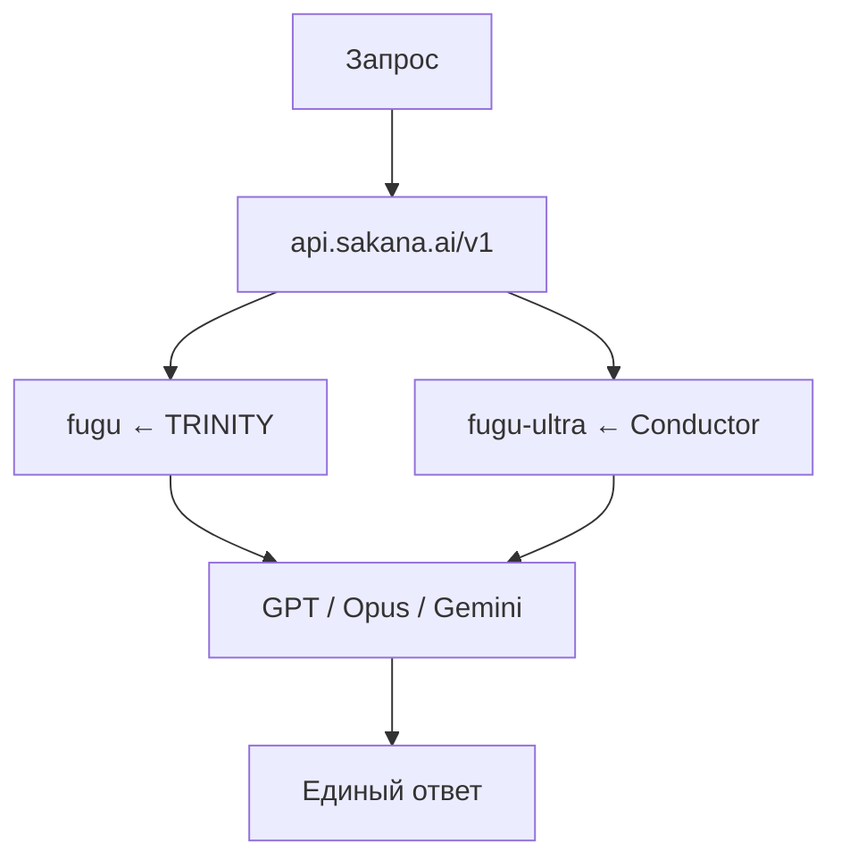

[Sakana Fugu](https://sakana.ai/fugu/) — мультиагентная система, которая снаружи ведёт себя как **одна LLM**: один OpenAI-совместимый endpoint, внутри — динамическая оркестрация GPT-5.5, Claude Opus 4.8 и Gemini 3.1 Pro. Основа продукта — две статьи ICLR 2026: **[TRINITY](https://arxiv.org/abs/2512.04695)** (быстрый роутер) и **[The Conductor](https://arxiv.org/abs/2512.04388)** (глубокий оркестратор workflow).

Эта статья — разбор архитектуры, бенчмарков, цены и **практического внедрения в коммерческий проект**. Связанные материалы VAIRL: [фундамент агентных систем](/vairl/blog/2026/07/02/agent-fundamentals-rag-mcp-landscape-ru/), [гибридный оркестратор DAG/FSM/BT](/vairl/blog/2026/06/26/hybrid-agent-dag-fsm-behavior-tree-ru/), [ИИ для МСБ](/vairl/blog/2026/07/02/ai-automation-smb-ru/).

---

## Карта статьи

| Раздел | О чём |
|--------|--------|
| [Идея](#идея-один-api-вместо-трёх-провайдеров) | Зачем оркестрация как отдельная ось масштабирования |
| [TRINITY → Fugu](#trinity--fugu-быстрый-роутер) | Эволюционный координатор, один worker на шаг |
| [Conductor → Fugu Ultra](#conductor--fugu-ultra-глубокий-оркестратор) | RL-workflow на естественном языке |
| [Выбор моделей](#как-происходит-выбор-моделей) | Роутинг, стратегии, пул агентов |
| [Бенчмарки](#бенчмарки) | Где опережает frontier-модели |
| [Цена](#цена-и-скрытый-overhead) | Тарифы и orchestration tokens |
| [Продакшен](#как-использовать-в-коммерческом-проекте) | API, compliance, checklist |
| [Ссылки](#источники) | Papers, документация, консоль |

---

## Идея: один API вместо трёх провайдеров

Frontier-модели **специализируются**: GPT силён в math и agentic coding, Opus — в debugging и security, Gemini — в science и factual recall. Вместо того чтобы ждать «следующую монолитную модель», Sakana предлагает **обученный оркестратор**, который:

- выбирает, **какую** модель вызвать;
- **делегирует** подзадачи и **верифицирует** ответы;
- **синтезирует** финальный результат за один API-вызов.



Пользователь **не проектирует** LangGraph-workflow вручную — это делает обученная модель. Подробности: [Technical Report](https://arxiv.org/html/2606.21228), [релиз](https://sakana.ai/fugu-release/).

---

## TRINITY → Fugu (быстрый роутер)

**Статья:** [TRINITY: An Evolved LLM Coordinator](https://arxiv.org/html/2512.04695)

| Аспект | TRINITY (исследование) | Fugu (продукт) |
|--------|------------------------|----------------|
| Координатор | ~0.6B SLM + голова ~10K параметров | Production backbone + selection head |
| Роли | Thinker / Worker / Verifier | **Только Worker** (упрощение) |
| Обучение | sep-CMA-ES | SFT → sep-CMA-ES на end-to-end траекториях |
| На шаг | 1 модель из пула | 1 worker, latency ≈ прямой вызов |

**Механизм выбора:** оркестратор читает **hidden state** (не генерирует текст), голова выдаёт logits по L моделям → softmax → dispatch. На multi-turn диалоге выбор **пересчитывается каждый turn** — например GPT строит код, Opus подключается в точке merge conflict.

**Обучение Fugu:**

1. **SFT** — на каждой задаче прогоняют всех workers, строят soft-распределение по наградам (KL-divergence).
2. **Evolution** — на реальных траекториях из Claude Code, Codex, OpenCode; оптимизируют terminal reward (задача решена / нет).

---

## Conductor → Fugu Ultra (глубокий оркестратор)

**Статья:** [Learning to Orchestrate Agents in Natural Language with the Conductor](https://arxiv.org/abs/2512.04388) · [блог Sakana](https://sakana.ai/learning-to-orchestrate/)

| Аспект | Conductor (исследование) | Fugu Ultra (продукт) |
|--------|--------------------------|----------------------|
| Размер | 7B LLM | Conductor + расширения |
| Обучение | GRPO | GRPO, до 5 шагов workflow |
| Выход | Workflow на NL | + function calling, shared memory |
| Адаптация | 1-shot для простых задач | planner–executor–verifier для сложных |

**Формат workflow** (каждый шаг):

- подзадача (natural language);
- `worker_id` — какая модель;
- `access list` — какие предыдущие ответы видит агент.

Топологии: best-of-N, цепочки, деревья debate, build+debug. **Recursive test-time scaling:** Conductor может выбрать **себя** как worker и перестроить pipeline при ошибке.

**Расширения Ultra:**

- **Intra-workflow isolation** — агенты не видят чужие tool calls (иначе orchestration collapse).
- **Persistent shared memory** — между workflow сохраняется контекст инструментов.

---

## Как происходит выбор моделей

### Fugu (пошаговый роутинг TRINITY)

```
state_t → hidden state → logits[L models] → worker_t → environment feedback → state_{t+1}
```

Эмерджентное поведение из [technical report](https://arxiv.org/html/2606.21228):

| Домен | Кого чаще выбирают |
|-------|-------------------|
| Terminal Bench | GPT-5.5 |
| GPQA-Diamond | Gemini 3.1 Pro |
| Math в HLE | GPT-5.5 |
| Chemistry / Biology | Gemini |

### Fugu Ultra (workflow Conductor)

| Стратегия | Пример |
|-----------|--------|
| Debate + aggregation | Gemini агрегирует, GPT и Gemini независимо решают листья |
| Build + debug | GPT builder → Opus verifier → feedback GPT |
| Specialist call | Opus (security) + GPT (math) на криптоанализе |

**Важно:** конкретный routing **не раскрывается** в API (proprietary).

### Пул агентов (production)

- **Gemini 3.1 Pro**
- **Claude Opus 4.8**
- **GPT-5.5**

Fable 5 и Mythos Preview **не в пуле** (нет публичного API), но сравниваются по бенчмаркам.

---

## Две версии: когда что выбирать

| | **Fugu** | **Fugu Ultra** |
|---|---|---|
| Основа | TRINITY | Conductor |
| Latency | Низкая | Высокая (минуты на сложных задачах) |
| Качество | Сильное, «повседневное» | Максимум на hard tasks |
| Custom pool | ✅ opt-out провайдеров | ❌ фиксированный пул |
| Типичные кейсы | Codex, чат, code review | Security audit, paper reproduction, patent research |

---

## Бенчмарки

По [technical report](https://arxiv.org/html/2606.21228) (baseline scores — от провайдеров):

| Бенчмарк | Fugu Ultra | Fugu | Лучший baseline |
|----------|----------:|-----:|----------------:|
| **SWE-Bench Pro** | **73.7** | 59.0 | Opus 69.2 |
| **Terminal Bench 2.1** | **82.1** | 80.2 | GPT 78.2 |
| **LiveCodeBench** | **93.2** | 92.9 | Gemini 88.5 |
| **LiveCodeBench Pro** | **90.8** | 87.8 | GPT 88.4 |
| **Humanity's Last Exam** | **50.0** | 47.2 | Opus 49.8 |
| **CharXiv Reasoning** | **86.6** | 85.1 | Opus 84.2 |
| **GPQA-Diamond** | **95.5** | **95.5** | Gemini 94.3 |
| **SciCode** | **60.1** | 58.7 | Gemini 58.9 |
| **MRCRv2** | **94.8** | 93.6 | GPT 94.8* |

\* GPT 94.8 на MRCRv2 — пограничное сравнение; Ultra лидирует на большинстве agentic/reasoning бенчмарков.

**За пределами таблиц:** AutoResearch (mean BPB 0.9774 vs 0.9781 у лучшего single-model), классическая японская каллиграфия (NED 0.776 vs 0.642).

---

## Цена и скрытый overhead

### Тарифы ([pricing](https://sakana.ai/fugu/))

| План | Цена |
|------|------|
| Standard / Pro / Max | $20 / $100 / $200 в месяц |
| **Fugu** (pay-as-you-go) | Ставка **top-tier** модели в пуле, без stacking |
| **Fugu Ultra** | $5/M input, $30/M output, $0.50/M cached (≤272K) |

### Orchestration tokens (только Ultra)

Реальная стоимость включает скрытые поля в `usage`:

```json
{
  "input_tokens_details": { "orchestration_input_tokens": 5463 },
  "output_tokens_details": { "orchestration_output_tokens": 1053 },
  "total_tokens": 7250
}
```

На сложных задачах **total_tokens в 5–12× больше** видимого output. Парсите `total_tokens`, не только `input_tokens` + `output_tokens`.

| Сравнение | Input | Output |
|-----------|------:|-------:|
| Fugu Ultra | $5/M | $30/M |
| Claude Fable 5 | $10/M | $60/M |

Номинально Ultra дешевле, но с overhead effective cost может быть выше ожиданий.

---

## Как использовать в коммерческом проекте

TRINITY и Conductor **не подключаются отдельно** — только через `model="fugu"` и `model="fugu-ultra"`.

### Быстрый старт

1. Ключ: [console.sakana.ai](https://console.sakana.ai)
2. Endpoint: `https://api.sakana.ai/v1`
3. Smoke test:

```bash
curl -X POST https://api.sakana.ai/v1/chat/completions \
  -H "Authorization: Bearer $SAKANA_API_KEY" \
  -H "Content-Type: application/json" \
  -d '{"model":"fugu","messages":[{"role":"user","content":"test"}]}'
```

### Python (Responses API — рекомендуется)

```python
import os
from openai import OpenAI

client = OpenAI(
    base_url="https://api.sakana.ai/v1",
    api_key=os.environ["SAKANA_API_KEY"],
)

def complete(prompt: str, *, ultra: bool = False):
    model = "fugu-ultra" if ultra else "fugu"
    return client.responses.create(
        model=model,
        input=prompt,
        reasoning={"effort": "xhigh" if ultra else "high"},
        timeout=600 if ultra else 90,
    )

# TRINITY: быстрый чат
r = complete("Объясни asyncio vs threading")

# Conductor: глубокий анализ
r = complete("Security review API: ...", ultra=True)
```

`reasoning.effort`: только `high` или `xhigh` (`max` — alias).

### Роутинг в приложении

```python
ULTRA_TASKS = {"security_audit", "paper_reproduction", "deep_code_review"}

def pick_model(task_type: str) -> str:
    return "fugu-ultra" if task_type in ULTRA_TASKS else "fugu"
```

### Compliance (только Fugu)

При создании API key: **Fugu custom model pool** → whitelist провайдеров. Для Ultra пул фиксирован. Opt-out обучения на ваших данных — в консоли.

### Codex CLI

```bash
curl -fsSL https://sakana.ai/fugu/install | bash
SAKANA_API_KEY=sk-... codex-fugu
```

Переключение `/model` между `fugu` и `fugu-ultra`. Для Ultra: `stream_idle_timeout_ms = 7200000` (2 часа).

### Production checklist

- [ ] Pay-as-you-go для prod
- [ ] Custom pool + opt-out training (если нужно)
- [ ] Парсер `orchestration_*_tokens` для Ultra
- [ ] Timeout: 60–90s (`fugu`), 300–7200s (`ultra`)
- [ ] **EU/EEA недоступен**
- [ ] Rate limit на Ultra; fallback `fugu` при timeout

### Типовые сценарии

| Сценарий | Model | Почему |
|----------|-------|--------|
| SaaS-чат | `fugu` | Latency |
| Premium «глубокий анализ» | `fugu-ultra` | Качество |
| CI code review | `fugu-ultra` | Больше находок |
| Vendor resilience | оба | Один API, сменяемый пул |

---

## Чем Fugu отличается от классических роутеров

| | Router / MoA | Fugu |
|---|-------------|------|
| Workflow | Фиксированный или 1-shot | Multi-round, адаптивный |
| Обучение | Hand-designed | SFT + evolution + RL |
| Интерфейс | Собираете pipeline сами | Один endpoint |
| Агрегатор | Одна модель всегда | Выбор под задачу |

---

## Источники

- [Sakana Fugu — продукт](https://sakana.ai/fugu/)
- [Релиз](https://sakana.ai/fugu-release/)
- [Technical Report](https://arxiv.org/html/2606.21228)
- [TRINITY (ICLR 2026)](https://arxiv.org/abs/2512.04695)
- [The Conductor (ICLR 2026)](https://arxiv.org/abs/2512.04388)
- [Get Started](https://console.sakana.ai/get-started)
- [Models API](https://console.sakana.ai/models)

---

*Обновлено: июль 2026. Цены и model ID проверяйте в консоли Sakana перед продакшеном.*
