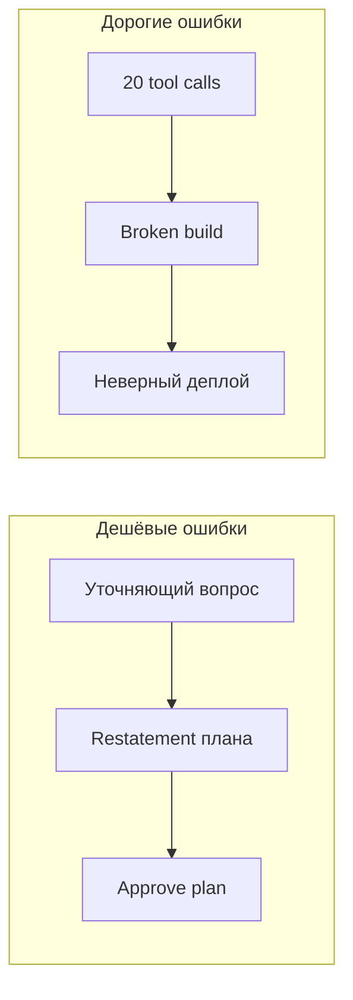
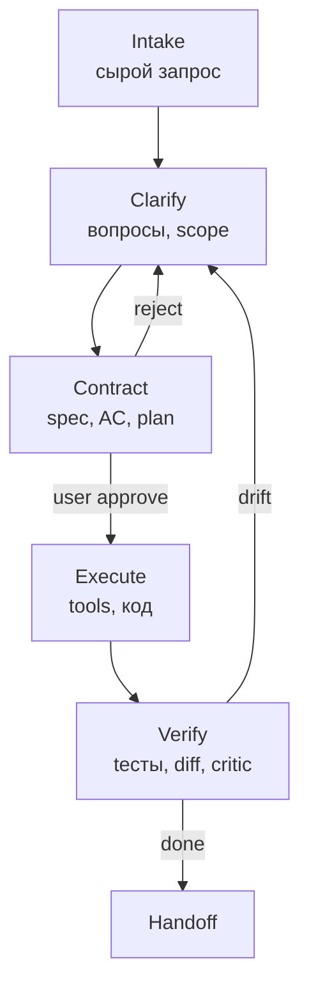
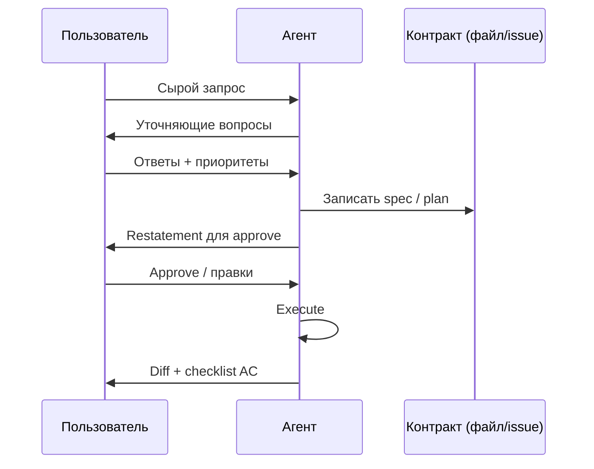

Большинство провалов coding-агентов — не «слабая модель», а **слабая постановка**: пользователь имел в голове одно, агент услышал другое, и оба узнали об этом только после двадцати tool calls и сломанного CI.

Этап **понимания сути задачи** — первый и самый дешёвый контур обратной связи. Пока цель не зафиксирована в проверяемом виде, любой ReAct-loop — это [анализ](/vairl/blog/2026/07/02/systems-theory-task-types-ru/) без известного **Y**: система движется, но неизвестно, куда должна прийти.

Ниже — как устроена **петля постановки** (intake → clarify → contract → execute → verify), какие механизмы для этого есть у агентов из [обзора 2026](/vairl/blog/2026/07/03/agent-landscape-memory-ru/), и какие **форматы формализации** превращают размытое «сделай нормально» в контракт, который можно проверить.

Связанные материалы: [типы задач U–S–Y](/vairl/blog/2026/07/02/systems-theory-task-types-ru/), [метакогниция и критик](/vairl/blog/2026/07/02/agent-metacognition-phase-space-ru/), [g3 и requirements.md](/vairl/blog/2026/06/25/g3-dialectical-autocoding-ru/), [нейросимволическое планирование](/vairl/blog/2026/06/25/neurosymbolic-planning-pipeline-ru/), [пример ТЗ](/vairl/blog/2026/07/02/projector-camera-yolo-spec-ru/), [RAC и уточнение запроса](/vairl/blog/2026/07/03/agent-rag-approaches-ru/).

---

## Карта статьи

| Раздел | О чём |
|--------|--------|
| [Зачем этап понимания](#зачем-этап-понимания-важнее-модели) | Стоимость ошибки, U vs Y |
| [Цикл постановки](#цикл-постановки-петля-обратной-связи) | Пять фаз и кибернетика |
| [Механизмы по агентам](#механизмы-постановки-и-проверки-по-агентам) | Claude, Cursor, Codex, g3… |
| [Проверка понимания](#как-проверить-что-агент-понял-задачу) | Restatement, gates, adversarial |
| [Формализация](#подходы-к-формализации-задачи) | Spec, BDD, PDDL, схемы |
| [Практика](#практический-чеклист) | Чеклист и антипаттерны |

---

## Зачем этап понимания важнее модели

В [теории систем](/vairl/blog/2026/07/02/systems-theory-task-types-ru/) постановка — это выбор, что **зафиксировано**:

| Обозначение | В агентном мире | Типичная ошибка |
|-------------|-----------------|-----------------|
| **U** (вход) | Prompt, файлы, constraints, бюджет | «Сделай рефакторинг» без scope |
| **S** (система) | Модель + оркестратор + tools | Меняют модель, не меняя Y |
| **Y** (выход) | PR, тесты, метрики, артефакт | Y не наблюдаем — нет критерия «готово» |

Пока **Y** не формализован хотя бы частично, агент решает **exploratory** задачу («только U»): исследует пространство, а не доставляет контракт. Это дорого по токенам и опасно по необратимым действиям (push, delete, отправка писем).

**Ключевой тезис:** инвестиция в clarify + contract окупается на порядок быстрее, чем смена Opus на Sonnet или добавление ещё одного sub-agent.



---

## Цикл постановки: петля обратной связи

Постановка — не одно сообщение, а **замкнутый контур** между пользователем и агентом (или оркестратором). Аналогия с [устойчивостью control loops](/vairl/blog/2026/06/29/agent-control-loop-stability-ru/): без измерения «понял ли агент» нет отрицательной обратной связи на этапе intake.



### 1. Intake — приём запроса

Пользователь формулирует намерение. Агент получает U: текст, @-файлы, issue, скриншот. На этом этапе **ничего необратимого** — только чтение и анализ.

### 2. Clarify — уточнение

Агент (или отдельный режим) выявляет **неоднозначности**: scope, non-goals, приоритеты, риски. Выход — список вопросов или structured choices. Это первый **sensor** понимания: если агент не задаёт вопросов на размытой задаче — красный флаг.

### 3. Contract — контракт

Фиксация **вне контекстного окна** (файл, issue, plan mode): что входит, что не входит, acceptance criteria, ограничения. Human gate: пользователь явно согласен. Без contract execute — виб-кодинг.

### 4. Execute — исполнение

Tool loop, код, PR. Контракт остаётся **якорем** — при drift план сверяется с requirements, а не с последним сообщением в чате.

### 5. Verify — проверка

Автоматические тесты, diff review, adversarial critic, LLM-as-judge по чеклисту. Замыкает петлю: если Y не достигнут — возврат в clarify или contract, а не бесконечный «ещё поправлю».

---

## Механизмы постановки и проверки по агентам

Полный перечень продуктов — в [обзоре агентов 2026](/vairl/blog/2026/07/03/agent-landscape-memory-ru/). Здесь — только слой **task specification**: как система помогает пройти цикл clarify → contract.

| Агент | Clarify / plan | Contract / память цели | Verify понимания | Human gate |
|-------|----------------|------------------------|------------------|------------|
| **[Claude Code](https://docs.anthropic.com/en/docs/claude-code)** | Интерактивный диалог; subagents для разведки | `CLAUDE.md`, Skills, `requirements`-подобные файлы | Пересказ плана в чате; hooks на tool use | Подтверждение опасных команд; `/compact` не заменяет approve |
| **[Cursor](https://cursor.com)** | **Plan mode** (read-only планирование); **Ask mode**; structured `AskQuestion` | `.cursor/rules`, `@` контекст, skills | План до Agent mode; diff перед apply | Approve edits; Smart mode для рискованных команд |
| **[OpenAI Codex](https://github.com/openai/codex)** | Диалог + `codex resume`; sub-agents | `AGENTS.md` (экосистема); cloud task state | Sandbox + narration шагов | Sandbox boundaries; user takeover |
| **[OpenCode](https://opencode.ai)** | Роль **`plan`** — read-only, без write-tools | SQLite-сессия; persisted messages | Разделение `plan` → `build`; doom-loop detection | Явный переход plan → build |
| **[g3](https://github.com/dhanji/g3)** | `--planning` → ветка `g3-plan/` | **`requirements.md`** — общий контракт Player/Coach | **Coach** сверяет с requirements независимо от Player | Coach APPROVED; лимит ходов (~10) |
| **[IDAD](https://idad.io/)** | Planner-агент в pipeline | План в **GitHub Issue** | Review-агент до Planner | **Human approve** плана в issue |
| **[Aider](https://aider.chat/)** | Чат + `/add` файлов | `.aider.chat.history.md`; repo map | Показ diff перед commit | `/commit`, ручной review diff |
| **[Pi](https://github.com/badlogic/pi-mono)** | Prompt templates, skills | Extensions; sub-agent isolation | Минимальный — инженер проектирует сам | Полный контроль через RPC/JSONL |
| **[ChatGPT Agent](https://openai.com)** | Диалог + виртуальный ПК | Облачная нить; connectors | Пошаговая narration | Approve sensitive; browser takeover |
| **[Hermes](https://github.com/NousResearch/hermes-agent)** | `delegate_task` на подзадачу | Profiles, SQLite, lineage compression | Sub-agent с чистым контекстом | Gateway между каналами |

### Claude Code и Cursor: два полюса одной идеи

**Claude Code** делает ставку на **проектную память**: `CLAUDE.md` автоматически попадает в каждый запуск — это не постановка одной задачи, а **долгосрочный контракт репозитория** (стиль, запреты, архитектура). Для разовой задачи поверх этого нужен явный план или файл требований.

**Cursor** разделяет **режимы по фазам цикла**:

- **Ask** — только понимание, без правок (анализ, чтение).
- **Plan** — план без исполнения; пользователь читает и корректирует до Agent.
- **Agent** — execute с tools.

Structured questions (`AskQuestion`) — механизм **принудительного clarify**: агент не угадывает между вариантами A/B, а выносит развилку пользователю. Это снижает [intent drift](/vairl/blog/2026/07/02/agent-metacognition-phase-space-ru/).

### OpenCode: plan как отдельный агент

Роль `plan` **физически не видит write-tools** — меньше риска «уже написал, пока думал». Переход `plan` → `build` — явный **phase gate**. Подходит, когда contract = утверждённый план в persisted session.

### g3 и IDAD: контракт вне окна LLM

Оба выносят цель в **артефакт, который переживает контекст**:

| | g3 | IDAD |
|---|-----|------|
| **Контракт** | `requirements.md` | Issue + комментарии + approved plan |
| **Проверка** | Coach adversarial | Review-агент + human на gate |
| **Память** | Fresh instance на ход | Fresh CLI на шаг pipeline |

g3 добавляет **adversarial verify**: Coach не доверяет самоотчёту Player — ловит «готово» без HTTPS, тестов, auth. IDAD — **организационный gate**: план в issue — audit trail для команды.

### Codex и ChatGPT Agent: execute с прозрачностью

У облачных агентов clarify часто **встроен в один тред**, но компенсируется **narration** (видно каждый шаг) и **sandbox / takeover**. Проверка понимания — через наблюдение траектории, а не отдельный contract-файл. Для кода слабее, чем `CLAUDE.md` + repo; для browser/automation сильнее за счёт виртуальной среды.

---

## Как проверить, что агент понял задачу

Проверка понимания — **не то же самое**, что проверка качества кода. Это meta-level: «правильная ли задача решается?»

| Механизм | Суть | Когда срабатывает | Пример в продуктах |
|----------|------|-------------------|-------------------|
| **Restatement** | Агент пересказывает цель своими словами | Перед execute | «План: я сделаю X, не трогая Y» |
| **Structured clarify** | Вопросы с вариантами, не свободный текст | Intake | Cursor `AskQuestion` |
| **Plan-before-act** | Read-only фаза без side effects | Contract | OpenCode `plan`, Cursor Plan mode |
| **Human approve gate** | Явное «да» на план/issue | Contract → Execute | IDAD, g3 planning, PR review |
| **Adversarial critic** | Второй агент ищет пробелы в понимании | Verify | g3 Coach, Fugu build+debug |
| **Executable AC** | Критерии = тесты, linter, schema | Verify | TDD, JSON Schema на output |
| **RAC (Clarification)** | Retrieval для уточнения неясного запроса | Clarify | [RAG-подходы](/vairl/blog/2026/07/03/agent-rag-approaches-ru/) |
| **Checklist sub-goals** | Декомпозиция Y на наблюдаемые пункты | Contract + Verify | [Метакогниция](/vairl/blog/2026/07/02/agent-metacognition-phase-space-ru/) |
| **Trajectory replay** | Сравнение плана и фактических tool calls | Post-hoc | [Телеметрия](/vairl/blog/2026/06/29/agent-telemetry-ru/), Langfuse |

### Сигналы, что понимание провалилось

- Агент сразу пишет код на «сделай лучше» без вопросов.
- План не упоминает **non-goals** (что не трогаем).
- В diff файлы вне заявленного scope.
- Player говорит «готово», Coach/тесты находят невыполненный AC.
- [Doom loop](/vairl/blog/2026/07/03/agent-landscape-memory-ru/) — повтор тех же tool calls (агент не знает, чего хотят).

### Петля с пользователем как «вторая часть»

В [метакогниции](/vairl/blog/2026/07/02/agent-metacognition-phase-space-ru/) пользователь на этапе contract — **meta-level контур**: он оценивает не код, а **соответствие намерению**. Хорошая практика — короткий цикл: агент → restatement → пользователь правит одной фразой → обновлённый contract. Не ждать финального PR, чтобы узнать о расхождении.



---

## Подходы к формализации задачи

Формализация — перевод намерения в **структуру, пригодную для проверки**. Уровни строгости:

| Уровень | Формат | Сила | Стоимость |
|---------|--------|------|-----------|
| 0 | Свободный промпт | Низкая | Минимальная |
| 1 | Bullet list + non-goals | Средняя | 5–10 мин |
| 2 | User story + AC (Given/When/Then) | Высокая для продукта | 15–30 мин |
| 3 | `requirements.md` / PRD / issue template | Высокая для кода | 30–60 мин |
| 4 | JSON Schema / OpenAPI на выход | Машинная проверка | Часы |
| 5 | PDDL / STRIPS + planner | Логическая согласованность | Дни (домен) |

### U + Y в одном документе (инженерный минимум)

Шаблон, совместимый с g3 и [примером ТЗ Projector AR](/vairl/blog/2026/07/02/projector-camera-yolo-spec-ru/):

```markdown
## Цель (Y)
Одно предложение: что должно существовать в конце.

## В scope
- ...

## Out of scope (non-goals)
- ...

## Acceptance criteria
- [ ] Измеримый критерий 1
- [ ] Критерий 2 (тест, команда, метрика)

## Ограничения
- Стек, бюджет, latency, безопасность

## Неопределённости (для clarify)
- Вопрос A? Варианты: ...
```

### BDD и executable specs

**Given / When / Then** — мост между продуктом и тестами. Агент генерирует scaffolding; verifier — pytest/Cucumber. Связь с [DBTF / USL](/vairl/blog/2026/07/01/margaret-hamilton-software-reliability-ru/): критерии приёмки до кода.

### Нейросимволика: PDDL и критик

Когда нужна **логическая проверяемость плана**, а не только текста — [пайплайн LLM → PDDL → критик](/vairl/blog/2026/06/25/neurosymbolic-planning-pipeline-ru/): нейромодуль извлекает предикаты и goal, планировщик строит последовательность действий, критик перепланирует при failed precondition. Тяжело для бытового coding, но эталон для робототехники и compliance.

### Тип задачи из теории систем

Перед формализацией — [классификация U, S, Y](/vairl/blog/2026/07/02/systems-theory-task-types-ru/):

| Ситуация | Тип | Что формализовать в первую очередь |
|----------|-----|-----------------------------------|
| Есть API, нужен код | Синтез (U+Y→S) | Y = контракт API + тесты |
| Агент уже работает, ищем баг | Идентификация (S+Y→U) | Y = failed trace, U = искомый prompt/args |
| «Сделай как в лучших продуктах» | Exploratory | Сначала clarify, потом Y |
| Нужен orchestrator под метрику | Управление (S+Y*→U) | Y* = target KPI |

### Skills и project rules как долгосрочный контракт

[Agent Skills](https://agentskills.io) и `CLAUDE.md` / `.cursor/rules` — **контракт уровня репозитория**: как писать, что запрещено, куда смотреть. Не заменяют task spec на фичу, но снижают объём clarify для повторяющихся задач.

---

## Сводка: где какой механизм сильнее

| Задача | Предпочтительный стек постановки |
|--------|----------------------------------|
| Разовая фича в своём репо | Cursor Plan → Agent или Claude Code + `requirements.md` |
| Длинный автономный coding | g3 `--planning` + Coach loop |
| Командный workflow | IDAD: issue → approved plan → implementer |
| Быстрый pair programming | Aider: узкий scope + `/add` + diff review |
| Исследование кодовой базы | OpenCode `plan` или Cursor Ask |
| Browser / automation | ChatGPT Agent: narration + takeover |
| Максимальный контроль | Pi + свой FSM поверх `pi-agent-core` |

---

## Практический чеклист

**Перед execute:**

1. **Y** сформулирован измеримо (хотя бы один автоматический или ручной AC).
2. **Non-goals** явно перечислены.
3. Агент сделал **restatement** — вы согласились или поправили.
4. Контракт **в файле или issue**, а не только в чате (для задач > 30 мин).
5. Выбран **gate**: plan mode, human approve, или Coach.

**После execute:**

6. AC прогнаны (тесты, lint, diff scope).
7. Траектория не ушла от contract ([телеметрия](/vairl/blog/2026/06/29/agent-telemetry-ru/)).
8. При drift — возврат в clarify, а не «допиши в конце».

**Антипаттерны:**

- «Агент сам разберётся» на задаче с необратимыми side effects.
- Один длинный чат без compaction **и** без внешнего contract — [context rot](/vairl/blog/2026/07/03/agent-landscape-memory-ru/).
- Подмена verify понимания verify кода: зелёные тесты на **не ту** спецификацию.
- Смена модели вместо уточнения Y.

---

## Литература и внешние ссылки

| Источник | Тема |
|----------|------|
| [Block AI — Adversarial Cooperation (g3)](https://block.xyz/documents/adversarial-cooperation-in-code-synthesis.pdf) | Контракт requirements + Coach |
| [agentskills.io](https://agentskills.io) | Портативные skills как процедурная память |
| [Anthropic — Claude Code docs](https://docs.anthropic.com/en/docs/claude-code) | CLAUDE.md, hooks, subagents |
| [OpenAI — Codex](https://github.com/openai/codex) | Sandbox, resume, cloud tasks |
| R. Fikes, STRIPS (1971) | Классическое планирование; основа PDDL |
| [Reflexion (Shinn et al.)](https://arxiv.org/abs/2303.11366) | Verbal reinforcement для self-critique |
| [Plan-and-Solve](https://arxiv.org/abs/2305.04091) | Явное планирование перед решением |

---

## Связанные публикации VAIRL

- [Обзор агентов 2026](/vairl/blog/2026/07/03/agent-landscape-memory-ru/) — Pi, Aider, Codex, Claude Code, g3…
- [Типы задач U–S–Y](/vairl/blog/2026/07/02/systems-theory-task-types-ru/) — классификация постановки
- [Метакогниция агента](/vairl/blog/2026/07/02/agent-metacognition-phase-space-ru/) — meta-level и критик
- [g3: диалектическое автокодирование](/vairl/blog/2026/06/25/g3-dialectical-autocoding-ru/) — requirements + Coach
- [Нейросимволическое планирование](/vairl/blog/2026/06/25/neurosymbolic-planning-pipeline-ru/) — PDDL и критик
- [ТЗ Projector AR Loop](/vairl/blog/2026/07/02/projector-camera-yolo-spec-ru/) — пример формализации
- [Пайплайн ролей агентов](/vairl/blog/2026/07/01/agent-lifecycle-pipeline-ru/) — gate между фазами
- [Карта компетенций агент-разработчика](/vairl/blog/2026/06/29/best-ai-agent-specialist-ru/) — постановка как навык
