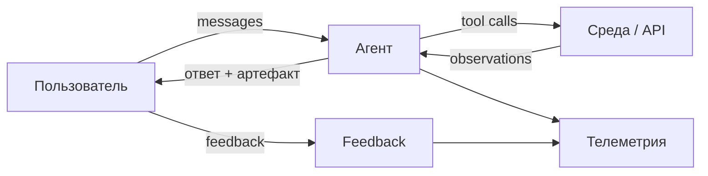
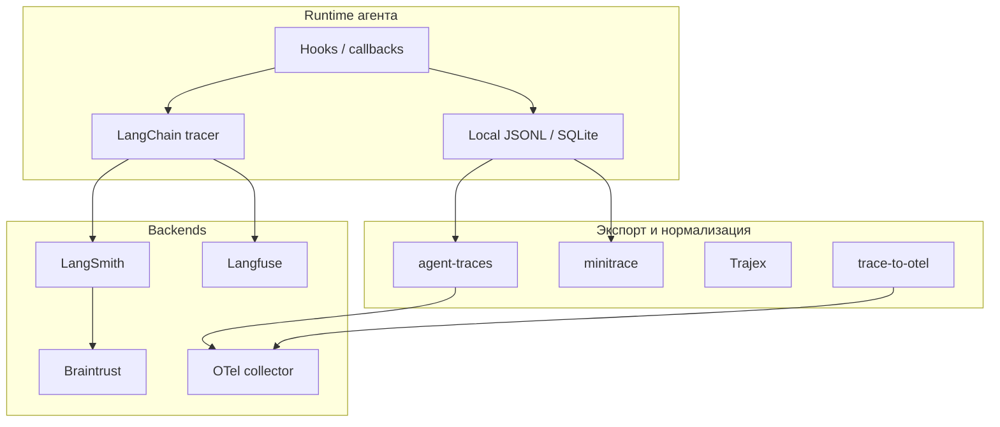
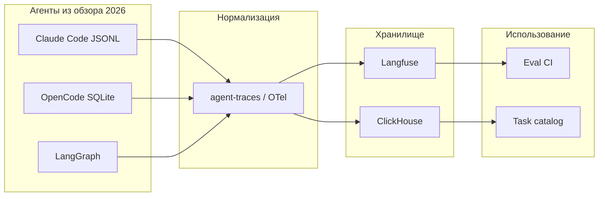

Один и тот же пользовательский запрос в разных агентах оставляет **разный след**: где-то полный JSONL с каждым `tool_result`, где-то только облачная нить без экспорта, где-то дерево OTel-span'ов с `session_id` на весь multi-turn диалог. Без сравнения этих подходов нельзя спроектировать **единый контур обратной связи** — от thumbs-up до regression CI.

В [общем обзоре телеметрии](/vairl/blog/2026/06/29/agent-telemetry-ru/) разобрано, *что* логировать и *куда* складывать; в [форматах траекторий](/vairl/blog/2026/07/02/agent-trajectory-formats-ru/) — *в каком виде* сериализуются шаги. Здесь — **сравнительный анализ по агентам** из [ландшафта 2026](/vairl/blog/2026/07/03/agent-landscape-memory-ru/) и смежным фреймворкам: какие **готовые механизмы** сбора телеметрии взаимодействия с пользователем уже есть, что пишется «из коробки», а что нужно достраивать.

Связанные материалы: [постановка задачи и trajectory replay](/vairl/blog/2026/07/04/agent-task-specification-ru/), [метакогниция и поля на шаге](/vairl/blog/2026/07/02/agent-metacognition-phase-space-ru/), [генерация бенчмарков](/vairl/blog/2026/06/29/agent-benchmark-generation-ru/), [устойчивость control loop](/vairl/blog/2026/06/29/agent-control-loop-stability-ru/), [MAESTRO](/vairl/blog/2026/07/01/maestro-airi-stack-ru/).

---

## Карта статьи

| Раздел | О чём |
|--------|--------|
| [Объект сравнения](#что-считать-телеметрией-взаимодействия) | Сообщения, tools, feedback, outcomes |
| [Таксономия подходов](#таксономия-подходов-к-сбору) | Локальный audit, SaaS, OTel, gateway |
| [Coding-агенты](#coding-агенты-terminal-first-и-ide) | Pi → g3, Cursor, Claude Code… |
| [Personal и workflow](#personal-агенты-и-github-native-pipeline) | Hermes, ChatGPT Agent, IDAD |
| [Фреймворки](#оркестраторы-и-мультиагентные-фреймворки) | LangGraph, CrewAI, AutoGen… |
| [Observability-платформы](#observability-платформы-и-конвертеры) | LangSmith, Langfuse, agent-traces… |
| [Сводные таблицы](#сводное-сравнение) | Быстрый выбор |
| [Практика](#что-выбрать-на-практике) | Стек под задачу |

---

## Что считать телеметрией взаимодействия

Под **взаимодействием с пользователем** в этой статье — всё, что образует замкнутый контур «запрос → диалог → результат → оценка»:

| Категория | Примеры полей | Зачем продукту |
|-----------|---------------|----------------|
| **Сообщения** | `user_message`, `assistant`, `system`, уточняющие вопросы | Task mining, replay, SFT |
| **Tool exchange** | `tool_name`, `args`, `result`, latency, error | Отладка, trajectory eval |
| **Подтверждения** | approve/deny опасных команд, plan gate | Аудит, compliance |
| **Обратная связь** | thumbs, rating, free-text, implicit (abandon) | Приоритизация eval |
| **Исход сессии** | `task_success`, `completed`, escalation | Sampling, regression |
| **Экономика** | tokens, cost_usd, steps_count | Бюджет, аномалии |
| **Handoff** (MAS) | `agent_id`, parent/child span, payload | Bottleneck, schema drift |

Не путать с **инфраструктурной** observability (CPU, GPU, queue depth): здесь фокус на **семантике диалога и действий**, которую потом едят eval, task catalog и [кластеризация трасс](/vairl/blog/2026/07/02/agent-trajectory-formats-ru/#индустриальные-практики-телеметрия--анализ--кластеры--fsm).

---

## Таксономия подходов к сбору

Перед разбором по агентам — четыре семейства механизмов, которые встречаются в 2025–2026:

| Подход | Суть | Типичные носители | Сильные стороны | Слабые стороны |
|--------|------|-------------------|-----------------|----------------|
| **Локальный audit log** | Агент пишет JSONL/SQLite на диск пользователя | Claude Code, Codex, Pi, OpenCode | Полный контроль, offline, replay | Нет централизованной аналитики без ETL |
| **In-process hooks / callbacks** | Before/after на узлах графа, tool, turn | LangGraph, CrewAI callbacks, Claude Hooks | Богатые поля, низкая латентность | Нужно поддерживать схему в коде |
| **Observability SaaS** | Экспорт traces в облачный backend | LangSmith, Langfuse, Braintrust | UI, datasets, human review, Topics | Vendor lock-in, PII, cost |
| **Стандарт OTel + GenAI semconv** | Spans с `gen_ai.*` attributes | AutoGen 0.4+, Langfuse, custom | Переносимость, Jaeger/Tempo/Datadog | Не все агенты эмитят нативно |
| **API gateway** | Прокси логирует completion'ы | Helicone, Portkey | Нулевая интеграция в runtime | Не видит tool side effects вне LLM |
| **Training-ready export** | Сразу JSONL под SFT/RL | Hermes `trajectory_samples.jsonl` | Мост телеметрия → обучение | Узкая схема, не universal OTel |

**Паттерн зрелых команд** (см. [индустриальные практики](/vairl/blog/2026/07/02/agent-trajectory-formats-ru/#как-собирают-телеметрию-компании-агенты)): instrumentation в runtime → observability backend → nightly ETL в Parquet/ClickHouse для кластеризации.

---

## Coding-агенты: terminal-first и IDE

Список агентов — из [обзора 2026](/vairl/blog/2026/07/03/agent-landscape-memory-ru/) и [постановки задачи](/vairl/blog/2026/07/04/agent-task-specification-ru/).

### Сводная таблица: что пишется при взаимодействии

| Агент | Где хранится | Формат | Сообщения user/assistant | Tool I/O | Approvals / gates | Feedback | Cost / tokens | Экспорт |
|-------|--------------|--------|:------------------------:|:--------:|:-----------------:|:--------:|:-------------:|---------|
| **Claude Code** | `~/.claude/projects/…` | JSONL events (`type`, `sessionId`) | ✅ | ✅ | ✅ hooks на tool | ❌ нативно | частично в events | локальный JSONL |
| **Cursor** | облако + локальный state | проприетарный | ✅ | ✅ в Agent mode | ✅ Smart mode, approve | implicit | usage в аккаунте | ограниченный |
| **Codex** | локально + Codex Cloud | JSONL `type: item` | ✅ | ✅ | ✅ sandbox prompts | ❌ | в TUI / cloud | JSONL, cloud tasks |
| **OpenCode** | **SQLite** (server) | реляционная схема + SSE | ✅ persisted | ✅ | plan → build gate | ❌ | metadata в БД | API server / export |
| **Pi** | сессионные файлы | JSONL (`type` events) | ✅ | ✅ | через extensions | ❌ | `--json` RPC | JSONL, [pi-mono datasets](https://github.com/badlogic/pi-mono) |
| **Aider** | in-memory + опц. файл | чат + git commits | ✅ | частично (diff) | `/commit` как gate | ❌ | API billing снаружи | `.aider.chat.history.md` |
| **g3** | scrollback + файлы | лог coach/player | ✅ (два потока) | ✅ + thinning refs | Coach APPROVED | ❌ | `/stats` | git + requirements как audit |
| **py-code-agent** | session tree | ReAct log + plugins | ✅ | ✅ | plugin-dependent | ❌ | hooks | fork/branch export |

### Claude Code

| Аспект | Детали |
|--------|--------|
| **Механизм** | Event-sourced **JSONL** на диск: каждое сообщение, tool_use, tool_result — отдельное событие с `uuid` и `sessionId` |
| **Hooks** | `PreToolUse`, `PostToolUse`, `SessionStart`, `PreCompact` — кастомная телеметрия и redaction **до** записи |
| **Sub-agents** | Изолированные треды; в родителя — summary → для телеметрии нужно **связывать** `parent_session_id` |
| **Пробелы** | Нет встроенного thumbs-up; cost агрегируется снаружи (API dashboard) |
| **Нормализация** | [agent-traces](https://github.com/davanstrien/agent-traces), [minitrace](https://github.com/wesen/minitrace) |

**Вывод:** лучший пример **локального audit-first** coding-агента с расширяемыми hooks; для продакшен-аналитики — ETL в Langfuse/Parquet.

### Cursor

| Аспект | Детали |
|--------|--------|
| **Механизм** | IDE-агент: диалог, Plan/Ask/Agent modes, structured `AskQuestion` — телеметрия **продуктовая** (облако Cursor) |
| **Пользовательское взаимодействие** | Plan mode фиксирует фазу уточнения; Agent mode — tool loop с approve edits |
| **Пробелы** | Нет открытого JSONL-трейса как у Claude Code; `.cursor/rules` не заменяет trajectory export |
| **Интеграция** | MCP tools логируются в контексте сессии IDE; внешний OTel — только если оборачивать API вызовы |

**Вывод:** сильная **UX-телеметрия** (modes, approvals), слабая **исследовательская выгрузка** — для сравнения с Codex/Pi нужны проприетарные или proxy-методы.

### OpenAI Codex

| Аспект | Детали |
|--------|--------|
| **Механизм** | JSONL с обёрткой `type: "item"` + `payload`; **`codex resume`** восстанавливает сессию |
| **Cloud** | Codex Cloud tasks — отдельное хранилище состояния и narration для облачных задач |
| **Sub-agents** | Делегирование с изолированным контекстом; родитель видит агрегированный итог |
| **Нормализация** | agent-traces, minitrace; публичные trace-датасеты для исследований |

**Вывод:** паритет с Claude Code по **локальному JSONL**; cloud-ветка добавляет **серверную** телеметрию длинных задач.

### OpenCode

| Аспект | Детали |
|--------|--------|
| **Механизм** | **Client/server**: SQLite — каноническое хранилище messages, tool calls, metadata |
| **Особенность** | Сессия переживает обрыв TUI → телеметрия **не привязана к процессу терминала** |
| **Роли** | `plan` / `build` / `explore` — разные tool sets → в логах видна **фаза** взаимодействия |
| **Doom-loop detection** | Косвенная телеметрия аномалий (повторяющиеся tool calls) |

**Вывод:** единственный open-source CLI с **SQL-first** моделью сессии — удобно для internal dashboards без SaaS.

### Pi

| Аспект | Детали |
|--------|--------|
| **Механизм** | Минимальный event loop; JSONL + `--json` RPC для встраивания |
| **Расширяемость** | Extensions — место для custom telemetry SDK |
| **Sub-agents** | Изоляция контекста; в родителя — только итог |

**Вывод:** телеметрия **на совести интегратора**; зато максимальная прозрачность формата.

### Aider

| Аспект | Детали |
|--------|--------|
| **Механизм** | Scrollback-чат; **git commit** как внешний audit trail изменений |
| **Tool I/O** | Не полный ReAct-log: акцент на **diff** и repo map, не на каждый bash |
| **История** | Опционально `.aider.chat.history.md` |

**Вывод:** телеметрия **смещена в git**, а не в trajectory DB — для [task mining](/vairl/blog/2026/06/29/agent-telemetry-ru/#список-задач-пользователя-task-mining) нужен дополнительный слой.

### g3

| Аспект | Детали |
|--------|--------|
| **Механизм** | Два потока: **Player** (действия) и **Coach** (вердикты); fresh instance на ход |
| **Артефакты** | `requirements.md`, git, thinned file refs — **контрактная** телеметрия поверх чата |
| **Команды** | `/stats`, `/compact`, `/thinnify` — introspection бюджета контекста |

**Вывод:** уникальный случай **adversarial telemetry**: важны не только messages, но и **независимые вердикты Coach** — аналог `meta_verdict` из [метакогниции](/vairl/blog/2026/07/02/agent-metacognition-phase-space-ru/).

---

## Personal-агенты и GitHub-native pipeline

### Hermes Agent

| Аспект | Детали |
|--------|--------|
| **Механизм** | **SQLite** на сервере gateway; долгоживущие сессии между Telegram/Discord/CLI |
| **Training export** | `trajectory_samples.jsonl` / `failed_trajectories.jsonl` с `completed`, `tool_stats` |
| **Нормализация** | ShareGPT-стиль (`human`/`gpt`/`tool`), XML для thinking/tools |
| **Мульти-канал** | Один `session_id` на пользователя across channels — редкий случай **сквозной** user telemetry |

**Вывод:** телеметрия и **SFT-экспорт совмещены** — эталон для RL-команд.

### ChatGPT Agent (Agent Mode)

| Аспект | Детали |
|--------|--------|
| **Механизм** | Облачная нить диалога + **narration** шагов (browser, terminal) |
| **Взаимодействие** | Approve sensitive actions; browser takeover — событие в UX, не обязательно в export |
| **Connectors** | Live fetch из Gmail/Drive — tool results не всегда воспроизводимы offline |
| **Экспорт** | Ограничен историей чата в продукте; нет OTel для разработчика |

**Вывод:** богатая **продуктовая** телеметрия у вендора, **закрытая** для командной аналитики.

### IDAD

| Аспект | Детали |
|--------|--------|
| **Механизм** | Телеметрия = **GitHub Issue + комментарии + PR**; каждый шаг pipeline — fresh CLI |
| **User gates** | Human approve плана в issue — явное событие в audit trail |
| **Пробелы** | Нет единого LLM trace; handoff между Planner/Implementer — через артефакты git |

**Вывод:** **workflow telemetry** вместо conversation telemetry — идеально для compliance, слабо для trajectory-level eval без конвертации issue → trace.

### py-code-agent

| Аспект | Детали |
|--------|--------|
| **Механизм** | ReAct log + **session tree** (fork/branch) |
| **Плагины** | pluggy hooks для custom backends |
| **Особенность** | Ветвление альтернативных диалогов — телеметрия **дерева**, не линии |

---

## Оркестраторы и мультиагентные фреймворки

| Фреймворк | Нативный сбор | Формат | User messages | Multi-agent | Рекомендуемый backend |
|-----------|---------------|--------|:-------------:|:-----------:|----------------------|
| **LangChain / LangGraph** | callbacks, `@traceable` | BaseMessage + runs tree | ✅ | ✅ node spans | **LangSmith** |
| **CrewAI** | stdout, callbacks, `crew_output` | ReAct text | ✅ (Task prompt) | ✅ per-agent | Trajex emitter |
| **AutoGen 0.4+** | **OpenTelemetry** | spans + `chat_messages` | ✅ | ✅ group chat `name` | OTel → Jaeger/Langfuse |
| **OpenAI Agents SDK** | `RunResult`, processors | items: message, tool, handoff | ✅ | ✅ handoff spans | custom JSONL + Langfuse |
| **Pydantic AI** | instrumented runs | structured log | ✅ | partial | Trajex, OTel |
| **MAESTRO** | CLI + platform logs | issue/PR + evolve traces | через underlying agent | ✅ multi-role | gigaevo-platform + Git |
| **Sakana Fugu** | API billing | opaque orchestration | ✅ (единый ответ) | внутренний router | только API metrics |

### LangGraph + LangSmith

- Каждый **узел графа** — span → видны loop'ы, retries, `interrupt`.
- **Threads** связывают multi-turn user session.
- **Trajectory evals** — проверка порядка tools, не только финального ответа.
- **Insights** — кластеризация продакшен-трасс по темам и failure modes.

### CrewAI

- Нативный лог — **текстовый** Thought/Action/Observation; для аналитики — [Trajex `trace_from_crew_output`](https://pypi.org/project/trajex/).
- Callbacks на task/agent level — точка для custom `outcome` и `cost`.

### AutoGen

- С v0.4 акцент на **OTel** — лучший открытый путь к единому backend для group chat.
- Поле `name` на сообщении — обязательно для [MAS-телеметрии](/vairl/blog/2026/06/29/agent-telemetry-ru/#1-фундаментальная-теория-ai-агентов-и-систем) (Wooldridge).

---

## Observability-платформы и конвертеры

### Платформы (SaaS / self-hosted)

| Платформа | Модель | User interaction | Datasets / eval | Кластеризация | Open-source |
|-----------|--------|------------------|-----------------|---------------|:-------------:|
| **LangSmith** | SaaS | threads, runs, feedback scores | ✅ native | Insights | ❌ |
| **Langfuse** | SaaS + self-host | traces, generations, scores | ✅ | custom ETL | ✅ |
| **Braintrust** | SaaS | spans, scores | ✅ eval-first | **Topics** (Task/Issues facets) | partial |
| **Arize Phoenix** | SaaS + local | traces, embeddings | eval | drift | ✅ client |
| **W&B Weave** | SaaS | online traces | experiments | — | ❌ |
| **Helicone / Portkey** | gateway | request/response LLM | — | — | partial |

### Конвертеры и нормализаторы

| Инструмент | Вход | Выход | Фокус на user interaction |
|------------|------|-------|----------------------------|
| **[agent-traces](https://github.com/davanstrien/agent-traces)** | Pi, Claude Code, Codex, ATIF | Parquet: sessions/events/content | полный event stream |
| **[minitrace](https://github.com/wesen/minitrace)** | 11+ агентов | `.minitrace.json` | turns, tool_calls, metrics |
| **[Trajex](https://pypi.org/project/trajex/)** | LangChain, CrewAI, OpenAI Agents | `Trace` JSON | behavioral assertions |
| **[trace-to-otel](https://github.com/MukundaKatta/trace-to-otel)** | JSONL audit | OTLP spans | retrofit без SDK |
| **Hermes `trajectory.py`** | internal API | ShareGPT JSONL | training + completed flag |

---

## Сводное сравнение

### По зрелости телеметрии взаимодействия

| Уровень | Агенты / стеки | Что уже есть |
|---------|----------------|--------------|
| **A — полный локальный audit** | Claude Code, Codex, OpenCode, Hermes | messages + tools + session persist |
| **B — audit + hooks** | Pi, py-code-agent, LangGraph | расширяемая схема, OTel optional |
| **C — артефактный audit** | g3, IDAD, Aider | git/issue/requirements как source of truth |
| **D — продуктовый closed** | Cursor, ChatGPT Agent, Fugu | UX telemetry у вендора |
| **E — framework-default** | CrewAI (text), LangChain без tracer | нужен явный backend |

### Матрица: канал пользователя → что логируется

| Канал | Примеры агентов | Типичные события |
|-------|-----------------|------------------|
| **Terminal REPL** | Claude Code, Aider, g3 | message, tool_use, tool_result, compact |
| **Full-screen TUI** | Codex, Pi, OpenCode | item/event stream, approvals overlay |
| **IDE** | Cursor, Claude Code plugin | plan/agent mode, diff approve, @ context |
| **Messenger gateway** | Hermes | cross-channel session, delegate_task |
| **Web / cloud** | ChatGPT Agent | narration, connector fetch, takeover |
| **GitHub** | IDAD | issue comment, plan approve, PR |

### Мультиагентная телеметрия: обязательные поля

Из [обзора траекторий](/vairl/blog/2026/07/02/agent-trajectory-formats-ru/#мультиагентные-системы-что-логируют-отдельно) — независимо от агента:

| Поле | Зачем |
|------|-------|
| `session_id` / `thread_id` | Связать turns и агентов |
| `agent_id` / `role` | Per-agent error rate |
| `handoff_id`, `parent_span` | Fidelity передачи context |
| `user_feedback` на сессию | Приоритет в eval |
| `outcome` + `failure_reason` | Sampling и regression |

---

## Антипаттерны по агентам

| Ситуация | Риск | Что делать |
|----------|------|------------|
| Только gateway (Helicone) на Codex/Claude | Нет tool side effects | Дополнить application-level JSONL |
| Cursor без внешнего audit | Нельзя сравнить с Pi в CI | Proxy API или ручной export сессий |
| CrewAI stdout без Trajex | Потеря структуры tools | Emitter + Parquet nightly |
| g3 без логирования Coach verdict | Пропуск adversarial сигнала | Писать `meta_verdict` в отдельный stream |
| IDAD только issue text | Нет pass^k replay | Сохранять underlying CLI JSONL per step |
| 100% логов в LangSmith без sampling | Cost explosion | 100% errors + 10% success ([sampling](/vairl/blog/2026/06/29/agent-telemetry-ru/#sampling)) |

---

## Что выбрать на практике

| Задача | Рекомендация |
|--------|--------------|
| **Сравнить Claude Code vs Codex vs Pi** на одних задачах | agent-traces или minitrace → Parquet |
| **LangGraph в продакшене** | LangSmith или Langfuse + OTel GenAI semconv |
| **Eval-first, кластеры задач** | Braintrust Topics или LangSmith Insights |
| **On-prem, GDPR** | Langfuse self-host + PostgreSQL + S3 blobs |
| **Personal bot 24/7** | Hermes SQLite + nightly ShareGPT export |
| **GitHub workflow audit** | IDAD + опционально JSONL underlying CLI |
| **Adversarial coding** | g3 logs + `requirements.md` + git как triple audit |
| **Retrofit без изменения агента** | trace-to-otel из JSONL |
| **CI на поведение** | Trajex assertions (`no_loop`, ordering) |

### Минимальный унифицированный стек

Для команды, которая использует **несколько** агентов из обзора:

1. **Канонический слой** — OpenTelemetry GenAI conventions или Parquet schema agent-traces.
2. **Единый `session_id`** — W3C Trace Context сквозь gateway и sub-agents.
3. **Обязательные поля** — `user_message`, `task_label`, `outcome`, `cost`, `agent_version`.
4. **Backend** — Langfuse (self-host) или ClickHouse для analytics.
5. **Nightly** — task_label extraction → embed → cluster ([task mining](/vairl/blog/2026/06/29/agent-telemetry-ru/)).
6. **Weekly** — failure clusters → eval backlog ([бенчмарки](/vairl/blog/2026/06/29/agent-benchmark-generation-ru/)).

---

## Резюме

1. **Coding-агенты** сходятся к **локальному event log** (JSONL или SQLite), но различаются полнотой tool I/O и возможностью export.
2. **LangGraph / AutoGen** — мир **span-based** телеметрии; **CrewAI** — текстовый лог, нормализуемый Trajex.
3. **Hermes** — редкий случай, где телеметрия = **training corpus**; **IDAD/g3** — **артефактный** audit вместо длинного чата.
4. **Cursor, ChatGPT Agent, Fugu** — богатая UX-телеметрия у вендора, слабый открытый доступ для командной аналитики.
5. **Конвертеры** (agent-traces, minitrace, Trajex) — мост между агентами; без них сравнение [ландшафта 2026](/vairl/blog/2026/07/03/agent-landscape-memory-ru/) невозможно.
6. Общая схема полей и пайплайн — в [базовой статье про телеметрию](/vairl/blog/2026/06/29/agent-telemetry-ru/); форматы сериализации — в [форматах траекторий](/vairl/blog/2026/07/02/agent-trajectory-formats-ru/).

---

## Источники

- [Обзор телеметрии VAIRL](/vairl/blog/2026/06/29/agent-telemetry-ru/) · [Форматы траекторий](/vairl/blog/2026/07/02/agent-trajectory-formats-ru/) · [Ландшафт агентов 2026](/vairl/blog/2026/07/03/agent-landscape-memory-ru/)
- [OpenTelemetry GenAI semantic conventions](https://opentelemetry.io/docs/specs/semconv/gen-ai/)
- [LangSmith — threads, trajectory evals](https://docs.smith.langchain.com/) · [Langfuse docs](https://langfuse.com/docs) · [Braintrust Topics](https://www.braintrust.dev/blog/topics)
- [agent-traces](https://github.com/davanstrien/agent-traces) · [minitrace](https://github.com/wesen/minitrace) · [Trajex](https://pypi.org/project/trajex/)
- [Hermes trajectory format](https://hermes-agent.nousresearch.com/docs/developer-guide/trajectory-format) · [Claude Code hooks](https://code.claude.com/docs/en/hooks)
