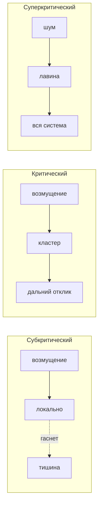

Три области, на первый взгляд несвязанные — **спайковая активность коры**, **заторы в сыпучих средах (jamming)** и **классические фазовые переходы** в термодинамике — описываются одним и тем же каркасом: система движется по **контрольному параметру** к **критической точке**, где корреляции удлиняются, распределения становятся степенными, а режим передачи «сигнала» (возбуждения, силы, порядка) меняется качественно.

Ниже — краткие обзоры процессов в каждой области, классификация фазовых переходов (которую вы уже знаете из термодинамики), и **таблица общих метрик**, на которую можно опереться и в нейронауке, и в физике джемминга, и при проектировании сложных систем (включая AI-агентов — см. [устойчивость control loops](/vairl/blog/2026/06/29/agent-control-loop-stability-ru/)).

---

## Зачем один язык для трёх дисциплин

| Домен | Что «переходит» | Контрольный параметр (примеры) | Что измеряют на границе |
|-------|-----------------|--------------------------------|-------------------------|
| **Нейронаука** | Режим распространения спайков | Сила синаптической передачи, возбудимость сети | Размер нейронных лавин, длина корреляции |
| **Джемминг-физика** | Жидкость ↔ твёрдое «стекло» из шариков | Плотность упаковки φ, нагрузка, температура | Размер кластеров застревания, податливость |
| **Термодинамика** | Фаза A ↔ фаза B | Температура T, давление P, поле H | Теплоёмкость, сжимаемость, параметр порядка |

Общая интуиция: **субкритически** возмущение затухает; **критически** — распространяется на все масштабы без взрыва; **суперкритически** — растёт лавинообразно.



---

## Фазовые переходы: напоминание классификации

В физике фазовые переходы классифицируют по термодинамическим свойствам и поведению системы. Исторически (по Эренфесту) их разделяют по тому, **какая производная термодинамического потенциала испытывает скачок**. В современной физике выделяют два основных рода и особые пограничные случаи.

### Переходы первого рода (скачкообразные)

Первые производные потенциала (объём, энтропия) меняются **скачком**. Выделяется или поглощается **скрытая теплота**; плотность и объём скачком меняются. Возможны перегрев и переохлаждение; в точке перехода **сосуществуют две фазы** (вода и лёд).

Примеры: плавление льда, кипение, сублимация сухого льда.

### Переходы второго рода (непрерывные)

Первые производные непрерывны, скачок — у **вторых** производных (теплоёмкость, сжимаемость, магнитная восприимчивость). Теплота перехода Q = 0; объём меняется плавно. **Сосуществования фаз нет**; меняется **симметрия** системы.

Примеры: переход ферромагнетик → парамагнетик (точка Кюри), сверхпроводимость, сверхтекучесть гелия.

| Свойство | I род | II род |
|----------|-------|--------|
| Теплота перехода Q | ≠ 0 | = 0 |
| Объём, плотность | скачок | непрерывно |
| Сосуществование фаз | да | нет |
| Симметрия | скачок | непрерывно |

### Редкие и особые случаи

- **Высшие роды** (3-й и далее по Эренфесту): в природе почти не встречаются; всё выше I рода обычно относят к **непрерывным** переходам.
- **Квантовые фазовые переходы**: при T → 0; драйвер — не тепловые, а квантовые флуктуации (давление, поле, состав).
- **Топологические** (Березинский — Костерлица — Таулес): в 2D нет классического параметра порядка, но связываются/разрываются топологические дефекты (вихри).

**Связь с критичностью:** переходы **II рода** — канонический пример **критической точки**: теплоёмкость и сжимаемость **расходятся** (χ → ∞), корреляционная длина ξ → ∞, возникают **степенные законы** — тот же математический язык, что у нейронных лавин и джемминга.

---

## Нейронаука: гипотеза критичности

### Процесс в двух словах

Кора — огромная сеть пороговых элементов (нейронов) с **балансом возбуждения и торможения**. **Гипотеза критичности** (criticality hypothesis): в рабочем режиме сеть находится **на границе** между:

- **субкритическим** режимом (цепочка спайков затухает — «слишком много торможения»);
- **суперкритическим** (активность размножается лавинообразно — эпилептиформный хаос).

В критической точке, по данным экспериментов и моделей (John Beggs, *The Cortex and the Critical Point*), оптимизируется **передача и хранение информации**: возникают **нейронные лавины** — каскады активности разного размера с **степенным распределением** P(s) ~ s^−τ.

### Ключевые метрики

| Метрика | Смысл | Суб / крит / супер |
|---------|-------|---------------------|
| **Branching ratio σ** | Среднее число «дочерних» спайков на один спайк | σ < 1 / ≈ 1 / > 1 |
| **Размер лавины s** | Число нейронов в одном каскаде | Распределение с обрезанным хвостом / степенной / взрывной рост |
| **Корреляционная длина ξ** | На каком расстоянии ещё коррелирована активность | Короткая / длинная / бесконечная (в пределе) |
| **Критическое замедление** | Всплеск автокорреляции во времени у T_c | Аналог у сети: длинные «хвосты» в inter-spike interval |

### Self-organized criticality (SOC)

Модель Бака (песочница): система **сама** подводит себя к критической точке без внешней точной подстройки параметра — через локальные правила и «лавины» сброса. В нейронауке спорят, насколько кора буквально SOC, но **метрики лавин** остаются рабочим инструментом.

### Краткий обзор эксперимента

1. Записывают многоканальную активность (электроды, кальций-имиджинг).
2. Детектируют **лавины** — связные кластеры активных событий в окне времени.
3. Строят P(s); оценивают σ из branching process.
4. Сравнивают с null-моделями (перемешанные метки времени → хвост обрезается).

---

## Джемминг-физика: фазовый переход без температуры

### Процесс в двух словах

**Jamming** — переход между **неупорядоченной жидкостью** (шарики, пена, клетки, гранулы текут) и **жёстким аморфным** состоянием (система «застряла» — не может минимизировать энергию без глобальной перестройки). В отличие от кристаллизации, **нет периодического порядка**; в отличие от обычного стеклования, переход может происходить **при T = 0** — чисто геометрический.

Контрольные параметры:

- **φ** — объёмная доля занятого пространства (плотность упаковки);
- внешняя **нагрузка** или **сжатие**;
- в температурных системах — T (стеклообразование).

У **точки джемминга** φ → φ_c система **критична**: малое возмущение (сдвиг одного зерна) может запустить **лавину перестройок** — по аналогии с нейронным каскадом.

### Три «оси» фазовой диаграммы (Liu & Nagel)

Джемминг часто изображают в пространстве (T, φ, нагрузка): **температурное стекло**, **коллоидное стекло**, **джемминг athermal** — разные грани одного ландшафта **застревания** (frustration).

### Ключевые метрики

| Метрика | Аналог в нейронауке | Аналог в термодинамике |
|---------|---------------------|-------------------------|
| **φ − φ_c** | σ − 1 | T − T_c |
| **Размер кластера застревания** | Размер лавины s | Размер домена флуктуаций |
| **Податливость χ** | Чувствительность к стимулу | Сжимаемость / восприимчивость |
| **Параметр порядка** (напр. доля «замороженных» контактов) | Доля активных в лавине | Магнитизация M(T) |

### Краткий обзор эксперимента

1. Монодисперсные сферы в 2D/3D; сжатие или смена φ.
2. Измеряют **stress–strain**: переход от текучести к пласто-упругому отклику.
3. При φ ≈ φ_c — **степенные** распределения размеров нестабильностей.
4. Сравнение с **перколяцией** контактов: джемминг богаче геометрией, чем чистая связность графа.

---

## Игровая физика: инженерный частный случай

В **игровых движках** редко считают χ и τ, но **та же логика режимов** видна явно:

| Игровой объект | Субкритический аналог | Критический | Суперкритический |
|----------------|----------------------|-------------|------------------|
| **Ragdoll / constraints** | Тело «мёртвое», импульс гаснет | Устойчивый отклик на удар | Разлёт суставов, tunneling, взрыв solver |
| **Частицы (snow, sand)** | Частицы исчезают локально | Правдоподобная лавина | FPS collapse, бесконечный spawn |
| **Состояния материала** (вода/лёд) | Переход I рода в коде | — | Глитч сосуществования двух collider |
| **Цепочка событий (combo)** | Combo обрывается | Длинная цепь без раздувания | Бесконечный multiplier, overflow |

Полезный инженерный вывод: **стабильный геймплей** — это настройка параметров solver'а **вблизи**, но не **за** критической точкой: достаточно корреляции (цепочка реакций видна игроку), но без лавинообразного роста стоимости кадра.

---

## Общие черты: что совпадает математически

### 1. Параметр порядка и контрольный параметр

У **второго рода** и у критичности в сетях:

```
m ~ |t|^β,   ξ ~ |t|^−ν,   χ ~ |t|^−γ
```

где t = (T − T_c)/T_c или (σ − 1), или (φ − φ_c)/φ_c — **расстояние до критической точки**.

### 2. Степенные законы (scale invariance)

На критической точке **нет характерного масштаба**: P(размер кластера) ~ s^−τ, спектры 1/f^α. Это общий **отпечаток** критичности — в коре, в песке у φ_c, у Ising-модели у T_c.

### 3. Три режима branching

| | σ < 1 (суб) | σ ≈ 1 (крит) | σ > 1 (супер) |
|---|-------------|--------------|---------------|
| Нейросеть | Спайки гаснут | Оптимальная длина корреляции | Эпилептиформная активность |
| Джемминг | Локальная релаксация | Лавины перестройки всех масштабов | Глобальный обвал |
| Ising у T_c | — | ξ → ∞, домены всех размеров | (ниже T_c — упорядочение) |
| Агент / CoT | Intent затухает | Смысл доходит по DAG | Runaway рассуждение |

### 4. Восприимчивость χ как «усиление шума»

Вблизи критической точки **маленький стимул → большой отклик**. В нейросети — чувствительность к входу; в джемминге — микроскопический сдвиг → макроскопический сдвиг; в термодинамике — расходимость теплоёмкости; у агента — малый prompt drift → большой сдвиг траектории в embedding space ([фазовый портрет](/vairl/blog/2026/06/29/agent-control-loop-stability-ru/)).

### 5. Переход I vs II рода — где граница интуиции

| | I род (вода/лёд) | II род / критичность (кора, джемминг) |
|---|------------------|----------------------------------------|
| Качественный скачок | Две фазы **видимы** одновременно | Одна «размазанная» критическая область |
| Перегрев/гистерезис | Да | Обычно нет (или другая форма) |
| Метрика | Скрытая теплота | Степенные хвосты, ξ, σ |

Нейронная критичность и джемминг **ближе ко II роду** (или к перколяционному классу): непрерывный контрольный параметр, расходящиеся корреляции.

---

## Сводная таблица метрик

| Метрика | Термодинамика (II род) | Нейронаука | Джемминг | Инженерный proxy |
|---------|------------------------|------------|----------|------------------|
| Контрольный параметр | T − T_c | σ, баланс E/I | φ − φ_c | gain, temperature LLM |
| Параметр порядка | M, ρ_s | Доля активной сети | Доля rigid contacts | grounding_score |
| Корреляционная длина ξ | Расходится у T_c | Пространство/время спайков | Размер cooperative region | C(d) по DAG агента |
| Восприимчивость χ | C_V, κ | Gain сети к стимулу | Compliance | Чувствительность к prompt |
| Степенной показатель τ | Универсальный класс | P(лавина) | P(лавина перестройки) | P(размер cascade tool calls) |
| Branching ratio | — | σ | — | σ по графу агента |

---

## Практический вывод для сложных систем

1. **Ищите не «идеальную стабильность», а критический режим** — максимальная дальность корреляции при ограниченном росте лавин.
2. **Измеряйте распределения**, не только средние: средний размер каскада может быть одинаковым, а хвост P(s) — разным.
3. **Различайте I и II род** в продакшене: дискретный «переключатель режима» (FSM) — скачок I рода; плавное нарастание χ у порога — II род / критичность.
4. **Регулятор** — сдвиг σ или gain к 1 с dampening: у агента это лимиты ветвления, restate goal, critic; в игре — caps на частицы и итерации solver.

Интерактивная модель лавины на сетке (branching ratio, направленность) — в [статье про control loops](/vairl/blog/2026/06/29/agent-control-loop-stability-ru/#критичность-передача-смысла-по-сети-агента).

---

## Литература

- John Beggs, *The Cortex and the Critical Point* (MIT Press) — нейронные лавины, критичность коры.
- P. Bak, C. Tang, K. Wiesenfeld — self-organized criticality.
- A. J. Liu, S. R. Nagel — jamming is not just a cool name; обзор φ_c и athermal jamming.
- Классическая термодинамика: классификация Эренфеста, переходы I и II рода, критические экспоненты β, ν, γ.

---

## Связанные публикации

- [Устойчивость agent control loops и фазовый портрет](/vairl/blog/2026/06/29/agent-control-loop-stability-ru/) — C(d), σ, интерактивная сетка
- [Метакогниция и фазовое пространство смыслов](/vairl/blog/2026/07/02/agent-metacognition-phase-space-ru/) — траектории у критической границы
- [Телеметрия агентов](/vairl/blog/2026/06/29/agent-telemetry-ru/) — что логировать для оценки режима
