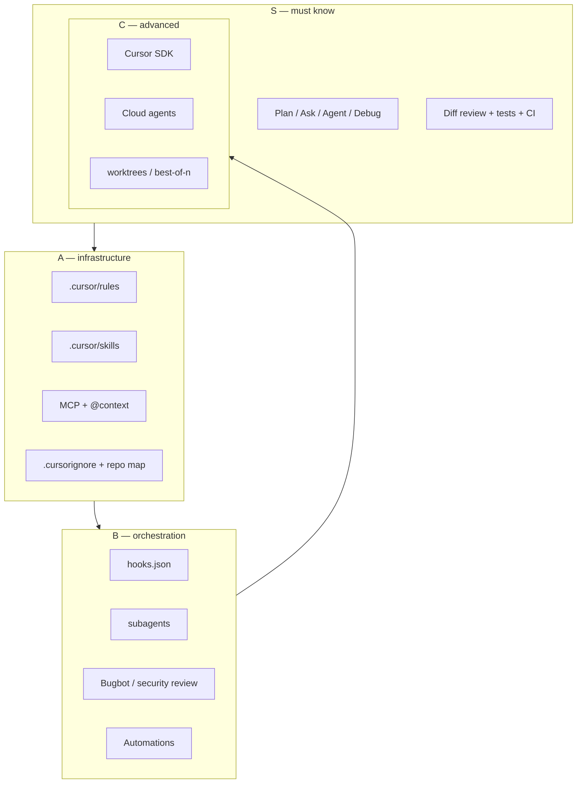
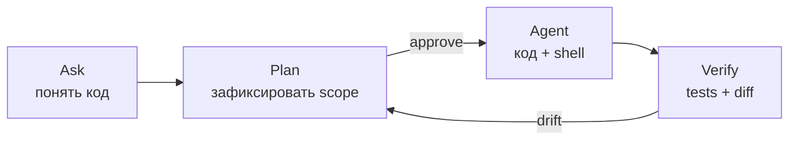
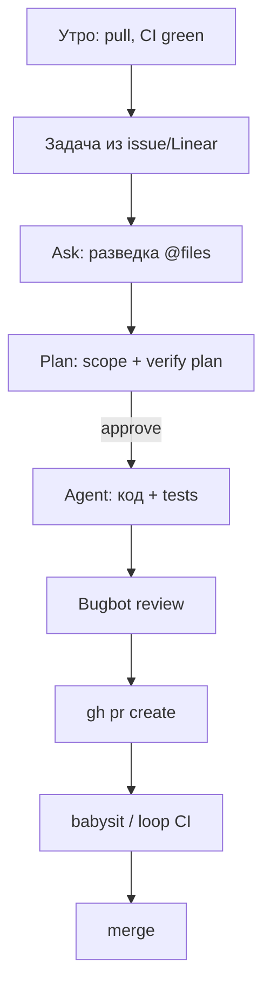

Vibe-coding в Cursor — это не «попросил модель — получил PR». Это **инженерия замкнутого контура**: постановка → исполнение → проверка, плюс **инфраструктура контекста** (rules, skills, MCP), плюс **оркестрация** (subagents, hooks, CI).

Senior здесь отличается не тем, что знает больше горячих клавиш, а тем, что **дешевле ошибается на ранних фазах** и **дороже инвестирует в воспроизводимость**. Большинство провалов — не слабая модель, а слабая постановка: см. [постановку задачи агенту](/vairl/blog/2026/07/04/agent-task-specification-ru/). Ниже — карта компетенций Cursor, **от критичного к полезному**.

Связанные материалы: [память и ландшафт агентов](/vairl/blog/2026/07/03/agent-landscape-memory-ru/), [RAG и MCP](/vairl/blog/2026/07/02/agent-fundamentals-rag-mcp-landscape-ru/), [устойчивость control loops](/vairl/blog/2026/06/29/agent-control-loop-stability-ru/), [g3 и requirements.md](/vairl/blog/2026/06/25/g3-dialectical-autocoding-ru/), [как готовить ведущего AI-специалиста](/vairl/blog/2026/06/29/best-ai-agent-specialist-ru/).

---

## Карта статьи: уровни S → A → B → C

| Уровень | Что это | ROI | Раздел |
|---------|---------|-----|--------|
| **S** | Без этого агент ломает больше, чем чинит | ★★★★★ | [Постановка и режимы](#s-постановка-задачи-и-режимы) |
| **A** | Инфраструктура контекста и гигиена репо | ★★★★☆ | [Rules, skills, MCP](#a-инфраструктура-контекста) |
| **B** | Оркестрация, автоматизация, review | ★★★☆☆ | [Hooks, subagents, CI](#b-оркестрация-и-автоматизация) |
| **C** | Продвинутые поверхности | ★★☆☆☆ | [Cloud, SDK, Canvas](#c-продвинутые-поверхности) |



---

## S: постановка задачи и режимы

### S1. Режимы — разделение фаз цикла

Cursor явно разделяет **фазы** [цикла постановки](/vairl/blog/2026/07/04/agent-task-specification-ru/):

| Режим | Права | Когда | Аналог |
|-------|-------|-------|--------|
| **Ask** | Только чтение | Разведка, «как устроено?», review без правок | OpenCode `plan` (read-only) |
| **Plan** | Read-only + планирование | Архитектура, scope, trade-offs до кода | g3 `--planning` |
| **Agent** | Полный доступ: edit, shell, MCP | Исполнение после контракта | Claude Code default |
| **Debug** | Систематический разбор бага | Runtime evidence, не «угадай» | — |

**Senior-паттерн:** не начинать сложную задачу сразу в Agent. Цепочка **Ask → Plan → approve → Agent → verify** дешевле, чем откат двадцати tool calls.



Переключение режимов — через UI или `SwitchMode` в агенте. Plan mode особенно важен, когда задача затрагивает архитектуру или несколько подсистем.

### S2. Контракт задачи — что агент должен «услышать»

Минимальный контракт перед Agent mode:

1. **Scope** — что трогаем и что **не** трогаем.
2. **Y (выход)** — PR, файл, тест зелёный, метрика.
3. **Verify** — как проверить: `npm test`, `bundle exec jekyll build`, скриншот.
4. **Constraints** — не коммитить, не пушить, не трогать CI.

Форматы: inline в промпте, `requirements.md`, issue, BDD-сценарии. Для крупных фич — отдельный spec-файл (пример: [ТЗ на YOLO + проектор](/vairl/blog/2026/07/02/projector-camera-yolo-spec-ru/)).

**Structured clarify:** когда вариантов мало — `AskQuestion` с вариантами лучше свободного «уточни сам». Это снижает drift на intake.

### S3. @-контекст — точечная подача, не «весь репо»

| Ссылка | Что даёт |
|--------|----------|
| `@file` | Конкретный файл |
| `@folder` | Директория |
| `@code` | Фрагмент (символ, строки) |
| `@docs` | Документация Cursor / внешняя |
| `@web` | Поиск в сети |
| `@git` | Diff, коммиты, ветка |

**Антипаттерн:** «сделай рефакторинг» без `@` на затронутые модули — агент тратит бюджет на разведку. **Паттерн:** `@src/auth/` + ссылка на тест + «не трогай `@src/billing/`».

### S4. Verify — замыкание контура

Senior не принимает diff на веру:

- **Локально:** запустить тесты / сборку до и после (агент может сам, если разрешено).
- **Diff review:** смотреть не только «работает», но и scope creep.
- **Smart mode / approve:** рискованные shell-команды (push, rm, curl с секретами) — только с явным approve.
- **Bugbot** перед merge — отдельный readonly subagent на diff.

Без verify цикл не замкнут — это [неустойчивый control loop](/vairl/blog/2026/06/29/agent-control-loop-stability-ru/).

### S5. Выбор модели — не «всегда Opus»

| Задача | Модель | Почему |
|--------|--------|--------|
| Разведка, чтение, мелкий fix | Composer / fast | Скорость, дешевле |
| Архитектура, сложный рефакторинг | Thinking / Opus-class | Глубина рассуждений |
| Длинный agent loop с tools | Модель с хорошим tool-use | Меньше ложных tool calls |
| Subagent explore (readonly) | Fast / medium | Изолированный контекст |

**Правило:** менять модель дешевле, чем чинить плохую постановку — но **не наоборот**. Сначала контракт, потом модель.

---

## A: инфраструктура контекста

### A1. `.cursor/rules/` — долгосрочный контракт репозитория

Rules — `.mdc` файлы с YAML frontmatter:

```yaml
---
description: TypeScript conventions
globs: **/*.ts
alwaysApply: false
---
```

| Поле | Назначение |
|------|------------|
| `alwaysApply: true` | В каждой сессии (стиль, git safety) |
| `globs` | Только при работе с matching файлами |
| `description` | Показывается в rule picker |

**Best practices (senior):**

- **< 50 строк** на rule, один concern.
- Дробить: `git-safety.mdc`, `api-conventions.mdc`, `jekyll-dates.mdc`.
- Конкретные примеры ✅/❌, не абстракции.
- Коммитить в git — это **team memory**.

Rules ≠ task spec. Rules говорят *как* писать в этом репо; контракт говорит *что* сделать сейчас.

### A2. User Rules — персональные предпочтения

`~/.cursor/` или Settings → Rules: язык ответов, стиль коммитов, «не коммить без запроса», «всегда отвечай по-русски». Не смешивать с project rules — user rules глобальны, project rules — для команды.

### A3. `.cursor/skills/` — процедурная память

Skills — директории с `SKILL.md`:

```
.cursor/skills/deploy-staging/
├── SKILL.md
├── reference.md
└── scripts/check.sh
```

| Расположение | Scope |
|--------------|-------|
| `~/.cursor/skills/` | Все проекты (личные) |
| `.cursor/skills/` | Репозиторий (команда) |
| `~/.cursor/skills-cursor/` | **Встроенные Cursor — не трогать** |

Frontmatter skill:

```yaml
---
name: deploy-staging
description: Deploy to staging via our internal pipeline. Use when user says "deploy staging".
---
```

Агент **подхватывает skill по description** — пишите триггеры явно. Skills для: PR workflow, ревью по стандартам команды, доменные процедуры (деплой, миграции БД).

Портативный стандарт: [agentskills.io](https://agentskills.io).

### A4. MCP — внешние инструменты агента

MCP подключает агент к GitHub, Linear, Sentry, браузеру, arXiv, Docker и т.д. Senior знает:

1. **Схему перед вызовом** — читать descriptor в `~/.cursor/mcps/<server>/tools/`.
2. **Auth** — `mcp_auth` при 401, не спамить повторами.
3. **Разделение:** dashboard MCP (для Automations) vs локальные (`cursor-ide-browser`, project `mcp.json`).
4. **Безопасность:** MCP = полномочия агента наружу; hooks на `beforeMCPExecution` для audit/deny.

Конфиг: Cursor Settings → MCP, или `.cursor/mcp.json` в проекте.

### A5. Гигиена репозитория для агента

| Файл / практика | Зачем |
|-----------------|-------|
| `.cursorignore` | Исключить `node_modules`, артефакты, секреты из индекса |
| `AGENTS.md` | Краткий onboarding: структура, команды, запреты (экосистемный стандарт) |
| README с командами сборки/теста | Агент не угадывает `make test` vs `pnpm test` |
| Мелкие PR / атомарные задачи | Меньше контекста, меньше drift |
| Линтер + formatter в CI | Агент видит objective verify |

**Оптимизация проекта:** не «сделать репо красивым», а **снизить энтропию контекста** — меньше файлов в индексе, явные entry points, тесты рядом с кодом.

### A6. Tab (inline) vs Agent — разные контуры

**Tab** — автодополнение в редакторе, свои hooks (`beforeTabFileRead`, `afterTabFileEdit`). **Agent** — многошаговый loop с tools. Senior не путает: Tab для микро-правок в известном файле; Agent для фичи через несколько файлов + shell.

---

## B: оркестрация и автоматизация

### B1. Hooks — policy layer на событиях агента

`.cursor/hooks.json` + скрипты в `.cursor/hooks/`:

| Событие | Типичное использование |
|---------|------------------------|
| `beforeShellExecution` | Блокировать `rm -rf`, `git push --force` |
| `afterFileEdit` | Auto-format, lint |
| `beforeSubmitPrompt` | Секреты в промпте |
| `preToolUse` / `postToolUse` | Audit, inject context |
| `subagentStart` / `subagentStop` | Контроль Task/subagent |
| `beforeMCPExecution` | Gate на внешние вызовы |

Формат: JSON schema version 1, stdin/stdout обмен. **Project hooks** — в git для команды; **user hooks** — `~/.cursor/hooks.json`.

Fail-open vs fail-closed — осознанный выбор для production policy.

### B2. Subagents — `.cursor/agents/`

Кастомные subagents — `.md` с frontmatter `name` + `description` (тело = system prompt):

| Путь | Приоритет |
|------|-----------|
| `.cursor/agents/` | Проект (выше) |
| `~/.cursor/agents/` | Глобально |

Встроенные типы Task tool: `explore`, `generalPurpose`, `shell`, `bugbot`, `security-review`, `ci-investigator`. Senior использует:

- **explore** — быстрый readonly обход кодовой базы.
- **shell** — git, CI, длинные команды.
- **bugbot** — review diff перед merge.
- **security-review** — явный security pass.

**Паттерн:** основной чат держит контракт; subagent изолированно исследует — контекст не засоряется.

### B3. `/loop` и babysit — длинные контуры

- **`/loop 5m check CI`** — периодический wake агента (локально, не cloud). Для «дождись зелёного CI и почини».
- **babysit skill** — triage PR comments, merge conflicts, CI в цикле до merge-ready.

Это [оркестрация S+Y*→U](/vairl/blog/2026/07/02/systems-theory-task-types-ru/): целевое состояние «PR mergeable», агент подстраивает вход.

### B4. Bugbot и security review

Перед merge:

```
/review-bugbot   → readonly bugbot subagent на branch diff
/review-security → security-review subagent
```

Senior **валидирует findings** — не слепо применяет. Ложные срабатывания объясняет и закрывает.

### B5. Cursor Automations

Scheduled / event-driven агенты: Slack trigger, git push, CI failure → агент с tools и MCP. Отличие от локального `/loop` — облачный runtime, интеграции через dashboard MCP.

**Ограничение:** в промпт automation можно ссылаться только на **закоммиченные** файлы того же репо.

### B6. Git workflow с агентом

User rules уровня senior:

- Не коммитить без явного запроса.
- Не push без запроса.
- HEREDOC для commit message.
- `gh` для PR/issues.
- Перед PR: `git status`, `git diff`, локальные тесты.

**split-to-prs skill** — разбить большую ветку на reviewable PR.

---

## C: продвинутые поверхности

### C1. Cloud Agents и worktrees

Cloud agent работает в изолированной VM с клоном репо — для длинных задач без локальной машины. **best-of-n-runner** — параллельные попытки в git worktrees, выбор лучшей.

Когда локально: `move_agent_to_cloned_root` для sibling clone на той же ветке.

### C2. Cursor SDK

Программный запуск агентов из CI/scripts:

- TypeScript: `@cursor/sdk`
- Python: `cursor-sdk`

Паттерны: `Agent.prompt()` (one-shot), `Agent.create()` + `agent.send()` (streaming, multi-turn). Local vs cloud runtime. API key в env, не в коде.

Use case: nightly refactor bot, PR review в GitHub Action, внутренний «спроси репо» API.

### C3. Canvas

Для аналитических артефактов — `.canvas.tsx` live React рядом с чатом. Не для каждого таска; для данных, таблиц, интерактивных отчётов.

### C4. Status line, CLI config

Кастомный status line в терминале Cursor — session context (ветка, модель, токены). Мелочь, но полезно в длинных сессиях.

### C5. Мульти-корень и Glass

`move_agent_to_root` — смена workspace. `open_resource` — файл/URL в Glass panel. Для монорепо и переключения между проектами в одной сессии.

---

## Типовой рабочий день senior vibe-coder



| Фаза | Инструменты Cursor |
|------|-------------------|
| Onboarding в репо | rules + skills + AGENTS.md уже в git |
| Новая фича | Ask → Plan → Agent |
| Мелкий fix | Tab или короткий Agent с `@file` |
| Review чужого PR | Ask mode + Bugbot locally |
| Регресс в CI | Debug mode + shell subagent |
| Повторяющийся workflow | skill + hook |
| Ночной/фоновый таск | Automation или SDK |

---

## Антипаттерны (что отличает junior от senior)

| Junior | Senior |
|--------|--------|
| Сразу Agent на «сделай красиво» | Plan + контракт с Y |
| Один огромный rule на 500 строк | 5–10 коротких rules |
| «Модель сама разберётся» без `@` | Точечный контекст |
| Принять diff без тестов | Verify до handoff |
| Коммит/пуш «чтобы помочь» | Явный запрос пользователя |
| Skills без description-триггеров | Явные «use when…» |
| MCP без hooks на опасные вызовы | Policy layer |
| Один агент на всё | Subagents для explore/review/shell |

---

## Чеклист: «я senior в Cursor, если…»

**S-tier (обязательно):**
- [ ] Разделяю Ask / Plan / Agent / Debug по фазе задачи
- [ ] Формулирую scope, Y и verify до execute
- [ ] Использую `@` для контекста, не весь репо
- [ ] Проверяю diff и гоняю тесты перед «готово»
- [ ] Подбираю модель под задачу, не default навсегда

**A-tier (инфраструктура):**
- [ ] В репо есть `.cursor/rules/` под команду
- [ ] Повторяющиеся workflow вынесены в skills
- [ ] MCP подключён осознанно, с auth и схемами
- [ ] `.cursorignore` и README с командами сборки
- [ ] User rules: git safety, язык, commit policy

**B-tier (оркестрация):**
- [ ] Hooks на опасные shell/MCP при необходимости
- [ ] Subagents для explore и review
- [ ] Bugbot перед merge нетривиальных PR
- [ ] Знаю `/loop` и babysit для длинных PR-циклов

**C-tier (по необходимости):**
- [ ] Automations для recurring tasks
- [ ] SDK для CI/integration
- [ ] Cloud agents / worktrees для параллельных экспериментов

---

## Сводная таблица файлов и настроек

| Артефакт | Путь | Уровень |
|----------|------|---------|
| Project rules | `.cursor/rules/*.mdc` | A |
| Skills | `.cursor/skills/*/SKILL.md` | A |
| Subagents | `.cursor/agents/*.md` | B |
| Hooks | `.cursor/hooks.json`, `.cursor/hooks/*` | B |
| MCP (project) | `.cursor/mcp.json` | A |
| Ignore index | `.cursorignore` | A |
| Repo onboarding | `AGENTS.md`, `README.md` | A |
| User rules | Cursor Settings | A |
| Built-in skills | `~/.cursor/skills-cursor/` | — (read-only) |
| User skills | `~/.cursor/skills/` | A |
| Automations | Cursor UI / cloud | B–C |
| SDK | npm/pip packages | C |

---

## Итог

Senior vibe-coder в Cursor — это **архитектор контуров**, а не промпт-инженер. Порядок внедрения:

1. **S** — режимы, контракт, verify (самый высокий ROI).
2. **A** — rules, skills, MCP, гигиена репо (масштабируется на команду).
3. **B** — hooks, subagents, review, Automations (production discipline).
4. **C** — SDK, cloud, worktrees (когда локального IDE мало).

Инвестиция в постановку и project memory окупается быстрее, чем гонка за новой моделью. Модель — это **S** в терминах [U–S–Y](/vairl/blog/2026/07/02/systems-theory-task-types-ru/); без измеримого **Y** любая S бессмысленна.

---

## Ссылки

| Ресурс | Тема |
|--------|------|
| [cursor.com/docs](https://cursor.com/docs) | Официальная документация |
| [agentskills.io](https://agentskills.io) | Портативные skills |
| [Постановка задачи агенту](/vairl/blog/2026/07/04/agent-task-specification-ru/) | Intake → contract → verify |
| [Память агентов](/vairl/blog/2026/07/03/agent-landscape-memory-ru/) | CLAUDE.md, rules, skills в ландшафте |
| [Cursor SDK (TS)](https://cursor.com/docs/sdk/typescript) | Программные агенты |
| [Cursor SDK (Python)](https://cursor.com/docs/sdk/python) | То же для Python |
