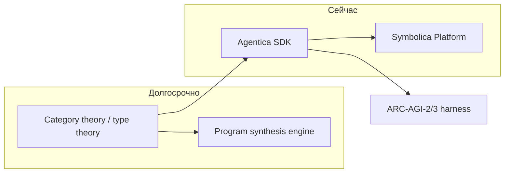
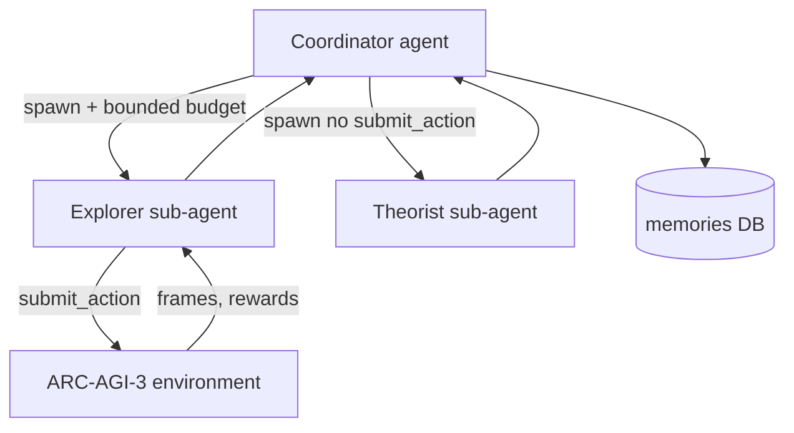

В марте 2026 команда [Symbolica](https://www.symbolica.ai/) опубликовала результат **36.08%** на публичном eval [ARC-AGI-3](https://arcprize.org/) — интерактивном бенчмарке agentic intelligence, где frontier-модели с chain-of-thought уходят **ниже 1%**, а люди проходят 100% сред. Это не «ещё один промпт к Opus», а harness на open-source **[Agentica SDK](https://www.symbolica.ai/agentica-sdk)**: агенты **синтезируют программы**, **исполняют код в sandboxed REPL**, **делегируют подзадачи sub-агентам** и **меняют собственное поведение** через переписывание scope и spawn-дерева.

Как формулирует Symbolica: *allowing agents to synthesize programs, perform dynamic code execution, and modify their own behavior we are able to drastically enhance the capabilities of base models relative to baseline. And our system performs comparably to humans as well at only ~1.68× the action budget of your average player.*

Ниже — кто стоит за лабораторией, роль **Paul Lessard** (Principal Scientist, categorical deep learning), как устроен Agentica и почему 36% на ARC-AGI-3 — сигнал о смене оси конкуренции: от «размера модели» к «качеству agent harness».

Связанные материалы VAIRL: [нейросимволический пайплайн](/vairl/blog/2026/06/25/neurosymbolic-planning-pipeline-ru/), [фундамент агентных систем](/vairl/blog/2026/07/02/agent-fundamentals-rag-mcp-landscape-ru/), [Sakana Fugu — оркестрация моделей](/vairl/blog/2026/07/02/sakana-fugu-multi-agent-orchestration-ru/).

---

## Карта статьи

| Раздел | О чём |
|--------|--------|
| [Symbolica](#symbolica-лаборатория-нейросимволики) | Лаборатория, миссия, финансирование |
| [Команда и руководство](#команда-и-руководство) | Morgan, Beynon, Lessard |
| [Paul Lessard](#paul-lessard-категориальная-основа) | Категориальное глубокое обучение |
| [Agentica SDK](#agentica-sdk-code-as-reasoning) | REPL, Warp, spawn |
| [ARC-AGI-3](#arc-agi-3-3608-за-один-день) | Цифры, сравнение с baseline |
| [Архитектура harness](#архитектура-arc-agi-3-harness) | Координатор, бюджет действий |
| [George Morgan](#george-morgan-основатель-и-ceo) | Основатель, Tesla, fundraising |
| [Эффективность](#эффективность-168×-от-человека) | Формула scoring, 1.68× |
| [Таблица игр](#таблица-результатов-по-играм) | Top / bottom public eval |
| [Сравнение подходов](#symbolica-vs-cot-и-другие-harness) | CoT, tool-calling, оркестраторы |
| [Быстрый старт](#быстрый-старт-локально) | Agentica Server + harness |
| [Ограничения](#ограничения-и-контекст) | Unverified score, harness vs AGI |
| [Чеклист](#чеклист-для-инженера-агентов) | Что перенести в свой стек |
| [Итог](#итог) | Главный вывод |
| [Ссылки](#источники) | Papers, repos, блог |

---

## Symbolica: лаборатория нейросимволики

[Symbolica AI](https://www.symbolica.ai/) — исследовательская лаборатория, основанная в **2022** году **George Morgan** (ex-Tesla Autopilot). Офисы — **San Francisco** и **London**. Финансирование: **~$33–41M** (Khosla Ventures, General Catalyst, Day One Ventures и др.), оценка Forbes — **~$150M**.

Миссия лаборатории — не «ещё один трансформер», а **символический reasoning engine** на языке **category theory** и **type theory**: мост между надёжностью символического исполнения программ и адаптивностью нейронной оптимизации. Долгосрочная программа — **general-purpose program synthesis engine** на проприетарной категориальной архитектуре; промежуточный продукт — **Agentica**, open-source SDK для code-mode агентов.



Источники: [сайт Symbolica](https://www.symbolica.ai/), [research program](https://www.symbolica.ai/research), [TechCrunch 2024](https://techcrunch.com/2024/04/09/symbolica-hopes-to-head-off-the-ai-arms-race-by-betting-on-symbolic-models/).

---

## Команда и руководство

Symbolica — **~18 человек**: математики, инженеры ML, DevOps. Ключевые роли:

| Человек | Роль | Фокус |
|---------|------|--------|
| **George Morgan** | Co-Founder, CEO | Видение, продукт, fundraising; ex-Tesla |
| **Taliesin Beynon** | Research Director (с Sep 2024) | Research agenda, Agentica; ex-Wolfram DL |
| **Paul Lessard** | Principal Scientist (2023–Oct 2025) | Categorical deep learning, Series A research program |
| **Nicholas Kouris** | Head of ML Engineering | Инфраструктура, продакшен-модели |
| **Jonathan Frydman** | CPO | Продукт Agentica Platform |
| **Drake Rehfeld** | COO | Операции |

> **Имя:** в англоязычных источниках фамилия — **Lessard** (не «Lizard»). Paul Lessard с Oct 2025 — Research Fellow @ Monash, Senior Mathematician @ Sirius Beta; в Symbolica он заложил математический фундамент long-term program synthesis.

ARC-AGI-3 harness (март 2026) — результат текущей research/engineering команды под **Taliesin Beynon** (Research Director) и open-source репозиториев `symbolica-ai/agentica-*`, `ARC-AGI-3-Agents`.

---

## Paul Lessard: категориальная основа

**Paul Lessard** — категориальный математик (h-index ~24), Ph.D., работал на стыке homotopy theory, type theory и machine learning. В Symbolica — **Principal Scientist — Categorical Deep Learning** (Melbourne / SF Bay Area).

### Position paper ICML 2024

Соавтор position paper [**Categorical Deep Learning is an Algebraic Theory of All Architectures**](https://arxiv.org/abs/2402.15332) (ICML 2024) вместе с Bruno Gavranović, Andrew Dudzik, Tamara von Glehn, João Araújo, Petar Veličković (DeepMind):

- **Проблема:** существующие framework'и для DL не связывают *constraints* (что модель должна удовлетворять) с *implementations* (как её построить).
- **Предложение:** **monads в 2-категории parametric maps** — единая алгебраическая теория, которая восстанавливает geometric DL и реализует RNN, automata и др.
- **Связь с Agentica:** types + composition — те же building blocks category theory, которые Symbolica переносит в agent SDK (typed `spawn`, `call[T]`, делегирование capabilities).

Lessard участвовал в подготовке **Series A (~$31M)** research program. Его вклад — не prompt engineering для ARC, а **теоретический каркас**, в котором program synthesis и theorem proving — центральные задачи AGI, а Agentica — инженерный первый шаг.

---

## George Morgan: основатель и CEO

**George Morgan** — лицо компании наружу: ex-engineer **Tesla Autopilot**, dropout University of Rochester, основал Symbolica в **2022**. В [интервью TechCrunch](https://techcrunch.com/2024/04/09/symbolica-hopes-to-head-off-the-ai-arms-race-by-betting-on-symbolic-models/) формулирует ставку так: вместо гонки за размером трансформера — **structured outputs**, меньше ресурсов, выше точность; Vinod Khosla назвал Morgan «собравшим одну из лучших команд в индустрии».

| | Morgan | Lessard | Beynon |
|---|--------|---------|--------|
| Роль | CEO, vision, fundraising | Principal Scientist (теория) | Research Director (Agentica) |
| Вклад в ARC | Продуктовая стратегия, open-source | Categorical DL, research program | Operational lead harness |
| Бэкграунд | Tesla AI | Category theory, ICML 2024 | Wolfram deep learning library |

Morgan — **основатель и руководитель лаборатории**; Lessard — **математический архитектор** long-term program synthesis; Beynon — **руководитель research**, под которым Agentica вышел на SOTA ARC-AGI-2/3.

---

## Agentica SDK: code as reasoning

[Agentica](https://github.com/symbolica-ai/agentica-python-sdk) — open-source (MIT) Python/TypeScript SDK + [Agentica Server](https://github.com/symbolica-ai/agentica-server). Парадигма: **code — самый выразительный интерфейс** между моделью и средой.

### Чем Agentica отличается от tool-calling

| Аспект | Tool calling (MCP и др.) | Agentica |
|--------|--------------------------|----------|
| Контекст | Текстовые JSON-ответы инструментов | **Persistent Python REPL** — объекты живут между turn'ами |
| API | Обёртка каждого endpoint | **`scope`**: передать Client/DB по ссылке, `import` без обёрток |
| Оркестрация | Делегирование задач | **Делегирование capabilities** — sub-agent получает объекты из scope родителя |
| Типы | Схема JSON | **`call(T, prompt)`** — return type enforced |
| Протокол | HTTP/RPC к tools | **Warp** — RPC + proxy objects в REPL |

Минимальный пример:

```python
from agentica import spawn
from my_sdk import Database

agent = await spawn(
    premise="Financial analyst",
    model="anthropic/claude-opus-4.6",
    scope={"db": Database(...)},
)
result = await agent.call(dict, "Summarize spending by user tier")
```

Агент пишет Python в sandbox; функции из вашего runtime **warp'ятся** как stubs — вычисление остаётся в вашем процессе. Подробнее: [How it works](https://docs.symbolica.ai/concepts/how-it-works), [Runtime as Context](https://www.symbolica.ai/blog/runtime-as-context).

### «Modify their own behavior»

Агент может:

- **spawn** sub-agents с урезанным или расширенным scope;
- **передавать себе** `submit_action`, `make_bounded_submit_action`, memories DB;
- **переписывать** стратегию после runtime feedback (exceptions, diffs, score).

Это не fine-tuning весов — **runtime self-modification** через код и архитектуру агентов.

---

## ARC-AGI-3: 36.08% за один день

[ARC-AGI-3](https://arxiv.org/html/2603.24621) — turn-based interactive environments: агент **explores**, **inferирует цели**, строит internal model dynamics, **planирует** без явных инструкций. Scoring **efficiency-based**: human action baselines, штраф за лишние шаги (формула включает квадрат отношения human/AI actions).

### Публичный результат Symbolica (март 2026)

| Метрика | Agentica + Opus 4.6 (120k) High | CoT baseline |
|---------|----------------------------------|--------------|
| **Overall score** | **36.08%** (unverified competition) | Opus 4.6 Max **0.2%**, GPT 5.4 High **0.3%** |
| **Levels passed** | **113 / 182** playable | — |
| **Games completed** | **7 / 25** | — |
| **Cost (public eval)** | **~$1,005** | Opus 4.6 **~$8,900** при 0.25% |

Лучшие игры: **CN04** (97.6%), **LP85** (84.16%), **AR25** (83.28%). Код: [symbolica-ai/ARC-AGI-3-Agents](https://github.com/symbolica-ai/ARC-AGI-3-Agents), блог: [From 0% to 36% on Day 1](https://symbolica.ai/blog/arc-agi-3).

### Контекст: ARC-AGI-2

Ранее **[Arcgentica](https://github.com/symbolica-ai/arcgentica)** на Agentica достиг **85.28%** на ARC-AGI-2 с Opus 4.6 High (~$6.94/task) — +10–20 pp к raw frontier scores. ARC-AGI-3 сложнее: интерактивность, exploration, action budget.

---

## Архитектура ARC-AGI-3 harness

Harness **Arcgentica** (ветка `symbolica` в `ARC-AGI-3-Agents`) — мультиагентный координатор поверх Agentica:



Роли (из [prompts.py](https://github.com/symbolica-ai/ARC-AGI-3-Agents/blob/symbolica/arcgentica/agents/templates/agentica/prompts.py)):

1. **Coordinator** — не играет сам; распределяет **action budget** через `make_bounded_submit_action(limit)`; spawn'ит explorer/theorist.
2. **Explorer** — действия в игре; differential observation; **не тратит** actions на exhaustive sweeps.
3. **Theorist** — infer rules **без** `submit_action`; снижает waste.
4. **Memory** — explicit DB для cross-level reuse стратегий.

**Action budget:** счётчик привязан к **`submit_action`**, не к агенту — sub-agents **делят** один counter. NOOP/RESET — бесплатны. При нехватке actions sub-agent возвращается к coordinator за fresh budget — context intact.

---

## Эффективность: ~1.68× от человека

ARC-AGI-3 оценивает не только «прошёл / не прошёл», но **насколько экономно** агент действует относительно human baseline. Интуиция scoring (по [whitepaper ARC Prize](https://arxiv.org/html/2603.24621)):

- за каждый пройденный level — вклад, взвешенный номером уровня;
- efficiency multiplier падает, когда AI тратит **больше** actions, чем human: штраф **квадратичный** по `human_actions / ai_actions`.

| Показатель | Значение | Смысл |
|------------|----------|--------|
| Action ratio | **~1.68×** human | В среднем на ~68% больше ходов, чем у игрока |
| Efficiency factor | **(1/1.68)² ≈ 0.35** | Квадратичный штраф ARC-AGI-3 |
| Aggregate score | **36.08%** | Coverage + efficiency, не raw pass rate |

**36% при 1.68×** — сопоставимая с человеком **экономика действий** на пройденных уровнях, а не «треть игр и стоп». Harness **не brute-force'ит** в 10× human steps — coordinator, theorist и memory **снижают waste**. Это прямой ответ на design goal ARC Prize: *fluid adaptive efficiency on novel tasks*.

---

## Таблица результатов по играм

Публичный eval — **25 игр**, **182 playable levels**. Полная таблица — в [блоге Symbolica](https://symbolica.ai/blog/arc-agi-3); выборка:

| Игра | Score | Комментарий |
|------|-------|-------------|
| **CN04** | 97.60% | Пройдена целиком; 118 actions на финальный level |
| **LP85** | 84.16% | WIN — одна из 7 completed games |
| **AR25** | 83.28% | WIN |
| **FT09** | 77.59% | WIN |
| **CD82** | 70.15% | WIN |
| **TR87** | 69.21% | WIN; level 6 — 3,962 actions (outlier) |
| **TU93** | 67.87% | WIN |
| **M0R0** | 40.06% | Partial progress |
| **BP35** | 0.22% | Hard tail — типичный провал harness |
| **Overall** | **36.08%** | 113/182 levels, 7/25 games complete |

Паттерн: на части игр harness **закрывает полный цикл** exploration → rule inference → execution; на других **ломается** на поздних levels при жёстком action budget.

---

## Ограничения и контекст

1. **Unverified score** — Symbolica явно маркирует 36.08% как unverified competition submission; независимая верификация ARC Prize Foundation может отличаться.
2. **Harness ≠ base model** — результат зависит от Agentica + Opus 4.6; сравнение с «голым» CoT корректно только при учёте agent overhead и cost.
3. **Public subset** — 25 игр публичного eval; полный benchmark шире.
4. **Leader attribution** — Paul Lessard заложил categorical foundation, но **operational lead** Agentica/ARC — Taliesin Beynon и engineering team; Lessard уже не в штате Symbolica (Oct 2025).

Тем не менее сигнал ясен: **agentic harness + program synthesis + runtime** может поднять frontier model с **<1% до ~36%** на hardest public agentic benchmark — при **~8× меньшей** стоимости, чем CoT Opus на том же eval.

---

## Symbolica vs CoT и другие harness

| Подход | ARC-AGI-3 (public) | Cost | Механизм |
|--------|-------------------|------|----------|
| CoT Opus 4.6 Max | **0.2%** | ~$8,900 | Текстовое рассуждение в контексте |
| CoT GPT 5.4 High | **0.3%** | — | То же |
| **Agentica + Opus 4.6 High** | **36.08%** | **~$1,005** | REPL, spawn, program synthesis |
| Sakana Fugu / оркестраторы | — | routing overhead | Выбор модели, не среда ARC-AGI-3 |
| MCP tool-calling | — | N tools × latency | JSON в контекст, без persistent state |

Symbolica не конкурирует с **роутерами моделей** (см. [Sakana Fugu](/vairl/blog/2026/07/02/sakana-fugu-multi-agent-orchestration-ru/)) — они решают другую ось. Здесь ставка на **runtime-as-context**: код, sub-agents, shared action budget. Близкий родственник — [Arcgentica / ARC-AGI-2](https://www.symbolica.ai/blog/arcgentica) (program synthesis + execution traces); ARC-AGI-3 добавляет **interactive exploration** и **efficiency scoring**.

---

## Быстрый старт локально

Минимальный путь воспроизвести стек (ARC-AGI-2 через [arcgentica](https://github.com/symbolica-ai/arcgentica); ARC-AGI-3 — [ARC-AGI-3-Agents](https://github.com/symbolica-ai/ARC-AGI-3-Agents), ветка `symbolica`):

**1. Agentica Server** (отдельный терминал):

```bash
export ANTHROPIC_API_KEY=<key>
git clone https://github.com/symbolica-ai/agentica-server && cd agentica-server
uv sync && uv pip install numpy scikit-image scipy sympy
uv run src/application/main.py \
  --inference-token=$ANTHROPIC_API_KEY \
  --inference-endpoint https://api.anthropic.com/v1/messages \
  --sandbox-mode=no_sandbox \
  --max-concurrent-invocations 1200 \
  --port 2345
```

**2. Harness** (второй терминал):

```bash
export S_M_BASE_URL=http://localhost:2345
git clone https://github.com/symbolica-ai/arcgentica && cd arcgentica
uv run python main.py --model anthropic/claude-opus-4-6 --num-problems 10
```

Для **ARC-AGI-3** — форк `symbolica-ai/ARC-AGI-3-Agents`, agent `agentica`, см. `SYMBOLICA_README.md` в репозитории. Логи winning runs и re-score: `uv run summary.py output/...`.

Без локального сервера — [agentica.symbolica.ai](https://agentica.symbolica.ai/) (chat UI, тот же SDK).

---

## Чеклист для инженера агентов

**Перед запуском agentic benchmark:**

1. **Persistent runtime** — объекты между turn'ами, не только tool JSON.
2. **Typed boundaries** — `call(ReturnType, ...)` или явные схемы выхода sub-agent.
3. **Shared budget** — один counter на дорогие actions; NOOP/RESET бесплатны где можно.
4. **Role split** — explorer (acts) vs theorist (infer без actions).
5. **Cross-episode memory** — явная DB, не надеяться на контекстное окно.

**После прогона:**

6. Логировать **generated code**, spawn tree, actions/level — как в [agent telemetry](/vairl/blog/2026/06/29/agent-telemetry-ru/).
7. Считать **cost per task** и **action ratio vs human**, не только pass rate.
8. Маркировать **unverified** scores до независимой верификации.

| Принцип | Реализация в Agentica |
|---------|------------------------|
| Code > JSON tools | REPL как scratchpad; объекты не сериализуются в контекст |
| Typed delegation | `spawn(scope=...)`, `call(ReturnType, ...)` |
| Budget-aware planning | Shared action counter, bounded sub-agents |
| Runtime feedback | Exceptions и diffs — input для следующей итерации кода |
| Observability | Trace: generated code, spawn tree, execution results |

---

## Итог

**Symbolica** — редкий случай, когда **математическая программа** (category theory → program synthesis) и **инженерный open-source** (Agentica) сходятся в одном измеримом результате: **36% на ARC-AGI-3** при **~1.68× human actions** и **~$1k** eval cost против **<1%** и **~$9k** у CoT frontier.

Три имени, три слоя:

- **George Morgan** — основатель, ставка на structured reasoning вместо scale-only;
- **Paul Lessard** — categorical deep learning, теоретический мост constraints ↔ implementations;
- **Taliesin Beynon** — operational research lead Agentica и ARC harness.

Для практики: **harness и runtime важнее следующего промпта**. Если ваш агент решает novel tasks через tool JSON — попробуйте **REPL + spawn + budget**; ARC-AGI-3 показывает, что разрыв между 0.2% и 36% лежит там, а не в смене модели на +0.1 версии.

---

## Связанные публикации

- [Нейросимволический пайплайн LLM → PDDL → критик](/vairl/blog/2026/06/25/neurosymbolic-planning-pipeline-ru/)
- [Устойчивость agent control loops](/vairl/blog/2026/06/29/agent-control-loop-stability-ru/)
- [Телеметрия агентов](/vairl/blog/2026/06/29/agent-telemetry-ru/)
- [Генерация agent benchmarks](/vairl/blog/2026/06/29/agent-benchmark-generation-ru/)
- [Фундамент агентных систем](/vairl/blog/2026/07/02/agent-fundamentals-rag-mcp-landscape-ru/)
- [Sakana Fugu — оркестрация моделей](/vairl/blog/2026/07/02/sakana-fugu-multi-agent-orchestration-ru/)

---

## Источники

| Ресурс | URL |
|--------|-----|
| Symbolica | https://www.symbolica.ai/ |
| Agentica SDK | https://www.symbolica.ai/agentica-sdk |
| Blog: ARC-AGI-3 36% | https://symbolica.ai/blog/arc-agi-3 |
| Blog: Arcgentica / ARC-AGI-2 | https://www.symbolica.ai/blog/arcgentica |
| Blog: Runtime as Context | https://www.symbolica.ai/blog/runtime-as-context |
| ARC-AGI-3 paper | https://arxiv.org/html/2603.24621 |
| GitHub: ARC-AGI-3-Agents | https://github.com/symbolica-ai/ARC-AGI-3-Agents |
| GitHub: arcgentica | https://github.com/symbolica-ai/arcgentica |
| GitHub: agentica-python-sdk | https://github.com/symbolica-ai/agentica-python-sdk |
| Categorical DL (ICML 2024) | https://arxiv.org/abs/2402.15332 |
| Paul Lessard | https://sites.google.com/view/paul-roy-lessard/home |
| George Morgan (Forbes) | https://www.forbes.com/profile/george-morgan/ |
| TechCrunch (launch) | https://techcrunch.com/2024/04/09/symbolica-hopes-to-head-off-the-ai-arms-race-by-betting-on-symbolic-models/ |
| Discord Symbolica | https://discord.gg/bddGs8bb |

---

*Обновлено: июль 2026. Score ARC-AGI-3 — unverified competition submission Symbolica; цифры и model ID проверяйте в [блоге](https://symbolica.ai/blog/arc-agi-3) и repos перед воспроизведением.*
