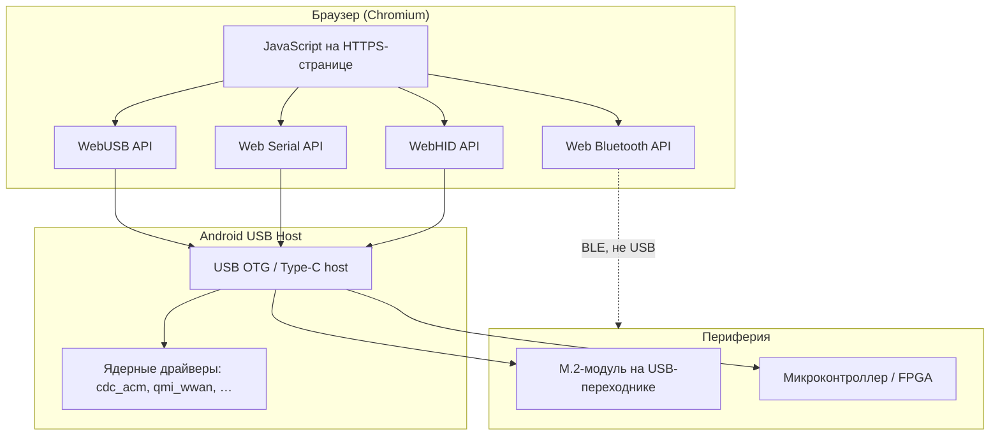
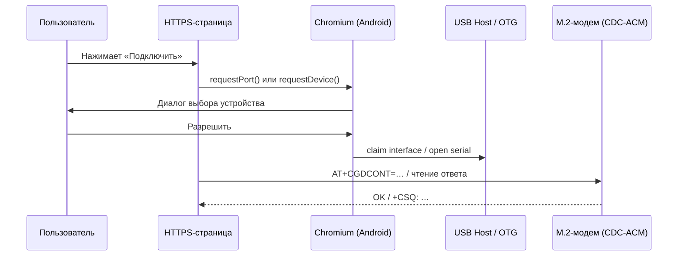
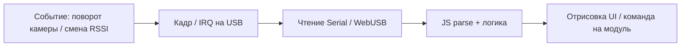

Сценарий: на телефоне открыт браузер, по **USB OTG** подключена плата с **M.2-модулем** LTE/LoRa/GNSS, и веб-приложение шлёт AT-команды или читает телеметрию — **без установки APK**. Речь не про «магический WAPT USB», а про семейство **Web Platform APIs**, в первую очередь **WebUSB** и **Web Serial**. Ниже — что существует, как устроен стек и где упирается в железо.

Связанные материалы: [edge-инференс в браузере](/vairl/blog/2026/07/01/pytorch-edge-browser-onnx-ru/), [телеметрия агентов](/vairl/blog/2026/06/29/agent-telemetry-ru/).

## Зачем это нужно

| Подход | Плюс | Минус |
|--------|------|-------|
| **Нативное Android-приложение** | Полный доступ к USB, фоновые сервисы | Сборка, подпись, обновления в сторах |
| **Termux + cli-утилиты** | Быстрый хак для инженера | Не для конечного пользователя |
| **PWA + WebUSB / Web Serial** | Один код для Android и десктопа, деплой как сайт | Ограничения браузера и ОС |

Для полевых инструментов, настройки модемов, прошивки микроконтроллеров и лабораторных стендов веб-стек уже используют в продакшене (принтеры ESC/POS, Arduino, осциллографы). Телефон с OTG — тот же класс задач, только питание и драйверы капризнее.

## Ландшафт API



### WebUSB

**[WebUSB](https://developer.chrome.com/docs/capabilities/usb)** — низкоуровневый доступ к USB: конфигурации, интерфейсы, **control / bulk / interrupt / isochronous** transfers. Подходит для **vendor-specific** устройств, которые не попадают под стандартные классы ОС.

Типовой цикл в JS:

```javascript
const device = await navigator.usb.requestDevice({
  filters: [{ vendorId: 0x2c7c }]  // пример: Quectel
});
await device.open();
await device.selectConfiguration(1);
await device.claimInterface(0);
await device.transferOut(endpointNumber, new Uint8Array([0x41, 0x54, 0x0d])); // "AT\r"
```

Требования:

- **HTTPS** (или `localhost`);
- вызов `requestDevice()` только по **жесту пользователя** (клик);
- разрешение запоминается для origin; отзыв — в настройках сайта.

Устройство может объявить поддержку WebUSB через **BOS-дескриптор** и **landing page URL** — Chrome покажет уведомление «открыть страницу управления» при подключении ([спецификация](https://wicg.github.io/webusb/), [гайд для прошивки](https://developer.chrome.com/docs/capabilities/build-for-webusb)).

### Web Serial

**[Web Serial](https://developer.chrome.com/docs/capabilities/serial)** — удобная обёртка над **виртуальным COM-портом**: CDC-ACM, FTDI, CP210x, CH340. Для M.2 LTE-модулей на Telit/Quectel/Sierra это часто **правильный первый выбор**: модем отдаёт AT-команды именно как serial.

```javascript
const port = await navigator.serial.requestPort();
await port.open({ baudRate: 115200 });
const writer = port.writable.getWriter();
await writer.write(new TextEncoder().encode('AT+CSQ\r\n'));
writer.releaseLock();
```

На **десктопе** Web Serial давно в Chrome. На **Android** нативная поддержка появилась в **Chrome 148** (2026); раньше на телефоне часто использовали WebUSB + [полифилл Serial](https://github.com/google/web-serial-polyfill).

Web Serial и WebUSB **дополняют** друг друга: ОС может отдавать модем ядру как `/dev/ttyACM*`, и браузеру проще Serial, чем ручной разбор USB-дескрипторов.

### WebHID

**[WebHID](https://developer.chrome.com/docs/capabilities/hid)** — для устройств класса **HID** (клавиатуры, геймпады, некоторые осциллографы). К M.2 радиомодулю обычно **не относится**, но полезен, если на той же плате есть HID-интерфейс отладки.

### Web Bluetooth

Альтернатива проводу: BLE-модуль на плате, в браузере — `navigator.bluetooth`. На iOS поддержка шире, чем у WebUSB; для LTE-модемов в M.2 почти никогда не применимо.

## Как это выглядит на телефоне



### USB OTG и питание

Телефон должен уметь **USB host** (`android.hardware.usb.host`). Разъём Type-C часто требует кабель **OTG** (или хаб с **подпиткой**): M.2 LTE-плата может потреблять сотни мА — без внешнего 5 V связь обрывается.

### Кто «забирает» устройство

Главный практический барьер: если ядро Android подняло драйвер **`cdc_acm`**, **`qmi_wwan`** или **`cdc_mbim`**, интерфейс может быть **недоступен** браузеру — его уже держит ОС для мобильного интернета.

| Профиль USB модема | Что делает Android | Доступ из браузера |
|--------------------|--------------------|--------------------|
| Только CDC-ACM (AT-порт) | Часто доступен, если не занят | Web Serial / WebUSB |
| QMI / MBIM (дата) | Сетевой интерфейс, ModemManager-логика | Обычно **занято** ядром |
| Composite: ACM + QMI | Несколько интерфейсов | Можно claim **отдельный** ACM-интерфейс |
| Vendor-specific без драйвера | Ничего не claim | **WebUSB** напрямую |

Для «браузерного» сценария проще прошивать плату в режим **«только serial / vendor»** на время настройки или использовать модуль с **отдельным USB-портом под AT**, не совпадающим с data-интерфейсом.

## Пример: M.2 LTE как радиомодуль

Типовая цепочка:

1. **M.2 Key B** (LTE) на carrier-плате с USB 2.0.
2. Модуль перечисляется как **composite USB** ([Telit](https://www.telit.com/), Quectel, Fibocom): несколько CDC-ACM + сетевой адаптер.
3. Веб-приложение по Serial шлёт **3GPP AT** (`AT+CPIN?`, `AT+CSQ`, `AT+CGACT=1,1`) или бинарный **QMI** (сложнее, чаще в нативном коде).
4. Для голоса/SMS/сокетов поверх LTE всё равно нужен **сетевой стек** — браузер даст только **порт к модему**, не заменит `pppd`/ModemManager.

Для **LoRa / GNSS / SDR** на USB картина похожа: если устройство — **CDC-ACM или FTDI**, берите Web Serial; если кастомный протокол на bulk endpoints — WebUSB.

## Прошивка и дескрипторы (со стороны железа)

Чтобы Chrome на Android **узнал** устройство и не отдал его чужому драйверу:

1. **USB 2.1** + **BOS** с WebUSB Platform Capability (UUID `3408b638-09a9-47a0-8bfd-a0768815b665`).
2. **Vendor interface** вместо CDC-ACM — если нужен именно WebUSB без конкуренции с `cdc_acm` (паттерн [WebUSB Arduino](https://github.com/webusb/arduino)).
3. На Windows — **MS OS 2.0** дескрипторы под WinUSB; на Android это не нужно, но одинаковая прошивка тогда кроссплатформенна.
4. **Landing page** в прошивке — URL вашей PWA для онбординга.

Стеки прошивки: **TinyUSB**, **Zephyr** (`samples/subsys/usb/webusb`), **LUFA**.

## Ограничения (честный чеклист)

| Ограничение | Детали |
|-------------|--------|
| **iOS / Safari** | WebUSB и Web Serial **нет**; только нативное приложение или Web Bluetooth |
| **Firefox Android** | WebUSB **нет** |
| **Браузеры** | Chrome, Edge, Samsung Internet, Opera — **да** на Android |
| **Фон** | Страница в фоне может отключить USB; нужен foreground или нативный слой |
| **Безопасность** | Фильтры `vendorId`/`productId`, явное согласие пользователя |
| **Производительность** | Bulk OK для AT; стриминг IQ с SDR — лучше нативно |
| **Root / custom ROM** | Не обязателен для WebUSB; нужен только если конкурируете с системным модемом |

## Когда что выбирать

| Задача | API |
|--------|-----|
| AT-команды на LTE/LoRa-модуле (CDC-ACM) | **Web Serial** |
| Свой протокол на bulk USB | **WebUSB** |
| Прошивка STM32 / Arduino с WebUSB-дескриптором | **WebUSB** |
| Игровой контроллер, HID-осциллограф | **WebHID** |
| Датчик по BLE | **Web Bluetooth** |
| Полноценный LTE-роутер на телефоне | **Нативный** стек (ModemManager, `qmicli`), не браузер |

## Минимальный PWA-скелет

```javascript
if (!('serial' in navigator) && !('usb' in navigator)) {
  status.textContent = 'Нужен Chrome на Android или десктоп';
}

connectBtn.onclick = async () => {
  try {
    if ('serial' in navigator) {
      const port = await navigator.serial.requestPort();
      await port.open({ baudRate: 115200 });
      // read loop через port.readable
    } else {
      const dev = await navigator.usb.requestDevice({ filters: [] });
      await dev.open();
      // claimInterface + transferIn/Out
    }
  } catch (e) {
    if (e.name !== 'NotFoundError') console.error(e);
  }
};
```

Деплой — обычный **HTTPS**-хостинг; для офлайна — **Service Worker** и кэш статики (сами USB-сессии сети не требуют после загрузки страницы).

## Оценка быстродействия

Если замкнутый контур — **браузер на телефоне ↔ USB-радиомодуль** (и опционально **камера**, следящая за объектом в сцене), «быстро» нужно раскладывать на **задержку реакции** и **частоту обновления**. Это разные метрики: первая отвечает на «как быстро система откликнется на событие», вторая — «с какой периодичностью мы видим актуальное состояние».

### Бюджет задержки (end-to-end)



| Узел | Типичный порядок | Комментарий |
|------|------------------|-------------|
| USB Full Speed, bulk 64 B | 1–3 ms на пакет | Зависит от загрузки шины и hub |
| CDC-ACM, буфер ОС | 5–20 ms | Android может батчить до `read()` |
| `port.read()` / `transferIn` в JS | 1–16 ms | Event loop, вкладка в foreground |
| AT-команда + ответ модема | 50–500 ms | `AT+CSQ` быстро; регистрация в сети — секунды |
| Камера `getUserMedia` | 33–66 ms | 15–30 fps на телефоне |
| Inference YOLO в браузере | 50–200 ms | WASM/WebGPU, см. [edge в браузере](/vairl/blog/2026/07/01/pytorch-edge-browser-onnx-ru/) |

**Практический вывод:** для **диагностики эфира** (уровень сигнала, регистрация, GNSS-fix) достаточно **1–5 Hz** опроса — узкое место модем, не USB. Для **управления в реальном времени** (поворот антенны, следящий контур) нужен разбор по слоям: USB даёт миллисекунды, модем и алгоритм — часто десятки–сотни миллисекунд.

### Частота слежения за объектом (камера)

Когда **выворачивают камеру** или объект быстро смещается в кадре, ограничивают не WebUSB, а **видеоконтур**:

| Режим | Частота | Когда хватает |
|-------|---------|---------------|
| Только превью | 24–30 fps | Оператор смотрит глазами |
| Детекция каждый 2–3-й кадр | 5–15 Hz effective | Лёгкая YOLO, батарея |
| Детекция каждый кадр | 10–25 Hz | Мощный телефон, WebGPU |
| Трекер по bbox (KLT, ByteTrack) между инференсами | 30–60 Hz UI | Инференс реже, интерполяция чаще |

При **резком панорамировании** растут:

- **motion blur** — падает точность детектора;
- **латентность WebRTC** (если кадр уходит на второе устройство) — +30–150 ms в LAN;
- **время перекалибровки** гомографии камера↔сцена — сотни ms без непрерывного SLAM ([Projector AR Loop](/vairl/blog/2026/07/02/projector-camera-yolo-spec-ru/)).

Целевые ориентиры для «отзывчивого» UI:

- **p95 задержка** ответа модема на AT: &lt; 200 ms;
- **визуальный контур** относительно объекта: &lt; 150 ms (≈ 7 Hz минимум для ощущения «живой» связи);
- **джиттер** между кадрами: &lt; 20 % от периода (стабильные 15 fps лучше рваных 30).

### Как мерить

Минимальный набор без нативного кода:

```javascript
const t0 = performance.now();
await writer.write(cmd);
const { value } = await reader.read();
const rtt_ms = performance.now() - t0;
// логировать rtt_ms, считать p50/p95 за сессию
```

Для камеры — `video.requestVideoFrameCallback()` (где есть) или метки `performance.now()` на каждом инференсе. В телеметрию кладут: `usb_rtt_ms`, `inference_ms`, `fps_capture`, `fps_track`, `dropped_frames` — по той же схеме, что в [статье про agent telemetry](/vairl/blog/2026/06/29/agent-telemetry-ru/).

### Красные флаги

| Симптом | Вероятная причина |
|---------|-------------------|
| Ответы «пачками» раз в 100–300 ms | Буферизация serial, вкладка в фоне |
| Трек теряется при повороте камеры | Низкий fps inference, нет интерполяции |
| USB отваливается | Нехватка питания OTG |
| Стабильно &gt; 1 s на «простую» AT | Интерфейс занят QMI/MBIM, не тот порт |

Итого: **USB из браузера быстрый enough** для телеметрии и команд; предел «мониторного контура» в поле чаще задают **модем, камера и частота inference**, а не WebUSB как таковой.

## Итог

**WebUSB** — низкий уровень USB из JavaScript; **Web Serial** — практичный путь к M.2-модемам и UART-радиомодулям на CDC-ACM. На Android это работает в **Chromium** при **OTG**, жесте пользователя и если интерфейс не захвачен системным драйвером. Для модуля радиосвязи в браузере реалистичный scope: **конфигурация, диагностика, AT/QMI-обмен**; замена полноценного сетевого стека телефона — уже за пределами веб-API.

Документация: [WebUSB](https://developer.chrome.com/docs/capabilities/usb), [Web Serial](https://developer.chrome.com/docs/capabilities/serial), [сборка WebUSB-устройства](https://developer.chrome.com/docs/capabilities/build-for-webusb), [спецификация WICG](https://wicg.github.io/webusb/).
