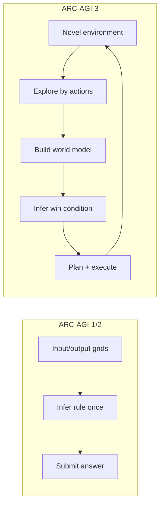

**[ARC-AGI-3](https://arcprize.org/arc-agi/3)** — первый интерактивный бенчмарк для оценки **agentic intelligence**: AI-агент попадает в незнакомую turn-based среду **без инструкций**, должен исследовать механику, самостоятельно вывести цель, построить world model и пройти уровни **не хуже человека по числу действий**. Люди решают 100% сред; frontier reasoning-модели на официальном лидерборде — **ниже 1%** (март 2026).

Ниже — что это за бенчмарк, чем он отличается от статичных ARC-AGI-1/2, как устроен scoring, **как участвовать** в [ARC Prize 2026](https://arcprize.org/competitions/2026/arc-agi-3), насколько он популярен и **критический разбор** — что измеряет, а что нет. Для глубокого разбора конкретного harness (Symbolica, 36% на public eval) см. отдельную статью: [Symbolica и Agentica на ARC-AGI-3](/vairl/blog/2026/07/04/symbolica-agentica-arc-agi-3-ru/).

---

## Содержание

| Раздел | О чём |
|--------|-------|
| [Линейка ARC-AGI](#линейка-arc-agi-от-статичных-головоломок-к-интерактивным-средам) | Эволюция 1 → 2 → 3 |
| [Что измеряет ARC-AGI-3](#что-измеряет-arc-agi-3) | 4 столпа + формат среды |
| [Scoring: RHAE](#scoring-rhae-relative-human-action-efficiency) | Формула и интерпретация |
| [Датасеты и лидерборды](#датасеты-и-два-лидерборда) | Public / private, official vs community |
| [Популярность и контекст](#популярность-и-контекст) | ARC Prize, preview, цифры |
| [Как участвовать](#как-участвовать-arc-prize-2026) | Kaggle, starter kit, API |
| [Что даёт участие](#что-даёт-участие) | Призы, research, harness |
| [Краткий анализ](#краткий-анализ-сильные-стороны-и-ограничения) | Сильные стороны и ограничения |
| [Ссылки](#ссылки) | Документация и paper |

---

## Линейка ARC-AGI: от статичных головоломок к интерактивным средам

| Версия | Год | Формат | Что тестирует | Типичный human time |
|--------|-----|--------|---------------|---------------------|
| **ARC-AGI-1** | 2019 | Статичные grid-задачи: 2–3 input/output примера → вывести правило | Fluid intelligence, Core Knowledge priors | ~30 с / задача |
| **ARC-AGI-2** | 2025 | Тот же grid, но глубже: multi-step rules, symbolic reasoning | Scaling reasoning на статике | ~300 с / задача |
| **ARC-AGI-3** | 2026 | **Интерактивные игры**: turn-based, без инструкций, уровни | Exploration, modeling, goal-setting, planning | ~20 мин / среда (soft limit) |

ARC Prize Foundation (François Chollet, Mike Knoop) с 2020 ведёт ежегодные соревнования на Kaggle. Предыдущие итерации собрали **913 команд** (2020, ARC-AGI-1), **1 430** (2024) и **1 455** (2025, ARC-AGI-2). Grand prize 85% на ARC-AGI-2 **не взят** — NVIDIA NVARC лидировала с **24%** в 2025.

ARC-AGI-3 — **смена оси**: не «угадать правило по примерам в одном prompt», а **действовать во времени** — perceive → plan → act → обновить beliefs. Это ближе к реальным агентам (coding agents, web agents), чем статичный exact match.



---

## Что измеряет ARC-AGI-3

### Четыре столпа agentic intelligence

По [whitepaper](https://arxiv.org/html/2603.24621) и [документации](https://docs.arcprize.org/arc-agi-3.md):

1. **Exploration** — информация не дана пассивно; агент должен **активно** взаимодействовать со средой.
2. **Modeling** — из наблюдений построить **обобщаемую** модель динамики (наследие ARC-AGI-1/2).
3. **Goal-setting** — определить «что выиграть» **без явных инструкций**; только environmental cues.
4. **Planning and execution** — проложить путь к цели и **корректировать** стратегию по feedback.

### Формат среды

| Параметр | Значение |
|----------|----------|
| Observation | Grid **64×64**, 16 цветов; frame или sequence (анимация между ходами) |
| Actions | Подмножество: 5 простых + Undo + click (x, y) на grid |
| Turn-based | Среда **не** меняется асинхронно — offline reasoning, не reflexes |
| Уровни | ≥6 уровней на игру; первый — tutorial |
| Core Knowledge | Objectness, geometry, basic physics, agentness — **без** языка, цифр, букв, клише «зелёный = go» |
| Human solvable | Каждая среда пройдена ≥2 независимыми участниками из 10 тестируемых |

**Action** в scoring — только дискретное изменение состояния среды. Tool calls, chain-of-thought, retries **не считаются** — это важно для harness-дизайна.

Примеры публичных игр: **ls20** (agent reasoning), **ft09** (elementary logic), **vc33** (orchestration). Полный список — на [arcprize.org/tasks](https://arcprize.org/tasks) или через `arc-agi` toolkit.

---

## Scoring: RHAE (Relative Human Action Efficiency)

Метрика **RHAE** («ray») — [Relative Human Action Efficiency](https://docs.arcprize.org/methodology.md). Интеллект = не только «решил», но **насколько экономно** относительно human baseline.

### Per-level

```
level_score = (human_baseline_actions / ai_actions)²
```

| Human baseline | AI actions | level_score |
|----------------|------------|-------------|
| 10 | 10 | 1.0 (100%) |
| 10 | 20 | 0.25 (25%) |
| 10 | 100 | 0.01 (1%) |

- Human baseline — **upper median** среди first-time игроков (не среднее, не speedrun).
- Cap на уровне: **1.15×** human — shortcut быстрее человека даёт максимум +15%.
- Hard cutoff eval: **5× human actions** на уровень — дальше агент обрывается.

### Per-game и total

- Game score — **взвешенное среднее** по уровням; вес = номер уровня (поздние уровни важнее tutorial).
- Незавершённые уровни **снижают потолок** game score: прошли 4 из 5 → max game score = 10/15 ≈ 66.7%.
- Total score — среднее по играм, диапазон **0–100%**. **100%** = все игры/уровни с human-level efficiency.

**100% на ARC-AGI-3** в терминах Foundation — operational definition «AGI gap closed» для agentic skill acquisition.

---

## Датасеты и два лидерборда

По [Table 1 whitepaper](https://arxiv.org/html/2603.24621):

| Датасет | Назначение | # сред |
|---------|------------|--------|
| **Public Demo** | Демо формата, human play, local dev | **25** |
| **Semi-Private** | Eval frontier API (риск leakage) | **55** |
| **Fully Private** | Официальный competition holdout | **55** |

Публичный eval Symbolica (182 playable levels, 25 games) — это **public demo set**. Foundation **не публикует** public-set scores на official leaderboard: public set **materially easier**, чем private; harness с human replay может набрать 100% на public — это не мера AGI.

### Official vs Community leaderboard

| | Official | Community |
|---|----------|-----------|
| **Цель** | Насколько близки **frontier models** к human AGI **без** task-specific prep | Harness research, task automation |
| **Метод** | Один system prompt, **без tools**, semi-private set | Self-reported, любые harness |
| **Harness** | Не используется для official scores | Поощряется |
| **Интерпретация** | AGI progress signal | Экономическая ценность automation, **не** AGI |

Official prompt (фиксированный для всех моделей):

> You are playing a game. Your goal is to win. Reply with the exact action you want to take. The final action in your reply will be executed next turn.

**Semi-private scores at release** (март 2026):

| Provider | Model | Score |
|----------|-------|-------|
| Google | Gemini 3.1 Pro Preview | **0.37%** |
| OpenAI | GPT 5.4 (High) | **0.26%** |
| Anthropic | Opus 4.6 (Max) | **0.25%** |
| xAI | Grok-4.20 (Beta) | **0.00%** |

Community/harness scores на public set могут быть **на порядки выше** — см. [Symbolica 36%](/vairl/blog/2026/07/04/symbolica-agentica-arc-agi-3-ru/) — но Foundation явно предупреждает не путать это с AGI progress.

---

## Популярность и контекст

### ARC Prize как институция

- **$2M** total prize pool ARC Prize 2026 (два трека: ARC-AGI-3 + финальный год ARC-AGI-2).
- **ARC-AGI-3 track: $850K** — Grand Prize **$700K** за первого eligible агента с **100%** на eval; Top-5 **$75K**; Milestone prizes **$75K** (deadlines: 30 июня и 30 сентября 2026).
- Соревнование на **[Kaggle](https://www.kaggle.com/competitions/arc-prize-2026-arc-agi-3)** — code competition, open source обязателен для призов.

### Developer Preview (июль–август 2025)

30-дневный **ARC-AGI-3 Preview Agent Competition**: 3 public + 3 hidden games. Победитель — **StochasticGoose / Tufa Labs (12.58%)** — CNN + RL для предсказания frame changes; второе место **Blind Squirrel (6.71%)** — directed state graphs. Оба — informed search, не frontier LLM harness.

Preview показал: ранние агенты **generalize poorly** на hidden set — задал tone для 2026 competition.

### Инфраструктура и community

| Ресурс | Масштаб (июль 2026) |
|--------|---------------------|
| [ARC-AGI-3-Agents](https://github.com/arcprize/ARC-AGI-3-Agents) (framework) | ~280 GitHub stars |
| [ARC-AGI-3-Kaggle-Starter](https://github.com/arcprize/ARC-AGI-3-Kaggle-Starter) | новый starter kit |
| PyPI `arc-agi` | локальный game engine, +2K FPS без render |
| Partner templates | Anthropic, LangChain, HuggingFace, AgentOps, GPT-OSS on Kaggle |

Бенчмарк **молодой**, но опирается на **6+ лет** ARC Prize community (2020–2025) и авторитет Chollet/Knoop. В AI research circles ARC-AGI historically **predictive** — o1/o3 breakthrough на ARC-AGI-1 был первым сигналом test-time reasoning.

---

## Как участвовать: ARC Prize 2026

### Путь через Kaggle (основной для competition)

1. Принять правила на [Kaggle competition page](https://www.kaggle.com/competitions/arc-prize-2026-arc-agi-3).
2. Клонировать [ARC-AGI-3-Kaggle-Starter](https://github.com/arcprize/ARC-AGI-3-Kaggle-Starter).
3. **Python 3.12**, Kaggle API token в `.kaggle/access_token` (project-local).
4. `make setup` → редактировать **`agent/my_agent.py`** (единственный файл).
5. `make play-local` — прогон на реальных играх локально (секунды).
6. `make submit` → на Kaggle: **Submit to Competition** → `submission.parquet`.
7. **5 submissions в день** — тестируйте локально перед submit.

Минимальный agent API:

```python
class MyAgent(Agent):
    def is_done(self, frames, latest_frame) -> bool:
        """True когда агент хочет остановиться."""
        ...

    def choose_action(self, frames, latest_frame) -> GameAction:
        """Следующее действие по состоянию игры."""
        ...
```

**Phase A:** Kaggle Save & Run All — проверка кода. **Phase B:** Competition Rerun на **hidden set** — leaderboard score.

Ограничения competition:
- **No internet** during evaluation
- Open source для призов
- Accelerator: CPU / T4 (default) / P100 / RTX 6000 (ARC-AGI-3 exclusive, жрёт GPU quota)

### Путь через API / toolkit (research & iteration)

Для exploration вне Kaggle submission loop:

```bash
uv init && uv add arc-agi
export ARC_API_KEY="..."   # бесплатный ключ на docs.arcprize.org
```

```python
import arc_agi
from arcengine import GameAction

arc = arc_agi.Arcade()
env = arc.make("ls20", render_mode="terminal")
for _ in range(10):
    env.step(GameAction.ACTION1)
print(arc.get_scorecard())
```

Дальше: [agents quickstart](https://docs.arcprize.org/agents-quickstart.md), [LLM agents guide](https://docs.arcprize.org/llm_agents.md), [benchmarking tool (beta)](https://docs.arcprize.org/benchmarking-agent.md), replays на [arcprize.org](https://arcprize.org/arc-agi/3).

### Milestone prizes

Open-source до **30 июня 2026** (Milestone #1) и **30 сентября 2026** (Milestone #2) — отдельные призы **$25K / $10K / $2.5K** за прогресс, даже без Grand Prize.

---

## Что даёт участие

| Для кого | Что получаете |
|----------|---------------|
| **Researcher** | Измеримый stress-test agentic generalization; paper-quality benchmark с human calibration; воспроизводимый toolkit |
| **Engineer / startup** | Полигон для harness innovation (orchestration, memory, code execution) — идеи могут «подняться» в first-party models (история CoT → o1) |
| **Competitor** | До **$700K** Grand Prize; guaranteed **$150K** в Top-5 + Milestones; visibility в ARC Prize community |
| **Практик agent dev** | Реальные среды с sparse feedback, action budget, partial observability — ближе к production agents, чем MMLU |

Конкретные навыки, которые прокачивает работа над ARC-AGI-3:

- **Context management** — naive rolling window 64×64 frames быстро съедает context; нужны diff/summary/code-over-history.
- **Exploration vs exploitation** — brute-force penalized квадратом в RHAE.
- **Multi-level transfer** — механики compositional; поздние уровни требуют накопленного понимания.
- **Goal inference** — нет prompt «собери три звезды»; агент должен вывести win condition из dynamics.

Связанные материалы в блоге: [генерация бенчмарков для агентов](/vairl/blog/2026/06/29/agent-benchmark-generation-ru/), [устойчивость control loops](/vairl/blog/2026/06/29/agent-control-loop-stability-ru/).

---

## Краткий анализ: сильные стороны и ограничения

### Почему бенчмарк сильный

1. **Anti-memorization by design** — novel games, Core Knowledge only, private holdout OOD от public; invert ratio vs ARC-AGI-2 (public = demo, not training set).
2. **Human-calibrated** — 100% solvable; continuous testing в SF (Mon/Wed/Fri); video replay analysis для problematic mechanics.
3. **Efficiency, not binary pass** — RHAE penalizes brute-force; aligns с «intelligence = skill acquisition efficiency» (Chollet 2019).
4. **Interactive = right axis for 2026** — static ARC saturated harness tricks; ARC-AGI-3 tests what coding/web agents actually do.
5. **Transparent methodology** — open paper, public games playable humans + AI, replays, two leaderboard tiers with explicit interpretation rules.

### Ограничения и caveats

| Вопрос | Критика |
|--------|---------|
| **Harness vs model** | Official scores без tools ≈ 0%; с harness на public — десятки %. Разрыв **не** «модель тупая», а «нужен agent runtime». Foundation осознанно разделяет leaderboards. |
| **Public ≠ private** | Harness, обученный на 3 public games, даёт bimodal generalization (97% на одной unseen public game, 0% на другой). Public eval **не** proxy AGI. |
| **Cost** | Full eval frontier API — **десятки тысяч $** (paper, early 2026); 5× human action cutoff может занижать score. |
| **Action-only efficiency** | Compute, wall-clock, risk — сведены к action count; спорное упрощение, но стандартизирует human-AI compare. |
| **Grid abstraction** | 64×64 discrete — не robotics, не real web; но намеренно isolates reasoning from perception motor skills. |
| **Community leaderboard trust** | Self-reported, unverified — hype risk. |

### Практический вывод

ARC-AGI-3 — **лучший на сегодня public signal** для «может ли система адаптироваться к novel interactive domain без инструкций». Для **product engineering** community leaderboard и harness research **не менее ценны**, чем official AGI metric — Symbolica, Duke harness, Arcgentica показывают, что **runtime architecture** может дать 100× lift на том же frontier model.

Для **инвестора / researcher**, смотрящего на AGI gap: official **<1% vs 100% human** — честный snapshot марта 2026. Для **практика**: начните с `make play-local` на ls20, изучите RHAE scoring, затем решите — random agent, LLM+REPL, или multi-agent coordinator.

---

## Ссылки

| Ресурс | URL |
|--------|-----|
| ARC-AGI-3 overview | https://arcprize.org/arc-agi/3 |
| Competition + prizes | https://arcprize.org/competitions/2026/arc-agi-3 |
| Kaggle competition | https://www.kaggle.com/competitions/arc-prize-2026-arc-agi-3 |
| Docs index | https://docs.arcprize.org/ |
| Kaggle Starter | https://github.com/arcprize/ARC-AGI-3-Kaggle-Starter |
| Scoring (RHAE) | https://docs.arcprize.org/methodology.md |
| Whitepaper | https://arxiv.org/html/2603.24621 |
| Play games (human) | https://arcprize.org/tasks |
| Symbolica harness deep dive (VAIRL) | [/vairl/blog/2026/07/04/symbolica-agentica-arc-agi-3-ru/](/vairl/blog/2026/07/04/symbolica-agentica-arc-agi-3-ru/) |

---

*Обновлено: июль 2026. Official scores и prize rules — сверяйте с [arcprize.org](https://arcprize.org) и Kaggle перед участием.*
