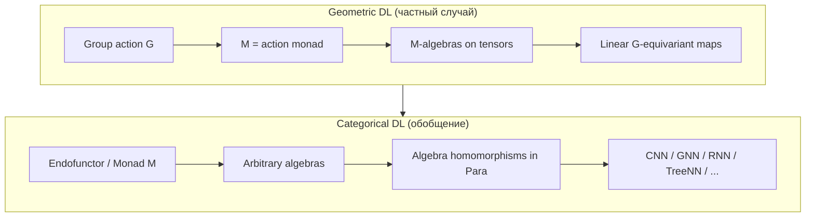
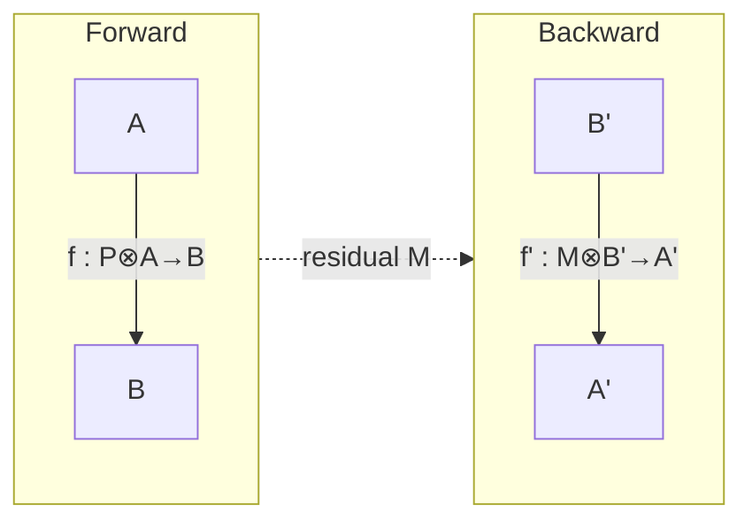

**Categorical Deep Learning** (CDL) — молодое направление на стыке теории категорий и deep learning, которое пытается заменить набор ad hoc архитектурных эвристик **единой математической теорией**. Центральная позиция сформулирована в position paper [Gavranović et al., ICML 2024](https://proceedings.mlr.press/v235/gavranovic24a.html): CDL — это **алгебраическая теория всех архитектур**, где ограничения на модель (equivariance, структура данных, weight tying) и их реализация (слои, параметры, backprop) описываются в одном формализме.

> **Важно:** CDL не имеет отношения к *categorical cross-entropy* (функции потерь для многоклассовой классификации) и к *Categorical DQN* (RL с распределениями наград). Речь идёт о **category theory** как языке композиции и структуры.

Ниже — обзор: откуда выросло направление, какие идеи лежат в основе, что уже формализовано, где границы применимости и куда движется поле в 2025–2026.

---

## Зачем это нужно

Deep learning успешен, но теоретически фрагментирован:

| Проблема | Как проявляется |
|----------|-----------------|
| Нет общей теории архитектур | Каждый класс сетей (CNN, GNN, Transformer, RNN) — отдельная «школа» |
| Ad hoc design | Эффективность часто зависит от эмпирических трюков, а не от принципов |
| Разрыв spec ↔ implementation | Ограничения (symmetry, typing) задаются отдельно от кода слоёв |
| Хрупкость backprop | Автодифф работает, но compositional semantics gradient flow слабо формализована |

[Geometric Deep Learning (GDL)](https://arxiv.org/abs/2104.13478) (Bronstein et al.) — важный предшественник: «blueprint» для сетей на графах, группах, многообразиях через **equivariance** к групповым действиям. CDL **обобщает** GDL: вместо групп — **монады, эндофункторы и их алgebras**; вместо только линейных equivariant слоёв — parametric maps в 2-категории **Para**.

Систематический обзор пересечения category theory и deep learning: [Crescenzi, 2024 — Towards a Categorical Foundation of Deep Learning](https://arxiv.org/abs/2410.05353); более широкий survey: [A Survey of Category Theory and Deep Learning](https://www.academia.edu/146222386/A_Survey_of_Category_Theory_and_Deep_Learning) (2025).

---

## Минимальный словарь категорий для ML-инженера

Не нужно быть алгебраистом, чтобы понять мотивацию CDL. Достаточно нескольких образов:

| Понятие | Интуиция для DL |
|---------|-----------------|
| **Категория** | Типы данных (objects) + допустимые преобразования (morphisms) |
| **Композиция** | Последовательное соединение слоёв: \(g \circ f\) |
| **Функтор** | Перевод структуры между «уровнями» (например, символы → векторы) с сохранением композиции |
| **Натуральное преобразование** | Согласованное семейство отображений между функторами; близко к «одинаковому правилу на всех объектах» |
| **Монада** \(M\) | Шаблон «упаковки» структуры: \(M(A)\) — A с дополнительным контекстом (список, дерево, orbit под группой) |
| **M-алгебра** | Способ «свернуть» \(M(A) \to A\) — carrier с законом структуры |
| **Гомоморфизм алgebras** | Отображение \(f: A \to B\), **уважающее** структуру — это и есть обобщение **equivariance** |

Ключевая формула CDL: **слой нейросети = гомоморфизм M-алgebras** (или lax-алgebras в 2-категориальной версии) между носителями входа и выхода.

---

## Три опоры категорийного подхода к DL

Обзор Crescenzi выделяет четыре темы; для практика полезно сгруппировать их в три «столпа».

### 1. Parametric Optics — compositional backprop

Gradient-based learning требует двух вещей: **параметры** и **двунаправленный поток** (forward / backward). Категорийный ответ — связка **Para + Optics**.

#### Para: параметры как 1-cells

Пусть \(C\) — категория типов (например, конечномерные векторные пространства). **Para\((C)\)** — 2-категория, где:

- **0-cells** — объекты \(A, B, \ldots\) (пространства активаций);
- **1-cells** \((P, f): A \to B\) — отображения с **локальным** параметром \(P\): \(f: P \otimes A \to B\);
- **2-cells** \(r: (P, f) \Rightarrow (Q, g)\) — reparametrization \(r: P \to Q\), совместимая с \(f, g\) (формализация **weight tying**).

Композиция parametric maps:

\[
(P, f) \circ (Q, g) = \bigl(Q \otimes P,\; g \circ (Q \otimes f)\bigr)
\]

Интуиция: параметры двух слоёв **тensorируются** — это категорийная версия «у каждого слоя свой `W`, но композиция корректна».

#### Lenses и Optics: forward ⇄ backward

В Cartesian категории **lens** — пара:

\[
\ell = \left(f,\; f'\right): \left(A \atop A'\right) \rightrightarrows \left(B \atop B'\right),
\quad f: A \to B,\quad f': A \times B' \to A'
\]

- \(f\) — **forward pass**;
- \(f'\) — **backward pass**: из «upstream» градиента \(B'\) и входа \(A\) восстанавливает «downstream» \(A'\).

**Optic** ослабляет связь forward/backward и вводит **residual space** \(M\):

\[
f: A \to M \otimes B, \qquad f': M \otimes B' \to A'
\]

Residual \(M\) хранит промежуточные значения (activations) для backward — категорийная версия «save for backward» в autograd. **Weighted optics** ([Gavranović, 2024b](https://arxiv.org/abs/2402.15332)) позволяют forward и backward жить в **разных** категориях — нужно, когда градиент и активация имеют разную структуру.

#### Backprop = композиция оптик

Для двух слоёв \(\ell_1, \ell_2\) композиция lens даёт:

\[
\ell_2 \circ \ell_1 = \bigl(g \circ f,\; \lambda (a, c') \mapsto f'\bigl(a, g'(f(a), c')\bigr)\bigr)
\]

Это **chain rule** в явном виде: backward второго слоя «видит» forward первого. Для \(L\) слоёв — \(L\)-кратная композиция; autograd реализует ровно это, но без явной семантики.

Связка с Para: parametric optic — optic, чей forward зависит от \(P \otimes A\). Обучение — поиск 2-cell reparametrization (обновление весов), сохраняющей коммутативность диаграммы.

Итог: backprop — не «магия autograd», а **композиция оптик** в monoidal категории. Отсюда — principled semantics для AD, корректная параллелизация и потенциал замены tape-based autograd ([CGG+22](https://arxiv.org/abs/2204.02347), [Capucci et al., 2024](https://arxiv.org/abs/2402.09270)).

### 2. Categorical Deep Learning proper — алgebras и архитектуры

Position paper Gavranović, Gavranović, Dudzik, Bakewell, Tuyéras, de Haan, Koutnik, Pearce ([ICML 2024](https://arxiv.org/abs/2402.15332)):

1. Выбираем категорию (часто **Vect** или **Para(Vect)**).
2. Задаём monad / endofunctor \(M\), кодирующий структуру данных.
3. Вход и выход — **M-algebras** \((A, a)\), \((B, b)\).
4. Слой — **M-algebra homomorphism** \(f: (A,a) \to (B,b)\).

**Восстановление GDL:** monad от group action → algebra на \(\mathbb{R}^{Z_w \times Z_h}\) → equivariant endomorphism = GDL-слой. Отсюда выводятся G-CNN, Spherical CNN, GNN (см. Appendix C оригинала).

**За пределами групп:** lists, trees, automata — algebras других endofunctors:

| Структура | Endofunctor | Архитектура |
|-----------|-------------|-------------|
| Списки | \(1 + A \times -\) | RNN, seq2seq cells |
| Деревья | polynomial functor | Recursive NN |
| Автомат | coalgebra | Stateful / Mealy-style сети |
| Графы | sheaf / presheaf | GNN, sheaf NN |

CDL показывает: **RNN — не отдельная «история», а тот же рецепт**, что equivariant CNN, но с другой monad.

Условие гомоморфизма — **коммутирующая диаграмма**. Для monad \(M\), алgebras \((A,a)\), \((B,b)\) и отображения \(f: A \to B\):

\[
f \circ a = b \circ M(f)
\]

Для monad группового действия это сводится к привычной equivariance: \(f(g \cdot x) = g \cdot f(x)\).

### 3. String diagrams и functor learning

**String diagrams** — графический язык композиции в monoidal категориях; применяются для детальной спецификации архитектур (главы 4 survey Crescenzi). **Functor learning** — обучение не отображения между объектами, а **функтора между категориями**, сохраняющего структуру; перспектива для transfer между доменами и meta-learning.

---

## От equivariance к «category-equivariance»

В 2025 появилась развитая линия [Categorical Equivariant Deep Learning (CENNs)](https://arxiv.org/abs/2511.18417) (Maruyama): equivariance формулируется как **naturality** в топологической категории с мерами Radon. Единый framework покрывает:

- group / groupoid equivariant networks;
- poset / lattice equivariant networks;
- graph и **cellular sheaf** neural networks.

Доказан **general equivariant universal approximation theorem**: конечной глубины CENNs достаточно для аппроксимации непрерывных equivariant maps. Это расширяет горизонт GDL/CDL: симметрии не только геометрические, но и **контекстуальные и композиционные**.

---

## Карта исследований (2024–2026)

| Направление | Суть | Ключевые работы |
|-------------|------|-----------------|
| **CDL / monad algebras** | Единая теория архитектур | Gavranović et al. ICML 2024 |
| **Optics + AD** | Compositional backprop | CGG+22, Gavranović 2024b |
| **Survey / foundation** | Обзор поля | Crescenzi 2024, CT+DL Survey 2025 |
| **CENNs** | Category-equivariant UAT | Maruyama 2025 |
| **Topos / logic** | Интерпретируемость, reasoning | (отдельная ветка; в survey Crescenzi — за рамками) |
| **Categorical probability** | Байес, generative models | FST19, Cho-Jacobs, etc. |

Репозиторий-агрегатор статей: [gavranovic/category-theory-machine-learning](https://github.com/gavranovic/category-theory-machine-learning).

---

## Что это даёт на практике

CDL сегодня — скорее **design language и correctness criterion**, чем готовый PyTorch-слой:

1. **Спецификация constraints до кода.** «Слой должен быть hom algebra для monad списков» → автоматически следуют законы weight tying в RNN.
2. **Верифицируемый weight tying.** 2-cells в Para формализуют, когда reparametrization корректна.
3. **Новые архитектуры из CS-структур.** Выбрал coalgebra автомата — получил шаблон stateful сети с доказуемыми свойствами.
4. **Type-safe code synthesis (перспектива).** Lax algebras на категории типов → сети, выдающие только well-typed программы (гипотеза авторов ICML paper).
5. **Мост к neurosymbolic.** CDL и [нейросимволические пайплайны](/vairl/blog/2026/06/25/neurosymbolic-planning-pipeline-ru/) сходятся в идее: структура задаётся **вне** gradient descent, а обучаемая часть — homomorphisms, сохраняющие эту структуру.

---

## Ограничения и открытые вопросы

| Вопрос | Статус |
|--------|--------|
| **Tractability** | Полная 2-категорная формализация тяжела; на практике работают частные случаи |
| **Nonlinear layers** | Vect-алgebras описывают линейную часть; нелинейности добавляют через Para / enriched categories |
| **Scale** | Нет доказательства, что CDL-guided архитектуры бьют SOTA «в лоб» на ImageNet |
| **Empirical validation** | Много position/survey; меньше benchmark-driven papers |
| **Tooling** | Нет mainstream фреймворка уровня PyTorch/JAX с CDL-spec; в основном Coq/Agda + research code |
| **Размер concerns** | Категорийные конструкции часто игнорируют finiteness — caveat для реальных tensor dims |

Авторы position paper честно позиционируют работу как **foundation**, не как инженерный cookbook. Ценность — в **едином языке** для GDL, RNN, GNN и future architectures.

---

## Как читать дальше (маршрут)

**Уровень 1 — интуиция (1–2 дня):**

1. [Geometric Deep Learning blueprint](https://arxiv.org/abs/2104.13478) — чтобы понять, что CDL generalizes.
2. [Position: Categorical DL (ICML 2024)](https://arxiv.org/abs/2402.15332) — Sections 1–2, Examples 2.4–2.6.

**Уровень 2 — backprop categorically:**

3. [Introduction to categorical deep learning (blog series)](https://www.localmaximum.io/posts/categorical-deep-learning-1/) — доступное введение.
4. [Categorical Foundations of Gradient-Based Learning](https://arxiv.org/abs/2402.09270) — optics + Para.

**Уровень 3 — полный survey:**

5. [Crescenzi thesis/survey, 2024](https://arxiv.org/abs/2410.05353) — 4 главы: optics, CS→NN, functor learning, string diagrams.
6. [CENNs, 2025](https://arxiv.org/abs/2511.18417) — если интересует equivariance beyond groups.

**Математический фон:** [Seven Sketches in Compositionality](https://math.mit.edu/~dspivak/teaching/sp18/7Sketches.pdf) (Fong & Spivak); [Category Theory for Machine Learning](https://github.com/gavranovic/category-theory-machine-learning).

---

## Связь с другими темами блога

| Тема блога | Связь с CDL |
|------------|-------------|
| [Agent control loops](/vairl/blog/2026/06/29/agent-control-loop-stability-ru/) | Coalgebras автоматов ↔ stateful policies |
| [Neurosymbolic planning](/vairl/blog/2026/06/25/neurosymbolic-planning-pipeline-ru/) | Algebras на типах / логике |
| [Hypothesis space / PaCMAP](/vairl/blog/2026/06/24/hypothesis-space-pacmap-ru/) | Пространство архитектур как категория объектов |
| [NAS](/vairl/blog/2026/01/15/neural-architecture-search-ru/) | CDL как declarative альтернатива blind search |

---

## Резюме

**Categorical Deep Learning** — попытка построить **Erlangen programme для machine learning**: не перечислять архитектуры, а классифицировать их через **структуры** (monads, endofunctors, 2-categories). GDL становится частным случаем; RNN, tree networks и equivariant CNN — instances одного рецепта **algebra homomorphisms in Para**. Compositional backprop живёт в **optics**; equivariance beyond groups — в **CENNs**.

Поле молодое, empirically thin, но conceptually coherent. Для исследователя архитектур и agent systems CDL полезен как **lens**: видеть общие паттерны там, где раньше были разрозненные «типы сетей». Для production ML сегодня — скорее north star, чем daily tool.

---

## Источники

- Gavranović, Gavranović, Dudzik, Bakewell, Tuyéras, de Haan, Koutnik, Pearce. *Position: Categorical Deep Learning is an Algebraic Theory of All Architectures.* ICML 2024. [arXiv:2402.15332](https://arxiv.org/abs/2402.15332)
- Crescenzi. *Towards a Categorical Foundation of Deep Learning: A Survey.* 2024. [arXiv:2410.05353](https://arxiv.org/abs/2410.05353)
- Maruyama. *Categorical Equivariant Deep Learning.* 2025. [arXiv:2511.18417](https://arxiv.org/abs/2511.18417)
- Bronstein, Bruna, Cohen, Veličković. *Geometric Deep Learning.* 2021. [arXiv:2104.13478](https://arxiv.org/abs/2104.13478)
- Capucci et al. *Categorical Foundations of Gradient-Based Learning.* 2024. [arXiv:2402.09270](https://arxiv.org/abs/2402.09270)
