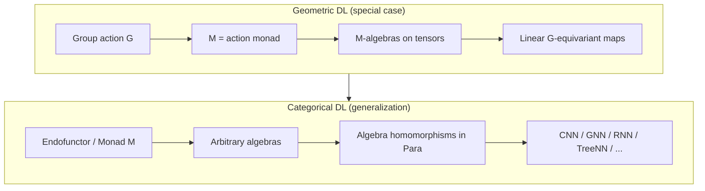
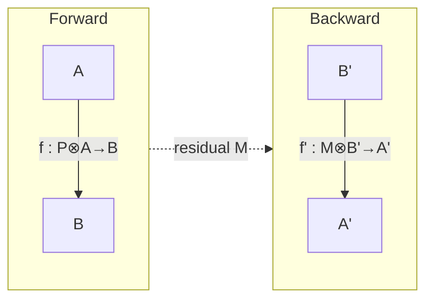

**Categorical Deep Learning** (CDL) is an emerging field at the intersection of category theory and deep learning that aims to replace ad hoc architectural heuristics with a **unified mathematical theory**. The central position is stated in the [Gavranović et al., ICML 2024](https://proceedings.mlr.press/v235/gavranovic24a.html) position paper: CDL is an **algebraic theory of all architectures**, where model constraints (equivariance, data structure, weight tying) and their implementations (layers, parameters, backprop) are described in a single formalism.

> **Important:** CDL has nothing to do with *categorical cross-entropy* (a loss function for multi-class classification) or *Categorical DQN* (RL with reward distributions). It is about **category theory** as a language of composition and structure.

Below is an overview: where the field comes from, the core ideas, what has been formalized, the limits of applicability, and where the field is heading in 2025–2026.

---

## Why it matters

Deep learning is successful but theoretically fragmented:

| Problem | How it shows up |
|---------|-----------------|
| No general theory of architectures | Each network family (CNN, GNN, Transformer, RNN) is its own "school" |
| Ad hoc design | Performance often depends on empirical tricks, not principles |
| Spec ↔ implementation gap | Constraints (symmetry, typing) are specified separately from layer code |
| Fragile backprop | Autodiff works, but compositional semantics of gradient flow is weakly formalized |

[Geometric Deep Learning (GDL)](https://arxiv.org/abs/2104.13478) (Bronstein et al.) is an important precursor: a "blueprint" for networks on graphs, groups, and manifolds via **equivariance** to group actions. CDL **generalizes** GDL: groups are replaced by **monads, endofunctors, and their algebras**; linear equivariant layers by parametric maps in the 2-category **Para**.

Systematic survey of category theory and deep learning: [Crescenzi, 2024 — Towards a Categorical Foundation of Deep Learning](https://arxiv.org/abs/2410.05353); broader survey: [A Survey of Category Theory and Deep Learning](https://www.academia.edu/146222386/A_Survey_of_Category_Theory_and_Deep_Learning) (2025).

---

## A minimal category theory vocabulary for ML engineers

You do not need to be an algebraist to understand CDL's motivation. A few images suffice:

| Concept | DL intuition |
|---------|--------------|
| **Category** | Data types (objects) + admissible transformations (morphisms) |
| **Composition** | Sequential layer stacking: \(g \circ f\) |
| **Functor** | Structure-preserving translation between "levels" (e.g. symbols → vectors) |
| **Natural transformation** | A coherent family of maps between functors; close to "the same rule on all objects" |
| **Monad** \(M\) | A template for "packaging" structure: \(M(A)\) is A with extra context (list, tree, group orbit) |
| **M-algebra** | A way to "fold" \(M(A) \to A\) — a carrier with a structure law |
| **Algebra homomorphism** | A map \(f: A \to B\) that **respects** structure — the generalization of **equivariance** |

The key CDL formula: **a neural network layer = an M-algebra homomorphism** (or lax-algebra in the 2-categorical version) between input and output carriers.

---

## Three pillars of the categorical approach to DL

Crescenzi's survey highlights four themes; for practitioners it helps to group them into three pillars.

### 1. Parametric Optics — compositional backprop

Gradient-based learning requires two things: **parameters** and a **bidirectional flow** (forward / backward). The categorical answer is the **Para + Optics** bundle.

#### Para: parameters as 1-cells

Let \(C\) be a category of types (e.g. finite-dimensional vector spaces). **Para\((C)\)** is a 2-category where:

- **0-cells** are objects \(A, B, \ldots\) (activation spaces);
- **1-cells** \((P, f): A \to B\) are maps with a **local** parameter \(P\): \(f: P \otimes A \to B\);
- **2-cells** \(r: (P, f) \Rightarrow (Q, g)\) are reparametrizations \(r: P \to Q\) compatible with \(f, g\) (formalization of **weight tying**).

Composition of parametric maps:

\[
(P, f) \circ (Q, g) = \bigl(Q \otimes P,\; g \circ (Q \otimes f)\bigr)
\]

Intuition: parameters of two layers are **tensorized** — the categorical version of "each layer has its own `W`, but composition is well-defined".

#### Lenses and Optics: forward ⇄ backward

In a Cartesian category, a **lens** is a pair:

\[
\ell = \left(f,\; f'\right): \left(A \atop A'\right) \rightrightarrows \left(B \atop B'\right),
\quad f: A \to B,\quad f': A \times B' \to A'
\]

- \(f\) is the **forward pass**;
- \(f'\) is the **backward pass**: from upstream gradient \(B'\) and input \(A\) it recovers downstream \(A'\).

An **optic** weakens the forward/backward link and introduces a **residual space** \(M\):

\[
f: A \to M \otimes B, \qquad f': M \otimes B' \to A'
\]

The residual \(M\) stores intermediate values (activations) for backward — the categorical version of "save for backward" in autograd. **Weighted optics** ([Gavranović, 2024b](https://arxiv.org/abs/2402.15332)) allow forward and backward to live in **different** categories — needed when gradients and activations have different structure.

#### Backprop = composition of optics

For two lenses \(\ell_1, \ell_2\), lens composition gives:

\[
\ell_2 \circ \ell_1 = \bigl(g \circ f,\; \lambda (a, c') \mapsto f'\bigl(a, g'(f(a), c')\bigr)\bigr)
\]

This is the **chain rule** made explicit: the backward of the second layer "sees" the forward of the first. For \(L\) layers — an \(L\)-fold composition; autograd implements exactly this, but without explicit semantics.

Combined with Para: a parametric optic is an optic whose forward depends on \(P \otimes A\). Training is a search for 2-cell reparametrizations (weight updates) that preserve diagram commutativity.

Bottom line: backprop is not "autograd magic" but **composition of optics** in a monoidal category. This yields principled semantics for AD, correct parallelization, and the potential to replace tape-based autograd ([CGG+22](https://arxiv.org/abs/2204.02347), [Capucci et al., 2024](https://arxiv.org/abs/2402.09270)).

### 2. Categorical Deep Learning proper — algebras and architectures

The position paper by Gavranović, Gavranović, Dudzik, Bakewell, Tuyéras, de Haan, Koutnik, Pearce ([ICML 2024](https://arxiv.org/abs/2402.15332)):

1. Choose a category (often **Vect** or **Para(Vect)**).
2. Specify a monad / endofunctor \(M\) encoding data structure.
3. Input and output are **M-algebras** \((A, a)\), \((B, b)\).
4. A layer is an **M-algebra homomorphism** \(f: (A,a) \to (B,b)\).

**Recovering GDL:** monad from group action → algebra on \(\mathbb{R}^{Z_w \times Z_h}\) → equivariant endomorphism = GDL layer. From this one derives G-CNN, Spherical CNN, GNN (see Appendix C of the original).

**Beyond groups:** lists, trees, automata are algebras of other endofunctors:

| Structure | Endofunctor | Architecture |
|-----------|-------------|--------------|
| Lists | \(1 + A \times -\) | RNN, seq2seq cells |
| Trees | polynomial functor | Recursive NN |
| Automaton | coalgebra | Stateful / Mealy-style nets |
| Graphs | sheaf / presheaf | GNN, sheaf NN |

CDL shows: **RNN is not a separate "story" but the same recipe** as an equivariant CNN, with a different monad.

The homomorphism condition is a **commuting diagram**. For monad \(M\), algebras \((A,a)\), \((B,b)\), and map \(f: A \to B\):

\[
f \circ a = b \circ M(f)
\]

For a group action monad this reduces to the familiar equivariance \(f(g \cdot x) = g \cdot f(x)\).

### 3. String diagrams and functor learning

**String diagrams** are a graphical language for composition in monoidal categories; used for detailed architecture specification (Crescenzi survey, Chapter 4). **Functor learning** means learning not a map between objects but a **functor between categories** that preserves structure — a perspective for cross-domain transfer and meta-learning.

---

## From equivariance to "category-equivariance"

In 2025, [Categorical Equivariant Deep Learning (CENNs)](https://arxiv.org/abs/2511.18417) (Maruyama) developed a line where equivariance is formulated as **naturality** in a topological category with Radon measures. A unified framework covers:

- group / groupoid equivariant networks;
- poset / lattice equivariant networks;
- graph and **cellular sheaf** neural networks.

A **general equivariant universal approximation theorem** is proved: finite-depth CENNs are dense in the space of continuous equivariant transformations. This extends the GDL/CDL horizon: symmetries are not only geometric but also **contextual and compositional**.

---

## Research map (2024–2026)

| Direction | Essence | Key works |
|-----------|---------|-----------|
| **CDL / monad algebras** | Unified theory of architectures | Gavranović et al. ICML 2024 |
| **Optics + AD** | Compositional backprop | CGG+22, Gavranović 2024b |
| **Survey / foundation** | Field overview | Crescenzi 2024, CT+DL Survey 2025 |
| **CENNs** | Category-equivariant UAT | Maruyama 2025 |
| **Topos / logic** | Interpretability, reasoning | (separate branch; outside Crescenzi survey scope) |
| **Categorical probability** | Bayes, generative models | FST19, Cho-Jacobs, etc. |

Paper aggregator repository: [gavranovic/category-theory-machine-learning](https://github.com/gavranovic/category-theory-machine-learning).

---

## Practical value today

CDL is currently more of a **design language and correctness criterion** than a ready-made PyTorch layer:

1. **Specify constraints before code.** "The layer must be an algebra hom for the list monad" → RNN weight tying laws follow automatically.
2. **Verifiable weight tying.** 2-cells in Para formalize when reparametrization is correct.
3. **New architectures from CS structures.** Pick an automaton coalgebra → get a stateful net template with provable properties.
4. **Type-safe code synthesis (prospect).** Lax algebras on a category of types → networks that output only well-typed programs (hypothesis of ICML paper authors).
5. **Bridge to neurosymbolic.** CDL and [neurosymbolic pipelines](/vairl/blog/2026/06/25/neurosymbolic-planning-pipeline/) converge on the idea: structure is fixed **outside** gradient descent; the learnable part consists of homomorphisms preserving that structure.

---

## Limitations and open questions

| Question | Status |
|----------|--------|
| **Tractability** | Full 2-categorical formalization is heavy; practice uses special cases |
| **Nonlinear layers** | Vect-algebras describe the linear part; nonlinearities enter via Para / enriched categories |
| **Scale** | No proof that CDL-guided architectures beat SOTA outright on ImageNet |
| **Empirical validation** | Many position/survey papers; fewer benchmark-driven works |
| **Tooling** | No mainstream PyTorch/JAX-level framework with CDL spec; mostly Coq/Agda + research code |
| **Size concerns** | Categorical constructions often ignore finiteness — a caveat for real tensor dims |

The position paper authors honestly frame their work as a **foundation**, not an engineering cookbook. The value is a **unified language** for GDL, RNN, GNN, and future architectures.

---

## Reading path

**Level 1 — intuition (1–2 days):**

1. [Geometric Deep Learning blueprint](https://arxiv.org/abs/2104.13478) — to see what CDL generalizes.
2. [Position: Categorical DL (ICML 2024)](https://arxiv.org/abs/2402.15332) — Sections 1–2, Examples 2.4–2.6.

**Level 2 — backprop categorically:**

3. [Introduction to categorical deep learning (blog series)](https://www.localmaximum.io/posts/categorical-deep-learning-1/) — accessible introduction.
4. [Categorical Foundations of Gradient-Based Learning](https://arxiv.org/abs/2402.09270) — optics + Para.

**Level 3 — full survey:**

5. [Crescenzi thesis/survey, 2024](https://arxiv.org/abs/2410.05353) — 4 chapters: optics, CS→NN, functor learning, string diagrams.
6. [CENNs, 2025](https://arxiv.org/abs/2511.18417) — if equivariance beyond groups interests you.

**Mathematical background:** [Seven Sketches in Compositionality](https://math.mit.edu/~dspivak/teaching/sp18/7Sketches.pdf) (Fong & Spivak); [Category Theory for Machine Learning](https://github.com/gavranovic/category-theory-machine-learning).

---

## Links to other blog topics

| Blog topic | Connection to CDL |
|------------|-------------------|
| [Agent control loops](/vairl/blog/2026/06/29/agent-control-loop-stability/) | Automaton coalgebras ↔ stateful policies |
| [Neurosymbolic planning](/vairl/blog/2026/06/25/neurosymbolic-planning-pipeline/) | Algebras on types / logic |
| [Hypothesis space / PaCMAP](/vairl/blog/2026/06/24/hypothesis-space-pacmap/) | Architecture space as a category of objects |
| [NAS](/vairl/blog/2026/01/15/neural-architecture-search/) | CDL as a declarative alternative to blind search |

---

## Summary

**Categorical Deep Learning** is an attempt to build an **Erlangen programme for machine learning**: not to enumerate architectures but to classify them by **structure** (monads, endofunctors, 2-categories). GDL becomes a special case; RNN, tree networks, and equivariant CNN are instances of one recipe — **algebra homomorphisms in Para**. Compositional backprop lives in **optics**; equivariance beyond groups in **CENNs**.

The field is young, empirically thin, but conceptually coherent. For architecture and agent-system researchers, CDL is useful as a **lens** for seeing common patterns where there used to be disconnected "network types". For production ML today it is more of a north star than a daily tool.

---

## References

- Gavranović, Gavranović, Dudzik, Bakewell, Tuyéras, de Haan, Koutnik, Pearce. *Position: Categorical Deep Learning is an Algebraic Theory of All Architectures.* ICML 2024. [arXiv:2402.15332](https://arxiv.org/abs/2402.15332)
- Crescenzi. *Towards a Categorical Foundation of Deep Learning: A Survey.* 2024. [arXiv:2410.05353](https://arxiv.org/abs/2410.05353)
- Maruyama. *Categorical Equivariant Deep Learning.* 2025. [arXiv:2511.18417](https://arxiv.org/abs/2511.18417)
- Bronstein, Bruna, Cohen, Veličković. *Geometric Deep Learning.* 2021. [arXiv:2104.13478](https://arxiv.org/abs/2104.13478)
- Capucci et al. *Categorical Foundations of Gradient-Based Learning.* 2024. [arXiv:2402.09270](https://arxiv.org/abs/2402.09270)
