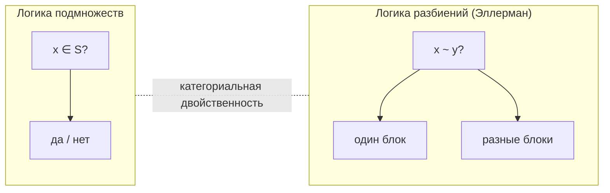
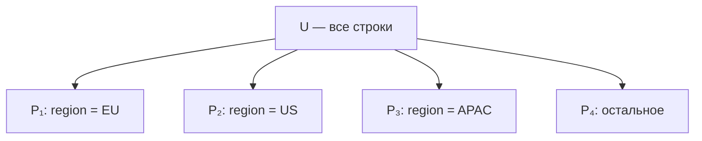
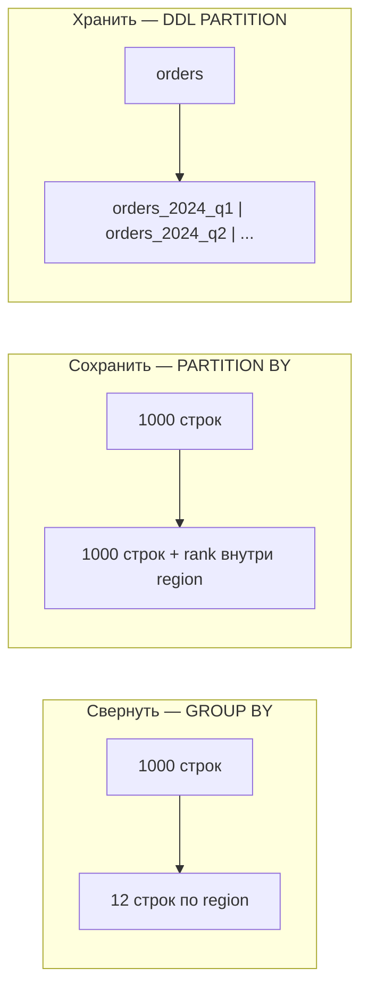
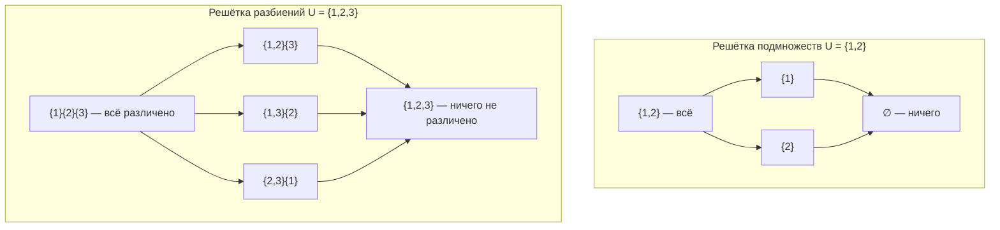

**Разбиение** — один из самых простых и самых мощных приёмов в математике и инженерии данных: разложить множество на **непересекающиеся блоки**, внутри каждого блока строки «эквивалентны» по выбранному критерию, а между блоками — нет. SQL реализует ту же логику в нескольких разных местах, и путаница между ними — частый источник ошибок в запросах и схемах.

Ниже — обзор **логики разбиений** с примерами и таблица соответствий: от аксиом множеств и формальной теории [Дэвида Эллермана](#дэвид-эллерман-и-формальная-логика-разбиений) до `GROUP BY`, `PARTITION BY`, `DISTINCT ON` и `PARTITION BY RANGE` в PostgreSQL.

---

## Дэвид Эллерман и формальная логика разбиений

**[Дэвид Паттерсон Эллерман](https://en.wikipedia.org/wiki/David_Ellerman)** (David Patterson Ellerman, род. 14 марта 1943, Фейет, Миссури) — американский философ, математик и экономист. Его научная карьера охватывает несколько областей, но именно **математическую логику разбиений** (*logic of partitions*) он выделяет как **двойственную** классической логике подмножеств — и развивает её уже более двух десятилетий.

### Области науки

| Область | Вклад Эллермана |
|---------|-----------------|
| **Математическая логика** | Логика разбиений как формальная система: решётка партиций, импликация и ко-импликация на блоках, табличные доказательства, теоремы корректности и полноты |
| **Теория категорий / алгебра** | Категориальная двойственность «подмножество ↔ разбиение»; связь с quotient object vs subobject (Lawvere–Rosebrugh) |
| **Теория информации** | **Логическая энтропия** (*logical entropy*) — мера «различий», которую задаёт разбиение; переосмысление информации через партиции случайных величин, а не через подмножества исходов |
| **Квантовая механика** | Логика **прямых сумм** (*direct-sum decompositions*, DSD) на гильбертовых пространствах — линейное обобщение партиций; интерпретация «объективной неопределённости» (*objective indefiniteness*) |
| **Экономика и социальная теория** | Трудовая теория собственности, демократия на рабочем месте, консалтинг (World Bank, 1992–2003, советник главных экономистов Дж. Стиглица и N. Stern) |
| **Философия науки** | Широкое понимание «логики» как алгебры базовых объектов (не только пропозиций) |

Сайт автора: [ellerman.org](https://www.ellerman.org/). С 2020 года — **associate researcher** при [University of Ljubljana](https://www.ff.uni-lj.si/en); ранее — visiting scholar в UC Riverside (2003–2020).

### Биография (кратко)

| Год | Событие |
|-----|---------|
| 1965 | B.S. по философии науки, **MIT** |
| 1967 | M.A. по философии науки, **Boston University** |
| 1968 | M.A. по экономике, Boston University |
| 1971 | **Ph.D. по математике**, Boston University; диссертация *Sheaves of Relational Structures and Generalized Ultraproducts*, научный руководитель [Rohit Parikh](https://en.wikipedia.org/wiki/Rohit_Parikh) |
| 1971–1976 | Преподавание: математика и экономика в BU, UMass Boston, Boston College, Tufts |
| 1990 | Переезд в **Любляну** (Slovenia), консалтинг по трудовой демократии |
| 1992–2003 | Экономический советник, **World Bank** |
| 2003–2020 | Visiting scholar, **UC Riverside** |
| 2020–н.в. | Associate researcher, **University of Ljubljana** |

Параллельно с экономикой и политэкономией Эллерман публиковал работы по **model theory**, **ultraproducts** и **measure-theoretic quantification** (в т.ч. с Gian-Carlo Rota). Логика разбиений — центральная математическая линия последних лет.

### Главная идея: двойственность подмножеств и разбиений

В классической **логике подмножеств** (Boolean algebra на $\mathcal{P}(U)$) базовый вопрос — **принадлежность**: «элемент $x$ в подмножестве $S$?». В **логике разбиений** базовый вопрос — **различие** (*distinction*): «элементы $x$ и $y$ в **одном** блоке разбиения или в **разных**?».



Эллерман показывает, что на решётке партиций множества $U$ можно определить полный набор логических операций — не только **meet** и **join** (пересечение и наименьшая общая refinement, известные в комбинаторике), но и **импликацию** и **ко-импликацию**, образующие структуру, близкую к Heyting/co-Heyting алгебрам. Для пропозициональной логики двойственность проявляется так: если universe — одноэлементное множество $\{1\}$, логика подмножеств вырождается в **пропозициональную** логику ($\varnothing$ = false, $\{1\}$ = true), а логика разбиений — в **логику различий** на этом же носителе.

> «Если логика — это алгебра подмножеств на universe, то естественно возникает **двойственная** логика партиций. Двойственное понятие (при обращении стрелок) к „части" — это понятие **разбиения**.» — [Ellerman, From propositional logic to subset logic to partition logic](https://www.ellerman.org/from-propositional-logic-to-subset-logic-to-partition-logic/)

### Ключевые работы по логике разбиений

| Работа | Год | Суть |
|--------|-----|------|
| [The Logic of Partitions: Introduction to the Dual of the Logic of Subsets](https://www.ellerman.org/the-logic-of-partitions-introduction-to-the-dual-of-the-logic-of-subsets/) | 2010 | *Review of Symbolic Logic* — от базовых понятий до корректности и полноты табличной системы |
| [An Introduction to Partition Logic](https://academic.oup.com/jigpal/article/22/1/94/663021) | 2014 | *Logic Journal of the IGPL* — вводный курс |
| [New Foundations for Information Theory: Logical Entropy and Shannon Entropy](https://link.springer.com/book/10.1007/978-3-030-86552-8) | 2021 | Springer — логическая энтропия как мера различий разбиения |
| [The Logic of Partitions: With Two Major Applications](https://www.ellerman.org/the-logic-of-partitions-with-two-major-applications/) | 2023 | College Publications — монография: партиции на множестве + DSD на векторных пространствах |
| [Partitions, Objective Indefiniteness, and Quantum Reality](https://link.springer.com/book/10.1007/978-3-031-61786-7) | 2024 | Springer — квантовая интерпретация через логику разбиений |

[PDF монографии 2023](https://www.ellerman.org/wp-content/uploads/2022/01/LogicOfPartitionsBook.pdf) доступен на сайте автора.

### Связь с SQL и инженерией данных

Формальная логика Эллермана и SQL решают **схожую** задачу на разных уровнях:

| Уровень Эллермана | Аналог в SQL / данных |
|-------------------|----------------------|
| Различие $x \sim y$ («в одном блоке») | Равенство ключей: `a.region = b.region` |
| Meet партиций (общая refinement) | `GROUP BY col1, col2` — уточнение разбиения |
| Join партиций (наименьшая common coarsening) | Агрегация по `CASE` / справочнику — склеивание классов |
| Логическая энтропия $H(\pi)$ | Число блоков, entropy по распределению групп, информация о «когда значения совпали» |
| Inverse image partition случайной величины | `PARTITION BY attr` — абстракция от значений, сохранение информации «где одинаково / где различно» |

Эллерман явно трактует партицию как **inverse image partition** случайной величины или атрибута — «без самих значений, но с информацией о том, когда они совпадают или различаются». Именно так работает `GROUP BY region`: мы не обязаны знать детали каждой строки, но знаем, какие строки **неразличимы** по ключу.

SQL не реализует импликацию на решётке партиций как отдельный оператор — но **семантика та же**: выбор ключа задаёт эквивалентность, агрегат — функцию на классе, окно — сохранение различий внутри класса. Формальная логика Эллермана даёт **язык** для того, что инженер данных делает интуитивно.

---

## Что такое разбиение

Пусть $U$ — множество (в SQL — таблица `orders` со строками). **Разбиение** $\mathcal{P}$ множества $U$ — семейство подмножеств $\{P_1, P_2, \ldots, P_k\}$, такое что:

| Аксиома | Формула | Смысл |
|---------|---------|-------|
| **Покрытие** | $\bigcup_i P_i = U$ | Каждая строка попадает ровно в один блок (или явно в «default») |
| **Непересечение** | $P_i \cap P_j = \varnothing$ при $i \neq j$ | Строка не может одновременно быть в двух блоках |
| **Непустота** (обычно) | $P_i \neq \varnothing$ | Пустые блоки не несут информации |



**Ключ разбиения** — набор атрибутов, по которым строки попадают в блок. Для `region` блок — все строки с одинаковым значением `region`. Два разных ключа могут давать **одно и то же** разбиение (например, `user_id` и `(user_id, user_id)`).

---

## Эквивалентность — логическое ядро

Разбиение взаимно однозначно соответствует **отношению эквивалентности** $\sim$ на $U$:

- **Рефлексивность:** $a \sim a$
- **Симметрия:** $a \sim b \Rightarrow b \sim a$
- **Транзивность:** $a \sim b$ и $b \sim c \Rightarrow a \sim c$

**Эквивалентный класс** $[a] = \{ x \in U \mid x \sim a \}$ — это и есть один блок разбиения.

### Пример: заказы по региону

```sql
CREATE TABLE orders (
  id         BIGINT PRIMARY KEY,
  region     TEXT NOT NULL,
  amount     NUMERIC(12, 2),
  created_at TIMESTAMPTZ
);

-- Строки a и b эквивалентны, если a.region = b.region
-- Классы: [EU], [US], [APAC], ...
```

Отношение «одинаковый `region`» — эквивалентность. Разбиение — множество регионов как блоков.

### Пример: не эквивалентность

«`amount` в одном диапазоне» **не** задаёт эквивалентность, если диапазоны **перекрываются** (строка может попасть в два блока). Для разбиения нужны **дискретные, взаимоисключающие** правила:

```sql
-- ✅ Разбиение по непересекающимся интервалам
CASE
  WHEN amount < 100   THEN 'small'
  WHEN amount < 1000  THEN 'medium'
  ELSE                     'large'
END AS amount_bucket
```

Здесь каждая строка получает **ровно одну** метку — это индуцированное разбиение по функции `amount_bucket`.

---

## Три операции над разбиением

Логика разбиений в аналитике сводится к трём операциям. SQL называет их по-разному, но суть одна.

| Операция | Вопрос | Что происходит с блоками |
|----------|--------|--------------------------|
| **Свернуть** (aggregate) | «Один представитель на класс + сводка» | $k$ блоков → $k$ строк |
| **Сохранить** (window) | «Внутри класса пронумеровать / сравнить» | $n$ строк → $n$ строк |
| **Физически отделить** (storage) | «Хранить блоки на разных носителях» | Те же классы, другая топология диска |



### Интерактив: разбиение, GROUP BY и PARTITION BY

Восемь заказов на canvas: переключайте **ключ разбиения** и **операцию**. Клик по кружку подсвечивает его класс эквивалентности; метрики показывают число блоков и «различий между блоками» (пары элементов из разных классов — в духе [логической энтропии Эллермана](#дэвид-эллерман-и-формальная-логика-разбиений)).

<div id="partition-logic-demo" class="partition-logic-widget">
  <div class="pl-header">
    <p>Множество <code>U</code> — 8 строк <code>orders</code>. Ключ задаёт эквивалентность <code>a ~ b</code>; операция — свернуть (<code>GROUP BY</code>), сохранить (<code>PARTITION BY</code>) или отделить физически (DDL).</p>
  </div>
  <div class="pl-controls">
    <span class="pl-controls-label">Ключ</span>
    <button type="button" data-pl-key="none">U (один блок)</button>
    <button type="button" data-pl-key="region" class="active">region</button>
    <button type="button" data-pl-key="region+month">region + month</button>
    <span class="pl-sep"></span>
    <span class="pl-controls-label">Операция</span>
    <button type="button" data-pl-op="view" class="active">Разбиение</button>
    <button type="button" data-pl-op="group">GROUP BY</button>
    <button type="button" data-pl-op="window">PARTITION BY</button>
    <button type="button" data-pl-op="storage">DDL PARTITION</button>
  </div>
  <div class="pl-metrics"></div>
  <div class="pl-canvas-wrap">
    <canvas id="partition-logic-canvas"></canvas>
  </div>
  <div class="pl-sql-wrap">
    <pre class="pl-sql"></pre>
  </div>
  <p class="pl-caption"></p>
</div>

<script src="{{ '/assets/js/partition-logic-demo.js' | relative_url }}"></script>

---

## GROUP BY — свёртка по классам эквивалентности

`GROUP BY` — каноническая реализация **фактор-множества** $U / {\sim}$: каждый эквивалентный класс становится **одной строкой** результата.

```sql
SELECT
  region,
  COUNT(*)           AS order_count,
  SUM(amount)        AS revenue,
  AVG(amount)        AS avg_check
FROM orders
GROUP BY region;
```

| Логика разбиения | SQL |
|------------------|-----|
| Ключ $\sim$ | Выражения в `GROUP BY` |
| Эквивалентный класс | Группа строк с одинаковым ключом |
| Функция на классе | Агрегат: `SUM`, `COUNT`, `MAX`, … |
| Фактор-множество | Результат запроса (по одной строке на группу) |

### Составной ключ

```sql
SELECT region, date_trunc('month', created_at) AS month, SUM(amount)
FROM orders
GROUP BY region, date_trunc('month', created_at);
```

Разбиение **тоньше**: класс = пара `(region, month)`. Число блоков растёт; каждый блок — подмножество прежних «региональных» классов (**refinement** — уточнение разбиения).

### HAVING — фильтр по свойствам класса

`WHERE` отсекает **строки до** группировки; `HAVING` — **классы после** агрегации:

```sql
SELECT region, SUM(amount) AS revenue
FROM orders
GROUP BY region
HAVING SUM(amount) > 1_000_000;
```

Логически: «оставить только те блоки $P_i$, для которых $\sum_{x \in P_i} \mathrm{amount}(x) > 10^6$».

### GROUP BY vs DISTINCT

`SELECT DISTINCT region FROM orders` — тоже разбиение, но **без** функции на классе: только список представителей ключей. Это проекция множества классов, а не свёртка с метриками.

---

## PARTITION BY — оконные функции без свёртки

`PARTITION BY` в оконных функциях задаёт **то же** разбиение строк запроса, но **не схлопывает** строки: каждая строка остаётся, а функция вычисляется **локально внутри своего класса**.

```sql
SELECT
  id,
  region,
  amount,
  created_at,
  ROW_NUMBER() OVER (
    PARTITION BY region
    ORDER BY created_at DESC
  ) AS rn_in_region,
  SUM(amount) OVER (
    PARTITION BY region
  ) AS region_running_total
FROM orders;
```

| | `GROUP BY` | `PARTITION BY` (окна) |
|---|------------|------------------------|
| Число строк на выходе | Меньше (по числу классов) | Столько же, сколько на входе |
| Роль разбиения | Определяет **единственную** строку на класс | Определяет **окно** для каждой строки |
| Типичная функция | `SUM`, `AVG`, `COUNT` | `ROW_NUMBER`, `RANK`, `LAG`, `SUM() OVER` |
| Аналог в матане | Интеграл / мера на классе | Оператор, зависящий от положения в классе |

### Типичный паттерн: «последний заказ в регионе»

```sql
WITH ranked AS (
  SELECT
    *,
    ROW_NUMBER() OVER (
      PARTITION BY region
      ORDER BY created_at DESC
    ) AS rn
  FROM orders
)
SELECT id, region, amount, created_at
FROM ranked
WHERE rn = 1;
```

Логика: в каждом классе $[region]$ выбрать представителя с максимальным `created_at`. В PostgreSQL то же часто пишут короче:

```sql
SELECT DISTINCT ON (region)
  id, region, amount, created_at
FROM orders
ORDER BY region, created_at DESC;
```

`DISTINCT ON (ключ)` — **детерминированный выбор одного элемента на класс** при заданном порядке внутри класса.

### PARTITION BY без ORDER BY

```sql
SUM(amount) OVER (PARTITION BY region)
```

Для каждой строки — сумма **всего** её класса (как если бы `GROUP BY region` «размазали» обратно по строкам через join с агрегатом). В реляционной алгебре это близко к **группировке с последующим equi-join** по ключу.

---

## Физическое разбиение таблицы (DDL)

`CREATE TABLE ... PARTITION BY` — **не другая логика классов**, а **другое место хранения** уже определённых блоков. Эквивалентность задаётся ключом или выражением; СУБД кладёт каждый класс в отдельный сегмент.

### PostgreSQL: RANGE по дате

```sql
CREATE TABLE orders (
  id         BIGINT NOT NULL,
  region     TEXT,
  amount     NUMERIC(12, 2),
  created_at TIMESTAMPTZ NOT NULL
) PARTITION BY RANGE (created_at);

CREATE TABLE orders_2024_q1
  PARTITION OF orders
  FOR VALUES FROM ('2024-01-01') TO ('2024-04-01');

CREATE TABLE orders_2024_q2
  PARTITION OF orders
  FOR VALUES FROM ('2024-04-01') TO ('2024-07-01');
```

| Стратегия | Ключ разбиения | Когда уместна |
|-----------|----------------|---------------|
| **RANGE** | Непрерывный домен (дата, id-диапазон) | Временные ряды, архив по месяцам |
| **LIST** | Конечное перечисление (`region IN (...)`) | Категориальные ключи |
| **HASH** | `HASH(id) mod N` | Равномерная нагрузка без естественных границ |

**Partition pruning:** оптимизатор отбрасывает блоки, не пересекающиеся с предикатом:

```sql
SELECT * FROM orders
WHERE created_at >= '2024-05-01'
  AND created_at <  '2024-06-01';
-- Читается только orders_2024_q2 (если статистика и предикат согласованы с границами)
```

Логически запрос по-прежнему идёт по $U = \bigcup_i P_i$; физически — по подмножеству партиций.

### LIST: разбиение по региону

```sql
CREATE TABLE orders PARTITION BY LIST (region);

CREATE TABLE orders_eu
  PARTITION OF orders FOR VALUES IN ('EU', 'UK');

CREATE TABLE orders_us
  PARTITION OF orders FOR VALUES IN ('US', 'CA');
```

Здесь классы эквивалентности **явно именованы** в DDL. Строка с `region = 'EU'` попадает ровно в `orders_eu`.

---

## Сравнение: одна таблица заказов, три SQL-интерпретации

Исходные данные:

| id | region | amount | created_at |
|----|--------|--------|------------|
| 1 | EU | 100 | 2024-03-01 |
| 2 | EU | 200 | 2024-03-15 |
| 3 | US | 150 | 2024-03-10 |
| 4 | US | 50 | 2024-03-20 |

### 1. GROUP BY — сводка по регионам

```sql
SELECT region, SUM(amount) AS total FROM orders GROUP BY region;
```

| region | total |
|--------|-------|
| EU | 300 |
| US | 200 |

**2 класса → 2 строки.**

### 2. PARTITION BY — детали + локальная статистика

```sql
SELECT id, region, amount,
       SUM(amount) OVER (PARTITION BY region) AS region_total
FROM orders
ORDER BY region, id;
```

| id | region | amount | region_total |
|----|--------|--------|--------------|
| 1 | EU | 100 | 300 |
| 2 | EU | 200 | 300 |
| 3 | US | 150 | 200 |
| 4 | US | 50 | 200 |

**2 класса → 4 строки** (разбиение то же, операция другая).

### 3. DDL PARTITION — те же классы, другие файлы

Таблицы `orders_eu` и `orders_us` хранят строки 1–2 и 3–4 соответственно. Результат

```sql
SELECT region, SUM(amount) FROM orders GROUP BY region;
```

**логически идентичен** п. 1, но при фильтре `WHERE region = 'EU'` СУБД может не читать `orders_us`.

---

## Уточнение и склеивание разбиений

### Refinement (уточнение)

Разбиение $\mathcal{Q}$ **тоньше** $\mathcal{P}$, если каждый блок $\mathcal{Q}$ лежит целиком внутри некоторого блока $\mathcal{P}$.

```sql
-- P: только region
GROUP BY region

-- Q: region + month (тоньше)
GROUP BY region, date_trunc('month', created_at)
```

Сначала делим по регионам, внутри каждого — по месяцам. SQL не требует явно строить $\mathcal{P}$, но планировщик может использовать **multi-stage aggregation**.

### Coarsening (грубее) — через функцию на ключе

```sql
GROUP BY
  CASE region
    WHEN 'EU' THEN 'EMEA'
    WHEN 'UK' THEN 'EMEA'
    ELSE 'AMERICAS'
  END
```

Несколько классов исходного разбиения **склеиваются** в один — это фактор-множество фактор-множества, или гомоморфизм ключей $k \mapsto f(k)$.

---

## Разбиение и JOIN

`JOIN` **не** задаёт разбиение сам по себе, но часто **восстанавливает** структуру после свёртки:

```sql
-- Агрегат по классу
WITH by_region AS (
  SELECT region, SUM(amount) AS total
  FROM orders
  GROUP BY region
)
-- «Размазать» агрегат обратно на строки (semijoin по ключу класса)
SELECT o.id, o.region, o.amount, b.total AS region_total
FROM orders o
JOIN by_region b USING (region);
```

Эквивалентно `SUM(amount) OVER (PARTITION BY region)` при полном покрытии ключом.

**Sharding** в распределённых БД — разбиение **по ключу шарда** с хранением классов на разных узлах; логика та же, что у `PARTITION BY HASH`, но с сетевым маршрутизацией запроса.

---

## Частые ошибки (логика vs синтаксис)

| Ошибка | Суть | Как исправить |
|--------|------|---------------|
| `GROUP BY` вместо окна | Потеряли строки, нужна была только доп. колонка | `SUM(...) OVER (PARTITION BY ...)` |
| Окно без `PARTITION BY` | Один класс = вся таблица | Явно указать ключ класса |
| Перекрывающиеся `CASE` | Нарушена аксиома непересечения | Проверить взаимоисключающие ветки |
| Партиция «мимо» предиката | Pruning не срабатывает (функция на колонке) | Предикат согласовать с границами партиций |
| `SELECT *` в `GROUP BY` | Атрибут вне ключа не определён на классе | Добавить в `GROUP BY` или агрегировать |

### Пример: «наивная» группировка ломает детализацию

```sql
-- ❌ Нужны все заказы, но добавили SUM без окна
SELECT id, region, SUM(amount)
FROM orders
GROUP BY id, region;  -- по сути бессмысленно: id уникален, SUM = amount

-- ✅ Нужна сумма по региону на каждой строке
SELECT id, region, amount,
       SUM(amount) OVER (PARTITION BY region) AS region_total
FROM orders;
```

---

## Сводная таблица: логика ↔ SQL

| Понятие | Математика / логика | SQL |
|---------|---------------------|-----|
| Множество | $U$ | `FROM orders` |
| Отношение эквивалентности | $a \sim b$ | `a.key = b.key` |
| Эквивалентный класс | $[a]$ | `GROUP BY`‑группа или окно `PARTITION BY` |
| Ключ разбиения | Инъекция $U \to K$ на классы | Выражения в `GROUP BY` / `PARTITION BY` |
| Функция на классе | $f: U/{\sim} \to V$ | `SUM`, `COUNT`, `AVG` |
| Фактор-множество | $U/{\sim}$ | Результат `GROUP BY` |
| Представитель класса | Выбор $x \in [a]$ | `DISTINCT ON`, `ROW_NUMBER ... = 1` |
| Уточнение разбиения | Refinement | Больше столбцов в ключе |
| Склеивание классов | Coarsening | `CASE` / справочник в `GROUP BY` |
| Физические блоки | Те же классы, другой носитель | `PARTITION BY RANGE/LIST/HASH` |
| Распределение по узлам | Sharding | `shard_key`, Citus, Vitess |

---

## Когда что использовать

| Задача | Инструмент |
|--------|------------|
| Дашборд: KPI по регионам | `GROUP BY region` |
| На каждой строке — доля внутри региона | `amount / SUM(amount) OVER (PARTITION BY region)` |
| Топ‑3 заказа в каждом регионе | `ROW_NUMBER() OVER (PARTITION BY region ORDER BY amount DESC) <= 3` |
| Архив: удалять старые месяцы одной командой | `PARTITION BY RANGE (created_at)` + `DROP TABLE orders_2023_01` |
| Равномерно разложить 10 млрд строк | `PARTITION BY HASH (id)` или шардирование |
| Список уникальных регионов | `SELECT DISTINCT region` |

---

## Связь с другими темами

- **[Дэвид Эллерман](#дэвид-эллерман-и-формальная-логика-разбиений):** формальная **логика разбиений** как двойственность к логике подмножеств; **логическая энтропия**; линейное обобщение на квантовую логику DSD.
- **Реляционная алгебра:** `GROUP BY` ≈ **группировка** ($\gamma$); окна — расширение, не входящее в классическую алгебру Codd, но формализуемое через **partitioned apply**.
- **MapReduce / Spark:** `groupByKey` — та же свёртка по классу; **combineByKey** — агрегат на блоках; **repartition** — физическое переразбиение без смены логики ключей.
- **AI‑агенты и телеметрия:** сессии, трейсы и tool calls часто **партиционируются** по `session_id` или `run_id` — эквивалентные классы для replay и [агрегации метрик](/vairl/blog/2026/07/04/agent-telemetry-comparison-ru/).
- **Semantic chunking:** разбиение документа на чанки с непересекающимися границами — та же аксиома $\cup P_i = U$ без overlap ([Semantic Torrent](/vairl/blog/2026/06/29/semantic-torrent-vector-search-ru/)).

---

## Две логики лицом к лицу: подмножества vs разбиения

Утверждение «логика разбиений — вторая фундаментальная логика, двойственная логике подмножеств» звучит абстрактно. Разберём его наглядно: возьмём **одно и то же** множество $U = \{1, 2, 3, 4\}$ и посмотрим, какие объекты, вопросы и операции есть в каждой логике.

### Базовый объект и базовый вопрос

| | Логика подмножеств | Логика разбиений |
|---|--------------------|------------------|
| **Базовый объект** | Подмножество $S \subseteq U$ | Разбиение $\pi$ множества $U$ на блоки |
| **Базовый вопрос** | «Элемент $x$ **внутри или снаружи** $S$?» | «Элементы $x$ и $y$ **в одном блоке или в разных**?» |
| **Атом информации** | **Принадлежность** (membership): $x \in S$ | **Различие** (distinction): пара $(x, y)$ в разных блоках |
| **Число объектов на $U$ из $n$ элементов** | $2^n$ подмножеств | $B_n$ разбиений (число Белла: 15 для $n=4$) |
| **Специальный случай** | Пропозициональная логика (при $U = \{1\}$) | Логика «различимости» случайных величин |

Один пример на $U = \{1,2,3,4\}$:

- **Подмножество** $S = \{1, 2\}$ отвечает на четыре вопроса: 1 — внутри, 2 — внутри, 3 — снаружи, 4 — снаружи.
- **Разбиение** $\pi = \{\{1, 2\}, \{3\}, \{4\}\}$ отвечает на шесть вопросов (по числу пар): пара $(1,2)$ — неразличима, пары $(1,3), (1,4), (2,3), (2,4), (3,4)$ — различимы.

Подмножество «красит» элементы в два цвета (in/out). Разбиение «красит» **пары** элементов в два цвета (same/different). Это и есть смысл двойственности: у Лоувера и Роузбро «part» (подобъект) и «partition» (фактор-объект) получаются друг из друга **обращением стрелок** в категории.

### Решётки: как упорядочены объекты

Обе логики образуют решётку, но устроены они по-разному:

| | Логика подмножеств | Логика разбиений |
|---|--------------------|------------------|
| **Порядок** | $S \le T \iff S \subseteq T$ | $\pi \le \sigma \iff \pi$ грубее $\sigma$ (каждый блок $\sigma$ внутри блока $\pi$) |
| **Низ решётки** | $\varnothing$ — «ничего не принадлежит» | $\{U\}$ — один блок, «ничего не различено» |
| **Верх решётки** | $U$ — «всё принадлежит» | $\{\{x\} : x \in U\}$ — все синглтоны, «всё различено» |
| **Meet** $\wedge$ | Пересечение $S \cap T$ | Общее огрубление (common coarsening) |
| **Join** $\vee$ | Объединение $S \cup T$ | Общее уточнение (common refinement) |
| **Дистрибутивность** | Да (булева алгебра) | **Нет** — решётка партиций недистрибутивна |
| **Отрицание** | Дополнение $U \setminus S$ | Прямого аналога нет; есть импликация и ко-импликация |



Обратите внимание на **перевёрнутую интуицию**: в подмножествах «больше» значит «больше элементов внутри», в разбиениях «больше» значит «больше различий» (мельче блоки). `GROUP BY region, month` **выше** в решётке, чем `GROUP BY region`.

### Мера: вероятность vs логическая энтропия

У каждой логики есть естественная числовая мера — и они двойственны так же, как сами логики:

| | Логика подмножеств | Логика разбиений |
|---|--------------------|------------------|
| **Мера** | Вероятность: $P(S) = \dfrac{\lvert S \rvert}{\lvert U \rvert}$ | Логическая энтропия: $h(\pi) = \dfrac{\lvert \mathrm{dit}(\pi) \rvert}{\lvert U \times U \rvert}$ |
| **Что считает** | Долю **элементов** внутри $S$ | Долю **пар**, различённых $\pi$ |
| **Минимум** | $P(\varnothing) = 0$ | $h(\{U\}) = 0$ — один блок, нет различий |
| **Максимум** | $P(U) = 1$ | $h \to 1$ при всех синглтонах |

Именно это считает счётчик «различий между блоками» в [интерактиве](#интерактив-разбиение-group-by-и-partition-by) выше: переключение ключа с `region` на `region + month` увеличивает число различённых пар — разбиение становится информативнее. У Шеннона энтропия отвечает на вопрос «сколько бит нужно для кодирования», у Эллермана — «какая доля пар различена»; вторая формула — это в точности вероятность того, что два случайных элемента попадут в разные блоки.

### Двойственность в SQL-терминах

Обе логики живут в каждом SQL-запросе, просто отвечают за разные клаузы:

| Вопрос | Логика | SQL |
|--------|--------|-----|
| «Какие строки взять?» | Подмножеств: предикат режет $U$ на in/out | `WHERE amount > 100` |
| «Какие строки считать одинаковыми?» | Разбиений: ключ различает/склеивает строки | `GROUP BY region` |
| «Какие классы оставить?» | Подмножеств — но уже **на фактор-множестве** $U/{\sim}$ | `HAVING SUM(amount) > 1000` |
| «Что вычислить внутри класса?» | Функция на блоке разбиения | `SUM(...) OVER (PARTITION BY ...)` |

Классическая пара `WHERE` → `GROUP BY` → `HAVING` — это буквально чередование двух логик: сначала подмножество, затем разбиение, затем снова подмножество, но на блоках. Реляционная модель Кодда выросла из логики предикатов (подмножеств); группировка и окна дописали в SQL вторую, партиционную половину — задолго до того, как Эллерман формализовал её как самостоятельную логику.

### Где SQL используется сегодня

Обе логики востребованы ровно настолько, насколько востребован SQL — а он, спустя полвека после статьи Кодда (1970), остаётся lingua franca работы с данными:

| Область | Системы | Роль логики разбиений |
|---------|---------|----------------------|
| **OLTP** (транзакции) | PostgreSQL, MySQL, SQLite, SQL Server, Oracle | Декларативное партиционирование таблиц, `GROUP BY` в отчётах |
| **OLAP / аналитика** | ClickHouse, BigQuery, Snowflake, Redshift, DuckDB | Ядро workload: агрегаты, окна, partition pruning на колоночном хранении |
| **Data lake / lakehouse** | Spark SQL, Trino, Hive, Iceberg, Delta Lake | Partition-хранение файлов (`dt=2026-07-05/`), shuffle по ключу = переразбиение |
| **Стриминг** | Flink SQL, ksqlDB, Materialize | Оконные агрегаты по времени: tumbling/hopping windows — разбиения оси времени |
| **Распределённые NewSQL** | CockroachDB, YugabyteDB, TiDB, Spanner | Шардирование = разбиение по ключу с размещением блоков на узлах |
| **Embedded / edge** | SQLite (браузеры, мобильные ОС, IoT), DuckDB (in-process аналитика) | Та же семантика `GROUP BY` в каждом смартфоне |
| **Не-SQL системы с SQL-интерфейсом** | Kafka (ksqlDB), Elasticsearch (ES&#124;QL), Pandas/Polars (`group_by`), ORM | API копирует семантику разбиений, даже когда синтаксис другой |

Показательно, что даже системы, изначально строившиеся как «NoSQL», обросли SQL-слоями: семантика «разбей по ключу — вычисли на блоках — собери» оказалась настолько универсальной, что её переизобретают везде, где есть данные. MapReduce — это она же: `map` расставляет ключи разбиения, `shuffle` физически раскладывает блоки, `reduce` вычисляет функцию на классе.

---

## Краткий итог

**Логика разбиений** — это не «фича SQL», а базовая конструкция: непересекающиеся классы эквивалентности на множестве строк. В формальной постановке [Дэвида Эллермана](https://www.ellerman.org/) это **вторая фундаментальная математическая логика** — двойственная логике подмножеств. Различие между ними — в базовом вопросе: подмножества спрашивают о **принадлежности** элемента («внутри или снаружи?»), разбиения — о **различимости** пары («в одном блоке или в разных?»); подробное сравнение — [разделом выше](#две-логики-лицом-к-лицу-подмножества-vs-разбиения). SQL реализует её **трижды** на практике:

1. **`GROUP BY`** — свернуть классы в агрегаты (фактор-множество).
2. **`PARTITION BY` в OVER** — сохранить все строки, вычисляя функции внутри классов.
3. **`PARTITION BY` в DDL** — хранить классы на разных сегментах диска или узлах.

Понимание аксиом покрытия и непересечения помогает выбирать между агрегатом и окном, проектировать партиции под предикаты запросов и не смешивать **логическое** разбиение (ключ) с **физическим** (файл, шард). Один и тот же ключ `region` может одновременно участвовать во всех трёх уровнях — и это нормально, если каждый уровень решает свою задачу.
