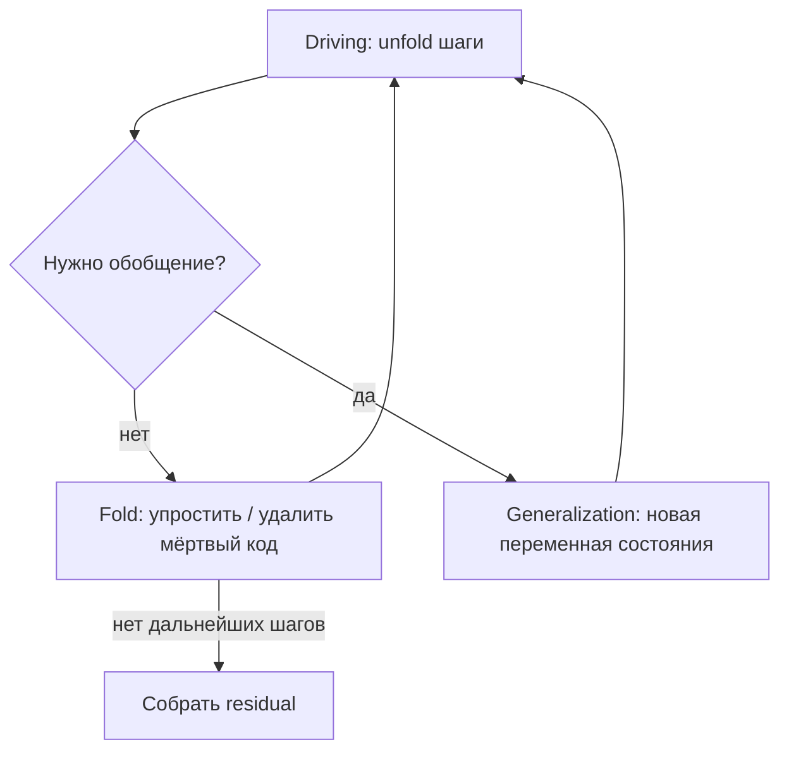
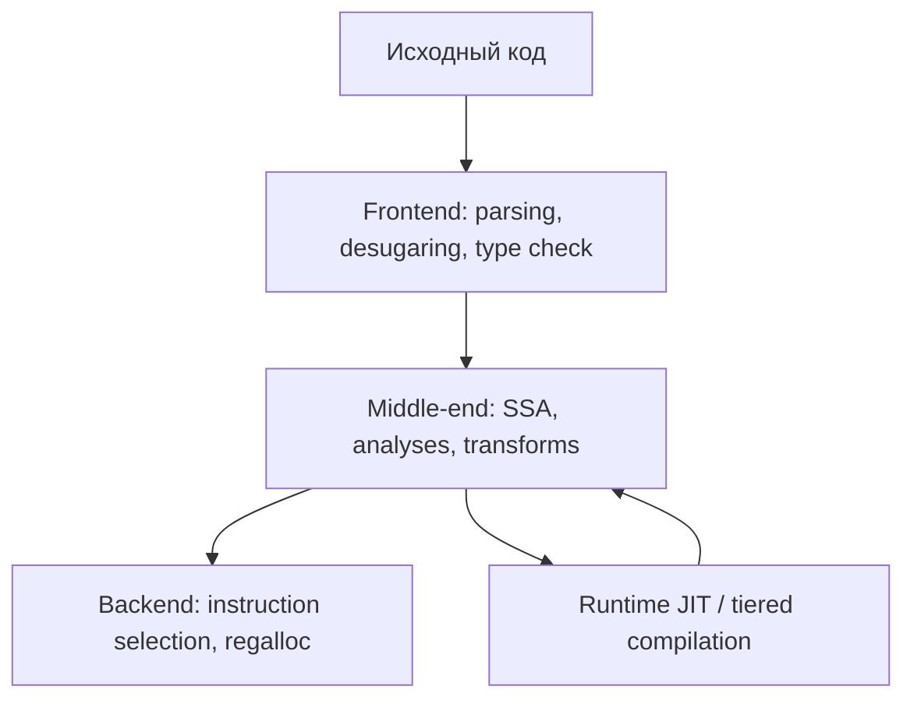
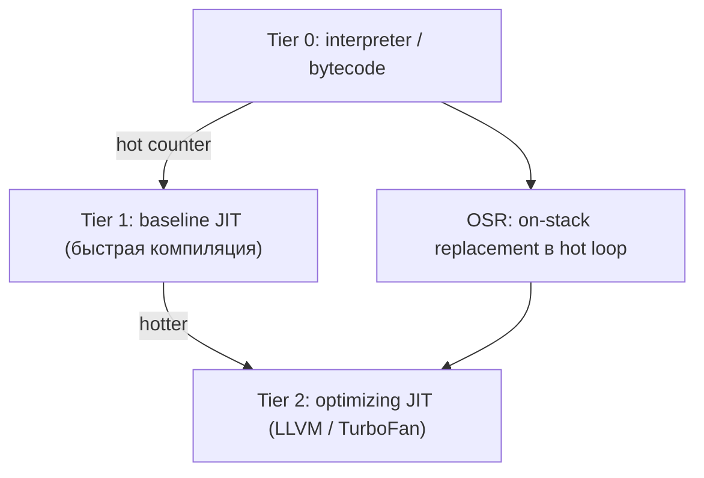
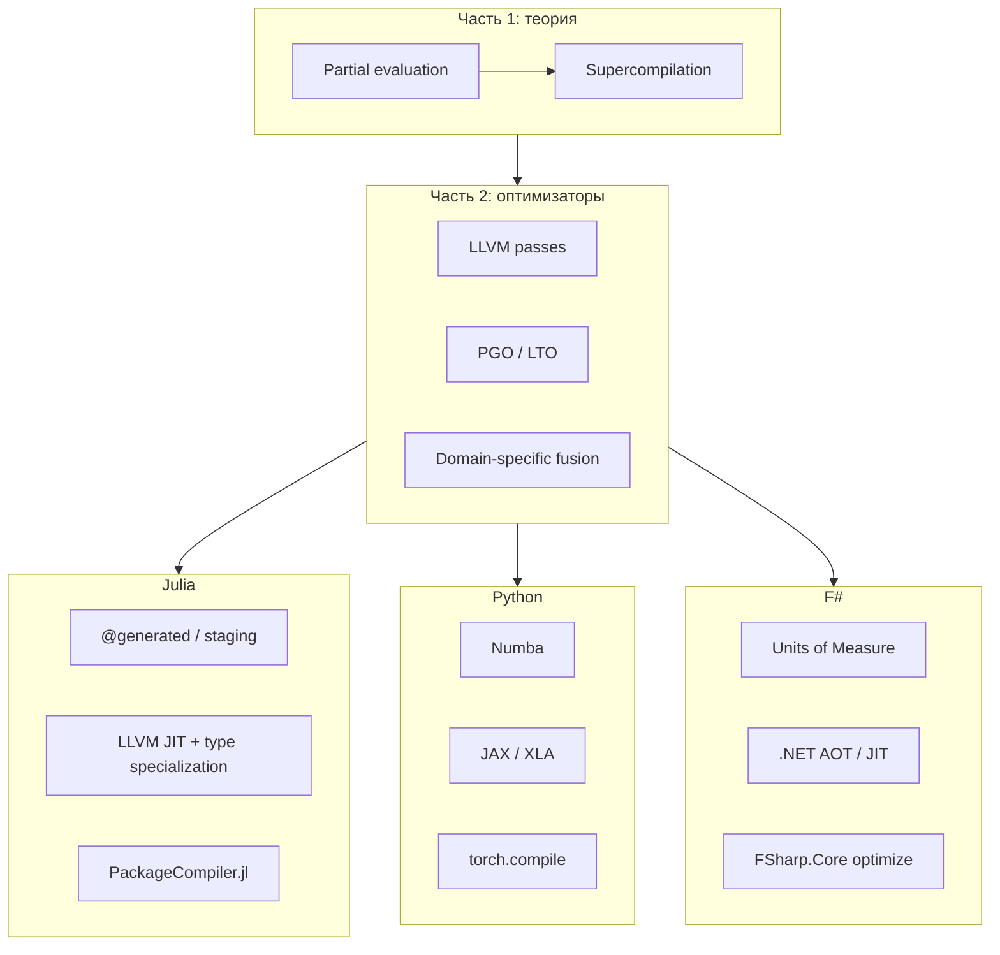
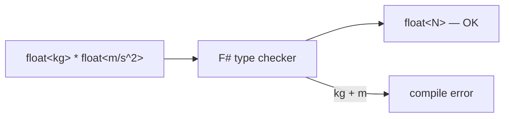

**Суперкомпилятор** — не «компилятор, который быстрее обычного», а **трансформатор программ**, который символически «прогоняет» код по всем исполнимым путям, сворачивает известные вычисления и выдаёт **специализированную остаточную программу**. Идея родилась в 1970–80-х у [Валентина Турчина](https://en.wikipedia.org/wiki/Valentin_Turchin) в контексте языка **Refal** и с тех пор периодически возвращается — в **частичном вычислении**, **distillation**, **супероптимизации** и в современных JIT-стеках Julia и Python.

Ниже — **три части**:

1. **Теория** — суперкомпиляторы, частичное вычисление, проекции Футамуры.
2. **Современные оптимизаторы** — что реально работает в компиляторах, JIT и ML-стеках сегодня: от LLVM passes до e-graphs и MLGO.
3. **Julia, Python и F#** — конкретные инструменты; отдельно — **физические величины** и compile-time units в F#.

---

## Часть 1. Суперкомпиляторы и родственные техники

### Зачем вообще «супер»-компиляция

Интерпретатор универсален, но медленен: на каждом шаге он заново разбирает структуру программы. Компилятор быстрее, но требует **статически известных** деталей (типы, размеры, константы). Между ними — **частичное вычисление** (*partial evaluation*, PE): часть входов считается **статической** (известна на этапе трансформации), часть — **динамической** (приходит в рантайме). Специализатор «замораживает» статику и оставляет параметрическую «оболочку» только там, где без данных нельзя.

**Суперкомпиляция** — агрессивная форма PE: не одноразовая подстановка констант, а **итеративное символическое исполнение** (*driving*) с **обобщением** (*generalization*), пока программа не свернётся в компактный residual.


| Подход | Что фиксируется заранее | Что остаётся в рантайме | Типичный результат |
|--------|-------------------------|-------------------------|-------------------|
| **Интерпретация** | ничего | всё | универсальность, overhead |
| **AOT-компиляция** | почти всё (если типы известны) | IO, некоторые параметры | `.exe`, `.so`, LLVM IR |
| **Частичное вычисление** | статические параметры `d` | динамические `x` | `f'(x)` — короче и быстрее |
| **Суперкомпиляция** | то же + структура control flow | минимальный residual | сильная специализация, риск раздувания |
| **Tracing JIT** (PyPy, JAX) | «горячий» путь по одному trace | ветвления вне trace | машинный код под частый случай |

### История: Турчин, Refal, проект Supercompiler

[Valentin Turchin](https://www.refal.net/turchin.html) (1931–2010) — советско-американский учёный, автор **Refal** (*Recursive Functions Algorithmic Language*) и концепции **суперкомпилятора**. Refal оперирует **паттерн-матчингом** над символьными выражениями — естественной средой для символического «прогона» программы.

Ключевые работы:

| Работа | Год | Суть |
|--------|-----|------|
| [The concept of a supercompiler](https://www.researchgate.net/publication/220947890_The_concept_of_a_supercompiler) | 1986 | Формулировка driving + generalization + residual |
| [An algorithm of generalization in the supercompiler](https://www.researchgate.net/publication/220947891_An_algorithm_of_generalization_in_the_supercompiler) | 1986 | Когда останавливать развёртку и вводить переменные |
| [The theory of metasystem transitions](https://en.wikipedia.org/wiki/Metasystem_transition) | 1977+ | Философский контекст: эволюция вычислительных систем |

Практическая линия продолжается в **SCP** (*Supercompiler of Refal*) и в современных исследованиях по **distillation** (см. ниже).

### Driving, generalization, residual

Три шага суперкомпиляции в терминах Турчина:

1. **Driving (развёртка)** — символически выполнять шаги программы: раскрывать вызовы, упростять условия, когда ветка определена статически, inline-ить, если размер под контролем.
2. **Generalization (обобщение)** — если развёртка зациклилась или растёт без меры, **остановиться** и ввести обобщённое состояние (аналог «переменной цикла» в symbolic execution). Без этого суперкомпилятор не терминировал бы на рекурсии.
3. **Residual program (остаток)** — собрать специализированную программу, эквивалентную исходной при фиксированных статических данных.



**Критерии остановки** — центральная инженерная проблема. Классика:

- **Homeomorphic embedding** (Leuschel & Bruynooghe) — запрет «вкладывать» более общее состояние в более частное в истории;
- **Size-change principle** — терминирование по убыванию «размера» вызовов;
- **Whitelists / budgets** — ограничение глубины развёртки в промышленных JIT.

Без termination strategy суперкомпилятор либо **не сходится**, либо **взрывает** размер residual.

### Проекции Футамуры

[Yoshihiko Futamura](https://en.wikipedia.org/wiki/Partial_evaluation) (1980-е) показал, что **частичный evaluator** — универсальный инструмент построения компиляторов. Три **проекции**:

| Проекция | Что специализируем | Результат |
|----------|-------------------|-----------|
| **Futamura I** | `mix(interpreter, program)` | **компилятор** для этого языка |
| **Futamura II** | `mix(compiler, program)` | **ещё более специализированный** компилятор |
| **Futamura III** | повторная специализация компилятора | **машинный код** «навсегда» |

Интуиция: если есть универсальный **интерпретатор** `eval` и программа `P`, то `peval(eval, P)` — это **скомпилированная версия P**. Суперкомпилятор — «мощный peval», который не только подставляет константы, но и **сворачивает control flow**.

> Книга-канон: Jones, Gomard & Sestoft — [*Partial Evaluation and Automatic Program Generation*](https://www.itu.dk/~sestoft/pebook/) (DIKU, 1993; online).

### Чем суперкомпиляция отличается от соседних идей

| Техника | Объект | Механизм | Связь с supercompilation |
|---------|--------|----------|---------------------------|
| **Constant folding / DCE** | один basic block | локальные правила | подмножество driving |
| **Inlining** | вызовы функций | подстановка тела | один шаг driving |
| **Deforestation / fusion** | chains of map/filter | убрать промежуточные структуры | Haskell `build/foldr`, GHC fusion |
| **Partial evaluation** | статические параметры | specialization | supercompilation ⊃ PE |
| **Supercompilation** | вся программа + CFG | driving + generalization | максимальная агрессия |
| **Superoptimization** | короткий basic block | перебор эквивалентных последовательностей | Massalin 1987, LLVM `MachineInstr` |
| **Tracing JIT** | горячий путь | запись trace → compile | PyPy, LuaJIT; нет generalization в полном смысле |
| **Staging / MSP** | явные уровни [0], [1] | программа генерирует программу | MetaOCaml, `@generated` в Julia |

**Distillation** (Whiting, Lüttgen, Munoz; [Distillation with Labelled Transition Systems](https://arxiv.org/abs/1807.04055)) — современная переформулировка supercompilation через **LTS** и **tree transducers**; цель та же — **strong normalization** программы с сохранением семантики, но с более чёткой теорией корректности.

### Мини-пример: частичное вычисление vs суперкомпиляция

Исходная функция (псевдокод):

```python
def power(n, k):
    if k == 0:
        return 1
    if k % 2 == 0:
        half = power(n, k // 2)
        return half * half
    return n * power(n, k - 1)
```

**Частичное вычисление** при статическом `k = 8`:

```python
def power_k8(n):
    # k // 2 → 4, 2, 1, 0 — всё свёрнуто
    t = n * n          # k=1
    t = t * t          # k=2
    t = t * t          # k=4
    return t * t       # k=8
```

**Суперкомпиляция** при **неизвестном** `k`, но известном `n = 2` пойдёт дальше: может свернуть умножения в константы, упростить ветвления по чётности для конкретных трасс, вынести **residual loop** с обобщённым инвариантом — в зависимости от стратегии generalization.

На практике «настоящие» суперкомпиляторы чаще встречаются в **функциональных** языках (Haskell, Clean, ML) и **логическом** программировании, чем в Python «из коробки» — но **идеи** driving/folding/specialization живут в JIT-стеках.

### Ограничения и риски

| Риск | Проявление | Типичное смягчение |
|------|------------|-------------------|
| **Нетерминирование** | бесконечная развёртка рекурсии | homeomorphic embedding, лимиты |
| **Code bloat** | residual больше исходника | cutoff, только hot paths |
| **Неверная специализация** | нарушение семантики при side effects | чистые функции, SSA, effect system |
| **Стоимость compile time** | минуты на одну функцию | кэш специализаций, tiered JIT |
| **Динамическая типизация** | нет статики → мало fold | type guards, tracing (PyPy) |

---

## Часть 2. Оптимизаторы кода: ландшафт современных подходов

Суперкомпиляция из части 1 — **один** полюс спектра. В production сегодня работает **эшелонированная** система оптимизаций: локальные правила на SSA, межпроцедурный анализ, profile-guided решения, polyhedral transforms, перебор эквивалентных инструкций, обучение политики pass order на трассах компиляции. Ни один «волшебный» supercompiler не заменяет весь стек — но **идеи driving, fold и specialization** повторяются на каждом уровне.



### Карта подходов

| Класс | Масштаб | Когда срабатывает | Примеры |
|-------|---------|-------------------|---------|
| **Peephole / local** | 1–5 инструкций | всегда | constant fold, DCE, strength reduction |
| **Intraprocedural (SSA)** | одна функция | AOT / JIT middle-end | GVN, LICM, SROA, inlining |
| **Interprocedural (IPA)** | call graph | LTO, whole-module | devirtualization, IPO |
| **Profile-guided (PGO)** | hot/cold по trace | после профилирования | LLVM PGO, BOLT, AutoFDO |
| **Polyhedral** | affine loop nests | HPC kernels | Polly, Pluto, MLIR affine |
| **Superoptimization** | basic block | offline / peephole | STOKE, Souper, Massalin |
| **Equality saturation** | rewrite system | DSL, math, synthesis | egg, Herbie, Ruler |
| **Domain-specific** | tensor / image / query | ML, graphics, SQL | XLA, TVM, Halide, Triton, TensorRT |
| **Learned optimization** | pass order / heuristics | training на corpus | MLGO, CompilerGym |
| **Symbolic / Synthesis** | spec → program | verification, DSL | Rosette, SyGuS, Lean |

Связь с частью 1: **inlining + const prop** = локальный driving; **partial evaluation / JIT specialization** = Futamura I; **LTO + PGO** = driving с информацией о реальных путях; **superoptimization** = агрессивный fold на уровне машинных инструкций.

---

### 2.1. Классический pipeline: GCC, LLVM, Rust

Большинство языков сходятся к **SSA middle-end** + **LLVM IR** (или собственному backend, как у GCC).

**LLVM** (`opt`, `clang -O3`, Rust `rustc`):

| Pass / семейство | Что делает | Аналог из части 1 |
|------------------|------------|-------------------|
| **Mem2Reg / SROA** | promotion в SSA, разбиение alloc | убрать лишнее состояние |
| **InstCombine** | локальные алгебраические правила | fold |
| **GVN / EarlyCSE** | common subexpression elimination | fold + sharing |
| **Inlining** | подстановка тел функций | driving |
| **LoopUnroll / Vectorize** | развёртка и SIMD | partial unrolling |
| **LICM** | hoist invariant из цикла | specialization по invariant |
| **DeadCodeElim** | удаление unreachable | residual cleanup |

**Rust** добавляет **MIR** (*Mid-level IR*) с borrow check **до** LLVM — оптимизации на MIR (destination propagation, enum layout) + **monomorphization** (generics → concrete types) = **compile-time specialization**, близкая к PE.

**GCC** — собственный middle-end (RTL tree SSA), сопоставимый набор passes; **LTO** (`-flto`) склеивает модули для IPO.


---

### 2.2. Link-Time и Whole-Program Optimization

**LTO** (*Link-Time Optimization*) — компилятор видит **весь** program (или whole archive) на этапе линковки:

- **cross-module inlining** — driving через границы `.o`;
- **devirtualization** — если на всех call site один класс, virtual call → direct;
- **IPO constant propagation** — статические данные протекают между единицами трансляции.

Варианты: **full LTO** (один большой LLVM module), **ThinLTO** (summary + distributed, быстрее на больших бинарниках).

**BOLT** (*Binary Optimization and Layout Tool*, Meta) — **post-link** оптимизатор: переставляет basic blocks по **PGO profile**, улучшает icache/branches **без** перекомпиляции исходников. Это **layout optimization** — другой слой, но тоже «специализация под реальный trace».

| Инструмент | Вход | Эффект |
|------------|------|--------|
| **ThinLTO / LTO** | object + bitcode | IPO, inlining, DCE across modules |
| **BOLT** | уже слинкованный binary + profile | block reorder, stub optimization |
| **Propeller** (LLVM) | PGO + BOLT-like layout | icache-friendly layout |
| **AutoFDO** | sampling profile без instrumentation | PGO без `-fprofile-generate` |

---

### 2.3. Profile-Guided Optimization (PGO)

**PGO** — компилятор получает **частоты** веток и call site из реального запуска:

1. **Instrumented build** (`-fprofile-generate`) → бинарник с счётчиками;
2. **Training run** на репрезентативных данных;
3. **Optimized build** (`-fprofile-use`) — inline только hot calls, **cold** blocks помечаются и выносятся, **branch prediction hints**, **function splitting**.

Связь с supercompilation: PGO говорит, **какие пути driving разворачивать агрессивно**, а какие оставить в residual «холодном» коде. Без PGO компилятор **угадывает** по статическим эвристикам — часто хуже на больших приложениях (Chrome, Firefox, PostgreSQL активно используют PGO + BOLT).

---

### 2.4. Polyhedral optimization

Для **аффинных** nest of loops (индексы вида `a*i + b*j + c`) **polyhedral model** представляет итерации как точки в **integer polyhedron** и применяет:

- **tiling** (cache locality);
- **fusion / fission**;
- **skewing** (parallelism);
- **vectorization** с доказуемой корректностью.

| Инструмент | Где живёт | Типичный user |
|------------|-----------|---------------|
| [**Polly**](https://polly.llvm.org/) | LLVM pass | C/C++ через `-mllvm -polly` |
| **Pluto** | source-to-source (C) | OpenMP parallel loops |
| **MLIR Affine** | MLIR dialect | Tensor compilers, custom DSL |
| **ISL** (*Integer Set Library*) | библиотека | backend для Pluto/Polly |

Ограничение: нужны **статически анализируемые** границы и линейные индексы; `while` с указателями и irregular control flow — вне модели. **LoopVectorization.jl** в Julia и **Polly** решают **одну** задачу на разных IR.

---

### 2.5. Superoptimization

**Superoptimizer** (Massalin, 1987) ищет **кратчайшую** последовательность машинных инструкций, **эквивалентную** исходному basic block — часто через **stochastic search** или **SMT**.

| Проект | Механизм | Статус |
|--------|----------|--------|
| [**STOKE**](https://github.com/StanfordPL/stoke) | MCMC по instruction sequences | research |
| [**Souper**](https://github.com/AliveToolkit/souper) | SMT + candidate synthesis | интеграция с LLVM |
| **Alive2** | formal verification peephole | проверка LLVM opt correctness |
| **Massalin original** | exhaustive (малые блоки) | исторический |

Отличие от supercompilation: **не** program-wide driving, а **локальный** brute-force / search на уровне **MachineInstr**. LLVM **InstCombine** — «мягкий» superoptimizer с фиксированными правилами; Souper — «тяжёлый», когда эвристики не нашли оптимум.

---

### 2.6. Equality saturation (e-graphs)

**Equality saturation** ([`egg`](https://github.com/egraphs-good/egg), [`egglog`](https://github.com/egraphs-good/egglog)) — альтернатива фиксированному pipeline:

1. Строится **e-graph** — компактное представление **многих** эквивалентных форм выражения.
2. **Rewrite rules** применяются **сaturating** (пока добавляются новые эквиваленты).
3. **Extractor** выбирает **дешёвую** форму по cost model.

| Применение | Пример |
|------------|--------|
| **Math rewriting** | Herbie (float → accurate expr) |
| **DSL optimization** | Glenside, Ruler (syn. rules) |
| **Compiler opts** | egg in Rust (`egg-cc`), Sparsifier |
| **Theorem proving** | Lean, Coq tactics |

Философски близко к **distillation**: не один проход fold, а **пространство** эквивалентных программ + выбор лучшей. Tradeoff: memory и время saturation; для больших функций нужны **region-based** e-graphs.

---

### 2.7. JIT и tiered compilation

Runtime добавляет **ещё один** слой оптимизации поверх AOT:



| VM / runtime | Tiered JIT | Особенности |
|--------------|------------|-------------|
| **V8** (JavaScript) | Ignition → Sparkplug → Maglev → TurboFan | speculative optimization + deopt |
| **Java HotSpot** | interpreter → C1 → C2 | OSR, escape analysis |
| **GraalVM** | partial eval + AG | Truffle languages, PE as core |
| **PyPy** | tracing JIT | один long trace, guards |
| **LuaJIT** | trace + FFI | extremely low overhead |
| **Julia** | native codegen per method | нет classic tiers, но **recompile** on type change |
| **.NET RyuJIT / Tiered PGO** | tier0 → tier1 + dynamic PGO | .NET 6+ |

**Speculative optimization** (V8, Java): компилятор **assume** типы/ shapes из профиля; **deoptimization** откатывает к interpreter, если assumption нарушена — аналог **invalidation** specialized residual в supercompiler.

**GraalVM** явно использует **partial evaluation** в Truffle: AST интерпретируется, hot paths **partially evaluate** в граф без interpreter overhead — ближе всего к Futamura среди industrial JIT.

---

### 2.8. Domain-Specific Optimizers (ML, HPC, queries)

Когда general-purpose compiler не знает семантику домена, появляются **DSL-компиляторы**:

| Стек | IR / модель | Ключевые оптимизации |
|------|-------------|----------------------|
| **XLA** | HLO graph | fusion, layout, algebraic simplification |
| **TVM / Relax** | tensor IR, TIR | schedule search, auto-tuning |
| **Halide** | Func + Schedule | separation algorithm / schedule |
| **Triton** | tile-level Python → LLVM/PTX | block-sparse matmul, fusion |
| **TensorRT / ONNX Runtime** | engine graph | layer fusion, kernel autotune, INT8 |
| **Inductor** (PyTorch) | FX → loop → Triton/C++ | pointwise fusion, reduction tiling |
| **Apache Arrow / Velox** | vectorized batch | SIMD, push-based exec |
| **SQL engines** | relational algebra | predicate pushdown, join reorder, CSE |

**Auto-tuning** (Halide autoscheduler, TVM Ansor, AutoTVM) — **search** в пространстве schedule parameters; по духу близко к superoptimization, но cost model = **измеренное** время на железе.


---

### 2.9. ML для компиляторов

**Learned optimization** — не LLM «переписывает код», а модели, обученные на **corpus** компиляций:

| Проект | Что предсказывает | Организация |
|--------|-------------------|-------------|
| [**MLGO**](https://github.com/google/ml-compiler-opt) | inlining / regalloc decisions | Google, LLVM integration |
| **CompilerGym** | RL environment для passes | Meta / academic |
| **Ithemal** | throughput по asm sequence | MIT |
| **Chameleon** | transfer learning между arch | research |

Pipeline: собрать **millions** of `(IR, decision, outcome)` → обучить **policy network** → подставить вместо hand-tuned heuristic в LLVM pass. Это **не** supercompilation, но решает ту же проблему: **когда** применять агрессивный transform.

Отдельно — **LLM-assisted** оптимизация (2024–2026): Copilot, Cursor, специализированные agents предлагают **source-level** rewrites (algorithm change, parallel patterns). Это **human-in-the-loop** transform без гарантии эквивалентности; компилятор всё равно нужен для correctness и codegen.

---

### 2.10. Синтез и формальные методы

| Подход | Вход | Выход |
|--------|------|-------|
| **SyGuS** (*Syntax-Guided Synthesis*) | spec + grammar | программа |
| **Rosette / Racket** | symbolic execution + verify | optimized snippet |
| **CompCert** | C subset | **доказуемо** корректный asm |
| **Celestial** / **Verus** | Rust + proofs | verified low-level |
| **Alive2** | LLVM IR peephole | proof of equivalence |

Supercompilation historically связана с **correctness-by-construction** residual; distillation и e-graphs продолжают линию **proved** transforms. Industrial codegen по-прежнему на **тестах + fuzzing** (LLVM libFuzzer, Csmith).

---

### 2.11. Как выбирать слой оптимизации

| Ваша проблема | Первый рычаг | Второй рычаг |
|---------------|--------------|--------------|
| Медленный scalar loop в C/Rust | `-O3`, LTO, PGO | Polly, ручной SIMD |
| Python hot loop | Numba / Cython | JAX / rewrite algorithm |
| PyTorch training | `torch.compile`, fused optimizers | custom Triton kernel |
| LLM inference latency | TensorRT-LLM, vLLM, quantization | kernel fusion (FlashAttention) |
| Compile time слишком большой | ThinLTO вместо full LTO, меньше templates | split crates / modules |
| Нужна доказуемость | CompCert / Verus subset | — |
| Экзотическая math | Herbie + egg | symbolic CAS → codegen |
| **Физические величины, SI** | **F# Units of Measure** | Julia **Unitful.jl**, Python **pint** |

**Принцип эшелонирования:** каждый уровень **дешевле** для своего масштаба. Supercompiler на весь Chrome был бы нереален; **InstCombine + inlining + PGO + BOLT** — реалистичный стек.

---

### 2.12. Связь части 1 и части 2

| Идея supercompilation | Где в modern stack |
|-----------------------|-------------------|
| Driving / unfold | inlining, loop unroll, JIT trace |
| Fold | constant prop, GVN, InstCombine, XLA fusion |
| Generalization | loop versioning, OSR, deopt |
| Residual program | specialized LLVM module, Triton kernel |
| Termination control | inline budget, PGO thresholds, Souper limits |
| Futamura | Graal PE, Numba, PackageCompiler |

Часть 3 показывает, как **Julia**, **Python** и **F#** **собирают** эти слои в конкретные команды, типы и декораторы.

---

## Часть 3. Julia, Python и F#: специализация и физические величины

Ни Julia, ни CPython **не поставляют** классический Turchin-style supercompiler «из коробки». **F#** на .NET — тоже нет. Зато все три экосистемы реализуют **слои специализации** из части 2 — LLVM JIT, tracing, staging, AOT — и в научном коде решают задачу **физических размерностей** по-разному: от **compile-time erasure** в F# до **runtime** библиотек в Python.



### Julia: многоуровневая специализация

Julia спроектирована вокруг **multiple dispatch** и **JIT через LLVM**: при вызове `f(args...)` компилятор строит **специализированный метод** под конкретные типы аргументов. Это не суперкомпилятор в академическом смысле, но **типовая специализация + inlining + constant propagation** в LLVM повторяют **локальный driving**.

#### 1. `@generated` — явный staging (уровень 1)

Макрос `@generated` позволяет **сгенерировать код функции во время компиляции** из типов (не из значений runtime):

```julia
@generated function sum_static(::Type{Val{N}}) where {N}
    ex = :(0.0)
    for i in 1:N
        ex = :($ex + $i)
    end
    return ex
end

sum_static(Val{10}())  # компилятор разворачивает в 0.0 + 1 + 2 + ... + 10
```

Это близко к **Futamura II**: программа на уровне типов **генерирует** другую программу. Для фиксированного `N` цикл исчезает — остаётся **полностью развёрнутый** residual.

#### 2. StaticArrays, LoopVectorization, StaticTools

Пакеты вроде **StaticArrays.jl** переносят размеры в **типовой уровень**, чтобы LLVM мог **unroll** и **vectorize** без динамической аллокации. **LoopVectorization.jl** добавляет polyhedral-подобные преобразования циклов. Это **domain-specific partial evaluation**: размеры и структура памяти — «статические данные» `d` из части 1.

#### 3. JIT + inference + inlining

Типичный путь горячей функции:


- **Abstract interpretation** в inference — symbolic propagation типов и констант;
- **inlining** — driving через граф вызовов;
- **escape analysis**, **SROA** в LLVM — fold alloc.

Инструменты introspection: **Cthulhu.jl** (descend into compiled code), **@code_warntype**, **@code_llvm**.

#### 4. Cassette.jl / IRTools.jl — пользовательские проходы

**Cassette** (legacy, но показательный) позволял вставлять **custom compiler passes** на Julia IR — аналог «надстройки над driving». Современная линия смещается к **Compiler.jl**, **AbstractInterpretation.jl** и пакетам вроде **Enzyme.jl** (AD на LLVM). Это уже **program transformation infrastructure**, куда теоретически можно встроить supercompilation-подобные правила.

#### 5. PackageCompiler.jl — AOT как Futamura III

**PackageCompiler** создаёт **standalone** бинарник с **заранее скомпилированными** методами. Это практическая **третья проекция Футамуры**: «заморозить» результат JIT для деплоя без Julia runtime на целевой машине (с оговорками по размеру и динамическим методам).

#### 6. GPUCompiler.jl

**GPUCompiler** генерирует PTX/SPIR-V/Metal из **того же** Julia IR, что и CPU JIT — **специализация под другой backend** после общего driving на уровне Julia. Kernel fusion на GPU — родственник **deforestation**.

#### 7. Symbolics.jl — символическое исполнение

**Symbolics.jl** строит **граф выражений** и применяет rewrite rules — это **чистый symbolic driving** без generalization в стиле Турчина, но с тем же эффектом: `expand`, `simplify`, `build_function` выдают **остаточную** числовую функцию.

| Механизм Julia | Аналог в теории supercompilation | Зрелость |
|----------------|----------------------------------|----------|
| `@generated` | staging / Futamura II | production |
| Type-based JIT | partial evaluation по типам | production |
| Constant propagation in LLVM | fold | production |
| Symbolics.jl | symbolic driving | production |
| Full supercompiler on Julia IR | driving + generalization | research / нишевые эксперименты |

**Вывод для Julia:** язык **максимально близок** к культуре partial evaluation — типы как статические параметры, generated functions как явный metaprogramming. Классический supercompiler не нужен «поверх всего», потому что **pipeline уже многостадийный**; узкое место — **dynamic dispatch** (`Any`, нестабильные типы) и **compile latency** при первом вызове.

---

### Python: динамика по умолчанию, специализация по запросу

CPython **интерпретирует** байткод; без внешних инструментов **нет** driving. Зато экосистема дала несколько **несовместимых**, но мощных ответов.

#### 1. Numba — «компилятор для hot loop»

[**Numba**](https://numba.pydata.org/) (`@jit`, `@njit`) читает **ограниченное** подмножество Python + NumPy, делает **type inference**, lowers в **LLVM** (или CUDA PTX):

```python
from numba import njit
import numpy as np

@njit
def pairwise_distances(X):
    n = X.shape[0]
    D = np.empty((n, n))
    for i in range(n):
        for j in range(i, n):
            d = 0.0
            for k in range(X.shape[1]):
                diff = X[i, k] - X[j, k]
                d += diff * diff
            D[i, j] = D[j, i] = d ** 0.5
    return D
```

Первый вызов — **компиляция** (специализация под `float64`, конкретные размеры если известны); дальше — машинный код. Это **Futamura I** для «Python-подмножества + NumPy types». **Нет** generalization на произвольной рекурсии Python — зато предсказуемо.

| Режим Numba | Поведение |
|-------------|-----------|
| `njit` | без Python fallback — только compiled |
| `jit` | object mode / typed mode — может откатиться |
| `parallel=True` | auto parallel + SIMD |
| `cuda.jit` | GPU kernel |

#### 2. PyPy — meta-tracing JIT

[**PyPy**](https://pypy.org/) — альтернативный интерпретатор с **tracing JIT** (RPython). На **горячем цикле** записывается **trace** — линейная последовательность операций; guard'ы проверяют типы при входе. Философски близко к **partial evaluation по одной трассе**, но **не** supercompilation: ветвления вне trace остаются в interpreter.

Плюс: **совместимость** с большим подмножеством CPython. Минус: **memory**, cold start, не всегда быстрее Numba на чистых numeric loop.

#### 3. JAX — tracing + XLA fusion

[**JAX**](https://github.com/google/jax) `jit` строит **jaxpr** (функциональный IR) через **tracing**, отдаёт в **XLA** для fusion и codegen:

```python
import jax
import jax.numpy as jnp

@jax.jit
def f(x):
    y = jnp.sin(x) * 2.0
    return y + x ** 2

# первый вызов: trace → compile; дальше — GPU/TPU/CPU backend
```

**`static_argnums`** — явное указание **статических** аргументов (чистый PE):

```python
@jax.jit(static_argnums=(1,))
def g(x, n):  # n известен на compile-time
    return x ** n
```

**`vmap`**, **`pmap`**, **`scan`** — program transformation на уровне IR (batching как **lifting**). XLA **fusion** — аналог deforestation для tensor ops.

#### 4. torch.compile — Dynamo + Inductor

[**torch.compile**](https://pytorch.org/docs/stable/torch.compiler.html) (PyTorch 2.x):

1. **TorchDynamo** — перехват frame evaluation (PEP 523), извлечение FX graph из Python control flow (с **graph break** там, где нельзя trace);
2. **AOTAutograd** — forward/backward graphs;
3. **Inductor** — генерация Triton/C++ с **kernel fusion**.

```python
import torch

@torch.compile
def model(x):
    for _ in range(3):
        x = torch.relu(x @ w)
    return x
```

Graph break = «здесь supercompiler остановился бы и оставил residual call в interpreter». Это **production-grade** компромисс между полнотой Python и агрессией JIT.

#### 5. Codon, Cython, mypyc, Nuitka — AOT-компиляция

| Инструмент | Модель | Близость к PE |
|------------|--------|---------------|
| [**Codon**](https://github.com/exaloop/codon) | Python-syntax → native | сильная статика, отдельный runtime |
| **Cython** | typed superset → C | ручная аннотация static data |
| **mypyc** | typed MyPy subset → C | gradual static |
| **Nuitka** | Python → C | whole-program, varies |

Это **Futamura I/III** для **ограниченных** диалектов Python, не для произвольного `eval`.

#### 6. Что CPython делает сам

| Механизм | Эффект | Supercompilation? |
|----------|--------|-------------------|
| **PEP 659** specialization (3.11+) | adaptive specialized bytecode | микро-PE на hot opcodes |
| **`functools.lru_cache`** | memoization | ручной residual |
| **`dis` / bytecode** | — | нет transform |

Specializing adaptive interpreter (**quickening**) — **локальный fold** на уровне opcode, не program-wide driving.

---

### F#: Units of Measure и физические величины

**F#** на платформе **.NET** — статически типизированный функциональный язык с редкой для индустрии фичей: [**Units of Measure**](https://learn.microsoft.com/en-us/dotnet/fsharp/language-reference/units-of-measure) (*единицы измерения*). Размерность **м²**, **м/с**, **Н·м** живёт в **типе** `float<м>` / `float<м/с>`, проверяется **на этапе компиляции** и **полностью стирается** в IL — **нулевой runtime overhead**. Это **partial evaluation размерностей**: «статические данные» `d` из части 1 — метры, секунды, килограммы — исчезают в residual, остаётся голый `float64`.

#### Зачем это в физике и инженерии

Классическая ошибка [**Mars Climate Orbiter**](https://en.wikipedia.org/wiki/Mars_Climate_Orbiter) (1999): команда импульса передана в **фунт·с** вместо **Н·с** — потеря аппарата. Аналогичные баги встречаются в CFD, робототехнике, финансовых моделях с «неявными» процентами vs долями. Units of Measure не заменяют тесты, но **отсекают** целый класс ошибок **до** запуска.



#### Синтаксис и базовые единицы

```fsharp
// Базовые SI-единицы объявляются как measure-типы
[<Measure>] type m    // метр
[<Measure>] type kg   // килограмм
[<Measure>] type s    // секунда
[<Measure>] type N = kg m / s^2   // ньютон
[<Measure>] type J = kg m^2 / s^2 // джоуль

let distance: float<m> = 100.0<m>
let time: float<s> = 9.58<s>
let speed: float<m/s> = distance / time   // OK: float<m/s>

let force: float<N> = 10.0<kg> * 9.81<m/s^2>  // OK: kg·m/s² = N

// Ошибка компиляции — несовместимые размерности:
// let wrong = distance + force   // Type mismatch
```

**Производные единицы** задаются **алгеброй** measure-типов: `m/s`, `s^-1`, `kg m/s^2`. Компилятор **упрощает** размерности так же, как символьная алгебра — это **compile-time fold** на уровне типов.

#### Константы, проценты, безразмерные величины

```fsharp
[<Measure>] type rad   // радиан (безразмерный угол в SI)
[<Measure>] type deg
[<Measure>] type percent

let pi = System.Math.PI
let angle: float<rad> = 180.0<deg> * (pi / 180.0<deg>)  // deg сокращается

let rate: float<percent> = 5.0<percent>
let fraction: float = float rate / 100.0<percent>       // в чистое float
```

**Безразмерные** величины — `float` без measure или явный `1` в знаменателе (`float<m/m>`). Конвертация **между** единицами одной размерности (м ↔ км) — через **numeric constants** с measure:

```fsharp
let milesToMeters = 1609.34<m/mile>   // если объявлен [<Measure>] type mile
let x_m = 5.0<mile> * milesToMeters   // float<m>
```

#### Generic units и физические формулы

Функции **обобщаются** по measure-параметрам — аналог **parametric polymorphism** в части 1:

```fsharp
let kineticEnergy (m: float<kg>) (v: float<m/s>) : float<J> =
    0.5 * m * v * v   // J = kg·m²/s² — проверяется компилятором

let escapeVelocity (g: float<m/s^2>) (r: float<m>) : float<m/s> =
    sqrt (2.0 * g * r)
```

Если формула **физически неверна** (лишний множитель размерности), F# **не соберёт** проект. Это **correctness-by-types**, не supercompilation — но тот же принцип «статика вместо runtime debug».

#### Что происходит при компиляции

| Этап | Units of Measure |
|------|------------------|
| **Parse / typecheck** | алгебра размерностей, unification measure |
| **Typed AST → IL** | **erasure**: `float<м>` → `System.Double` |
| **.NET JIT / Native AOT** | обычный float-код, SIMD как для `double` |
| **Runtime** | **нет** поля «единица» в памяти |

Связь с **Futamura**: measure — **static parameter** `d`; residual — **обычный** numeric IL. Никаких wrapper-объектов, в отличие от runtime-библиотек.

F# компилируется в **.NET IL**; **Native AOT** (.NET 8+) даёт standalone binary с тем же erasure. Оптимизации — **RyuJIT** tiered JIT, **PGO** в .NET, **crossgen2** / AOT — стек из части 2, без отдельного LLVM (хотя **LLVM-based** эксперименты и **Burst**/Unity для игр — соседняя экосистема).

#### F# и остальной pipeline

| Механизм F# / .NET | Аналог из частей 1–2 |
|--------------------|----------------------|
| Units of Measure erasure | PE static `d`, zero-cost abstraction |
| Struct records, `inline` | inlining / local driving |
| **FSharp.Compiler** optimizations | constant fold, tailcall |
| **Native AOT** | Futamura III / LTO-like freeze |
| **Computation expressions** | monadic DSL (не оптимizer, но staging patterns) |

Научный стек: **Plotly.NET**, **Deedle** (DataFrame), interop с **Python** (Python.NET) и **C#** libraries; для тяжёлой линейной алгебры часто вызывают **MKL** через NuGet — units остаются на границе F#-кода.

---

### Физические величины: F# vs Julia vs Python

| Критерий | **F# Units of Measure** | **Julia Unitful.jl** | **Python pint** / **astropy.units** |
|----------|-------------------------|----------------------|-------------------------------------|
| **Когда проверка** | compile-time | compile-time (parametric types) + runtime | runtime |
| **Overhead в рантайме** | **нет** (erasure) | малый / opt-in strip | объект Quantity |
| **Синтаксис** | `1.0<m/s>` | `1.0u"m/s"` | `1.0 * u.m / u.s` |
| **Автоматическая SI-алгебра** | да, в typechecker | да | да |
| **Ошибка «м + кг»** | **не компилируется** | MethodError / UnitError | DimensionalityError |
| **Интеграция с JIT/Numba** | .NET AOT | нативный LLVM JIT | нужны аннотации / отключение units |
| **Гибкость** | только статика | высокая | максимальная (REPL, dynamic) |

**Julia (Unitful.jl)** — размерности в **типах** `Quantity{T, D}`, Julia JIT **специализирует** под `T`; при `@inferred` часто стирается до `Float64` в hot loop, если units **вынесены** из inner loop. Можно использовать **[@unitful](https://github.com/PainterQubits/Unitful.jl)** в `@generated` коде — staging + units.

**Python**: **pint** и **astropy.units** — **runtime** dimensional analysis; удобно в notebooks и astrophysics pipelines, но **Numba** не понимает `pint.Quantity` без переписывания на raw floats. **SymPy** `units` — symbolic (часть 1 driving в algebra domain).

```julia
# Julia + Unitful
using Unitful
v = 100.0u"km/hr"
t = 2.0u"minute"
d = v * t   # Unitful автоматически: ~200.0 km (после simplify)
```

```python
# Python + pint
import pint
ureg = pint.UnitRegistry()
v = 100.0 * ureg.km / ureg.hour
t = 2.0 * ureg.minute
d = v * t   # ~200 km; проверка при операции
```

#### Когда что выбирать

| Сценарий | Рекомендация |
|----------|--------------|
| Критичная инженерия / GNC / финмодели с SI | **F#** units или Julia + строгие typed APIs |
| Исследовательский numeric + HPC | **Julia** Unitful на границах, голые floats в hot loop |
| Astrophysics, lab data, notebooks | **Python** pint / astropy |
| Agent-generated code | units **не** выводятся LLM надёжно — явные типы (F#) или post-hoc lint |

---

### Сводная таблица: Julia vs Python vs F#

| Задача | Julia | Python | F# |
|--------|-------|--------|-----|
| Чистые numeric hot loops | LLVM JIT, LoopVectorization | Numba, JAX | .NET JIT / Native AOT |
| ML training / GPU | CUDA.jl, KernelAbstractions | JAX, torch.compile | ONNX Runtime, TorchSharp |
| **Физические единицы, zero-cost** | Unitful (частично) | pint (runtime) | **Units of Measure** |
| Явная compile-time генерация | `@generated` | Cython types | inline, quotations (FSQuared) |
| AOT binary | PackageCompiler.jl | Codon, Nuitka | Native AOT |
| Symbolic → numeric | Symbolics.jl | SymPy | — (interop Python) |
| Tracing JIT | — | PyPy | — (.NET tiered JIT) |

### Практические рекомендации

**Julia**

1. Стабилизируйте типы (`@code_warntype` без красного) — иначе JIT не сможет «доfold'ить».
2. Размеры в **Val{N}** / StaticArrays, если hot path фиксирован.
3. Для деплоя latency-sensitive — **PackageCompiler** или precompile workloads.
4. Symbolics/ModelingToolkit — когда нужен **symbolic driving** перед numeric residual.

**Python**

1. **Numba** — первый выбор для NumPy-like loops без ML framework.
2. **JAX** — differentiable + XLA + TPU; мыслите в **jit + static_argnums**.
3. **torch.compile** — PyTorch-модели; минимизируйте graph breaks.
4. **PyPy** — ускорение «обычного» Python без переписывания.
5. **pint** — units в прототипах; в hot path strip до float.

**F#**

1. Объявите **базовые SI** measure-типы один раз в core module.
2. Производные (`N`, `Pa`, `J`) — через **type aliases** с алгеброй.
3. На границе с C#/Python — явный **strip** или documented conversion constants.
4. **Native AOT** для deploy без .NET runtime; units не меняют binary layout.
5. Для GPU (CUDA) — units только на host; kernel — raw floats (как в Julia/Python).

---

## Связь с агентными и ML-системами

Для читателей VAIRL: идеи из всех трёх частей **важны не только для HPC**:

| Область | Зачем | Слой из части 2 |
|---------|-------|-----------------|
| **Autograd / AD** | Enzyme, JAX, Torch — program transformation | domain-specific IR |
| **Kernel fusion в LLM inference** | Inductor, XLA, TensorRT | fusion + auto-tune |
| **Symbolic regression / CAS** | Symbolics.jl, SymPy, egg | equality saturation |
| **Agent code execution** | `torch.compile` / Numba для tool-generated code | JIT + compile latency tradeoff |
| **Физические расчёты агента** | F# units / Unitful на API boundary | compile-time vs runtime check |
| **Edge deploy** | PackageCompiler, ONNX, AOT | LTO / AOT Futamura III |
| **Compiler agents (2025+)** | LLM предлагает rewrite, человек/CI проверяет | source-level, не замена LLVM |

Compile time растёт: **агрессивная специализация** окупается на **многоразовом** hot path (training, batch inference), но может **убить** latency одноразового скрипта агента.

---

## Литература и ссылки

| Тема | Ссылка |
|------|--------|
| Partial evaluation (книга) | [Jones, Gomard, Sestoft — PE book](https://www.itu.dk/~sestoft/pebook/) |
| Supercompilation (обзор) | [Sørensen, Glück — Introduction to Supercompilation](https://www.cs.kent.ac.uk/people/staff/saf/abstracts/supercompilation.html) |
| Distillation | [Whiting & Lüttgen, 2020](https://arxiv.org/abs/2003.13867) |
| Futamura projections | [Futamura, 1983](https://dl.acm.org/doi/10.1145/948566.948573) |
| LLVM passes | [LLVM Passes](https://llvm.org/docs/Passes.html) |
| Polly | [polly.llvm.org](https://polly.llvm.org/) |
| egg (e-graphs) | [egraphs-good.github.io](https://egraphs-good.github.io/) |
| MLGO | [google/ml-compiler-opt](https://github.com/google/ml-compiler-opt) |
| Graal / Truffle PE | [GraalVM docs](https://www.graalvm.org/latest/reference-manual/java/on-stack-replacement/) |
| Julia performance tips | [Julia docs — Performance](https://docs.julialang.org/en/v1/manual/performance-tips/) |
| Numba documentation | [numba.pydata.org](https://numba.pydata.org/) |
| JAX jit | [jax.readthedocs.io](https://jax.readthedocs.io/en/latest/jax-101/02-jitting.html) |
| torch.compile | [PyTorch Compiler](https://pytorch.org/docs/stable/torch.compiler.html) |
| PyPy JIT | [PyPy performance](https://doc.pypy.org/en/latest/overview.html) |
| F# Units of Measure | [Microsoft Learn — F# units](https://learn.microsoft.com/en-us/dotnet/fsharp/language-reference/units-of-measure) |
| Unitful.jl | [github.com/PainterQubits/Unitful.jl](https://github.com/PainterQubits/Unitful.jl) |
| pint (Python) | [pint.readthedocs.io](https://pint.readthedocs.io/) |

---

## Краткое резюме

**Часть 1:** суперкомпилятор — трансформатор программ, который **символически исполняет**, **обобщает** при риске неtermination и выдаёт **остаточную** специализированную программу; это обобщение **частичного вычисления** и связано с **проекциями Футамуры**, deforestation и superoptimization.

**Часть 2:** production-код ускоряют **эшелоном** оптимизаторов — LLVM/GCC passes, LTO и PGO, polyhedral (Polly), superoptimization (Souper), e-graphs (egg), tiered JIT (V8, Graal), domain-specific fusion (XLA, Triton, Inductor) и learned heuristics (MLGO). Каждый слой реализует **фрагмент** driving/fold/specialization на своём масштабе.

**Часть 3:** в **Julia** — `@generated`, LLVM JIT, Unitful; в **Python** — Numba, JAX, pint; в **F#** — **Units of Measure** с **compile-time erasure** (физические величины без runtime cost) и .NET AOT. Универсального supercompiler нет — работает **композиция** инструментов; размерности — отдельный слой **static partial evaluation**.
