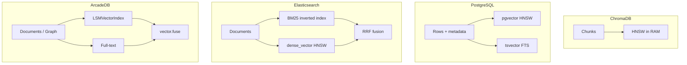
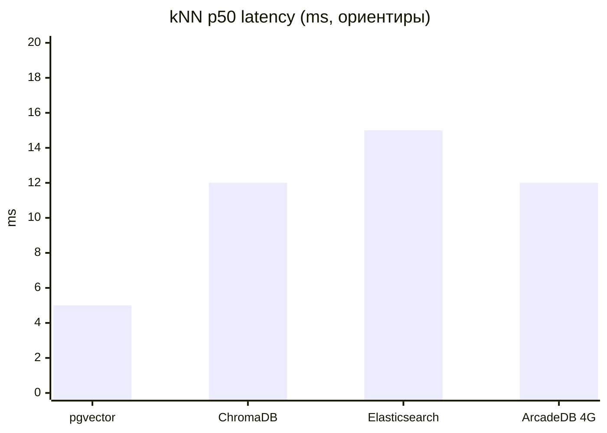

Выбор хранилища для retrieval в RAG-пайплайне — не «какая БД быстрее в абстрактном бенчмарке», а **fit под стек, масштаб и тип запросов**. ChromaDB закрывает прототип за час. PostgreSQL с pgvector — один контур для метаданных, ACL и similarity. Elasticsearch — когда нужен зрелый full-text и гибрид BM25+dense в одном запросе. ArcadeDB — мультимодельная JVM-БД с персистентным HNSW поверх LSM.

В [обзоре RAG-подходов](/vairl/blog/2026/07/03/agent-rag-approaches-ru/) уже разобраны векторные БД в целом; в [телеметрии агентов](/vairl/blog/2026/06/29/agent-telemetry-ru/) — слой Vector + Search. Здесь — **узкое сравнение четырёх конкретных систем** с отдельными разделами по **системным требованиям** и **скорости поиска**.

Связанные материалы: [ChromaDB в ноутбуке синтеза гипотез](/vairl/blog/2026/06/26/llm-hypothesis-synthesis-agents-ru/), [semantic torrent](/vairl/blog/2026/07/01/semantic-torrent-vector-search-ru/), [фундамент RAG](/vairl/blog/2026/07/02/agent-fundamentals-rag-mcp-landscape-ru/).

---

## Карта статьи

| Раздел | О чём |
|--------|--------|
| [Объект сравнения](#объект-сравнения) | Сценарии, метрики, оговорки |
| [Профили систем](#профили-систем) | Chroma · Postgres · ES · ArcadeDB |
| [Функциональное сравнение](#функциональное-сравнение) | Вектор, классика, hybrid, транзакции |
| [Системные требования](#системные-требования) | RAM, CPU, диск, JVM, sizing |
| [Скорость поиска](#сравнение-скорости-поиска) | Latency, QPS, фильтры, recall |
| [Практика](#что-выбрать-на-практике) | Матрица решений |
| [Источники](#источники-и-методология) | Откуда цифры |

---

## Объект сравнения

Сравниваем четыре системы в типичном **RAG / agent retrieval** контексте:

| Система | Роль в стеке | Векторный поиск | Классический поиск |
|---------|--------------|:---------------:|:------------------:|
| **ChromaDB** | Специализированное vector store | ✅ HNSW (hnswlib) | ⚠️ `where_document` (SQLite FTS), не BM25 production-уровня |
| **PostgreSQL + pgvector** | Расширение реляционной БД | ✅ HNSW, IVFFlat; pgvectorscale (DiskANN) | ✅ `tsvector` / `tsquery`, SQL-фильтры |
| **Elasticsearch** | Поисковый движок + аналитика | ✅ dense_vector, HNSW off-heap | ✅ BM25, analyzers, RRF hybrid |
| **ArcadeDB** | Мультимодельная БД (документ + граф + вектор) | ✅ LSMVectorIndex + JVector 4 (HNSW/Vamana) | ✅ full-text + `vector.fuse` (RRF/DBSF) с v26.5.1 |

**Метрики скорости**, которые нас интересуют:

- **Latency** — p50/p95 одного kNN-запроса (top-K, без reranker).
- **Throughput** — QPS при конкурентной нагрузке.
- **Filtered search** — overhead при `WHERE` по метаданным.
- **Hybrid** — BM25 + dense + fusion (RRF).

> **Важно.** Публичные бенчмарки снимаются на разном железе, размере корпуса, размерности эмбеддингов и настройках HNSW (`M`, `ef_construction`, `ef_search`). Цифры ниже — **ориентиры для порядка величин**, а не гарантия SLA. Перед продакшеном — свой бенчмарк на вашем корпусе.

Типовой профиль нагрузки в статье: **500K–1M векторов**, **512–1024 измерений**, top-10…50, cosine similarity.

---

## Профили систем

### ChromaDB

- **Модель:** in-process (`chromadb.Client()`) или client-server; индекс HNSW **держится в RAM**.
- **Сильные стороны:** минимальный порог входа, встроенные embedding functions, идеален для [ноутбуков и прототипов](/vairl/blog/2026/06/26/llm-hypothesis-synthesis-agents-ru/).
- **Слабые стороны:** верхняя граница коллекции ≈ доступная RAM; при swap латентность «умирает»; слабее при высокой конкуренции и сложных SQL-подобных join'ах.

### PostgreSQL + pgvector

- **Модель:** векторный столбец `vector(n)` + обычные таблицы; индексы HNSW/IVFFlat; расширение **pgvectorscale** (Timescale) добавляет DiskANN для десятков миллионов векторов.
- **Сильные стороны:** ACID, JOIN с бизнес-данными, ACL через SQL, один бэкап; отличная конкурентность.
- **Слабые стороны:** нативный hybrid BM25+vector в одном ранжировании — **своя логика** (два запроса + merge); на сотнях миллионов векторов без pgvectorscale нужен шардинг или спец. индекс.

### Elasticsearch

- **Модель:** JVM-кластер, Lucene-сегменты; `dense_vector` + BM25; **RRF** для hybrid из коробки (8.x+).
- **Сильные стороны:** зрелый full-text, аналитика, horizontal scale, единый стек если ES уже есть для логов/поиска.
- **Слабые стороны:** тяжёлый footprint (heap + off-heap для HNSW); операционная сложность; SSPL-лицензия с 2021.

### ArcadeDB

- **Модель:** JVM embedded/server; **LSM Tree** для персистентности + **JVector** для ANN; поддержка графа, документов, SQL.
- **Сильные стороны:** транзакционный vector index, квантизация INT8, `vector.fuse` для server-side hybrid, один процесс вместо «Postgres + отдельная vector DB».
- **Слабые стороны:** меньшая экосистема и managed-офферов; build индекса на 1M+ векторов — **часы и гигабайты RAM**; молодой продукт относительно ES/PG.

---

## Функциональное сравнение

| Критерий | ChromaDB | PostgreSQL + pgvector | Elasticsearch | ArcadeDB |
|----------|:--------:|:---------------------:|:-------------:|:--------:|
| Dense kNN | ✅ | ✅ | ✅ | ✅ |
| BM25 / keyword | ⚠️ ограниченно | ✅ tsvector | ✅ нативно | ✅ + fuse |
| Hybrid в одном запросе | ❌ | ⚠️ вручную | ✅ RRF | ✅ vector.fuse |
| SQL / JOIN | ❌ | ✅ | ⚠️ ES\|QL, ограниченно | ✅ SQL |
| ACID транзакции | ⚠️ WAL, не PG-уровня | ✅ | ⚠️ near-real-time | ✅ |
| Граф / multi-model | ❌ | ⚠️ через расширения | ❌ | ✅ |
| Горизонтальный scale-out | ⚠️ Chroma Cloud | ✅ read replicas, Citus | ✅ шардирование | ⚠️ в разработке |
| Embedded / in-process | ✅ | ✅ (libpq) | ❌ | ✅ |
| Managed SaaS | Chroma Cloud | Supabase, Neon, RDS | Elastic Cloud | ограниченно |
| Типичный потолок single-node | **&lt;1–15M** (зависит от RAM) | **10–50M** (HNSW); **50M+** с pgvectorscale | **миллиарды** (кластер) | **1–10M+** (зависит от heap) |

---

## Системные требования

Отдельный раздел — **минимальные и рекомендуемые ресурсы** для self-hosted развёртывания. Цифры для **production-like** нагрузки, не для `chromadb.Client()` на ноутбуке с тремя документами.

### Сводная таблица

| Система | Минимум (dev) | Рекомендация (1M × 1024d) | Рекомендация (10M × 1024d) | Диск (индекс + данные) |
|---------|---------------|---------------------------|----------------------------|------------------------|
| **ChromaDB** | 2 GB RAM, 2 vCPU | **8–16 GB RAM**, 4 vCPU | **32–64 GB RAM**, 8+ vCPU | ≥ RAM + 5–10 GB OS |
| **PostgreSQL + pgvector** | 2 GB RAM, 2 vCPU | **8–16 GB RAM** (`shared_buffers` 2–4 GB), 4 vCPU | **32–64 GB RAM**, 8 vCPU, NVMe | ~4–8 GB на 1M × 1024d HNSW |
| **Elasticsearch** | 4 GB RAM total (2 GB heap) | **16 GB RAM** (8 GB heap + cache), 4 vCPU | **64+ GB** на data-node, кластер | ~1.5–2× размер корпуса |
| **ArcadeDB** | 4 GB JVM heap | **4–8 GB heap** search; **8 GB heap** build | **32 GB heap** build; **8–16 GB** search | ~6–7 GB на 1M × 1024d INT8 |

### ChromaDB

| Параметр | Значение |
|----------|----------|
| **Минимум RAM** | 2 GB ([документация](https://docs.trychroma.com/guides/performance/single-node)); ниже — нестабильно |
| **Sizing формула** | Для 1024d: `N_max ≈ R × 0.245` (млн векторов на `R` GB RAM) + **≥1 GB** на ОС |
| **Пример** | 1M × 1024d ≈ **4–5 GB** только под индекс + overhead → планируйте **8 GB** узел |
| **CPU** | Нет жёсткого минимума; ingest и HNSW build масштабируются по ядрам |
| **Диск** | Персистентный HNSW + WAL + SQLite metadata; **≥ объёму RAM** |
| **Ограничение** | Индекс **обязан** быть в RAM; swap = катастрофа latency |

Embedded-режим на малом корпусе: **~50–200 MB** RAM (реальные отчёты для тысяч векторов).

### PostgreSQL + pgvector

| Параметр | Значение |
|----------|----------|
| **Минимум** | 2 GB RAM, PostgreSQL 15+, pgvector 0.5+ |
| **shared_buffers** | 25% RAM (типично 2–8 GB) |
| **maintenance_work_mem** | 1–4 GB при build HNSW |
| **work_mem** | 64–256 MB на тяжёлые сортировки (осторожно × connections) |
| **Индекс HNSW** | ~1.2 GB RAM на 500K × 512d (сравнение [Steve Light](https://stevecv.com/blog/chromadb-vs-pgvector-when-to-use-each.html)) |
| **pgvectorscale** | DiskANN снижает RAM pressure на 50M+ векторов; отдельный extension |
| **Диск** | NVMe предпочтителен; random read при cold cache |

Для **классического поиска** дополнительно: GIN-индекс на `tsvector` (+10–30% к размеру таблицы).

### Elasticsearch

| Параметр | Значение |
|----------|----------|
| **Правило heap** | `Xms = Xmx` = **50% RAM** узла, **не более ~31 GB** ([JVM settings](https://www.elastic.co/docs/reference/elasticsearch/jvm-settings)) |
| **Минимум prod** | **4 GB heap** на data-node (~8 GB total RAM); меньше — нестабильно |
| **Off-heap** | HNSW-граф, Lucene segments, Netty — **вторая половина RAM** (filesystem cache) |
| **Типичный RAG-узел** | 16 GB RAM → 8 GB heap + 8 GB cache; [практический отчёт](https://dev.to/bash-thedev/why-i-switched-from-chromadb-to-elasticsearch-and-what-i-miss-2kbl): ~4.5 GB RSS vs 53 MB Chroma |
| **CPU** | 4+ vCPU на data-node при hybrid |
| **Диск** | SSD/NVMe; snapshot repository отдельно |
| **Swap** | Отключить; `bootstrap.memory_lock: true` |

### ArcadeDB

| Параметр | Значение |
|----------|----------|
| **JVM heap (search)** | 1M × 1024d INT8: **≥1 GB** (работает), **2–4 GB** рекомендовано |
| **JVM heap (build)** | 1M: **4 GB**; 2M: **8 GB**; 4M: **16 GB**; 8M: **32 GB** ([бенчмарк MSMARCO](https://github.com/ArcadeData/arcadedb/discussions/3140)) |
| **Peak RSS** | Build 1M: **~4.5–9.5 GB** (включая off-heap/mmap) |
| **Квантизация** | **INT8** — рекомендовано: ~4× экономия памяти, ~2.5× быстрее search ([docs](https://docs.arcadedb.com/arcadedb/concepts/vector-search.html)) |
| **`store_vectors_in_graph`** | `false` для 100K+ — экономия **70–80% RAM** при поиске |
| **CPU** | 4 threads в MSMARCO-бенчмарках; build — CPU-bound часы |
| **Диск** | 1M INT8: **~6.7 GB** (bucket + index + graph) |

---

## Сравнение скорости поиска

### Методология (кратко)

Использованы **опубликованные** результаты 2025–2026:

| Источник | Корпус | Размерность | Запрос |
|----------|--------|-------------|--------|
| [Salt Techno benchmark 2026](https://www.salttechno.ai/datasets/vector-database-performance-benchmark-2026/) | синтетика, million-scale | 768–1536 | top-K kNN |
| [Dataquest: production vector DBs](https://www.dataquest.io/blog/production-vector-databases/) | arXiv papers | 384 | top-K + metadata filters |
| [Steve Light: 500K benchmark](https://stevecv.com/blog/chromadb-vs-pgvector-when-to-use-each.html) | документы | 512 | top-10 |
| [ArcadeDB MSMARCO discussion #3140](https://github.com/ArcadeData/arcadedb/discussions/3140) | MSMARCO subset | 1024 | top-50, Recall@50 |
| [Chroma single-node perf](https://docs.trychroma.com/guides/performance/single-node) | scale test | 1024 | AWS EC2 |

### Сводка: latency kNN (unfiltered)

| Система | p50 latency | p99 latency | Условия |
|---------|-------------|-------------|---------|
| **pgvector (HNSW)** | **5–18 ms** | 40–90 ms | 500K–1M, 512–1024d |
| **ChromaDB** | **12 ms** | 70 ms | million-scale, Salt 2026 |
| **Elasticsearch** | **15 ms** | 75 ms | dense_vector kNN, Salt 2026 |
| **ArcadeDB (INT8)** | **3–12 ms** | 42–713 ms | 1M × 1024d, oq=1, heap 4–8G |

На **500K × 512d, top-10** ([Steve Light](https://stevecv.com/blog/chromadb-vs-pgvector-when-to-use-each.html)):

| Система | Средняя latency |
|---------|-----------------|
| pgvector HNSW | **5 ms** |
| pgvector IVFFlat | 8 ms |
| ChromaDB HNSW | 12 ms |

На **unfiltered arXiv, 384d** ([Dataquest](https://www.dataquest.io/blog/production-vector-databases/)):

| Система | Средняя latency |
|---------|-----------------|
| pgvector | **2.5 ms** |
| ChromaDB | 4.5 ms |
| Qdrant *(для контекста)* | 52 ms* |

\* Qdrant в том тесте — client-server overhead; не предмет статьи, но показывает важность топологии.

### Throughput (QPS)

| Система | QPS (ориентир) | Комментарий |
|---------|----------------|-------------|
| **Elasticsearch** | **5 000–15 000** | distributed, Salt 2026 |
| **ChromaDB** | **2 000–8 000** | single-node, RAM-bound |
| **pgvector** | **1 000–5 000** | single-node; **лучше под concurrent load** |
| **ArcadeDB** | **~25–1000*** | *зависит от heap и overquery_factor |

**Конкурентная нагрузка** ([Elest.io сравнение](https://blog.elest.io/pgvector-vs-chromadb-when-to-extend-postgresql-and-when-to-go-dedicated/)): 100 параллельных запросов на 1M векторов — pgvector **9.8 s** total vs ChromaDB **23 s**; filtered QPS: pgvector **2000** vs Chroma **1000**.

**pgvectorscale** ([Timescale](https://www.tigerdata.com/blog/pgvectorscale)): на 50M векторов — **471 QPS @ 99% recall**, заявлено 11× быстрее Qdrant на том же тесте.

### Latency при фильтрации метаданных

Overhead относительно unfiltered query ([Dataquest](https://www.dataquest.io/blog/production-vector-databases/)):

| Фильтр | ChromaDB overhead | pgvector overhead |
|--------|:-----------------:|:-----------------:|
| Категория (text) | **3.3×** | **2.3×** |
| Год (integer) | **8.0×** | **1.0×** (почти бесплатно) |
| Комбинированный | **5.0×** | **2.3×** |

**Вывод:** PostgreSQL выигрывает на **числовых/датовых** pre-filter — десятилетия оптимизации B-tree. Chroma сильнее деградирует на комбинированных фильтрах.

### Hybrid search (BM25 + vector)

| Система | Механизм | Типичная добавка к latency |
|---------|----------|---------------------------|
| **Elasticsearch** | RRF из коробки | +5–20 ms к чистому kNN |
| **ArcadeDB** | `vector.fuse` (RRF/DBSF/LINEAR) | server-side, с v26.5.1 |
| **PostgreSQL** | Два запроса + custom merge | +10–50 ms, сложность в коде |
| **ChromaDB** | Нет нативного hybrid | N/A |

Практический кейс ([DEV: Chroma → ES](https://dev.to/bash-thedev/why-i-switched-from-chromadb-to-elasticsearch-and-what-i-miss-2kbl)): переход ради **RRF** окупился при корпусе, где keyword + semantic критичны; цена — **85× RAM** (53 MB → 4.5 GB).

### ArcadeDB: детальный бенчмарк (MSMARCO-1M, 1024d, INT8)

Поиск: 1000 запросов, top-50, `max_connections=16`, `beam_width=100` ([январь 2026](https://github.com/ArcadeData/arcadedb/discussions/3140)):

| JVM heap | overquery_factor | Recall@50 | mean latency | p95 latency |
|:--------:|:----------------:|:---------:|:------------:|:-----------:|
| 1 GB | 1 | 0.942 | 60 ms | 141 ms |
| 2 GB | 1 | 0.942 | 34 ms | 80 ms |
| 4 GB | 1 | 0.942 | **12 ms** | 42 ms |
| 8 GB | 1 | 0.942 | **3 ms** | 6 ms |
| 4 GB | 2 | 0.973 | 19 ms | 61 ms |
| 8 GB | 4 | 0.985 | 9 ms | 13 ms |

**Trade-off:** `overquery_factor=2` резко поднимает recall (0.94 → 0.97) при умеренной цене latency — рекомендация maintainer'а ArcadeDB.

Build vs search: **build 1M занимает ~30–90 мин** и 4–9 GB peak RSS; **search** после прогрева — десятки ms на запрос при 4 GB heap.

### ChromaDB: scale на AWS (официальные тесты)

На **r7i.2xlarge (64 GB RAM)** — до **15M** эмбеддингов 1024d ([Chroma docs](https://docs.trychroma.com/guides/performance/single-node)):

| Векторов | p50 | p99 |
|----------|-----|-----|
| 1M | ~5 ms | ~112 ms |
| 5M | ~7 ms | ~149 ms |
| 15M | ~7 ms | ~191 ms |

На **t3.small** — деградация уже при сотнях тысяч векторов.

### Вставка (ingest) — для полноты картины

| Система | Скорость ingest | Заметка |
|---------|-----------------|---------|
| pgvector (COPY bulk) | **~8500 vec/s** | 500K × 512d |
| ChromaDB (batch) | ~3200 vec/s | тот же тест |
| ArcadeDB | ~минуты на 1M | build graph доминирует |
| Elasticsearch | bulk API, ~5–20K docs/s | зависит от mapping |

Для RAG **ingest обычно offline**; критичнее query latency и recall.

---

## Что выбрать на практике

| Сценарий | Рекомендация |
|----------|--------------|
| Ноутбук, Colab, &lt;100K векторов | **ChromaDB** |
| Уже есть PostgreSQL, ACL в SQL, до 10–50M векторов | **pgvector** (+ pgvectorscale на scale) |
| Нужен BM25 + vector + RRF, ES уже в инфраструктуре | **Elasticsearch** |
| Один JVM-процесс: документы + граф + vector + ACID | **ArcadeDB** |
| Только semantic, минимум ops | Chroma embedded или pgvector на Supabase |
| Hybrid без Elasticsearch | ArcadeDB `vector.fuse` или pgvector + application-layer RRF |
| Миллиарды векторов, multi-region | ES / Milvus / Qdrant — не предмет этой статьи, но Chroma single-node не подойдёт |

**Порядок внедрения** (согласован с [RAG-чеклистом](/vairl/blog/2026/07/03/agent-rag-approaches-ru/)):

1. Зафиксировать embedder и размерность.
2. Прогнать **свой** бенчмарк: top-10 latency + Recall@K на 500–1000 размеченных query.
3. Добавить hybrid только если keyword baseline даёт &gt;10% failed retrievals.
4. Reranker после ANN — независимо от выбора БД.

---

## Источники и методология

| # | Источник | Что взято |
|---|----------|-----------|
| 1 | [Chroma: Single-Node Performance](https://docs.trychroma.com/guides/performance/single-node) | RAM sizing, EC2 latency |
| 2 | [Chroma Cookbook: Resources](https://cookbook.chromadb.dev/core/resources/) | CPU/RAM/disk планирование |
| 3 | [Salt Techno Vector DB Benchmark 2026](https://www.salttechno.ai/datasets/vector-database-performance-benchmark-2026/) | p50/p99/QPS сводка |
| 4 | [Dataquest: Production Vector Databases](https://www.dataquest.io/blog/production-vector-databases/) | pgvector vs Chroma filters |
| 5 | [Steve Light: ChromaDB vs pgvector](https://stevecv.com/blog/chromadb-vs-pgvector-when-to-use-each.html) | 500K latency, ingest |
| 6 | [Elest.io: pgvector vs ChromaDB](https://blog.elest.io/pgvector-vs-chromadb-when-to-extend-postgresql-and-when-to-go-dedicated/) | concurrent QPS |
| 7 | [Elastic: JVM settings](https://www.elastic.co/docs/reference/elasticsearch/jvm-settings) | heap 50% rule |
| 8 | [ArcadeDB: Vector Search concepts](https://docs.arcadedb.com/arcadedb/concepts/vector-search.html) | INT8, JVector |
| 9 | [ArcadeDB GitHub #3140](https://github.com/ArcadeData/arcadedb/discussions/3140) | MSMARCO 1M–8M бенчмарки |
| 10 | [DEV: Chroma → Elasticsearch](https://dev.to/bash-thedev/why-i-switched-from-chromadb-to-elasticsearch-and-what-i-miss-2kbl) | hybrid RRF, RAM footprint |

---

*Обновлено: июль 2026. Версии: pgvector 0.8+, Elasticsearch 8.x, Chroma 0.5+, ArcadeDB 26.x.*
