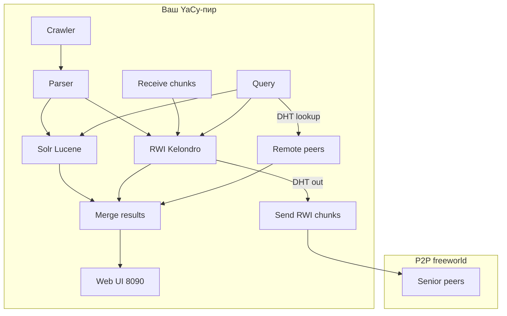
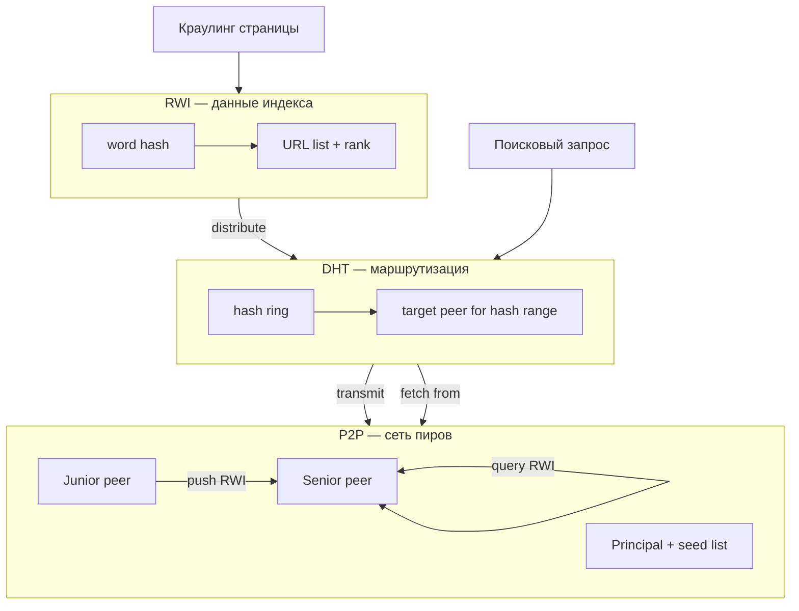
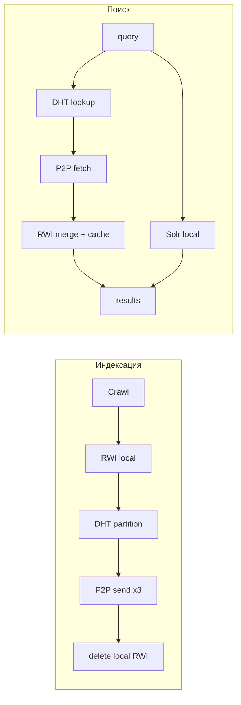
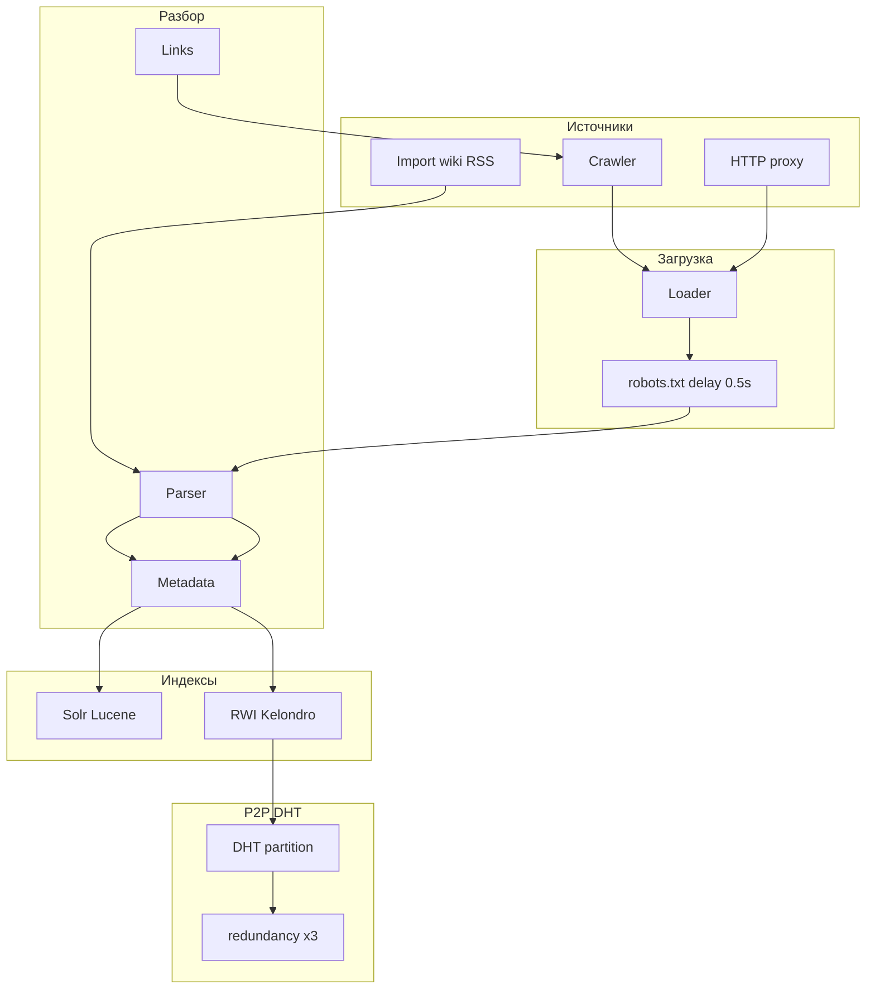
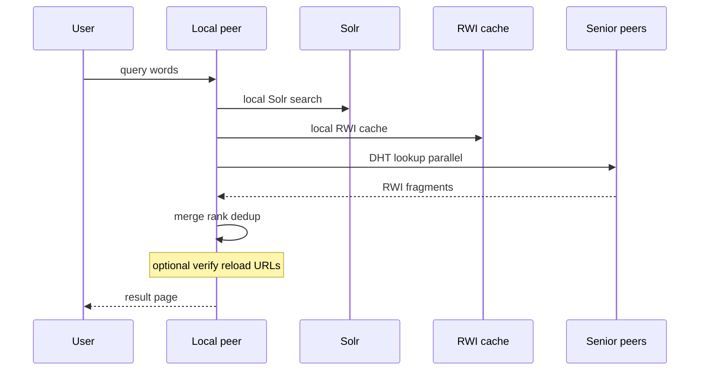

[YaCy](https://yacy.net/) — **децентрализованная поисковая система с открытым исходным кодом** (Java). Каждый участник запускает свой *пир*: краулер, индексатор и веб-интерфейс на `localhost:8090`. Центрального сервера поиска нет — индекс распределён по сети участников через **DHT** (Distributed Hash Table).

Ниже — полный разбор: как устроена архитектура, как работают **индексация** и **поиск**, чем YaCy отличается от Google и SearXNG, и какие **системные требования** нужны под разные сценарии.

Связанные материалы: [сравнение векторных БД](/vairl/blog/2026/07/05/vector-search-databases-comparison-ru/), [semantic torrent](/vairl/blog/2026/07/01/semantic-torrent-vector-search-ru/), [фундамент RAG](/vairl/blog/2026/07/02/agent-fundamentals-rag-mcp-landscape-ru/).

---

## Карта статьи

| Раздел | О чём |
|--------|--------|
| [Что такое YaCy](#что-такое-yacy) | Три режима, сеть freeworld |
| [Архитектура](#архитектура) | Пиры, Senior/Junior, два индекса |
| [DHT + RWI + P2P](#dht--rwi--p2p-три-слоя-децентрализованного-поиска) | Как связаны сеть, индекс и маршрутизация |
| [Индексация](#индексация) | Краулинг → Solr + RWI → DHT |
| [Поиск](#поиск) | DHT lookup, слияние, ранжирование |
| [Преимущества](#преимущества-перед-другими-системами) | Vs Google, SearXNG, Solr |
| [Качество индексации](#работает-ли-индексация-лучше) | Где сильнее, где слабее |
| [Системные требования](#системные-требования) | RAM, диск, Java, сеть, sizing |
| [Итог](#итог) | Когда выбирать YaCy |

---

## Что такое YaCy

YaCy — **свободное ПО (GPL-2+)** для собственного поискового движка. Три режима работы:

| Режим | Назначение |
|-------|------------|
| **P2P (freeworld)** | Глобальный распределённый индекс, общий с другими пирами |
| **Свой портал** | Изолированный индекс только для ваших задач |
| **Intranet** | Поиск по внутренней сети / файлам за файрволом |

Сеть **freeworld** насчитывает порядка **1 300–1 600 онлайн-пиров** (из них ~150–350 senior), с суммарным заявленным объёмом **~3–4 млрд документов** (с перекрытием и дублированием). Для сравнения: у Google — сотни миллиардов страниц и петабайты инфраструктуры.

Установка: [download & installation](https://yacy.net/download_installation/) — Git + Ant, tarball, Docker или инсталлятор. Минимум **Java 11+**.

---

## Архитектура



### Статусы пира

| Статус | Глобальный поиск | Вклад в индекс |
|--------|------------------|----------------|
| **Virgin** | Нет (только локальный) | Нет |
| **Junior** | Нет (за NAT/firewall) | Активная отправка RWI |
| **Senior** | Да | Приём и раздача RWI, ответ на запросы |
| **Principal** | Да + seed-list | Как Senior + bootstrap для новых пиров |

Без открытого порта **8090** пир остаётся Junior и не участвует в глобальном поиске.

### Два индекса

| Индекс | Хранилище | Роль |
|--------|-----------|------|
| **Solr/Lucene** | Локальная БД | Полный документ — «ваш сейф» |
| **RWI** (Reverse Word Index) | Kelondro (`text.index.*`) | Слово → URL — «растворяемый» P2P-индекс |

**Ключевая идея:** Solr хранит всё, что вы проиндексировали, навсегда локально. RWI-фрагменты **уходят в сеть** по DHT и удаляются с вашего диска — но популярные ответы на поисковые запросы **кэшируются** обратно у вас.

---

## DHT + RWI + P2P: три слоя децентрализованного поиска

YaCy — не «просто P2P-краулер». Три механизма работают **вместе**, и путаница между ними — главная причина, почему архитектуру трудно понять с первого раза.

| Слой | Вопрос, на который отвечает | Аналогия |
|------|-----------------------------|----------|
| **P2P** | *Кто* участвует в сети и *как* обменивается данными? | Дорожная сеть: пиры, маршруты, правила приёма/отдачи |
| **RWI** | *Что* именно хранится и передаётся? | Каталог: «слово → список URL» |
| **DHT** | *Где* лежит каждый фрагмент каталога? | Адресная книга: хеш слова → конкретный пир |



### P2P: сеть равноправных узлов

**Peer-to-peer** в YaCy — это не BitTorrent и не «flooding» запросов по всей сети. Каждый узел — полноценный поисковый сервер (краулер + индекс + UI). Пиры обмениваются **только фрагментами индекса** (RWI) и **ответами на поиск**, а не сырыми HTML-страницами.

**Роли пиров:**

| Роль | Сеть | Что делает |
|------|------|------------|
| **Virgin** | Изолирован | Только локальный Solr |
| **Junior** | За NAT | **Активно отправляет** RWI senior-пирам; **не принимает** входящие запросы |
| **Senior** | Порт 8090 открыт | **Принимает** RWI, **хранит** свою долю DHT, **отвечает** на удалённые поиски |
| **Principal** | Senior + FTP seed | Публикует список пиров для bootstrap новых участников |

Протокол YaCy поверх HTTP (порт 8090): `hello`, `query`, `transferRWI`, `transferURL`, distributed crawl. Центрального сервера **нет** — только несколько hard-coded **seed-list** серверов для первого подключения к freeworld.

**Почему Junior ≠ «халявщик»:** узел за файрволом не может принять входящее соединение, но **обязан отдавать** свой индекс активно (push), тогда как Senior принимает пассивно. Обе стороны вносят равный вклад — просто разными способами.

### RWI: Reverse Word Index

**RWI** — вертикальный индекс: для каждого **слова** (точнее, хеша слова) хранится список **URL**, где оно встречается, плюс ранговые метаданные.

```
Страница "Machine learning is fun"
    → токены: machine, learning, fun
    → RWI записи:
        hash(machine)   → [https://example.com/ml, ...]
        hash(learning)  → [https://example.com/ml, ...]
        hash(fun)       → [https://example.com/ml, ...]
```

**Kelondro** — движок хранения RWI в YaCy. Файлы `DATA/INDEX/freeworld/SEGMENTS/default/text.index.*` — blob-сегменты, в RAM держится **бинарное дерево** для быстрого доступа. Отсюда жажда к памяти: большой RWI = гигабайты RAM и долгий старт.

**«Растворяемый» индекс:** в P2P-режиме RWI на вашем пире — **временный буфер**. Вы краулите → RWI растёт → dispatcher забирает чанки → отправляет по DHT → **удаляет локально**. Solr при этом **не трогается** — ваши полные документы остаются.

**Два потока RWI:**

| Направление | Когда | Эффект |
|-------------|-------|--------|
| **DHT out** (distribution) | Фоновая задача после краулинга | Ваш индекс уходит в сеть |
| **DHT in** (search response) | Кто-то ищет через ваш пир или вы ищете глобально | Чужие RWI-фрагменты **оседают у вас** как кэш |

Именно DHT in объясняет ускорение повторных запросов: второй раз слово уже может быть в **локальном** Kelondro, без обращения к удалённым пирам.

**Приватность:** слова в RWI — **хеши**, не открытый текст. Нельзя «пролистать всё, что краулил сосед» — только выполнить поиск по **точному** слову, как в обычном поисковике.

### DHT: Distributed Hash Table

**DHT** отвечает на один вопрос: *если я ищу слово W, к какому пиру мне обратиться?*

YaCy использует **кольцевую топологию** (hash ring):

```
        0 ──────────────────────────────── 2^32-1
        │                                    │
        │    peer A        peer B            │
        └──────●──────────────●──────────────┘
              ↑              ↑
         hash range      hash range
         [0..X)          [X..Y)
```

1. Слово → **word hash** (детерминированная функция).
2. Hash попадает в **диапазон** на кольце.
3. Диапазон **закреплён** за конкретным senior-пиром.
4. При поиске ваш пир **сразу знает адресата** — без peer-hopping и без TTL.

**Вертикальный DHT** (по словам) дополняется партиционированием чанков при передаче (`network.unit.dht.partitionExponent=4` в конфиге freeworld). Dispatcher в `Dispatcher.java`:

```
выбрать RWI из локального Kelondro
  → удалить из локального индекса
  → разбить на партиции по DHT
  → накопить в буфере (одинаковый target → один буфер)
  → отправить на N пиров параллельно
  → после N подтверждений — убрать из очереди
```

**Redundancy** — страховка от offline-пиров:

| Тип пира | Копий каждого RWI-чанка |
|----------|-------------------------|
| Senior (отправитель) | **3** (`network.unit.dhtredundancy.senior=3`) |
| Junior (отправитель) | **1** |

При **поиске** YaCy тоже опрашивает **несколько** пиров с одним hash-range — если один offline, ответ придёт от реплики. Таймаут сбора: **6 с** по умолчанию.

**Почему кольцо, а не «общая БД»:** когда пир входит или выходит, перераспределяется только **соседний** диапазон кольца, а не весь индекс. Это критично для сети из тысяч домашних машин с нестабильным uptime.

### Как три слоя работают вместе

**Индексация (write path):**

```
1. P2P: ваш пир (любой статус) краулит страницу
2. RWI: indexer создаёт word→URL записи + Solr документ
3. DHT: dispatcher выбирает чанки, считает target peer по hash
4. P2P: HTTP transmission RWI → 3 senior-пира
5. RWI: локальные чанки удалены; Solr остаётся
```

**Поиск (read path):**

```
1. Запрос "neural network" → хеши слов neural, network
2. DHT: для каждого хеша — список senior-пиров-владельцев
3. P2P: параллельные HTTP query к 3+ пирам на слово
4. RWI: ответы — фрагменты word→URL → merge локально
5. Solr: параллельно локальный полнотекстовый поиск
6. Merge + rank + verify → выдача в UI
```



### Чем это отличается от «наивного» P2P-поиска

| Подход | Маршрутизация | Проблемы |
|--------|---------------|----------|
| **Flooding** (крикнуть всей сети) | broadcast | O(N) трафик, нет масштаба |
| **Gnutella-style** peer hopping | TTL, релеи | секунды задержки, потери |
| **YaCy DHT** | прямой адрес по hash | O(1) lookup, параллельные запросы |

YaCy **намеренно** не хранит полные тексты страниц в P2P — только **URL + ранг**. Это снижает юридические риски (пир не хранит «запрещённый контент» целиком) и объём диска.

### Настройки, которые стоит знать

| Параметр | Где | Смысл |
|----------|-----|-------|
| `allowDistributeIndex` | `/ConfigNetwork_p.html` | Отдавать свой RWI в сеть |
| `allowReceiveIndex` | `/ConfigNetwork_p.html` | Принимать чужой RWI |
| `client-timeout` | Advanced behavior | Таймаут глобального поиска (мс) |
| `indexDistribution.minChunkSize` | `yacy.init` | Размер чанка при передаче |
| `20_dhtdistribution_idlesleep` | `yacy.init` | Пауза между передачами (мс) |

Отключить **Receive** — ускорит локальный поиск, но отрежет глобальный индекс. Отключить **Distribution** — вы станете потребителем сети без вклада.

---

Индексация — путь от URL до двух параллельных структур: локального **Solr** и распределённого **RWI**.

### Схема пайплайна



### Этап 1. Краулинг

Краулер обходит веб как **BFS по глубине** (depth 0, 1, 2…):

1. Скачивает страницу.
2. Парсит ссылки.
3. Ставит новые URL в очередь.
4. Переходит к следующей глубине.

| Параметр | Поведение |
|----------|-----------|
| `robots.txt` | Соблюдается |
| Балансировка | Round-robin по доменам |
| Задержка | Минимум **0.5 с** между запросами к одному хосту |
| Фильтры | Regex на URL (crawler) и документ (document filter) |
| Приватность | Страницы с паролем, cookies, GET/POST **не индексируются** |
| Распределённый краулинг | Ваш пир поручает обход URL другим пирам |

### Этап 2. Парсинг

- Извлекается **текст** (HTML, PDF и др.).
- Собираются **метаданные**: title, author, date, MIME, язык.
- Формируется **surrogate** — нормализованное представление документа.
- Из HTML — **исходящие ссылки** для продолжения обхода.

### Этап 3. Локальный Solr

```
Документ → токенизация → поля Solr → локальное хранение
```

- Документ **остаётся у вас** — это ваш постоянный индекс.
- API: `http://localhost:8090/solr/select`.
- Можно подключить **внешний Solr** или шарды.
- Второй Solr-core — **webgraph** (граф ссылок для Citation Reference).

### Этап 4. RWI (Kelondro)

```
слово (хеш) → [URL₁, URL₂, ...] + ранговая информация
```

| Свойство | Solr | RWI |
|----------|------|-----|
| Структура | Полный документ | Слово → URL |
| Хранение | `solr_*` | `text.index.*` blob-файлы |
| RAM | Умеренный | Бинарное дерево — **жадный к памяти** |
| Судьба в P2P | Локально навсегда | **Растворяется** — уходит в сеть |

Слова хранятся как **хеши** — нельзя «пролистать» чужую историю, можно искать только по точному слову.

### Этап 5. DHT-распределение RWI

```
1. RWI-фрагменты накапливаются локально
2. DHT определяет peer-владельца диапазона хешей
3. Фрагмент партиционируется по вертикальному DHT
4. Отправляется на N пиров (redundancy: 3 senior / 1 junior)
5. После подтверждения — удаляется с вашего пира
```

**Кольцевая топология:** при входе/выходе пира перераспределение минимально. Популярные запросы создают обратный поток — RWI-ответы **оседают локально** как кэш.

Настройки: `allowDistributeIndex` / `allowReceiveIndex` в `/ConfigNetwork_p.html`.

### Этап 6. Postprocessing (опционально)

- **Citation Reference** — «локальный PageRank» внутри домена (CRn ∈ [0,1]).
- Построение **backlink-структуры**.
- Пометка дубликатов.

**Важно:** глобальный PageRank в postprocessing **отключён** в новых релизах. Citation Reference работает **внутри домена**, не как Google PageRank по всему вебу.

### Ограничения индексации

| Вопрос | Ответ |
|--------|-------|
| Автоматический recrawl? | **Нет** |
| Как обновить? | Chronological recrawl вручную |
| Tor/Freenet | Намеренно **не индексируются** |
| RWI и RAM | Раздувают память; после сбоя восстановление — **часы** |

---

## Поиск

Поиск — **параллельный опрос** нескольких источников с слиянием, ранжированием и (опционально) верификацией сниппетов.

### Схема запроса



### Типы поиска

| Режим | Источники |
|-------|-----------|
| **Локальный** | Solr + локальный RWI |
| **Глобальный (DHT)** | Solr + RWI + удалённые пиры |
| **Node-пиры** | Solr на быстрых Node-пирах (release 1.1+) |

### DHT Lookup

Ключевое отличие от «наивного» P2P: **нет peer-hopping и TTL**.

```
Запрос → хеш слов → DHT → прямой опрос владельцев фрагментов
```

- Запрашивается **несколько пиров** (redundancy) — на случай offline.
- Таймаут сбора: **до 6 секунд** (`client-timeout` в конфиге).

### Слияние и ранжирование

```
Solr (локальный)     ─┐
RWI (локальный кэш)  ─┤
RWI (удалённые)      ─┼→ Merge → Dedup → Rank → Facets
Solr (Node-пиры)     ─┘
```

| Сигнал | Описание | Ограничение |
|--------|----------|-------------|
| **Citation Reference** | Вероятность клика по графу домена | Только внутри домена |
| **PageRank** | Глобальный по ссылкам | **Отключён** |
| **Дата индексации** | Модификатор `/date` | Дата краулинга, не публикации |
| **Уникальность** | Дубликаты понижаются | После postprocessing |

### Верификация сниппетов

| `verify` | Поведение |
|----------|-----------|
| `true` (по умолчанию) | Каждый URL перезагружается для сниппета — медленно, точно |
| `false` | Сниппет из индекса — быстро, возможны битые ссылки |

### Модификаторы и API

```
inurl:nytimes.com     — фильтр по URL
/date                 — сортировка по дате индексации
site:example.com      — ограничение доменом
```

API: **OpenSearch** (RSS), **JSON**, виджеты. Порт по умолчанию: **8090**.

### Ускорение поиска

```
Первый запрос  → до 6 сек (DHT + verify)
Повторный      → быстрее (RWI закэшированы локально)
Локальный Solr → миллисекунды
```

---

## Преимущества перед другими системами

### Vs Google / Bing / Yandex

| Критерий | YaCy | Централизованные |
|----------|------|------------------|
| Приватность запросов | Нет центрального лога | Запросы логируются |
| Цензура | Устойчив к блокировке узла | Зависит от юрисдикции |
| Коммерческий bias | Нет | Рекламное ранжирование |
| Полнота обхода | 100% в нише | Селективный |
| Скорость | Секунды | Миллисекунды |
| Покрытие | ~млрд URL | ~сотни млрд |
| Ранжирование | Локальное, фрагментарное | ML + граф + поведение |

### Vs SearXNG

| | YaCy | SearXNG |
|--|------|---------|
| Индекс | **Свой**, независимый | Прокси Google/Bing/DDG |
| Зависимость от API | Нет | Полная |
| Покрытие | Ограничено сетью | Широкое через upstream |
| Устойчивость к rate-limit | Не зависит | Ломается при блокировке |

### Уникальные сильные стороны

1. **Суверенитет данных** — индекс под вашим контролем.
2. **Узкоспециализированный поиск** — полный обход домена.
3. **Обход цензуры** — страницы, исключённые коммерческими поисковиками.
4. **Прозрачность** — открытый код, настраиваемое ранжирование.
5. **Intranet** — поиск за файрволом без утечки данных третьим лицам.

---

## Работает ли индексация лучше?

**Короткий ответ: нет — для общего веб-поиска YaCy объективно слабее Google.**

### Почему хуже

1. **Масштаб** — ~4 млрд документов (с дублями) vs сотни миллиардов.
2. **Избыточность** — популярные сайты индексируются многократно, длинный хвост — никто.
3. **Нет auto-recrawl** — страницы устаревают.
4. **PageRank отключён** — нет глобального ссылочного ранжирования.
5. **RWI и RAM** — деградация производительности при росте индекса.
6. **Спам** — без централизованной модерации P2P уязвим к SEO-отравлению.

### Где YaCy лучше

| Сценарий | Почему |
|----------|--------|
| Поиск по **своему сайту / intranet** | Полный контроль, нет утечки |
| **Узкая предметная область** | 100% обход домена |
| **Независимость от Google** | Собственный индекс |
| **Исследования децентрализации** | Живой прототип DHT-поиска |
| **Приватность** | Запросы не централизуются |

---

## Системные требования

Официальная страница: [System Requirements](https://yacy.net/installation/requirements/). Ниже — практический sizing по сценариям.

### Минимум (запуск и эксперименты)

| Компонент | Требование |
|-----------|------------|
| **ОС** | Linux, Windows, macOS |
| **Java** | **11+** (рекомендуется **17**) |
| **RAM** | от 256 МБ (официально); на практике от **2 ГБ** |
| **Диск** | от **1–2 ГБ** |
| **Порты** | **8090** (UI + P2P); опционально **8443** (HTTPS) |

### Sizing по сценарию

| Сценарий | RAM | Диск | CPU | Порт 8090 |
|----------|-----|------|-----|-----------|
| Попробовать | 2 ГБ | 2 ГБ | 1 ядро | нет |
| Intranet (без P2P) | 4–8 ГБ | 25 ГБ SSD | 2 ядра | нет |
| P2P Junior | 4–8 ГБ | 50 ГБ SSD | 2–4 ядра | нет |
| P2P Senior | 8–16 ГБ | 100 ГБ SSD | 4 ядра | **да** |
| Крупный узел (10M+ URL) | 32–128 ГБ | 500 ГБ–1.5 ТБ NVMe | 8+ ядер | **да** |

### Production-узлы (опыт сети)

По данным [community.searchlab.eu](https://community.searchlab.eu/t/hardware-for-decent-size-node/2434):

| Масштаб | Диск | RAM |
|---------|------|-----|
| ~10 млн страниц | ~20 ГБ индекс | 16–32 ГБ |
| ~55 млн документов | ~1.4 ТБ | **128 ГБ** |
| ~67 млн документов | ~1.5 ТБ | **128 ГБ** |

Для таких объёмов: **NVMe** с низкой латентностью `fsync`, JVM heap **64 ГБ+**, современный CPU (поиск в Lucene зависит от однопоточной латентности).

Пример JVM-флагов:

```
-Xms8g -Xmx64g
-XX:+UseG1GC
-XX:MaxGCPauseMillis=200
-Dsolr.directoryFactory=solr.NRTCachingDirectoryFactory
-Dsolr.nrtCachingDirectoryFactory.maxCacheMB=8192
```

### Программное обеспечение

| Метод | Особенности |
|-------|-------------|
| **Git + Ant** | Актуальный код, предпочтительный путь |
| **.tar.gz / .exe / .dmg** | Готовые пакеты |
| **Docker** | Java на хосте не нужна; `amd64`, `arm64`, `arm32` |
| **Kubernetes** | Официальный манифест в документации |

```bash
docker run -d \
  --name yacy_search_server \
  -p 8090:8090 -p 8443:8443 \
  -v yacy_search_server_data:/opt/yacy_search_server/DATA \
  --restart unless-stopped \
  yacy/yacy_search_server:latest
```

Логин Docker по умолчанию: `admin` / `yacy` — **смените пароль**.

### Диск и данные

```
DATA/
├── INDEX/     # Solr + RWI (Kelondro)
├── HTCACHE/   # HTTP-кэш краулера
├── SETTINGS/
└── LOG/
```

| Показатель | Ориентир |
|------------|----------|
| Старт | 1–2 ГБ |
| Рекомендация | **25 ГБ** |
| 10 млн страниц | ~**20 ГБ** индекс |
| Тип диска | **NVMe SSD** оптимально; HDD — медленно |

macOS: данные в `~/Library/Application Support/net.yacy.YaCy/DATA/`.

### Память

```
JVM Heap (Solr, парсинг)
  + Kelondro RWI (бинарное дерево в RAM)
  + Word Cache
  + OS page cache
```

| Параметр | По умолчанию | Production |
|----------|--------------|------------|
| JVM heap | **96 МБ** | 8–64+ ГБ |
| Настройка | Performance → Memory Settings | перезапуск |

**Swap — враг.** RWI раздувает RAM; при GC-штормах — удаление `text.index.*` (цена: потеря P2P-кэша).

### Сеть

| Порт | Назначение | Проброс для Senior |
|------|------------|-------------------|
| **8090** | HTTP: UI, API, P2P | **Да** |
| **8443** | HTTPS | По желанию |

Альтернатива пробросу — SSH-туннель:

```bash
ssh -f -R remotehost.org:8090:localhost:8090 user@remotehost.org -N
```

### Чеклист развёртывания

- [ ] Java 11+ (`java -version`)
- [ ] Свободно ≥25 ГБ на диске
- [ ] RAM ≥4 ГБ; heap увеличен в Performance
- [ ] Порт 8090 свободен
- [ ] Для Senior: порт проброшен / SSH-туннель
- [ ] Пароль `admin` сменён
- [ ] SSD/NVMe для `DATA/`
- [ ] Swap минимален

---

## Итог

| Вопрос | Ответ |
|--------|-------|
| Лучше ли индексация веба в целом? | **Нет** — покрытие, свежесть, ранжирование уступают Google |
| Лучше для приватности и независимости? | **Да** |
| Лучше для intranet / нишевого поиска? | **Да** |
| Замена Google для обычного пользователя? | **Нет** |

YaCy — не «лучший поисковик», а **инструмент свободы информации**: децентрализованный, прозрачный, под вашим контролем. Ценность — в архитектуре (DHT + RWI + P2P) и сценариях, где централизованный поиск неприемлем.

**Полезные ссылки:** [yacy.net](https://yacy.net/) · [FAQ](https://yacy.net/faq/) · [RWI distribution](https://yacy.net/operation/rwi-index-distribution/) · [Performance Tuning](https://yacy.net/operation/performance/) · [Community Forum](https://community.searchlab.eu) · [GitHub](https://github.com/yacy/yacy_search_server)
