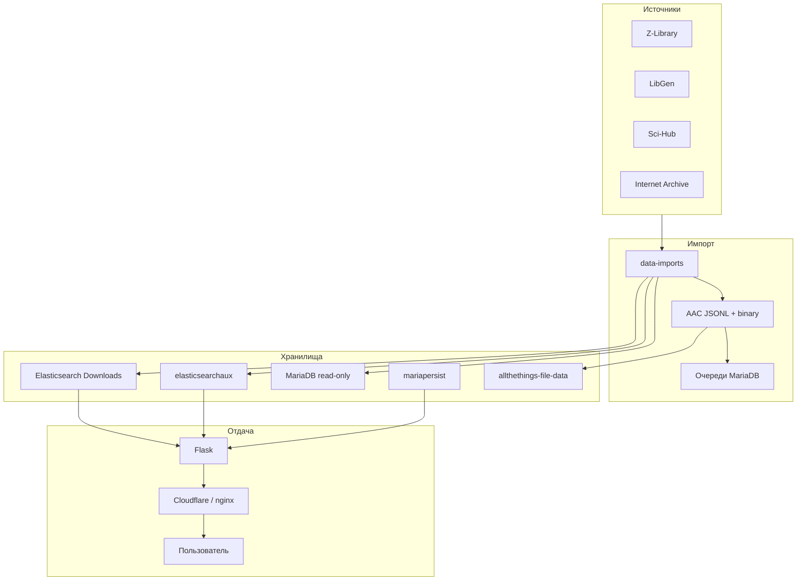
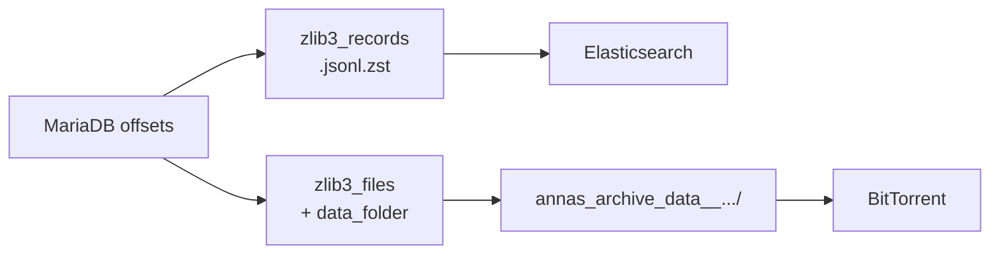

[Anna's Archive](https://annas-archive.gl/) — **метапоисковая система** (не хранилище файлов на сайте): индексирует метаданные из LibGen, Z-Library, Sci-Hub, Internet Archive, DuXiu и других источников и отдаёт ссылки на скачивание через сторонние зеркала, IPFS и торренты. Исходный код — **CC0**, стек: **Flask + MariaDB + Elasticsearch**.

Ниже — полный разбор: архитектура, базы данных, **AAC binary folders**, способы поиска, запуск Elasticsearch и содержимое файлов.

Связанные материалы: [YaCy — децентрализованный поиск](/vairl/blog/2026/07/05/yacy-decentralized-search-engine-ru/), [сравнение Elasticsearch с векторными БД](/vairl/blog/2026/07/05/vector-search-databases-comparison-ru/), [semantic torrent](/vairl/blog/2026/07/01/semantic-torrent-vector-search-ru/).

---

## Карта статьи

| Раздел | О чём |
|--------|--------|
| [Что такое Anna's Archive](#что-такое-annas-archive) | Метапоиск, источники, масштаб |
| [Архитектура](#архитектура) | Web, ES, MariaDB, прокси |
| [Базы данных и файлы](#базы-данных-и-файлы) | Downloads, persist, AAC |
| [AAC binary folders](#aac-binary-folders) | Именование, связь с metadata |
| [Способы поиска](#способы-поиска) | Full-text, ISBN, DOI, MD5 |
| [Запуск Elasticsearch](#запуск-elasticsearch) | Dev, дампы, сборка с нуля |
| [Системные требования](#системные-требования) | RAM, диск, CPU |
| [Итог](#итог) | Когда что использовать |

---

## Что такое Anna's Archive

Проект вырос из **Pirate Library Mirror (PiLiMi)** после блокировки Z-Library в ноябре 2022. Anna's Archive описывают как search engine, metasearch engine и shadow library одновременно.

| Параметр | Значение (2025–2026) |
|----------|----------------------|
| Книги | ~42–64 млн записей |
| Статьи | ~95–98 млн |
| Торренты AA | ~1.1 PB |
| Лицензия кода | CC0 (public domain) |

**Юридическая модель:** сайт **не хостит файлы**, а индексирует метаданные и ссылается на «third-party» downloads — LibGen, Z-Library, Sci-Hub, IPFS, торренты.

### Источники (source libraries)

**С файлами:** LibGen, Z-Library, Sci-Hub, Internet Archive, DuXiu, MagzDB, Nexus/STC, HathiTrust.

**Только метаданные:** Open Library, WorldCat, Google Books, ISBNdb — обогащают записи по ISBN/DOI.

---

## Архитектура



**Принцип устойчивости:** несколько прокси-серверов и зеркал доменов; базы и торренты распределены так, чтобы пережить блокировки отдельных хостингов.

| Компонент | Роль |
|-----------|------|
| **Web (Flask)** | HTTP, поиск, страницы записей, скачивание |
| **elasticsearch** :9200 | Главный индекс **`Downloads`** |
| **elasticsearchaux** :9201 | Статьи, digital lending, codes |
| **mariadb** | Read-only MyISAM, offset-таблицы AAC |
| **mariapersist** | Аккаунты, комментарии, логи |
| **allthethings-file-data/** | AAC binary + meta на диске |

Минимальный набор для **рабочего поиска:** Elasticsearch + mariapersist.

---

## Базы данных и файлы

### Elasticsearch

| Индекс | Содержимое |
|--------|------------|
| **`Downloads`** | Книги, комиксы, журналы — основной поиск |
| **aux-индексы** | Статьи, metadata-only, digital lending |

**Формат записи (`aarecord`)** — объединённая запись по MD5:

```json
{
  "aarecord_id": "md5:8336332bf5877e3adbfb60ac70720cd5",
  "file_unified_data": {
    "md5": "8336332bf5877e3adbfb60ac70720cd5",
    "content_type": "book_fiction",
    "extension": "epub",
    "filesize": 1234567,
    "language": "en"
  },
  "search_only_fields": {
    "title": "...",
    "author": "...",
    "publisher": "..."
  },
  "identifiers_unified": {
    "isbn13": ["978..."],
    "doi": ["10.xxxx/..."]
  },
  "aacid": ["aacid__zlib3_records__..."],
  "torrent": "managed_by_aa/...",
  "server_path": "v/zlib3_files/..."
}
```

**Дампы для торрентов:** `aarecords__0.json.gz`, `aarecords__1.json.gz`, … — шарды готового индекса (~155 GB сжатых).

### MariaDB

| Таблицы | Роль |
|---------|------|
| `aac_*` | Byte offset в AAC-файлах |
| `computed_all_md5s` | Дедупликация |
| `aarecords_codes_*` | ISBN, DOI, OCLC, классификаторы |
| LibGen, OpenLibrary, Z-Lib | Сырые таблицы источников |
| `small_queue_items__*` | Очереди скрапинга |

### AAC — Anna's Archive Containers

Стандарт с августа 2023 для инкрементальных релизов через торренты.

| Тип | Формат | Содержимое |
|-----|--------|------------|
| **meta** | `.jsonl.seekable.zst` | Построчный JSON, Zstandard |
| **data** | каталог `annas_archive_data__*` | Бинарные файлы без расширения |

**AACID:**
```
aacid__<collection>__<timestamp>__<primary_id>__<short_uuid>
```

---

## AAC binary folders

**Binary folders** — каталоги с **реальными файлами** (PDF, EPUB, DJVU). Метаданные лежат отдельно в `.jsonl.seekable.zst`.

### Именование папки

```
annas_archive_data__aacid__<collection>__<start>--<end>/
```

Примеры:

```
annas_archive_data__aacid__zlib3_files__20230808T051503Z--20230808T051504Z/
annas_archive_data__aacid__duxiu_files__20250127T144745Z--20250127T144746Z/
```

Рекомендуемый размер одной папки: **100 GB – 1 TB**.

### Файлы внутри

Имя файла = **полный AACID**, **без расширения**:

```
aacid__zlib3_files__20230808T051503Z__22433983__NRgUGwTJYJpkQjTbz2jA3M
```

### Связь metadata ↔ binary

```json
{
  "aacid": "aacid__zlib3_files__20230808T051503Z__22433983__NRgUGwTJYJpkQjTbz2jA3M",
  "data_folder": "annas_archive_data__aacid__zlib3_files__20230808T051503Z--20230808T051504Z",
  "metadata": {
    "zlibrary_id": "22433983",
    "md5": "63332c8d6514aa6081d088de96ed1d4f"
  }
}
```

Запись **без** `data_folder` — только метаданные (`zlib3_records`, WorldCat).

### Основные binary-коллекции

| Коллекция | Источник | Масштаб |
|-----------|----------|---------|
| `zlib3_files` | Z-Library | десятки TB |
| `duxiu_files` | DuXiu | ~200 TB, ~3.8M файлов |
| `ia2_acsmpdf_files` | Internet Archive CDL | ~300 TB |
| `upload_files_*` | Загрузки пользователей AA | docer, magzdb |

### Расположение на зеркале

```
annas-archive-outer/
├── allthethings-file-data/     ← /file-data/ в Docker
│   └── annas_archive_data__aacid__zlib3_files__.../
├── annas_archive_meta__aacid__....jsonl.seekable.zst
└── allthethings-mysql-data/    ← offset-таблицы
```



---

## Способы поиска

### Веб-интерфейс

| Режим | Что ищет |
|-------|----------|
| Основной поиск | Название, автор, ключевые слова |
| По идентификаторам | ISBN, DOI, MD5 |
| `?index=meta` | Metadata-only (Open Library, WorldCat) |
| Фильтры | `book_fiction`, `journal`, `magazine`, `book_comic` |
| Codes Explorer | DDC, UDC, LCC, GOST |

### Идентификаторы

| Тип | Роль |
|-----|------|
| **MD5** | Первичный ключ файла в AA |
| **ISBN** | Связь изданий и metadata-only источников |
| **DOI** | Научные статьи |
| **AACID** | Структура дампов и торрентов |

Специальное правило: **`annas_archive md5` для Open Library** переопределяет остальные метаданные при конфликте.

### API и инструменты

- **Search API:** `query` + `limit` (1–50), ранжирование по релевантности
- **MCP-серверы** (сторонние): гранулярный поиск по title, author, isbn, doi, format
- **Bulk:** дампы ES/MariaDB через [torrents#aa_derived_mirror_metadata](https://annas-archive.gl/torrents#aa_derived_mirror_metadata)
- **[alexandria](https://github.com/jasperweiss/alexandria):** ingest `aarecords__*.json.gz` в локальный SQLite

---

## Запуск Elasticsearch

### 1. Минимальный dev (без полной базы)

```bash
mkdir annas-archive-outer && cd annas-archive-outer
git clone https://software.annas-archive.li/AnnaArchivist/annas-archive.git --depth=1
cd annas-archive
cp .env.dev .env
docker compose up --build
./run flask cli dbreset
```

Heap в `.env`:
```bash
ES_JAVA_OPTS_ELASTICSEARCH="-Xms256m -Xmx256m"
DOCKER_MAX_MEMORY_ELASTICSEARCH="2G"
```

Проверка:
```bash
curl http://elasticsearch:9200/_cat/indices
curl 'http://elasticsearch:9200/Downloads/_search?q=title:test&size=1'
```

### 2. Готовые дампы (рекомендуется)

```bash
cd annas-archive/data-imports
docker compose up -d --no-deps --build

# Торрент aa_derived_mirror_metadata → aa-data-import--temp-dir/imports/
docker exec -it aa-data-import--web /scripts/load_elasticsearch.sh
docker exec -it aa-data-import--web /scripts/load_elasticsearchaux.sh
docker exec -it aa-data-import--web /scripts/load_mariadb.sh

# AAC для /db endpoints
docker exec -it aa-data-import--web /scripts/download_aac_zlib3_files.sh
docker exec -it aa-data-import--web flask cli mysql_build_aac_tables
```

### 3. Сборка индекса с нуля

```
download_* → load_* → mysql_build_aac_tables → elastic_build_aarecords_*
```

```bash
docker exec -it aa-data-import--web flask cli elastic_build_aarecords_all
docker exec -it aa-data-import--web flask cli elastic_build_aarecords_forcemerge
```

Полный цикл — **~неделя** на 64 CPU / 1 TB RAM / 10 TB NVMe.

### Типичные проблемы

```bash
sudo chmod 0777 -R ../allthethings-elastic-data/ ../allthethings-elasticsearchaux-data/
# ES не стартует при <10% свободного диска (в dev отключено в override)
```

---

## Системные требования

| Режим | RAM | Диск | CPU |
|-------|-----|------|-----|
| Локальная разработка | ≥4 GB | ≥4 GB | любой |
| Production-зеркало | ≥256 GB | ≥4 TB | 32+ cores |
| Полный импорт data-imports | ~1 TB | ~10 TB | 64 cores |

| Компонент | Bottleneck |
|-----------|------------|
| **Elasticsearch** | RAM (heap ≤31 GB на узел), скорость поиска |
| **MariaDB** | `key_buffer_size` — при нехватке RAM уменьшить в `my.cnf` |
| **AAC binary** | Диск; торренты не для одиночных книг, а для зеркал |

---

## Итог

Anna's Archive — **трёхслойная система**:

1. **Файловый слой** — AAC (JSONL.zst + binary folders) в торрентах
2. **Индексный слой** — Elasticsearch (`Downloads`) + MariaDB (offsets, persist)
3. **Сервисный слой** — Flask: full-text + exact match, фильтры, ссылки на зеркала

| Цель | Действие |
|------|----------|
| Потыкать код | `docker compose up` + `dbreset` |
| Рабочий поиск | Торрент `aa_derived_mirror_metadata` + `load_elasticsearch.sh` |
| Полное зеркало | AAC + ES + MariaDB, 256 GB RAM / 4 TB disk |
| Анализ данных | Скачать `aarecords__*.json.gz` или использовать alexandria → SQLite |

**В Elasticsearch — не сами книги, а метаданные и ссылки** (MD5, torrent, server_path, AACID). Сами PDF/EPUB — в **AAC binary folders** и торрентах LibGen/Z-Library.

---

## Источники

| # | Ресурс | О чём |
|---|--------|--------|
| 1 | [Открытый репозиторий AA](https://software.annas-archive.li/AnnaArchivist/annas-archive) | Docker, README, docker-compose |
| 2 | [data-imports/README.md](https://software.annas-archive.li/AnnaArchivist/annas-archive/-/blob/main/data-imports/README.md) | Импорт ES и MariaDB |
| 3 | [AAC blog post](https://annas-archive.gl/blog/annas-archive-containers.html) | Binary folders, AACID |
| 4 | [Datasets / torrents](https://annas-archive.gl/torrents) | aa_derived_mirror_metadata |
| 5 | [Wikipedia: Anna's Archive](https://en.wikipedia.org/wiki/Anna%27s_Archive) | История, масштаб, правовой контекст |

*Обновлено: июль 2026.*
