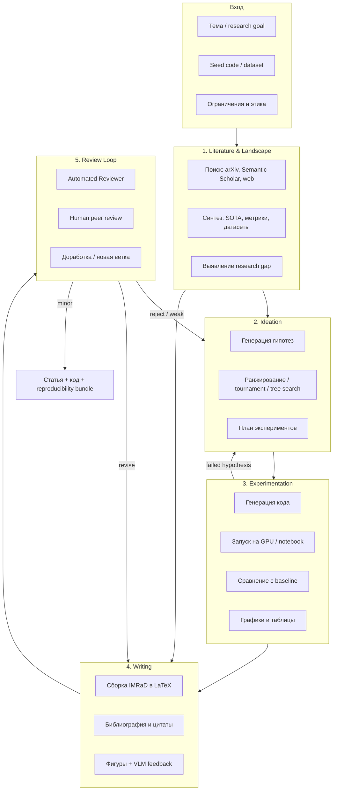
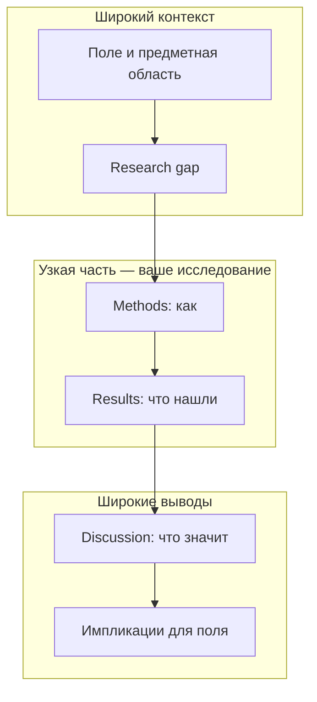
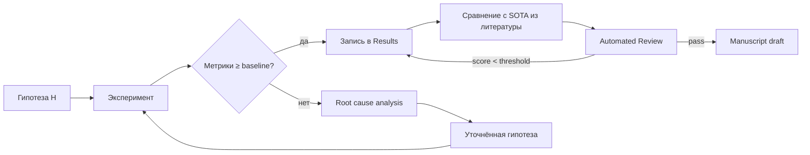

**Deep Research Agent** в научной области — это не просто «чат с поиском по arXiv». Это **замкнутый контур исследования**, где агент собирает знания, структурированные по разделам будущей статьи, формулирует гипотезы, проводит эксперименты, сравнивает результаты с SOTA и проходит цикл ревью — пока не получит пригодный к публикации черновик.

Канонический пример — [The AI Scientist](https://sakana.ai/ai-scientist-nature/) от Sakana AI: в марте 2026 методология опубликована в [Nature](https://www.nature.com/articles/s41586-026-10265-5), а AI Scientist-v2 стал первой полностью AI-сгенерированной статьёй, прошедшей слепое peer review на ICLR 2025 workshop (средний балл 6.33).

Ниже — **схема работы** такого агента, привязка к структуре научной статьи, разбор Sakana AI Scientist и **сравнительные таблицы** аналогичных систем.

Связанные материалы VAIRL: [синтез гипотез](/vairl/blog/2026/06/26/llm-hypothesis-synthesis-agents-ru/), [RAG-подходы агентов](/vairl/blog/2026/07/03/agent-rag-approaches-ru/), [Sakana Fugu](/vairl/blog/2026/07/02/sakana-fugu-multi-agent-orchestration-ru/), [будущее AI-лабораторий](/vairl/blog/2026/01/17/future-ai-research-labs-ru/).

---

## Карта статьи

| Раздел | О чём |
|--------|--------|
| [Зачем отдельный агент](#зачем-deep-research-agent-а-не-deep-research) | Отличие от «глубокого поиска» и coding-агентов |
| [Архитектура](#архитектура-deep-research-agent) | Пять фаз и обратная связь |
| [IMRaD: структура статьи](#imrad-структура-научной-статьи) | Схема «песочных часов» и вопросы к каждому разделу |
| [Разделы и агент](#что-собирает-deep-research-agent-по-разделам) | Артефакты агента по IMRaD |
| [Цикл проверки](#цикл-проверки-и-сравнительный-анализ) | Эксперименты, baseline, ревью |
| [AI Scientist](#the-ai-scientist-sakana-ai) | v1 → v2 → Nature |
| [Сравнение систем](#сравнение-автономных-научных-систем) | Таблицы по 10+ фреймворкам |
| [Ограничения](#ограничения-и-бенчмарки) | MLReplicate и риски |
| [Источники](#источники) | Papers, код, блоги |

---

## Зачем Deep Research Agent, а не «Deep Research»

| Инструмент | Что делает | Чего не делает |
|------------|------------|----------------|
| **Deep Research** (OpenAI, Gemini, Perplexity) | Длинный литературный отчёт с цитатами | Не пишет код, не запускает GPU-эксперименты |
| **Coding agent** (Cursor, Codex) | Реализует задачу по спецификации | Не формулирует научную гипотезу, не пишет LaTeX-статью |
| **RAG over papers** | Отвечает на вопросы по корпусу | Нет closed-loop: идея → эксперимент → публикация |
| **Deep Research Agent (Science)** | Полный цикл: знание → гипотеза → eval → manuscript → review | Дорого, хрупко, нужен human-in-the-loop |

Ключевое отличие — **артефакт на выходе**: не markdown-отчёт для человека, а **научная статья** (LaTeX/PDF) с воспроизводимым кодом, таблицами метрик и библиографией — плюс **явный цикл верификации**.

---

## Архитектура Deep Research Agent

Обобщённая схема, объединяющая Sakana AI Scientist, Google Co-Scientist, Kosmos и open-source фреймворки:

**Три устойчивых паттерна** в современных системах:

1. **Structured memory** — world model (Kosmos), RAG-граф (SciAgents), experiment registry (AI Scientist) вместо бесконечного контекста.
2. **Parallel exploration** — agentic tree search (AI Scientist-v2), tournament evolution (Co-Scientist), сотни rollouts (Kosmos).
3. **Reviewer as inner loop** — automated reviewer до human review; feedback идёт обратно в ideation и writing.

---

## IMRaD: структура научной статьи

**IMRaD** (Introduction — Methods — Results — and Discussion) — стандартная логика научного текста. Её часто изображают как **«песочные часы»**: сверху широкий контекст поля, в середине — узкая методология и конкретные данные, снизу снова расширение к выводам и импликациям.

Для Deep Research Agent IMRaD — не просто шаблон LaTeX, а **контракт на артефакты**: каждый раздел отвечает на конкретный вопрос; агент не переходит к следующему, пока не заполнит предыдущий.

### Схема с подписями

*Слева:* ядро **IMRaD** (I → M + R → D) и логика охвата — от широкого поля к «вашему исследованию» и обратно. *Справа:* ключевой вопрос к каждому разделу. Пунктиром — опциональные блоки (Study Site, Conclusions, Acknowledgments).

Оригинальная схема из обзора Cals & Kotz (2013); ниже — та же логика с русскими подписями и привязкой к агенту.

### Вопросы к каждому разделу

| Раздел | Форма в схеме | Ключевой вопрос | Что должно быть внутри |
|--------|---------------|-----------------|------------------------|
| **Title** | Овал | О чём статья? | Кратко, информативно, пригодно для поиска человеком и машиной |
| **Abstract** | Прямоугольник | Суть в двух словах? | Мини-IMRaD: проблема → метод → результат → вывод; **главные находки** |
| **Introduction** | Сужающаяся трапеция ↓ | Зачем вы это делали? | Проблема, важность, известное / неизвестное, research gap, гипотезы, цели, contributions |
| **Study Site** | Пунктир (опц.) | Где проводили? | Площадка, релевантность; в ML часто входит в Methods |
| **Methods** | Узкий блок | Как вы это делали? | Дизайн, алгоритмы, датасеты, метрики — **и обоснование** выбора |
| **Results** | Узкий блок | Что вы нашли? | Таблицы, графики, статистика — **без интерпретации** |
| **Discussion** | Расширяющаяся трапеция ↑ | Что это значит? И что дальше? | Интерпретация, достигнуты ли цели, limitations, future work, практические импликации |
| **Conclusions** | Пунктир (опц.) | Главные выводы? | Не дублировать Discussion; 3–5 тезисов significance |
| **Acknowledgments** | Пунктир | — | Гранты, инфраструктура, помощь |
| **References** | Широкое основание | На чём основано? | Полный список источников; каждая сильная claim → citation |

### Логика «песочных часов»

**Правило для агента:** во **Introduction** нельзя «спойлерить» результаты; в **Results** нельзя обсуждать — только факты; в **Discussion** нельзя вводить новые данные, которых не было в Results. Automated Reviewer в AI Scientist как раз ловит такие нарушения.

### IMRaD в ML-статьях (расширение)

В статьях по machine learning к классическому IMRaD часто добавляют:

| Доп. раздел | Роль | Аналог в IMRaD |
|-------------|------|----------------|
| **Related Work** | SOTA-таблица, positioning | Часть Introduction или отдельная секция |
| **Background / Preliminaries** | Notation, постановка | Начало Methods |
| **Experimental Setup** | Датасеты, hyperparams, hardware | Methods |
| **Ablation Study** | Сравнение вариантов | Results |
| **Broader Impact / Limitations** | Этика, угрозы валидности | Discussion |

---

## Что собирает Deep Research Agent по разделам

Агент не «пишет текст подряд» — он **накапливает типизированные артефакты**, которые мапятся на разделы:

| Раздел статьи | Что собирает агент | Фаза агента | Инструменты |
|---------------|-------------------|-------------|-------------|
| **Abstract** | Синтез после всех фаз | Writing | LLM + шаблон конференции |
| **Introduction** | Problem statement, motivation, contributions | Literature + Ideation | Lit search, gap analysis |
| **Related Work** | Обзор области, SOTA-таблица | Literature | arXiv, Semantic Scholar, citation graph |
| **Background** | Определения, notation | Literature | Surveys, textbooks |
| **Method** | Алгоритм, loss, гипотеза | Ideation + Experiment | Code gen, formalization |
| **Experimental Setup** | Датасеты, splits, hyperparameters | Experiment | `dataset_search`, configs |
| **Results** | Метрики, таблицы, статистика | Experiment | Experiment runner, pandas |
| **Ablation / Analysis** | Сравнение вариантов | Experiment | Tree search branches |
| **Discussion** | Интерпретация, limitations | Review → Writing | Reflection / Meta-review agent |
| **Conclusion** | Takeaways, future work | Writing | Supervisor synthesis |
| **References** | BibTeX с верификацией | Literature + Writing | `claim_verifier`, CrossRef |

**Сравнительный анализ** — отдельный подконтур: агент строит **benchmark matrix** (метод × датасет × метрика), подтягивает published numbers из литературы и дополняет своими runs. Без этого Related Work и Results расходятся — типичная ошибка слабых систем.

---

## Цикл проверки и сравнительный анализ

**Уровни проверки:**

| Уровень | Механизм | Примеры систем |
|---------|----------|----------------|
| **Статистическая** | p-value, confidence intervals, multiple seeds | AI Scientist experiments |
| **Репродукционная** | Фиксированный seed, логи, артефакты | MLReplicate benchmark |
| **Цитатная** | Каждое утверждение → paper или code cell | Kosmos, TinyScientist `claim_verifier` |
| **Peer-style** | 3–5 независимых LLM-ревьюеров + meta-review | AI Scientist Automated Reviewer, Co-Scientist Meta-review |
| **Human** | Слепое ревью, экспертная панель | ICLR 2025 ICBINB, MLReplicate |

Бенчмарк [MLReplicate](https://arxiv.org/abs/2605.16616) показал: **59% автоматически принятых статей** содержали fabricated или unsupported claims при human evaluation — автоматический ревьюер необходим, но **недостаточен**.

---

## The AI Scientist (Sakana AI)

[Блог Sakana](https://sakana.ai/ai-scientist-nature/) и [Nature paper](https://www.nature.com/articles/s41586-026-10265-5) описывают эволюцию системы:

### AI Scientist v1 (2024)

| Аспект | Детали |
|--------|--------|
| **Вход** | Broad research direction + seed codebase (например nanoGPT) |
| **Цикл** | Idea → lit search → code → experiments → LaTeX paper → automated review |
| **Стоимость** | < $15 за статью |
| **Домены** | Diffusion, transformers, learning dynamics |
| **Код** | [GitHub: AI-Scientist](https://github.com/SakanaAI/AI-Scientist) |

### AI Scientist v2 (2025)

| Улучшение | Описание |
|-----------|----------|
| **Agentic tree search** | Параллельное исследование пространства гипотез под experiment manager |
| **Без human templates** | Автономная генерация кода без жёстких шаблонов v1 |
| **VLM feedback** | Vision-модель оценивает фигуры при экспериментах и ревью |
| **Peer review** | Статья на ICLR 2025 ICBINB: avg 6.33 (порог accept ~6) |
| **Код** | [GitHub: AI-Scientist-v2](https://github.com/SakanaAI/AI-Scientist-v2) |

### Automated Reviewer

- Ансамбль из 5 независимых ревью по гайдлайнам NeurIPS.
- Balanced accuracy **69%** на OpenReview — сопоставимо с human reviewers.
- **Scaling law**: качество статей растёт с capability foundation model.

### Ограничения (из Nature)

- Наивные или недоработанные идеи.
- Слабая глубина в сложном коде.
- Галлюцинации цитат, дублирование фигур.
- Пока только **computational experiments** (нет wet lab).

---

## Сравнение автономных научных систем

### Таблица 1: End-to-end research agents

| Система | Организация | Open? | Домен | Эксперименты | Выход | Ключевая особенность |
|---------|-------------|-------|-------|--------------|-------|----------------------|
| **[AI Scientist v1/v2](https://sakana.ai/ai-scientist/)** | Sakana AI, UBC, Oxford | Open-source | ML | GPU code runs | LaTeX + code | Tree search, Nature 2026, ICLR peer review |
| **[Co-Scientist](https://research.google/blog/accelerating-scientific-breakthroughs-with-an-ai-co-scientist/)** | Google DeepMind | Closed (Gemini) | Biomed, general | In silico + protocols | Hypotheses + roadmap | 6 агентов + tournament Elo, [Nature 2026](https://www.nature.com/articles/s41586-026-10644-y) |
| **[Kosmos](https://edisonscientific.com/articles/announcing-kosmos)** | Edison Scientific | Commercial ($200/run) | Multi-science + data | 42K LOC, notebooks | Cited report | World model, 1500 papers, 12h runs |
| **[Agent Laboratory](https://agentlaboratory.github.io/)** | WashU / Microsoft | Open-source | ML | MLE-solver, GPU | LaTeX + repo | Human co-pilot, ~$2.33/run, EMNLP 2025 |
| **[TinyScientist](https://github.com/ulab-uiuc/tiny-scientist)** | UIUC | Open-source | ML | Code execution | LaTeX + PDF | MCP tools, `claim_verifier`, EMNLP Demo 2025 |
| **[SciAgents](https://doi.org/10.1002/adma.202413523)** | MIT | [GitHub](https://github.com/lamm-mit/SciAgentsDiscovery) | Materials | Graph reasoning | Discovery proposals | Ontology KG + agent swarm |
| **CycleResearcher** | Open-source LLM | Open weights | ML writing | × (no code exec) | LaTeX | RL-trained researcher + reviewer pair |
| **AI Researcher** | Academic | Open | ML | Code | LaTeX + code | End-to-end pipeline |
| **Deep Research** | OpenAI / Google / Perplexity | Product | General | × | Long report | Lit synthesis only, не full science loop |
| **AutoResearchClaw** | UNC AIMING Lab | Open (MIT) | ML | Code | LaTeX | 23-stage pipeline, citation verification |

### Таблица 2: Архитектурные паттерны

| Система | Lit review | Ideation | Exploration | Experiment | Writing | Review | Human loop |
|---------|:----------:|:--------:|:-----------:|:----------:|:-------:|:------:|:----------:|
| AI Scientist v2 | ✓ | ✓ | Tree search | ✓ GPU | LaTeX + VLM | Auto ensemble | Optional |
| Co-Scientist | ✓ web | ✓ | Tournament + Elo | Protocols | Roadmap | 6-agent debate | Scientist-guided |
| Kosmos | ✓ 1500 papers | ✓ | 200 parallel rollouts | ✓ 42K LOC | Cited report | Traceability audit | Collaborator |
| Agent Laboratory | ✓ arXiv | ✓ | Linear + feedback | ✓ MLE | LaTeX | Survey-based | **Co-pilot default** |
| TinyScientist | ✓ 10+ tools | ✓ | Modular stages | ✓ | LaTeX | JSON review | Interactive UI |
| Deep Research | ✓ | × | Single thread | × | Report | × | User query |

### Таблица 3: Результаты бенчмарков (MLReplicate, 2026)

Оценка 6 систем на воспроизведении 8 outstanding papers ICML 2025 ([arxiv:2605.16616](https://arxiv.org/abs/2605.16616)):

| Метрика | Значение |
|---------|----------|
| Сгенерировано manuscripts | 45 (из 48 targets) |
| Automated accept rate | 10/37 valid (~27%) |
| Human accept rate | Почти все → borderline-reject / reject |
| Fabricated claims в auto-accepts | **59%** |
| Pearson r (auto vs human overall) | +0.29 (слабый) |
| Pearson r (soundness) | +0.77 |
| Дизайн vs compute | Самая дешёвая система **лучше** самой дорогой (38× tokens) |

**Вывод MLReplicate:** архитектура пайплайна важнее масштаба compute; human evaluation обязателен.

### Таблица 4: Маппинг агентов Co-Scientist на фазы статьи

По [документации Google](https://docs.cloud.google.com/gemini/enterprise/docs/co-scientist-and-alphaevolve):

| Агент | Роль в research loop | Аналог в статье |
|-------|---------------------|-----------------|
| **Generation** | Lit search + первичные гипотезы | Introduction, Related Work |
| **Reflection** | Peer review гипотез | Threats to validity |
| **Ranking** | Elo-турнир гипотез | Выбор Method |
| **Evolution** | Уточнение top hypotheses | Method refinement |
| **Proximity** | Дедупликация, матчинг | Related Work clustering |
| **Meta-review** | Синтез всех ревью | Discussion, Conclusion |
| **Supervisor** | Оркестрация и scaling compute | — |

---

## Практический чеклист: проектирование своего Deep Research Agent

Если вы строите аналог для своей предметной области:

1. **Типизируйте артефакты** — `LiteratureNote`, `Hypothesis`, `ExperimentRun`, `BenchmarkRow`, `SectionDraft`; не храните всё в одном prompt.
2. **Разделите retrieval и synthesis** — отдельные агенты для поиска papers/datasets и для построения SOTA-таблицы.
3. **Зафиксируйте benchmark matrix** до экспериментов — иначе сравнительный анализ станет post-hoc rationalization.
4. **Встройте claim verification** — каждое число в Results должно ссылаться на run_id или DOI.
5. **Automated review до human** — но не доверяйте accept без эксперта (MLReplicate).
6. **Human-in-the-loop gate** — Agent Laboratory показал: co-pilot mode > fully autonomous.
7. **Watermark и disclosure** — Sakana рекомендует маркировать AI-generated papers.

Связь с [синтезом гипотез](/vairl/blog/2026/06/26/llm-hypothesis-synthesis-agents-ru/): фаза Ideation — тот же `hypothesis → metric → falsification criteria`, но в научном агенте к этому добавляются автоматические эксперименты и LaTeX.

---

## Ограничения и бенчмарки

| Риск | Проявление | Митигация |
|------|------------|-----------|
| **Hallucinated citations** | Несуществующие DOI | `claim_verifier`, CrossRef API |
| **Fabricated results** | Цифры без run | Experiment registry, mandatory logs |
| **Weak novelty** | Переформулировка известного | Proximity graph, semantic dedup |
| **Review gaming** | Auto-reviewer ≈ generator LLM | Разные модели, human panel |
| **Ethics / authorship** | AI papers в peer review | Disclosure, IRB, withdrawal policy |
| **Cost** | $2–$200+ за run | TinyScientist / Agent Lab для прототипа |

Полезные бенчмарки помимо MLReplicate: [PaperBench](https://arxiv.org/abs/2505.18381), [ScienceAgentBench](https://arxiv.org/abs/2410.05080), [MLE-Bench](https://arxiv.org/abs/2410.08047), [AI Idea Bench](https://arxiv.org/abs/2501.03916).

---

## Источники

### Sakana AI Scientist
- [The AI Scientist — Nature publication blog](https://sakana.ai/ai-scientist-nature/)
- [Nature paper (2026)](https://www.nature.com/articles/s41586-026-10265-5)
- [AI Scientist v1 paper (arXiv:2408.06292)](https://arxiv.org/abs/2408.06292)
- [AI Scientist v2 (arXiv:2504.08066)](https://arxiv.org/abs/2504.08066)
- [GitHub: AI-Scientist](https://github.com/SakanaAI/AI-Scientist) · [AI-Scientist-v2](https://github.com/SakanaAI/AI-Scientist-v2)

### Другие системы
- [Google Co-Scientist (arXiv:2502.18864)](https://arxiv.org/abs/2502.18864) · [Nature 2026](https://www.nature.com/articles/s41586-026-10644-y)
- [Kosmos (arXiv:2511.02824)](https://arxiv.org/abs/2511.02824) · [Edison Scientific](https://edisonscientific.com/articles/announcing-kosmos)
- [Agent Laboratory (EMNLP 2025)](https://arxiv.org/abs/2501.04227) · [сайт](https://agentlaboratory.github.io/)
- [TinyScientist (arXiv:2510.06579)](https://arxiv.org/abs/2510.06579) · [GitHub](https://github.com/ulab-uiuc/tiny-scientist)
- [SciAgents (Advanced Materials, 2024)](https://doi.org/10.1002/adma.202413523) · [GitHub](https://github.com/lamm-mit/SciAgentsDiscovery)

### Бенчмарки и обзоры
- [MLReplicate (arXiv:2605.16616)](https://arxiv.org/abs/2605.16616)
- [Autoresearch Tools Compared — Ry Walker](https://rywalker.com/research/autoresearch-tools)

### IMRaD
- Cals J.W.L., Kotz D. — *Research Policy Manuscript Structure* (Springer, 2013); схема структуры статьи
