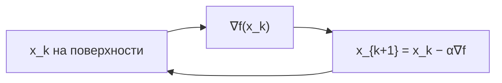

**Градиентный спуск** — базовый алгоритм оптимизации: из точки $x_k$ делаем шаг против градиента $\nabla f(x_k)$ с коэффициентом $\alpha$ (learning rate). На плоскости $(x, y)$ это легко нарисовать контурным графиком; в **3D** сразу видно, как «шарик» скатывается по поверхности $z = f(x, y)$, где узкие овраги (Розенброк) и слишком большой $\alpha$ ломают сходимость.

Ниже — короткая теория, интерактив на **Three.js** и вход в **WebXR** (3D в окне или immersive VR). Связанный материал: [WebXR в браузере](/vairl/blog/2026/07/06/webxr-browser-vr-cursor-ru/).

---

## Итерация градиентного спуска

Для гладкой $f: \mathbb{R}^n \to \mathbb{R}$:

$$
x_{k+1} = x_k - \alpha_k \, \nabla f(x_k)
$$

| Обозначение | Смысл |
|-------------|--------|
| $f(x)$ | Целевая функция (loss) |
| $\nabla f(x)$ | Направление **наибольшего роста** $f$ |
| $-\nabla f(x)$ | Направление **спуска** |
| $\alpha$ | Длина шага (learning rate) |

В демо работаем в $\mathbb{R}^2$: оси $x$, $y$ — горизонтальная плоскость, высота — значение $f(x,y)$.

**Красная сфера** — текущая точка; **оранжевая линия** — пройденный путь; **синяя стрелка** — направление $-\nabla f$; **зелёное кольцо** — приближённый минимум (поиск по сетке на видимой области).

---

## Что смотреть в интерактиве

Переключайте функцию и $\alpha$, ставьте на паузу и делайте шаг вручную:

| Функция | Поведение спуска |
|---------|------------------|
| $x^2 + y^2$ | Простой параболоид, сходимость к $(0,0)$ |
| Рябь | Локальные минимумы — риск застрять не в глобальном |
| Розенброк | Узкий изогнутый овраг, чувствительность к $\alpha$ |
| $x^2 - y^2$ | Седло: градиентный спуск **нестабилен** |

Слишком большой $\alpha$ на Розенброке и седле даёт осцилляции или «выброс» с траектории; слишком малый — медленный прогресс по дну оврага.

### Интерактив: ландшафт и траектории

Крутите сцену мышью, сравните **четыре оптимизатора** с одной стартовой точки. Поверхность и траектории полупрозрачные — видны пересечения путей. **Сначала** выберите удобный обзор в окне, **затем** нажмите **ENTER VR** (вид совпадёт, камера чуть отодвинута назад).

  

    
Четыре оптимизатора. <strong>Мышь:</strong> ЛКМ — обзор, ПКМ — сдвиг, колесо — приближение (Shift+колесо — масштаб сцены). В VR на телефоне с USB-мышью те же жесты работают глобально. <strong>Shift+клик</strong> — старт. Версия визуализации — в правом нижнем углу.

  

  

    <label>Функция
      <select id="gdx-fn-select">
        <option value="bowl">Параболоид x² + y²</option>
        <option value="ripple">Рябь с локальными минимумами</option>
        <option value="rosenbrock">Розенброк</option>
        <option value="saddle">Седло x² − y²</option>
      </select>
    </label>
    <label>α = 0.08
      <input id="gdx-lr-range" type="range" min="0.01" max="0.25" step="0.01" value="0.08">
    </label>
    <button type="button" id="gdx-btn-play" class="active">Пауза</button>
    <button type="button" id="gdx-btn-step">Шаг</button>
    <button type="button" id="gdx-btn-reset">Сброс</button>
  

  

    ● SGD
    ● Momentum
    ● Adam
    ● RMSprop
  

  

  

    

    

  

  
Three.js + WebXR. Полноэкранно: <a href="{{ '/gradient-descent-xr.html' | relative_url }}">gradient-descent-xr.html</a>. Сначала настройте обзор → ENTER VR. Shift+клик по поверхности — новый старт.

---

## Связь с обучением нейросетей

В ML $f$ — **loss** по весам $\theta \in \mathbb{R}^d$, $d$ может быть миллиарды. Тот же принцип: $\theta_{k+1} = \theta_k - \alpha \nabla_\theta L$. Визуализация в 2D — срез или проекция высокомерного ландшафта; здесь — «честная» двумерная $f(x,y)$ для построения интуиции.

Практические следствия, которые видны на демо:

1. **Learning rate** — компромисс скорость / стабильность.
2. **Геометрия loss** (овраги, седла) объясняет, зачем нужны Adam, momentum, warmup.
3. **Локальные минимумы** — градиентный спуск без трюков не гарантирует глобальный оптимум.

---

## WebXR: inline и immersive-vr

| Режим | Описание |
|-------|----------|
| `inline` | 3D в окне браузера (как в виджете выше) |
| `immersive-vr` | Картинка на дисплеи шлема после клика **ENTER VR** |

Минимальные требования: Chromium с WebXR, `xrCompatible` WebGL-контекст, запуск `requestSession` только по **жесту пользователя**. Подробнее — в [статье про WebXR и Cursor](/vairl/blog/2026/07/06/webxr-browser-vr-cursor-ru/).

---

## Итог

| Элемент демо | Что показывает |
|--------------|----------------|
| Полупрозрачная поверхность $z=f(x,y)$ | Форму loss; сквозь неё видны траектории |
| 4 траектории (SGD, Momentum, Adam, RMSprop) | Разная динамика при одном $\alpha$ |
| Слайдер $\alpha$ | Влияние learning rate на все методы сразу |
| VR с сохранением обзора | Позиция из окна браузера + отступ камеры назад |

Градиентный спуск в 3D — наглядный мост между формулой из курса оптимизации и тем, что происходит при обучении моделей.

---

## Источники

- [WebXR Device API — MDN](https://developer.mozilla.org/en-US/docs/Web/API/WebXR_Device_API)
- [Three.js — How to create VR content](https://threejs.org/docs/#manual/en/introduction/How-to-create-VR-content)
- [WebXR: VR в браузере и Cursor](/vairl/blog/2026/07/06/webxr-browser-vr-cursor-ru/)
