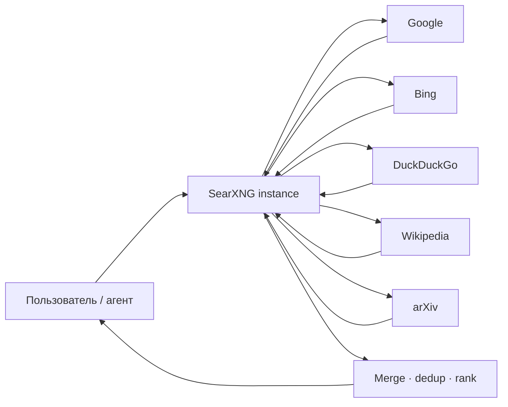
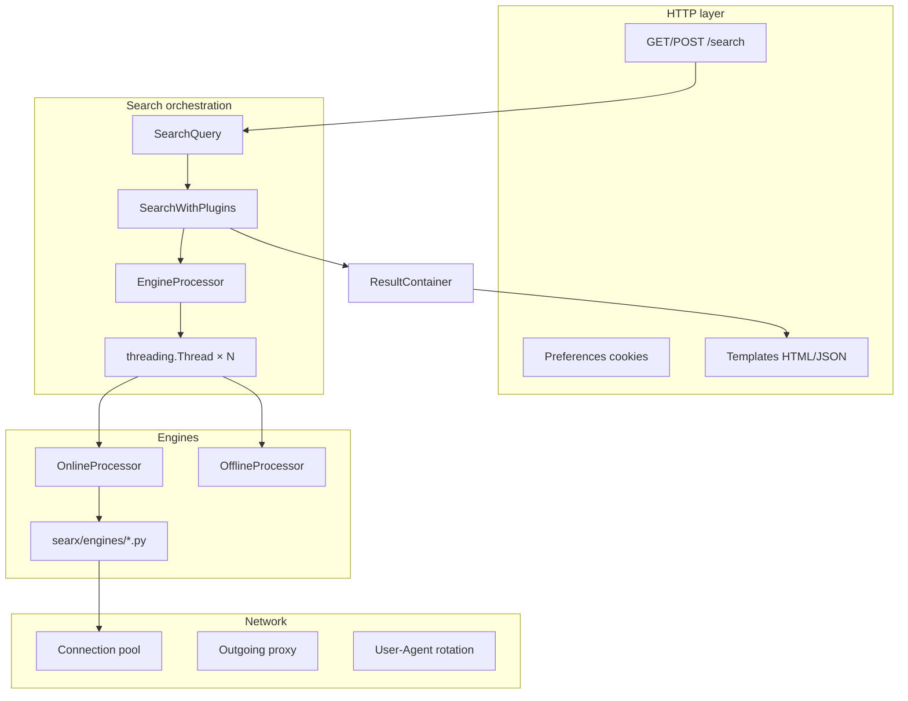
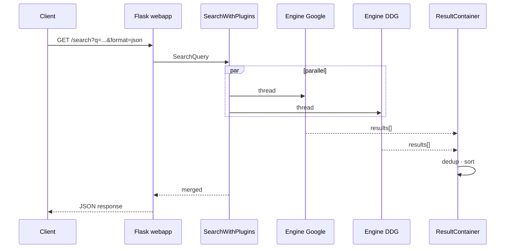
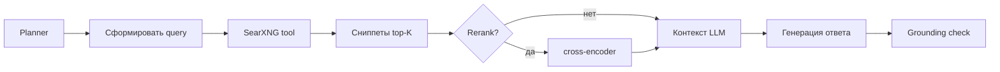

[SearXNG](https://docs.searxng.org/) — **свободный метапоисковик** (AGPL-3.0, Python/Flask), форк проекта Searx. Он **не индексирует веб сам**, а параллельно опрашивает Google, Bing, DuckDuckGo, Brave, Wikipedia, arXiv и ещё **200+ движков**, агрегирует ответы, дедуплицирует и отдаёт пользователю **без трекинга и профилирования**.

Для разработчика агентов SearXNG — стандартный **self-hosted web search tool**: JSON API, выбор движков и категорий, фильтр по времени. Для приватного поиска — альтернатива коммерческим поисковикам без собственного краулера.

Ниже — архитектура, пайплайн запроса, конфигурация, Docker, интеграция с RAG/агентами, сравнение с [YaCy](/vairl/blog/2026/07/05/yacy-decentralized-search-engine-ru/) и ограничения production-эксплуатации.

Связанные материалы: [YaCy — децентрализованный поиск](/vairl/blog/2026/07/05/yacy-decentralized-search-engine-ru/), [RAG для агентов](/vairl/blog/2026/07/03/agent-rag-approaches-ru/), [фундамент RAG и MCP](/vairl/blog/2026/07/02/agent-fundamentals-rag-mcp-landscape-ru/), [semantic torrent](/vairl/blog/2026/07/01/semantic-torrent-vector-search-ru/).

---

## Карта статьи

| Раздел | О чём |
|--------|--------|
| [Что такое SearXNG](#что-такое-searxng) | Метапоиск vs поисковик с индексом |
| [Архитектура](#архитектура) | Flask, processors, threads |
| [Пайплайн поиска](#пайплайн-поиска) | От query до JSON |
| [Движки и категории](#движки-и-категории) | 200+ engines, online/offline |
| [Конфигурация](#конфигурация-settingsyml) | settings.yml, use_default_settings |
| [API](#api-для-агентов-и-интеграций) | JSON, параметры, примеры |
| [Docker](#развёртывание-docker-compose) | Compose, volumes, Valkey |
| [Приватность](#приватность-и-безопасность) | Что видит кто |
| [Сравнение](#сравнение-с-альтернативами) | Google, YaCy, Brave Search API |
| [Агенты и RAG](#searxng-в-агентных-системах) | liteLLM, LangChain, паттерны |
| [Ограничения](#ограничения-и-риски) | CAPTCHA, rate-limit, formats |
| [Системные требования](#системные-требования) | RAM, CPU, sizing |
| [Итог](#итог) | Когда выбирать SearXNG |

---

## Что такое SearXNG

**Метапоисковик** (metasearch engine) — прослойка между пользователем и **внешними** поисковыми сервисами. SearXNG:

| Свойство | Значение |
|----------|----------|
| Лицензия | AGPL-3.0 |
| Стек | Python 3, Flask, Granian (WSGI) |
| Движков | **200+** (настраиваемый набор) |
| Индекс | **Нет** — только прокси к upstream |
| Трекинг | Не профилирует пользователей |
| Self-host | Docker, bare metal, Kubernetes |

Проект создан в 2021 как форк Searx после заморозки оригинала. Репозиторий: [github.com/searxng/searxng](https://github.com/searxng/searxng) — одна из крупнейших open-source поисковых кодовых баз (~33K stars).

**Ключевое отличие от YaCy:** YaCy **строит свой индекс** (P2P + Solr). SearXNG **не краулит** — он **переиспользует** чужие индексы. Покрытие широкое, зависимость от upstream — полная.



---

## Архитектура

SearXNG — **монолитное Flask-приложение** с модульной подсистемой движков.



### Основные компоненты

| Компонент | Файлы / роль |
|-----------|--------------|
| **webapp** | Flask: маршруты `/`, `/search`, preferences, статика |
| **Configuration** | `settings.yml` + env `SEARXNG_*`, layered merge |
| **Search** | `searx/search/` — оркестрация запроса |
| **EngineProcessor** | Абстракция жизненного цикла движка |
| **OnlineProcessor** | HTTP к внешним API/HTML (большинство движков) |
| **OfflineProcessor** | Локальные ресурсы без сети |
| **ResultContainer** | Сбор, дедупликация, сортировка |
| **Plugins** | Хуки до/после поиска, фильтрация результатов |
| **Network layer** | Пулы соединений, retry, прокси |

### Параллельное выполнение

На каждый запрос SearXNG:

1. Парсит `q`, категории, язык, safesearch.
2. Выбирает **активные движки** (по категории + preferences).
3. Для каждого движка создаёт **`threading.Thread`** → `EngineProcessor.search()`.
4. Собирает результаты в `ResultContainer` с таймаутом.
5. Дедуплицирует по URL, применяет плагины, рендерит формат.

**SuspendedStatus:** при ошибках (CAPTCHA, 403, 429) движок **временно отключается** — от минут до 15 дней для Cloudflare CAPTCHA. Это критично для production: один заблокированный IP может «убить» Google/Bing на инстансе.

---

## Пайплайн поиска



### Этапы обработки

| Этап | Что происходит |
|------|----------------|
| **Parse** | Нормализация query, язык, категории |
| **Select engines** | Фильтр disabled/suspended, preferences |
| **Dispatch** | N потоков, timeout per engine |
| **Fetch** | HTTP/HTML scraping или API upstream |
| **Parse results** | Унификация в `Result` (title, url, content, engine) |
| **Aggregate** | Merge, dedup URL, score |
| **Plugins** | Tracker removal, hostname replace, DOI resolver |
| **Render** | HTML / JSON / CSV / RSS |

Типичная латентность: **1–4 с** — определяется самым медленным движком в наборе, не SearXNG.

---

## Движки и категории

Каждый движок — Python-модуль в `searx/engines/` + запись в `settings.yml`.

### Типы движков

| Тип | Примеры | Особенности |
|-----|---------|-------------|
| **general** | google, bing, duckduckgo, brave, startpage | Основной веб-поиск |
| **images** | google images, bing images, flickr | Медиа |
| **videos** | youtube, peertube, dailymotion | Видео |
| **news** | google news, bing news | Свежие статьи |
| **science** | arxiv, pubmed, crossref, semantic scholar | Статьи и препринты |
| **it** | github, stackoverflow, npm, pypi | Разработка |
| **map** | openstreetmap, apple maps | Гео |
| **music** | genius, bandcamp, soundcloud | Музыка |
| **files** | annas archive, library genesis | Файлы и книги |
| **social media** | reddit, lemmy, mastodon | Соцсети |

Полный список: [docs.searxng.org — configured engines](https://docs.searxng.org/admin/engines/index.html).

### Online vs offline

| Processor | Когда |
|-----------|-------|
| **OnlineProcessor** | HTTP к внешнему сервису; user-agent, headers, cookies |
| **OfflineProcessor** | Локальные SQLite, файлы — без исходящего HTTP |

### Tokens и приватные API

Некоторые движки требуют ключи:

```yaml
engines:
  - name: google
    tokens: ['$YOUR_TOKEN']
  - name: brave
    disabled: false
```

Без токена движок может работать через HTML-scraping (хрупко) или быть отключён.

---

## Конфигурация settings.yml

Файл ищется в порядке:

1. `$SEARXNG_SETTINGS_PATH`
2. `/etc/searxng/settings.yml`
3. Встроенный default из репозитория

### use_default_settings

Рекомендуемый путь — наследовать defaults и переопределять минимум:

```yaml
use_default_settings: true
server:
  secret_key: "ultrasecretkey"   # обязательно сменить!
  bind_address: "[::]"
  limiter: false                 # для локального API без Valkey
search:
  formats:
    - html
    - json                      # нужно для агентов!
  default_lang: "ru-RU"
engines:
  - name: google
    disabled: true               # убрать Google из набора
  - name: duckduckgo
    disabled: false
```

### Выборочное включение движков

Только Google + DuckDuckGo:

```yaml
use_default_settings:
  engines:
    keep_only:
      - google
      - duckduckgo
server:
  secret_key: "change-me"
```

Исключить Google:

```yaml
use_default_settings:
  engines:
    remove:
      - google
```

### Важные секции

| Секция | Назначение |
|--------|------------|
| `server:` | bind, secret_key, limiter, image_proxy |
| `search:` | safesearch, formats, languages, ban_time |
| `outgoing:` | request_timeout, max_request_timeout, proxies |
| `engines:` | enable/disable, tokens, weight, categories |
| `plugins:` | tracker_remover, hostname_replace, etc. |

**search.formats:** по умолчанию только `html`. Для API агентов **обязательно** добавить `json` — иначе `format=json` вернёт **403 Forbidden**.

**suspended_times:** время бана движка после CAPTCHA/403 (секунды). Cloudflare CAPTCHA — до **15 суток**.

---

## API для агентов и интеграций

Документация: [Search API](https://docs.searxng.org/dev/search_api.html).

### Endpoints

```
GET  /search?q=...&format=json
POST /search  (form: q, format, categories, ...)
GET  /
POST /
```

### Параметры

| Параметр | Описание |
|----------|----------|
| `q` | Запрос (поддерживает синтаксис upstream: `site:github.com`) |
| `format` | `json`, `csv`, `rss` — должен быть в settings |
| `categories` | `general`, `science`, `it`, `news`, ... |
| `engines` | `google,duckduckgo` — только эти движки |
| `language` | `ru`, `en`, `ru-RU` |
| `pageno` | Номер страницы (default 1) |
| `time_range` | `day`, `month`, `year` |
| `safesearch` | `0`, `1`, `2` |

### Пример cURL

```bash
curl 'http://localhost:8080/search?q=mamba+state+space+model&format=json&categories=science' \
  -H 'Accept: application/json'
```

### Пример Python (агент)

```python
import httpx

def searxng_search(query: str, base_url: str = "http://localhost:8080") -> list[dict]:
    r = httpx.get(
        f"{base_url}/search",
        params={
            "q": query,
            "format": "json",
            "categories": "general,science",
            "language": "en",
        },
        timeout=15.0,
    )
    r.raise_for_status()
    return r.json().get("results", [])

# В tool loop агента:
hits = searxng_search("GRPO vs PPO alignment 2025")
for hit in hits[:5]:
    print(hit["title"], hit["url"])
```

### Формат ответа JSON

```json
{
  "query": "mamba state space",
  "number_of_results": 42,
  "results": [
    {
      "url": "https://arxiv.org/abs/2312.00752",
      "title": "Mamba: Linear-Time Sequence Modeling...",
      "content": "Snippet text...",
      "engine": "arxiv",
      "parsed_url": ["https", "arxiv.org", "/abs/2312.00752", "", "", ""],
      "template": "default.html",
      "engines": ["arxiv", "google"],
      "positions": [1, 3],
      "score": 4.0,
      "category": "science"
    }
  ],
  "answers": [],
  "corrections": [],
  "infoboxes": [],
  "suggestions": []
}
```

Поля `content` — сниппет для RAG chunking; `engines` и `positions` — из каких источников пришёл результат (после merge).

### liteLLM

[liteLLM](https://docs.litellm.ai/docs/search/searxng) поддерживает SearXNG как `search_provider`:

```python
from litellm import search

response = search(
    query="Python asyncio patterns",
    search_provider="searxng",
    searxng_api_base="http://localhost:8080",
    engines="stackoverflow,github",
    categories="it",
)
```

Ограничение: SearXNG отдаёт **~20 результатов на страницу**; `max_results` через API не всегда работает — для глубокого retrieval нужен `pageno` loop.

---

## Развёртывание Docker Compose

Официальный путь: [Installation container](https://docs.searxng.org/admin/installation-docker.html).

### Быстрый старт

```bash
mkdir -p ./searxng/core-config/
cd ./searxng/

curl -fsSL \
  -O https://raw.githubusercontent.com/searxng/searxng/master/container/docker-compose.yml \
  -O https://raw.githubusercontent.com/searxng/searxng/master/container/.env.example

cp .env.example .env
# отредактировать .env: SEARXNG_SECRET, порты

docker compose up -d
```

Стек по умолчанию (2026):

| Сервис | Роль |
|--------|------|
| **searxng-core** | Flask + Granian, порт 8080 |
| **searxng-valkey** | Redis-совместимый store для limiter |

### Volumes

| Путь в контейнере | Содержимое |
|-------------------|------------|
| `/etc/searxng/` | `settings.yml`, `limiter.toml` |
| `/var/cache/searxng/` | favicon cache, persistent data |

### Минимальный settings для локального API

`core-config/settings.yml`:

```yaml
use_default_settings: true
server:
  secret_key: "local-dev-secret-change-in-prod"
  limiter: false
search:
  formats:
    - html
    - json
outgoing:
  request_timeout: 10.0
  max_request_timeout: 15.0
```

### Публичный инстанс

Для exposure в интернет:

1. Reverse proxy (Caddy/nginx) с TLS.
2. Включить **limiter** + Valkey — защита от ботов.
3. Ограничить `formats` — многие публичные инстансы отключают JSON из-за злоупотреблений.
4. Настроить `outgoing.proxies` — исходящий IP влияет на CAPTCHA upstream.

Список публичных инстансов: [searx.space](https://searx.space/).

---

## Приватность и безопасность

| Аспект | SearXNG | Прямой Google |
|--------|---------|---------------|
| Профиль пользователя | Не строит | Да |
| Cookies третьим лицам | Минимум (preferences локально) | Extensive |
| Лог запросов | На **вашем** сервере | На серверах Google |
| IP upstream | IP **вашего** сервера | IP пользователя |
| Результаты | Агрегат без персонализации | Персонализированы |

**Важно:** при self-host запросы **всё равно уходят** на Google/Bing с IP вашего сервера. Приватность для **конечного пользователя** — да (он не светится Google). Приватность для **оператора инстанса** — нет: upstream видит все запросы инстанса.

Плагины вроде **tracker_url_remover** и **hostname_replace** чистят URL от UTM и редиректов.

---

## Сравнение с альтернативами

### Vs Google / Bing / Yandex

| Критерий | SearXNG | Централизованные |
|----------|---------|------------------|
| Качество ранжирования | Зависит от upstream | ML + поведение + граф |
| Скорость | 1–4 с (parallel) | 200–500 мс |
| Персонализация | Нет | Да |
| Реклама | Нет | Да |
| API для агентов | JSON (self-host) | Официальные API ($) |
| Юридические риски оператора | Scraping upstream | Лицензия API |

### Vs YaCy

| | SearXNG | [YaCy](/vairl/blog/2026/07/05/yacy-decentralized-search-engine-ru/) |
|--|---------|------|
| Индекс | **Чужой** (upstream) | **Свой** (P2P + Solr) |
| Покрытие веба | Широкое через Google/Bing | ~млрд URL в freeworld |
| Зависимость от API | Полная | Нет |
| CAPTCHA / rate-limit | **Да**, критично | Не зависит от Google |
| Intranet-поиск | Слабо (нет своих файлов) | **Сильно** |
| Сложность ops | Низкая (Docker) | Высокая (Java, RAM, DHT) |
| Латентность | Секунды | Секунды (DHT) |

**Вывод:** SearXNG — для **приватного веб-поиска и агентов** с минимальным ops. YaCy — когда нужен **суверенный индекс** без Google.

### Vs Brave Search API / Tavily / SerpAPI

| | SearXNG | Коммерческие search API |
|--|---------|-------------------------|
| Стоимость | Бесплатно (self-host) | $ за запрос |
| Стабильность | CAPTCHA, баны IP | SLA, легальный доступ |
| Настройка движков | Полная | Фиксированный провайдер |
| AGPL | Да (self-host) | Проприетарные ToS |

Для production-агентов с бюджетом часто комбинируют: **SearXNG dev/staging** + **Brave/Tavily prod**.

---

## SearXNG в агентных системах

Типичный паттерн в agent control loop:



### Рекомендации для RAG

| Практика | Зачем |
|----------|-------|
| Self-host инстанс | Контроль JSON API, нет rate-limit публичных инстансов |
| `categories=science` для research | arXiv, Semantic Scholar, PubMed |
| `engines=` whitelist | Меньше шума, быстрее |
| `time_range=year` | Актуальность для tech-запросов |
| Fetch full page после SearXNG | Сниппет короткий — нужен crawl URL |
| Кэш результатов | Одинаковые query → не бить upstream |
| Fallback при suspended | Второй движок в whitelist |

SearXNG — **retrieval первого уровня** (как Google в browse mode), не замена векторному RAG по корпусу. Связка: **SearXNG (web) + Qdrant (local docs)** — стандарт для research-агентов.

### MCP и tool definition

Пример схемы tool для агента:

```json
{
  "name": "web_search",
  "description": "Search the public web via self-hosted SearXNG",
  "parameters": {
    "type": "object",
    "properties": {
      "query": { "type": "string" },
      "categories": { "type": "string", "default": "general" },
      "time_range": { "enum": ["day", "month", "year", null] }
    },
    "required": ["query"]
  }
}
```

---

## Ограничения и риски

| Риск | Проявление | Митигация |
|------|------------|-----------|
| **CAPTCHA upstream** | Google/Bing suspend на дни | Прокси, ротация IP, меньше движков |
| **403 на JSON** | format не в settings | Добавить `json` в `search.formats` |
| **Публичные инстансы** | JSON отключён, rate-limit | Self-host |
| **Нет глубокой пагинации** | ~20 results/page | Loop `pageno`, другой API |
| **Scraping ToS** | Юридическая серая зона | Официальные API движков с tokens |
| **Нет своего индекса** | Intranet, локальные PDF | [YaCy](/vairl/blog/2026/07/05/yacy-decentralized-search-engine-ru/) или Elasticsearch |
| **AGPL-3.0** | Network use = share source | Учитывать при SaaS |

### Suspended engines — типичные таймауты

| Ошибка | Ban (сек) |
|--------|-----------|
| Access Denied / 403 | 86 400 (1 день) |
| CAPTCHA | 86 400 |
| Too Many Requests / 429 | 3 600 |
| Cloudflare CAPTCHA | 1 296 000 (15 дней) |
| reCAPTCHA (Google) | 604 800 (7 дней) |

Мониторинг: страница `/stats` на инстансе — статус движков, error rate.

---

## Системные требования

SearXNG лёгкий — основная нагрузка **исходящий HTTP**, не локальный индекс.

| Сценарий | RAM | CPU | Диск |
|----------|-----|-----|------|
| Локальный dev (API) | 512 МБ – 1 ГБ | 1 ядро | 1 ГБ |
| Docker Compose + Valkey | 1–2 ГБ | 1–2 ядра | 2 ГБ |
| Публичный инстанс (100+ users) | 2–4 ГБ | 2–4 ядра | 5 ГБ |
| High-traffic + limiter | 4–8 ГБ | 4 ядра | 10 ГБ SSD |

Образ Docker: ~**265 МБ**. Python 3.11+. Valkey — для bot limiter на публичных инстансах.

**Сеть:** исходящая пропускная способность и **чистота IP** важнее CPU. Datacenter IP чаще ловит CAPTCHA, чем residential.

### Чеклист развёртывания

- [ ] `secret_key` уникален
- [ ] `search.formats` включает `json` (для агентов)
- [ ] `limiter` + Valkey (если публичный)
- [ ] Reverse proxy + TLS (если публичный)
- [ ] `outgoing.request_timeout` настроен (10–15 с)
- [ ] Выбран набор движков (`keep_only` / `remove`)
- [ ] Мониторинг `/stats` на suspended engines
- [ ] Прокси для исходящих (опционально, anti-CAPTCHA)

---

## Итог

| Вопрос | Ответ |
|--------|-------|
| Замена Google для обычного пользователя? | **Частично** — качество близко, латентность выше |
| Лучший выбор для агентного web search? | **Да** — self-host, JSON, выбор движков |
| Нужен свой индекс / intranet? | **Нет** — смотрите [YaCy](/vairl/blog/2026/07/05/yacy-decentralized-search-engine-ru/) |
| Production без сюрпризов? | Нужны прокси, мониторинг CAPTCHA, fallback API |

SearXNG — **не поисковик**, а **приватный агрегатор чужих поисковиков**. Ценность — в контроле над данными пользователя, бесплатном API для агентов и свободе выбора источников. Цена — зависимость от upstream, CAPTCHA и отсутствие собственного индекса.

**Полезные ссылки:** [docs.searxng.org](https://docs.searxng.org/) · [GitHub](https://github.com/searxng/searxng) · [Search API](https://docs.searxng.org/dev/search_api.html) · [Docker install](https://docs.searxng.org/admin/installation-docker.html) · [Публичные инстансы (searx.space)](https://searx.space/) · [liteLLM integration](https://docs.litellm.ai/docs/search/searxng)
