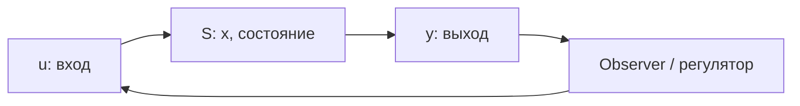

**Управляемость** (controllability) и **наблюдаемость** (observability) — два столпа линейной теории управления, введённые [R.E. Kalman](https://doi.org/10.1109/JRPROC.1960.287263) в 1960 году. Они отвечают на простые вопросы:

- **Управляемость:** можно ли **достичь** любого состояния, подавая вход $u$?
- **Наблюдаемость:** можно ли **восстановить** состояние, глядя только на выход $y$?

В **системотехнике** (и в прикладной кибернетике) эти понятия — не абстракция: они объясняют, почему термостат в одной комнате не управляет температурой в соседней, почему KPI не отражает мотивацию сотрудника, и почему агент с широким tool API может быть формально **неуправляем** через узкий system prompt.

Связанные материалы VAIRL: [интеллект vs сложность управления](/vairl/blog/2026/07/06/intelligence-control-complexity-ru/), [устойчивость agent control loops](/vairl/blog/2026/06/29/agent-control-loop-stability-ru/), [типы задач теории систем](/vairl/blog/2026/07/02/systems-theory-task-types-ru/), [телеметрия агентов](/vairl/blog/2026/06/29/agent-telemetry-ru/).

<figure style="margin: 2em auto; text-align: center;">
  
  <figcaption style="font-size: 0.9em; color: #666; max-width: 720px; margin: 0 auto;">Четыре комбинации Kalman — каноническая классификация LTI-систем</figcaption>
</figure>

---

## Модель и критерии

Рассмотрим дискретную **линейную стационарную** (LTI) систему:

$$
x_{k+1} = A x_k + B u_k, \qquad y_k = C x_k
$$

| Обозначение | Смысл |
|-------------|--------|
| $x_k \in \mathbb{R}^n$ | Внутреннее состояние (скрыто от оператора) |
| $u_k \in \mathbb{R}^m$ | Управление (рычаги оператора) |
| $y_k \in \mathbb{R}^p$ | Наблюдаемый выход (датчики, логи, KPI) |



### Матрица управляемости

$$
\mathcal{C} = \begin{bmatrix} B & AB & A^2B & \cdots & A^{n-1}B \end{bmatrix}
$$

Система **полностью управляема**, если $\operatorname{rank}\mathcal{C} = n$.

### Матрица наблюдаемости

$$
\mathcal{O} = \begin{bmatrix} C \\ CA \\ CA^2 \\ \vdots \\ CA^{n-1} \end{bmatrix}
$$

Система **полностью наблюдаема**, если $\operatorname{rank}\mathcal{O} = n$.

| Критерий | Вопрос | Если ранг &lt; n |
|----------|--------|------------------|
| $\operatorname{rank}\mathcal{C} = n$ | Достижимо ли любое $x$ через $u$? | Есть **неуправляемые моды** |
| $\operatorname{rank}\mathcal{O} = n$ | Восстановимо ли $x_0$ по $y_{0:n-1}$? | Есть **ненаблюдаемые моды** |

**Дуальность:** наблюдаемость системы $(A,B,C)$ эквивалентна управляемости **дуальной** системы $(A^\top, C^\top, B^\top)$. Это не симметрия «на словах» — одни и те же алгоритмы (SVD, разложение на подпространства) работают в обе стороны.

---

## Четыре квадранта: сводная таблица

| | **Наблюдаемо** | **Не наблюдаемо** |
|---|----------------|-------------------|
| **Управляемо** | Полный контур: LQR, pole placement, Kalman filter | Можно **воздействовать**, но **слепой** к части $x$ |
| **Не управляемо** | Видим дрейф, но **не можем** его остановить | «Чёрный ящик внутри ящика» |

<figure style="margin: 2em auto; text-align: center;">
  
  <figcaption style="font-size: 0.9em; color: #666; max-width: 720px; margin: 0 auto;">Физическая интуиция: сила и позиция, баки с клапанами и датчиками, обогрев комнат</figcaption>
</figure>

Ниже — **канонические примеры из учебников** (Ogata, Chen, Kailath) с явными матрицами и проверкой ранга.

---

## 1. Управляемо и наблюдаемо

### Пример: двойной интегратор (масса на рельсе)

Физика: точка массы $m$ на трении без трения. Вход — сила $u$, выход — положение $y = x_1$.

Непрерывная модель:

$$
\dot{x}_1 = x_2, \quad \dot{x}_2 = u, \quad y = x_1
$$

В матричной форме с $x = [x_1,\, x_2]^\top$:

$$
A = \begin{bmatrix} 0 & 1 \\ 0 & 0 \end{bmatrix}, \quad
B = \begin{bmatrix} 0 \\ 1 \end{bmatrix}, \quad
C = \begin{bmatrix} 1 & 0 \end{bmatrix}
$$

$$
\mathcal{C} = \begin{bmatrix} 0 & 1 \\ 1 & 0 \end{bmatrix}, \quad
\mathcal{O} = \begin{bmatrix} 1 & 0 \\ 0 & 1 \end{bmatrix}
$$

Обе матрицы имеют **ранг 2** → система **полностью управляема и наблюдаема**.

| Следствие | Практика |
|-----------|----------|
| Pole placement | Можно разместить собственные значения $A - BK$ где угодно |
| Регулятор по состоянию | LQR, MPC на полной модели |
| Наблюдатель | Kalman filter / Luenberger восстанавливает $\hat{x}$ |

**Другие классические Co∧Ob-системы:**

| Система | Почему |
|---------|--------|
| RLC-контур с $u$ = напряжение, $y$ = ток | 2-й порядок, $B$ и $C$ «покрывают» обе переменные состояния |
| Двигатель постоянного тока ($\omega$, $i$) при $y = \omega$ | Стандартная лабораторная установка |
| Инвертированный маятник на тележке **с датчиком угла и позиции** | Полное состояние доступно → стабилизация возможна |

---

## 2. Управляемо, но не наблюдаемо

### Пример: два независимых бака, один датчик

Два бака с разными постоянными времени слива. Общий вход $u$ заливает **оба**, но датчик стоит **только в первом**:

$$
\dot{x}_1 = -x_1 + u, \quad \dot{x}_2 = -2x_2 + u, \quad y = x_1
$$

$$
A = \begin{bmatrix} -1 & 0 \\ 0 & -2 \end{bmatrix}, \quad
B = \begin{bmatrix} 1 \\ 1 \end{bmatrix}, \quad
C = \begin{bmatrix} 1 & 0 \end{bmatrix}
$$

- $\mathcal{C} = [B,\, AB] = \begin{bmatrix} 1 & -1 \\ 1 & -2 \end{bmatrix}$ → **rank 2** ✓ управляемо
- $\mathcal{O} = \begin{bmatrix} 1 & 0 \\ -1 & 0 \end{bmatrix}$ → **rank 1** ✗ не наблюдаемо

**Интуиция:** вход $u$ **влияет** на уровень $x_2$, но в выходе $y$ вторая мода **не появляется**. Уровень второго бака может дрейфовать — регулятор, смотрящий только на $y$, этого **не заметит**.

| Следствие | Что происходит |
|-----------|----------------|
| Скрытая динамика | $x_2(t) = e^{-2t}x_2(0) + \int e^{-2(t-\tau)}u(\tau)\,d\tau$ — невидима в $y$ |
| Неверный observer | Любая оценка $\hat{x}_2$ без модели — произвольна |
| Стабилизация по $y$ | Управляем **проекцией**, не полным состоянием |

### Ещё примеры Co∧¬Ob

| Домен | $u$ | $y$ | Скрытое |
|-------|-----|-----|---------|
| Два конденсатора на общей шине, $y$ = $V_{C1}$ | Заряд шины | Напряжение $C_1$ | Заряд $C_2$ |
| Сотрудник: бонус + KPI | Финансовый стимул | Квартальный отчёт | Выгорание, поиск работы |
| LLM-агент | Prompt, tools | Финальный ответ | Скрытый CoT, веса, память вне контекста |

**Инженерный вывод:** если нужен feedback — **расширяйте $C$** (датчики, логи, обязательный CoT в audit trail) **или** стройте observer с доверенной моделью $A$.

---

## 3. Не управляемо, но наблюдаемо

### Пример: два бака, один клапан, два датчика

Тот же диагональный $A$, но вход **только в первый бак**, а датчики **на обоих**:

$$
B = \begin{bmatrix} 1 \\ 0 \end{bmatrix}, \quad
C = \begin{bmatrix} 1 & 1 \end{bmatrix}
$$

- $\mathcal{C} = \begin{bmatrix} 1 & -1 \\ 0 & 0 \end{bmatrix}$ → **rank 1** ✗ не управляемо
- $\mathcal{O} = \begin{bmatrix} 1 & 1 \\ -1 & -2 \end{bmatrix}$ → **rank 2** ✓ наблюдаемо

**Интуиция:** мы **видим** оба уровня (через $y = x_1 + x_2$), но **не можем** напрямую влиять на $x_2$. Мода с $\lambda = -2$ **неуправляема** — её начальное условие $x_2(0)$ затухает по своему закону, и $u$ на это не влияет.

| Следствие | Практика |
|-----------|----------|
| Недостижимое множество | Нельзя перевести систему в произвольное $x_2$ |
| «Видим, но бессильны» | Observer корректен, actuation — нет |
| Нужно расширять $B$ | Второй клапан, санкции, дополнительный канал $u$ |

### Ещё примеры ¬Co∧Ob

| Домен | Почему |
|-------|--------|
| Обогрев: радиатор только в комнате 1, термометры в обеих | Тепло перетекает → $y$ видит обе, $u$ — только одну |
| Менеджмент: KPI видит всю команду, рычаг — только у части | Локальная культура вне зоны $u$ |
| Робот: $n$ суставов, $m < n$ двигателей без пассивной динамики | Underactuated, но камеры видят все звенья |

---

## 4. Не управляемо и не наблюдаемо

### Пример: скрытая подсистема

$$
A = \begin{bmatrix} -1 & 0 \\ 0 & -2 \end{bmatrix}, \quad
B = \begin{bmatrix} 1 \\ 0 \end{bmatrix}, \quad
C = \begin{bmatrix} 1 & 0 \end{bmatrix}
$$

- $\mathcal{C}$ → rank 1
- $\mathcal{O}$ → rank 1

Вторая координата $x_2$ — **мёртвая зона**: ни $u$ её не трогает, ни $y$ не видит. Это минимальный учебный пример **четырёхквадрантной** декомпозиции, где нетривиальная часть — целиком в $x_{\text{ncno}}$.

### Физическая аналогия: «комната без обогрева и без термометра»

Две комнаты с теплообменом. Обогреватель и термометр — **только в комнате 1**. Комната 2 эволюционирует по собственной динамике: оператор **не знает** её температуру и **не может** на неё воздействовать.

### Переносная функция «не видит» скрытые моды

Для SISO-системы

$$
G(s) = C(sI - A)^{-1}B
$$

зависит **только** от **управляемой и наблюдаемой** части. Полюса в $x_{\text{ncno}}$ **не отменяются** нулями — они просто **отсутствуют** в $G(s)$, но могут **взрываться** внутри (нестабильные скрытые моды).

<figure style="margin: 2em auto; text-align: center;">
  
  <figcaption style="font-size: 0.9em; color: #666; max-width: 720px; margin: 0 auto;">Декомпозиция Kalman: только x_co участвует в полной стабилизации по выходу</figcaption>
</figure>

---

## Калмановская декомпозиция

Любую пару $(A, B, C)$ можно привести к **канонической форме**, где состояние разбито на четыре блока:

$$
x = \begin{bmatrix} x_{\text{co}} \\ x_{\text{cno}} \\ x_{\text{nco}} \\ x_{\text{ncno}} \end{bmatrix}
$$

| Блок | Управляемо | Наблюдаемо | Роль |
|------|------------|------------|------|
| $x_{\text{co}}$ | ✓ | ✓ | То, чем реально оперирует регулятор |
| $x_{\text{cno}}$ | ✓ | ✗ | «Слепое» actuation — влияем, не видим |
| $x_{\text{nco}}$ | ✗ | ✓ | «Бессильное» наблюдение — видим, не управляем |
| $x_{\text{ncno}}$ | ✗ | ✗ | Внутренняя «тёмная материя» системы |

Алгоритмически: последовательное построение базисов неуправляемого и ненаблюдаемого подпространств (или SVD матриц $\mathcal{C}$ и $\mathcal{O}$). Это фундамент **минимальной реализации** и **model order reduction**.

---

## Дополнительные классические примеры

### Маятник: наблюдаемость зависит от датчиков

| Конфигурация | Управляемость | Наблюдаемость |
|--------------|---------------|---------------|
| Тележка + сила, $y$ = (позиция, угол) | ✓ (линеаризация вверх) | ✓ |
| Тележка + сила, $y$ = только позиция | ✓ | ✗ на коротком горизонте без возбуждения |
| Маятник без тележки, $u$ = момент у основания | ✓ | ✓ при $y$ = угол |

Урок: **одна и та же физика** — разные $(B, C)$ → разные квадранты.

### Термостат как 1-мерная Co∧Ob-система

$$
\dot{T} = -k(T - T_{\text{amb}}) + u, \quad y = T
$$

Скалярная система: $\mathcal{C} = \mathcal{O} = 1$ — эталон **полного** контура. Но если $T_{\text{amb}}$ — **неизвестное возмущение**, наблюдатель должен его **расширить в состояние** (augmented state) — иначе появляется скрытая мода.

### Инвертированный маятник и «скрытые цели» агента

Структурная аналогия с AI:

| Компонент агента | Аналог в $(A,B,C)$ |
|------------------|---------------------|
| System prompt, temperature | Матрица $B$ — куда попадает $u$ |
| Логи, structured output | Матрица $C$ — что попадает в $y$ |
| Скрытые рассуждения, fine-tuning вне контура | $x_{\text{ncno}}$ |
| Sandbox, whitelist tools | **Сужение** достижимого $x$ вместо расширения $B$ |

Подробнее о прикладной таблице для агентов — в [интеллект vs сложность управления](/vairl/blog/2026/07/06/intelligence-control-complexity-ru/#наблюдаемость-и-управляемость-kalman-и-чёрный-ящик).

---

## Проверка ранга: мини-рецепт

Для $n=2$ достаточно двух столбцов/строк:

```python
import numpy as np

def controllability_rank(A, B):
    n = A.shape[0]
    Cmat = B
    AkB = B
    for _ in range(n - 1):
        AkB = A @ AkB
        Cmat = np.hstack([Cmat, AkB])
    return np.linalg.matrix_rank(Cmat)

def observability_rank(A, C):
    n = A.shape[0]
    Omat = C
    CAk = C
    for _ in range(n - 1):
        CAk = CAk @ A
        Omat = np.vstack([Omat, CAk])
    return np.linalg.matrix_rank(Omat)

# Двойной интегратор — полный ранг
A = np.array([[0., 1.], [0., 0.]])
B = np.array([[0.], [1.]])
C = np.array([[1., 0.]])
assert controllability_rank(A, B) == 2
assert observability_rank(A, C) == 2

# Два бака, один датчик — не наблюдаемо
A = np.diag([-1., -2.])
B = np.array([[1.], [1.]])
C = np.array([[1., 0.]])
assert controllability_rank(A, B) == 2
assert observability_rank(A, C) == 1
```

---

## Что делать, если ранг не полный

| Проблема | Инженерный ответ |
|----------|------------------|
| $\operatorname{rank}\mathcal{O} < n$ | Добавить датчики ($C$), логировать скрытые переменные, observer + excitation |
| $\operatorname{rank}\mathcal{C} < n$ | Добавить actuators ($B$), **или** сузить пространство целей (sandbox) |
| Обе проблемы | Декомпозиция → работать только с $x_{\text{co}}$; остальное — мониторинг или изоляция |
| Нелинейная система (LLM, организация) | Линеаризация + локальные ранги; accessibility / observability rank condition (Sontag) |

---

## Выводы

1. **Управляемость** и **наблюдаемость** — не философия, а **проверяемые** свойства: построили $(A,B,C)$ — посчитали ранг $\mathcal{C}$ и $\mathcal{O}$.
2. Классические примеры **четырёх квадрантов** (двойной интегратор, два бака, скрытая комната) повторяются от **лекций МФТИ** до **проектирования телеметрии агентов**.
3. **Переносная функция** и поведение на выходе отражают только **пересечение** управляемого и наблюдаемого — скрытые моды могут быть опасны, оставаясь невидимыми в $y$.
4. Для AI-агентов матрицы заменяются **чеклистом**: что логируется ($C$), чем реально можно управлять ($B$), и что намеренно вынесено в $x_{\text{ncno}}$ (скрытые веса, приватная память).

---

## Литература

| Тема | Источник |
|------|----------|
| Оригинальные определения | [Kalman, *On the General Theory of Control Systems* (1960)](https://doi.org/10.1109/JRPROC.1960.287263) |
| Учебник с примерами баков и моторов | Ogata, *Modern Control Engineering* |
| Минимальная реализация, декомпозиция | Kailath, *Linear Systems* |
| Нелинейная наблюдаемость | [Sontag, *Mathematical Control Theory*](https://doi.org/10.1007/978-1-4612-1686-1) |
| Связь с AI и variety | [VAIRL: интеллект и сложность управления](/vairl/blog/2026/07/06/intelligence-control-complexity-ru/) |
