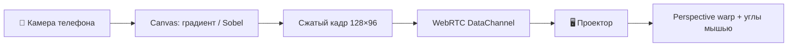

Нужен AR-подобный оверлей на проектор **без Unity и без установки приложения**? **Proof of Concept:** телефон смотрит на объект через камеру, строит **теплокарту градиента яркости** (или бинарные **контуры Sobel**) и в реальном времени передаёт кадр на ноутбук с проектором. На экране — **перспективная подгонка**: четыре угла тянутся мышью, чтобы совместить наложение с физической поверхностью.

Связь — **WebRTC data channel** через [PeerJS](https://peerjs.com/) (сигнализация в облаке, без своего сервера). Подходит для демо в аудитории: QR на экране проектора, телефон сканирует и подключается.

---

## Архитектура

| Компонент | Роль |
|-----------|------|
| Телефон (`?role=phone`) | `getUserMedia`, обработка кадра, ~15 fps |
| Проектор (`?role=projector`) | Приём кадров, отрисовка, drag углов |
| PeerJS | Сигнализация + P2P между браузерами |
| Комната | 6-символьный ID в URL; QR для телефона |

**Почему WebRTC, а не WebSocket:** для PoC на статическом Jekyll-сайте не нужен бэкенд. После рукопожатия кадры идут **напрямую** телефон ↔ проектор. Data channel с `reliable: true` и `serialization: 'binary'` — бинарные `ArrayBuffer` доходят целиком; для live-градиента это важнее, чем экономия на потерянных пакетах.

**Почему не одна страница на обоих:** разные UI — на телефоне превью камеры и кнопка «Старт», на проекторе полноэкранный чёрный холст и ручки углов.

---

## Как запустить

1. На ноутбуке с проектором откройте **[полноэкранное демо](/vairl/camera-projector-poc.html?role=projector)** (или встроенный виджет ниже). Дождитесь «Комната … Отсканируйте QR».
2. На экране появится **QR** и код комнаты.
3. На телефоне отсканируйте QR — откроется `camera-projector-poc.html?role=phone&room=…`.
4. На телефоне — **Старт** (разрешите камеру). По умолчанию режим **«Градиент (теплокарта)»**.
5. На проекторе **тяните углы** синей рамки, пока картинка не ляжет на нужную поверхность.

Кнопка «На весь экран» разворачивает холст проектора, не боковую панель с QR.

Режимы на телефоне:

| Режим | Что видно на проекторе |
|-------|------------------------|
| **Градиент (теплокарта)** — по умолчанию | Цвет = направление ∇I, яркость = \|∇I\| |
| Контуры (Sobel) | Бинарные границы объектов |

---

## Интерактив (режим проектора)

  

    <header class="cps-header">
      
Отсканируйте QR — на телефоне откроется <code>camera-projector-poc.html</code>. Углы сохраняются в <code>localStorage</code> для комнаты.

    </header>
    

      <aside class="cps-sidebar">
        
Комната

        
—

        <canvas class="cps-qr" width="160" height="160" aria-label="QR для телефона"></canvas>
        
Ссылка для телефона

        <a class="cps-join-link" href="#" target="_blank" rel="noopener">—</a>
        

          <button type="button" data-cps-reset-corners>Сброс углов</button>
          <button type="button" data-cps-fullscreen>На весь экран</button>
        

        
Загрузка…

      </aside>
      

        <canvas class="cps-projector-canvas"></canvas>
      

    

  

Полноэкранно (удобно для проектора): [camera-projector-poc.html]({{ '/camera-projector-poc.html' | relative_url }}?role=projector).

---

## Обработка на телефоне

Кадр с камеры масштабируется до **128×96**, переводится в grayscale (средняя яркость пикселей), затем:

- **Градиент (по умолчанию)** — из ∂I/∂x и ∂I/∂y строится цветная теплокарта;
- **Sobel** — magnitude градиента, порог отсекает слабые края → бинарные контуры.

Кадр упаковывается в `ArrayBuffer` (~37 KB для RGB-градиента) и шлётся по data channel ~**15 раз/с**. На проекторе — `ImageData` и **bilinear warp** на четырёх углах (сетка 20×20 аффинных патчей).

---

## Ограничения PoC

- Нужен **HTTPS** (или localhost) для камеры и WebRTC.
- **PeerJS cloud** (`0.peerjs.com`) — внешняя зависимость; при `server-error` проектор не регистрирует комнату. Для продакшена — свой signaling / TURN.
- Задержка 100–300 ms в зависимости от Wi‑Fi; в одной сети P2P часто идёт по локальным адресам.
- Нет калибровки «объект ↔ проекция» — только ручной warp.
- Один телефон на комнату.

---

## Куда развивать

- **ArUco / AprilTag** на проекторе для автоматической гомографии.
- **Обратный канал**: проектор рисует паттерн, телефон оценивает pose.
- **Closed loop**: контуры сравниваются с целевым силуэтом, телефон подсказывает сдвиг.
- Свой signaling-сервер на edge (Cloudflare Workers / WebSocket).

---

## Итог

| Что | Вывод |
|-----|--------|
| Сигнализация | PeerJS cloud только для «знакомства» браузеров; кадры через него не идут |
| Данные | P2P data channel, бинарные кадры 128×96, ~15 fps |
| Калибровка | Ручной perspective warp четырьмя углами мышью |
| Сценарий | Живое демо на проекторе за минуту: QR → камера → overlay |

---

*PoC для статьи VAIRL · WebRTC + Canvas · без установки приложений.*
